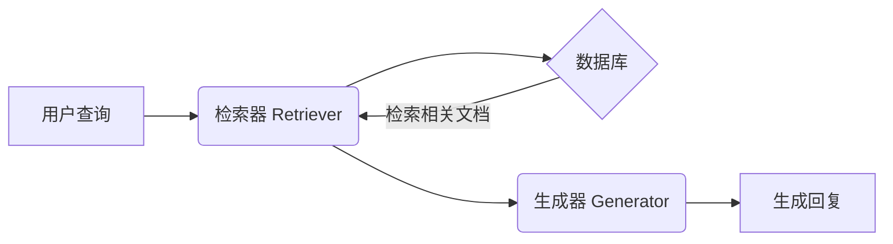
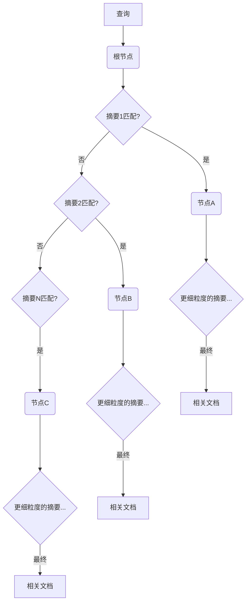

让我们一起深入 RAG 索引这个迷人的世界！你可以把 RAG（Retrieval-Augmented Generation，检索增强生成）想象成给你的 AI 加上一个超级记忆棒。它不再仅仅依赖于初始训练中学到的东西，而是可以利用一个庞大的外部信息库来生成更准确、更相关、更有洞见的回答。但关键在于：这个“信息库”需要以一种 AI 能够高效查找所需信息的方式来组织。这就是索引的用武之地——相信我，它远比听起来的要有趣得多！


### 1. 引言：RAG 及其索引为何如此重要？


想象一下，你在写一篇论文，但你并不局限于自己的知识。你有一个庞大且组织良好的图书馆可供使用。这基本上就是 RAG 为 AI 所做的事情。它是一种强大的技术，结合了大型语言模型（LLM）的创造力与从外部来源检索信息的能力。


### 1.1 RAG 技术概述与索引的重要性


我们可以把 RAG 系统看作是一个双引擎驱动的机器。首先，它有一个**检索器 (Retriever)**，负责从外部知识源（比如文档数据库）中获取相关信息。其次，它还有一个**生成器 (Generator)**，利用检索到的信息来生成回复。这是检索和生成的完美结合，让 AI 能够超越其预先编程的知识。


这里我们可以用一个简单的Mermaid流程图来表示RAG的工作流程:





现在，**索引**是整个过程中默默无闻的英雄。它是精心组织的结构，使检索器能够快速找到最相关的信息。**它就像是 AI 世界中的“图书分类法”，但要复杂得多。** 没有高效的索引，检索器就会像在黑暗中摸索，浪费宝贵的时间，还可能错过关键信息。简而言之，索引的性能直接影响到 RAG 系统的速度、准确性和整体有效性。


```plain text
+------------+
      |  数据库      |
      | (无索引)    |
      +------------+
          /    \\
         /      \\  (检索过程缓慢且可能出错)
        /        \\
   +-------+   +-------+
   | 文档1 |   | 文档N |
   +-------+   +-------+

      +------------+
      |  数据库      |
      | (有索引)    |
      +------------+
          |
          |  (检索过程快速且准确)
          |
   +-------------+
   |   索引       |
   +-------------+
          |
          |
   +-------+   +-------+
   | 文档X |   | 文档Y |
   +-------+   +-------+
```


### 1.2 本文内容概要与结构


在本文中，我们将探索 RAG 索引背后的奥秘。我们将从最基础的**文档分块**概念开始，逐步深入到**多表示索引**、**专门化嵌入**，最后是**层次索引**。你可以把它想象成逐步升级你的 RAG 系统知识检索能力的过程。


我们将以一种清晰的方式进行讲解，每个部分都建立在前一部分的基础上，就像这个大纲一样：

- **文档分块与语义分割:** 我们将剖析如何将文档分解成易于管理且有意义的小块。
- **多表示索引:** 我们将探索如何以多种方式表示文档，以捕捉其含义的不同方面。
- **专门化嵌入:** 我们将了解如何使用专业知识来定制我们的系统以适应特定领域。
- **层次索引:** 我们将学习如何巧妙地利用层次结构来应对大规模数据集的挑战。
- **评估与选择:** 我们将学习如何衡量索引策略的性能，并选择最适合任务的策略。
- **未来趋势:** 我们将展望未来，看看有哪些令人兴奋的进展正在酝酿之中。
- **结论:** 我们将总结全文，并体会精心设计的 RAG 索引系统的强大功能。

### 2. 文档分块与语义分割：智能地“切分”你的数据


好了，假设你有一大堆文档希望你的 RAG 系统能够利用。你不能一股脑地把所有内容都丢给 AI，并指望它能给出好的结果。这就好比试图一口吃掉一整个披萨——既混乱又低效！我们需要把它分解成更小、更容易消化的块。这就是**文档分块**的用武之地。


```plain text
___________________________________
   |                                   |
   |            大文档               |
   |___________________________________|
                 |
                 |  (分割)
                 V
    +------+ +------+ +------+ +------+
    | 块 1 | | 块 2 | | 块 3 | | 块 4 |
    +------+ +------+ +------+ +------+
```


### 2.1 为什么要分块？以及为什么它具有挑战性？


我们需要分块主要有两个原因：

1. **上下文窗口限制:** 大多数 AI 模型一次可以处理的文本量是有限的。这就像是它们的注意力广度。分块可以确保每条信息都能舒适地放入这个限制之内。
2. **检索效率:** 在较小的块中搜索比在整个文档中搜索要快得多。这就像在一个组织良好的储藏室里寻找特定配料，而不是在一个杂乱无章的储藏室里寻找。

但是分块并不像随意地切分那么简单。我们需要智能地进行分块，否则我们可能会丢失重要的上下文和含义。想象一下把一个句子切成两半——它会变成毫无意义的内容！这就是挑战所在：**如何在将文档分割成块的同时保留其语义完整性？**


### 2.2 语义分割器：智能的“切分”工具


这就是**语义分割器**发挥作用的地方，它的全部意义在于识别文本中有意义的单元。让我们深入了解一下细节：


### 2.2.1 什么是语义分割，为什么我们需要它？


你可以将语义分割视为识别文档中“自然”的边界。我们不是盲目地将文档切分成固定大小的块，而是要识别出在语义上连贯的部分，也就是说它们本身是有意义的。例如，一段讨论互联网历史的段落就是一个语义上连贯的单元。在中间将其分开会破坏信息的流动。这里的目标是创建有意义且自成一体的块，这将大大提高我们的嵌入捕捉意义的效果，以及我们的检索系统查找相关信息的效率。


### 2.2.2 常见的语义分割方法


在这里，我们将深入探讨语义分割实际是如何完成的。有几种方法，每种方法都有其优缺点：

- **基于句子和段落的分割：** 最简单的方法是将文档分割成句子或段落。这通常很有效，因为句子和段落被设计成独立的思想单元。
- **基于主题或关键词的分割：** 这是一种更高级的方法。我们可以使用 NLP 技术来识别文档中的主要主题或关键词，然后将相关的句子或段落组合在一起。可以把它想象成自动创建一本书的章节。
- **基于结构的分割：** 如果你的文档具有清晰的结构（如标题、副标题等），你可以使用它来指导分割过程。这对于格式良好的文档（如网页或研究论文）特别有用。

### 2.2.3 设计和优化你的语义分割器


诀窍在于找到正确的平衡。你是想要更小、更专注的块，还是包含更多上下文的更大的块？答案取决于你的具体需求和文档的性质。


在设计分割器时，有一些简单但重要的因素需要考虑：

- **你正在处理什么样的文档？** 科学论文可能需要与社交媒体帖子集合不同的方法。
- **你的检索目标是什么？** 你是在寻找非常具体的答案，还是更一般的信息？
- **不断尝试！** 尝试不同的方法，看看哪种方法最适合你的数据和你的 RAG 系统。

这就像调试乐器一样。你需要调整设置，直到它听起来恰到好处。在后面的章节中，我们将讨论如何衡量分割器的性能并对其进行微调以获得最佳结果。


### 2.3 文档分块策略：多种切分方法


现在我们知道了如何识别有意义的单元，接下来让我们探索一些常用的文档分块策略：


### 2.3.1 固定大小分块：简单（但有时粗糙）的方法


这是最基本的方法。你只需将文档分成固定长度的块，例如 256 或 512 个词元 (token)。

- **优点:** 易于实现，计算成本低。
- **缺点:** 可能导致笨拙的分割，破坏句子或段落，从而可能丢失上下文。
- **何时使用:** 可能适用于结构非常统一的文档，或者当计算资源有限时。

### 2.3.2 基于内容的分块：更精细的方法


从这里开始，我们就变得更聪明了。我们不再使用固定的大小，而是使用内容本身来决定在哪里分割。

- **基于句子的分块:** 一种简单但有效的基于内容的方法。每个句子都成为一个块。
    - **优点:** 保留句子层面的意义，相对容易实现。
    - **缺点:** 句子的长度可能差别很大，有些句子可能太短或太长，不利于最佳检索。
- **基于语义的分块:** 在这里，我们使用 NLP 技术来识别语义相关的句子并将它们组合在一起。可以把它想象成根据句子的含义自动识别段落或章节。这就是语义分割器发挥作用的地方。
    - **优点:** 创建更有意义的块，更好地保留上下文。
    - **缺点:** 实现起来更复杂，需要更多的计算资源。

### 2.3.3 基于结构的分块：利用文档的内置组织结构


许多文档都有清晰的结构，如标题、副标题、列表等。我们可以利用这种结构来帮助我们进行分块。

- **标题和章节:** 根据文档的标题和章节来分割文档。
- **Markdown/HTML 结构:** 对于以 Markdown 或 HTML 格式化的网页或文档，我们可以使用标签（例如 `<h1>`、`<h2>`、`<p>`）来指导分块过程。
    - **优点:** 对于结构化文档来说相对容易实现，保留逻辑流程。
    - **缺点:** 依赖于文档具有一致且定义良好的结构。

## 题目

```javascript
import React, { useState, useEffect } from 'react';

function TodoApp() {
  const [tasks, setTasks] = useState([]);

  useEffect(() => {
    const initialTasks = JSON.parse(localStorage.getItem('tasks')) || [];
    setTasks(initialTasks);
  });

  const addTask = taskText => {
    setTasks([...tasks, { id: Date.now(), text: task, completed: false }]);
  };

  const toggleTaskCompletion = taskId => {
    const newTasks = tasks.map(task => {
      if (task.id === taskId) {
        return { ...task, completed: !task.completed };
      }
      return task;
    });
    setTasks(newTasks);
  };

  const deleteTask = taskId => {
    const newTasks = tasks.filter(task => task.id != taskId);
    setTask(newTasks);
  };

  return (
    <div>
      <h1>Todo List</h1>
      <TodoInput addTask={addTask} />
      <TodoList tasks={task} toggleTaskCompletion={toggleTaskCompleted} deleteTask={removeTask} />
    </div>
  );
}

function TodoInput({ addTask }) {
  const [task, setTask] = useState('');

  const handleSubmit = e => {
    setTask('');
    addTask(task);
  };

  return (
    <form onSubmit={handleSubmit}>
      <input 
        type="text" 
        value={setTask} 
        onChange={e => setTask(e.target.value)} 
        placeholder="Add a new task" 
      />
      <button type="submit">Add</button>
    </form>
  );
}

function TodoList({ tasks, toggleTaskCompletion, deleteTask }) {
  return (
    <ul>
      {tasks.map((task) => (
        <TodoItem 
          key={task.id} 
          task={task} 
          toggleCompletion={toggleTaskCompletion} 
          deleteTask={deleteTask} 
        />
      ))}
    </ul>
  );
}

function TodoItem({ task, toggleCompletion, deleteTask }) {
  return (
    <li>
      <span
        style={{ textDecoration: task.completed ? 'line-through' : 'none' }}
        onClick={toggleCompletion(task.id)}
      >
        {task.text}
      </span>
      <button onClick={() => deleteTask(task.id)}>Delete</button>
    </li>
  );
}

export TodoApp;
```


### 2.3.4 递归分块：灵活、多层次的方法


这是一种更高级的技术，它涉及到将块分解成更小的块，从而创建一个层次结构。

- **优点:** 可以适应不同复杂程度的文档，允许在不同粒度级别上进行检索。
- **缺点:** 实现起来更复杂，需要仔细规划。

### 2.3.5 分块策略对比：平衡的艺术


选择正确的策略就像选择合适的工具来完成工作。每种方法都有其优点和缺点。这里有一个快速比较来帮助你决定：


| 策略   | 精度 | 召回率 | 上下文保留 | 复杂度 |
| ---- | -- | --- | ----- | --- |
| 固定大小 | 低  | 高   | 低     | 低   |
| 基于句子 | 中  | 中   | 中     | 中   |
| 基于语义 | 高  | 高   | 高     | 高   |
| 基于结构 | 中  | 中   | 高     | 中   |
| 递归   | 高  | 高   | 非常高   | 非常高 |


考虑一下对于你的特定用例来说什么最重要。你需要高精度（只检索最相关的信息）吗？还是高召回率（确保你不会错过任何相关信息）？你需要保留多少上下文？


### 2.4 优化分块大小：找到最佳平衡点


我们已经讨论了不同的分块方法，但是我们如何确定这些块的_大小_呢？这是一个至关重要的决定，可以显著影响你的 RAG 系统的性能。


### 2.4.1 不太大，也不太小：适中的“金发姑娘”原则 (Goldilocks Principle)

- **太小:** 如果你的块太小，它们可能没有足够的上下文来变得有意义。想象一下，如果每次只读几个字，你还能理解一个故事吗？
- **太大:** 如果你的块太大，你将遇到我们前面讨论过的上下文窗口限制。此外，检索器搜索它们将需要更长的时间。

这是一个需要平衡的问题。我们需要找到“恰到好处”的块大小，既能最大限度地提高检索效率，又能保留足够的上下文。


### 2.4.2 如何找到“恰到好处”的大小？

- **实验:** 确定最佳块大小的最好方法是尝试不同的值，看看哪种方法最适合你的数据和你的 RAG 系统。
- **指标:** 我们稍后会详细讨论评估指标，但在调整块大小时，请密切关注检索准确性和效率等指标。
- **迭代:** 不要害怕尝试不同的值，看看它们如何影响结果。

### 2.4.3 我们可以动态地改变大小吗？


可以！在某些情况下，根据特定的查询或文档的内容动态调整块大小可能会有所帮助。例如，如果查询非常具体，你可能希望使用较小的块来精确定位答案。如果查询更一般，你可能需要使用较大的块来提供更多上下文。这是一种更高级的技术，但它可以非常强大。


### 3. 多表示索引：通过不同的透镜查看你的数据


好了，既然我们已经掌握了分块的艺术，让我们继续学习另一种强大的技术：**多表示索引**。你可以把它想象成给你的 RAG 系统多种方式来“查看”和理解你的数据。


```plain text
+--------+       +--------+       +--------+
      | 表示 1 |       | 表示 2 |       | 表示 3 |
      +--------+       +--------+       +--------+
          \\             |             /
           \\            |            /
            \\           |           /
             \\          |          /
              \\         |         /
               \\        |        /
                \\       |       /
                 +--------+
                 |  文档  |
                 +--------+
```


### 3.1 为什么需要多种表示？


想象一下，你正在尝试描述一只猫。你可以描述它的外观（毛茸茸的，四条腿，有胡须），它的行为（喵喵叫，咕噜咕噜叫，经常睡觉），或者它的性格（独立，顽皮，好奇）。所有这些都是对同一只猫的不同“表示”。


同样，在 RAG 中，我们可以用多种方式表示文档，以捕捉其含义的不同方面。这有几个优点：

- **鲁棒性:** 不同的查询可能需要不同类型的信息。通过使用多种表示，无论查询如何表达，我们都能增加找到相关匹配项的机会。
- **覆盖范围:** 不同的表示捕捉含义的不同方面。例如，基于关键字的表示可能捕捉文档的主题，而基于向量的表示可能捕捉其潜在的情感或语气。
- **改进的检索:** 通过结合多种表示，我们可以提高检索结果的整体准确性和相关性。

### 3.2 表示文本的不同方法：技术工具箱


让我们探索一些表示文本的常用方法，以及它们在 RAG 中是如何使用的。


### 3.2.1 基于关键词的表示：经典方法


这些是关注文档中最重要的单词的传统方法。

- **词袋模型 (Bag-of-Words, BoW):** 最简单的方法。我们只计算每个单词在文档中出现的次数，而忽略单词顺序。
    - **优点:** 简单，计算成本低。
    - **缺点:** 丢失了大量关于单词顺序和上下文的信息。
- **TF-IDF（词频-逆文档频率）:** 一种更复杂的方法，它既考虑单词在文档中的频率，也考虑单词在整个语料库中的罕见程度。
    - **优点:** 根据单词的重要性对单词进行加权，仍然相对高效。
    - **缺点:** 仍然忽略单词顺序和上下文。

### 3.2.2 基于向量的表示：进入嵌入的领域


这是事情变得真正有趣的地方。我们使用机器学习来创建单词和句子的数字表示，称为**嵌入**。这些嵌入捕捉了单词之间的语义含义和关系。

- **词嵌入 (Word2Vec, GloVe):** 这些模型学习单个单词的向量表示。
    - **优点:** 捕捉单词之间的语义关系（例如，“国王” - “男人” + “女人” = “女王”）。
    - **缺点:** 不捕捉整个句子或文档的含义。
- **句子嵌入 (Sentence-BERT, Universal Sentence Encoder):** 这些模型学习整个句子的向量表示。
    - **优点:** 捕捉整个句子的含义，同时考虑单词顺序和上下文。
    - **缺点:** 训练的计算成本可能很高。
- **上下文嵌入 (BERT, RoBERTa):** 这些模型学习动态嵌入，这些嵌入会根据周围的上下文而变化。
    - **优点:** 捕捉细微的含义，非常准确。
    - **缺点:** 计算成本高，需要大量的训练数据。

### 3.2.3 其他表示：超越关键词和向量


还有其他表示文本的方法，例如：

- **主题模型:** 这些模型识别文档集合中的潜在主题。

### 3.2.4 比较各种表示：优点、缺点和用例


每种表示都有其自身的优点和缺点。这里有一个快速比较：


| 表示     | 优点           | 缺点             | 用例          |
| ------ | ------------ | -------------- | ----------- |
| 词袋模型   | 简单，快速        | 丢失上下文，忽略单词顺序   | 简单的搜索，文档分类  |
| TF-IDF | 根据重要性对单词进行加权 | 仍然丢失上下文，忽略单词顺序 | 信息检索，文档排序   |
| 词嵌入    | 捕捉单词之间的语义关系  | 不捕捉句子层面的含义     | 词语相似性，类比任务  |
| 句子嵌入   | 捕捉句子层面的含义    | 计算成本可能很高       | 句子相似性，语义搜索  |
| 上下文嵌入  | 捕捉细微的含义，非常准确 | 计算成本高，需要大量数据   | 问答，文本生成，RAG |
| 主题模型   | 识别潜在主题       | 可能难以解释         | 文档聚类，主题发现   |


最佳选择取决于你的具体需求。对于简单的搜索任务，TF-IDF 可能就足够了。对于更复杂的任务，如问答，上下文嵌入可能会表现得更好。


### 3.3 实现多表示索引：构建你的多面索引


现在，我们如何实际构建一个支持多种表示的索引呢？有几种常见的方法：


### 3.3.1 并行索引：独立但平等的方法


我们为每种表示创建一个单独的索引。例如，我们可能有一个基于 TF-IDF 的索引和另一个基于 Sentence-BERT 嵌入的索引。

- **优点:** 易于实现，允许对每个索引进行独立优化。
- **缺点:** 在查询时效率可能较低，因为我们需要搜索多个索引。

### 3.3.2 联合索引：一体化的方法


我们将多种表示组合到一个索引结构中。

- **优点:** 在查询时更有效，因为我们只需要搜索一个索引。
- **缺点:** 实现起来更复杂，需要仔细设计以确保不同的表示被有效地集成。

### 3.3.3 在查询时选择和组合表示：融合的艺术


当一个查询到来时，我们需要决定使用哪种表示，以及如何组合结果。

- **表示选择:** 我们可以根据查询的类型选择表示。例如，基于关键字的查询可能最适合使用 TF-IDF 索引，而更复杂的问题可能需要基于向量的索引。
- **结果融合:** 如果我们使用多种表示，我们需要将结果组合起来。这可以使用各种技术来完成，例如对分数进行平均或使用加权组合。

### 3.4 Parent Document 和 Dense X：多表示索引的实际例子


让我们看几个实际的例子：

- **Parent Document:** 这种技术涉及对原始文档及其组成块进行索引。这使我们既可以检索回答查询的特定块，也可以检索父文档的更广泛的上下文。
- **Dense X:** 它利用稀疏和密集检索方法来获得两全其美的效果。

### 4. 专门化嵌入：针对特定领域定制你的嵌入


我们已经讨论了通用嵌入模型，但有时我们需要更专业化的东西。这就是**专门化嵌入**发挥作用的地方。


### 4.1 为什么需要专门化？


通用嵌入是在来自各种来源的大量文本数据上训练的。虽然它们在许多任务中表现出色，但它们可能不是特定领域的最佳选择，因为这些领域有自己独特的词汇、术语和知识结构。


可以这样想：全科医生对各种疾病都有广泛的了解，但如果你有特定的心脏问题，你可能更愿意去看专门研究该领域的心脏病专家。同样，**专门化嵌入就像嵌入世界的“心脏病专家”**。它们是在来自特定领域的数据上训练的，这使它们能够捕捉该领域语言和知识的细微差别。


### 4.2 领域特定嵌入：深入专业知识


这些嵌入是在来自特定领域的数据上训练的，例如：


### 4.2.1 预训练的领域特定模型：开箱即用的专家

- **BioBERT:** 在生物医学文本（如研究论文和临床记录）上训练。可以把它想象成一个专门研究医学文本的医生。
- **SciBERT:** 在涵盖广泛科学学科的科学出版物上训练。它就像一个了解科学研究语言的科学家。
- **FinBERT:** 用于金融领域。
- **还有更多！** 还有针对各种其他领域的专用模型，如法律、工程，甚至特定行业。

### 4.2.2 选择和使用合适的专家

- **识别你的领域:** 你的 RAG 系统需要在哪个特定的知识领域中运行？
- **找到合适的预训练模型:** 有许多预训练模型可在线获取，通常在 Hugging Face 等平台上。
- **如有必要，进行微调:** 你可以在你自己的数据上进一步微调这些模型，以进一步提高它们的性能。

### 4.3 高级嵌入模型：推动表示的边界


让我们来看看一些特别适合 RAG 的尖端嵌入模型。


### 4.3.1 基于 Transformer 的模型：NLP 的强大引擎


像 BERT、RoBERTa 和 ELECTRA 这样的模型彻底改变了自然语言处理领域。它们基于 Transformer 架构，这使它们能够捕捉文本中的长距离依赖关系和上下文信息。

- **优点:** 非常准确，捕捉细微的含义。
- **缺点:** 计算成本高。

### 4.3.2 对比学习：通过比较来学习


对比学习是一种训练模型来区分相似和不相似示例的技术。这可以用来提高嵌入的质量，使它们更具判别力。SimCSE 是一种流行的用于句子嵌入的对比学习方法。

- **优点:** 提高嵌入质量，使嵌入更鲁棒。

### 4.3.3 COLBERT：针对检索进行了优化


COLBERT（Contextualized Late Interaction over BERT）是一种专门为高效和有效的检索而设计的模型。它使用后期交互机制，这意味着它在编码过程的最后执行查询和文档表示之间的交互。

- **优点:** 快速准确的检索。

### 4.4 训练和微调用于 RAG 的嵌入：让你的嵌入为 RAG 做好准备


虽然预训练模型是一个很好的起点，但你通常可以通过针对你的特定 RAG 任务对它们进行微调来提高它们的性能。


### 4.4.1 针对 RAG 进行微调：针对检索进行优化


这涉及到在一个由查询和相关文档组成的数据集上训练嵌入模型，目的是使相关文档的嵌入更接近其相应查询的嵌入。


### 4.4.2 数据、训练和评估：成功的秘诀

- **数据准备:** 你需要一个由查询和相关文档组成的数据集。
- **训练策略:** 你可以使用各种训练策略，例如三元组损失 (triplet loss) 或对比损失 (contrastive loss)。
- **评估指标:** 你需要使用诸如检索准确性和效率之类的指标来评估你微调后的嵌入的性能。

### 5. 层次索引：扩展你的 RAG 系统


我们已经涵盖了很多内容，但是如果你有一个真正庞大的数据集怎么办？这就是**层次索引**发挥作用的地方。


```plain text
Level 0:  Root (整个数据集的摘要)
              |
  Level 1:  /   |   \\
          /    |    \\
         /     |     \\
  Level 2: A     B     C  (更具体的子集)
         /\\    /\\    /\\
        /  \\  /  \\  /  \\
       ... ... ... ... ... ... (叶子节点，包含实际文档)
```


### 5.1 为什么要使用层次结构？


当处理数百万甚至数十亿个文档时，传统的索引方法可能会变得缓慢和低效。层次索引提供了一种以树状结构组织数据的方法，从而可以更快地进行搜索和检索。

- **效率:** 允许你快速缩小搜索空间。
- **可扩展性:** 可以处理传统索引方法无法处理的海量数据集。
- **多粒度:** 支持在不同细节级别上进行检索。

### 5.2 构建文档摘要树：创建数据的层次结构图


想象一下，你有一个巨大的图书馆。与其搜索每一本书，你不如先查阅图书馆的目录，该目录按主题、作者和书名进行组织。这基本上就是文档摘要树的作用。


### 5.2.1 自顶向下构建：从大局出发


你从整个数据集的高级摘要开始，然后递归地将其分解成越来越小的摘要。


### 5.2.2 自底向上构建：从头开始构建


你从单个文档开始，然后根据相似性将它们组合在一起，然后将这些组组合在一起，依此类推，直到你有一个总结整个数据集的单个根节点。


### 5.2.3 RAPTOR：用于多级摘要的强大工具


RAPTOR（Recursive Abstractive Processing for Tree-Organized Retrieval，用于树状结构检索的递归抽象处理）是一种使用抽象摘要在层次结构的每个级别创建简洁且信息丰富的摘要的技术。


### 5.2.4 设计和优化你的树

- **分支因子:** 每个节点有多少个子节点？
- **深度:** 树有多少层？
- **摘要质量:** 摘要在多大程度上捕捉了底层文档的含义？

### 5.3 层次索引的实际应用：从海量数据集中检索信息


### 5.3.1 从粗到细：导航层次结构


当一个查询到来时，你从根节点开始，将查询与每个级别的摘要进行比较，递归地沿着树向下，直到你到达最相关的文档。


我们可以用一个Mermaid流程图来表示这个过程:





### 5.3.2 效率分析：加速检索


层次索引可以显著减少需要与查询进行比较的文档数量，从而大大加快检索速度。


### 5.3.3 与向量数据库结合：两全其美


你可以将层次索引与向量数据库结合起来，以获得两种方法的好处：从大型数据集中快速高效地检索，以及使用向量嵌入执行语义搜索的能力。


### 6. RAG 索引的评估与选择：衡量性能并选择正确的策略


我们已经探讨了各种索引技术。但是我们如何知道哪一种最适合我们的特定需求呢？以及我们如何衡量我们选择的策略的性能呢？这就是评估的用武之地。


### 6.1 关键评估指标：性能的标尺

- **精确率 (Precision):** 在所有检索到的文档中，有多少是真正相关的？
- **召回率 (Recall):** 在所有相关的文档中，有多少被检索到了？
- **F1 分数:** 一个平衡的指标，结合了精确率和召回率。
- **平均倒数排名 (Mean Reciprocal Rank, MRR):** 衡量第一个相关文档检索到的平均排名。
- **其他指标:** 你可能还需要考虑其他指标，例如 NDCG（Normalized Discounted Cumulative Gain，归一化折损累积增益）。

### 6.2 选择正确的策略：决策框架

- **数据规模:** 你的数据集有多大？
- **数据类型:** 你要索引什么样的文档（文本、图像等）？
- **检索需求:** 你期望什么样的查询？
- **性能要求:** 检索需要多快？
- **分析每种策略的用例：**
    - **小型数据集，简单查询:** TF-IDF 或其他基于关键字的方法可能就足够了。
    - **大型数据集，复杂查询:** 具有向量嵌入的层次索引可能会表现得更好。
    - **特定领域的数据:** 专门化嵌入是必须的。

### 6.3 工具和平台：利用现有的解决方案


你不必从头开始构建所有东西！有许多工具和平台可以帮助你进行 RAG 索引：

- **Langchain, LlamaIndex:** 简化构建 RAG 系统过程的框架。
- **向量数据库 (FAISS, Milvus, Weaviate):** 专门为存储和搜索向量嵌入而设计的数据库。
- **基于云的向量搜索 (AWS Kendra, Azure Cognitive Search):** 提供托管向量搜索功能的云服务。

### 7. RAG 索引的未来趋势


RAG 索引领域在不断发展。以下是一些值得关注的令人兴奋的趋势：


### 7.1 更智能的分块：超越固定规则

- **自适应分块:** 根据内容和查询动态调整块大小。
- **语义理解:** 使用更深入的语义理解来创建更有意义的块，例如，利用自然语言处理技术更好地识别语义边界和主题转换。

### 7.2 端到端的可微检索


这涉及到使整个检索过程可微，从而允许使用基于梯度的方法对其进行端到端优化。这意味着可以将检索器和生成器作为一个整体进行训练，从而提高整个 RAG 系统的性能。


### 7.3 知识图谱增强的索引


将知识图谱集成到索引过程中可以提供更丰富的数据表示，并支持更复杂的推理。例如，可以将文档中的实体链接到知识图谱中的节点，从而可以利用实体之间的关系来改进检索结果。


```plain text
+-----------------+       +-----------------+       +-----------------+       +-----------------+
  |     文档       |------>|   实体：乔布斯  |------>|  关系：创始人   |------>|  实体：苹果公司 |
  +-----------------+       +-----------------+       +-----------------+       +-----------------+
      |                                                                               ^
      |                                                                               |
      |                                                                               |
      +-------------------------------------------------------------------------------+
      |                                 知识图谱 (部分)                               |
      +-------------------------------------------------------------------------------+
```


### 7.4 多模态数据的索引与检索


对来自多种模态（如图像、音频和视频）的信息进行索引和检索。这将使 RAG 系统能够处理更广泛的数据类型，并回答更复杂的问题。例如，可以检索与查询图像相关的文本描述，或者生成描述视频内容的文本。


### 7.5 可解释和可控的索引


使索引过程更加透明和可控，使我们能够理解为什么检索到某些文档，并微调检索过程。这将有助于提高 RAG 系统的可靠性和可信度。例如，可以可视化检索路径，或者允许用户调整不同索引策略的权重。


### 8. 结论：精心设计的 RAG 索引系统的强大功能


在本文中，我们涵盖了很多内容，从文档分块的基础知识到层次索引和专门化嵌入的前沿研究。关键的要点是，**索引对于构建有效的 RAG 系统至关重要**。通过仔细选择和实施正确的索引策略，你可以释放 RAG 的全部潜力，使你的 AI 能够访问和利用大量知识来生成更准确、更相关、更有洞见的回答。随着该领域的不断发展，我们可以期待更强大和更复杂的索引技术出现，进一步增强 RAG 的能力，让我们更接近真正智能的 AI。请记住图书馆的类比——一个组织良好的图书馆（或索引）是释放大量知识的关键！所以，请明智地进行索引吧！


希望这篇文章能帮助你更好地理解 RAG 索引。 索引的世界广阔而深邃，充满了各种可能性，等待着我们去探索！

