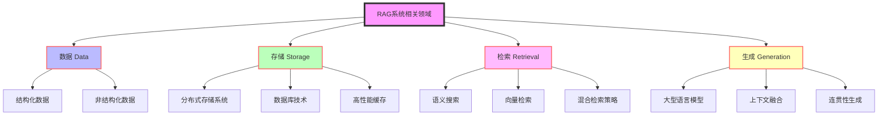
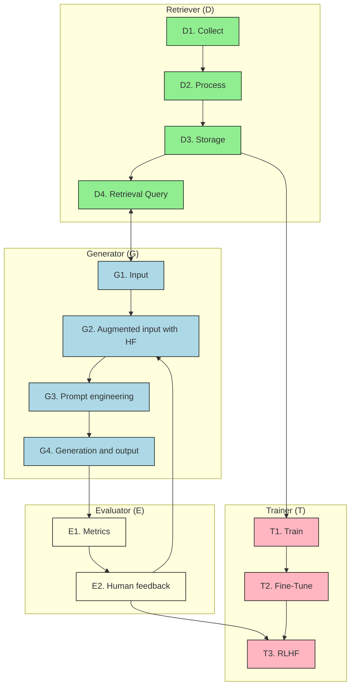

## 1. RAG的定义与原理

检索增强生成（Retrieval-Augmented Generation，RAG）是一种革命性的AI框架，它巧妙地融合了信息检索技术和文本生成能力。RAG系统的核心思想是在生成响应之前，先从外部知识库中检索相关信息，然后将这些信息与语言模型的固有知识相结合，从而产生更加准确、相关和信息丰富的输出。

### RAG的工作原理

1. **查询分析**：系统首先分析用户的输入查询。
2. **信息检索**：基于查询，从外部知识库中检索相关信息。
3. **上下文增强**：将检索到的信息与原始查询结合，形成增强的上下文。
4. **生成响应**：利用增强的上下文，通过语言模型生成最终响应。

这种方法使RAG系统能够实时访问和利用最新信息，大大提高了AI系统的灵活性和准确性。

## 2. RAG与微调的区别与权衡

理解RAG和微调之间的区别对于选择合适的AI系统至关重要。两者各有优势，适用于不同的场景。

### 主要区别

| 特性   | RAG       | 微调            |
| ---- | --------- | ------------- |
| 知识获取 | 实时从外部源检索  | 通过训练整合到模型参数中  |
| 模型更新 | 无需修改模型参数  | 需要重新训练模型      |
| 灵活性  | 高，可适应新领域  | 相对固定，针对特定任务优化 |
| 计算需求 | 检索时需要额外计算 | 推理时计算需求较低     |

### 权衡考虑

1. **数据实时性**
    - RAG优势：能够访问最新信息，适合处理动态变化的知识领域。
    - 微调优势：对于相对稳定的领域知识，提供更快的响应速度。
2. **资源需求**
    - RAG：需要维护大型知识库和高效的检索系统。
    - 微调：需要大量计算资源进行模型训练。
3. **适应性与泛化能力**
    - RAG：更容易适应新领域，无需重新训练。
    - 微调：在特定领域表现优秀，但跨域能力有限。
4. **准确性与一致性**
    - RAG：可能因检索结果变化而导致输出不一致。
    - 微调：在特定任务上表现稳定一致。

选择RAG还是微调取决于具体应用场景、资源限制和性能需求。在需要高度灵活性和最新信息的场景中，RAG通常是更好的选择；而对于需要高度专业化和稳定性的任务，微调可能更为合适。

## 3. RAG相关领域

RAG系统的成功依赖于多个相关技术领域的协同作用。以下是与RAG密切相关的四个核心领域：

1. **数据（Data）**
    - 高质量、多样化的数据源是RAG系统的基石。
    - 包括结构化数据（如数据库）和非结构化数据（如文本文档、网页）。
    - 数据的及时更新和准确性直接影响RAG系统的输出质量。
2. **存储（Storage）**
    - 高效的数据存储和索引机制确保快速检索。
    - 涉及分布式存储系统、数据库技术和高性能缓存。
    - 需要平衡存储容量、访问速度和成本效益。
3. **检索（Retrieval）**
    - 智能的检索算法是RAG系统的核心。
    - 包括语义搜索、向量检索和混合检索策略。
    - 目标是快速、准确地找到与查询最相关的信息。
4. **生成（Generation）**
    - 利用先进的自然语言处理模型生成响应。
    - 结合检索到的信息和模型的固有知识。
    - 需要考虑生成内容的连贯性、相关性和创新性。

这四个领域的进展和创新直接推动了RAG系统的发展。例如，在检索领域，近年来向量数据库和语义搜索技术的进步大大提高了检索的准确性和效率。同时，生成模型的不断演进，如GPT系列的发展，也为RAG系统提供了更强大的文本生成能力。

## 4. RAG系统的核心组成

RAG系统由四个主要组件构成，每个组件都扮演着关键角色：

1. **检索器（Retriever）**
    - 功能：负责数据的收集、处理、存储和检索。
    - 工作流程：
    a. 接收查询
    b. 在知识库中搜索相关信息
    c. 返回最相关的结果
    - 关键技术：向量检索、语义匹配、相关性排序
2. **生成器（Generator）**
    - 功能：处理输入，结合检索信息进行增强，并生成最终输出。
    - 工作流程：
    a. 接收原始查询和检索结果
    b. 融合信息，构建上下文
    c. 生成响应
    - 核心技术：大型语言模型（如GPT、BERT等）
3. **评估器（Evaluator）**
    - 功能：评估生成内容的质量，收集反馈。
    - 工作内容：
    a. 对生成的响应进行质量评估
    b. 收集用户反馈
    c. 提供改进建议
    - 评估指标：相关性、准确性、流畅性、创新性
4. **训练器（Trainer）**
    - 功能：负责模型的训练和优化。
    - 工作内容：
    a. 基于评估结果和反馈进行模型调整
    b. 实现持续学习和改进
    c. 优化检索策略和生成算法
    - 关键技术：迁移学习、强化学习、自监督学习

这四个组件紧密协作，形成一个闭环系统。检索器提供知识基础，生成器利用这些知识创造输出，评估器对输出进行评价，而训练器则根据评估结果不断优化整个系统的性能。这种结构使RAG系统能够不断学习和适应，提高其对各种查询的处理能力。

## 5. RAG的架构类型

RAG系统的架构可以根据复杂度和应用场景分为三种主要类型：

1. **简单（Naive）架构**
    - 特点：
        - 基于关键词的检索
        - 适用于处理结构化或半结构化数据
        - 检索和生成过程相对独立
    - 优势：
        - 实现简单，易于部署
        - 对于明确定义的领域效果良好
    - 局限性：
        - 难以处理复杂或模糊的查询
        - 检索精度可能不高
2. **高级（Advanced）架构**
    - 特点：
        - 使用向量搜索和语义索引
        - 能处理多种类型的数据，包括非结构化数据
        - 检索和生成过程更紧密集成
    - 优势：
        - 提高检索准确性和相关性
        - 能处理更复杂的查询和场景
    - 技术要点：
        - 使用嵌入模型将查询和文档转换为向量
        - 应用相似度计算进行匹配
3. **模块化（Modular）架构**
    - 特点：
        - 结合多种RAG技术和机器学习方法
        - 高度可定制，适应复杂任务
        - 包含多个专门化模块
    - 优势：
        - 最大的灵活性和适应性
        - 能处理跨领域、多模态的复杂任务
    - 组成模块可能包括：
        - 查询分解器
        - 多源检索器
        - 上下文融合器
        - 专家系统集成

