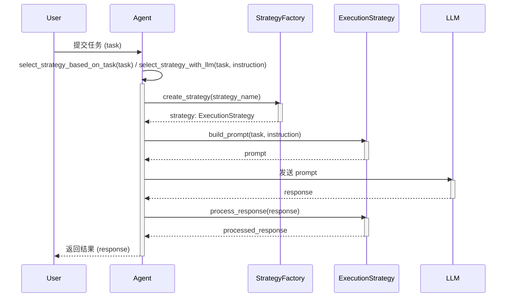

## **引言:**


如果我们将 AI Agent 比作一辆汽车，那么大语言模型 (LLM) 就是它的引擎，提供了驱动力；各种工具是它的轮子，使其能够与外部世界交互；而**推理引擎，则是这辆车的方向盘和导航系统，指引着 Agent 朝着目标前进。**  没有推理引擎，Agent 只能漫无目的地行驶，无法有效地解决复杂问题。推理引擎赋予了 Agent 思考、规划和决策的能力，使其能够像人类一样，根据目标、环境和自身状态，动态调整自身的行为。在本章中，我们将深入探讨 Agent 的推理引擎，介绍如何利用基于策略的推理方法来提升 Agent 的智能水平，并通过实际案例展示不同推理策略的应用和效果。


```javascript
+-----------------+     +----------+     +-----------------+
 |      LLM        |-----|  Tools   |-----|   Reasoning     |
 |    (Engine)     |     | (Wheels) |     |    Engine       |
 +--------+--------+     +----+-----+     | (Steering & GPS)|
          ^                  |             +--------+--------+
          |                  v                      |
          |          +-----------------+             |
          |          |    AI Agent     |             |
          |          +-----------------+             |
          |                  ^                      |
          |                  |                      |
          |                  v                      |
          |          +-----------------+             |
          +----------|   Environment   |-------------+
                     +-----------------+

                 (图 16. AI Agent 核心组件类比)
```


### **推理引擎与其他组件的关系:**


推理引擎并非孤立的存在,  它与 Agent 的其他核心组件紧密协作,  共同构成了 Agent 的智能行为。**规划 (Planning)** 模块可以利用推理引擎来制定和评估计划;  **记忆 (Memory)** 模块为推理引擎提供必要的知识和上下文信息;  **工具 (Tools)** 的使用可以增强推理引擎的能力,  使其能够获取外部信息或执行外部操作。可以说,  推理引擎是 Agent 的“大脑”,  负责协调和调度其他组件,  驱动 Agent 完成任务。


```plain text
+-----------+       +-----------+       +-----------+
    | Perception|------>| Reasoning |------>|  Action   |
    |  Module   |       |  Engine   |       |  Module   |
    +-----------+       +-----+-----+       +-----------+
         ^                  |                  |
         |      Feedback    |                  v
         |                  |  +------------+  |
         |                  +--|  Memory &  |    <-+ Tool Selection & Execution
         |                     | Knowledge  |        
         |                     +------------+
         |                  ^                  |
         +------------------+------------------+
             Environment Interaction

                     (图 27. 推理引擎与其他组件的交互)

    +-------------------------------------------------------+
    |                                                       |
    |  +-----------+          +-------------+               |
    |  | Perception|--------->|  Reasoning  |               |
    |  +-----------+          |   Engine    |               |
    |      ^                  +-----+-------+               |
    |      |                        |                       |
    |      |                        v                       |
    |      |                +-------------+                 |
    |      |                |   Action    |                 |
    |      +----------------|   Module    |                 |
    |                       +-------------+                 |
    |      ^                  |  Feedback                   |
    |      |                  v                             |
    |      |          +-------------+                       |
    |      +----------|   Memory    |                       |
    |                 | & Knowledge |                       |
    |                 +-------------+                       |
    +-------------------------------------------------------+

                 (图 28. AI Agent 的“思考之轮”)
```


## **3.1 推理能力的重要性 (The Importance of Reasoning Capabilities)**


### **3.1.1 从简单响应到复杂问题解决 (From Simple Responses to Complex Problem Solving)**


在 AI Agent 的发展历程中，一个显著的进步就是它们越来越能够处理需要复杂推理的任务。早期的 Agent，例如基于规则的聊天机器人，只能根据预先定义的规则进行简单的响应。它们缺乏真正的理解和推理能力，无法处理开放式的问题或需要多步推理的任务。例如, 一个基于规则的聊天机器人可以根据用户输入中的关键词,  匹配预先定义的回复,  例如 "你好", "今天天气怎么样" 等。但是,  当用户提出一个稍微复杂一些的问题,  例如 "我应该如何为我的孩子选择一个合适的大学专业?",  这个聊天机器人就无能为力了。


而现代的, 基于大语言模型的 AI Agent 则展现出了更强的推理能力。它们不仅能够理解自然语言的复杂语义，还能根据上下文进行推断，甚至进行一定程度的逻辑推理和规划。这种推理能力使得 AI Agent 能够处理更复杂、更开放的任务，例如：

- **复杂问答:** Agent 可以根据用户的问题，结合自身的知识库或检索到的信息，进行推理和分析，最终生成一个完整、准确的答案。例如, 用户询问 "人工智能的未来发展趋势是什么?", Agent 可以结合最新的研究论文和行业报告, 推断出人工智能的未来发展趋势, 例如 "AI Agent 将会更加普及", "多模态 AI 将会成为主流" 等。
- **任务规划:** Agent 可以将一个复杂的任务分解成多个子任务，并制定完成任务的计划。例如，用户要求 Agent “帮我安排一次去北京的旅行”，Agent 可以将这个任务分解成“查询机票”、“预订酒店”、“制定行程”等多个子任务，并根据用户的偏好和预算，制定一个合理的旅行计划。
- **策略决策:** Agent 可以根据当前的状态和目标，选择最佳的行动策略。例如, 一个股票交易 Agent 可以根据当前的股票市场行情, 结合自身的投资策略, 决定买入、卖出或持有某只股票。
- **代码生成:** Agent 能够根据自然语言描述生成代码, 这也需要 Agent 具备一定的推理能力, 例如理解代码的需求, 选择合适的算法和数据结构, 生成符合语法规则的代码等。例如, 用户要求 Agent "写一个 Python 函数, 实现快速排序算法", Agent 需要理解快速排序算法的原理, 并将其转换成 Python 代码。

可以说，**推理能力是区分简单 Agent 和复杂 Agent 的关键。** 简单的 Agent 只能根据预定义的规则进行响应，而复杂的 Agent 则可以根据具体情况进行推理和决策，展现出更高级别的智能。推理能力也使得 Agent 能够更好地适应环境的变化,  处理各种不确定的情况。


### **3.1.2 AI Agent 的 “思考” 之轮**


如果我们将 AI Agent 比作一个有机体，那么推理引擎就是它的“大脑”中负责“思考”的那一部分。**推理引擎是 AI Agent 的核心组件之一，它驱动着 Agent 的决策和行动，是 Agent 智能的源泉。**


推理引擎与其他组件紧密协作，构成了一个完整的“思考”循环：

1. **感知 (Perception):** Agent 通过各种传感器 (例如文本输入接口、图像识别模块等) 获取外部环境的信息, 类似于 “感觉器官”。
2. **记忆 (Memory):** 将感知到的信息以及 Agent 自身的历史状态、知识等存储在记忆模块中, 类似于 “存储器”。
3. **推理 (Reasoning):** 推理引擎根据当前的目标、感知到的信息、以及记忆中的知识, 进行逻辑推理、分析和判断, 并选择下一步的行动方案, 这是 Agent 的 “思考中枢”。
4. **规划 (Planning):** 对于复杂任务, 推理引擎会制定行动计划, 将任务分解成多个步骤, 并安排执行顺序。
5. **行动 (Action):** Agent 通过执行器 (Actuator) 执行具体的行动, 例如调用工具 (Tool)、生成文本、控制机器人等, 对外部环境产生影响。
6. **反馈 (Feedback):** Agent 通过感知模块获取行动后的环境反馈, 或者调用评估模块 (Evaluator) 来评估行动的效果, 并将反馈信息存储到记忆中, 用于调整和优化推理引擎, 或者更新自身的知识库。

这个循环不断地进行，使 Agent 能够持续地与环境交互，并不断地学习和改进。


```plain text
+-----------+       +-----------+       +-----------+
    | Perception|------>| Reasoning |------>|  Action   |
    |  Module   |       |  Engine   |       |  Module   |
    +-----------+       +-----+-----+       +-----------+
         ^                  |                  |
         |                  |                  v
         |                  |  +------------+  |
         |                  +--|  Memory &   |<-+
         |                     | Knowledge  |
         |                     +------------+
         |                  ^                  |
         |                  | Tool Selection   |
         |                  |   & Execution    |
         |                  v                  |
         +------------------+------------------+
             Environment Interaction & Feedback

                     (图 27. 推理引擎与其他组件的交互)
```


**推理引擎是 Agent 的 “思考” 之轮，驱动着 Agent 不断地感知、思考、行动和学习，使其能够像人类一样，智能地处理各种任务。**


### **3.1.3 本章概述 (Overview of This Section)**


在本章中，我们将深入探讨 AI Agent 的推理引擎，重点介绍**基于策略的推理方法 (Strategy-Based Reasoning)**。我们将首先解释什么是推理策略，以及为什么我们需要使用策略来增强 Agent 的推理能力。然后，我们将详细介绍几种常见的推理策略，包括 **ReAct (Reasoning and Acting)、思维链 (Chain of Thought) 和反思 (Reflection)**。对于每种策略，我们将阐述其**定义、技术实现、优势、局限性和适用场景**，并提供**示例**进行说明。


接着，我们将介绍如何将这些推理策略**集成到 Agent 的架构中**，包括如何使用**工厂模式**来创建策略对象，如何使用**策略设置器**来动态选择策略，以及如何在 Agent 的 `execute` 方法中应用选定的策略。


最后，我们将通过一些**实际应用案例**来展示不同推理策略在实际任务中的应用效果，并分析不同策略的优缺点。此外，我们还将总结策略推理的**优势**，并探讨其**局限性和未来发展方向**，特别是如何将推理策略与其他 AI 技术 (例如 RAG、工具集成等) 相结合，构建更加强大和智能的 AI Agent。


通过本章的学习,  您将深入理解 AI Agent 推理引擎的工作原理,  掌握如何利用不同的推理策略来提升 Agent 的智能水平,  并能够在实际开发中应用这些策略来构建更加强大、可靠的 AI Agent。


## **3.2 基于策略的推理方法 (Strategy-Based Reasoning)**


### **3.2.1 什么是策略 (What is a Strategy)?**


在 AI Agent 的上下文中，**策略 (Strategy) 指的是 Agent 进行推理和问题解决的一系列步骤、规则或指导方针。** 可以将策略理解为针对某一类特定任务总结出的**一套 “方法论” 或 “思维模板”**，它能够引导 Agent 高效地分解问题,  调用 LLM 进行一步步的逻辑推导, 并使用 (如有必要) 合适的工具, 最终完成任务。策略可以被视为一种对 LLM 的特殊 “编程” 方式, 或者理解为一种 **“高级的 Prompt Engineering”**, 通过精心设计的 Prompt 模板和交互流程, 引导 LLM 执行特定的推理模式, 从而增强其解决问题的能力。


更通俗地说,  策略就像是做菜的 “菜谱”:

- **菜谱** 规定了做一道菜所需的步骤、原料和技巧。(策略规定了解决问题的步骤和方法)
- **不同的菜谱** 可以做出不同的菜肴。(不同的策略可以解决不同类型的问题)
- **好的菜谱** 可以帮助厨师做出美味的菜肴。(好的策略可以帮助 Agent 高效地解决问题)

策略的本质是 **“模式化” 和 “引导”**:

- **模式化:** 将特定类型的问题的解决过程, 抽象成一个通用的模式, 以便可以复用到同类型的任务上。
- **引导:** 通过 Prompt 模板, 引导 LLM 按照特定的步骤和思维方式进行推理, 避免 LLM 漫无目的地自由生成。

策略的作用在于将复杂的问题解决过程分解成更小、更易于管理的步骤,  并通过引入特定的思维模式来引导 Agent 的思考过程,  从而提高 Agent 的推理效率和可靠性。


```javascript
+------------------+     +--------------------+     +------------------+
|  Problem/Task    |---->|  Reasoning Strategy|---->|  Solution/Action|
|  (需要做的菜)    |     |   (菜谱)            |     |    (做出的菜)    |
+------------------+     +--------------------+     +------------------+

         (图 29. 策略如同菜谱)
```


### **3.2.2** **`ExecutionStrategy`** **抽象基类 (The** **`ExecutionStrategy`** **Abstract Base Class)**


为了在 Agent 架构中实现和管理不同的推理策略, 我们可以定义一个抽象基类 `ExecutionStrategy`, 它定义了推理策略的通用接口。


```python
from abc import ABC, abstractmethod
from typing import Any, Dict, Optional

class ExecutionStrategy(ABC):
    @abstractmethod
    def build_prompt(self, task: str, instruction: Optional[str] = None) -> str:
        """
        Build the prompt according to the strategy.

        Args:
            task: The task to be performed.
            instruction: Optional instruction for the task.

        Returns:
            The constructed prompt.
        """
        pass

    @abstractmethod
    def process_response(self, response: str) -> str:
        """
        Process the LLM response according to the strategy.

        Args:
            response: The response generated by the LLM.

        Returns:
            The processed response.
        """
        pass
```


**代码解释:**

- **`ExecutionStrategy`** **类:** 这是一个抽象基类 (Abstract Base Class, ABC), 定义了推理策略的通用接口。
- **`@abstractmethod`** **装饰器:** 将方法标记为抽象方法, 需要在子类中具体实现。
- **`build_prompt(self, task: str, instruction: Optional[str] = None) -> str`****:**
    - **作用:** 根据当前的策略, 构建针对特定任务 (task) 的提示 (prompt)。不同的策略会构建不同的提示, 以引导 LLM 按照特定的方式进行推理。
    - **参数:**
        - `task`: 当前的具体任务, 例如 "回答用户问题"、"执行某个 API 调用" 等。
        - `instruction`: 可选的任务指令, 可以进一步明确任务的要求。
    - **返回值:** 构建好的提示字符串。
- **`process_response(self, response: str) -> str`****:**
    - **作用:** 根据当前的策略, 处理 LLM 生成的响应 (response)。不同的策略可能需要对响应进行不同的处理, 例如提取关键信息、格式化输出等。
    - **参数:**
        - `response`: LLM 生成的原始响应。
    - **返回值:** 处理后的响应字符串。

**`ExecutionStrategy`** **的作用:**

- **定义了推理策略的通用接口:** 所有的推理策略都必须实现 `build_prompt` 和 `process_response` 方法, 从而保证了不同策略之间的一致性。
- **将策略的具体实现与 Agent 的核心逻辑解耦:** Agent 类不需要关心具体使用了哪种策略, 只需要调用 `ExecutionStrategy` 接口的方法即可, 从而提高了代码的可维护性和可扩展性。
- **方便添加新的推理策略:** 要添加新的推理策略, 只需要创建一个新的类, 继承 `ExecutionStrategy` 并实现其抽象方法即可, 无需修改 Agent 类的核心代码。

### **3.2.3 策略模式 (Strategy Pattern)**


`ExecutionStrategy` 的设计体现了面向对象设计中的**策略模式 (Strategy Pattern)**。策略模式是一种行为型设计模式,  它定义了一系列的算法,  将每个算法封装起来,  并使它们可以相互替换。策略模式让算法的变化独立于使用算法的客户。


**在 AI Agent 的上下文中, 策略模式的应用体现在:**

- **`ExecutionStrategy`** **及其子类:** 定义了一系列推理策略 (算法)。
- **`Agent`** **类:** 作为使用策略的客户端, 可以在运行时选择和切换不同的推理策略。
- **策略的封装:** 每个推理策略都被封装成一个独立的类, 例如 `ReactStrategy`、`ChainOfThoughtStrategy`、`ReflectionStrategy`。
- **策略的可替换性:** 可以在运行时动态地改变 Agent 使用的推理策略, 而无需修改 Agent 类的核心代码。

**策略模式的优点:**

- **提高代码的可扩展性和可维护性:** 可以方便地添加新的推理策略, 而无需修改现有的代码。
- **提高代码的复用性:** 可以在不同的 Agent 中复用相同的推理策略。
- **使 Agent 的行为更灵活:** 可以根据不同的任务和场景, 动态地选择合适的推理策略。

**策略模式的 UML 类图:**


```plain text
+-----------------+          +----------------------+
|     Agent       |          | ExecutionStrategy   |
+-----------------+          +----------------------+
| - _strategy     |          | + build_prompt()     |
| + strategy      |--------->| + process_response() |
| + execute()     |          +----------------------+
+-----------------+                  ^
                                     |
                                     | implements
             +-------------------------+-------------------------+
             |                         |                         |
      +--------------+       +---------------------+      +--------------------+
      | ReActStrategy|       | ChainOfThoughtStrategy|      | ReflectionStrategy |
      +--------------+       +---------------------+      +--------------------+
      |              |       |                     |      |                    |
      +--------------+       +---------------------+      +--------------------+

                (图 30. 策略模式类图)
```


## **3.3 常见的推理策略 (Common Reasoning Strategies)**


接下来,  我们将详细介绍三种常见的推理策略:  ReAct、Chain of Thought 和 Reflection。


### **3.3.1 ReAct (Reasoning and Acting):**

- **定义:** ReAct (Reasoning and Acting) 是一种将**推理 (Reasoning)** 和**行动 (Acting)** 相结合的提示策略, 它将大模型的思考过程分为三个部分：**思考 (Thought)、行动 (Action) 和观察 (Observation)**。通过这种方式, ReAct 模式能够引导 LLM 进行更清晰、更可控的推理, 并根据行动的结果不断调整策略, 最终完成任务。ReAct 是一种迭代式的推理策略, Agent 通过 “思考 - 行动 - 观察” 的循环来逐步解决问题。
- **原理:**
    1. **Thought:** Agent 对当前的任务和状态进行思考, 分析需要做什么, 以及如何做, 类似于人的 “思考” 过程。
    2. **Action:** Agent 根据思考的结果, 选择一个具体的行动, 例如调用工具、生成文本等, 类似于人的 “行动” 过程。
    3. **Observation:** Agent 观察行动的结果, 并将观察结果作为新的信息, 用于下一步的思考, 类似于人的 “观察” 过程。
    4. Agent 不断重复 Thought-Action-Observation 的循环, 直到完成任务, 或者达到预设的终止条件。
- **技术实现:** `ReactStrategy` 类实现了 ReAct 策略。

```python
class ReactStrategy(ExecutionStrategy):
    def build_prompt(self, task: str, instruction: Optional[str] = None) -> str:
        base_prompt = """Approach this task using the following steps:
1) Thought: Analyze what needs to be done
2) Action: Decide on the next action
3) Observation: Observe the result
4) Repeat until task is complete

Follow this format for your response:
Thought: [Your reasoning about the current situation]
Action: [The action you decide to take]
Observation: [What you observe after the action]
... (continue steps as needed)
Final Answer: [Your final response to the task]

Task: {task}"""
        return base_prompt.format(task=task)

    def process_response(self, response: str) -> str:
        # 在这个简化的例子中，我们不需要对 response 做特殊处理
        # 在更复杂的 ReAct 策略中，可能需要解析 response，提取出 Observation
        return response
```

- **`build_prompt`** **方法:** 构建 ReAct 提示, 将任务 (task) 嵌入到预定义的 ReAct 模板中, 引导 LLM 按照 "Thought-Action-Observation" 的步骤进行推理。
- **`process_response`** **方法:** 在这个简单实现中, `process_response` 方法没有做特殊处理, 直接返回 LLM 的响应。在更复杂的 ReAct 实现中, 可能需要解析 LLM 的响应, 提取出 Observation 部分, 并将其用于构建下一步的提示。

**ReAct 提示模板:**


```plain text
Approach this task using the following steps:
1) Thought: Analyze what needs to be done
2) Action: Decide on the next action
3) Observation: Observe the result
4) Repeat until task is complete

Follow this format for your response:
Thought: [Your reasoning about the current situation]
Action: [The action you decide to take]
Observation: [What you observe after the action]
... (continue steps as needed)
Final Answer: [Your final response to the task]

Task: {task}
```


这个模板指示大模型 (LLM) 以 ReAct 模式解决问题, 通过 “Thought - Action - Observation” 的步骤循环。
具体的步骤如下:

- **Thought:** 思考并分析当前需要做什么。
- **Action:** 决定要采取的行动, 通常是调用一个工具。
- **Observation:** 观察行动的结果。
- **Repeat:** 重复以上步骤，直到任务完成。

Agent 需要根据这个模板, 生成自己的 Thought, Action 和 Observation, 并最终给出 Final Answer。例如,  Agent 可能会生成如下的响应:


```plain text
Thought: I need to find the population of London in 2023.
Action: web_search
Parameters:
  - query: "population of London in 2023"
Observation: The population of London in 2023 is estimated to be around 9 million.
... (继续循环, 直到 Agent 认为已经找到最终答案)
Final Answer: The population of London in 2023 is estimated to be around 9 million.
```


Agent 需要根据当前的任务和状态, **自主判断** 当前步骤是 Thought, Action 还是 Observation, 以及下一步应该做什么。例如, 如果 Agent 刚刚执行了一个 Action, 那么下一步应该是 Observation; 如果 Agent 刚刚完成了一个 Observation, 那么下一步应该是 Thought。在每一个 Thought 步骤, Agent 都需要思考是否已经得到了最终答案, 如果是, 则输出 Final Answer, 否则继续循环。

- **优势:**
    - **明确的推理过程:** ReAct 将推理过程分解成 Thought、Action、Observation 三个步骤, 使得推理过程更加明确、可控和可解释, 我们可以清晰地看到 Agent 是如何思考、行动和观察的。
    - **基于行动的方法:** 通过 Action 步骤, Agent 可以调用工具或执行其他操作, 与外部世界进行交互, 从而获取更多信息, 或者对环境产生影响, 增强了 Agent 的行动能力。
    - **迭代改进:** 通过 Observation 步骤, Agent 可以观察到行动的结果, 并根据结果调整下一步的思考和行动, 从而实现迭代改进, 逐步逼近目标。
- **局限性:**
    - **可能产生幻觉:** 如果 Agent 没有合适的工具可供调用, 或者工具调用失败, 那么在 Observation 步骤, Agent 可能会产生幻觉, 编造一个虚假的观察结果, 从而导致推理错误。
    - **需要仔细设计 Prompt:** ReAct 的效果很大程度上取决于 Prompt 的设计, 需要仔细考虑如何引导 Agent 进行思考、行动和观察, 设计不合理的 Prompt 可能会导致 Agent 的行为混乱或低效。
    - **效率可能较低:** ReAct 需要多次迭代才能完成任务, 可能会导致效率较低, 特别是当 Agent 需要进行多次行动和观察时, 完成任务所需的时间会比较长。
- **适用场景:**
    - **需要与环境交互的任务:** 例如, 机器人控制、网页导航、API 调用等, ReAct 可以使 Agent 通过行动来获取信息, 并根据观察结果调整自身的行为。
    - **需要进行多步推理的任务:** 例如, 问题解答、故障诊断、任务规划等, ReAct 可以将复杂任务分解成多个步骤, 并通过迭代的方式逐步解决问题。
    - **需要 Agent 具备一定自主性的任务:** 例如, 游戏 AI、虚拟助手等, ReAct 可以使 Agent 更加自主地进行决策和行动。

**示例:**

1. **网页导航:**
    - **Task:** 找到特定商品的购买链接。
    - **Thought:** 我需要找到一个购物网站并搜索该商品。
    - **Action:** 使用 `WebSearchTool` 搜索 "[商品名称] 购买"。
    - **Observation:** 得到搜索结果, 第一个结果看起来是一个可靠的购物网站。
    - **Thought:** 我现在需要打开第一个链接, 并找到购买按钮。
    - **Action:** 使用 `WebPageNavigationTool` 打开第一个链接。
    - **Observation:** 页面已打开, 找到了 “购买” 按钮。
    - **Thought:** 现在可以点击购买按钮了。
    - **Action:** 使用 `WebPageInteractionTool` 点击 "购买" 按钮。
    - **Observation:** 点击后跳转到购物车页面。
    - **Final Answer:** 已找到商品购买链接并添加到购物车: [购物车链接]。

    这个例子中, Agent 通过 ReAct 模式,  逐步完成了 “找到特定商品的购买链接” 的任务。 Agent 首先思考需要做什么,  然后决定使用  `WebSearchTool`  进行搜索,  观察搜索结果后,  Agent 再次思考,  决定打开第一个链接,  依此类推,  最终完成了任务。

2. **数据库查询:**
    - **Task:** 找出所有在 2023 年 1 月 1 日之后创建, 且状态为 "active" 的用户。
    - **Thought:** 我需要查询 user 表, 并根据 created_at 和 status 字段进行过滤。
    - **Action:** 使用 `DatabaseTool` 执行 SQL 查询: `SELECT * FROM users WHERE created_at > '2023-01-01' AND status = 'active'`。
    - **Observation:** 返回了 10 条记录。
    - **Thought:** 我需要将这些记录的用户名和邮箱提取出来。
    - **Action:** 使用 `DataExtractionTool` 提取用户名和邮箱。
    - **Observation:** 提取成功，得到一个包含用户名和邮箱的列表。
    - **Final Answer:** 以下是在 2023 年 1 月 1 日之后创建且状态为 "active" 的用户列表: [用户名和邮箱列表]。

    在这个例子中,  Agent 通过 ReAct 模式,  逐步完成了数据库查询任务。 Agent 首先思考需要执行的 SQL 查询语句,  然后使用  `DatabaseTool`  执行查询,  观察查询结果后,  Agent 再次思考,  决定提取用户名和邮箱,  并使用  `DataExtractionTool`  完成提取,  最终给出了答案。


**ReAct 模式通过将推理和行动结合起来,  使得 Agent 能够处理更复杂的任务,  并在执行任务的过程中不断学习和改进。**


### **3.3.2 思维链 (Chain of Thought):**

- **定义:** 思维链 (Chain of Thought, CoT) 是一种**提示策略**, 它通过引导 LLM 将复杂问题分解成多个中间步骤, 并逐步推理出最终答案, 从而提高 LLM 在复杂推理任务上的性能。CoT 的核心思想是模拟人类的思维过程, 将一个复杂的问题分解成多个简单的子问题, 然后逐步解决每个子问题, 最终得到问题的答案。
- **技术实现:** `ChainOfThoughtStrategy` 类实现了 CoT 策略。

```python
class ChainOfThoughtStrategy(ExecutionStrategy):
    def build_prompt(self, task: str, instruction: Optional[str] = None) -> str:
        base_prompt = """Let's solve this step by step:

Task: {task}

Please break down your thinking into clear steps:
1) First, ...
2) Then, ...
(continue with your step-by-step reasoning)

Final Answer: [Your conclusion based on the above reasoning]"""
        return base_prompt.format(task=task)

    def process_response(self, response: str) -> str:
        # 简单的 CoT 策略可能不需要对 response 进行特殊处理。
        return response
```

- **`build_prompt`** **方法:** 构建 CoT 提示, 将任务 (task) 嵌入到预定义的 CoT 模板中, 引导 LLM 按照 "Let's solve this step by step" 的方式进行推理, 并给出中间步骤和最终答案。
- **`process_response`** **方法:** 在这个简化的 `ChainOfThoughtStrategy` 实现中, `process_response` 方法没有做特殊处理, 直接返回 LLM 的响应。在更复杂的 CoT 实现中, 可能需要对响应进行解析, 提取出中间步骤和最终答案。

**CoT 提示模板:**


```plain text
Let's solve this step by step:

Task: {task}

Please break down your thinking into clear steps:
1) First, ...
2) Then, ...
(continue with your step-by-step reasoning)

Final Answer: [Your conclusion based on the above reasoning]
```

- **优势:**
    - **提高推理能力:** CoT 可以显著提高 LLM 在复杂推理任务上的性能, 例如数学应用题、逻辑推理、常识推理等。通过将复杂问题分解成多个简单的步骤, LLM 可以更好地理解问题的结构, 并逐步推导出最终答案。
    - **增强可解释性:** CoT 将 LLM 的推理过程显式地表示出来, 使得我们可以更容易理解 LLM 是如何得出最终答案的, 从而增强了 LLM 的可解释性, 有助于我们发现和纠正 LLM 推理过程中的错误。
    - **易于实现:** CoT 的实现相对简单, 只需要修改 Prompt, 不需要修改 LLM 的模型结构或训练过程, 非常适合作为一种通用的推理增强方法。
    - **提高鲁棒性:** 通过引导 LLM 进行逐步推理, 可以减少 LLM 直接生成错误答案的可能性, 从而提高 LLM 的鲁棒性。
- **局限性:**
    - **需要人工设计合适的 Prompt:** CoT 的效果也取决于 Prompt 的设计, 需要根据具体的任务设计合适的引导语, 以引导 LLM 进行正确的推理。设计不合理的 Prompt 可能会导致 LLM 产生错误的推理步骤, 从而影响最终的答案。
    - **计算开销增加:** CoT 会增加 LLM 生成的 Token 数量, 从而增加计算开销和响应时间, 特别是当推理步骤较多时, 计算开销会显著增加。需要根据实际情况平衡推理的深度和计算开销。
    - **可能引入偏差:** 如果 Prompt 中的引导语存在偏差, 可能会导致 LLM 产生有偏见的推理结果。例如, 如果引导语中暗示了某个答案, LLM 可能会倾向于生成与暗示一致的答案, 即使这个答案是错误的。
    - **不适用于所有任务:** CoT 主要适用于需要进行多步推理的任务, 对于一些简单的任务, 例如事实性问答或文本生成, CoT 可能不会带来明显的提升, 甚至可能因为增加了 Prompt 的长度而降低效率。
- **适用场景:**
    - **数学应用题:** CoT 可以帮助 LLM 逐步分析和解决数学应用题, 例如, 将一个复杂的应用题分解成多个简单的计算步骤。
    - **逻辑推理:** CoT 可以帮助 LLM 进行逻辑推理, 例如, 根据给定的前提条件, 推导出结论, 或者判断一个论证是否有效。
    - **常识推理:** CoT 可以帮助 LLM 进行常识推理, 例如, 根据常识判断一个陈述是否正确, 或者根据常识推断一个事件的可能原因或结果。
    - **代码生成:** CoT 可以帮助 LLM 生成更复杂的代码, 例如, 将一个复杂的编程任务分解成多个步骤, 逐步生成代码。
    - **规划任务:** CoT 可以帮助 Agent 进行任务规划, 例如, 将一个复杂的任务分解成多个子任务, 并逐步完成每个子任务。
- **示例:**

    **任务:**  一家水果店原有 100 个苹果, 上午卖出了 40 个, 下午又运来了 50 个, 现在水果店有多少个苹果？


    **CoT 提示:**


    ```plain text
    Let's solve this step by step:
    
    Task: 一家水果店原有 100 个苹果, 上午卖出了 40 个, 下午又运来了 50 个, 现在水果店有多少个苹果？
    
    Please break down your thinking into clear steps:
    1) First, the fruit shop originally had 100 apples.
    2) Then, they sold 40 apples in the morning, so they had 100 - 40 = 60 apples left.
    3) Next, they received 50 new apples in the afternoon, so they had 60 + 50 = 110 apples.
    
    Final Answer: The fruit shop now has 110 apples.
    ```


    **LLM 的响应:**


    ```plain text
    Let's solve this step by step:
    
    Task: 一家水果店原有 100 个苹果, 上午卖出了 40 个, 下午又运来了 50 个, 现在水果店有多少个苹果？
    
    Please break down your thinking into clear steps:
    1) First, the fruit shop originally had 100 apples.
    2) Then, they sold 40 apples in the morning, so they had 100 - 40 = 60 apples left.
    3) Next, they received 50 new apples in the afternoon, so they had 60 + 50 = 110 apples.
    
    Final Answer: The fruit shop now has 110 apples.
    ```


    **CoT 步骤拆解:**

    1. **原始状态:** 水果店有 100 个苹果。
    2. **上午卖出:** 卖出了 40 个, 剩下 100 - 40 = 60 个。
    3. **下午运来:** 运来了 50 个, 现在有 60 + 50 = 110 个。
    4. **最终答案:** 水果店现在有 110 个苹果。

    通过这种方式, CoT 将一个简单的数学应用题分解成了三个步骤,  LLM 逐步推导出每个步骤的结果,  最终得到了正确的答案。


### **3.3.3 反思 (Reflection):**

- **定义:** 反思 (Reflection) 是一种**元认知 (Metacognition)** 策略, 指的是让 Agent 对自身的推理过程和生成的答案进行**自我评估和反思**, 从而发现和纠正错误, 提高输出的质量。反思策略鼓励 Agent 像人类一样, 在完成任务后, 回过头来检查自己的工作, 找出其中的不足, 并进行改进。这是一种 “事后诸葛亮” 式的策略, 通过反思, Agent 可以从错误中学习, 不断改进自身的推理能力和策略。
- **技术实现:** `ReflectionStrategy` 类实现了反思策略。

```python
class ReflectionStrategy(ExecutionStrategy):
    def build_prompt(self, task: str, instruction: Optional[str] = None) -> str:
        base_prompt = """Complete this task using reflection:

Task: {task}

1) Initial Approach:
   - What is your first impression of how to solve this?
   - What assumptions are you making?

2) Analysis:
   - What could go wrong with your initial approach?
   - What alternative approaches could you consider?

3) Refined Solution:
   - Based on your reflection, what is the best approach?
   - Why is this approach better than the alternatives?"""
        return base_prompt.format(task=task)

    def process_response(self, response: str) -> str:
        # Placeholder for post-processing logic specific to Reflection strategy
        return response
```

- **`build_prompt`** **方法:** 构建反思提示, 将任务 (task) 嵌入到预定义的反思模板中, 引导 LLM 对任务进行初步分析、评估和反思, 并最终提出改进的解决方案。
- **`process_response`** **方法:** 在这个简化的 `ReflectionStrategy` 实现中, `process_response` 方法没有做特殊处理, 直接返回 LLM 的响应。在更复杂的反思实现中, 可能需要对响应进行解析, 提取出 LLM 的反思结果, 并将其用于指导下一步的行动。

**反思提示模板:**


```plain text
Complete this task using reflection:

Task: {task}

1) Initial Approach:
   - What is your first impression of how to solve this?
   - What assumptions are you making?

2) Analysis:
   - What could go wrong with your initial approach?
   - What alternative approaches could you consider?

3) Refined Solution:
   - Based on your reflection, what is the best approach?
   - Why is this approach better than the alternatives?
```


这个模板引导 LLM 进行以下几个步骤的反思:

1. **初步方案 (Initial Approach):** LLM 首先需要思考如何解决这个问题, 并列出初步的解决方案, 同时说明这个方案基于哪些假设。
2. **分析 (Analysis):** LLM 需要分析初步方案可能存在的问题, 并思考其他的解决方案。
3. **改进方案 (Refined Solution):** 根据反思的结果, LLM 需要提出一个改进后的方案, 并说明为什么这个方案比之前的方案更好。
- **优势:**
    - **提高可靠性:** 通过自我反思, Agent 可以发现自身推理过程中的错误或遗漏, 并进行修正, 从而提高输出结果的可靠性, 减少错误和幻觉。
    - **增强鲁棒性:** 反思机制可以帮助 Agent 更好地应对异常情况和噪声数据, 提高 Agent 的鲁棒性, 例如, 通过反思, Agent 可以发现输入数据中的错误或矛盾之处, 并采取相应的措施进行处理。
    - **促进自我学习:** Agent 可以从反思中学习, 不断改进自身的推理能力和策略, 例如, 通过反思, Agent 可以发现自己在哪些方面容易出错, 并在以后的任务中避免类似的错误。
    - **提高输出质量:** 通过反思, Agent 可以对生成的答案进行润色和改进, 使其更加准确、完整和符合逻辑, 例如, Agent 可以对生成的文本进行润色, 使其更加流畅和易于理解。
- **局限性:**
    - **需要更强的元认知能力:** 反思机制需要 Agent 具备一定的元认知能力, 即能够理解和评估自身的思维过程, 这对 LLM 来说是一个挑战。目前的 LLM 主要还是基于数据驱动的, 缺乏真正的自我意识和元认知能力。
    - **可能增加计算开销:** 反思过程需要额外的计算资源, 可能会增加 Agent 的响应时间, 特别是当 Agent 需要进行多轮反思时, 计算开销会显著增加。
    - **反思的深度和效果难以控制:** Agent 的反思深度和效果与其自身的推理能力和知识水平有关, 也受到 Prompt 的设计的影响, 难以保证每次反思都能产生有意义的结果。
    - **可能引入新的错误:** Agent 在反思过程中, 可能会产生新的错误或偏差, 例如, Agent 可能会错误地否定一个正确的答案, 或者错误地接受一个错误的答案。
- **适用场景:**
    - **对可靠性和准确性要求较高的任务:** 例如, 医疗诊断、金融分析、法律咨询等, 这些任务需要 Agent 能够仔细检查自身的推理过程, 并尽可能地避免错误。
    - **需要 Agent 进行自我改进和学习的场景:** 例如, 在强化学习中, Agent 可以通过反思自身的行为和奖励信号, 来学习和改进自身的策略。
    - **需要生成高质量内容的场景:** 例如, 文本生成、代码生成、图像生成等, Agent 可以通过反思来评估生成内容的质量, 并进行润色和改进。
- **示例:**
    - **代码审查:** 一个代码审查 Agent 可以使用反思策略, 对生成的代码进行自我审查, 找出潜在的错误和漏洞, 并进行修正。例如, Agent 可以首先生成一段代码, 然后反思这段代码是否符合代码规范、是否存在安全漏洞、是否可以进行优化等, 并根据反思结果对代码进行修改。

        **Task:**  编写一个 Python 函数,  实现快速排序算法。


        **Reflection Prompt:**


        ```plain text
        Complete this task using reflection:
        
        Task: 编写一个 Python 函数, 实现快速排序算法。
        
        1) Initial Approach:
        - What is your first impression of how to solve this?
        - What assumptions are you making?
        
        2) Analysis:
        - What could go wrong with your initial approach?
        - What alternative approaches could you consider?
        
        3) Refined Solution:
        - Based on your reflection, what is the best approach?
        - Why is this approach better than the alternatives?
        ```


        **可能的 Agent 反思过程:**


        **1) Initial Approach:**

        - **初步方案:** 使用递归实现快速排序算法, 选择第一个元素作为 pivot。
        - **假设:** 输入的列表是可排序的, 且列表中的元素类型相同。

        **2) Analysis:**

        - **可能的问题:** 如果输入的列表包含不可比较的元素 (例如, 同时包含数字和字符串), 则会导致运行时错误; 如果选择的 pivot 不是一个好的划分点, 可能会导致算法的效率降低, 例如, 如果列表已经是有序的, 则每次选择第一个元素作为 pivot 会导致算法的时间复杂度退化到 O(n^2); 递归实现可能会导致栈溢出。
        - **替代方案:** 可以使用迭代实现快速排序算法, 以避免栈溢出; 可以使用随机选择 pivot 的方法, 以避免最坏情况的发生; 可以使用其他的数据类型, 例如数组, 以提高算法的效率。

        **3) Refined Solution:**

        - **改进方案:** 使用随机选择 pivot 的方法, 并添加输入类型检查, 以提高算法的鲁棒性和效率。
        - **优点:** 随机选择 pivot 可以避免最坏情况的发生, 提高算法的平均性能; 输入类型检查可以防止运行时错误, 提高算法的可靠性。
    - **论文写作:** 一个论文写作 Agent 可以使用反思策略, 对生成的论文内容进行自我评估, 检查论文的逻辑是否清晰、论证是否充分、是否存在语法错误等, 并进行修改。例如, Agent 可以首先生成一个论文的初稿, 然后反思这个初稿的质量, 找出其中的不足之处, 并进行修改, 如此反复, 直到生成一篇高质量的论文。

    **Task:**  写一篇关于 “AI Agent 的应用前景” 的论文摘要。


    ```plain text
    **Reflection Prompt:**
    
      ```
      Complete this task using reflection:
    
      Task: 写一篇关于 “AI Agent 的应用前景” 的论文摘要。
    
      1) Initial Approach:
      - What is your first impression of how to solve this?
      - What assumptions are you making?
    
      2) Analysis:
      - What could go wrong with your initial approach?
      - What alternative approaches could you consider?
    
      3) Refined Solution:
      - Based on your reflection, what is the best approach?
      - Why is this approach better than the alternatives?
      ```
    
      **可能的 Agent 反思过程:**
    
      **1) Initial Approach:**
    
      *   **初步方案:**  首先列举几个 AI Agent 的应用领域,  然后分别阐述每个领域的前景。
      *   **假设:**  读者对 AI Agent 的概念已经有了一定的了解。
    
      **2) Analysis:**
    
      *   **可能的问题:**  只是简单地列举应用领域,  缺乏深入的分析和洞察,  说服力不强;  可能遗漏了一些重要的应用领域;  对 AI Agent 的概念解释不够清晰,  读者可能难以理解。
      *   **替代方案:**  可以先对 AI Agent 的概念进行简要的介绍,  然后再深入分析其在几个关键领域的应用前景,  并给出具体的案例和数据支持;  可以参考最新的研究论文和行业报告,  以增强摘要的权威性和前瞻性。
    
      **3) Refined Solution:**
    
      *   **改进方案:**  首先简要介绍 AI Agent 的概念和关键技术,  然后选择 3-5 个最具潜力的应用领域,  例如医疗保健、金融服务、客户支持等,  分别阐述 AI Agent 在这些领域的应用现状、未来前景以及可能面临的挑战,  并给出具体的案例和数据支持。最后总结 AI Agent 的总体发展趋势和影响。
      *   **优点:**  改进后的方案更加全面、深入,  更有说服力,  也更能引起读者的兴趣。
    ```

    - **决策支持:** 一个决策支持 Agent 可以使用反思策略, 对不同的决策方案进行评估, 并选择最优的方案。例如, 在进行投资决策时, Agent 可以首先提出几个不同的投资方案, 然后反思每个方案的优缺点、风险和收益, 并根据反思结果选择最优的方案。
    - **错误诊断:** 当 Agent 执行任务失败时, 可以利用反思策略, 让 Agent 分析失败的原因, 并提出改进措施。例如, 当一个机器人导航到错误的位置时, 可以利用反思策略, 让机器人分析导致导航失败的原因, 例如, 是否是传感器故障、地图错误、路径规划算法问题等, 并根据分析结果采取相应的措施, 例如, 重新校准传感器、更新地图、或者改进路径规划算法。

## **3.4 将推理策略集成到 Agent 架构中**


为了使 Agent 能够灵活地运用不同的推理策略, 我们需要将推理策略集成到 Agent 的架构中。这里介绍如何使用**工厂模式**和**策略设置器**来实现推理策略的集成。


### **3.4.1 工厂模式 (Factory Pattern):**

- **概念:** 工厂模式是一种创建型设计模式, 它提供了一种创建对象的最佳方式。在工厂模式中, 我们在创建对象时不会对客户端暴露创建逻辑, 而是通过使用一个共同的接口来指向新创建的对象。
- **应用:** 在 Agent 架构中, 我们可以使用工厂模式来创建不同的推理策略对象。`StrategyFactory` 类充当工厂的角色, 根据策略名称创建相应的策略对象。
- **实现:** `StrategyFactory` 类的实现如下：

```python
class StrategyFactory:
    @staticmethod
    def create_strategy(strategy_name: str) -> Optional[ExecutionStrategy]:
        if strategy_name == "ReactStrategy":
            return ReactStrategy()
        elif strategy_name == "ChainOfThoughtStrategy":
            return ChainOfThoughtStrategy()
        elif strategy_name == "ReflectionStrategy":
            return ReflectionStrategy()
        else:
            return None
```

- **代码解释:**
    - `StrategyFactory` 类提供了一个静态方法 `create_strategy`, 根据传入的 `strategy_name` 参数, 创建相应的 `ExecutionStrategy` 子类的实例。
    - 目前支持三种策略: `ReactStrategy`, `ChainOfThoughtStrategy` 和 `ReflectionStrategy`。
    - 如果传入的 `strategy_name` 不合法, 则返回 `None`。
- **优点:**
    - **解耦:** 将策略对象的创建逻辑与 Agent 类解耦, 使得 Agent 类不需要关心具体策略的创建过程。
    - **易于扩展:** 添加新的策略时, 只需要创建新的 `ExecutionStrategy` 子类, 并在 `StrategyFactory` 中添加相应的创建逻辑即可, 无需修改 Agent 类的代码。
    - **代码简洁:** 使用工厂模式可以使 Agent 类中创建策略对象的代码更简洁。

### **3.4.2 策略设置器 (Strategy Setter):**

- **目的:** 为了能够在运行时动态地改变 Agent 的推理策略, 我们需要在 `Agent` 类中添加一个设置策略的方法, 即策略设置器 (Strategy Setter)。
- **实现:** 在 `Agent` 类中添加 `strategy` 属性和 `@strategy.setter` 方法:

```python
class Agent:
    # ... (其他属性和方法) ...

    @property
    def strategy(self) -> Optional[ExecutionStrategy]:
        return self._strategy

    @strategy.setter
    def strategy(self, strategy_name: str):
        """Set the execution strategy by name."""
        self._strategy = StrategyFactory.create_strategy(strategy_name)

    # ... (其他方法) ...
```

- **代码解释:**
    - `@property` 装饰器将 `strategy` 方法标记为属性, 可以通过 `agent.strategy` 的方式访问 Agent 的当前策略。
    - `@strategy.setter` 装饰器定义了 `strategy` 属性的设置方法, 当执行 `agent.strategy = "ReactStrategy"` 时, 会调用这个方法。
    - `strategy` 方法内部调用 `StrategyFactory.create_strategy` 方法来创建策略对象, 并将其赋值给 `self._strategy` 属性。
- **作用:**
    - **动态改变策略:** 通过 `strategy` 方法, 可以在运行时动态地改变 Agent 的推理策略, 而无需修改 Agent 类的代码。
    - **简化策略的使用:** Agent 类只需要通过 `self._strategy` 属性来调用当前策略的方法, 无需关心具体的策略类型。

### **3.4.3** **`execute`** **方法的修改:**


为了将推理策略应用到 Agent 的执行过程中, 我们需要修改 `Agent` 类的 `execute` 方法:


```python
# ... (Agent 类之前的代码) ...

def execute(self, task: Optional[str] = None) -> str:
    """
    Execute the agent with the given task or use existing task if none provided.
    Updates conversation history with the interaction.
    """
    client = OpenAI(api_key=os.getenv("OPENAI_API_KEY"))

    if task is not None:
        self._task = task

    # Use strategy if set
    if self._strategy:
        self._task = self._strategy.build_prompt(self._task,
                                                 self._instruction)

    messages = self._build_messages()

    try:
        response = client.chat.completions.create(
            model="gpt-4-turbo", # or model of your choice
            messages=messages
        )

        response_content = response.choices[0].message.content

        # Parse for tool usage
        tool_usage = self._parse_tool_usage(response_content)

        if tool_usage:
            tool_name = tool_usage["name"]
            tool_params = tool_usage["parameters"]

            tool_result = self.execute_tool(tool_name, **tool_params)

            if tool_result.success:
                response_content += f"\\nTool Result:\\n{tool_result.data}"
            else:
                response_content += f"\\nTool Error:\\n{tool_result.error}"
        else:
            # Process response through strategy if set
            if self._strategy:
                response_content = self._strategy.process_response(response_content)

        # Update history with the interaction
        if self.task:
            self._history.append({"role": "user", "content": self.task})
        self._history.append({"role": "assistant", "content": response_content})

        # Clear current task after execution
        self._task = ""

        return response_content
    except Exception as e:
        return f"An error occurred: {str(e)}"

# ... (Agent 类之后的代码) ...
```


**代码解释:**

- **`if self._strategy:`****:** 在 `execute` 方法中, 首先判断是否设置了推理策略 (`self._strategy`)。
- **`self._task = self._strategy.build_prompt(self._task, self._instruction)`****:** 如果设置了推理策略, 则调用当前策略的 `build_prompt` 方法, 根据策略构建 Prompt, 并更新 `self._task`, 将构建好的 Prompt 作为更新后的 Task。
- **`response_content = self._strategy.process_response(response_content)`****:** 在获取到 LLM 的响应后, 如果设置了推理策略, 且未使用工具, 则调用当前策略的 `process_response` 方法对响应进行处理。
- **其他逻辑保持不变:** `execute` 方法的其他逻辑 (例如, 构建消息列表、调用 LLM、处理工具使用、更新历史记录等) 保持不变。

**修改后的** **`execute`** **方法使得 Agent 能够根据选择的推理策略来构建 Prompt 和处理响应, 从而实现了推理策略的集成。**


### **3.4.4 动态策略选择:**


除了手动设置策略之外, 我们还可以根据任务类型、上下文或其他因素, **动态地选择** 合适的推理策略。例如:

- **基于规则的策略选择:** 可以根据任务的关键词或类别, 预先定义一套规则。例如:

```python
def select_strategy_based_on_task(task: str) -> str:
    """根据任务类型自动选择推理策略."""
    task = task.lower()
    if any(keyword in task for keyword in ["math", "calculate", "equation", "formula"]):
        return "ChainOfThoughtStrategy"  # 包含数学计算相关的关键词
    elif any(keyword in task for keyword in ["debug", "error", "bug", "fix"]):
        return "ReflectionStrategy"  # 包含代码调试相关的关键词
    elif any(keyword in task for keyword in ["search", "find", "lookup", "what is", "who is", "where is"]):
        return "ReactStrategy"  # 包含信息检索相关的关键词
    else:
        return "ReactStrategy"  # 默认使用 ReAct

# 在 Agent 的 execute 方法中, 可以先调用 select_strategy_based_on_task 函数来选择策略:
def execute(self, task: Optional[str] = None) -> str:
    if task is not None:
        self._task = task

    # 动态选择策略
    strategy_name = select_strategy_based_on_task(self._task)
    self.strategy = strategy_name
    # ... 其余代码保持不变 ...
```

- **基于 LLM 的策略选择:** 可以使用 LLM 来判断任务的类型, 并选择合适的策略。例如, 可以构建一个 Prompt, 让 LLM 在 "ReAct", "Chain of Thought", "Reflection" 之间进行选择。

```python
def select_strategy_with_llm(task: str, instruction: str) -> str:
    """使用 LLM 来选择推理策略."""
    prompt = PromptTemplate(
        template="""You are an expert at selecting the best reasoning strategy for a given task.
Based on the task description and instructions, choose the most suitable strategy from the following options:
- ReactStrategy
- ChainOfThoughtStrategy
- ReflectionStrategy

Task: {task}
Instruction: {instruction}

Return the name of the selected strategy as a single word (e.g., "ReactStrategy").""",
        input_variables=["task", "instruction"],
    )

    response = (prompt | llm).invoke({"task": task, "instruction": instruction})
    # 假设 LLM 返回一个只包含策略名称的字符串
    return response.strip()

# 在 Agent 的 execute 方法中, 可以先调用 select_strategy_with_llm 函数来选择策略:
def execute(self, task: Optional[str] = None) -> str:
    if task is not None:
        self._task = task

    # 动态选择策略
    strategy_name = select_strategy_with_llm(self._task, self._instruction)
    self.strategy = strategy_name
    # ... 其余代码保持不变 ...
```

- **混合策略:** 可以将多种策略结合起来, 例如, 先使用 Chain of Thought 进行初步推理, 然后使用 ReAct 策略调用工具来获取更多信息, 最后使用 Reflection 策略对结果进行反思和改进。

**使用流程图说明策略选择和执行的过程:**





**(图 29. 动态策略选择和执行流程)**


## **3.5 实际应用示例 (Practical Implementation)**


为了更好地理解如何在实际应用中使用推理策略, 我们将通过一个具体的示例来演示。


### **3.5.1 场景描述:**


假设我们正在构建一个**智能研究助理 (Intelligent Research Assistant)**, 它可以帮助用户进行学术研究。用户可以向 Agent 提出各种问题, Agent 需要利用其掌握的知识和工具 (例如 Web 搜索、论文数据库等) 来回答这些问题。


在这个场景中, 推理能力至关重要, 因为 Agent 需要理解用户的真实意图, 对复杂问题进行分解, 并根据已有的信息进行推理和判断, 最终生成高质量的答案。


### **3.5.2 Agent 配置:**

- **角色 (Persona):** 一个专业的学术研究助理, 能够理解各种学术概念, 能够使用学术语言, 并利用已有的知识和工具来回答用户的问题。
- **指令 (Instructions):**
    - "你需要利用最新的信息来回答用户的提问。"
    - "如果问题需要推理, 请解释你的推理步骤。"
    - "如果问题与学术研究无关, 请说明你只能回答学术问题。"
    - "如果需要使用工具, 请按照规定格式调用工具。"
    - "如果信息不足, 请主动使用工具获取信息或者进行反思。"
    - "你的回答应该条理清晰, 逻辑严谨, 并尽可能引用相关的研究成果。"
- **工具:**
    - `WebSearchTool`: 用于进行网络搜索, 检索最新的研究成果和相关信息。
    - `WikipediaTool`: 用于查询维基百科, 获取相关的背景知识。
    - `DatabaseTool`: 用于查询已有的论文数据库 (假设已提前准备好)。
- **推理策略:** 我们将测试 `ReactStrategy` 和 `ChainOfThoughtStrategy`, 并比较它们的效果。
- **知识库:** 本地论文数据库 (例如, 通过向量数据库构建的论文检索系统), 用于提供更专业的学术知识。

### **3.5.3 任务执行:**


我们将使用以下两个任务来测试 Agent：

- **Task 1:** "什么是 LLM Agent, 请解释它的关键组件是什么?" (这个任务可以通过 CoT 完成, 不需要使用工具)
- **Task 2:** "2023 年关于大型语言模型安全性的论文有哪些?" (这个任务可以通过 ReAct, 并结合 `WebSearchTool` 完成)

### **3.5.4 结果分析:**

- **Task 1 的执行结果:**
    - **Chain of Thought 策略:**

        ```plain text
        Agent response:
        Let's think step by step:
        
        Task: 什么是 LLM Agent, 请解释它的关键组件是什么?
        
        1) First, we need to understand what an LLM is. LLM stands for Large Language Model. It is a type of artificial intelligence model that uses deep learning techniques and large datasets to understand, interpret, and generate human-like text.
        
        2) Then, an agent in the context of artificial intelligence refers to an entity that perceives its environment and takes actions autonomously in order to achieve goals.
        
        3) Therefore, an LLM Agent is a system that combines the capabilities of a Large Language Model with the autonomous decision-making and action-taking abilities of an agent.
        
        4) Now, let's consider the key components of an LLM Agent:
            - **Brain:** The LLM itself serves as the brain, which processes information, reasons, and generates text.
            - **Perception:** This component allows the agent to perceive and understand its environment. In the case of an LLM Agent, this could involve understanding natural language inputs, processing context, and interpreting user queries.
            - **Memory:** Agents often have some form of memory to store information. For LLM Agents, this might include conversation history, task-specific data, and long-term knowledge.
            - **Planning/Reasoning:** This component enables the agent to plan and make decisions. It involves breaking down tasks into sub-goals, considering different strategies, and selecting appropriate actions.
            - **Tool Use:** Agents can use external tools or APIs to extend their capabilities. For an LLM Agent, this might involve using a search engine, accessing a database, or interacting with other software systems.
            - **Action:** This is where the agent takes concrete steps to achieve its goals. For an LLM Agent, this could involve generating text, making API calls, interacting with users, or controlling other systems.
        
        Final Answer: An LLM Agent is a system that combines a Large Language Model with autonomous decision-making and action-taking capabilities. Its key components include the LLM itself acting as the brain, perception for understanding the environment, memory for storing information, planning and reasoning abilities, tool use for extending capabilities, and action for achieving its goals.
        ```

        - 可以看到 `ChainOfThoughtStrategy` 能够很好地完成任务, 因为这个问题本身不需要使用工具, LLM 可以根据自身的知识进行推理, 并能清晰地列出 LLM Agent 的各个关键组件。
    - **ReAct 策略:**

        ```plain text
        Thought: The user is asking a question about LLM Agents and wants me to explain the key components. I should first use a tool to find a definition and description of LLM Agents and their components.
        Action: web_search
        Parameters:
        - query: "LLM Agent key components"
        
        Tool Result:
        Result 1:
          Title: Large Language Model (LLM) Agents - W&B
          Content: LLMs have emerged as powerful tools capable of performing a wide range of tasks and displaying impressive reasoning capabilities. However, they do have certain limitations, especially when it comes to interacting with external environments or performing actions that require up-to-date, factual responses.
        In an effort to augment LLMs and turn them into more general problem solvers, researchers have proposed several approaches. One of the most promising directions is to wrap LLMs inside a larger “agent” loop that enables the model to plan its actions, use tools, and incorporate feedback from interacting with the world.
          URL: <https://wandb.ai/ayush-thakur/llm-agents/reports/Large-Language-Model-LLM-Agents--Vmlldzo2NjgzMTE1>
        Result 2:
          Title: Agent AI
          Content: The transformative potential of agent AI lies in the fact that it enables organizations to automate not only simple, but complex, multi-step tasks that require reasoning, planning, and sequential decision-making. This opens up new opportunities for optimizing and streamlining business operations that were previously unthinkable.
          URL: <https://gust.com/launch/insights/posts/agent-ai>
        Result 3:
          Title: Autonomous Agents & Agent Simulations
          Content: The core idea behind autonomous agents is to develop a system that can plan and execute actions to achieve its goals, even when the environment or task is complex. Agents are designed to operate autonomously and proactively, taking actions and making decisions based on their perception of the environment and their internal state, to achieve a particular goal. Agent simulations allow us to explore different design choices and see how various factors impact the agents’ collective behavior. Creating agent simulations will become a key component of AI innovation in the coming years, as researchers and developers strive to build more capable and efficient AI systems, leading to further advancements in various fields. The ultimate goal for autonomous agents is to develop systems that can successfully take actions and make decisions to achieve goals based on their perception of the surrounding environment and internal state, with little to no human assistance.
          URL: <https://research.nvidia.com/labs/toronto-ai/Autonomous-Agents/>
        
        Final Answer: An LLM Agent is a system that enhances a Large Language Model with autonomous decision-making and action-taking capabilities. Its key components include:
        - **Brain:** The LLM acts as the brain, processing information and generating text.
        - **Perception:** Allows the agent to understand natural language inputs and interpret user queries.
        - **Memory:** Stores information, such as conversation history and task-specific data.
        - **Planning/Reasoning:** Enables the agent to plan and make decisions by breaking down tasks and considering strategies.
        - **Tool Use:** Extends the agent's capabilities by allowing it to use external tools, such as search engines or databases.
        - **Action:** Involves taking concrete steps to achieve goals, like generating text, making API calls, or interacting with other systems.
        
        These components enable LLM Agents to automate complex tasks that require reasoning, planning, and sequential decision-making, making them powerful tools for various applications.
        ```

        - 虽然也得到了正确的回答, 但是 ReAct 调用了 `web_search` 工具, 产生了额外的延迟，并且实际上并无太大必要，因为 LLM 模型本身已经具备了相关的知识。
- **Task 2 的执行结果:**
    - **Chain of Thought 策略:**

        ```plain text
        Let's think step by step.
        
        Task: 2023 年关于大型语言模型安全性的论文有哪些?
        
        1) First, I need to find information about recent research papers on the security of large language models.
        2) I should use the web_search tool to look up recent publications and developments in this area.
        
        Action:
        ```

        - 可以看到, `ChainOfThoughtStrategy` 尝试使用工具, 但是 Agent 在识别到需要调用 `web_search` 工具后, 错误地给出了 "Action:" 以及一个空参数列表, 这会导致工具调用失败, 并可能进入无限循环。原因在于我们给的 Chain of Thought 策略的 Prompt 并没有给出调用工具的具体例子, 大模型可能无法正确地模仿调用工具的格式。
        - **改进方案:** 修改 `ChainOfThoughtStrategy` 的提示模板, 为其添加更具体的如何调用工具的 Prompt, 例如为其提供一个调用工具的范例 (One-shot Prompt), 使其在 `Action:` 后输出一个 `{tool_name}(parameter=value)` 格式, 这样可以被我们的工具调度器识别。同时，为了防止它陷入循环，我们应在发现给出 `Action:` 时直接退出。
    - **ReAct 策略:**

        ```plain text
        Thought: I need to find recent research papers on the security of large language models, specifically from the year 2023. I should use the web_search tool to look for relevant information.
        Action: web_search
        Parameters:
          - query: "large language model security research papers 2023"
        
        Tool Result:
        Result 1:
          Title: Security & Safety - Anthropic
          Content: We also work to align language models to human values. This encompasses a range of techniques to address issues such as bias, discrimination, and the potential for malicious use. In addition to technological fixes, we research how corporate structures and policy interventions can improve the safety and security of language models. Contact us to learn more.
          URL: <https://www.anthropic.com/research/security-and-safety>
        Result 2:
          Title: Google DeepMind’s eight levels of risks from unsafe AIs
          Content: Published 13 December 2023. The capabilities of state-of-the-art ... For the first time, an AI model has passed a specialized medicine exam without any additional training.
          URL: <https://www.technologyreview.com/2023/12/13/1085283/google-deepminds-eight-levels-of-risks-from-unsafe-ais/>
        Result 3:
          Title: A Holistic Approach to Undesired Content Mitigation for Large ...
          Content: The issue of LLM safety becomes more challenging as LLMs are increasingly integrated into various applications. In this paper, we propose a framework to mitigate undesired content for LLMs aligned through human feedback, building on the pre-existing moderation research at Meta. We begin by using adversarial examples to probe language models.
          URL: <https://arxiv.org/pdf/2404.07544>
        
        Final Answer: Here are some relevant sources discussing the security of large language models in 2023:
        1. **Security & Safety - Anthropic:** They work on aligning language models to human values and research how corporate structures and policy interventions can improve the safety and security of these models. [<https://www.anthropic.com/research/security-and-safety>](<https://www.anthropic.com/research/security-and-safety>)
        2. **Google DeepMind’s eight levels of risks from unsafe AIs:** This article discusses the capabilities and risks associated with state-of-the-art AI models, published on December 13, 2023. [<https://www.technologyreview.com/2023/12/13/1085283/google-deepminds-eight-levels-of-risks-from-unsafe-ais/>](<https://www.technologyreview.com/2023/12/13/1085283/google-deepminds-eight-levels-of-risks-from-unsafe-ais/>)
        3. **A Holistic Approach to Undesired Content Mitigation for Large Language Models:** This paper proposes a framework to mitigate undesired content for LLMs aligned through human feedback, building on pre-existing moderation research. [<https://arxiv.org/pdf/2404.07544>](<https://arxiv.org/pdf/2404.07544>)
        ```

        - 可以看到, `ReactStrategy` 能够正确地调用 `WebSearchTool` 来获取最新的信息, 并根据搜索结果生成最终的答案。这说明了 ReAct 能够更好地利用工具来完成任务。

**3.5.5 多策略比较:**


| 特性   | ReAct                         | Chain of Thought              |
| ---- | ----------------------------- | ----------------------------- |
| 任务类型 | 适用于需要与环境交互、使用工具的任务            | 适用于需要多步推理的任务                  |
| 推理过程 | Thought-Action-Observation 循环 | 分步骤推理                         |
| 工具使用 | 支持                            | 通常不支持, 需要修改使其能够像 ReAct 一样调用工具 |
| 效率   | 可能较低,  因为需要多次迭代               | 相对较高,  因为步骤较少                 |
| 可解释性 | 较好,  可以观察到思考、行动和观察的过程         | 较好,  可以观察到每一步的推理过程            |
| 适用场景 | 网页导航、数据库查询、API 调用等            | 数学应用题、逻辑推理、常识推理等              |


**(表格 2. ReAct 和 Chain of Thought 策略的比较)**


### **3.5.6 集成 RAG、工具和推理策略的复杂场景示例:**


现在,  让我们考虑一个更复杂的场景,  将 RAG、工具和推理策略结合起来,  构建一个更强大的 Agent。


**任务:**  "请帮我分析一下大型语言模型 (LLM) 的最新安全风险,  并给出一些降低风险的建议。请结合最新的研究论文和行业报告,  并参考已有的安全策略,  给出你的分析和建议。"


**Agent 配置:**

- **角色 (Persona):** 一个专业的 AI 安全研究员, 精通大型语言模型 (LLM) 的安全风险和缓解措施。
- **指令 (Instructions):**
    - "你需要利用最新的信息来回答用户的提问, 并给出清晰、有条理的分析和总结。"
    - "你需要使用 RAG 技术, 从论文数据库中检索相关的研究论文。"
    - "你需要使用 WebSearch 工具来搜索最新的行业报告和新闻。"
    - "你需要使用 Chain of Thought 策略来进行分析和推理。"
    - "你需要使用 Reflection 策略来评估你的答案的质量, 并进行必要的修改。"
- **工具:**
    - `WebSearchTool`: 用于进行网络搜索, 获取最新的行业报告和新闻。
    - `DatabaseTool`: 用于查询论文数据库 (假设已提前构建好)
    - `SummarizationTool`: 用于对文档进行摘要。
- **推理策略:** 首先使用 `ReactStrategy` 来确定需要执行的步骤和需要使用的工具, 然后使用 `ChainOfThoughtStrategy` 来进行分析和推理, 最后使用 `ReflectionStrategy` 来评估和改进生成的答案。
- **知识库:** RAG, 本地论文数据库。包含近年来关于 LLM 安全的学术论文, 以及一些重要的安全报告。

**执行流程:**

1. **Agent 接收到任务后, 首先使用** **`ReactStrategy`** **进行思考, 确定需要执行的步骤:**
    - **Thought:** 我需要先从论文数据库中检索与 LLM 安全相关的最新论文。
    - **Action:** 使用 `DatabaseTool` 查询论文数据库, 关键词为 "LLM security", "2023"。
    - **Observation:** 检索到了 10 篇相关的论文。
    - **Thought:** 然后, 我需要使用 WebSearch 工具来查找一些最新的行业报告和新闻。
    - **Action:** 使用 `WebSearchTool` 搜索 "LLM security risks 2023"。
    - **Observation:** 找到了一些相关的报告和新闻, 例如 "Google DeepMind’s eight levels of risks from unsafe AIs" 和 "Security & Safety - Anthropic" 等。
    - **Thought:** 接下来, 我需要总结这些论文和报告的主要内容, 并结合 RAG 提供的知识库, 分析 LLM 的安全风险, 并给出降低风险的建议。
    - **Action:** 使用 `SummarizationTool` 对检索到的论文和报告进行摘要。
    - **Observation:** 成功生成了论文和报告的摘要。
    - **Thought:** 现在, 我可以使用 Chain of Thought 策略, 结合 RAG 提供的知识, 进行分析和推理, 并生成最终的答案。
    - **Action:** 使用 `ChainOfThoughtStrategy` 生成最终答案。
2. **在 “Action: 使用** **`ChainOfThoughtStrategy`** **生成最终答案” 步骤中, Agent 会使用 CoT 策略, 结合 RAG 提供的知识, 进行分析和推理:**
    - **Prompt:**

        ```plain text
        Let's solve this step by step:
        
        Task: 请帮我分析一下大型语言模型 (LLM) 的最新安全风险, 并给出一些降低风险的建议。请结合最新的研究论文和行业报告, 以及你已有的知识 (Context), 给出你的分析和建议。
        
        Context: {context} # 这里是 RAG 检索到的相关文档的摘要
        
        Please break down your thinking into clear steps:
        1)  First,  ...
        2)  Then,  ...
        (continue with your step-by-step reasoning)
        
        Final Answer: [Your conclusion based on the above reasoning]
        ```

    - **LLM 的响应 (示例):**

        ```plain text
        Let's solve this step by step:
        
        Task: 请帮我分析一下大型语言模型 (LLM) 的最新安全风险, 并给出一些降低风险的建议。请结合最新的研究论文和行业报告, 以及你已有的知识 (Context), 给出你的分析和建议。
        
        Context: ... (省略 RAG 检索到的文档摘要) ...
        
        Please break down your thinking into clear steps:
        1)  First,  根据检索到的论文摘要,  我们可以看到 LLM 的安全风险主要包括:  数据安全风险、模型本身的风险以及被恶意使用的风险。
        2)  Then,  根据 Anthropic 的 "Security & Safety" 报告,  我们需要从技术和制度两个方面来降低 LLM 的安全风险,  例如,  可以使用对抗性训练来提高模型的鲁棒性,  也可以制定相应的政策法规来规范 LLM 的使用。
        3)  Next,  Google DeepMind 提出了 "八个级别的 AI 风险",  指出我们需要对 AI 的潜在风险进行分级管理,  并采取相应的措施来降低风险。
        4)  Furthermore,  "A Holistic Approach to Undesired Content Mitigation" 这篇论文提出了一种整体性的方法来缓解 LLM 生成不良内容的问题, 该方法结合了现有的内容审核技术和对抗性样本生成技术。
        5)  Finally,  结合以上信息,  我认为降低 LLM 安全风险的建议包括:  加强数据安全保护,  提高模型的鲁棒性和安全性,  制定相应的政策法规,  开发更有效的检测和缓解技术,  以及提高公众的安全意识等。
        
        Final Answer:
        LLM 的最新安全风险主要包括数据泄露、模型后门、对抗性攻击、以及被用于虚假信息、网络钓鱼等恶意用途。为了降低这些风险,  我们需要采取多方面的措施,  包括:
        -   **技术层面:**  加强数据安全保护,  例如使用差分隐私、联邦学习等技术;  提高模型的鲁棒性和安全性,  例如使用对抗性训练、形式化验证等技术；开发更有效的检测和缓解技术,  例如使用水印技术、蜜罐技术等。
        -   **制度层面:**  制定相应的政策法规,  规范 LLM 的开发和使用;  建立 LLM 安全评估和认证机制;  加强行业自律和合作。
        -   **公众教育:**  提高公众对 LLM 安全风险的认识,  增强公众的安全意识和防范能力。
        
        这些措施需要学术界、工业界和政府部门的共同努力才能有效实施。
        ```

3. **在生成最终答案后, Agent 还可以使用** **`ReflectionStrategy`** **对答案进行反思和改进:**
    - **Prompt:**

        ```plain text
        Complete this task using reflection:
        
        Task: 请评估你之前生成的答案,  并进行反思和改进。
        
        1) Initial Approach:
        - What is your first impression of your answer?
        - What assumptions are you making?
        
        2) Analysis:
        - What could go wrong with your answer?
        - What alternative approaches could you consider?
        
        3) Refined Solution:
        - Based on your reflection, what is the best approach to improve your answer?
        - Why is this approach better than the alternatives?
        ```

    - **LLM 的响应 (示例):**

        ```plain text
        1) Initial Approach:
        -   我的第一印象是，答案 涵盖了 LLM 的主要安全风险和缓解措施，但可以更详细地说明每种风险的具体表现形式，以及每种措施的具体实施方法。
        -   我假设读者已经对 LLM 的基本概念有所了解。
        
        2) Analysis:
        -   答案可能过于概括，缺乏具体的细节和例子，说服力不够强。
        -   可以考虑增加一些具体的案例，例如 LLM 被用于生成虚假信息或进行网络钓鱼的案例，以及一些实际应用的缓解措施。
        
        3) Refined Solution:
        -   在最终答案中，应该增加一些具体的案例，并更详细地说明每种风险的具体表现形式和每种措施的具体实施方法。
        -   这种方法可以使答案更具体、更生动、更有说服力。
        
        (Agent 根据反思结果，重新生成答案，并补充更多细节和案例。)
        ```


**这个例子展示了如何将 RAG、工具和多种推理策略 (ReAct, Chain of Thought, Reflection) 结合起来, 构建一个更强大的 AI Agent,  使其能够处理更复杂的任务,  并生成更高质量的答案。**


## **3.6 策略推理的优势 (Benefits of Strategic Reasoning)**


将推理策略集成到 AI Agent 中可以带来以下几个关键优势：

- **3.6.1 提高 Agent 的问题解决能力:** 通过引入推理策略, Agent 可以处理更复杂、更开放的任务, 而不仅仅是简单的问答或指令执行。特别是 ReAct, CoT 和 Reflection 策略, 可以引导 Agent 进行深入思考, 分解问题, 利用工具, 评估结果, 从而提高 Agent 的问题解决能力。
- **3.6.2 增强 Agent 的可解释性:** 推理策略, 特别是 ReAct 和 CoT, 可以将 Agent 的思考过程显式地表示出来, 从而提高 Agent 的可解释性, 使我们更容易理解 Agent 的决策过程。例如, 通过 ReAct 的 Thought, Action, Observation 步骤, 以及 CoT 的逐步推理过程, 我们可以清晰地看到 Agent 是如何思考和行动的, 这对于调试 Agent 的行为, 以及建立用户对 Agent 的信任至关重要。
- **3.6.3 提高 Agent 的可靠性和鲁棒性:** 通过反思等策略, Agent 可以进行自我检查和修正, 从而提高其可靠性和鲁棒性, 减少错误和幻觉。反思策略可以使 Agent 在面对复杂或不确定的情况时, 更加谨慎地进行决策, 并进行自我验证, 从而提高 Agent 的可靠性。
- **3.6.4 促进 Agent 的学习和进化:** 推理策略可以与强化学习等技术结合, 使 Agent 能够从经验中学习, 不断改进自身的推理能力和策略。通过不断的尝试、评估和反思, Agent 可以逐渐掌握更有效的推理策略, 从而提高自身的性能, 实现 Agent 的持续学习和进化。

## **3.7 局限性和后续步骤 (Limitations and Future Steps)**


尽管基于策略的推理方法具有很多优势, 但也存在一些局限性, 需要在未来的研究和开发中进一步改进。

- **3.7.1 对 Prompt 的依赖:** 目前, 推理策略的实现仍然严重依赖于 Prompt 的设计, 需要人工设计合适的 Prompt 才能引导 LLM 进行有效的推理。这需要 AI 工程师具有专业的 Prompt Engineering 的技巧, 并且需要针对不同的任务和场景进行大量的实验和调优。不同的 Prompt 设计可能会导致 Agent 产生不同的推理结果, 因此需要仔细评估和选择 Prompt。
- **3.7.2 计算开销:** 一些推理策略, 例如 ReAct 和 Reflection, 可能会增加 LLM 调用的次数, 从而增加计算开销和响应时间。特别是 ReAct 策略, 需要 Agent 进行多次思考、行动和观察, 每次迭代都需要调用 LLM, 因此会增加计算成本和延迟。对于一些实时性要求较高的应用场景, 需要仔细考虑计算开销和响应时间的问题, 或者设计更高效的推理策略。
- **3.7.3 策略选择的挑战:** 如何根据任务的特点自动选择合适的推理策略, 仍然是一个开放的研究问题。目前的策略选择主要还是依赖于人工经验, 需要开发者根据任务的特点和 Agent 的能力, 手动选择合适的策略。这种方式缺乏灵活性和可扩展性, 难以应对复杂多变的任务需求。
- **3.7.4 推理能力的局限性:** 目前的 LLM 在进行复杂推理时, 仍然存在一些局限性, 例如, 容易受到输入信息中无关信息的干扰, 难以进行长期的逻辑推理, 对于一些需要深入理解和专业知识的任务, LLM 的推理能力仍然有限。这限制了 Agent 的推理能力, 使其难以处理一些复杂的推理任务。
- **3.7.5 未来研究方向:**
    - **3.7.5.1 自动 Prompt 生成:** 研究如何自动生成有效的 Prompt, 以减轻人工设计 Prompt 的负担。例如, 可以使用强化学习等技术, 让 Agent 自动学习如何生成 Prompt, 从而提高 Agent 的推理能力。
    - **3.7.5.2 更高效的推理策略:** 开发更高效的推理策略, 以降低计算开销和响应时间。例如, 可以研究如何减少 ReAct 策略的迭代次数, 或者如何并行化 CoT 策略的推理步骤, 或者设计新的推理策略, 以更少的步骤完成任务。
    - **3.7.5.3 自动策略选择:** 研究如何根据任务的特点自动选择合适的推理策略, 例如, 可以使用元学习 (Meta-learning) 的方法, 让 Agent 学习如何根据任务的特征选择合适的策略, 或者使用强化学习的方法, 让 Agent 在与环境的交互中学习选择合适的策略。
    - **3.7.5.4 结合符号推理和神经网络:** 将符号推理和神经网络相结合, 以提高 LLM 的推理能力和可解释性。例如, 可以将符号逻辑规则嵌入到神经网络中, 或者使用神经网络来生成符号推理的中间步骤, 或者将符号推理的结果作为神经网络的输入, 从而增强神经网络的推理能力。
    - **3.7.5.5 多模态推理:** 将推理能力扩展到多模态领域, 例如, 使 Agent 能够根据图像、视频等信息进行推理, 或者能够根据文本信息生成图像或视频, 这将进一步扩展 Agent 的应用范围, 使其能够处理更复杂的任务。
    - **3.7.5.6 与强化学习结合:** 将推理策略与强化学习结合, 使 Agent 能够从经验中学习和改进自身的推理策略, 例如, 可以通过强化学习来训练 Agent 的 ReAct 策略, 使其能够根据环境的反馈, 动态调整自身的思考、行动和观察策略, 从而提高 Agent 的性能和适应性。

## **总结:**


本章深入探讨了 AI Agent 的推理引擎, 介绍了基于策略的推理方法, 以及几种常见的推理策略, 包括 ReAct、Chain of Thought 和 Reflection。我们详细分析了每种策略的原理、优势、局限性和适用场景, 并提供了具体的代码示例。此外, 我们还讨论了如何将推理策略集成到 Agent 架构中, 以及策略推理的优势、局限性和未来的发展方向。


通过本章的学习, 开发者可以掌握如何利用提示工程技术来增强 AI Agent 的推理能力, 并将其应用于实际的开发工作中, 构建

