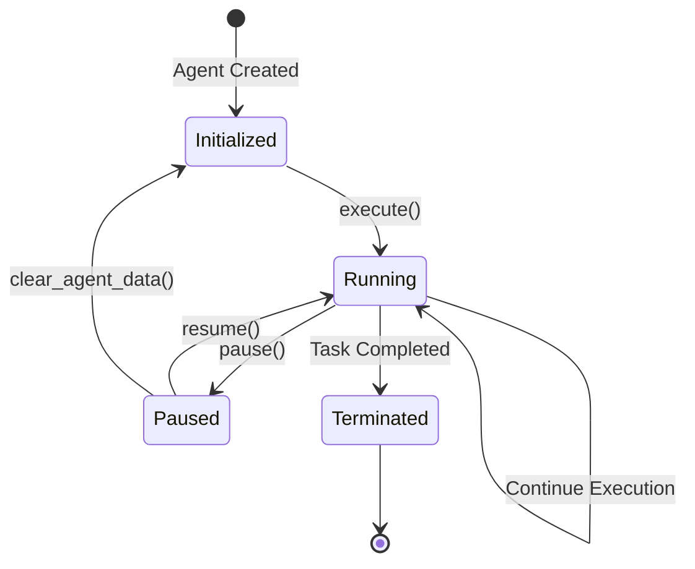

## **引言:**


如果将 AI Agent 比作一个不知疲倦的员工，推理引擎赋予了它 “大脑” 进行思考和决策，工具赋予了它 “双手” 执行任务，那么**持久化和长期记忆机制**就相当于为这位员工配备了 “笔记本” 和 “档案库”。“笔记本” 记录着当前任务的进度和重要信息（短期记忆），“档案库” 则存储着这位员工长期积累的知识、经验和历史记录（长期记忆）。 即使这位员工暂时离开岗位（Agent 暂停或重启），也能够迅速地从“笔记本”和“档案库” 中找回所需的信息，继续高效地开展工作。本章将重点介绍 AI Agent 的持久化和长期记忆机制，探讨如何让 Agent 跨越不同的会话周期，维持状态，积累经验，并支持人机协同工作流程。


```plain text
+--------------+      +--------------+      +--------------+      +-----------------+
|  推理引擎    |      |     工具      |      |  持久化 &    |      |    应用场景      |
| (Reasoning   |      |   (Tools)    |      |   长期记忆   |      | (Use Cases)     |
|   Engine)    |      |              |      | (Persistence |      |                 |
|    (大脑)    |      |    (双手)    |      | & Long-Term  |      |                 |
|              |      |              |      |   Memory)   |      |                 |
+------+-------+      +------+-------+      | (笔记本&档案库)|      +--------+--------+
       ^                     |              +--------------+               |
       |                     |                      ^                      |
       |                     v                      |                      v
+------v---------------------+----------------------+------------------v--------+
|                                    AI Agent                                  |
+------------------------------------------------------------------------------+

                         (图 31. AI Agent 核心能力)
```


## **4.1 持久化的重要性 (The Importance of Persistence)**


### **4.1.1 处理长时间运行的任务 (Handling Long-Running Tasks)**


许多实际应用场景中，AI Agent 需要处理的任务往往无法在一个会话 (Session) 内完成，可能需要持续数小时、数天甚至更长时间。例如：

- **复杂的审批流程:** 一个贷款审批 Agent 可能需要收集用户信息、进行信用评估、风险评估等多个步骤，甚至需要人工审核，整个流程可能需要数天才能完成。
- **科研数据分析:** 一个科学研究 Agent 可能需要对海量的实验数据进行分析、建模、验证，这项工作可能需要持续数周甚至数月。
- **长期监控任务:** 一个系统监控 Agent 需要 7x24 小时监控系统的运行状态，并对异常情况进行预警和处理，这是一个持续运行、没有明确终点的任务。

在这些情况下，如果 Agent 没有持久化机制，一旦 Agent 进程中断或重启 (例如，由于系统维护、资源限制、意外崩溃等原因)，那么 Agent 的所有状态信息都将丢失，导致任务需要从头开始执行，造成资源浪费和时间延误。


而持久化机制可以将 Agent 的状态信息 (包括任务进度、中间结果、配置参数等) 保存到可靠的存储介质中，使得 Agent 能够在中断后**从上一个保存点恢复执行**，而无需重新开始整个任务。


### **4.1.2 支持人机协同工作流程 (Enabling Human-in-the-Loop Workflows)**


在许多应用场景中，AI Agent 需要与人类进行协作，共同完成任务。例如：

- **内容审核:** Agent 可以对内容进行初步筛选，并将疑似违规的内容提交给人工审核员进行复核。
- **贷款审批:** Agent 可以对贷款申请进行初步评估，并将需要人工介入的申请提交给信贷员进行审批。
- **医疗诊断:** Agent 可以根据患者的症状和病史，生成初步诊断报告，并提交给医生进行确认。

在这些场景中，Agent 通常需要**暂停执行**，等待人工介入，并在人工完成后继续执行。持久化机制可以确保 Agent 在等待期间**不会丢失状态**，并在人工完成后**无缝地继续执行**。


**流程示意:**


```plain text
+---------------------+     +---------------------+
|  Loan Application   |---->|  Loan Processing    |
|                     |     |       Agent         |
+---------------------+     +---------+---------+
         |                         ^        |
         |                         |        |
         v                         |        |
+-----------------+                |        |
| Initial         |----------------+        |
| Assessment      |                         |
+--------+--------+                         |
         |                                  |
         |  Need Human Review?              |
         v                                  |
+-----------------+                         |
|    Pause Agent  |-------------------------+
|  (Save State)   |                         |
+-----------------+                         |
         |                Human Review     |
         +-----------------------+         |
         |                       |         |
         v                       v         |
+-----------------+       +-----------------+
|   Approved?     |------>|   Continue      |
|                 |       |   Processing    |
+--------+--------+       +-----------------+
         | No                    ^
         |                       |
         v                       |
+-----------------+               |
|   Reject        |---------------+
|   Application   |
+-----------------+

    (图 32. 人机循环贷款审批流程)
```


**4.1.3 实现跨会话的状态维护 (Maintaining State Across Sessions)**


除了支持长时间运行的任务和人机协同工作流程外，持久化机制还可以帮助 Agent 实现跨会话的状态维护。这意味着 Agent 可以在不同的会话中保持一致的状态，例如：

- **记住用户的偏好:** 一个电商推荐 Agent 可以记住用户的购买历史和浏览记录，并在用户下次访问时，继续为用户推荐相关的产品，即使用户关闭了浏览器或隔了一段时间才再次访问。
- **维护配置信息:** Agent 可以将自身的配置信息 (例如，角色设定、工具配置、个性化参数等) 持久化，并在每次启动时加载这些配置信息，从而保持 Agent 行为的一致性。
- **跟踪任务进度:** 对于需要多个会话才能完成的任务，Agent 可以将任务的进度信息持久化，并在每次会话开始时加载进度，从而继续执行任务，即使用户关闭了浏览器或退出了应用。

### **4.1.4 增强系统的可靠性和容错性 (Enhancing Reliability and Fault Tolerance)**


持久化机制可以定期保存 Agent 的状态，并在 Agent 进程意外终止 (例如, 程序错误、系统崩溃、网络中断) 时, 能够从之前的状态恢复，从而提高系统的**可靠性和容错性**，避免数据丢失或任务执行中断。


## **4.2 长期记忆的重要性 (The Importance of Long-Term Memory)**


### **4.2.1 超越单次会话: 从短时记忆到长期记忆 (Beyond Single Session: From Short-Term to Long-Term Memory)**


AI Agent 的记忆可以分为两种类型: **短期记忆** 和 **长期记忆**。

- **短期记忆:** 类似于人类工作记忆，用于存储当前会话的信息，容量有限，会话结束即消失。短期记忆可以帮助 Agent 维持对话的连贯性, 记住当前的上下文信息, 例如, 用户刚刚说了什么, Agent 正在执行什么任务等。
- **长期记忆:** 类似于人类的长期记忆，用于存储 Agent 的知识、经验和状态，容量较大，可以长期保存，甚至在 Agent 重启后依然存在。

短期记忆对于处理即时信息和维持对话连贯性至关重要, 但它无法存储长期信息,  也无法跨会话使用。而长期记忆则可以弥补这一缺陷,  使 Agent 能够积累知识和经验,  并在不同的会话中使用这些信息,  从而实现更高级别的智能。


```plain text
+-----------------+             +---------------------+
|  Short-Term     |             |   Long-Term         |
|    Memory       |             |     Memory          |
+-----------------+             +---------------------+
| - Current       |             | - Knowledge Base    |
|   Context       |  <-------->  | - Past Experiences  |
| - Recent        |  Exchange   | - Learned Skills    |
|   History       |             +---------------------+
| - Temporary     |             | - Persistent Data  |
|   Data          |             | - User Preferences |
+-----------------+             +---------------------+

      (图 33. 短期记忆与长期记忆)
```


### **4.2.2 长期记忆使 Agent 更加智能**


长期记忆对于构建真正智能的 AI Agent 至关重要,  它可以使 Agent:

- **具备个性化能力:** 通过记住用户的偏好、历史记录和行为模式, Agent 可以提供更加个性化的服务和体验。例如, 一个购物助手 Agent 可以记住用户的购物历史和喜好, 从而推荐更符合用户需求的商品; 一个教育 Agent 可以记住学生的学习进度和掌握情况, 从而提供更个性化的教学方案。
- **实现持续学习:** Agent 可以将与环境和其他实体 (包括人) 交互过程中获得的经验和知识存储到长期记忆中, 并在以后的任务中利用这些经验和知识, 从而实现持续学习和改进。例如, 一个游戏 Agent 可以记住之前的对战经验, 并从中学习到更优的游戏策略; 一个股票交易 Agent 可以记住历史交易数据, 并从中学习到更有效的交易模式。
- **支持复杂推理:** 通过访问长期记忆中的知识库, Agent 可以进行更复杂、更深入的推理, 例如, 一个医疗诊断 Agent 可以利用长期记忆中的医学知识, 对患者的病情进行更准确的诊断。
- **增强 Agent 的自主性:** 长期记忆为 Agent 提供了独立于当前会话的知识和经验, 使其能够更加自主地进行决策和行动, 而不仅仅依赖于当前的输入和指令。

### **4.2.3 长期记忆的应用场景:**

- **知识库问答:** Agent 可以利用长期记忆中存储的知识库来回答用户的问题, 例如, 一个百科问答 Agent 可以利用维基百科或其他百科全书作为其长期记忆, 来回答用户关于各种主题的问题。
- **个性化推荐:** Agent 可以根据用户的历史行为和偏好, 从长期记忆中检索相关的信息, 并为用户提供个性化的推荐, 例如, 一个电商 Agent 可以根据用户的购买历史和浏览记录, 推荐用户可能感兴趣的商品。
- **持续学习和改进:** Agent 可以将与环境和其他实体交互的经验存储到长期记忆中, 并利用这些经验来持续学习和改进自身的性能, 例如, 一个强化学习 Agent 可以将每次行动的结果和奖励信号存储到长期记忆中, 并利用这些信息来更新自身的策略。
- **跨会话的任务执行:** Agent 可以将任务的中间状态和结果存储到长期记忆中, 从而实现跨会话的任务执行, 例如, 一个项目管理 Agent 可以将项目的进度、任务分配、资源使用等信息存储到长期记忆中, 从而实现项目的持续跟踪和管理。

## **4.3 持久化层的实现 (Implementing the Persistence Layer)**


为了实现 AI Agent 的持久化和长期记忆,  我们需要构建一个可靠的持久化层 (Persistence Layer),  负责将 Agent 的状态信息保存到持久化存储介质中,  并在需要时加载这些信息。


### **4.3.1 技术选型：SQLite**


在本教程中,  我们选择使用 **SQLite** 作为持久化机制的底层技术。SQLite 是一个轻量级的、嵌入式的、基于文件的关系型数据库,  非常适合于 AI Agent 的持久化。


选择 SQLite 主要基于以下几个原因:

- **轻量级:** SQLite 是一个非常轻量级的数据库引擎, 整个数据库就是一个文件, 不需要独立的数据库服务器进程, 占用资源非常少, 适合于资源受限的环境, 例如移动设备、嵌入式设备等。
- **嵌入式:** SQLite 是一个嵌入式数据库, 可以直接集成到 Agent 的应用程序中, 无需进行单独的安装和配置, 部署和使用都非常方便。
- **文件级数据库:** SQLite 数据库以单个文件的形式存储, 易于备份、迁移和管理, 也方便进行版本控制。
- **支持 SQL:** SQLite 支持标准的 SQL 查询语言, 可以方便地进行数据的存储、检索、更新和删除。
- **跨平台:** SQLite 支持多种操作系统, 包括 Windows、Linux、macOS、Android、iOS 等, 具有良好的跨平台性。
- **ACID 特性:** SQLite 支持事务的 ACID 特性 (原子性、一致性、隔离性、持久性), 可以保证数据的可靠性和一致性, 即使在系统崩溃或断电的情况下, 也能保证数据的完整性。
- **适用于原型开发和小规模应用:** SQLite 非常适合于原型开发和小规模应用, 可以快速搭建 Agent 的持久化层, 验证 Agent 的功能和性能。

当然,  SQLite 也有其局限性,  例如,  在处理大量并发访问时性能可能会下降,  不适合于大规模、高并发的应用场景。但是,  对于我们目前构建的 Agent 来说,  SQLite 已经足够满足我们的需求。在后续的开发中,  如果需要更高的性能和可扩展性,  可以考虑使用其他类型的数据库,  例如 PostgreSQL、MySQL、MongoDB 等。


### **4.3.2** **`AgentPersistence`** **类:**


为了封装与数据库交互的具体实现,  并为 Agent 提供一个简洁的持久化接口,  我们创建了一个 `AgentPersistence` 类。


```python
class AgentPersistence:
    def __init__(self, db_path: str = "agent_memory.db"):
        self.db_path = db_path
        self._local = threading.local()
        self._init_db()

    def _get_conn(self):
        if not hasattr(self._local, 'conn'):
            self._local.conn = sqlite3.connect(self.db_path)
        return self._local.conn

    def _init_db(self):
        """Initialize the database schema."""
        with self._get_conn() as conn:
            conn.executescript("""
                CREATE TABLE IF NOT EXISTS agents (
                    name TEXT PRIMARY KEY,
                    persona TEXT,
                    instruction TEXT,
                    strategy TEXT,
                    created_at TIMESTAMP DEFAULT CURRENT_TIMESTAMP,
                    last_updated TIMESTAMP DEFAULT CURRENT_TIMESTAMP
                );

                CREATE TABLE IF NOT EXISTS agent_states (
                    id INTEGER PRIMARY KEY AUTOINCREMENT,
                    agent_name TEXT,
                    task TEXT,
                    history TEXT,
                    timestamp TIMESTAMP DEFAULT CURRENT_TIMESTAMP,
                    FOREIGN KEY (agent_name) REFERENCES agents(name)
                    ON DELETE CASCADE
                );
            """)

    def save_agent_state(self, agent):
        # ... (代码见之前回复) ...

    def load_agent_state(self, agent):
        # ... (代码见之前回复) ...

    def clear_agent_state(self, agent_name: str):
        # ... (代码见之前回复) ...

    def clear_all_states(self):
        # ... (代码见之前回复) ...
```


**代码解释:**

- **`__init__(self, db_path: str = "agent_memory.db")`****:** 初始化方法, 设置数据库文件的路径 (默认为 "agent_memory.db"), 并创建线程局部变量 `_local` 用于存储数据库连接, 最后调用 `_init_db` 方法初始化数据库。
- **`_get_conn(self)`****:** 获取数据库连接, 使用线程局部变量 `_local` 来存储数据库连接, 确保每个线程都有自己的数据库连接, 避免多线程访问冲突。
- **`_init_db(self)`****:** 初始化数据库, 创建 `agents` 表和 `agent_states` 表, 如果表已经存在, 则不会重复创建。
- **`save_agent_state(self, agent)`****:** 保存 Agent 的当前状态, 包括 Agent 的名称、角色 (persona)、指令 (instruction)、策略 (strategy) 和历史记录 (history) 等信息。
- **`load_agent_state(self, agent)`****:** 加载 Agent 的状态, 根据 Agent 的名称从数据库中加载其保存的状态信息, 并将其设置到 Agent 对象中。
- **`clear_agent_state(self, agent_name: str)`****:** 清除指定 Agent 的所有状态信息。
- **`clear_all_states(self)`****:** 清除所有 Agent 的状态信息。

**`AgentPersistence`** **类的职责:**

- **管理数据库连接:** `AgentPersistence` 类负责管理与数据库的连接, 包括创建连接、获取连接、关闭连接等。
- **执行数据库操作:** `AgentPersistence` 类负责执行所有与数据库相关的操作, 例如创建表、插入数据、更新数据、查询数据、删除数据等。
- **提供持久化接口:** `AgentPersistence` 类为 Agent 提供了简洁的持久化接口, 包括 `save_agent_state`、`load_agent_state`、`clear_agent_state` 等方法, Agent 可以通过这些方法来保存、加载和清除自身的持久化状态。

### **4.3.3 数据库模式 (Schema):**


`AgentPersistence` 类使用了两个表来存储 Agent 的信息和状态: `agents` 表和 `agent_states` 表。

- **`agents`** **表:**
    - **用途:** 用于存储 Agent 的基本信息, 每个 Agent 对应一条记录。
    - **字段:**
        - `name` (TEXT, PRIMARY KEY): Agent 的名称, 作为主键, 唯一标识一个 Agent。
        - `persona` (TEXT): Agent 的角色描述, 例如 "一个专业的客服代表"。
        - `instruction` (TEXT): Agent 的指令, 例如 "始终保持礼貌和耐心"。
        - `strategy` (TEXT): Agent 使用的推理策略的名称, 例如 "ReactStrategy"。
        - `created_at` (TIMESTAMP): Agent 的创建时间, 自动设置为当前时间戳。
        - `last_updated` (TIMESTAMP): Agent 的最后更新时间, 自动设置为当前时间戳。
    - **示例:**

        | name           | persona                  | instruction                   | strategy               | created_at          | last_updated        |
        | -------------- | ------------------------ | ----------------------------- | ---------------------- | ------------------- | ------------------- |
        | loan_processor | 我是一个贷款处理助理...            | 遵循严格的合规准则...                  | ReactStrategy          | 2024-11-20 10:00:00 | 2024-11-20 10:30:00 |
        | research_agent | 我是一个研究助理, 能够访问维基百科和网络... | 始终使用可用的工具来回答问题。如果信息不在知识库中 ... | ChainOfThoughtStrategy | 2024-11-21 11:00:00 | 2024-11-21 13:15:00 |

- **`agent_states`** **表:**
    - **用途:** 用于存储 Agent 的历史状态, 每个 Agent 可以对应多条状态记录, 每个状态记录对应 Agent 在某个时刻的状态快照。
    - **字段:**
        - `id` (INTEGER, PRIMARY KEY): 状态记录的 ID, 自动递增。
        - `agent_name` (TEXT): Agent 的名称, 外键, 关联到 `agents` 表的 `name` 字段。
        - `task` (TEXT): Agent 当前正在执行的任务。
        - `history` (TEXT): Agent 的历史记录, 例如对话历史, 使用 JSON 格式存储。
        - `timestamp` (TIMESTAMP): 状态保存的时间戳, 自动设置为当前时间戳。
    - **外键约束:** `FOREIGN KEY (agent_name) REFERENCES agents(name) ON DELETE CASCADE` 表示 `agent_states` 表的 `agent_name` 字段引用 `agents` 表的 `name` 字段, 并且当 `agents` 表中的某个 Agent 记录被删除时, `agent_states` 表中与之关联的所有状态记录也会被级联删除。
    - **示例:**

        | id | agent_name     | task                                                     | history                                                                                                   | timestamp           |
        | -- | -------------- | -------------------------------------------------------- | --------------------------------------------------------------------------------------------------------- | ------------------- |
        | 1  | loan_processor | "对贷款申请 12345 进行初步评估。"                                    | `[{"role": "user", "content": "我想申请贷款。"}, {"role": "assistant", "content": "好的, 请提供您的身份证号码和联系方式。"}]`      | 2024-11-20 10:15:00 |
        | 2  | loan_processor | "等待人工审核贷款申请 12345。"                                      | `[{"role": "user", "content": "我想申请贷款。"}, {"role": "assistant", "content": "好的, 请提供您的身份证号码和联系方式。"}, ...]` | 2024-11-20 10:20:00 |
        | 3  | research_agent | "What are the latest developments in quantum computing?" | `[{"role": "user", "content": "What are the latest developments in quantum computing?"}]`                 | 2024-11-21 12:30:00 |


**表关系:**


```plain text
+-----------------+       +---------------------+
|    agents       |       |    agent_states     |
+-----------------+       +---------------------+
| name (PK)       |<------| id (PK)             |
| persona         |       | agent_name (FK)     |
| instruction     |       | task                |
| strategy        |       | history             |
| created_at      |       | timestamp           |
| last_updated    |       +---------------------+
+-----------------+

(图 33. 数据库表关系示意图)
```


**`TIMESTAMP`** **字段的作用:**


`agents` 表和 `agent_states` 表中的 `created_at`、`last_updated` 和 `timestamp` 字段都使用了 `TIMESTAMP` 类型,  用于记录 Agent 的创建时间、最后更新时间以及状态保存的时间。这些时间戳信息对于跟踪 Agent 的状态变化、进行审计和故障排查非常有用。


**`last_updated`** **字段的作用:**


`agents` 表中的 `last_updated` 字段用于记录 Agent 的最后更新时间,  每次更新 Agent 的 `persona`、`instruction` 或 `strategy` 字段时,  都会自动更新 `last_updated` 字段的值为当前时间戳。这可以帮助我们了解 Agent 的最新配置信息是什么时候更新的。


### **4.3.4 总结：**


这一部分主要完善了状态的定义，表结构，各个字段的作用以及表之间的联系。


## **4.3 增强支持持久化的 Agent 类:**


为了使 Agent 能够利用 `AgentPersistence` 类来保存和加载状态, 我们需要对 `Agent` 类进行一些修改。


### **4.3.1 添加** **`_persistence`** **属性:**


在 `Agent` 类的 `__init__` 方法中, 添加一个 `_persistence` 属性, 用于存储 `AgentPersistence` 实例, 并在初始化时尝试从数据库中加载 Agent 的状态。


```python
class Agent:
    def __init__(self,
                 name: str,
                 context: Optional[ContextManager] = None,
                 persistence: Optional[AgentPersistence] = None,
                 tool_registry: Optional[ToolRegistry] = None):
        self._name = name
        self._persona = ""
        self._instruction = ""
        self._task = ""
        self._context = context
        self._persistence = persistence or AgentPersistence()  # 使用传入的 persistence 对象或创建一个新的
        self._history: List[Dict[str, str]] = []
        self._strategy: Optional[ExecutionStrategy] = None
        self.tool_registry = tool_registry or ToolRegistry()
        self._llm = ChatOllama(model="llama3", format="json", temperature=0)
        # Try to load existing state for the agent
        if not self._persistence.load_agent_state(self):
            print(f"No saved state found for agent {self._name}. Initializing with default settings.")

    # ... 其他方法 ...
```


**代码解释:**

- `self._persistence = persistence or AgentPersistence()`: 如果构造函数中传入了 `persistence` 参数, 则使用传入的 `AgentPersistence` 对象; 否则, 创建一个新的 `AgentPersistence` 对象。这样可以方便地在不同的 Agent 之间共享同一个 `AgentPersistence` 实例, 或者为每个 Agent 使用不同的 `AgentPersistence` 实例。
- `if not self._persistence.load_agent_state(self):`: 在 Agent 初始化时, 尝试从数据库中加载 Agent 的状态。如果加载成功, 则 Agent 的属性 (例如 `_persona`, `_instruction`, `_strategy`, `_task`, `_history` 等) 将被数据库中保存的值覆盖; 如果加载失败 (例如, 数据库中没有该 Agent 的记录), 则 Agent 将使用默认的属性值进行初始化, 并打印提示信息。

### **4.3.2 添加** **`save_state`** **和** **`load_state`** **方法:**


在 `Agent` 类中添加 `save_state` 和 `load_state` 方法, 这两个方法内部调用 `AgentPersistence` 对象的相应方法来保存和加载 Agent 的状态。


```python
class Agent:
    # ... (其他属性和方法) ...

    def save_state(self) -> bool:
        """Saves the current state of the agent."""
        return self._persistence.save_agent_state(self)

    def load_state(self, agent_name: Optional[str] = None) -> bool:
        """Loads a previously saved state for the agent."""
        agent_name = agent_name if agent_name else self.name
        return self._persistence.load_agent_state(self)

    # ... (其他方法) ...
```


**代码解释:**

- `save_state(self) -> bool`: 将 Agent 的当前状态保存到数据库中。它内部调用了 `self._persistence.save_agent_state(self)` 方法, 将自身 (即 `self` 对象) 作为参数传递给 `save_agent_state` 方法。
- `load_state(self, agent_name: Optional[str] = None) -> bool`: 从数据库中加载 Agent 的状态。它内部调用了 `self._persistence.load_agent_state(self)` 方法, 将自身 (即 `self` 对象) 作为参数传递给 `load_agent_state` 方法。`agent_name` 参数允许恢复其它 Agent 的状态, 如果该参数为空, 那么将会恢复当前 Agent 的状态。

### **4.3.3 添加** **`pause`** **和** **`resume`** **方法:**


在 `Agent` 类中添加 `pause` 和 `resume` 方法, 用于暂停和恢复 Agent 的执行。


```python
class Agent:
    # ... (其他属性和方法) ...

    def pause(self) -> bool:
        """Pause the agent by saving its current state."""
        print(f"Pausing agent {self.name}...")
        return self.save_state()

    def resume(self, agent_name: Optional[str] = None) -> bool:
        """Resume the agent by loading its saved state."""
        print(f"Resuming agent {self.name if not agent_name else agent_name}...")
        return self.load_state(agent_name)

    # ... (其他方法) ...
```


**代码解释:**

- `pause(self) -> bool`: 暂停 Agent 的执行, 并将其当前状态保存到数据库中。它内部调用了 `save_state` 方法来实现状态的保存, 并打印提示信息。
- `resume(self, agent_name: Optional[str] = None) -> bool`: 恢复 Agent 的执行, 从数据库中加载之前保存的状态。它内部调用了 `load_state` 方法来实现状态的加载, 并打印提示信息。

**Agent 状态转换图:**





**(图 34. Agent 状态转换图)**


这个状态转换图描述了 Agent 的几个关键状态以及触发状态转换的动作:

- **Initialized (初始化):** Agent 被创建但尚未执行任务。
- **Running (运行中):** Agent 正在执行任务。
- **Paused (暂停):** Agent 暂停执行, 状态被保存。
- **Terminated (终止):** Agent 完成任务或被终止。

**状态转换:**

- Agent 创建后进入 **Initialized** 状态。
- 调用 `execute()` 方法后, Agent 进入 **Running** 状态。
- 在 **Running** 状态下, 调用 `pause()` 方法可以使 Agent 进入 **Paused** 状态, 并保存当前状态。
- 在 **Paused** 状态下, 调用 `resume()` 方法可以使 Agent 恢复到 **Running** 状态, 并加载之前保存的状态。
- 在 **Running** 状态下, 如果任务完成, Agent 将进入 **Terminated** 状态。
- Agent 可以通过 `clear_agent_data()` 从任何状态返回到 **Initialized** 状态。

## **4.4 持久化与人机循环工作流程 (Persistence and Human-in-the-Loop Workflows)**


持久化机制的引入使得 Agent 能够支持**人机循环 (Human-in-the-Loop)** 工作流程。在人机循环工作流程中, Agent 在执行任务的过程中, 可能需要暂停执行, 等待人工介入 (例如, 进行审核、批准、修改等), 然后再根据人工的输入继续执行。


### **4.4.1 人机循环的必要性:**

- **复杂决策:** 对于一些复杂的决策, 例如, 是否批准一笔贷款申请, 是否批准一项高风险的投资, AI Agent 可能无法完全自主地做出决策, 需要人类专家的参与。
- **安全性和可靠性:** 对于一些安全性要求较高的任务, 例如, 医疗诊断、自动驾驶等, 需要人类专家对 Agent 的决策进行审核, 以确保安全性和可靠性。
- **伦理和道德:** 对于一些涉及伦理和道德的任务, 例如, 内容审核、招聘等, 需要人类专家根据道德准则和价值观进行判断。
- **数据标注:** 在 Agent 的学习过程中, 可能需要人工标注数据, 例如, 标注训练数据、评估 Agent 的性能等。

### **4.4.2 如何实现人机循环:**

- **暂停和恢复机制:** Agent 需要能够在执行过程中暂停, 将当前的状态保存下来, 等待人工介入, 并在人工完成后恢复执行。这就是我们实现的 `pause` 和 `resume` 方法的作用。
- **人工交互接口:** 需要提供一个接口, 使 Agent 能够与人类进行交互, 例如, 一个 Web 界面或一个命令行工具。人工可以通过这个接口查看 Agent 的状态、审批 Agent 的请求、修改 Agent 的参数等。
- **状态可视化:** 需要将 Agent 的当前状态 (例如, 任务的进度、已执行的步骤、需要人工审核的内容等) 以可视化的方式呈现给人类, 以便人类进行判断和决策。
- **工作流引擎:** 可以使用工作流引擎来管理人机循环的流程, 例如, 定义任务的执行步骤、设置人工审核节点、配置任务的超时时间等。

### **4.4.3 实际示例：贷款申请处理:**


以下是一个使用 Agent 处理贷款申请的示例, 该示例演示了如何使用持久化机制来实现人机循环工作流程:


```python
def process_loan_application(agent, application_id):
    # 1. 启动 Agent 并加载之前的状态 (如果存在)
    if not agent.resume():
        print("Starting a new loan application process.")

    # 2. 初步评估 (自动)
    agent.task = f"对贷款申请 {application_id} 进行初步评估。"
    result = agent.execute()
    print(f"初步评估结果: {result}")

    # 3. 检查是否需要人工审核
    if "需要人工审核" in result:
        # 4. 暂停 Agent 并保存状态
        agent.pause()
        print(f"暂停处理贷款申请 {application_id}, 等待人工审核。")
        # 5. 通知人工审核员进行审核 (此处省略具体实现)
        # 可以通过邮件、短信或其他通信方式通知人工审核员。
        # 也可以提供一个 Web 界面, 供人工审核员查看 Agent 的状态和相关信息。
        print(f"已通知人工审核员对申请 {application_id} 进行审核。")
        return # 在等待人工审核时, 函数直接返回

    else:
        print(f"初步评估通过, 无需人工审核, 直接进入下一步。")

    # 7. 根据审核结果继续处理
    # 8. 恢复 Agent 的状态. 由于我们已经在初始化的时候将其加载, 所以实际上不需要额外做什么
    #    如果应用场景允许, 也可以重新再次加载 agent 的状态, 确保状态最新
    #    agent.resume() 在这里重复呼叫并不影响
    approved = True  # 假设人工审核通过, 在实际应用中, 审核结果应该从某个地方获取, 例如数据库或人工审核界面。
    if approved:
        agent.task = f"贷款申请 {application_id} 已获批准, 请继续处理。"
        result = agent.execute()
        print(f"最终处理结果: {result}")
    else:
        agent.task = f"贷款申请 {application_id} 未获批准, 请通知客户。"
        result = agent.execute()
        print(f"最终处理结果: {result}")

    # 9. 清理 Agent 状态 (可选)
    agent.clear_agent_state()

# 使用示例:
# 10. 重新创建 Agent, 工具, RAG, 持久化等类, 以便 Agent 能够根据提示词和工具完成任务
# 初始化 AgentPersistence
persistence = AgentPersistence()

# 初始化 ContextManager (如果需要)
context = ContextManager(
    collection_name="loan_applications",
    persist_dir="context_db"
)

# 初始化 ToolRegistry (如果需要)
tool_registry = ToolRegistry()

# 创建一些工具的实例
# 例如, 一个假设的信用评分工具
class CreditScoreTool(Tool):
    @property
    def name(self) -> str:
        return "credit_score"

    @property
    def description(self) -> str:
        return "根据申请人的信息, 查询其信用评分。"

    @property
    def parameters(self) -> Dict[str, Dict[str, Any]]:
        return {
            "applicant_id": {
                "type": "string",
                "description": "申请人的 ID"
            }
        }

    def execute(self, **kwargs) -> ToolResult:
        applicant_id = kwargs.get("applicant_id")
        # 这里只是一个模拟的实现, 实际应用中需要连接到真正的信用评分系统
        # 这里只是一个模拟的实现, 实际应用中需要连接到真正的信用评分系统
        if applicant_id == "12345":
            score = 750
        else:
            score = 650
        return ToolResult(success=True, data=f"申请人 {applicant_id} 的信用评分为 {score}")

# 注册工具
tool_registry.register(CreditScoreTool())

# 创建并配置 Agent
agent = Agent(
    name="loan_processor",
    context=context,
    persistence=persistence,
    tool_registry=tool_registry
)

# 11. 为 Agent 设置角色, 指令和 Reasoning 策略
agent.persona = """你是一个贷款处理助理, 你的任务是协助信贷员处理贷款申请。
你需要严格遵守贷款政策和流程,  仔细审查申请材料,  并在必要时寻求人工帮助。
你需要根据申请人的信用评分和还款能力,  初步评估贷款申请是否可以批准。
如果申请人的信用评分低于 650 分,  或者你需要更多信息才能做出判断,  则需要将申请转交给人工审核。"""

# 设置全局指令
agent.instruction = """1. 始终使用可用的工具来获取信息和执行操作。
2. 如果需要人工审核,  请使用 'pause' 关键字暂停,  并清晰地说明需要审核的内容。
3. 在得到人工审核结果后,  使用 'resume' 关键字恢复执行,  并根据审核结果继续处理。
4. 严格遵守贷款政策和流程。
5. 使用 Markdown 格式输出最终结果。"""

# 假设我们已经创建了 `react_strategy`, `cot_strategy` 和 `reflection_strategy`, 并且已经将  `StrategyFactory` 正确设置
agent.strategy = "ReactStrategy"  # 使用 ReAct 策略

# 12. 运行 Agent
# 假设这是第一次处理申请
process_loan_application(agent, "12345")

# 假定这是第二次运行, 并且申请已经被拒绝
# agent2 = Agent("loan_processor_2", context=context, persistence=persistence, tool_registry=tool_registry)
# process_loan_application(agent2, "67890")
```


**代码解释:**

1. **创建 Agent 并加载状态:** 创建一个名为 `loan_processor` 的 Agent, 并尝试加载之前的状态。如果加载失败 (例如, 这是第一次处理该申请), 则打印一条消息, 表示开始一个新的贷款申请流程。
2. **执行初始评估:** Agent 执行任务 “对贷款申请 {application_id} 进行初步评估”，并输出初步评估结果。这可能涉及到使用工具 (例如 `CreditScoreTool`) 来查询申请人的信用评分, 或者使用 RAG 技术从贷款政策文档中检索相关信息。
3. **检查是否需要人工审核:** Agent 根据评估结果, 判断是否需要人工审核。在这个例子中, 我们假设如果评估结果中包含 “需要人工审核” 字样, 则需要人工审核。
4. **暂停 Agent:** 如果需要人工审核, Agent 调用 `pause` 方法保存当前状态, 并输出提示信息, 告知用户需要等待人工审核。
5. **通知人工审核员:** 这里省略了通知人工审核员的具体实现, 在实际应用中, 可以使用邮件、短信、消息队列等方式通知人工审核员。也可以提供一个 Web 界面, 供人工审核员查看 Agent 的状态和相关信息。
6. **人工审核:** 人工审核员审核贷款申请, 并将审核结果存储在 `approved` 变量中 (在实际应用中, 审核结果可能会存储在数据库或其他系统中)。
7. **恢复 Agent:** 人工审核完成后, 调用 Agent 的 `resume` 方法恢复 Agent 的状态 (由于我们已经在初始化的时候加载, 所以这里不需要再次调用, 重复调用也没有副作用)。
8. **继续处理:** Agent 根据审核结果 ( `approved` 变量) 继续处理贷款申请。如果审核通过, 则继续完成贷款申请流程; 如果审核不通过, 则通知客户申请被拒绝。
9. **清理状态:** (可选步骤) 在任务完成后, 可以调用 `clear_agent_state` 方法清理当前 Agent 的状态, 以释放资源。
10. **工具使用:** Agent 可能会在这个过程中使用各种工具, 例如 `CreditScoreTool` (信用评分工具), `DatabaseTool` (数据库查询工具) 等。
11. **RAG:** 如果有相关的贷款政策文档或历史记录, 还可以使用 RAG 技术, 从文档中检索相关信息, 辅助 Agent 进行决策。
12. **ReAct 策略:** Agent 会根据 ReAct 策略, 进行 `Thought`, `Action`, `Observation` 的循环, 直到完成任务。
13. **Chain of Thought 策略:** Agent 可能会在需要进行复杂推理时, 使用 Chain of Thought 策略, 例如, 在评估贷款申请的风险时, 可以将风险评估分解成多个步骤, 逐步进行分析。

**流程示意:**


```plain text
+---------------------+     +---------------------+
|  Loan Application   |---->|  Loan Processing    |
|                     |     |       Agent         |
+---------------------+     +---------+---------+
         |                         ^        |
         |                         |        |
         v                         |        |
+-----------------+                |        |
| Initial         |----------------+        |
| Assessment      |                         |
+--------+--------+                         |
         |                                  |
         |  Need Human Review?              |
         v                                  |
+-----------------+                         |
|    Pause Agent  |-------------------------+
|  (Save State)   |                         |
+-----------------+                         |
         |                Human Review     |
         +-----------------------+         |
         |                       |         |
         v                       v         |
+-----------------+       +-----------------+
|   Approved?     |------>|   Continue      |
|                 |       |   Processing    |
+--------+--------+       +-----------------+
         | No                    ^
         |                       |
         v                       |
+-----------------+               |
|   Reject        |---------------+
|   Application   |
+-----------------+

    (图 30. 人机循环贷款审批流程)
```


这个流程图描述了一个人机循环的贷款审批流程:

1. 贷款申请提交给贷款处理 Agent。
2. Agent 进行初步评估, 可能需要调用工具查询申请人的信用评分等信息。
3. Agent 判断是否需要人工审核, 如果需要, 则暂停 Agent, 并保存当前状态。
4. 人工审核员审核贷款申请, 并给出审核意见 (批准或拒绝)。
5. Agent 恢复执行, 根据人工审核的结果继续处理贷款申请。
6. 如果申请被批准, 则 Agent 继续处理; 如果申请被拒绝, 则 Agent 通知客户申请被拒绝。

**这个示例展示了如何将持久化机制应用于人机循环工作流程,  使 Agent 能够在需要人工介入时暂停, 并在人工完成后恢复执行。这种人机循环的模式在许多实际应用中都非常有用,  例如,  审批流程、客户服务、内容审核等。**


## **4.5 持久化的优势 (Benefits of Persistence)**


### **4.5.1 可中断的工作流程 (Interruptible Workflows):**


持久化机制使得 Agent 能够支持**可中断的工作流程**。这意味着 Agent 可以在执行任务的任意时刻**暂停**,  保存当前的**状态**,  并在稍后的时间点**恢复**执行,  而不会丢失任何信息或进度。

- **应用场景:**
    - **人机协作:** Agent 可以在需要人工干预时暂停, 例如, 在进行风险评估时, Agent 可以将初步评估结果提交给人工审核, 等待人工批准后再继续执行。
    - **长时间运行的任务:** 对于需要长时间运行的任务, 例如, 数据分析、模型训练等, Agent 可以定期保存状态, 并在需要时 (例如, 系统维护、资源不足) 暂停执行, 并在条件允许时恢复执行。
    - **资源管理:** Agent 可以根据资源的可用性动态地暂停和恢复执行, 例如, 当计算资源紧张时, Agent 可以暂停执行, 释放资源给其他任务, 并在资源充足时恢复执行。
    - **容错处理:** 当 Agent 遇到错误或异常情况时, 可以先保存当前的状态, 然后进行故障排除或修复操作, 并在问题解决后恢复执行, 保证任务的连续性和可靠性。

### **4.5.2 状态管理 (State Management):**


持久化机制提供了一种可靠的**状态管理**方案,  使 Agent 能够在不同的会话之间维护状态,  并能够从之前的状态中恢复。

- **跨会话的上下文:** Agent 可以记住之前的交互历史、用户的偏好、任务的进度等信息, 并在后续的会话中使用这些信息, 从而提供更加个性化和连贯的体验。例如, 一个客服 Agent 可以记住用户的历史问题和解决方案, 并在用户再次咨询类似问题时, 提供更快速、更准确的解答。
- **配置和状态的一致性:** Agent 的配置信息 (例如, 角色、指令、工具等) 可以被持久化, 从而确保 Agent 在不同的会话中使用相同的配置。这对于保持 Agent 行为的一致性和可预测性非常重要。
- **多状态跟踪:** Agent 可以同时维护多个不同的状态, 例如, 可以同时处理多个用户的请求, 每个用户都有自己的会话状态和任务进度。这对于构建多用户、多任务的 Agent 系统非常有用。
- **状态的版本控制:** 可以对 Agent 的状态进行版本控制, 例如, 保存每个状态变更的历史记录, 以便在需要时回滚到之前的某个版本, 或者比较不同版本之间的差异。

### **4.5.3 审计和合规 (Audit and Compliance):**


持久化机制可以用于跟踪 Agent 的所有状态和行为,  从而支持审计和合规性要求。

- **决策过程的可追溯性:** 通过记录 Agent 的每个决策步骤、使用的工具、输入和输出等信息, 可以实现 Agent 决策过程的可追溯性, 这对于理解 Agent 的行为、排查问题以及满足合规性要求非常重要。例如, 在金融领域, 监管机构可能要求 Agent 的所有交易决策都必须有完整的记录, 以便进行审计和审查。
- **历史记录的完整性:** 持久化机制可以确保 Agent 的历史记录被完整地保存, 不会因为系统故障或人为错误而丢失, 这对于审计和合规性检查至关重要。例如, 在医疗领域, Agent 的所有诊断和治疗记录都需要完整地保存, 以备日后查阅和追溯。
- **数据安全和隐私:** 持久化机制需要考虑数据的安全性和隐私保护, 例如, 可以使用加密技术来保护敏感数据, 并对数据的访问权限进行控制。例如, 在处理用户个人信息时, 需要对数据进行加密存储, 并限制只有授权人员才能访问。
- **支持回滚和恢复:** 在必要时, 可以将 Agent 的状态回滚到之前的某个时间点, 或者从备份中恢复 Agent 的状态, 从而实现系统的容错和灾难恢复。例如, 如果 Agent 的某个决策导致了严重的问题, 可以将 Agent 的状态回滚到决策之前的状态, 并重新进行决策。

### **4.5.4 资源优化 (Resource Optimization):**


持久化机制可以帮助优化资源的利用,  提高 Agent 的效率。

- **自动清理:** 可以根据预设的策略, 自动清理过期的或不再需要的状态信息, 从而释放存储空间, 避免资源浪费。例如, 可以定期删除超过一定时间的历史会话数据, 或者删除已完成任务的状态信息。
- **按需加载:** Agent 可以只在需要时才加载相关的状态信息, 而不是一次性加载所有的状态信息, 从而减少内存占用和启动时间。例如, 当用户请求访问某个历史会话时, Agent 可以只加载该会话的状态信息, 而不是加载所有会话的状态信息。
- **后台持久化:** 可以将状态的保存操作放在后台线程中执行, 从而避免阻塞 Agent 的主线程, 提高 Agent 的响应速度。例如, Agent 可以在执行任务的过程中, 异步地将状态信息保存到数据库中, 而不会影响任务的执行。

### **4.6 持久化实现的最佳实践 (Best Practices for Persistence Implementation)**


在实现 Agent 的持久化机制时,  需要遵循一些最佳实践,  以确保持久化机制的可靠性、高效性和安全性。


### **4.6.1 状态管理 (State Management):**

- **在有意义的检查点保存状态:** Agent 应该在任务执行的关键节点保存状态, 例如, 在每个子任务开始或结束时, 或者在调用外部工具前后, 或者在与用户进行交互前后。这样可以在 Agent 暂停或出错时, 最大程度地保留任务的进度, 并减少不必要的重复工作。
- **确保状态的一致性:** 在保存状态时, 需要确保所有相关的状态信息都被正确地保存, 避免出现数据不一致的情况。例如, Agent 在保存任务进度时, 需要同时保存相关的上下文信息, 以确保 Agent 在恢复执行时能够正确地理解任务的状态。可以使用数据库事务来保证状态保存的原子性, 即要么所有相关的状态信息都被保存, 要么都不保存。
- **处理状态相关的故障:** Agent 需要能够处理与状态相关的故障, 例如, 状态加载失败、状态数据损坏等。可以提供备用的状态加载方案, 或者在状态加载失败时, 给用户提供提示或回退到默认状态。
- **最小化状态信息:** 仅保存必要的状态信息，避免过度存储，以减少资源消耗和潜在的错误。例如, 可以只保存 Agent 的关键属性和任务的进度信息, 而不需要保存 Agent 的所有内部状态。过度存储可能会导致存储空间的浪费, 并增加状态保存和加载的开销。
- **提供状态操作的 API:** 为了方便 Agent 对状态进行操作, 可以提供一个清晰的 API, 例如, `get_state`, `set_state`, `update_state`, `delete_state` 等方法, 用于获取、设置、更新和删除 Agent 的状态信息。这样可以避免 Agent 直接操作底层的数据存储, 提高代码的可维护性和可读性。

**示例代码:**


```python
class Agent:
    # ...
    def get_state(self, key: str) -> Any:
        """获取 Agent 的状态信息."""
        if self._persistence:
            return self._persistence.get_agent_state_value(self.name, key)
        else:
            raise Exception("Persistence is not enabled for this agent.")

    def set_state(self, key: str, value: Any):
        """设置 Agent 的状态信息."""
        if self._persistence:
            self._persistence.set_agent_state_value(self.name, key, value)
        else:
            raise Exception("Persistence is not enabled for this agent.")

    def update_state(self, updates: Dict[str, Any]):
        """更新 Agent 的状态信息."""
        if self._persistence:
            self._persistence.update_agent_state(self.name, updates)
        else:
            raise Exception("Persistence is not enabled for this agent.")

    def delete_state(self, key: str):
        """删除 Agent 的状态信息."""
        if self._persistence:
            self._persistence.delete_agent_state_value(self.name, key)
        else:
            raise Exception("Persistence is not enabled for this agent.")
    # ...
```


### **4.6.2 内存清理 (Memory Cleanup):**

- **定期清理:** Agent 应该定期清理不再需要的状态信息, 例如, 已经完成的任务的状态、过期的会话数据等。这可以防止状态数据无限增长, 避免存储空间的浪费, 并提高系统的性能。
- **基于策略的清理:** 可以根据不同的策略来清理状态信息, 例如:
    - **基于时间的策略:** 例如, 删除超过一定时间 (例如, 一个月、一年等) 的历史会话数据。
    - **基于容量的策略:** 例如, 当存储空间的使用率超过一定阈值时, 删除最老或最不重要的状态信息。
    - **基于事件的策略:** 例如, 当任务完成或用户注销时, 删除相关的状态信息。
- **与业务逻辑结合:** 内存清理策略应与 Agent 的业务逻辑相结合, 确保不会误删重要的状态信息。例如, 在删除一个任务的状态信息之前, 需要确保该任务已经完成, 并且其结果已经被正确地处理。
- **考虑性能和开销:** 内存清理操作可能会对 Agent 的性能产生影响, 需要选择合适的清理时机和频率, 避免对 Agent 的正常运行造成干扰。例如, 可以在 Agent 空闲时进行清理, 或者使用异步的方式进行清理, 以减少对 Agent 性能的影响。
- **提供内存清理的 API:** 为了方便 Agent 进行内存清理, 可以在 `AgentPersistence` 类中提供相应的 API, 例如, `clear_expired_states`, `clear_completed_tasks` 等方法。

**示例代码:**


```python
class AgentPersistence:
    # ...
    def clear_expired_states(self, expiration_time: datetime) -> bool:
        """清除所有过期的状态信息."""
        with self._get_conn() as conn:
            try:
                conn.execute("DELETE FROM agent_states WHERE timestamp < ?", (expiration_time,))
                conn.commit()
                return True
            except sqlite3.Error as e:
                print(f"An error occurred while clearing expired states: {e}")
                conn.rollback()
                return False

    def clear_completed_tasks(self, agent_name: str) -> bool:
        """清除指定 Agent 的所有已完成任务的状态信息."""
        # 需要根据具体的任务状态表示方式来实现
        pass

    def clear_agent_states_by_criteria(self, agent_name: str, criteria: Dict[str, Any]) -> bool:
        """根据特定条件清除 Agent 的状态信息。"""
        with self._get_conn() as conn:
            try:
                placeholders = [f"{k} = ?" for k in criteria]
                values = list(criteria.values())
                query = f"DELETE FROM agent_states WHERE agent_name = ? AND {' AND '.join(placeholders)}"
                conn.execute(query, (agent_name, *values))
                conn.commit()
                return True
            except sqlite3.Error as e:
                print(f"An error occurred while clearing agent states by criteria: {e}")
                conn.rollback()
                return False
    # ...
```


### **4.6.3 线程安全 (Thread Safety):**


在多线程环境中,  需要特别注意持久化机制的线程安全性,  避免多个线程同时访问和修改 Agent 的状态,  导致数据不一致或程序错误。

- **线程本地存储 (Thread-Local Storage):** 可以使用线程本地存储来存储数据库连接, 确保每个线程都有自己的数据库连接, 避免多个线程共享同一个数据库连接造成的冲突。例如, 在 `AgentPersistence` 类的 `_get_conn` 方法中, 使用 `threading.local()` 来创建线程局部变量 `_local`, 并在其中存储数据库连接。

    ```python
    class AgentPersistence:
        # ...
        def _get_conn(self):
            if not hasattr(self._local, 'conn'):
                self._local.conn = sqlite3.connect(self.db_path)
            return self._local.conn
        # ...
    ```

- **锁机制:** 可以使用锁机制来保护共享资源的访问, 例如, 可以使用 `threading.Lock` 来保护对数据库的访问, 确保同一时刻只有一个线程可以修改数据库。例如, 在 `AgentPersistence` 类的 `save_agent_state` 方法中, 可以使用锁来保护对数据库的写操作, 避免多个线程同时修改数据库造成的数据不一致。

    ```python
    class AgentPersistence:
        # ...
        def __init__(self, db_path: str = "agent_memory.db"):
            # ...
            self._lock = threading.Lock()
            # ...
    
        def save_agent_state(self, agent):
            """Saves the agent's current state."""
            with self._lock: # 在执行数据库操作时获取锁
                with self._get_conn() as conn:
                    try:
                        # ... 数据库操作 ...
                    except sqlite3.Error as e:
                        # ... 错误处理 ...
        # ...
    ```

- **避免共享状态:** 尽量避免在多个线程之间共享状态, 如果必须共享状态, 则需要使用适当的同步机制来保护状态的一致性。例如, 可以使用线程安全的数据结构 (例如, Python 中的 `Queue`) 来在多个线程之间传递数据, 或者使用原子操作来更新共享状态。
- **使用线程安全的数据库:** 选择支持并发访问的数据库, 例如, SQLite 在 WAL (Write-Ahead Logging) 模式下可以支持多个线程同时读写数据库。

### **4.6.4 持久化的范围 (Scope of Persistence):**


根据 Agent 的特点和应用场景,  可以选择持久化不同范围的状态信息:

- **特定于 Agent 的持久性:** 每个 Agent 实例拥有自己独立的状态信息, 互不干扰。这种方式适用于 Agent 之间相互独立, 不需要共享状态的场景。例如, 每个用户都有一个独立的客服 Agent, 每个 Agent 只保存自己与用户的交互历史。
    - **优点:** 实现简单, 隔离性好, 一个 Agent 的状态不会影响到其他 Agent。
    - **缺点:** 无法实现 Agent 之间的状态共享和协作。
- **共享的持久性:** 多个 Agent 共享相同的状态信息, 可以访问和修改彼此的状态。这种方式适用于 Agent 之间需要协作和共享信息的场景。例如, 多个 Agent 协同完成一个任务, 需要共享任务的状态和进度信息。
    - **优点:** 可以实现 Agent 之间的协作和信息共享。
    - **缺点:** 需要处理并发访问和数据一致性问题, 实现较为复杂。
- **混合的持久性:** 结合上述两种方式, Agent 可以同时拥有私有的状态信息和共享的状态信息。例如, 一个 Agent 可以将自身的配置信息和历史记录保存在私有的存储空间中, 同时也可以访问和修改共享的任务队列或知识库。
    - **优势：** 兼具两者特点，设计和应用灵活, 可以根据具体的应用场景进行定制。
    - **缺点：** 实现和维护较为复杂, 需要仔细考虑哪些状态信息需要共享, 哪些状态信息需要私有。

### **4.6.5 序列化 (Serialization):**


Agent 的状态信息通常包含复杂的数据结构, 例如列表、字典、自定义对象等, 需要进行序列化 (Serialization) 后才能存储到数据库或文件中。

- **选择合适的序列化格式:** 常用的序列化格式包括 JSON、pickle 等。JSON 格式具有良好的可读性和跨平台性, 适合于存储简单的结构化数据; pickle 可以序列化更复杂的 Python 对象, 但可能存在安全性问题, 且与其他语言的兼容性较差。可以根据 Agent 的具体需求选择合适的序列化格式, 例如, 如果需要与其他系统进行数据交换, 可以选择 JSON 格式; 如果需要序列化复杂的 Python 对象, 可以选择 pickle 格式。
- **处理自定义对象:** 如果要序列化自定义的对象, 需要确保这些对象是可序列化的, 例如, 可以实现 `__getstate__` 和 `__setstate__` 方法来自定义序列化和反序列化的过程。
- **版本控制:** 当 Agent 的状态结构发生变化时, 需要考虑如何处理已有的序列化数据, 例如, 可以添加版本号信息, 并在加载状态时进行版本兼容性检查, 或者使用 schema migration 的方式来处理不同版本的状态数据。

### **4.6.6 错误处理 (Error Handling):**


在进行持久化操作时, 需要考虑各种可能出现的错误情况, 并进行适当的处理。

- **数据库连接错误:** 例如, 数据库文件不存在、数据库服务不可用等, 需要进行错误处理, 避免 Agent 崩溃。
- **数据格式错误:** 例如, 从数据库中加载的状态数据格式不正确, 或者与当前 Agent 的版本不兼容, 需要进行错误处理, 例如, 提供默认值、进行数据迁移等。
- **并发访问冲突:** 例如, 多个 Agent 同时尝试修改同一个状态, 需要使用事务或锁机制来保证数据的一致性。
- **异常处理:** 使用 `try...except` 块来捕获和处理异常, 并记录错误日志, 以便进行故障排查。

**示例代码:**


```python
class AgentPersistence:
    # ...
    def save_agent_state(self, agent):
        """Saves the agent's current state."""
        with self._get_conn() as conn:
            try:
                # Check if the agent already exists
                cursor = conn.execute("SELECT name FROM agents WHERE name = ?", (agent.name,))
                # ... 其余代码 ...
                conn.commit()
                return True
            except sqlite3.Error as e:
                print(f"An error occurred while saving agent state: {e}")
                conn.rollback()
                return False
    # ...
```


在 `save_agent_state` 方法中, 使用 `try...except` 块来捕获 `sqlite3.Error` 异常, 并在发生错误时打印错误信息,  回滚事务, 并返回 `False` 表示保存失败。


## **4.7 当前实现的局限性和未来改进方向 (Current Implementation Limitations and Future Improvement Directions)**


### **4.7.1 当前实现的局限性:**

- **基于文件的 SQLite 数据库:** 目前的实现使用了基于文件的 SQLite 数据库, 这在单机环境下比较方便, 但在分布式环境下, 可能会存在并发访问和数据一致性问题。此外, SQLite 的性能可能无法满足大规模 Agent 系统的需求。
- **简单的状态管理:** 目前的状态管理机制比较简单, 只保存了 Agent 的 `task` 和 `history` 属性, 对于更复杂的 Agent, 可能需要保存更多的状态信息, 例如, Agent 的内部状态、规划结果、与其他 Agent 的交互状态等。
- **缺乏更高级的特性:** 目前的实现缺少一些高级的特性, 例如, 状态的版本控制、增量更新、快照等。

### **4.7.2 未来改进方向:**

- **分布式持久化:** 可以使用分布式数据库 (例如, Redis、MongoDB、Cassandra 等) 或分布式文件系统 (例如, HDFS) 来实现 Agent 状态的分布式存储, 以提高系统的可扩展性和容错性。
- **更完善的状态管理:** 可以扩展 `AgentPersistence` 类, 支持更多类型的状态信息, 并提供更灵活的查询和更新接口。例如, 可以添加对 Agent 内部状态的保存和加载, 或者支持对状态信息进行部分更新。
- **高级特性:** 可以考虑实现一些高级的特性, 例如:
    - **状态的版本控制:** 可以对 Agent 的状态进行版本控制, 方便回滚到之前的某个版本, 或者进行版本比较。
    - **增量更新:** 只保存状态的变化部分, 而不是每次都保存完整的状态, 以减少存储空间的占用和数据传输的开销。
    - **快照:** 定期创建 Agent 状态的快照, 以便在 Agent 崩溃或重启后, 能够快速恢复到之前的状态。
    - **基于 Schema 的状态管理:** 可以定义 Agent 状态的 Schema, 并使用 Schema 来验证状态数据的合法性, 以及进行数据迁移等。
- **集成到 Agent 框架:** 可以将 `AgentPersistence` 类集成到一个更通用的 Agent 框架中, 例如 LangGraph, 使开发者能够更方便地使用持久化功能。
- **安全性增强:** 可以对持久化的状态信息进行加密, 并进行访问控制, 以提高安全性。
- **与具体应用场景结合:** 根据具体的应用场景, 设计和实现更高效、更可靠的持久化方案。例如, 对于需要处理大量数据的 Agent, 可以考虑使用列式数据库来存储状态信息, 以提高查询效率; 对于需要实时同步状态的 Agent, 可以考虑使用消息队列来实现状态的异步更新。

## **总结:**


本章详细介绍了 AI Agent 的持久化和长期记忆机制, 以及如何使用 SQLite 来实现 Agent 状态的持久化。我们讨论了持久化的重要性, 实现了 `AgentPersistence` 类来管理 Agent 的状态, 并增强了 Agent 类以支持 `pause` 和 `resume` 操作。然后, 我们通过一个贷款申请处理的示例, 展示了如何使用持久化机制来实现人机循环工作流程。最后, 我们总结了持久化的优势, 并提供了一些最佳实践, 以及探讨了未来的改进方向。


持久化和长期记忆是构建企业级 AI Agent 的关键技术之一, 它们使 Agent 能够处理长时间运行的任务, 支持人机协同工作, 并在不同的会话之间保持一致的状态。通过本章的学习, 开发者可以掌握如何为 AI Agent 添加持久化和长期记忆能力,  并在实际开发中应用这些技术,  构建更加可靠和实用的 AI Agent。

