> 💡 以下文章都是我与AI共同生成的内容，作为我探索RAG系统的一个记录。  
> 里面基于了一些Youtube的视频、图书、文章等各类资料进行总结生成。  
>   
> 可能AI味道很重，但是我觉得是一个很好的与AI共同学习的成果物。


## RAG系统的定义和重要性

## 1. RAG的定义与原理


检索增强生成（Retrieval-Augmented Generation，RAG）是一种革命性的AI框架，它巧妙地融合了信息检索技术和文本生成能力。RAG系统的核心思想是在生成响应之前，先从外部知识库中检索相关信息，然后将这些信息与语言模型的固有知识相结合，从而产生更加准确、相关和信息丰富的输出。


### RAG的工作原理

1. **查询分析**：系统首先分析用户的输入查询。
2. **信息检索**：基于查询，从外部知识库中检索相关信息。
3. **上下文增强**：将检索到的信息与原始查询结合，形成增强的上下文。
4. **生成响应**：利用增强的上下文，通过语言模型生成最终响应。

这种方法使RAG系统能够实时访问和利用最新信息，大大提高了AI系统的灵活性和准确性。


## 2. RAG与微调的区别与权衡


理解RAG和微调之间的区别对于选择合适的AI系统至关重要。两者各有优势，适用于不同的场景。


### 主要区别


| 特性   | RAG       | 微调            |
| ---- | --------- | ------------- |
| 知识获取 | 实时从外部源检索  | 通过训练整合到模型参数中  |
| 模型更新 | 无需修改模型参数  | 需要重新训练模型      |
| 灵活性  | 高，可适应新领域  | 相对固定，针对特定任务优化 |
| 计算需求 | 检索时需要额外计算 | 推理时计算需求较低     |


### 权衡考虑

1. **数据实时性**
    - RAG优势：能够访问最新信息，适合处理动态变化的知识领域。
    - 微调优势：对于相对稳定的领域知识，提供更快的响应速度。
2. **资源需求**
    - RAG：需要维护大型知识库和高效的检索系统。
    - 微调：需要大量计算资源进行模型训练。
3. **适应性与泛化能力**
    - RAG：更容易适应新领域，无需重新训练。
    - 微调：在特定领域表现优秀，但跨域能力有限。
4. **准确性与一致性**
    - RAG：可能因检索结果变化而导致输出不一致。
    - 微调：在特定任务上表现稳定一致。

选择RAG还是微调取决于具体应用场景、资源限制和性能需求。在需要高度灵活性和最新信息的场景中，RAG通常是更好的选择；而对于需要高度专业化和稳定性的任务，微调可能更为合适。


## 3. RAG相关领域


RAG系统的成功依赖于多个相关技术领域的协同作用。以下是与RAG密切相关的四个核心领域：

1. **数据（Data）**
    - 高质量、多样化的数据源是RAG系统的基石。
    - 包括结构化数据（如数据库）和非结构化数据（如文本文档、网页）。
    - 数据的及时更新和准确性直接影响RAG系统的输出质量。
2. **存储（Storage）**
    - 高效的数据存储和索引机制确保快速检索。
    - 涉及分布式存储系统、数据库技术和高性能缓存。
    - 需要平衡存储容量、访问速度和成本效益。
3. **检索（Retrieval）**
    - 智能的检索算法是RAG系统的核心。
    - 包括语义搜索、向量检索和混合检索策略。
    - 目标是快速、准确地找到与查询最相关的信息。
4. **生成（Generation）**
    - 利用先进的自然语言处理模型生成响应。
    - 结合检索到的信息和模型的固有知识。
    - 需要考虑生成内容的连贯性、相关性和创新性。

这四个领域的进展和创新直接推动了RAG系统的发展。例如，在检索领域，近年来向量数据库和语义搜索技术的进步大大提高了检索的准确性和效率。同时，生成模型的不断演进，如GPT系列的发展，也为RAG系统提供了更强大的文本生成能力。


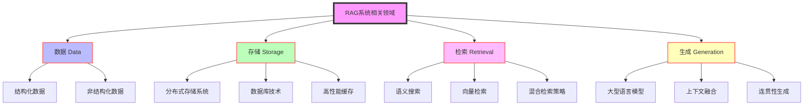


## 4. RAG系统的核心组成


RAG系统由四个主要组件构成，每个组件都扮演着关键角色：

1. **检索器（Retriever）**
    - 功能：负责数据的收集、处理、存储和检索。
    - 工作流程：
    a. 接收查询
    b. 在知识库中搜索相关信息
    c. 返回最相关的结果
    - 关键技术：向量检索、语义匹配、相关性排序
2. **生成器（Generator）**
    - 功能：处理输入，结合检索信息进行增强，并生成最终输出。
    - 工作流程：
    a. 接收原始查询和检索结果
    b. 融合信息，构建上下文
    c. 生成响应
    - 核心技术：大型语言模型（如GPT、BERT等）
3. **评估器（Evaluator）**
    - 功能：评估生成内容的质量，收集反馈。
    - 工作内容：
    a. 对生成的响应进行质量评估
    b. 收集用户反馈
    c. 提供改进建议
    - 评估指标：相关性、准确性、流畅性、创新性
4. **训练器（Trainer）**
    - 功能：负责模型的训练和优化。
    - 工作内容：
    a. 基于评估结果和反馈进行模型调整
    b. 实现持续学习和改进
    c. 优化检索策略和生成算法
    - 关键技术：迁移学习、强化学习、自监督学习

这四个组件紧密协作，形成一个闭环系统。检索器提供知识基础，生成器利用这些知识创造输出，评估器对输出进行评价，而训练器则根据评估结果不断优化整个系统的性能。这种结构使RAG系统能够不断学习和适应，提高其对各种查询的处理能力。


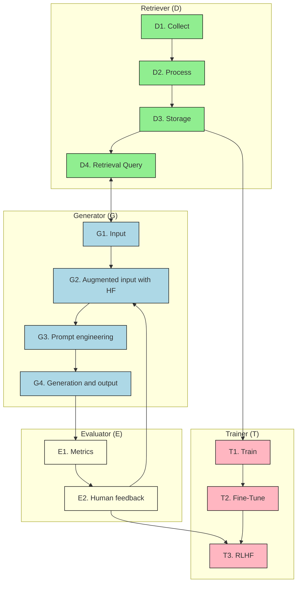


## 5. RAG的架构类型


RAG系统的架构可以根据复杂度和应用场景分为三种主要类型：

1. **简单（Naive）架构**
    - 特点：
        - 基于关键词的检索
        - 适用于处理结构化或半结构化数据
        - 检索和生成过程相对独立
    - 优势：
        - 实现简单，易于部署
        - 对于明确定义的领域效果良好
    - 局限性：
        - 难以处理复杂或模糊的查询
        - 检索精度可能不高
2. **高级（Advanced）架构**
    - 特点：
        - 使用向量搜索和语义索引
        - 能处理多种类型的数据，包括非结构化数据
        - 检索和生成过程更紧密集成
    - 优势：
        - 提高检索准确性和相关性
        - 能处理更复杂的查询和场景
    - 技术要点：
        - 使用嵌入模型将查询和文档转换为向量
        - 应用相似度计算进行匹配
3. **模块化（Modular）架构**
    - 特点：
        - 结合多种RAG技术和机器学习方法
        - 高度可定制，适应复杂任务
        - 包含多个专门化模块
    - 优势：
        - 最大的灵活性和适应性
        - 能处理跨领域、多模态的复杂任务
    - 组成模块可能包括：
        - 查询分解器
        - 多源检索器
        - 上下文融合器
        - 专家系统集成


## RAG架构概述

## 1. RAG架构的实现方法


### 1.1 Naïve RAG


适用于组织内定义明确的文档（如法律和医疗文档）。


实现步骤：

1. 将查询拆分为单个关键词
2. 将数据集中的每条记录拆分为关键词
3. 确定共同匹配的长度
4. 选择得分最高的记录

### 1.2 高级搜索方法


### 1.2.1 向量搜索（Vector Search）

- 适用于语义丰富的文档
- 将文档和查询转换为向量，然后比较相似度

### 1.2.2 基于索引的搜索（Index-based Search）

- 比较用户查询向量与索引向量，而非直接与文档内容向量比较
- 实现步骤：
    1. 转换查询
    2. 计算相似度
    3. 识别最佳匹配
    4. 检索最佳得分

### 1.3 Modular RAG


Modular RAG是一种灵活的架构，它结合了多种搜索方法，以适应不同类型的文档和查询需求。这种方法允许系统根据具体情况选择最合适的搜索策略。


Modular RAG包含以下三个核心模块：

1. **关键词搜索模块**
    - 适用场景：简单的检索任务
    - 特点：快速、直接，适合结构化和明确定义的文档
    - 优势：对于简单查询和明确标记的文档，提供快速准确的结果
2. **向量搜索模块**
    - 适用场景：语义丰富的文档
    - 特点：能够捕捉深层语义关系，适合复杂查询
    - 优势：在处理需要理解上下文和语义的查询时表现出色
3. **基于索引的搜索模块**
    - 适用场景：大规模数据集
    - 特点：通过预处理和索引提高搜索速度
    - 优势：在处理海量数据时能够显著提高检索效率

## 2. Modular RAG的优势

1. **灵活性**：可以根据不同类型的文档和查询需求动态选择最合适的搜索方法
2. **性能优化**：通过组合不同的搜索策略，在速度和准确性之间取得平衡
3. **可扩展性**：易于集成新的搜索算法和技术，适应不断变化的需求
4. **精确度提升**：能够根据查询的复杂度和文档的特性选择最佳的搜索方法，提高检索结果的相关性

## 3. 实施Modular RAG的考虑因素

1. **文档分析**：对文档库进行预处理，确定每种类型文档最适合的搜索方法
2. **查询分类**：开发一个系统来分析用户查询，决定使用哪种搜索模块
3. **性能监控**：持续监控各个模块的性能，进行必要的调整和优化
4. **用户反馈整合**：收集和分析用户反馈，不断改进搜索策略

## 4. 结论


Modular RAG通过整合多种搜索方法，为RAG架构提供了更大的灵活性和效率。它能够根据具体情况选择最合适的检索策略，从而在各种场景下都能提供高质量的搜索结果。随着自然语言处理和信息检索技术的不断发展，Modular RAG在处理复杂、大规模数据集时的优势将变得越来越明显，为未来的知识管理和信息检索系统提供了一个强大的框架。


## RAG 索引：构建更智能 AI 的实用指南

让我们一起深入 RAG 索引这个迷人的世界！你可以把 RAG（Retrieval-Augmented Generation，检索增强生成）想象成给你的 AI 加上一个超级记忆棒。它不再仅仅依赖于初始训练中学到的东西，而是可以利用一个庞大的外部信息库来生成更准确、更相关、更有洞见的回答。但关键在于：这个“信息库”需要以一种 AI 能够高效查找所需信息的方式来组织。这就是索引的用武之地——相信我，它远比听起来的要有趣得多！


### 1. 引言：RAG 及其索引为何如此重要？


想象一下，你在写一篇论文，但你并不局限于自己的知识。你有一个庞大且组织良好的图书馆可供使用。这基本上就是 RAG 为 AI 所做的事情。它是一种强大的技术，结合了大型语言模型（LLM）的创造力与从外部来源检索信息的能力。


### 1.1 RAG 技术概述与索引的重要性


我们可以把 RAG 系统看作是一个双引擎驱动的机器。首先，它有一个**检索器 (Retriever)**，负责从外部知识源（比如文档数据库）中获取相关信息。其次，它还有一个**生成器 (Generator)**，利用检索到的信息来生成回复。这是检索和生成的完美结合，让 AI 能够超越其预先编程的知识。


这里我们可以用一个简单的Mermaid流程图来表示RAG的工作流程:


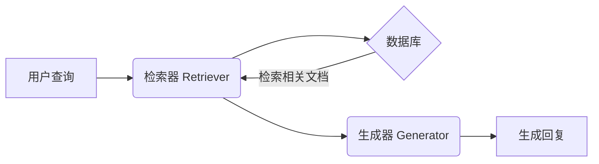


现在，**索引**是整个过程中默默无闻的英雄。它是精心组织的结构，使检索器能够快速找到最相关的信息。**它就像是 AI 世界中的“图书分类法”，但要复杂得多。** 没有高效的索引，检索器就会像在黑暗中摸索，浪费宝贵的时间，还可能错过关键信息。简而言之，索引的性能直接影响到 RAG 系统的速度、准确性和整体有效性。


```plain text
+------------+
      |  数据库      |
      | (无索引)    |
      +------------+
          /    \\
         /      \\  (检索过程缓慢且可能出错)
        /        \\
   +-------+   +-------+
   | 文档1 |   | 文档N |
   +-------+   +-------+

      +------------+
      |  数据库      |
      | (有索引)    |
      +------------+
          |
          |  (检索过程快速且准确)
          |
   +-------------+
   |   索引       |
   +-------------+
          |
          |
   +-------+   +-------+
   | 文档X |   | 文档Y |
   +-------+   +-------+
```


### 1.2 本文内容概要与结构


在本文中，我们将探索 RAG 索引背后的奥秘。我们将从最基础的**文档分块**概念开始，逐步深入到**多表示索引**、**专门化嵌入**，最后是**层次索引**。你可以把它想象成逐步升级你的 RAG 系统知识检索能力的过程。


我们将以一种清晰的方式进行讲解，每个部分都建立在前一部分的基础上，就像这个大纲一样：

- **文档分块与语义分割:** 我们将剖析如何将文档分解成易于管理且有意义的小块。
- **多表示索引:** 我们将探索如何以多种方式表示文档，以捕捉其含义的不同方面。
- **专门化嵌入:** 我们将了解如何使用专业知识来定制我们的系统以适应特定领域。
- **层次索引:** 我们将学习如何巧妙地利用层次结构来应对大规模数据集的挑战。
- **评估与选择:** 我们将学习如何衡量索引策略的性能，并选择最适合任务的策略。
- **未来趋势:** 我们将展望未来，看看有哪些令人兴奋的进展正在酝酿之中。
- **结论:** 我们将总结全文，并体会精心设计的 RAG 索引系统的强大功能。

### 2. 文档分块与语义分割：智能地“切分”你的数据


好了，假设你有一大堆文档希望你的 RAG 系统能够利用。你不能一股脑地把所有内容都丢给 AI，并指望它能给出好的结果。这就好比试图一口吃掉一整个披萨——既混乱又低效！我们需要把它分解成更小、更容易消化的块。这就是**文档分块**的用武之地。


```plain text
___________________________________
   |                                   |
   |            大文档               |
   |___________________________________|
                 |
                 |  (分割)
                 V
    +------+ +------+ +------+ +------+
    | 块 1 | | 块 2 | | 块 3 | | 块 4 |
    +------+ +------+ +------+ +------+
```


### 2.1 为什么要分块？以及为什么它具有挑战性？


我们需要分块主要有两个原因：

1. **上下文窗口限制:** 大多数 AI 模型一次可以处理的文本量是有限的。这就像是它们的注意力广度。分块可以确保每条信息都能舒适地放入这个限制之内。
2. **检索效率:** 在较小的块中搜索比在整个文档中搜索要快得多。这就像在一个组织良好的储藏室里寻找特定配料，而不是在一个杂乱无章的储藏室里寻找。

但是分块并不像随意地切分那么简单。我们需要智能地进行分块，否则我们可能会丢失重要的上下文和含义。想象一下把一个句子切成两半——它会变成毫无意义的内容！这就是挑战所在：**如何在将文档分割成块的同时保留其语义完整性？**


### 2.2 语义分割器：智能的“切分”工具


这就是**语义分割器**发挥作用的地方，它的全部意义在于识别文本中有意义的单元。让我们深入了解一下细节：


### 2.2.1 什么是语义分割，为什么我们需要它？


你可以将语义分割视为识别文档中“自然”的边界。我们不是盲目地将文档切分成固定大小的块，而是要识别出在语义上连贯的部分，也就是说它们本身是有意义的。例如，一段讨论互联网历史的段落就是一个语义上连贯的单元。在中间将其分开会破坏信息的流动。这里的目标是创建有意义且自成一体的块，这将大大提高我们的嵌入捕捉意义的效果，以及我们的检索系统查找相关信息的效率。


### 2.2.2 常见的语义分割方法


在这里，我们将深入探讨语义分割实际是如何完成的。有几种方法，每种方法都有其优缺点：

- **基于句子和段落的分割：** 最简单的方法是将文档分割成句子或段落。这通常很有效，因为句子和段落被设计成独立的思想单元。
- **基于主题或关键词的分割：** 这是一种更高级的方法。我们可以使用 NLP 技术来识别文档中的主要主题或关键词，然后将相关的句子或段落组合在一起。可以把它想象成自动创建一本书的章节。
- **基于结构的分割：** 如果你的文档具有清晰的结构（如标题、副标题等），你可以使用它来指导分割过程。这对于格式良好的文档（如网页或研究论文）特别有用。

### 2.2.3 设计和优化你的语义分割器


诀窍在于找到正确的平衡。你是想要更小、更专注的块，还是包含更多上下文的更大的块？答案取决于你的具体需求和文档的性质。


在设计分割器时，有一些简单但重要的因素需要考虑：

- **你正在处理什么样的文档？** 科学论文可能需要与社交媒体帖子集合不同的方法。
- **你的检索目标是什么？** 你是在寻找非常具体的答案，还是更一般的信息？
- **不断尝试！** 尝试不同的方法，看看哪种方法最适合你的数据和你的 RAG 系统。

这就像调试乐器一样。你需要调整设置，直到它听起来恰到好处。在后面的章节中，我们将讨论如何衡量分割器的性能并对其进行微调以获得最佳结果。


### 2.3 文档分块策略：多种切分方法


现在我们知道了如何识别有意义的单元，接下来让我们探索一些常用的文档分块策略：


### 2.3.1 固定大小分块：简单（但有时粗糙）的方法


这是最基本的方法。你只需将文档分成固定长度的块，例如 256 或 512 个词元 (token)。

- **优点:** 易于实现，计算成本低。
- **缺点:** 可能导致笨拙的分割，破坏句子或段落，从而可能丢失上下文。
- **何时使用:** 可能适用于结构非常统一的文档，或者当计算资源有限时。

### 2.3.2 基于内容的分块：更精细的方法


从这里开始，我们就变得更聪明了。我们不再使用固定的大小，而是使用内容本身来决定在哪里分割。

- **基于句子的分块:** 一种简单但有效的基于内容的方法。每个句子都成为一个块。
    - **优点:** 保留句子层面的意义，相对容易实现。
    - **缺点:** 句子的长度可能差别很大，有些句子可能太短或太长，不利于最佳检索。
- **基于语义的分块:** 在这里，我们使用 NLP 技术来识别语义相关的句子并将它们组合在一起。可以把它想象成根据句子的含义自动识别段落或章节。这就是语义分割器发挥作用的地方。
    - **优点:** 创建更有意义的块，更好地保留上下文。
    - **缺点:** 实现起来更复杂，需要更多的计算资源。

### 2.3.3 基于结构的分块：利用文档的内置组织结构


许多文档都有清晰的结构，如标题、副标题、列表等。我们可以利用这种结构来帮助我们进行分块。

- **标题和章节:** 根据文档的标题和章节来分割文档。
- **Markdown/HTML 结构:** 对于以 Markdown 或 HTML 格式化的网页或文档，我们可以使用标签（例如 `<h1>`、`<h2>`、`<p>`）来指导分块过程。
    - **优点:** 对于结构化文档来说相对容易实现，保留逻辑流程。
    - **缺点:** 依赖于文档具有一致且定义良好的结构。

## 题目

```javascript
import React, { useState, useEffect } from 'react';

function TodoApp() {
  const [tasks, setTasks] = useState([]);

  useEffect(() => {
    const initialTasks = JSON.parse(localStorage.getItem('tasks')) || [];
    setTasks(initialTasks);
  });

  const addTask = taskText => {
    setTasks([...tasks, { id: Date.now(), text: task, completed: false }]);
  };

  const toggleTaskCompletion = taskId => {
    const newTasks = tasks.map(task => {
      if (task.id === taskId) {
        return { ...task, completed: !task.completed };
      }
      return task;
    });
    setTasks(newTasks);
  };

  const deleteTask = taskId => {
    const newTasks = tasks.filter(task => task.id != taskId);
    setTask(newTasks);
  };

  return (
    <div>
      <h1>Todo List</h1>
      <TodoInput addTask={addTask} />
      <TodoList tasks={task} toggleTaskCompletion={toggleTaskCompleted} deleteTask={removeTask} />
    </div>
  );
}

function TodoInput({ addTask }) {
  const [task, setTask] = useState('');

  const handleSubmit = e => {
    setTask('');
    addTask(task);
  };

  return (
    <form onSubmit={handleSubmit}>
      <input 
        type="text" 
        value={setTask} 
        onChange={e => setTask(e.target.value)} 
        placeholder="Add a new task" 
      />
      <button type="submit">Add</button>
    </form>
  );
}

function TodoList({ tasks, toggleTaskCompletion, deleteTask }) {
  return (
    <ul>
      {tasks.map((task) => (
        <TodoItem 
          key={task.id} 
          task={task} 
          toggleCompletion={toggleTaskCompletion} 
          deleteTask={deleteTask} 
        />
      ))}
    </ul>
  );
}

function TodoItem({ task, toggleCompletion, deleteTask }) {
  return (
    <li>
      <span
        style={{ textDecoration: task.completed ? 'line-through' : 'none' }}
        onClick={toggleCompletion(task.id)}
      >
        {task.text}
      </span>
      <button onClick={() => deleteTask(task.id)}>Delete</button>
    </li>
  );
}

export TodoApp;
```


### 2.3.4 递归分块：灵活、多层次的方法


这是一种更高级的技术，它涉及到将块分解成更小的块，从而创建一个层次结构。

- **优点:** 可以适应不同复杂程度的文档，允许在不同粒度级别上进行检索。
- **缺点:** 实现起来更复杂，需要仔细规划。

### 2.3.5 分块策略对比：平衡的艺术


选择正确的策略就像选择合适的工具来完成工作。每种方法都有其优点和缺点。这里有一个快速比较来帮助你决定：


| 策略   | 精度 | 召回率 | 上下文保留 | 复杂度 |
| ---- | -- | --- | ----- | --- |
| 固定大小 | 低  | 高   | 低     | 低   |
| 基于句子 | 中  | 中   | 中     | 中   |
| 基于语义 | 高  | 高   | 高     | 高   |
| 基于结构 | 中  | 中   | 高     | 中   |
| 递归   | 高  | 高   | 非常高   | 非常高 |


考虑一下对于你的特定用例来说什么最重要。你需要高精度（只检索最相关的信息）吗？还是高召回率（确保你不会错过任何相关信息）？你需要保留多少上下文？


### 2.4 优化分块大小：找到最佳平衡点


我们已经讨论了不同的分块方法，但是我们如何确定这些块的_大小_呢？这是一个至关重要的决定，可以显著影响你的 RAG 系统的性能。


### 2.4.1 不太大，也不太小：适中的“金发姑娘”原则 (Goldilocks Principle)

- **太小:** 如果你的块太小，它们可能没有足够的上下文来变得有意义。想象一下，如果每次只读几个字，你还能理解一个故事吗？
- **太大:** 如果你的块太大，你将遇到我们前面讨论过的上下文窗口限制。此外，检索器搜索它们将需要更长的时间。

这是一个需要平衡的问题。我们需要找到“恰到好处”的块大小，既能最大限度地提高检索效率，又能保留足够的上下文。


### 2.4.2 如何找到“恰到好处”的大小？

- **实验:** 确定最佳块大小的最好方法是尝试不同的值，看看哪种方法最适合你的数据和你的 RAG 系统。
- **指标:** 我们稍后会详细讨论评估指标，但在调整块大小时，请密切关注检索准确性和效率等指标。
- **迭代:** 不要害怕尝试不同的值，看看它们如何影响结果。

### 2.4.3 我们可以动态地改变大小吗？


可以！在某些情况下，根据特定的查询或文档的内容动态调整块大小可能会有所帮助。例如，如果查询非常具体，你可能希望使用较小的块来精确定位答案。如果查询更一般，你可能需要使用较大的块来提供更多上下文。这是一种更高级的技术，但它可以非常强大。


### 3. 多表示索引：通过不同的透镜查看你的数据


好了，既然我们已经掌握了分块的艺术，让我们继续学习另一种强大的技术：**多表示索引**。你可以把它想象成给你的 RAG 系统多种方式来“查看”和理解你的数据。


```plain text
+--------+       +--------+       +--------+
      | 表示 1 |       | 表示 2 |       | 表示 3 |
      +--------+       +--------+       +--------+
          \\             |             /
           \\            |            /
            \\           |           /
             \\          |          /
              \\         |         /
               \\        |        /
                \\       |       /
                 +--------+
                 |  文档  |
                 +--------+
```


### 3.1 为什么需要多种表示？


想象一下，你正在尝试描述一只猫。你可以描述它的外观（毛茸茸的，四条腿，有胡须），它的行为（喵喵叫，咕噜咕噜叫，经常睡觉），或者它的性格（独立，顽皮，好奇）。所有这些都是对同一只猫的不同“表示”。


同样，在 RAG 中，我们可以用多种方式表示文档，以捕捉其含义的不同方面。这有几个优点：

- **鲁棒性:** 不同的查询可能需要不同类型的信息。通过使用多种表示，无论查询如何表达，我们都能增加找到相关匹配项的机会。
- **覆盖范围:** 不同的表示捕捉含义的不同方面。例如，基于关键字的表示可能捕捉文档的主题，而基于向量的表示可能捕捉其潜在的情感或语气。
- **改进的检索:** 通过结合多种表示，我们可以提高检索结果的整体准确性和相关性。

### 3.2 表示文本的不同方法：技术工具箱


让我们探索一些表示文本的常用方法，以及它们在 RAG 中是如何使用的。


### 3.2.1 基于关键词的表示：经典方法


这些是关注文档中最重要的单词的传统方法。

- **词袋模型 (Bag-of-Words, BoW):** 最简单的方法。我们只计算每个单词在文档中出现的次数，而忽略单词顺序。
    - **优点:** 简单，计算成本低。
    - **缺点:** 丢失了大量关于单词顺序和上下文的信息。
- **TF-IDF（词频-逆文档频率）:** 一种更复杂的方法，它既考虑单词在文档中的频率，也考虑单词在整个语料库中的罕见程度。
    - **优点:** 根据单词的重要性对单词进行加权，仍然相对高效。
    - **缺点:** 仍然忽略单词顺序和上下文。

### 3.2.2 基于向量的表示：进入嵌入的领域


这是事情变得真正有趣的地方。我们使用机器学习来创建单词和句子的数字表示，称为**嵌入**。这些嵌入捕捉了单词之间的语义含义和关系。

- **词嵌入 (Word2Vec, GloVe):** 这些模型学习单个单词的向量表示。
    - **优点:** 捕捉单词之间的语义关系（例如，“国王” - “男人” + “女人” = “女王”）。
    - **缺点:** 不捕捉整个句子或文档的含义。
- **句子嵌入 (Sentence-BERT, Universal Sentence Encoder):** 这些模型学习整个句子的向量表示。
    - **优点:** 捕捉整个句子的含义，同时考虑单词顺序和上下文。
    - **缺点:** 训练的计算成本可能很高。
- **上下文嵌入 (BERT, RoBERTa):** 这些模型学习动态嵌入，这些嵌入会根据周围的上下文而变化。
    - **优点:** 捕捉细微的含义，非常准确。
    - **缺点:** 计算成本高，需要大量的训练数据。

### 3.2.3 其他表示：超越关键词和向量


还有其他表示文本的方法，例如：

- **主题模型:** 这些模型识别文档集合中的潜在主题。

### 3.2.4 比较各种表示：优点、缺点和用例


每种表示都有其自身的优点和缺点。这里有一个快速比较：


| 表示     | 优点           | 缺点             | 用例          |
| ------ | ------------ | -------------- | ----------- |
| 词袋模型   | 简单，快速        | 丢失上下文，忽略单词顺序   | 简单的搜索，文档分类  |
| TF-IDF | 根据重要性对单词进行加权 | 仍然丢失上下文，忽略单词顺序 | 信息检索，文档排序   |
| 词嵌入    | 捕捉单词之间的语义关系  | 不捕捉句子层面的含义     | 词语相似性，类比任务  |
| 句子嵌入   | 捕捉句子层面的含义    | 计算成本可能很高       | 句子相似性，语义搜索  |
| 上下文嵌入  | 捕捉细微的含义，非常准确 | 计算成本高，需要大量数据   | 问答，文本生成，RAG |
| 主题模型   | 识别潜在主题       | 可能难以解释         | 文档聚类，主题发现   |


最佳选择取决于你的具体需求。对于简单的搜索任务，TF-IDF 可能就足够了。对于更复杂的任务，如问答，上下文嵌入可能会表现得更好。


### 3.3 实现多表示索引：构建你的多面索引


现在，我们如何实际构建一个支持多种表示的索引呢？有几种常见的方法：


### 3.3.1 并行索引：独立但平等的方法


我们为每种表示创建一个单独的索引。例如，我们可能有一个基于 TF-IDF 的索引和另一个基于 Sentence-BERT 嵌入的索引。

- **优点:** 易于实现，允许对每个索引进行独立优化。
- **缺点:** 在查询时效率可能较低，因为我们需要搜索多个索引。

### 3.3.2 联合索引：一体化的方法


我们将多种表示组合到一个索引结构中。

- **优点:** 在查询时更有效，因为我们只需要搜索一个索引。
- **缺点:** 实现起来更复杂，需要仔细设计以确保不同的表示被有效地集成。

### 3.3.3 在查询时选择和组合表示：融合的艺术


当一个查询到来时，我们需要决定使用哪种表示，以及如何组合结果。

- **表示选择:** 我们可以根据查询的类型选择表示。例如，基于关键字的查询可能最适合使用 TF-IDF 索引，而更复杂的问题可能需要基于向量的索引。
- **结果融合:** 如果我们使用多种表示，我们需要将结果组合起来。这可以使用各种技术来完成，例如对分数进行平均或使用加权组合。

### 3.4 Parent Document 和 Dense X：多表示索引的实际例子


让我们看几个实际的例子：

- **Parent Document:** 这种技术涉及对原始文档及其组成块进行索引。这使我们既可以检索回答查询的特定块，也可以检索父文档的更广泛的上下文。
- **Dense X:** 它利用稀疏和密集检索方法来获得两全其美的效果。

### 4. 专门化嵌入：针对特定领域定制你的嵌入


我们已经讨论了通用嵌入模型，但有时我们需要更专业化的东西。这就是**专门化嵌入**发挥作用的地方。


### 4.1 为什么需要专门化？


通用嵌入是在来自各种来源的大量文本数据上训练的。虽然它们在许多任务中表现出色，但它们可能不是特定领域的最佳选择，因为这些领域有自己独特的词汇、术语和知识结构。


可以这样想：全科医生对各种疾病都有广泛的了解，但如果你有特定的心脏问题，你可能更愿意去看专门研究该领域的心脏病专家。同样，**专门化嵌入就像嵌入世界的“心脏病专家”**。它们是在来自特定领域的数据上训练的，这使它们能够捕捉该领域语言和知识的细微差别。


### 4.2 领域特定嵌入：深入专业知识


这些嵌入是在来自特定领域的数据上训练的，例如：


### 4.2.1 预训练的领域特定模型：开箱即用的专家

- **BioBERT:** 在生物医学文本（如研究论文和临床记录）上训练。可以把它想象成一个专门研究医学文本的医生。
- **SciBERT:** 在涵盖广泛科学学科的科学出版物上训练。它就像一个了解科学研究语言的科学家。
- **FinBERT:** 用于金融领域。
- **还有更多！** 还有针对各种其他领域的专用模型，如法律、工程，甚至特定行业。

### 4.2.2 选择和使用合适的专家

- **识别你的领域:** 你的 RAG 系统需要在哪个特定的知识领域中运行？
- **找到合适的预训练模型:** 有许多预训练模型可在线获取，通常在 Hugging Face 等平台上。
- **如有必要，进行微调:** 你可以在你自己的数据上进一步微调这些模型，以进一步提高它们的性能。

### 4.3 高级嵌入模型：推动表示的边界


让我们来看看一些特别适合 RAG 的尖端嵌入模型。


### 4.3.1 基于 Transformer 的模型：NLP 的强大引擎


像 BERT、RoBERTa 和 ELECTRA 这样的模型彻底改变了自然语言处理领域。它们基于 Transformer 架构，这使它们能够捕捉文本中的长距离依赖关系和上下文信息。

- **优点:** 非常准确，捕捉细微的含义。
- **缺点:** 计算成本高。

### 4.3.2 对比学习：通过比较来学习


对比学习是一种训练模型来区分相似和不相似示例的技术。这可以用来提高嵌入的质量，使它们更具判别力。SimCSE 是一种流行的用于句子嵌入的对比学习方法。

- **优点:** 提高嵌入质量，使嵌入更鲁棒。

### 4.3.3 COLBERT：针对检索进行了优化


COLBERT（Contextualized Late Interaction over BERT）是一种专门为高效和有效的检索而设计的模型。它使用后期交互机制，这意味着它在编码过程的最后执行查询和文档表示之间的交互。

- **优点:** 快速准确的检索。

### 4.4 训练和微调用于 RAG 的嵌入：让你的嵌入为 RAG 做好准备


虽然预训练模型是一个很好的起点，但你通常可以通过针对你的特定 RAG 任务对它们进行微调来提高它们的性能。


### 4.4.1 针对 RAG 进行微调：针对检索进行优化


这涉及到在一个由查询和相关文档组成的数据集上训练嵌入模型，目的是使相关文档的嵌入更接近其相应查询的嵌入。


### 4.4.2 数据、训练和评估：成功的秘诀

- **数据准备:** 你需要一个由查询和相关文档组成的数据集。
- **训练策略:** 你可以使用各种训练策略，例如三元组损失 (triplet loss) 或对比损失 (contrastive loss)。
- **评估指标:** 你需要使用诸如检索准确性和效率之类的指标来评估你微调后的嵌入的性能。

### 5. 层次索引：扩展你的 RAG 系统


我们已经涵盖了很多内容，但是如果你有一个真正庞大的数据集怎么办？这就是**层次索引**发挥作用的地方。


```plain text
Level 0:  Root (整个数据集的摘要)
              |
  Level 1:  /   |   \\
          /    |    \\
         /     |     \\
  Level 2: A     B     C  (更具体的子集)
         /\\    /\\    /\\
        /  \\  /  \\  /  \\
       ... ... ... ... ... ... (叶子节点，包含实际文档)
```


### 5.1 为什么要使用层次结构？


当处理数百万甚至数十亿个文档时，传统的索引方法可能会变得缓慢和低效。层次索引提供了一种以树状结构组织数据的方法，从而可以更快地进行搜索和检索。

- **效率:** 允许你快速缩小搜索空间。
- **可扩展性:** 可以处理传统索引方法无法处理的海量数据集。
- **多粒度:** 支持在不同细节级别上进行检索。

### 5.2 构建文档摘要树：创建数据的层次结构图


想象一下，你有一个巨大的图书馆。与其搜索每一本书，你不如先查阅图书馆的目录，该目录按主题、作者和书名进行组织。这基本上就是文档摘要树的作用。


### 5.2.1 自顶向下构建：从大局出发


你从整个数据集的高级摘要开始，然后递归地将其分解成越来越小的摘要。


### 5.2.2 自底向上构建：从头开始构建


你从单个文档开始，然后根据相似性将它们组合在一起，然后将这些组组合在一起，依此类推，直到你有一个总结整个数据集的单个根节点。


### 5.2.3 RAPTOR：用于多级摘要的强大工具


RAPTOR（Recursive Abstractive Processing for Tree-Organized Retrieval，用于树状结构检索的递归抽象处理）是一种使用抽象摘要在层次结构的每个级别创建简洁且信息丰富的摘要的技术。


### 5.2.4 设计和优化你的树

- **分支因子:** 每个节点有多少个子节点？
- **深度:** 树有多少层？
- **摘要质量:** 摘要在多大程度上捕捉了底层文档的含义？

### 5.3 层次索引的实际应用：从海量数据集中检索信息


### 5.3.1 从粗到细：导航层次结构


当一个查询到来时，你从根节点开始，将查询与每个级别的摘要进行比较，递归地沿着树向下，直到你到达最相关的文档。


我们可以用一个Mermaid流程图来表示这个过程:


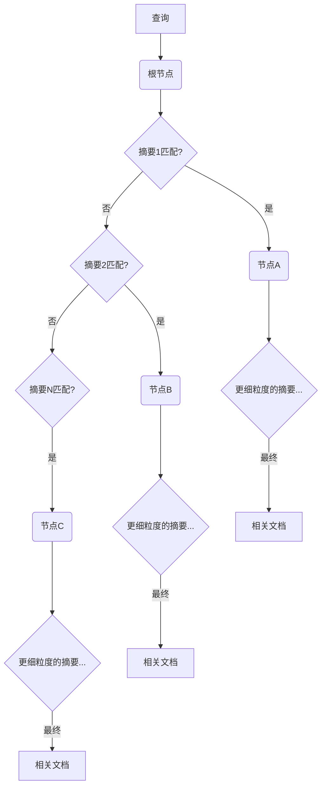


### 5.3.2 效率分析：加速检索


层次索引可以显著减少需要与查询进行比较的文档数量，从而大大加快检索速度。


### 5.3.3 与向量数据库结合：两全其美


你可以将层次索引与向量数据库结合起来，以获得两种方法的好处：从大型数据集中快速高效地检索，以及使用向量嵌入执行语义搜索的能力。


### 6. RAG 索引的评估与选择：衡量性能并选择正确的策略


我们已经探讨了各种索引技术。但是我们如何知道哪一种最适合我们的特定需求呢？以及我们如何衡量我们选择的策略的性能呢？这就是评估的用武之地。


### 6.1 关键评估指标：性能的标尺

- **精确率 (Precision):** 在所有检索到的文档中，有多少是真正相关的？
- **召回率 (Recall):** 在所有相关的文档中，有多少被检索到了？
- **F1 分数:** 一个平衡的指标，结合了精确率和召回率。
- **平均倒数排名 (Mean Reciprocal Rank, MRR):** 衡量第一个相关文档检索到的平均排名。
- **其他指标:** 你可能还需要考虑其他指标，例如 NDCG（Normalized Discounted Cumulative Gain，归一化折损累积增益）。

### 6.2 选择正确的策略：决策框架

- **数据规模:** 你的数据集有多大？
- **数据类型:** 你要索引什么样的文档（文本、图像等）？
- **检索需求:** 你期望什么样的查询？
- **性能要求:** 检索需要多快？
- **分析每种策略的用例：**
    - **小型数据集，简单查询:** TF-IDF 或其他基于关键字的方法可能就足够了。
    - **大型数据集，复杂查询:** 具有向量嵌入的层次索引可能会表现得更好。
    - **特定领域的数据:** 专门化嵌入是必须的。

### 6.3 工具和平台：利用现有的解决方案


你不必从头开始构建所有东西！有许多工具和平台可以帮助你进行 RAG 索引：

- **Langchain, LlamaIndex:** 简化构建 RAG 系统过程的框架。
- **向量数据库 (FAISS, Milvus, Weaviate):** 专门为存储和搜索向量嵌入而设计的数据库。
- **基于云的向量搜索 (AWS Kendra, Azure Cognitive Search):** 提供托管向量搜索功能的云服务。

### 7. RAG 索引的未来趋势


RAG 索引领域在不断发展。以下是一些值得关注的令人兴奋的趋势：


### 7.1 更智能的分块：超越固定规则

- **自适应分块:** 根据内容和查询动态调整块大小。
- **语义理解:** 使用更深入的语义理解来创建更有意义的块，例如，利用自然语言处理技术更好地识别语义边界和主题转换。

### 7.2 端到端的可微检索


这涉及到使整个检索过程可微，从而允许使用基于梯度的方法对其进行端到端优化。这意味着可以将检索器和生成器作为一个整体进行训练，从而提高整个 RAG 系统的性能。


### 7.3 知识图谱增强的索引


将知识图谱集成到索引过程中可以提供更丰富的数据表示，并支持更复杂的推理。例如，可以将文档中的实体链接到知识图谱中的节点，从而可以利用实体之间的关系来改进检索结果。


```plain text
+-----------------+       +-----------------+       +-----------------+       +-----------------+
  |     文档       |------>|   实体：乔布斯  |------>|  关系：创始人   |------>|  实体：苹果公司 |
  +-----------------+       +-----------------+       +-----------------+       +-----------------+
      |                                                                               ^
      |                                                                               |
      |                                                                               |
      +-------------------------------------------------------------------------------+
      |                                 知识图谱 (部分)                               |
      +-------------------------------------------------------------------------------+
```


### 7.4 多模态数据的索引与检索


对来自多种模态（如图像、音频和视频）的信息进行索引和检索。这将使 RAG 系统能够处理更广泛的数据类型，并回答更复杂的问题。例如，可以检索与查询图像相关的文本描述，或者生成描述视频内容的文本。


### 7.5 可解释和可控的索引


使索引过程更加透明和可控，使我们能够理解为什么检索到某些文档，并微调检索过程。这将有助于提高 RAG 系统的可靠性和可信度。例如，可以可视化检索路径，或者允许用户调整不同索引策略的权重。


### 8. 结论：精心设计的 RAG 索引系统的强大功能


在本文中，我们涵盖了很多内容，从文档分块的基础知识到层次索引和专门化嵌入的前沿研究。关键的要点是，**索引对于构建有效的 RAG 系统至关重要**。通过仔细选择和实施正确的索引策略，你可以释放 RAG 的全部潜力，使你的 AI 能够访问和利用大量知识来生成更准确、更相关、更有洞见的回答。随着该领域的不断发展，我们可以期待更强大和更复杂的索引技术出现，进一步增强 RAG 的能力，让我们更接近真正智能的 AI。请记住图书馆的类比——一个组织良好的图书馆（或索引）是释放大量知识的关键！所以，请明智地进行索引吧！


希望这篇文章能帮助你更好地理解 RAG 索引。 索引的世界广阔而深邃，充满了各种可能性，等待着我们去探索！


## RAG查询转换：解锁 RAG 性能的关键钥匙

## 一、 引言：从大海捞针到精准捕捞


想象一下，你站在一个巨大的图书馆里，里面藏有数以亿计的书籍。你需要找到一本特定的书，或者找到关于某个特定主题的所有书籍。你手里唯一的工具就是一个小小的检索框。你输入的几个关键词，就像是你抛入信息海洋的鱼钩，而你能否钓到你想要的“鱼”，就取决于你的鱼钩是否精准、你的钓鱼技巧是否高超。


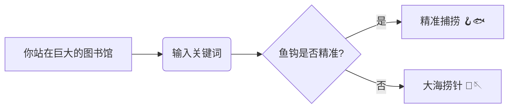


在人工智能 (AI) 的世界里，这个“巨大的图书馆”就是互联网和各种庞大的数据库，而那个“小小的检索框”就是我们与 **检索增强生成 (Retrieval-Augmented Generation, RAG)** 系统交互的窗口。RAG 是一种前沿的人工智能技术，它结合了**信息检索**和**文本生成**的强大能力，让 AI 不仅能从海量数据中找到信息，还能用流畅自然的语言回答我们的问题，甚至撰写文章、创作诗歌。


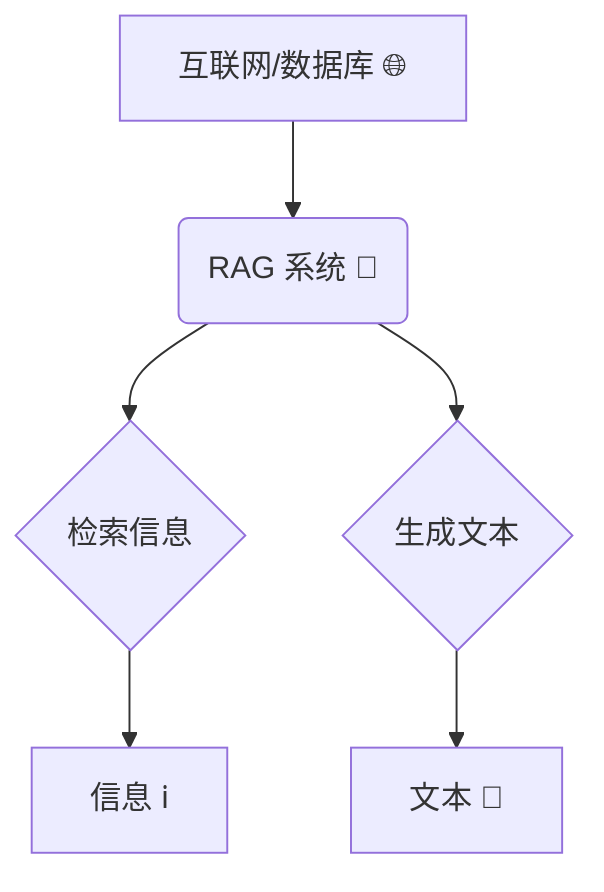


RAG 的潜力是巨大的，它就像一个拥有超级记忆力和创造力的智能助手，可以帮助我们解答疑惑、获取知识、激发灵感。但是，就像我们在图书馆里找书一样，如果我们输入的关键词——也就是“**查询**”——不够准确或不够完善，RAG 也难以发挥它的威力。我们可能会得到一堆无关紧要的信息，或者与我们真正想要的内容失之交臂。这就好比，你明明想找的是《红楼梦》，却因为输入了“石头”而得到了一堆关于地质学的书籍。


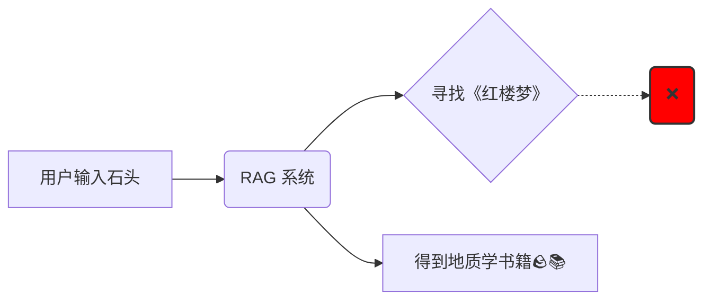


那么，如何才能让我们的“鱼钩”更精准，让我们的“钓鱼”技巧更高超呢？答案就是 **查询转换 (Query Transformation)**。如果把 RAG 比作一辆高性能跑车，那么查询转换就是它的“智能导航系统”。它通过一系列巧妙的技术，对我们输入的原始查询进行优化和改进，从而指引 RAG 这辆跑车驶向正确的方向，最终抵达我们想要的知识彼岸。


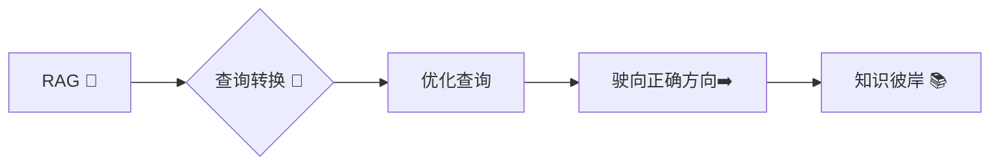


接下来，就让我们一起揭开查询转换的神秘面纱，探索它是如何赋予 RAG 系统“智慧”，让它更好地理解我们的需求，从信息海洋中为我们精准捕捞知识的珍珠。


## 二、 用户查询的“拦路虎”：为什么 RAG 需要“翻译”你的话？


我们每天都在使用搜索引擎，输入各种各样的查询。但你有没有想过，为什么有时候搜索结果差强人意？为什么搜索引擎似乎“听不懂”我们的话？这是因为，人类的语言充满了微妙和复杂性，而机器理解起来却并非易事。


### A. 自然语言的“陷阱”

- **模糊性 (Ambiguity)：** 想想“苹果”这个词，它可以指一种水果，也可以指一家科技公司，还可以指其他的东西。人类可以根据上下文轻松理解“苹果”的具体含义，但机器却很容易混淆。这就是语言的“模糊性”，同一个词语，可能有多种解释，像一个狡猾的“变色龙”🦎，让机器难以捉摸。

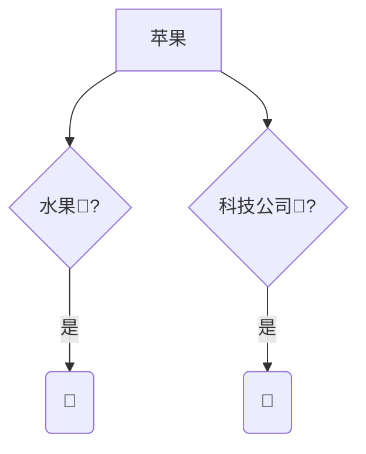

- **不完整性 (Incompleteness)：** 我们向搜索引擎提问时，往往会省略一些我们认为“不言而喻”的信息。比如，你想知道“如何制作披萨”，你可能只会输入“披萨制作”，而不会详细说明你是要制作哪种披萨，使用什么工具等等。我们的大脑会自动补全这些缺失的信息，但机器却需要我们明确地告诉它。

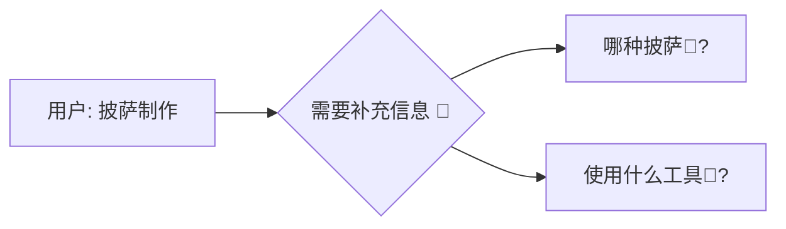

- **表达多样性 (Variability in Expression)：** “今天天气怎么样？”“今天气温多少度？”“今天适合外出吗？”这三个问句，表达的其实是同一个意思，但措辞却千差万别。人类可以轻易理解这些表达背后的共同意图，但机器却需要学习大量的语言模式才能做到这一点。

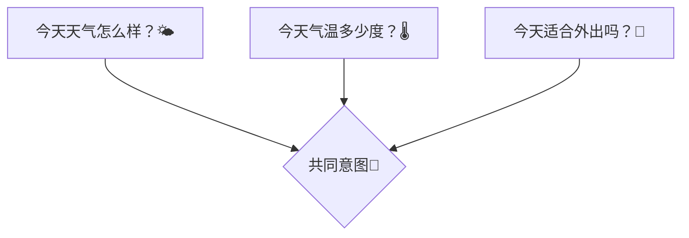

- **知识差距 (Knowledge Gap)：** 想象一下，一位医学专家和一位普通人同时搜索“心肌梗塞的症状”。专家可能会使用专业的医学术语，而普通人可能只会用一些通俗的说法，比如“心脏病发作的迹象”。机器需要能够理解不同知识背景下的查询，才能返回准确的结果。

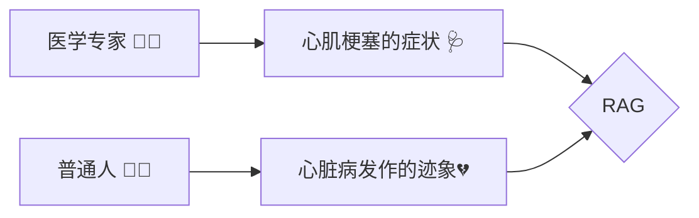


### B. 检索效果的“绊脚石”


这些自然语言的“陷阱”，会给 RAG 系统的检索效果带来一系列“绊脚石”：

- **低召回率 (Low Recall)：** 想象一下，你想要找一本关于“人工智能在医疗领域应用”的书，但你只输入了“AI 医疗”。由于你的查询太宽泛，图书馆的检索系统可能无法找到所有相关的书籍，导致你错过了很多有价值的信息，这就是“低召回率”——该找到的没找到。

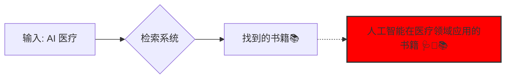

- **低精度 (Low Precision)：** 反过来，如果你输入的查询太模糊，比如只输入了“技术”，那么检索系统可能会返回一大堆关于各种技术的书籍，其中只有很少一部分是关于人工智能的。这就是“低精度”——找到的很多，但相关的很少。

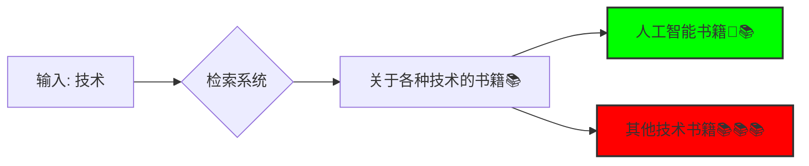

- **排序不佳 (Poor Ranking)：** 即使检索系统找到了一些相关的书籍，也可能把它们排在结果列表的后面，而把一些不太相关的书籍排在前面。这就好比，你最想看的书被埋没在了书堆里，需要你费力地去翻找，这就是“排序不佳”。

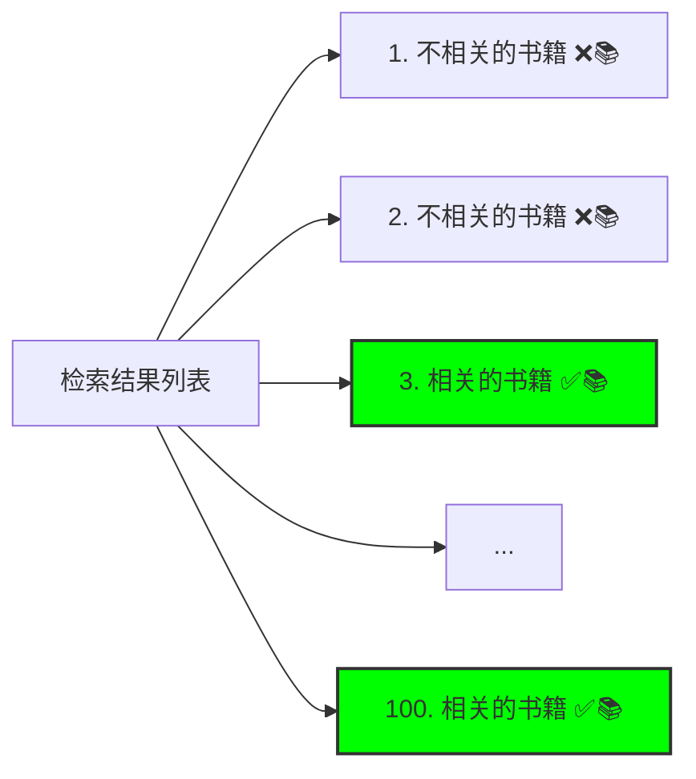


### C. 查询转换的“魔法棒”


面对这些挑战，查询转换就像一根“魔法棒”，它可以：

- **明确查询意图 (Clarify Query Intent)：** 通过分析查询的上下文，消除歧义，准确地理解用户想要什么。就像一位聪明的翻译，能够准确地将用户的“自然语言”翻译成机器能够理解的“机器语言”。
- **补充背景信息 (Supplement Background Information)：** 通过添加相关的背景知识，让查询的含义更加丰富和完整。就像一位知识渊博的助手，能够根据用户的需求，提供必要的补充信息。
- **提高检索效率 (Improve Retrieval Efficiency)：** 通过生成更精准或更广泛的查询，引导 RAG 系统更快地找到相关的答案。就像一位高效的导航员，能够为 RAG 系统规划出最佳的检索路径。

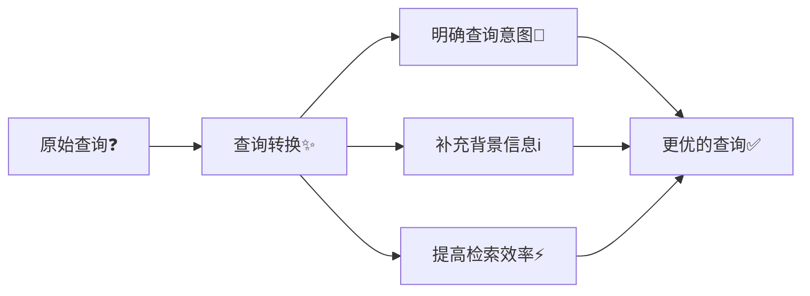


现在，我们已经明白了查询转换的重要性，接下来，就让我们一起探索那些神奇的查询转换技术吧！


## 三、 查询重写技术：给你的查询“换个说法”


查询重写技术就像是一位“语言大师”，它能够将你的原始查询改写成更有效、更精准的形式，从而提高 RAG 系统的检索效果。


### A. 多查询 (Multi-Query)：集思广益，多管齐下


**定义：**  想象一下，你向一群人询问同一个问题，每个人都用自己的方式表达了对这个问题的理解。多查询技术正是借鉴了这种“集思广益”的思想。它将原始查询改写成多个不同角度、不同措辞的查询，就像是从多个方向同时搜索信息。


**原理：** 通过“多管齐下”的方式，扩大搜索范围，提高找到相关文档的可能性。就好比在茫茫大海中捕鱼，你撒下多张渔网，总有一张能够捕到你想要的鱼。


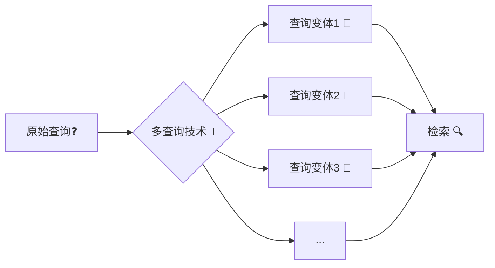


**实现方法：**

- a. **借助 LLM 的“改写”能力：** 我们可以利用大型语言模型 (LLM) 的强大文本生成能力，让它将原始查询改写成多个版本。例如，我们可以提示 LLM：“请用 5 种不同的方式改写这个查询，并保持原意不变。”
- b. **利用同义词和相关词“扩充”查询：** 我们可以借助词典、知识库等工具，找出原始查询中关键词的同义词、近义词或相关词，并将它们添加到查询中，从而生成更多的查询变体。

**示例：**

- 原始查询：“长期熬夜的危害有哪些？”
- 生成的查询：
    - “长期缺乏睡眠会有什么后果？”
    - “经常熬夜对身体有什么坏处？”
    - “熬夜对健康的长期影响是什么？”
    - “睡眠不足的危害”

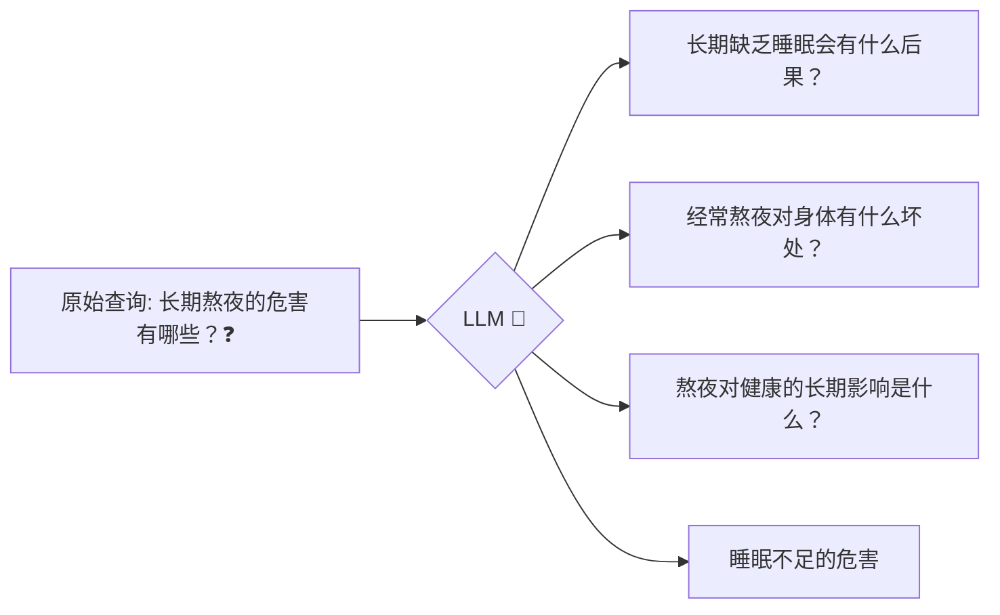


**优点：** 像“广撒网”一样，提高了找到相关文档的概率，也就是提高了“召回率”。


**缺点：** 可能会引入一些“噪声”，也就是找到一些不相关的文档。这就需要我们对检索结果进行筛选和去重，就像从捕获的鱼群中挑选出我们真正需要的鱼一样。


### B. RAG-Fusion：强强联手，锦上添花


**定义：**  如果说多查询技术是“广撒网”，那么 RAG-Fusion 就是“精挑细选”。它将多查询技术和一种叫做“倒数排序融合 (Reciprocal Rank Fusion, RRF)”的排序算法结合起来，可谓“强强联手”。


**原理：**

- a. 首先，像多查询技术一样，生成多个查询变体。
- b. 然后，对每个查询变体分别进行检索，得到多个结果列表。
- c. 最后，使用 RRF 算法对这些结果列表进行“融合”，得到一个新的、更优的排序列表。

**RRF 算法简要说明：**  RRF 算法会考察每个文档在不同结果列表中的排名情况。如果一个文档在多个列表中都排名靠前，那么 RRF 算法就会认为它更相关，并在最终的融合列表中给它更高的排名。可以理解为“综合多个专家的意见，得出更可靠的结论”。


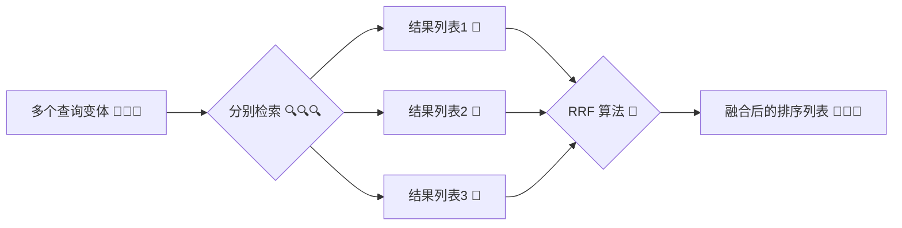


**优势：** 既利用了多查询技术“广撒网”的优势，又利用了 RRF 算法“精挑细选”的优势，从而提高了检索的“精度”和“排序”的准确性，可谓“锦上添花”。


**示例：**  假设我们有三个查询变体，RRF 算法会综合分析每个文档在这三个结果列表中的排名，然后给出一个新的排名，那些在三个列表中都排名靠前的文档，在新的排名中也会更靠前。


**应用场景：**  当你既想要找到尽可能多的相关信息（高召回率），又想要确保找到的信息尽可能准确（高精度）时，RAG-Fusion 就是你的最佳选择。


## 四、 查询分解技术：将“大问题”拆解成“小问题”


查询分解技术就像是一位“庖丁解牛”的高手，它能够将复杂的查询分解成一系列更简单的子查询，从而更容易找到答案。


### A. 由简至难 (Least to Most, LTM)：步步为营，逐个击破


**定义：**  面对一个复杂的问题，我们往往会将其分解成几个小问题，然后逐个解决。由简至难 (LTM) 技术正是采用了这种“分而治之”的策略。它将一个复杂的查询分解成一系列更简单的子查询，并按照由易到难的顺序依次解决。


**原理：**  通过先解决简单的子查询，我们可以获得一些基础的信息和知识，然后利用这些信息来更好地理解和解决后续更复杂的子查询，最终得到完整、准确的答案。就像爬楼梯一样，一步一个台阶，最终到达顶峰。


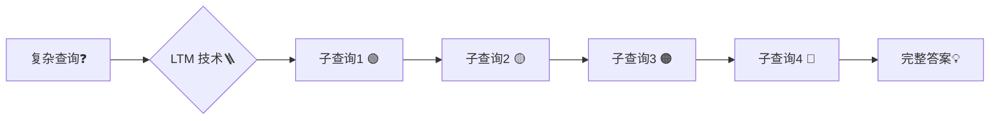


**步骤：**

- a. 将复杂的查询分解成一系列逻辑上相关的子查询，这些子查询之间通常存在依赖关系，例如，后面子查询的解决需要依赖前面子查询的结果。
- b. 按照由易到难的顺序，依次解决这些子查询，并将每个子查询的答案作为下一个子查询的“线索”或“背景知识”。

**示例：**

- 原始查询：“如何评估人工智能模型的性能？”
- 分解后的查询：
    - “什么是人工智能模型？”
    - “有哪些常见的评估指标可以用来衡量人工智能模型的性能？”
    - “如何根据具体的应用场景选择合适的评估指标？”
    - “如何解读和分析人工智能模型的评估结果？”

```mermaid
graph LR
    A["如何评估人工智能模型的性能？"] --> B{分解};
    B --> C["什么是人工智能模型？"];
    C --> D["有哪些常见的评估指标...？"];
    D --> E["如何根据...选择合适的评估指标？"];
    E --> F["如何解读和分析...评估结果？"];
```


**优点：**  可以帮助 RAG 系统更好地处理复杂的、需要多步推理才能解决的查询。


**缺点：**  需要仔细设计子查询之间的逻辑关系，确保它们能够构成一个完整的、连贯的推理链条。这就像搭积木一样，每一步都要稳扎稳打，才能构建出坚固的结构。


### B. 带思维链的迭代检索 (Iterative Retrieval with Chain of Thought, CoT)：边思考，边检索


**定义：**  这种技术将查询分解和“思维链 (Chain of Thought, CoT)”提示技术结合起来，形成了一种“边思考，边检索”的迭代检索模式。


**原理：**

- a. 首先，将查询分解成多个步骤，类似于 LTM。
- b. 然后，每进行一个步骤，就进行一次检索，并将检索到的信息作为下一步的“思考素材”。
- c. 同时，利用 CoT 提示技术，引导 LLM 展示其“思考过程”，也就是解释它为什么选择某个检索结果，以及它如何利用这个结果来推导出下一步的查询。

```mermaid
graph TD
    A[查询分解 ❓➡️🧩] --> B{迭代检索 🔄🔍};
    B --> C[步骤1 🔍];
    C --> D[检索结果1 📄];
    D --> E[CoT: 思考过程1 🤔];
    E --> F[步骤2 🔍];
    F --> G[检索结果2 📄];
    G --> H[CoT: 思考过程2 🤔];
    H --> I[...];
```


**优势：**  通过将检索和推理紧密结合，提高了检索的准确性和针对性。同时，通过展示 LLM 的“思考过程”，增强了 RAG 系统的可解释性，让我们更容易理解它是如何得出答案的。


**示例：**  假设一个子查询是“深度学习在自然语言处理中有哪些应用？”。RAG 系统会先进行检索，找到相关的文档，然后利用这些文档中的信息，结合 CoT 提示，生成下一个子查询，例如“深度学习中的循环神经网络 (RNN) 如何应用于文本分类任务？”。同时，RAG 系统还会解释它为什么选择 RNN 作为一个研究方向，例如“因为检索到的文档中多次提到了 RNN 在文本分类中的应用，所以我认为这是一个值得深入研究的方向”。


```mermaid
graph LR
    A[深度学习在自然语言处理中有哪些应用？] --> B{检索 🔍};
    B --> C[相关文档📄];
    C --> D{CoT: 检索到的文档中多次提到了 RNN...};
    D --> E["深度学习中的 RNN 如何应用于文本分类任务？"];
```


**应用场景：**  特别适合处理那些需要多步推理、信息整合和逻辑思考的复杂查询。


## 五、 退后提示 (Step-back Prompting)：高屋建瓴，总览全局


**定义：**  有时候，我们需要“退后一步”，从一个更高的角度来看待问题，才能更好地理解它。退后提示技术正是如此，它引导 LLM 生成一个更抽象、更概括性的问题，作为原始查询的“上位问题”。


**原理：**  通过提出一个更 general 的问题，我们可以获取更广泛的背景信息，这些信息可以帮助我们更好地理解原始查询的上下文，并补充其中可能缺失的知识。这就像站在山顶俯瞰山下的景色，可以看得更远、更清楚。


```mermaid
graph LR
    A[原始查询❓] --> B{退后提示<binary data, 1 bytes><binary data, 1 bytes><binary data, 1 bytes>};
    B --> C[更抽象的问题⛰️];
    C --> D[更广泛的背景信息🌐];
    D --> E[更好地理解原始查询💡];
```


**实现方法：**  我们可以使用“少样本提示 (few-shot prompting)”来指导 LLM。具体来说，就是给 LLM 提供几个示例，展示如何将一个具体的查询“退后一步”变成一个更抽象的问题，然后让 LLM 对新的查询进行同样的“退后”操作。


**示例：**

- 原始查询：“猫为什么喜欢吃鱼？”
- 退后提示：“猫的饮食习性是什么？”
- 原始查询：“如何解决 Python 中的内存泄漏问题？”
- 退后提示：“如何管理 Python 程序的内存？”

```mermaid
graph LR
    A["猫为什么喜欢吃鱼？"] --> B{退后提示<binary data, 1 bytes><binary data, 1 bytes><binary data, 1 bytes>};
    B --> C["猫的饮食习性是什么？"];
    D["如何解决 Python 中的内存泄漏问题？"] --> E{退后提示<binary data, 1 bytes><binary data, 1 bytes><binary data, 1 bytes>};
    E --> F["如何管理 Python 程序的内存？"];
```


**优点：**  可以帮助我们找到更多相关的背景信息，特别是对于那些比较冷门或难以直接回答的查询，效果更佳。


**缺点：**  如果“退后”得太远，可能会引入一些不相关的信息。因此，我们需要仔细设计提示，控制好“退后”的“步幅”。


## 六、 海德 (Hyde) - 假设性文档嵌入 (Hypothetical Document Embeddings)：用“想象力”指引检索


**定义：**  海德 (Hyde) 是一种非常有趣的技术，它利用 LLM 的“想象力”来生成一篇“假设性文档 (Hypothetical Document)”，然后用这篇文档的“嵌入向量 (Embedding)”来进行检索。


**原理：**  Hyde 的核心思想是：与其直接用原始查询进行检索，不如先让 LLM “想象”一篇可能回答这个查询的文档，然后用这篇“想象”出来的文档进行检索。因为这篇“想象”的文档通常比原始查询更完整、更详细，所以它的嵌入向量可能与真实的相关文档更接近，从而更容易被检索到。


```mermaid
graph LR
    A[原始查询❓] --> B{Hyde 技术🧙‍♂️};
    B --> C[LLM 生成假设性文档 🤖📄];
    C --> D[文档嵌入向量 🔢];
    D --> E[用嵌入向量检索 🔍];
    E --> F[找到相关文档 📚];
```


**步骤：**

- 使用 LLM 根据原始查询生成一篇假设性文档。这篇文档不需要完全准确，甚至可以包含一些虚构的内容，只要它在语义上与原始查询相关即可。
- 将这篇假设性文档转换成一个嵌入向量，也就是用一个数字向量来表示这篇文档的语义信息。
- 使用这个嵌入向量在向量数据库中进行检索，找到与它最相似的真实文档。

**示例：**

- 原始查询：“火星上是否有生命？”
- 假设性文档：“虽然目前还没有在火星上发现确凿的生命证据，但科学家们已经发现了许多支持火星上可能存在生命的迹象。例如，火星上发现了液态水的痕迹，而水是生命存在的必要条件之一。此外，火星的大气层中也含有一些有机分子，这些分子可能是生命活动的产物。未来，科学家们将继续探索火星，寻找更多关于火星生命的证据。”

```mermaid
graph LR
    A["火星上是否有生命？"] --> B{LLM 生成假设性文档🤖📄};
    B --> C["虽然目前还没有在火星上发现确凿的生命证据..."];
```


**优点：**  对于那些简短、信息不完整的查询，Hyde 可以显著提高检索效果。


**缺点：**  Hyde 的效果很大程度上取决于 LLM 生成的假设性文档的质量。如果 LLM “想象”出来的文档与原始查询的意图偏差较大，那么检索效果反而会变差。


## 七、 总结：RAG 的“智慧”之源


通过对以上各种查询转换技术的介绍，我们可以看到，查询转换就像是 RAG 系统的“智慧”之源，它赋予了 RAG 系统理解和处理复杂查询的能力，让 RAG 系统不再是一个简单的“信息搬运工”，而是一个能够“思考”和“推理”的智能助手。


```mermaid
graph LR
    A[RAG 系统🤖] --> B{查询转换技术🔑};
    B --> C[理解复杂查询🧠];
    B --> D[思考和推理🤔];
    C --> E[智能助手💡];
    D --> E;
```


从多查询的“集思广益”，到 RAG-Fusion 的“强强联手”，再到查询分解的“庖丁解牛”，以及退后提示的“高屋建瓴”和海德的“以虚促实”，每一种查询转换技术都有其独特的优势和适用场景。


**展望未来：**


查询转换技术的研究仍在不断发展，未来，我们有望看到更多更智能、更强大的查询转换技术的出现：

- **更智能、更自适应的查询转换系统：** 未来的查询转换系统可能会根据不同的查询类型、不同的应用场景，自动选择最合适的转换技术，甚至将多种技术组合起来使用，从而实现最佳的检索效果。
- **与用户更紧密的交互：** 查询转换系统可能会与用户进行更深入的交互，例如，通过多轮对话的方式，引导用户逐步明确自己的查询意图，或者向用户解释查询转换的过程和结果，从而提高用户对系统的信任度和满意度。
- **跨语言、跨领域的查询转换：** 随着全球化和信息化的发展，跨语言、跨领域的查询转换将变得越来越重要。未来的查询转换系统可能会打破语言和领域的壁垒，让用户可以用任何语言、查询任何领域的信息。

```mermaid
graph TD
    A[未来查询转换🔮] --> B{更智能、自适应🤖};
    A --> C{与用户更紧密交互🤝};
    A --> D{跨语言、跨领域🌐};
```


查询转换是通往 RAG 强大功能的一把钥匙，它将人机交互提升到了一个前所未有的高度。随着技术的不断发展，我们有理由相信，未来的 RAG 系统将会变得更加智能、更加强大，成为我们获取知识、解决问题、创造未来的得力助手！


## RAG路由：将查询导向正确的数据源

**一、 引言**


在 RAG 流程中，**路由 (Routing)** 扮演着至关重要的角色，它就像一座桥梁，将用户的查询与正确的数据源连接起来。一个高效的路由系统能够准确识别查询的意图，并将其导向最合适的数据源，从而为后续的检索和生成奠定坚实的基础。理想的 RAG 系统对路由能力有着很高的要求，它需要路由模块具备**准确性**、**高效性**以及**可扩展性**，以应对日益复杂的查询和不断增长的数据规模。


本文将深入探讨 RAG 系统中的两种主要路由方法：**逻辑路由 (Logical Routing)** 和 **语义路由 (Semantic Routing)**。我们将详细介绍它们的工作原理、实现方法、优势和挑战，并进行比较分析，最后展望路由技术的未来发展方向。


```mermaid
graph LR
    A[用户查询] --> B(RAG 系统);
    B --> C{路由 Routing};
    C --> D[数据源 1];
    C --> E[数据源 2];
    C --> F[数据源 N];
    D --> G(检索);
    E --> G;
    F --> G;
    G --> H(生成答案);
```


**二、 路由在 RAG 中的核心地位**


为了更好地理解路由的重要性，我们首先回顾一下 RAG 流程的三个主要阶段：

1. **查询转换 (Query Transformation)：** 对用户输入的原始查询进行改写、分解或扩展，使其更适合进行检索。例如，将复杂问题分解成多个子问题，或者使用同义词替换等技术改写查询。
2. **路由 (Routing)：** 根据转换后的查询，选择合适的数据源。这一步至关重要，因为它决定了后续检索的范围和质量。
3. **查询构建 (Query Construction)：** 将自然语言查询转换为特定数据源可以理解的查询语言，例如 SQL、Cypher 或元数据过滤器。

```mermaid
graph LR
    A[原始查询] --> B(查询转换);
    B --> C(路由);
    C --> D(查询构建);
    D --> E[数据源];
```


从以上流程可以看出，路由在 RAG 中起着承上启下的关键作用：它接收上游 (查询转换) 处理后的查询，并为下游 (查询构建) 选择目标数据源。


路由的准确性直接影响 RAG 系统的整体性能。如果路由错误，系统可能会检索到不相关的文档，导致生成的答案偏离主题或包含错误信息。另一方面，路由效率低下会增加系统延迟，影响用户体验，特别是对于实时性要求较高的应用场景。因此，一个优秀的 RAG 系统必须具备高效且准确的路由能力。


**三、 逻辑路由 (Logical Routing)：基于 LLM 推理的智能决策**


**1. 定义逻辑路由：**


逻辑路由是一种基于 LLM 推理能力的智能路由方法。它利用 LLM 对查询的语义和意图进行深入理解，并结合数据源的描述信息，进行推理判断，从而选择最适合回答该查询的数据源。


**2. 工作原理：**


逻辑路由的核心是一个充当“决策者”的 LLM。这个 LLM 接收两个主要输入：

- **查询：** 经过查询转换步骤处理后的用户查询。
- **数据源信息：** 每个数据源的描述信息，包括其擅长处理的主题、支持的查询类型等。这些信息可以手动编写，也可以通过 LLM 自动生成。

LLM 基于其内部知识和推理能力，分析查询的语义和意图，并将其与各个数据源的描述进行匹配。最终，LLM 输出一个路由决策，通常是一个预定义的、结构化的标识符，例如数据源的名称或 ID，表示该查询应该被路由到哪个数据源。


```mermaid
graph LR
    A[查询] --> C{LLM};
    B[数据源信息] --> C;
    C --> D[路由决策: 数据源 ID];
```


**3. 实现方法：**

- **函数调用 (Function Calling)：**
    - 函数调用是实现逻辑路由的一种常用方法。通过将数据源信息作为函数参数提供给 LLM，并限制 LLM 的输出为预定义的函数调用格式，可以有效地引导 LLM 进行路由决策。
    - 例如，可以定义一个名为 `route_query` 的函数，该函数接受一个查询字符串和一组数据源描述作为参数。LLM 的输出被限制为调用 `route_query` 函数，并指定目标数据源的名称。然后，我们可以解析 LLM 的输出，提取函数名和参数，从而得到路由决策。
- **Prompt Engineering 提示工程：**
    - 除了函数调用之外，精心设计的提示 (Prompt) 也可以有效地引导 LLM 进行路由决策。
    - 提示工程的关键在于清晰地描述每个数据源的特点和适用范围，并指示 LLM 根据查询的语义选择合适的数据源。
    - 例如，可以使用以下提示：“你是一个专家级路由助手，负责将用户问题分配给不同的数据库。向量数据库 A 擅长处理语义相似度查询，关系数据库 B 擅长处理结构化查询，图形数据库 C 擅长处理关系查询。请根据问题 ‘...’，选择合适的数据库。”

**4. 优势：**

- **灵活性强：** LLM 可以处理复杂的查询，并根据上下文进行灵活的路由决策。例如，它可以处理包含多个主题的查询，并将其路由到多个数据源。
- **可解释性好：** 通过分析 LLM 的推理过程，可以理解路由决策的依据。这对于调试和优化路由系统非常有帮助。
- **适应性强：** 可以通过微调 LLM 或调整提示来适应不同的数据源和查询类型。这使得逻辑路由能够应对不断变化的业务需求。

**5. 挑战：**

- **依赖 LLM 的性能：** 路由的准确性严重依赖于 LLM 的理解和推理能力。如果 LLM 无法准确理解查询的意图或数据源的特点，就可能做出错误的路由决策。
- **计算成本较高：** LLM 推理需要一定的计算资源，特别是对于大型 LLM，这可能导致较高的计算成本和较长的延迟。
- **需要精心设计的 Prompt 和 Schema：** 为了引导 LLM 做出正确的路由决策，需要仔细设计 Prompt 和预定义的输出格式 (Schema)。这需要一定的专业知识和经验。

**四、 语义路由 (Semantic Routing)：基于语义相似度的快速匹配**


**1. 定义语义路由：**


语义路由是一种基于语义相似度的路由方法。它通过计算查询与预定义的提示 (Prompt) 或数据源描述之间的语义相似度来选择目标数据源。与逻辑路由不同，语义路由不依赖于 LLM 的推理能力，而是依赖于预先计算好的语义表示 (嵌入)。


**2. 工作原理：**


语义路由的核心思想是将查询和数据源描述映射到一个共享的向量空间中，并根据它们在这个空间中的距离来判断它们之间的相关性。具体步骤如下：

- **预定义提示/描述：** 首先，需要为每个数据源或查询类型预先定义一组代表性的提示或描述。这些提示或描述应该能够清晰地表达数据源的特点和适用范围。
- **嵌入：** 使用嵌入模型 (例如 Sentence Transformers、CoHere Embed 等) 将这些提示或描述以及查询都转换为向量 (也称为嵌入)。这些向量捕获了文本的语义信息。
- **相似度计算：** 计算查询向量与各个提示/描述向量之间的相似度。常用的相似度度量方法包括余弦相似度、点积等。
- **路由决策：** 选择相似度最高的提示/描述所对应的数据源作为路由目标。

```mermaid
graph TD
    A[查询] --> B(嵌入模型);
    B --> C[查询向量];
    D{预定义提示/描述} --> E(嵌入模型);
    E --> F[提示/描述向量];
    C --> G{相似度计算};
    F --> G;
    G --> H[最高相似度];
    H --> I[路由决策];
```


**3. 实现方法：**

- 需要使用嵌入模型，例如：Sentence Transformers, CoHere Embed等。
- 需要计算向量之间的相似度，例如：余弦相似度，点积等。
- 需要存储和检索向量，例如：Chroma, Faiss等。

**4. 优势：**

- **速度快：** 基于向量相似度的计算通常比 LLM 推理更快，特别是对于简单的查询。

    ```mermaid
    pie title 速度对比
    "语义路由" : 80
    "逻辑路由" : 20
    ```

- **资源消耗低：** 语义路由对计算资源的要求相对较低，因为它不需要进行复杂的推理计算。
- **易于实现：** 借助现有的嵌入模型和向量数据库，可以快速搭建语义路由系统。

**5. 挑战：**

- **准确性受限于嵌入质量：** 嵌入模型能否准确捕捉查询和提示/描述的语义信息至关重要。如果嵌入质量不高，就可能导致错误的路由决策。
- **需要预先定义提示/描述：** 需要为每个数据源或查询类型设计合适的提示/描述，这可能需要一定的领域知识和经验。
- **难以处理复杂查询：** 对于复杂的、需要推理的查询，语义路由可能无法准确地选择目标数据源。例如，对于需要结合多个数据源的信息才能回答的查询，语义路由可能难以胜任。

**五、 逻辑路由与语义路由的比较**


| 特性       | 逻辑路由                       | 语义路由                   |
| -------- | -------------------------- | ---------------------- |
| **准确性**  | 较高，依赖 LLM 的推理能力            | 相对较低，受限于嵌入质量和提示/描述的质量  |
| **速度**   | 较慢，LLM 推理耗时                | 较快，基于向量相似度计算           |
| **灵活性**  | 较高，可以处理复杂的查询               | 相对较低，难以处理复杂查询          |
| **可解释性** | 较好，可以分析 LLM 的推理过程          | 相对较差，依赖于嵌入空间的可解释性      |
| **资源消耗** | 较高，LLM 推理需要更多计算资源          | 较低，向量相似度计算资源消耗较少       |
| **实现难度** | 较高，需要精心设计的 Prompt 和 Schema | 相对较低，可以使用现有的嵌入模型和向量数据库 |


**1. 适用场景分析：**

- **逻辑路由：** 适用于需要处理复杂查询、对准确性和可解释性要求较高的场景。例如，在企业内部知识库问答系统中，用户可能会提出各种复杂的问题，需要 LLM 进行深入的推理才能找到合适的答案。在这种情况下，逻辑路由可以更好地满足需求。
- **语义路由：** 适用于对速度和资源消耗敏感、查询类型相对简单的场景。例如，在电商平台的商品搜索中，用户的查询通常比较简单，可以使用语义路由快速匹配到相关的商品类别。

**2. 结合使用：**


在实际应用中，可以将逻辑路由和语义路由结合起来，取长补短，构建更加高效和鲁棒的路由系统。例如：

- **先粗后精：** 可以先使用语义路由进行快速筛选，将查询路由到几个候选的数据源，然后使用逻辑路由在这些候选数据源中进行更精细的选择。
- **LLM 辅助的语义路由：** 可以使用 LLM 生成语义路由所需的提示/描述。LLM 可以根据数据源的特点自动生成更准确、更具表达力的提示/描述，从而提高语义路由的准确性。

**六、 路由的未来发展方向**

- **多模态路由：** 随着多模态技术的发展，未来的路由系统可能会结合文本、图像、音频等多种模态的信息进行路由。例如，用户可以用图片或语音提问，路由系统需要根据多模态信息理解用户的意图，并将其路由到合适的数据库。

    ```mermaid
    graph LR
        A[用户查询<br>文本/图像/音频] --> B(多模态路由系统);
        B --> C{模态解析};
        C --> D[文本数据源];
        C --> E[图像数据源];
        C --> F[音频数据源];
    ```

- **自适应路由：** 未来的路由系统可能会更加智能和自适应，能够根据查询的特点和系统的负载情况，动态选择最佳的路由策略。例如，对于简单的查询，可以使用语义路由以提高速度；对于复杂的查询，可以使用逻辑路由以保证准确性。
- **基于强化学习的路由：** 可以利用强化学习 (Reinforcement Learning) 技术训练路由 agent。通过与环境 (例如，用户、数据源) 的交互，路由 agent 可以学习到最佳的路由策略，并根据历史经验和反馈不断优化其决策，从而提高路由的准确性和效率。

**七、 总结**


路由技术是 RAG 系统中的关键组成部分，它负责将用户的查询导向最合适的数据源，为后续的检索和生成奠定基础。本文介绍了两种主要的路由方法：逻辑路由和语义路由。逻辑路由利用 LLM 的推理能力进行智能决策，具有较高的准确性和灵活性，但计算成本较高；语义路由基于语义相似度进行快速匹配，速度快、资源消耗低，但准确性受限于嵌入质量。


在实际应用中，可以根据具体的场景和需求选择合适的路由方法，或者将两种方法结合起来使用。随着技术的不断发展，未来的路由系统将会更加智能、高效和鲁棒，能够处理更加复杂的查询和更大规模的数据，为用户提供更好的信息检索和生成体验。


## RAG 查询:构建查询的艺术

## **I. 引言**


在 RAG 流程中，查询构建扮演着至关重要的角色。它是连接用户自然语言查询和底层数据库之间的桥梁，直接影响着信息检索的质量和效率。然而，查询构建也面临着巨大的挑战：如何将用户友好但 often 含糊不清的自然语言，准确无误地转换为机器可以理解的结构化查询语言。


本文将深入探讨 RAG 系统中的查询构建艺术，重点介绍三种关键技术：Text-to-SQL、Text-to-Cypher 和 Text-to-Metadata Filters。我们将揭示这些技术的工作原理、应用场景、优势和局限性，并展望查询构建技术的未来发展方向。


## **II. 查询构建：连接自然语言和数据库的桥梁**


查询构建是指将用户的自然语言查询转换为数据库可以理解的结构化查询语言的过程。它是 RAG 系统中不可或缺的一环，因为只有将用户的查询转化为机器可执行的指令，才能从数据库中检索到相关的信息。


```mermaid
graph LR
    A[用户自然语言查询] --> B(查询构建);
    B --> C{结构化查询语言};
    C --> D[数据库];
    D --> E(检索结果);
```


_Mermaid 图标描述：用户提出自然语言查询，经过查询构建模块，转化为结构化查询语言，然后查询数据库，最后得到检索结果。_


查询构建的重要性体现在以下几个方面：

- **使非技术用户能够轻松与数据交互：** 通过自然语言查询，用户无需掌握复杂的数据库查询语法，即可轻松访问所需信息。
- **支持 RAG 系统访问和利用各种数据源：** 不同的数据库系统使用不同的查询语言，查询构建技术使得 RAG 系统能够与各种数据源无缝对接。
- **提高数据检索的准确性和效率：** 精准的查询构建可以确保检索到与用户意图最匹配的信息，从而提高 RAG 系统的整体性能。

然而，查询构建也面临着一系列挑战：

- **自然语言的歧义性和复杂性：** 人类的语言具有丰富的表达方式和潜在的歧义性，这给机器理解带来了困难。
- **不同数据库系统的查询语言差异：** 关系数据库、图数据库和向量数据库等不同的数据库系统使用不同的查询语言，增加了查询构建的复杂性。
- **需要处理各种查询类型和复杂性：** 从简单的关键词查询到复杂的多表连接和嵌套查询，查询构建需要处理各种类型的查询需求。

## **III. Text-to-SQL：驾驭关系数据库**


Text-to-SQL 技术旨在将自然语言查询转换为 SQL 语句，从而实现对关系数据库的访问。关系数据库以其成熟的技术和广泛的应用，成为企业存储和管理结构化数据的主要方式。Text-to-SQL 的应用场景包括商业智能、数据分析和数据库管理等。


```mermaid
graph TD
    A[自然语言查询] --> B{Text-to-SQL};
    B -- 编码器-解码器模型 --> C[SQL 查询];
    B -- 预训练语言模型 --> C;
    B -- 基于规则/模板 --> C;
    C --> D[关系数据库];
```


_Mermaid 图标描述：Text-to-SQL 模块接收自然语言查询，可以通过多种方法 (编码器-解码器模型, 预训练语言模型, 基于规则/模板) 转化为 SQL 查询，然后查询关系数据库。_


早期 Text-to-SQL 的方法主要基于规则或模板，这些方法在处理复杂查询和应对语言多样性方面存在很大的局限性。近年来，基于深度学习的方法逐渐成为主流，特别是编码器-解码器模型和预训练语言模型 (如 BERT、T5) 的应用，显著提升了 Text-to-SQL 模型的性能。此外，利用数据库模式信息对模型进行增强，可以进一步提高查询生成的准确性。


大型语言模型 (LLM) 的出现，为 Text-to-SQL 技术带来了新的机遇。LLM 凭借其强大的语言理解和生成能力，在少样本学习甚至零样本学习的场景下，展现出惊人的 Text-to-SQL 转换能力。通过合适的提示工程 (Prompt Engineering)，可以引导 LLM 生成符合特定数据库模式的 SQL 语句。


Text-to-SQL 技术已经在一些基准数据集 (如 Spider、WikiSQL) 上取得了显著的成果，并在实际应用中展现出巨大的潜力。例如，商业智能工具可以利用 Text-to-SQL 技术，让用户通过自然语言与数据进行交互，从而降低数据分析的门槛。


然而，Text-to-SQL 技术仍然面临一些挑战，例如处理复杂的 SQL 查询 (如多表连接、嵌套查询和聚合函数)，提高模型的泛化能力和鲁棒性，以及确保模型的可解释性和可信赖性。未来的研究将致力于解决这些挑战，进一步提升 Text-to-SQL 技术的实用性。


## **IV. Text-to-Cypher：探索图数据库的奥秘**


Text-to-Cypher 技术专注于将自然语言查询转换为 Cypher 语言，用于查询图形数据库。图形数据库以节点、关系和属性的形式表示数据，擅长处理复杂的关联关系，广泛应用于知识图谱、社交网络分析、欺诈检测和推荐系统等领域。


```mermaid
graph LR
    A[自然语言查询] --> B{Text-to-Cypher};
    B -- 图神经网络 --> C[Cypher 查询];
    B -- 序列到序列模型 --> C;
    B -- LLM --> C;
    C --> D[图数据库];
```


_Mermaid 图标描述：Text-to-Cypher 模块接收自然语言查询，可以通过图神经网络、序列到序列模型或 LLM 转化为 Cypher 查询，然后查询图数据库。_


Cypher 是一种声明式的图查询语言，它使用模式匹配的方式来描述和查询图数据。Cypher 查询通常包含 `MATCH` 子句来指定要查找的模式，`WHERE` 子句来过滤结果，以及 `RETURN` 子句来指定返回的数据。


与 Text-to-SQL 类似，早期的 Text-to-Cypher 方法也主要依赖于规则和模板，这些方法难以处理复杂的图模式和自然语言的多样性。近年来，基于深度学习的方法，特别是图神经网络 (GNN) 和序列到序列模型的应用，为 Text-to-Cypher 技术带来了突破。


LLM 的强大能力也为 Text-to-Cypher 提供了新的解决方案。通过将自然语言查询和图数据库模式信息输入到 LLM 中，可以利用 LLM 的理解和推理能力生成相应的 Cypher 代码片段。


Text-to-Cypher 技术已经在一些实际应用中取得了成功，例如，Neo4j 数据库与 LangChain 的集成为开发者提供了便捷的 Text-to-Cypher 工具。然而，Text-to-Cypher 仍然面临一些挑战，例如处理复杂的图模式和推理，提高模型对不同图数据库模式的适应性，以及结合外部知识和常识推理。


## **V. Text-to-Metadata Filters：释放向量数据库的潜能**


Text-to-Metadata Filters 技术将自然语言查询转换为向量数据库的元数据过滤器，从而实现基于语义和元数据的细粒度检索。向量数据库擅长存储和检索高维向量，广泛应用于语义搜索、图像和视频检索等领域。


```mermaid
graph LR
    A[自然语言查询] --> B{Text-to-Metadata Filters};
    B -- LLM函数调用 --> C[元数据过滤器];
    C --> D[向量数据库];
    D -- 语义相似度检索 --> E;
    D -- 元数据过滤 --> E;
    E --> F[检索结果];
```


_Mermaid 图标描述：Text-to-Metadata Filters 模块接收自然语言查询，通过 LLM 函数调用生成元数据过滤器，然后查询向量数据库，结合语义相似度检索和元数据过滤得到最终的检索结果。_


在向量数据库中，数据通常以向量的形式表示，并通过计算向量之间的相似度来进行检索。元数据过滤器则允许用户根据数据的属性 (例如，时间、作者、类别等) 对检索结果进行过滤。Text-to-Metadata Filters 技术结合了语义搜索和结构化查询的优势，可以实现更精准和灵活的检索。


Text-to-Metadata Filters 的实现通常依赖于 LLM 的函数调用能力。通过定义元数据模式 (Schema)，并将模式信息提供给 LLM，可以引导 LLM 将自然语言查询转换为结构化的元数据过滤器 (例如，JSON 格式)。LangChain 框架中的 `with_structured_output` 功能提供了一种便捷的实现方式。


Text-to-Metadata Filters 技术已经在一些向量数据库 (如 Chroma、Weaviate、Qdrant) 中得到应用，并在个性化推荐、图像和视频检索、文档管理等领域展现出良好的效果。


然而，Text-to-Metadata Filters 的性能也受到元数据的质量和完整性的影响。此外，定义清晰和完整的元数据模式也是一个重要的前提条件。


## **VI. 查询构建的最佳实践**


在实际应用中，选择合适的查询构建方法需要考虑多个因素，包括数据源类型、查询复杂度和性能要求等。以下是一些通用的最佳实践：

- **选择合适的方法：** 对于关系数据库，Text-to-SQL 是首选；对于图数据库，Text-to-Cypher 是更合适的选择；对于向量数据库，Text-to-Metadata Filters 可以提供更精细的控制。
- **数据预处理和清洗：** 确保数据的质量和一致性对于查询构建至关重要。
- **模式定义：** 为数据库和元数据定义清晰和完整的模式，以便 LLM 能够准确地理解数据的结构和含义。
- **提示工程 (Prompt Engineering)：** 设计有效的提示，引导 LLM 生成正确的查询语句。这包括提供清晰的指令、示例和上下文信息。
- **迭代和优化：** 通过测试和评估不断改进查询构建流程，例如，使用验证数据集来评估查询的准确性，并根据反馈进行调整。
- **结合上下文：** 在 RAG 流程中，考虑将上下文信息 (例如，之前的对话历史) 纳入查询构建过程，可以生成更精准和符合用户意图的查询。

**VII. 未来展望**


查询构建技术正在不断发展，未来将朝着以下几个方向前进：

- **更强大的查询构建模型：** 利用更先进的 LLM 和深度学习技术，提高查询构建的准确性、鲁棒性和效率。
- **自动化模式发现和查询生成：** 减少对人工定义模式的依赖，实现更智能的查询构建。
- **跨模态查询构建：** 支持文本、图像、音频等多种数据类型的查询，实现更广泛的应用场景。
- **查询构建的可解释性和可信赖性：** 提高查询构建过程的透明度，使用户能够理解和信任查询的结果。

### **VIII. 结语**


查询构建是 RAG 系统中的关键环节，它将用户的自然语言查询转化为机器可执行的指令，从而解锁数据的巨大潜力。Text-to-SQL、Text-to-Cypher 和 Text-to-Metadata Filters 是三种重要的查询构建技术，分别适用于关系数据库、图数据库和向量数据库。随着 LLM 和深度学习技术的不断发展，查询构建技术将变得更加强大和智能，为 RAG 系统以及更广泛的 AI 应用提供更强大的支持。未来，我们期待查询构建技术能够在更多领域得到应用，并为用户提供更便捷、更精准、更智能的信息访问体验。


## RAG检索：排序、细化

## **一、引言 (Introduction)**


大家好！你有没有想过，像 ChatGPT 这样聪明的人工智能 (AI) 是如何回答各种问题的呢？ 它们背后的一项关键技术叫做 **检索增强生成 (Retrieval-Augmented Generation, 简称 RAG)**。简单来说，RAG 就像是给 AI 配备了一个巨大的图书馆，当 AI 遇到问题时，它会先去图书馆里查找相关的资料，然后根据找到的资料来生成答案。


在 RAG 系统中，**检索 (Retrieval) 模块** 扮演着至关重要的角色，它负责从海量的文档中找出与用户问题最相关的信息。如果把 RAG 系统比作一个寻宝游戏，那么检索模块就是藏宝图，指引我们找到埋藏的宝藏。


**RAG 整体流程图**


```mermaid
graph TD
    A[用户查询] --> B(检索模块 Retrieval);
    B --> C{排序 Ranking};
    C --> D{细化 Refinement};
    D --> E(生成模块 Generation);
    E --> F[生成答案];
    B -- 索引 Index --> B;
```


**说明：**  用户提出问题，检索模块从索引中检索相关文档，然后对文档进行排序和细化，最后将处理后的文档交给生成模块，生成最终答案。


今天，我们就来聊聊 RAG 系统中检索的奥秘，特别是其中的两个关键环节：**排序 (Ranking)** 和 **细化 (Refinement)**。本文将带你深入了解这些技术，看看它们是如何帮助 AI 更准确、更高效地找到答案的。


## **二、检索的基础：找到相关的 “针” (Retrieval Basics: Finding the Relevant Needles)**


想象一下，你有一个巨大的干草堆，里面藏着几根针。你的任务是找到这些针。这就是检索模块面临的挑战。


**A. 从索引中提取信息**


在 RAG 系统中，这个“干草堆”就是 **索引 (Indexing)**。索引是一种特殊的数据结构，它将大量的文档 (例如网页、书籍、论文等) 预先处理并存储起来，以便快速查找。常见的索引类型包括：

- **向量数据库 (Vector Databases)：** 将文档转换为向量 (一串数字)，然后根据向量之间的相似度来查找相关文档。
- **关系型数据库 (Relational Databases)：** 像我们平时用的 Excel 表格一样，将数据 organized 成一张张表格，方便查询。
- **图数据库 (Graph Databases)：** 将数据表示成节点和边的关系图，适合处理复杂的关系数据。

当用户提出问题时，检索模块会根据查询内容，利用索引快速定位到可能包含答案的候选文档 (Candidate Documents)。


**B. 相似性度量 (Similarity Measures)**


找到了候选文档只是第一步，接下来我们需要判断哪些文档与用户的问题最相关。这就需要用到 **相似性度量 (Similarity Measures)**。


相似性度量就像一把尺子，用来衡量查询和文档之间的相关程度。常用的相似性度量方法包括：

- **余弦相似度 (Cosine Similarity)：** 计算两个向量之间的夹角余弦值，值越大表示越相似。
- **点积 (Dot Product)：** 计算两个向量的点积，值越大表示越相似。
- **欧几里得距离 (Euclidean Distance)：** 计算两个向量之间的距离，值越小表示越相似。

这些方法都依赖于 **嵌入 (Embeddings)** 技术，它能够将文本 (例如查询和文档) 转换为向量表示，从而可以用数学方法来计算它们之间的相似度。


**C. K-近邻 (K-Nearest Neighbors, KNN) 算法**


在检索中，我们通常使用 **K-近邻 (K-Nearest Neighbors, KNN)** 算法来查找与查询最相似的 K 个文档。你可以把它想象成一个投票过程：每个文档都对“谁与查询最相关”进行投票，得票最多的 K 个文档胜出。


K 值的选择很重要，太小可能会漏掉一些相关文档，太大会引入太多不相关的文档。


## **三、排序的艺术：将 “针” 堆中最好的 “针” 提出来 (The Art of Ranking: Separating the Best Needles from the Haystack)**


找到了候选文档，就像从干草堆里找到了一把针。但这些针的质量参差不齐，有些更锋利、更好用。**排序 (Ranking)** 的任务就是将这些 “针” 按照质量 (与查询的相关性) 从高到低排列，把最好的 “针” 挑选出来。


**A. 排序的必要性**


为什么要对检索到的文档进行排序呢？

- **提高最终生成结果的质量：** 将最相关的文档排在前面，可以帮助 AI 生成更准确、更相关的答案。
- **提升用户体验：** 用户希望在搜索结果的顶部看到最相关的文档，排序可以满足这种期望。

排序不仅仅是简单的相似性度量，它需要考虑更多因素，并使用更复杂的方法。


**B. 排序方法 (Ranking Methods)**


**排序 (Ranking) 流程图**


```mermaid
graph TD
    A[检索到的候选文档] --> B{排序模型 Ranking Model};
    B --> C[排序后的文档列表];
    C --> D{选择 Top K 文档};
    B -- ReRank --> B;
    B -- RankGPT --> B;
    B -- RAG-Fusion (RRF) --> B;
```


**说明：** 检索到的候选文档经过排序模型的处理，输出排序后的文档列表。常见的排序模型包括 ReRank、RankGPT 和 RAG-Fusion 中使用的 RRF 算法。

- **1. ReRank：基于更复杂的特征或模型进行重新排序**
    - ReRank 使用更强大的模型 (例如 BERT、RoBERTa 等前沿的 AI 模型) 重新计算查询和文档之间的相似度，并考虑更多的上下文信息。
    - 它可以与其他排序方法结合使用，进一步提升排序效果。
- **2. RankGPT：利用 LLM 的排序能力**
    - RankGPT 将排序问题转化为一个生成问题，巧妙地利用大型语言模型 (LLM) 的强大能力来进行排序。
    - 通过精心设计的提示工程 (Prompt Engineering)，我们可以引导 LLM 根据特定的任务或领域对文档进行排序。
- **3. RAG-Fusion 中的排序：结合多查询结果**
    - RAG-Fusion 是一种先进的 RAG 技术，它会从用户的原始查询衍生出多个相关的查询。
    - 然后，它会使用一种叫做 **倒数排序融合 (Reciprocal Rank Fusion, RRF)** 的算法，将多个查询的检索结果合并成一个最终的排序列表。
    - RRF 算法能够有效地提升检索性能，找到更多相关的文档。
- **4. 其他排序方法**
    - 除了上述方法，还有一些其他的排序方法，例如 **学习排序 (Learning to Rank, LTR)** 和 **基于图的排序算法** 等，它们可以根据不同的应用场景进行选择。

**C. 排序的评估指标 (Evaluation Metrics for Ranking)**


如何评估排序的效果呢？常用的评估指标包括：

- **平均倒数排名 (Mean Reciprocal Rank, MRR)：** 衡量第一个相关文档的排名情况。
- **归一化折扣累积增益 (Normalized Discounted Cumulative Gain, NDCG)：** 考虑所有相关文档的排名，并对排名靠后的文档进行“折扣”。
- **精确率 (Precision) 和召回率 (Recall)：** 衡量检索到的相关文档的比例和完整性。

我们需要根据具体的应用场景选择合适的评估指标。


## **四、细化的智慧：提炼 “针” 的精华 (The Wisdom of Refinement: Distilling the Essence of the Needles)**


找到了 “针” 并排好序之后，我们还可以进一步提炼 “针” 的精华，这就是 **细化 (Refinement)** 的作用。


**A. 细化的作用**


为什么要对检索到的文档进行细化呢？

- **去除无关或低质量的文档：** 进一步过滤掉与查询无关或质量较低的文档。
- **减少传递给生成模型的信息冗余：** 避免向生成模型输入过多不必要的信息，提高生成效率。
- **提高生成效率和准确性：** 更精炼的输入可以帮助生成模型产生更准确、更简洁的答案。

**B. 细化方法 (Refinement Methods)**


**细化 (Refinement) 流程图**


```mermaid
graph TD
    A[排序后的文档列表] --> B{细化方法 Refinement Methods};
    B --> C[细化后的文档];
    B -- 基于阈值的过滤 --> B;
    B -- 基于 LLM 的评分 (CRAG) --> B;
    B -- 上下文压缩 --> B;
    B -- 语义理解 --> B;
```


**说明：** 排序后的文档列表经过细化方法的处理，输出精简后的文档。常见的细化方法包括基于阈值的过滤、基于 LLM 的评分 (如 CRAG)、上下文压缩和语义理解。

- **1. 基于阈值的过滤 (Threshold-based Filtering)**
    - 根据相似度分数或其他指标设定一个阈值，将低于阈值的文档过滤掉。
- **2. 基于 LLM 的评分 (LLM-based Scoring)**
    - 使用 LLM 对检索到的文档进行评分，并根据评分进行过滤或重新排序。
    - **CRAG (Corrective Retrieval Augmented Generation)** 就是一个很好的例子，它利用 LLM 评估文档的相关性，并在必要时触发网络搜索来补充或替代检索结果。
- **3. 上下文压缩 (Context Compression)**
    - 使用一些技术 (例如文本摘要) 来缩短文档的长度，同时保留关键信息，从而减轻长上下文带来的挑战。
- **4. 语义理解 (Semantic Understanding)**
    - 利用自然语言处理 (NLP) 技术识别文档中的关键信息，并根据语义相关性进行过滤或选择。

**C. 细化的挑战**


细化也面临一些挑战：

- **如何在细化过程中保持信息的完整性：** 需要避免过度过滤，丢失重要的信息。
- **如何平衡细化的程度和计算成本：** 更精细的细化需要更多的计算资源。

## **五、超越传统检索：主动检索 (Beyond Traditional Retrieval: Active Retrieval)**


传统的检索通常是一个静态的过程：根据查询检索文档，然后生成答案。而 **主动检索 (Active Retrieval)** 则更进一步，它会根据中间结果或生成质量动态地调整检索策略。


**A. 主动检索的概念**


主动检索将检索过程从静态转变为动态，使其更具适应性和智能性。


**B. 主动检索的策略 (Active Retrieval Strategies)**


主动检索的核心思想是让 RAG 系统能够根据检索过程中的反馈信息，动态地调整检索策略，从而提高检索的准确性和效率。这种 “边检索边学习” 的模式，使得 RAG 系统能够更好地适应复杂的查询和多样化的信息需求。以下是一些常见的主动检索策略：


**主动检索 (Active Retrieval) 流程图 - 以 Self-RAG 为例**


```mermaid
graph TD
    A[用户查询] --> B{Self-RAG};
    B --> C{检索文档};
    C --> D{评估文档和答案};
    D -- 相关性低 --> E[重写查询];
    D -- 缺乏支撑性 --> C;
    D -- 不够完整 --> F[追问更多问题];
    D -- 答案有害 --> G[拒绝回答];
    D -- 答案满意 --> H[生成答案];
    E --> C;
    F --> B;
```


**说明：** Self-RAG 根据用户查询检索文档，然后评估文档和答案的质量。根据评估结果，它可能会重写查询、检索更多文档、追问更多问题、拒绝回答或生成最终答案。

- **1. Self-RAG 中的主动检索：让 LLM 成为自己的 “质检员”**
    - **Self-RAG 的核心思想：** Self-RAG 引入了 **自反思 (self-reflection)** 机制，让 LLM 具备自我评估和自我改进的能力。它不再是简单地执行指令，而是会 “思考” 自己的检索和生成结果是否足够好，并根据 “思考” 的结果采取行动。
    - **如何利用 LLM 的评分机制指导检索：** Self-RAG 的关键在于它使用了特殊的 **反思标记 (reflection tokens)** 来引导 LLM 对检索到的文档和生成的答案进行评分。这些评分通常包括：
        - **相关性 (Relevance):** 检索到的文档与查询的相关程度。
        - **支撑性 (Support):** 生成的答案是否能够得到检索文档的支撑。
        - **完整性 (Completeness):** 生成的答案是否完整地回答了查询。
        - **有害性 (Harmfulness):** 生成的答案是否包含有害信息。
    - **何时以及如何触发重新检索：** Self-RAG 根据这些评分来决定下一步的行动。例如：
        - 如果检索到的文档 **相关性较低**，Self-RAG 可能会 **重写查询 (query rewriting)**，尝试使用不同的关键词或表达方式来获取更相关的文档。
        - 如果生成的答案 **缺乏支撑性**，Self-RAG 可能会 **检索更多文档**，以提供更充分的信息。
        - 如果生成的答案 **不够完整**，Self-RAG 可能会 **追问更多问题**，以获取更全面的信息。
        - 如果评分显示不需要检索或生成的答案已经足够好， Self-RAG 则会停止。
    - **示例：** 假设用户询问 “火星上是否有生命？”，Self-RAG 首先检索到一些关于火星气候的文章，但 LLM 评估后认为这些文章与 “生命” 的相关性不高。Self-RAG 可能会将查询重写为 “火星上是否存在生命的证据？”，然后再次进行检索，这次可能会找到更相关的关于火星上可能存在过的微生物的文章。
- **2. RRR (Rewrite-Retrieve-Read) 中的主动检索：迭代式 “精修” 查询**
    - **RRR 的流程：** RRR 是一种迭代式的 RAG 流程，它包括三个步骤：
        - **重写 (Rewrite)：** 根据当前的检索结果和上下文信息，重写用户的查询。
        - **检索 (Retrieve)：** 使用重写后的查询进行检索。
        - **阅读 (Read)：** LLM 阅读检索到的文档并生成答案。
    - **如何利用重写机制改进检索：** RRR 的核心在于 **查询重写 (query rewriting)**。通过不断地重写查询，RRR 可以逐步细化检索目标，缩小检索范围，从而找到更精准的答案。重写策略可以包括：
        - **添加上下文信息：** 将之前的检索结果中的关键词或短语添加到查询中。
        - **调整关键词：** 根据检索结果，替换或删除查询中的关键词。
        - **改变查询方式：** 将陈述句改为疑问句，或将一般疑问句改为特殊疑问句。
    - **示例：** 假设用户询问 “最新的手机有哪些？”，RRR 第一次检索可能会得到一些泛泛的手机信息。根据这些信息，RRR 可能会将查询重写为 “2023 年发布的最新款智能手机有哪些？”，从而将检索范围缩小到特定年份和手机类型。
- **3. CRAG (Corrective Retrieval Augmented Generation) 的主动检索： 把 “守门员” 放在检索阶段**
    - **CRAG 的流程：** CRAG 通过引入一个 “评估员” (Evaluator) 的角色，在检索阶段就对文档进行相关性评估，从而决定下一步的行动。
        - **评估 (Evaluate):** LLM 评估员对每一个检索到的文档判断是否与问题相关 (Relevant, Irrelevant, Neutral)。
        - **检索 (Retrieve):** 根据评估结果，如果存在相关文档，直接送入 LLM 生成回答；如果所有文档不相关或中立，则触发网络搜索，并将网络搜索结果作为新的输入。
    - **如何利用评估机制改进检索：**
        - **针对性补充外部知识:** CRAG 避免了对所有查询都进行网络搜索，只有当内部知识库无法回答时，才进行外部检索，更高效利用资源。
        - **提升回答质量:** 通过评估员的过滤，确保输入给 LLM 的信息都是相关的，提升最终生成的答案的质量。
    - **示例：** 用户询问 “LangChain 的最新版本是什么？”，如果内部知识库没有相关信息，所有检索到的文档都被评估员判定为 “不相关”， 这时 CRAG 会触发网络搜索，检索最新的 LangChain 版本信息，并将其作为输入送入 LLM 生成最终答案。
- **4. 其他主动检索方法：探索更多可能性**
    - **基于强化学习 (Reinforcement Learning) 的检索：** 将检索过程建模为一个强化学习问题，让 AI 通过与环境 (例如用户或评估指标) 的交互来学习最优的检索策略。这种方法可以根据不同的反馈信号 (例如用户满意度) 来动态调整检索行为。
    - **多轮对话中的检索：** 在多轮对话场景中，AI 可以根据对话历史和上下文信息来动态调整检索策略，从而更好地理解用户的意图和需求。例如，在多轮对话中，AI 可以逐步积累用户信息，并在后续的检索中利用这些信息来提高检索的准确性。
    - **基于知识图谱的检索：** 利用知识图谱中实体之间的关系来改进检索。例如，如果用户查询 “苹果公司的 CEO 是谁？”，AI 可以利用知识图谱中 “苹果公司” 和 “CEO” 之间的关系来找到答案。

**主动检索的优势和挑战**

- **优势：**
    - **提高检索的准确性和鲁棒性：** 通过动态调整检索策略，主动检索可以更好地适应复杂的查询和多样化的信息需求，并减少检索错误。
    - **提升用户体验：** 更准确的检索结果可以带来更好的用户体验。
    - **更有效地利用计算资源：** 通过按需检索，主动检索可以避免不必要的计算，提高效率。
- **挑战：**
    - **增加系统的复杂性和计算成本：** 主动检索通常需要更复杂的模型和算法，以及更多的计算资源。
    - **需要仔细设计反馈机制：** 主动检索的效果很大程度上取决于反馈机制的设计，例如如何评估检索结果的质量，如何根据反馈信号调整检索策略等。
    - **需要更多的数据和训练：** 一些主动检索方法 (例如基于强化学习的检索) 需要大量的数据和训练才能达到良好的效果。

## **六、总结 (Conclusion)**


检索是 RAG 系统中的核心模块，其性能直接影响到最终生成结果的质量。排序和细化是检索过程中的两个关键环节，它们可以帮助我们从海量的信息中找到最相关的 “针”，并提炼出 “针” 的精华。


随着 AI 技术的不断发展，检索技术也在不断进步。主动检索等新技术的出现，使得 RAG 系统变得更加智能和高效。未来，我们还将看到更多创新的检索方法，例如长上下文建模和多模态检索等，这将进一步提升 RAG 系统的性能。


在构建 RAG 系统时，我们需要根据具体的应用场景选择合适的检索策略。希望这篇文章能够帮助你更好地理解 RAG 系统中的检索技术！


## RAG 生成：超越简单答案

## **I. 引言**


在人工智能领域，检索增强生成 (Retrieval-Augmented Generation, RAG) 已经成为构建智能问答系统的强大框架。RAG 模型通过结合大型语言模型 (LLM) 的生成能力和外部知识库的检索能力，能够针对用户提出的问题，生成准确、相关且信息丰富的答案。在 RAG 流程中，生成阶段扮演着至关重要的角色，它是将检索到的信息转化为最终答案的关键步骤。本文将深入探讨 RAG 流程中的生成阶段，重点关注提示工程等技术如何提升生成答案的质量，并超越简单的文本拼接，构建真正智能的问答系统。


## **II. 生成阶段的核心任务：从文档到答案**


**A. 理解生成阶段的目标**


生成阶段的核心任务是基于检索到的文档和用户查询，合成一个准确、相关且流畅的自然语言答案。这不仅仅是将检索到的文本片段简单地拼接在一起，而是需要 LLM 对检索到的信息进行理解、推理和整合，最终生成一个连贯且有意义的答复。


**B. 生成阶段的输入**


生成阶段的输入主要包括两部分：检索到的文档和用户查询。


**1. 检索到的文档：** 作为输入的文档集合通常具有以下特点：

- **多文档：** 为了提供更全面的信息，RAG 系统通常会检索多个相关的文档。
- **多数据源：** 这些文档可能来自不同的数据源，例如不同的数据库或不同的文件系统，这已经在路由阶段确定。
- **预处理：** 文档可能已经过预处理，例如在索引阶段进行了摘要提取或分块处理，以便于检索和生成。

**2. 用户查询：** 理解用户查询的意图和信息需求是生成阶段成功的关键。需要注意的是，原始的用户查询可能已经在查询转换和查询构建阶段进行了修改，例如：

- **查询重写：** 为了更好地匹配索引中的文档，原始查询可能被改写成多个语义相似但措辞不同的查询。
- **查询分解：** 复杂的查询可能被分解成多个子查询，以便于检索和生成。
- **查询扩展：** 使用同义词、上位词等对查询进行扩展，以提高检索的召回率。

**C. 生成阶段的输出**


生成阶段的期望输出是一个自然语言形式的答案，一个好的答案应该具备以下特性：

- **准确性 (Accuracy)：** 答案必须基于检索到的文档，并且事实正确，不能包含虚假或误导性信息。
- **相关性 (Relevance)：** 答案必须与用户查询相关，并直接解决用户的疑问。
- **流畅性 (Fluency)：** 答案必须语法正确，表达清晰、自然，易于理解。
- **完整性 (Completeness)：** 答案应该尽可能完整地回答问题，不遗漏重要信息。
- **简洁性 (Conciseness)：** 在保证完整性的前提下，答案应该尽可能简洁明了，避免冗余和重复。

## **III. 提示工程：引导 LLM 生成高质量答案**


**A. 提示工程的重要性**


提示工程 (Prompt Engineering) 在引导 LLM 生成期望的答案方面起着至关重要的作用。一个精心设计的提示可以显著提高生成答案的准确性、相关性和流畅性。通过在提示中提供清晰的指令、必要的上下文信息以及适当的约束和示例，可以有效地引导 LLM 生成符合要求的答案。


**B. 构建有效的提示**


**1. 明确指示：**


在提示中清晰地指示 LLM 的任务至关重要。应该使用明确的指令，例如“请根据以下文档回答问题”、“请总结以下文档的主要内容”等，避免使用模糊或含糊不清的措辞。


**示例：**

- **不佳的提示：** “告诉我关于这个主题的事情。”
- **较好的提示：** “请根据以下提供的文档，总结人工智能在医疗保健领域的应用。”

**2. 上下文信息：**


在提示中提供必要的上下文信息，例如检索到的文档、用户查询以及对话历史 (如果存在)，可以帮助 LLM 更好地理解任务要求。上下文信息应该组织得当，以便 LLM 能够轻松地理解和利用。


以下是一个简单的 Mermaid 流程图，展示了如何将用户查询和检索到的文档作为上下文信息提供给 LLM：


```mermaid
graph LR
    A[用户查询] --> B(提示工程);
    C[检索到的文档] --> B;
    B --> D{LLM};
    D --> E[生成答案];
```


**3. 约束和限制：**


在提示中添加约束和限制可以控制生成答案的格式、长度和风格。例如，可以使用“请用一句话回答问题”、“请使用正式的语气”、“答案长度不超过 200 字”等约束。


**示例：**

- “请用一句话总结这篇论文的主要贡献。”
- “请使用通俗易懂的语言解释什么是深度学习，并控制答案在 100 字以内。”

**4. 示例和演示：**


在提示中提供示例或演示 (少样本学习 Few-shot Learning) 可以帮助 LLM 理解任务要求和期望的输出格式。


**示例：**


```plain text
问题：中国的首都是哪里？
答案：北京

问题：法国的首都是哪里？
答案：巴黎

问题：日本的首都是哪里？
答案：
```


**5. 角色扮演：**


通过角色扮演可以引导 LLM 生成更符合特定场景的答案。例如，可以使用“假设你是一位经验丰富的医生，请解释...”或“假设你是一位专业的客服代表，请回答...”等角色设定。


**示例：**

- “假设你是一位人工智能专家，请向非专业人士解释 RAG 模型的工作原理。”

**C. 针对不同任务的提示设计**


**1. 问答：**


针对问答任务，提示应该明确指出问题和相关的上下文信息。对于复杂的推理或总结类问题，可以在提示中引导 LLM 进行逐步推理或分步骤总结。


以下是一个更详细的 Mermaid 流程图，展示了问答任务的提示设计：


```mermaid
graph TD
    A[用户查询] --> B{查询是否需要推理或总结?};
    B -- 是 --> C[引导 LLM 进行逐步推理或分步骤总结];
    B -- 否 --> D[提供明确的问题和上下文];
    C --> E[构建提示];
    D --> E;
    F[检索到的文档] --> E;
    E --> G{LLM};
    G --> H[生成答案];
```


**示例：**

- “根据以下文档，解释人工智能在自动驾驶汽车中的应用，并分析其优势和局限性。” (复杂问题，需要推理和总结)

**2. 摘要：**


针对摘要任务，提示应该明确指出需要摘要的文本，并可以指定摘要的长度、重点等要求。


**示例：**

- “请将以下文章总结成一段不超过 150 字的摘要，并突出文章的主要观点。”

**3. 翻译：**


针对翻译任务，提示应该明确指出需要翻译的文本、源语言和目标语言，还可以指定翻译的风格 (例如，正式、非正式)。


**示例：**

- “请将以下英文句子翻译成中文，并使用正式的商务风格：'This is a revolutionary product that will change the way we live.'”

**D. 提示工程的迭代优化**


提示工程是一个迭代优化的过程，需要根据实际效果不断调整和改进。可以通过人工评估、自动评估指标 (例如，BLEU、ROUGE) 以及 A/B 测试等方法来评估提示的效果，并根据评估结果对提示进行修改和优化。


## **IV. 案例研究：实际应用中的生成**


**A. 智能客服**


在智能客服场景中，RAG 模型可以用于构建能够回答用户关于产品或服务问题的智能客服系统。例如，用户可能会问“你们的退货政策是什么？”或“如何升级我的账户？”。


**实现：**

1. **数据准备：** 收集和整理产品文档、FAQ、用户手册等相关资料，并将其索引到向量数据库中。
2. **查询路由：** 对于简单问题，可以直接使用 LLM 生成答案；对于复杂问题，则路由到 RAG 流程。
3. **检索：** 根据用户查询，从向量数据库中检索相关的文档片段。
4. **生成：** 设计合适的提示，引导 LLM 基于检索到的文档片段生成准确、流畅且符合客服场景的答案。例如：

    ```plain text
    您好！根据我们的记录，关于您的问题“{用户查询}”，以下信息可能对您有所帮助：
    
    {检索到的文档片段}
    
    希望以上信息能够解答您的疑问。如果您还有其他问题，请随时提出。
    ```


以下是智能客服场景下 RAG 流程的 Mermaid 图表：


```mermaid
graph TD
    A[用户查询] --> B{是否为简单问题?};
    B -- 是 --> C[LLM 直接生成答案];
    B -- 否 --> D[路由到 RAG 流程];
    D --> E[检索相关文档];
    E --> F[构建提示];
    F --> G{LLM};
    G --> H[生成答案];
    C --> I[输出答案];
    H --> I;
```


**挑战与解决方案：**

- **挑战：** 用户的问题可能多种多样，难以预测。
- **解决方案：** 使用查询重写和查询扩展等技术，提高检索的召回率；使用 Self-RAG 等技术处理知识库以外的问题。 (虽然本篇不讨论主动检索，但可以简要提及作为挑战的解决方案)
- **挑战：** 需要保证答案的准确性和安全性，避免出现误导性或不恰当的回复。
- **解决方案：** 使用高质量的数据源，并对 LLM 进行微调，使其更好地理解和遵循客服规范。

**B. 文档问答**


RAG 模型可以用于构建能够从大量文档中检索信息并回答用户问题的系统。例如，用户可能会问“深度学习的最新进展有哪些？”或“这篇论文的主要贡献是什么？”。


**实现：**

1. **数据准备：** 将大量的文档 (例如，学术论文、新闻报道、技术博客等) 进行预处理，例如分块、提取摘要等，并将其索引到向量数据库中。
2. **检索：** 根据用户查询，从向量数据库中检索相关的文档或文档块。
3. **生成：** 设计合适的提示，引导 LLM 基于检索到的文档生成准确、流畅且符合学术规范的答案。例如：

    ```plain text
    根据以下文档：
    
    {检索到的文档}
    
    关于您的问题“{用户查询}”，以下是相关的研究进展：
    
    {生成的答案}
    ```


以下是文档问答场景下 RAG 流程的 Mermaid 图表：


```mermaid
graph TD
    A[用户查询] --> B[检索相关文档];
    B --> C[构建提示];
    C --> D{LLM};
    D --> E[生成答案];
```


**挑战与解决方案：**

- **挑战：** 文档数量庞大，检索效率和准确性难以保证。
- **解决方案：** 使用高效的索引结构和检索算法，例如，使用多重表示索引或层次化索引 (如 Raptor) 等方法。
- **挑战：** 需要处理复杂的学术问题，答案可能需要跨文档整合和推理。
- **解决方案：** 使用更强大的 LLM，并设计合适的提示，引导 LLM 进行深入的推理和总结。

**C. 研究助手**


RAG 模型可以帮助研究人员快速找到相关的文献并总结关键信息，提高研究效率。例如，研究人员可能会问“关于 RAG 模型，最近有哪些重要的论文发表？”或“这几篇论文的主要贡献是什么？”。


**实现：**

1. **数据准备：** 收集和整理特定领域的学术论文，并将其索引到向量数据库中。可以利用论文的元数据 (例如，标题、作者、摘要、关键词) 进行索引和检索。
2. **检索：** 根据研究人员的查询，从向量数据库中检索相关的论文。
3. **生成：** 设计合适的提示，引导 LLM 基于检索到的论文生成文献综述、研究方向分析等。例如：

    ```plain text
    以下是关于“{用户查询}”主题的几篇重要论文：
    
    {检索到的论文列表 (包括标题、作者、摘要等)}
    
    根据这些论文，以下是该领域的最新研究进展和未来方向：
    
    {生成的文献综述}
    ```


以下是研究助手场景下 RAG 流程的 Mermaid 图表：


```mermaid
graph TD
    A[用户查询] --> B[检索相关论文];
    B --> C[构建提示];
    C --> D{LLM};
    D --> E[生成文献综述];
```


**挑战与解决方案：**

- **挑战：** 学术论文通常比较长且复杂，需要深入理解和总结。
- **解决方案：** 使用长上下文 LLM，或使用文档分块和摘要提取等技术，将长论文分解成更易于处理的片段。
- **挑战：** 需要保证生成结果的准确性和可靠性。
- **解决方案：** 使用高质量的学术论文数据库，并对 LLM 进行微调，使其更好地理解学术语言和规范。

## **V. 总结与展望**


生成阶段是 RAG 流程中的关键环节，其目标是基于检索到的文档和用户查询，生成准确、相关且流畅的自然语言答案。提示工程等技术在引导 LLM 生成高质量答案方面发挥着重要作用。通过精心设计提示，可以有效地控制生成答案的质量和风格。


未来，随着 LLM 技术的不断发展，特别是更大、长上下文模型的发展，以及更精细化的提示工程技术，RAG 模型的生成能力将进一步提升。此外，RAG 模型与其他技术的结合，例如知识图谱和强化学习，也将为构建更智能、更强大的问答系统开辟新的道路。


## 向量数据库之旅

> 📌 第 1 章  **引言：向量数据库——驾驭 AI 时代的“数据之帆”**  
> 第 2 章  **向量数据库基础概念**  
>   
> 第 3 章  **向量数据库的技术架构**  
>   
> 第 4 章  **主流向量数据库技术与平台**  
>   
> 第 5 章  **向量数据库的应用场景**  
>   
> 第 6 章  **性能与优化**  
>   
> 第 7 章  **未来展望**  
>   
> 第 8 章  **实践指南**  
>   
> 第 9 章  **总结**


## **1. 引言：向量数据库——驾驭 AI 时代的“数据之帆”**


在这个数据爆炸的时代，我们正站在一个由人工智能 (AI) 驱动的未来的门槛上。然而，这个未来并非坦途，它首先对我们提出了一个严峻的挑战：如何驾驭浩如烟海且形式各异的数据？特别是那些**非结构化数据**——文本、图像、音频、视频，它们如同未经雕琢的璞玉，蕴藏着巨大的价值，却难以被传统的数据库技术所利用。根据 IDC 的预测，到 2025 年，全球数据总量将达到 175 ZB，其中 80% 以上将是非结构化数据。¹


面对这一挑战，**向量数据库 (Vector Database)** 应运而生，它如同一把“数据之帆”，引领我们驶向 AI 时代的星辰大海。与传统的关系型数据库不同，向量数据库并非将数据存储为表格形式的行和列，而是将数据转换为高维空间中的**向量**，也称为**向量嵌入 (Vector Embeddings)**。这些向量能够捕捉数据的核心特征和语义信息，使得计算机可以更好地理解数据的内在含义，从而进行高效的相似性搜索。


**举个例子：** 想象一下，您正在构建一个电商平台的商品推荐系统。用户搜索“舒适的夏季凉鞋”，传统基于关键词的搜索可能因为无法匹配到“透气”、“凉爽”等同义词而错过许多合适的商品。而向量数据库则不同，它能理解“舒适”、“夏季”和“凉鞋”这些词语背后的语义，并将它们映射到向量空间中相近的区域。即使商品描述中没有出现“舒适”这个词，但出现了“透气”、“柔软”、“轻便”等语义相近的词，向量数据库也能轻松地将这些商品呈现在用户面前。


向量数据库的这种特性，使其在诸多领域都展现出了巨大的应用潜力。尤其是在生成式 AI 爆发的当下，向量数据库已经成为大型语言模型 (LLM) 应用，特别是 **RAG (Retrieval-Augmented Generation)** 架构的标配。它们不仅可以作为 LLM 的外部知识库，提升其回答的准确性和可靠性，还能帮助企业构建智能问答系统、个性化推荐引擎、以图搜图应用等等。


本文旨在为读者提供一个全面且深入的向量数据库指南。我们将从向量数据库的核心概念出发，逐步深入到其工作原理、主流技术平台、实际应用场景，以及最佳实践等方面。无论您是数据科学家、工程师，还是对向量数据库感兴趣的初学者，相信都能从本文中获得有价值的知识和见解，并掌握驾驭这把“数据之帆”的技能，在 AI 时代的浪潮中乘风破浪！


**本文结构概述：**

- **第二章：** 深入探讨向量数据库的核心概念，为读者奠定坚实的理论基础。
- **第三章：** 详细解析向量数据库的技术架构，揭示其高效运行的奥秘。
- **第四章：** 全面介绍主流的向量数据库技术与平台，并进行深入的对比分析。
- **第五章：** 通过丰富的应用案例，展示向量数据库的强大能力和广阔的应用前景。
- **第六章：** 总结向量数据库的最佳实践，帮助读者在实际应用中发挥其最大效能。
- **第七章：** 展望向量数据库的未来趋势与挑战，为读者指明未来的发展方向。
- **第八章：** 提供向量数据库实践指南，助力读者进行方案选型和架构设计。
- **附录：** 提供常用向量数据库连接和使用代码示例，以及参考文献和扩展阅读列表。

---


## **2. 向量数据库基础概念**


在深入向量数据库的技术细节之前，我们需要先建立对几个核心概念的理解。这些概念构成了向量数据库的基石，并决定了其独特的功能和优势。


### **2.1 定义与本质**


### **2.1.1 向量数据库的定义**


**向量数据库 (Vector Database)** 是一种专门用于存储和检索向量嵌入 (Vector Embeddings) 的数据库系统。它能够高效地执行相似性搜索，从海量向量数据中找到与给定查询向量最相似的向量。


### **2.1.2 与传统数据库的区别**


| 特性   | 向量数据库                            | 传统关系型数据库                     |
| ---- | -------------------------------- | ---------------------------- |
| 数据模型 | 向量 (高维空间中的点)                     | 表格 (行和列)                     |
| 数据类型 | 非结构化数据 (文本、图像、音频、视频等)            | 结构化数据 (数字、日期、字符串等)           |
| 查询方式 | 相似性搜索 (基于向量距离或相似度)               | 精确匹配 (基于 SQL 查询语句)           |
| 核心操作 | 查找与查询向量最相似的向量                    | 查找满足特定条件的行                   |
| 适用场景 | 语义搜索、推荐系统、图像检索、异常检测等             | 事务处理、数据分析等                   |
| 索引   | 针对向量相似性搜索优化 (例如 HNSW, IVF, PQ 等) | 针对精确匹配优化 (例如 B-tree, Hash 等) |


**简单来说，传统关系型数据库擅长处理结构化的表格数据，并通过精确匹配来查找数据；而向量数据库则专注于处理非结构化的、难以用表格形式表达的数据，并通过相似性搜索来查找语义上相近的数据。**


```javascript
传统数据库 (表格形式)          向量数据库 (向量空间)

  +-----+-------+-----+-----+      . *  .       . *
  | ID  | Name  | Age | City |     .   .   .     .
  +-----+-------+-----+-----+     . * . .  . * . .
  | 1   | John  | 30  | NY  |       .   . *  .   . *
  | 2   | Jane  | 25  | LA  |     *  . .  . *   .
  | 3   | Peter | 40  | CHI |   . . *   .   . * .
  +-----+-------+-----+-----+    *   .       .   .

   表格数据, 行和列             高维空间中的点 (向量)
   精确匹配                     相似性搜索
```


**说明:**

- 传统数据库将数据存储在表格中，通过行和列来组织数据。
- 向量数据库将数据表示为高维空间中的点（向量），通过计算向量之间的距离来衡量相似度。

### **2.1.3 核心特征**

- **向量化存储：** 将非结构化数据转换为向量进行存储，捕捉数据的语义信息。
- **相似性搜索：** 支持基于向量相似度的查询，能够找到语义上相近的数据，而不仅仅是字面匹配。
- **高性能：** 通过专门的索引和查询优化技术，实现海量向量数据的快速检索。
- **可扩展性：** 能够处理大规模的向量数据集，并支持水平扩展。

### **2.2 非结构化数据与向量嵌入**


### **2.2.1 非结构化数据的特点**


我们日常接触到的数据，如文本、图像、音频和视频，通常被称为**非结构化数据**。它们与关系型数据库中存储的结构化数据（如表格中的数字和日期）不同，**没有预定义的格式或组织方式**。这使得传统数据库难以有效地处理和分析这类数据。


### **2.2.2 向量嵌入 (Vector Embeddings) 的概念**


**向量嵌入**是一种将非结构化数据转换为数值向量的技术。这些向量通常位于高维空间中，每个维度代表数据的一个特定特征或属性。**可以将向量嵌入理解为一种数据的“DNA”**，它以数学的形式编码了数据的核心特征和语义信息。


**举例说明：**

- **词嵌入 (Word Embeddings):** 在自然语言处理中，词嵌入技术（如 Word2Vec、GloVe、FastText 等）可以将单词转换为向量。语义相近的词，例如“king”和“queen”，“man”和“woman”，在向量空间中会彼此靠近。通过计算词向量之间的距离，我们可以判断词语之间的语义相似度。例如，“king” - “man” + “woman” 的向量结果会非常接近于 “queen” 的向量。
- **图像嵌入 (Image Embeddings):** 在计算机视觉中，我们可以使用卷积神经网络 (CNN) 等深度学习模型将图像转换为向量。这些向量能够捕捉图像的视觉特征，如颜色、纹理和形状等。相似的图像，例如都是猫的图片，即使它们的姿态、品种和背景不同，它们的向量在空间中也会比较接近。

```javascript
文本/图像/音频/视频  --->  嵌入模型  --->  向量

   "The cat sat on the mat"  --->  [Embedding Model]  ---> [0.2, 0.5, -0.1, ..., 0.8]

   [Image of a cat]        --->  [Embedding Model]  ---> [0.8, 0.1, -0.3, ..., 0.2]

   [Audio of a cat meow]   --->  [Embedding Model]  ---> [0.5, -0.2, 0.7, ..., -0.1]
```


**说明:**

- 非结构化数据（文本、图像、音频、视频）通过嵌入模型转换为向量表示。
- 嵌入模型可以是各种深度学习模型，例如 Word2Vec、BERT、ResNet 等。

### **2.2.3 向量嵌入的意义**


**向量嵌入的关键意义在于：** 它将非结构化数据的复杂信息编码到了向量的数值和方向中。这使得原本难以比较和分析的数据，现在可以通过数学运算进行处理。例如，我们可以计算两个向量之间的距离或夹角来衡量它们所代表的数据之间的相似度，从而实现对数据内在含义的理解。


**通过向量嵌入，非结构化数据被“翻译”成了计算机能够理解的语言，为后续的存储、检索和分析奠定了基础。**


### **2.3 相似性搜索与向量索引**


### **2.3.1 相似性搜索 (Similarity Search)**


**相似性搜索** 是向量数据库的核心功能，也是其区别于传统数据库的关键所在。它指的是在向量空间中，根据向量之间的距离或相似度度量，查找与给定查询向量最相似的向量的过程。


**简单来说，相似性搜索就是在向量的“海洋”中，找到与“查询的针”最相似的那些“针”。**


**常用的相似性度量方法包括：**

- **余弦相似度 (Cosine Similarity):** 通过计算两个向量之间的夹角余弦值来衡量它们的相似度。余弦相似度取值范围在 -1 到 1 之间，值越接近 1 表示两个向量越相似，方向越一致；值越接近 -1 表示两个向量方向相反；值越接近 0，表示两个向量方向越不相关，接近正交。其计算公式为：

    ```plain text
    Cosine Similarity(A, B) = (A · B) / (||A|| ||B||)
    ```


    其中，A 和 B 分别表示两个向量，`·` 表示向量的点积，`||A||` 和 `||B||` 分别表示向量 A 和 B 的模（长度）。

- **欧氏距离 (Euclidean Distance):** 通过计算两个向量在空间中的直线距离来衡量它们的相似度。欧氏距离越小，表示两个向量越相似。其计算公式为：

    ```plain text
    Euclidean Distance(A, B) = sqrt(Σ(Ai - Bi)^2)
    ```


    其中，A 和 B 分别表示两个 n 维向量，`Ai` 和 `Bi` 分别表示向量 A 和 B 的第 i 个分量。

- **内积 (Dot Product):** 通过计算两个向量的点积来衡量它们的相似度。点积越大，通常表示两个向量越相似。其计算公式为：

    ```plain text
    Dot Product(A, B) = A · B = Σ(Ai * Bi)
    ```


    需要注意的是，内积对向量的长度敏感。两个向量即使方向相同，如果长度相差很大，它们的内积也可能很小。因此，在使用内积作为相似性度量时，通常需要先对向量进行归一化处理。


**相似性搜索与传统关键词搜索的区别：**


传统的关键词搜索依赖于精确的字符串匹配，而相似性搜索则基于语义相似度。例如，在传统关键词搜索中，搜索“快乐”可能无法返回包含“高兴”的结果。但在向量数据库中，由于“快乐”和“高兴”的词向量在语义上相近，相似性搜索可以轻松地将它们关联起来。这使得向量数据库能够“理解”查询背后的含义，而不仅仅是匹配字面上的字符。


```javascript
查询向量
        *  
       / \
      /   \
     /     \
    *       *  <-- 数据库中的向量
   / \     / \
  *   *   *   *

  计算查询向量与数据库中向量的距离，找到最相似的向量。
```


**说明:**

- 查询向量也通过嵌入模型转换为向量。
- 计算查询向量与数据库中所有向量的距离或相似度。
- 返回最相似的向量及其对应的数据。

### **2.3.2 向量索引 (Vector Indexing)**


在处理大规模向量数据时，逐一计算查询向量与数据库中所有向量的相似度是不切实际的，就像大海捞针一样低效。**向量索引** 技术通过构建特定的数据结构来加速相似性搜索的过程。


**向量索引的核心思想是：** 通过预先计算和构建索引，将搜索范围缩小到与查询向量最有可能相似的向量子集，从而避免不必要的计算，大大提高搜索效率。


**常见的向量索引技术包括：**

- **HNSW (Hierarchical Navigable Small World):** 一种基于图的索引方法。HNSW 算法构建了一个多层的图结构，每一层都是下一层的一个“捷径”。在搜索时，算法从最上层开始，沿着边寻找最接近查询向量的节点，然后逐层向下，直到找到最相似的向量。**HNSW 的优点是搜索效率高、召回率高，是目前最流行的向量索引方法之一。**
- **IVF (Inverted File Index):** 一种基于聚类的索引方法。IVF 算法首先使用 k-means 等聚类算法将向量空间划分为多个簇（或称为“Voronoi 单元”），然后对每个簇内的向量构建倒排索引。在搜索时，首先找到查询向量所属的簇，然后只在该簇内进行搜索。**IVF 的优点是实现相对简单，适用于大规模数据集。**
- **PQ (Product Quantization):** 一种基于量化的索引方法。PQ 算法将向量划分为多个子向量，并对每个子向量分别进行量化，将其映射到一个有限的码本 (codebook) 中。通过这种方式，可以将原始的向量数据压缩成一个较短的编码。在搜索时，可以使用编码之间的距离来近似原始向量之间的距离。**PQ 的优点是压缩率高，可以节省存储空间，并提高搜索效率。**
- **LSH (Locality Sensitive Hashing):** 一种基于哈希的索引方法。LSH 算法使用一组特殊的哈希函数，将相似的向量映射到同一个哈希桶中的概率较高，而不相似的向量映射到同一个哈希桶中的概率较低。在搜索时，只需要在查询向量所属的哈希桶中进行搜索即可。**LSH 的优点是原理简单，适用于某些特定的距离度量。**

**不同的索引技术有不同的优缺点，需要根据实际的数据规模、查询类型、精度要求等因素进行选择**


**向量索引 -HNSW 索引**


```javascript
Layer 2:      *-----------*
                 / \         / \
                /   \       /   \
    Layer 1:   *-----*-----*-----*
              /|    |\   /|    |\
             / |    | \ / |    | \
    Layer 0:  *  *  *  *  *  *  *  *

    HNSW 索引构建多层图结构，上层是下层的“捷径”。
    搜索从最上层开始，逐层向下，直到找到最相似的向量。
```


**说明:**

- HNSW 索引构建多层图结构，加速搜索过程。
- 搜索从最上层开始，沿着边寻找最接近查询向量的节点，然后逐层向下。

**向量索引 - IVF (Inverted File Index)**


```javascript
+-------------------------------------------------+
  |                  Vector Space                   |
  |                                                 |
  |       *  *   *       *    *  *        *  *     |  <-- 向量
  |     *      *       *   *     *      *       *   |
  |      * *     *   *      * *       *  *   *      |
  |       *   *     *        *  *   *       *       |
  +-------------------------------------------------+
      |      |       |         |
      v      v       v         v
  +------+ +------+ +------+ +------+
  | C1   | | C2   | | C3   | | C4   |  <-- 簇 (Centroids)
  +------+ +------+ +------+ +------+
      |      |       |         |
      |      |       |         |
  +------+ +------+ +------+ +------+
  | ID 1 | | ID 2 | | ID 3 | | ID 4 |  <-- 属于每个簇的向量 ID
  | ID 5 | | ID 6 | | ID 7 | | ID 8 |
  | ID 9 | |      | |      | |      |
  +------+ +------+ +------+ +------+

  IVF 首先将向量空间划分为多个簇 (Voronoi Cells)，
  然后对每个簇内的向量构建倒排索引。
  搜索时，首先找到查询向量所属的簇，然后只在该簇内进行搜索。
```


**说明:**

- 使用 k-means 等聚类算法将向量空间划分为多个簇。
- 每个簇都有一个中心向量 (Centroid)。
- 倒排索引记录了每个簇的中心向量以及属于该簇的所有向量的 ID。
- 搜索时，首先计算查询向量与每个簇的中心向量的距离，找到最近的 nprobe 个簇。
- 然后在这些簇内进行搜索。
- 

 **向量索引 - PQ (Product Quantization)**


```javascript
原始向量: [0.1, 0.2, 0.3, 0.4, 0.5, 0.6, 0.7, 0.8]

  划分子向量:
  Sub-vector 1: [0.1, 0.2]
  Sub-vector 2: [0.3, 0.4]
  Sub-vector 3: [0.5, 0.6]
  Sub-vector 4: [0.7, 0.8]

  每个子向量在对应的码本中找到最接近的码字:
  Sub-vector 1 -> Codebook 1 -> Code: 01
  Sub-vector 2 -> Codebook 2 -> Code: 10
  Sub-vector 3 -> Codebook 3 -> Code: 11
  Sub-vector 4 -> Codebook 4 -> Code: 00

  最终编码: [01, 10, 11, 00]
```


**说明:**

- 将向量划分为多个子向量。
- 对每个子向量分别进行量化，将其映射到一个有限的码本 (codebook) 中。
- 每个码本包含一组预先计算好的码字 (codewords)。
- 使用码字的索引来表示原始的子向量。
- 最终的编码由每个子向量的码字索引组成。

## **3. 向量数据库的技术架构**


在对向量数据库的核心概念有了深入理解后，我们进一步探索其内部的技术架构。向量数据库的典型工作流程可以大致分为三个主要阶段：**数据准备与转换、数据存储与管理，以及检索与查询。** 为了更好地支撑这些流程，向量数据库通常采用专门设计的系统架构。


**3.1 数据表示方式**


数据表示方式决定了向量数据库如何存储和理解非结构化数据。


**3.1.1 向量嵌入模型**


向量嵌入模型是将非结构化数据转换为向量表示的关键组件。它们通常是基于深度学习的神经网络模型，能够捕捉数据中的复杂模式和语义信息。

- **文本嵌入模型:**
    - **Word2Vec:** 一个经典的词嵌入模型，它通过预测上下文单词或中心单词来学习单词的向量表示。Word2Vec 有两种主要的训练模式：CBOW (Continuous Bag-of-Words) 和 Skip-gram。
    - **GloVe (Global Vectors for Word Representation):** GloVe 结合了全局矩阵分解和局部上下文窗口方法的优点，通过分析词共现矩阵来学习词向量。
    - **FastText:** FastText 是 Word2Vec 的扩展，它将单词表示为字符 n-gram 的集合，从而能够处理未登录词 (OOV)。
    - **BERT (Bidirectional Encoder Representations from Transformers):** BERT 是一个基于 Transformer 架构的预训练语言模型，它通过双向编码器来捕捉单词的上下文信息，生成高质量的词向量。
    - **Sentence Transformers:** Sentence Transformers 是基于 BERT 等预训练语言模型的句子嵌入模型，它可以将整个句子或段落转换为一个固定维度的向量。常用的 Sentence Transformers 模型包括：`all-mpnet-base-v2`, `all-MiniLM-L6-v2` 等。
- **图像嵌入模型:**
    - **ResNet (Residual Network):** ResNet 引入了残差连接，使得训练更深的网络成为可能。ResNet 已经成为图像分类、目标检测等任务的标准骨干网络之一。
    - **VGG (Visual Geometry Group):** VGG 使用了较小的卷积核 (3x3) 和更深的网络结构，在 ImageNet 数据集上取得了很好的效果。
    - **Inception:** Inception 模型使用了多尺度的卷积核来提取图像特征，并在多个不同尺度的特征图上进行预测。
    - **EfficientNet:** EfficientNet 通过同时缩放网络的宽度、深度和分辨率，实现了高效的特征提取。
- **音频嵌入模型:**
    - **VGGish:** VGGish 是一个基于 VGG 模型的音频特征提取器，它可以将音频信号转换为向量表示。
    - **YAMNet:** YAMNet 是一个基于 MobileNet 架构的音频事件分类器，它可以用于提取音频的特征向量。
- **视频嵌入模型:**
    - **C3D (Convolutional 3D):** C3D 使用 3D 卷积神经网络来提取视频的时空特征。
    - **I3D (Inflated 3D ConvNet):** I3D 将 2D 卷积神经网络的权重膨胀到 3D，从而利用预训练的 2D 图像模型来学习视频特征。
    - **R(2+1)D:** R(2+1)D 将 3D 卷积分解为一个 2D 空间卷积和一个 1D 时间卷积，从而减少了计算量。

**模型选择：**


选择合适的嵌入模型取决于具体的应用场景和数据类型。需要考虑的因素包括：

- **任务类型：** 不同的任务需要不同的模型。例如，文本分类任务可能需要使用 Sentence Transformers，而图像检索任务可能需要使用 ResNet。
- **数据特点：** 不同的数据类型需要不同的模型。例如，文本数据需要使用文本嵌入模型，而图像数据需要使用图像嵌入模型。
- **模型性能：** 不同的模型具有不同的性能指标，例如精度、召回率、推理速度等。
- **计算资源：** 不同的模型对计算资源的要求不同。例如，BERT 等大型模型需要大量的计算资源来进行训练和推理。

**3.1.2 维度处理**


向量的维度是一个重要的参数，它决定了向量表示的丰富程度和计算的复杂度。

- **降维：** 对于高维向量，可以使用降维技术来降低其维度。常用的降维方法包括：
    - **PCA (Principal Component Analysis):** PCA 是一种线性降维方法，它通过找到数据中方差最大的方向来降低数据的维度。
    - **t-SNE (t-distributed Stochastic Neighbor Embedding):** t-SNE 是一种非线性降维方法，它能够将高维数据映射到低维空间中，并保持数据之间的局部关系。
    - **Autoencoders:** 自动编码器是一种神经网络模型，可以用于学习数据的低维表示。
- **升维：** 在某些情况下，也需要对低维向量进行升维。例如，可以使用一些插值方法来增加向量的维度。

**维度选择：**


选择合适的维度需要在存储空间、计算效率和模型精度之间进行权衡。通常，较高的维度可以捕捉更多的信息，但也需要更多的存储空间和计算资源。


**3.1.3 数据编码方式**


除了直接存储原始的浮点数向量之外，还可以使用一些编码方式来压缩向量数据，减少存储空间和提高查询效率。

- **量化 (Quantization):** 量化是一种常用的数据压缩技术，它将浮点数映射到一个有限的离散值集合中。例如，可以将 32 位浮点数向量量化为 8 位整数向量。
- **二值化 (Binarization):** 二值化是一种特殊的量化方法，它将向量的每个维度映射到 0 或 1。
- **其他编码方式：** 还可以使用一些其他的编码方式，例如 Product Quantization (PQ)、Scalar Quantization (SQ) 等。

**3.2 索引机制**


索引机制是向量数据库的核心组件之一，它决定了向量数据库的查询效率。


**3.2.1 ANN (Approximate Nearest Neighbor) 搜索**


由于精确的最近邻搜索 (Nearest Neighbor Search) 在高维空间中非常耗时，因此在实际应用中通常使用近似最近邻搜索 (Approximate Nearest Neighbor Search, ANN Search)。ANN 搜索的目标是在可接受的精度损失范围内，快速找到与查询向量近似最近的向量。


**3.2.2 HNSW (Hierarchical Navigable Small World)**


HNSW 是一种基于图的索引方法，它是目前最流行的 ANN 索引方法之一。

- **构建过程：** HNSW 算法构建了一个多层的图结构，每一层都是下一层的一个“捷径”。在构建过程中，算法随机选择一部分节点作为入口点，然后根据一定的规则将新的节点插入到图中。
- **搜索过程：** 在搜索时，算法从最上层开始，沿着边寻找最接近查询向量的节点，然后逐层向下，直到找到最相似的向量。
- **参数：** HNSW 算法的主要参数包括：
    - `M`: 每个节点的最大连接数。
    - `efConstruction`: 构建索引时的搜索范围。
    - `ef`: 搜索时的搜索范围。

**3.2.3 IVF (Inverted File Index)**


IVF 是一种基于聚类的索引方法。

- **构建过程：** IVF 算法首先使用 k-means 等聚类算法将向量空间划分为多个簇，然后对每个簇内的向量构建倒排索引。倒排索引记录了每个簇的中心向量以及属于该簇的所有向量的 ID。
- **搜索过程：** 在搜索时，首先找到查询向量所属的簇，然后只在该簇内进行搜索。
- **参数：** IVF 算法的主要参数包括：
    - `nlist`: 簇的数量。
    - `nprobe`: 搜索时需要访问的簇的数量。

**3.2.4 量化技术 (Quantization)**


量化技术可以用于压缩向量数据，减少存储空间和提高查询效率。

- **Product Quantization (PQ):** PQ 算法将向量划分为多个子向量，并对每个子向量分别进行量化。
- **Scalar Quantization (SQ):** SQ 算法对向量的每个维度分别进行量化。

**3.2.5 其他索引**


除了 HNSW、IVF 和 PQ 之外，还有一些其他的向量索引方法，例如：

- **LSH (Locality Sensitive Hashing):** LSH 算法使用一组特殊的哈希函数，将相似的向量映射到同一个哈希桶中的概率较高，而不相似的向量映射到同一个哈希桶中的概率较低。
- **KD-Tree:** KD-Tree 是一种二叉树结构，它可以用于划分多维空间。
- **Ball Tree:** Ball Tree 是一种类似于 KD-Tree 的数据结构，它使用超球体来划分空间。

**索引选择：**


选择合适的索引方法需要根据实际的数据规模、查询类型、精度要求等因素进行综合考虑。例如：

- **对于高维向量和高召回率的场景：** 可以选择 HNSW 索引。
- **对于大规模数据集和较低的召回率要求：** 可以选择 IVF 索引。
- **对于需要节省存储空间的场景：** 可以选择 PQ 索引。

**3.3 查询处理**


查询处理模块负责接收用户的查询请求，并返回与查询向量最相似的结果。


**3.3.1 相似度计算方法**


在 2.3.1 节中已经详细介绍了常用的相似度计算方法，包括余弦相似度、欧氏距离和内积。


**3.3.2 查询优化策略**


为了提高查询效率，向量数据库通常会采用一些查询优化策略，例如：

- **查询剪枝 (Query Pruning):** 在搜索过程中，可以根据一些规则提前终止对某些分支的搜索，从而减少计算量。
- **缓存 (Caching):** 可以将经常访问的向量或索引数据缓存在内存中，从而减少磁盘 I/O 操作。
- **并行计算 (Parallel Computing):** 可以将查询任务分解成多个子任务，并在多个 CPU 或 GPU 上并行执行。

**3.3.3 结果排序机制**


在找到与查询向量最相似的候选向量之后，需要根据相似度对它们进行排序，并将最相似的结果返回给用户。通常，向量数据库会根据相似度得分对结果进行降序排列。


**3.4 系统架构**


一个典型的向量数据库通常包含以下几个核心组件：

- **接入层 (Access Layer)：** 负责接收客户端的请求，并将请求转发给查询处理模块。
- **查询处理模块 (Query Processing Engine)：** 负责执行查询请求，包括相似性计算、索引检索和结果排序等。
- **存储管理模块 (Storage Management)：** 负责向量数据的存储、访问和维护。
- **索引模块 (Indexing Engine)：** 负责构建和维护向量索引。
- **元数据管理模块 (Metadata Management)：** 负责管理向量数据库的元数据，例如数据库的 schema、索引的信息等。

**分布式架构：**


为了支持大规模的向量数据集和高并发的查询请求，向量数据库通常会采用分布式架构。在分布式架构中，数据被分成多个分片 (shard)，并存储在不同的节点上。查询请求可以并行地在多个节点上执行，从而提高系统的吞吐量和可扩展性。


## **4. 主流向量数据库技术与平台**


随着向量数据库应用的日益广泛，越来越多的开源项目和商业产品涌现出来。本章将重点介绍一些主流的**开源向量数据库**，并从多个维度进行对比分析，帮助您更好地了解它们的特点和适用场景。由于本章着重介绍开源向量数据库，因此我们将略过公有云服务部分。


### **4.1 开源向量数据库**


开源向量数据库通常具有灵活性高、可定制性强、成本低等优点，适合有一定技术实力的团队使用。

- **4.1.1 Qdrant**
    - **简介：** Qdrant 是一个用 Rust 编写的高性能向量数据库和搜索引擎，专注于提供快速、可扩展的相似性搜索服务。Qdrant 的设计哲学是 “实用至上”，它提供了简洁的 API 和丰富的功能，使得用户可以轻松地构建各种向量搜索应用。
    - **核心特点：**
        - **高性能：** 得益于 Rust 语言的优势，Qdrant 具有出色的性能和效率。在多个性能测试中，Qdrant 都表现出了领先的性能。
        - **可扩展性：** Qdrant 支持分布式部署，可以通过添加更多的节点来水平扩展系统的容量和吞吐量。
        - **易于使用：** Qdrant 提供了简洁的 API 和详细的文档，支持多种客户端语言 (Python, Go, Java, Node.js, .Net, Ruby, PHP, Rust 等)，方便用户快速上手。
        - **丰富的过滤选项：** 除了相似性搜索外，Qdrant 还支持基于元数据(Payload)的过滤查询，可以使用数值、字符串、地理位置等条件进行过滤。例如，可以搜索与查询向量相似，且价格低于 100 的商品。
        - **实时更新：** 支持数据的实时插入、更新和删除，无需重建索引。
        - **多种索引类型：** 支持 HNSW、IVF、PQ 等多种索引类型，用户可以根据自己的需求选择合适的索引。
        - **动态 Schema:** 允许用户自定义数据结构，无需在插入数据之前定义 Schema。
    - **架构：**
        - **Storage:** Qdrant 的存储层负责向量和 Payload 的持久化。支持本地存储和分布式存储。
        - **Consensus Algorithm (RAFT):** Qdrant 使用 RAFT 一致性算法来保证分布式环境下数据的一致性。
        - **gRPC Interface:** Qdrant 提供了 gRPC 接口，用于客户端与服务器之间的通信。
        - **Filtering:** Qdrant 支持丰富的过滤条件，可以与相似性搜索结合使用。
        - **Vector Indexing:** Qdrant 使用 HNSW 作为默认的向量索引，也支持其他索引类型。
        - **Service Discovery:** Qdrant 支持服务发现，可以自动发现集群中的其他节点。
    - **应用场景：** 语义搜索、推荐系统、异常检测、图像检索、音频检索等。
    - **官网:** [https://qdrant.tech/](https://qdrant.tech/)
    - **GitHub:** [https://github.com/qdrant/qdrant](https://github.com/qdrant/qdrant)
    - **代码示例 (Python):**

        ```python
        from qdrant_client import QdrantClient, models
        
        # 初始化 Qdrant 客户端
        client = QdrantClient(":memory:")  # 使用内存模式
        # 或者连接到 Qdrant 服务器
        # client = QdrantClient(host="localhost", port=6333)
        
        # 创建集合
        client.create_collection(
            collection_name="my_collection",
            vectors_config=models.VectorParams(size=768, distance=models.Distance.COSINE),
        )
        
        # 插入数据
        client.upsert(
            collection_name="my_collection",
            points=[
                models.PointStruct(id=1, vector=[0.1] * 768, payload={"city": "Berlin"}),
                models.PointStruct(id=2, vector=[0.2] * 768, payload={"city": "London"}),
                models.PointStruct(id=3, vector=[0.3] * 768, payload={"city": "Moscow"}),
                models.PointStruct(id=4, vector=[0.4] * 768, payload={"city": "Paris"}),
                models.PointStruct(id=5, vector=[0.5] * 768, payload={"city": "Tokyo"}),
                models.PointStruct(id=6, vector=[0.6] * 768, payload={"city": "Berlin"}),
                models.PointStruct(id=7, vector=[0.7] * 768, payload={"city": "London"}),
                models.PointStruct(id=8, vector=[0.8] * 768, payload={"city": "Moscow"}),
                models.PointStruct(id=9, vector=[0.9] * 768, payload={"city": "Paris"}),
            ],
        )
        
        # 执行相似性搜索
        hits = client.search(
            collection_name="my_collection",
            query_vector=[0.2] * 768,  # 查询向量
            query_filter=models.Filter(
                must=[models.FieldCondition(key="city", match=models.MatchValue(value="Berlin"))]
            ),  # 过滤条件
            limit=3,  # 返回最相似的 3 个结果
        )
        print("Search results:", hits)
        
        # 执行带过滤条件的相似性搜索
        hits = client.search(
            collection_name="my_collection",
            query_vector=[0.2] * 768,
            query_filter=models.Filter(
                must=[
                    models.FieldCondition(
                        key="city", match=models.MatchValue(value="London")
                    )
                ]
            ),
            limit=3,
        )
        print("Filtered search results:", hits)
        ```

- **4.1.2 Milvus**
    - **简介：** Milvus 是一个开源的向量数据库，专为 AI 应用而设计。Milvus 提供了丰富的功能和工具，可以帮助用户轻松地构建各种向量搜索应用。
    - **核心特点：**
        - **高性能：** Milvus 利用 GPU 加速和异构计算来提高查询性能。在多个性能测试中，Milvus 都展现了出色的性能。
        - **可扩展性：** Milvus 支持分布式架构，可以通过添加更多的节点来水平扩展系统的容量和吞吐量。Milvus 2.0 采用云原生架构，可以轻松部署在 Kubernetes 上。
        - **多索引支持：** Milvus 支持多种向量索引算法，如 HNSW、IVF、PQ、FLAT、ANNOY 等，用户可以根据自己的需求选择合适的索引。
        - **标量字段过滤：** 支持标量字段过滤，例如数值、字符串等。
        - **混合搜索：** 支持向量和标量字段的混合搜索。
        - **数据分片和负载均衡：** Milvus 支持数据分片和负载均衡，可以提高系统的并发处理能力。
        - **活跃的社区：** Milvus 拥有一个活跃的开源社区，提供丰富的学习资源和技术支持。
        - **多语言 SDK：** 支持 Python, Java, Go, C++, Node.js 等。
    - **架构：**
        - **Access Layer:** Milvus 的接入层负责处理客户端的请求，并将请求转发给相应的组件。
        - **Coordinator Service:** Milvus 的协调器服务负责系统的元数据管理、节点管理、任务调度等。
        - **Worker Nodes:** Milvus 的工作节点负责数据的存储和查询。
        - **Storage:** Milvus 的存储层负责数据的持久化，支持本地存储、S3 存储等。
    - **应用场景：** 图像检索、视频分析、自然语言处理、推荐系统、新药发现、智能问答等。
    - **官网:** [https://milvus.io/](https://milvus.io/)
    - **GitHub:** [https://github.com/milvus-io/milvus](https://github.com/milvus-io/milvus)
    - **代码示例 (Python):**

        ```python
        from milvus import Milvus, DataType
        
        # 初始化 Milvus 客户端
        milvus = Milvus(host='localhost', port='19530')
        
        # 创建集合
        collection_name = 'my_collection'
        param = {
            'collection_name': collection_name,
            'dimension': 768,
            'index_file_size': 1024,  # optional
            'metric_type': 'L2'  # optional
        }
        milvus.create_collection(param)
        
        # 插入数据
        import random
        vectors = [[random.random() for _ in range(768)] for _ in range(1000)]
        milvus.insert(collection_name=collection_name, records=vectors)
        
        # 构建索引
        index_param = {
            'index_type': 'IVF_FLAT',
            'nlist': 16384
        }
        milvus.create_index(collection_name, index_param)
        
        # 执行相似性搜索
        search_param = {
            "nprobe": 16
        }
        q_records = [[random.random() for _ in range(768)]]
        result = milvus.search(collection_name, q_records, anns_field='vector', param=search_param, limit=5)
        print(result)
        ```

- **4.1.3 Weaviate**
    - **简介：** Weaviate 是一个开源的向量搜索引擎和数据库，它使用 GraphQL 作为查询语言，并支持多种机器学习模型集成。Weaviate 的设计目标是提供一个易于使用、可扩展的向量搜索解决方案。
    - **核心特点：**
        - **GraphQL API：** Weaviate 使用 GraphQL 作为查询语言，GraphQL 是一种强大的查询语言，可以方便地进行复杂的数据查询和过滤操作。
        - **模块化设计：** Weaviate 采用模块化设计，用户可以根据自己的需求选择不同的模块，例如不同的向量化模块、存储模块等。
        - **自动模式推断：** Weaviate 可以根据用户输入的数据自动推断数据的模式，并自动创建相应的类和属性，从而简化了数据导入过程。
        - **云原生：** Weaviate 从一开始就设计为云原生的应用，可以轻松地部署在 Kubernetes 上。
        - **集成了机器学习模型：** Weaviate 可以与多种机器学习模型集成，例如 Transformers、ResNet 等，可以直接在数据库内部进行数据向量化。
        - **实时更新：** 支持数据的实时插入、更新和删除。
        - **支持备份和恢复：** Weaviate 支持数据的备份和恢复，保证数据的安全性。
        - **多租户：** Weaviate 支持多租户，可以将不同的用户的数据隔离在不同的租户中。
    - **架构：**
        - **Core Process:** Weaviate 的核心进程，负责处理 GraphQL 查询、数据存储和索引等。
        - **Modules:** Weaviate 的模块，提供各种功能，例如向量化、分类等。
        - **Storage:** Weaviate 的存储层，负责数据的持久化。
        - **Vector Index:** Weaviate 使用 HNSW 作为默认的向量索引。
        - **Object Store:** Weaviate 将对象数据存储在对象存储中。
        - **GraphQL API:** Weaviate 提供了 GraphQL API，用于客户端与服务器之间的通信。
    - **应用场景：** 语义搜索、推荐系统、问答系统、图像搜索、代码搜索等。
    - **官网:** [https://weaviate.io/](https://weaviate.io/)
    - **GitHub:** [https://github.com/weaviate/weaviate](https://github.com/weaviate/weaviate)
    - **代码示例 (Python):**

        ```python
        import weaviate
        
        # 初始化 Weaviate 客户端
        client = weaviate.Client("<http://localhost:8080>")
        
        # 定义 Schema
        schema = {
            "classes": [
                {
                    "class": "Document",
                    "description": "A document with a text and a vector",
                    "vectorIndexType": "hnsw",
                    "vectorizer": "text2vec-contextionary", # 使用 text2vec-contextionary 模块进行向量化
                    "properties": [
                        {
                            "dataType": ["text"],
                            "description": "The content of the document",
                            "name": "content",
                        },
                    ],
                }
            ]
        }
        
        # 如果存在相同的类，先删除
        if client.schema.exists("Document"):
            client.schema.delete_class("Document")
        
        # 创建 Schema
        client.schema.create(schema)
        
        # 插入数据
        data_objects = [
            {
                "content": "This is the first document",
            },
            {
                "content": "This is the second document",
            },
            {
                "content": "This is the third document",
            },
        ]
        
        # 批量插入数据
        with client.batch as batch:
            batch.batch_size = 100
            for i, d in enumerate(data_objects):
                batch.add_data_object(
                    data_object=d, class_name="Document", uuid=weaviate.util.generate_uuid5(d, "Document")
                )
                print(f"import {i+1} / {len(data_objects)} objects...")
        
        # 执行 GraphQL 查询
        graphql_query = """
        {
          Get {
            Document(
              nearText: {
                concepts: ["first document"]
                certainty: 0.7
              }
            ) {
              content
            }
          }
        }
        """
        result = client.query.raw(graphql_query)
        print(result)
        ```

- **4.1.4 其他开源方案**
    - **Vespa:** 一个功能齐全的搜索引擎，支持向量搜索，也支持传统的文本搜索。它是一个成熟的项目，具有丰富的功能和良好的性能。([https://vespa.ai/](https://vespa.ai/))
    - **Vald:** 一个云原生的、高可用的分布式向量搜索平台，使用 NGT (Neighborhood Graph and Tree) 作为其核心索引。([https://vald.vdaas.org/](https://vald.vdaas.org/))
    - **Jina:** 一个神经搜索框架，可以用于构建各种神经搜索应用，包括向量搜索。Jina 提供了丰富的功能和工具，可以帮助用户快速构建原型和部署应用。 ([https://jina.ai/](https://jina.ai/))
    - **Faiss:** 虽然 Faiss 本身是一个向量搜索的库，而不是一个完整的数据库，但它非常强大且被广泛使用。Faiss 提供了多种索引算法，并支持 GPU 加速。([https://faiss.ai/](https://faiss.ai/))
    - **ScaNN:** (Scalable Nearest Neighbors) 是 Google Research 开发的一个高效的向量相似性搜索库。其核心是使用各向异性向量量化来实现最先进的性能与内存占用比。([https://github.com/google-research/google-research/tree/master/scann](https://github.com/google-research/google-research/tree/master/scann))

### **4.2 不同开源向量数据库的对比分析**


| 特性   | Qdrant                    | Milvus                                       | Weaviate                | Vespa                                | Vald                 | Faiss                    | ScaNN                                    |
| ---- | ------------------------- | -------------------------------------------- | ----------------------- | ------------------------------------ | -------------------- | ------------------------ | ---------------------------------------- |
| 开发语言 | Rust                      | C++/Go                                       | Go                      | Java/C++                             | Go                   | C++ (with Python API)    | C++ (with Python API)                    |
| 部署方式 | 自托管/云托管                   | 自托管/云托管                                      | 自托管/云托管                 | 自托管/云托管                              | 自托管/云托管 (Kubernetes) | 库 (需集成到应用中)              | 库 (需集成到应用中)                              |
| 索引类型 | HNSW, IVF, PQ             | HNSW, IVF, PQ, FLAT, ANNOY, etc.             | HNSW                    | HNSW, DiskANN                        | NGT                  | HNSW, IVF, PQ, LSH, etc. | IVF with anisotropic vector quantization |
| 查询语言 | REST API, gRPC            | REST API, SDKs (Python, Java, Go, C++, etc.) | GraphQL                 | YQL (Vespa Query Language), REST API | gRPC                 | Python API               | Python API                               |
| 性能   | 非常高                       | 高                                            | 高                       | 高                                    | 高                    | 非常高                      | 非常高                                      |
| 可扩展性 | 良好                        | 优秀                                           | 良好                      | 优秀                                   | 优秀                   | 良好 (单机), 可通过集成实现分布式      | 良好 (单机), 可通过集成实现分布式                      |
| 易用性  | 良好                        | 中等                                           | 良好                      | 中等                                   | 中等                   | 中等                       | 中等                                       |
| 成本   | 低 (自托管) / 中等 (云托管)        | 低 (自托管) / 中等 (云托管)                           | 低 (自托管) / 中等 (云托管)      | 低 (自托管) / 中等 (云托管)                   | 低 (自托管) / 中等 (云托管)   | 低                        | 低                                        |
| 特殊功能 | 丰富的过滤选项, 实时更新, 动态 Schema  | GPU 加速, 云原生, 标量字段过滤, 混合搜索                    | 模块化设计, 自动模式推断, 集成机器学习模型 | 成熟的搜索引擎, 支持文本搜索和向量搜索                 | 云原生, 高可用, 分布式索引      | 多种索引算法, GPU 加速           | 高效的向量量化, 适用于大规模数据集                       |
| 适用场景 | 语义搜索, 推荐系统, 异常检测, 图像/音频检索 | 图像检索, 视频分析, NLP, 推荐系统, 新药发现                  | 语义搜索, 推荐系统, 问答系统, 图像搜索  | 内容搜索, 推荐系统, 个性化                      | 微服务架构, 实时应用          | 各种需要向量相似性搜索的应用           | 需要高效向量相似性搜索且内存占用要求高的应用                   |


### **4.3 选择开源向量数据库的建议**


选择合适的开源向量数据库需要根据具体的应用场景、数据规模、性能要求、团队技术能力等因素进行综合考虑。以下是一些建议：

- **对于初学者或希望快速上手的用户：** 可以先尝试使用 **Qdrant** 或 **Weaviate**，它们都提供了详细的文档、易用的 API 和友好的社区支持。
- **对于需要高性能和可扩展性的场景：** 可以考虑使用 **Qdrant**、**Milvus** 或 **Vespa**。
- **对于需要与现有搜索引擎集成的场景：** 可以考虑使用 **Vespa**。
- **对于需要云原生部署的场景：** 可以考虑使用 **Milvus 2.0**、**Weaviate** 或 **Vald**。
- **对于需要集成机器学习模型的场景：** 可以考虑使用 **Weaviate**。
- **对于需要进行复杂查询和过滤的场景：** 可以考虑使用 **Qdrant** 或 **Weaviate**。
- **对于需要 GPU 加速的场景：** 可以考虑使用 **Milvus** 或 **Faiss**。
- **对于仅需要向量相似性搜索库的场景, 并且对性能和内存占用有极致的要求：** 可以考虑使用 **Faiss** 或 **ScaNN**。

**需要注意的是，以上只是一些通用的建议，具体的选择还需要根据实际情况进行评估和测试。**


## **5. 向量数据库的应用场景**


向量数据库凭借其强大的非结构化数据处理和相似性搜索能力，在许多领域都有着广泛的应用。以下是一些典型的应用场景(更详细的应用场景介绍可以根据不同数据库的特点融合进第四章开源向量数据库的介绍中)：

- **5.1 语义搜索：** 向量数据库能够理解查询背后的语义信息，从而返回更相关的结果，提升搜索体验。
- **5.2 推荐系统：** 通过计算用户和物品的向量表示，向量数据库可以高效地找到与用户兴趣相似的物品，从而实现个性化推荐。
- **5.3 图像和视频检索：** 支持以图搜图、以图搜视频、以视频搜视频等功能，可用于图像和视频内容的管理和检索。
- **5.4 自然语言处理：** 可用于文本分类、情感分析、问答系统等任务，提升 NLP 任务的性能。
- **5.5 生成式 AI：** 与大型语言模型 (LLM) 结合使用，特别是 RAG 模式，可以增强 LLM 的能力和实用性。
- **5.6 其他：**
    - **欺诈检测：** 通过分析用户行为的向量表示，可以识别出异常行为，从而检测欺诈。
    - **异常检测：** 可以应用在各种异常检测的场景中，例如网络安全、设备故障预测等。
    - **生物信息学：** 可以用于分析基因、蛋白质等生物分子的向量表示，从而发现新的药物靶点或疾病标志物。
    - **材料科学：** 可以用于分析材料的向量表示，从而发现新的材料或改进现有材料的性能。

**向量数据库的应用 - 语义搜索**


```javascript
用户查询: "舒适的鞋子"

  嵌入模型 -> 查询向量: [0.1, 0.9, 0.3, ..., 0.6]

  向量数据库:
  - "跑鞋": [0.2, 0.8, 0.4, ..., 0.5]  <- 相似度高
  - "皮鞋": [0.9, 0.2, 0.1, ..., 0.3]
  - "凉鞋": [0.3, 0.7, 0.5, ..., 0.7]  <- 相似度高
  - "靴子": [0.8, 0.1, 0.2, ..., 0.4]

  返回结果: "跑鞋", "凉鞋" (即使没有精确匹配 "舒适")
```


**说明:**

- 用户查询和数据库中的文档都转换为向量表示。
- 向量数据库计算查询向量与文档向量的相似度。
- 返回相似度高的文档，即使它们与查询没有精确的关键词匹配。

**向量数据库的应用 - 推荐系统**


```javascript
用户向量: [0.9, 0.2, 0.1, ..., 0.4]  (喜欢科幻，不喜欢恐怖)

  电影向量:
  - "星际穿越": [0.8, 0.3, 0.2, ..., 0.5]  <- 相似度高 (科幻)
  - "黑客帝国": [0.7, 0.4, 0.1, ..., 0.6]  <- 相似度高 (科幻)
  - "电锯惊魂": [0.1, 0.8, 0.9, ..., 0.2]  <- 相似度低 (恐怖)
  - "泰坦尼克号": [0.3, 0.6, 0.2, ..., 0.7]

  推荐: "星际穿越", "黑客帝国"
```


**说明:**

- 用户和物品（例如电影）都转换为向量表示。
- 向量数据库计算用户向量与物品向量的相似度。
- 向用户推荐与其向量相似度高的物品。

**RAG (Retrieval-Augmented Generation) 模式**


```javascript
用户查询 --> 向量数据库 --> 检索相关文档 --> LLM --> 生成答案

  "地球的半径是多少？" --> [Embedding] --> [地球, ..., 半径...] --> [地球的平均半径为 6,371 公里...] --> LLM --> "地球的平均半径大约是 6,371 公里。"
```


## **6. 性能与优化**


### **6.1 性能指标**


评估向量数据库的性能通常需要考虑以下几个指标：

- **6.1.1 查询延迟 (Latency):** 指从发出查询请求到返回结果所需的时间，通常以毫秒 (ms) 为单位。查询延迟是衡量向量数据库性能的最重要指标之一。
- **6.1.2 吞吐量 (Throughput):** 指单位时间内可以处理的查询请求数量，通常以每秒查询数 (QPS) 为单位。吞吐量反映了向量数据库的并发处理能力。
- **6.1.3 准确率 (Accuracy):** 指返回的结果中正确结果所占的比例。对于近似最近邻搜索，通常使用召回率 (Recall) 来衡量准确率，召回率是指返回的结果中包含真正最近邻的比例。
- **6.1.4 资源占用：** 包括 CPU 使用率、内存占用、磁盘 I/O 等。

### **6.2 优化策略**

- **6.2.1 索引优化**
    - **选择合适的索引类型：** 根据数据规模、查询类型和精度要求选择合适的索引。
        - **HNSW:** 适合高维向量、高召回率的场景。
        - **IVF:** 适合大规模数据集、较低召回率要求的场景。
        - **PQ/OPQ:** 适合需要节省存储空间或内存的场景。
        - **LSH:** 原理简单，适合某些特定的距离度量。
        - **Flat:** 暴力搜索，适合数据规模较小的场景。
        - **针对特定向量数据库的考量:**
            - **Qdrant:** 默认使用 HNSW，也支持 IVF, PQ。根据不同数据类型和查询模式选择合适的索引。
            - **Milvus:** 支持更多类型的索引，可以根据不同查询负载进行选择。
            - **Weaviate:** 主要使用 HNSW。
            - **Vespa:** HNSW 和 DiskANN。
            - **Vald:** 使用 NGT。
            - **Faiss/ScaNN:** 选择较多，可以根据向量的维度、数据集大小和硬件设备进行选择。
    - **调整索引参数：** 根据实际数据和查询负载调整索引参数。
        - **HNSW:** 调整 `M` (每个节点的最大连接数)、`efConstruction` (构建索引时的搜索范围)、`ef` (搜索时的搜索范围)。
        - **IVF:** 调整 `nlist` (簇的数量)、`nprobe` (搜索时需要访问的簇的数量)。
        - **PQ/OPQ:** 调整 `M` (子向量的数量)、`nbits` (每个子向量的比特数)。
    - **定期重建/优化索引：** 随着数据的不断更新，索引的性能可能会下降，定期重建或优化索引可以保持查询效率。
- **6.2.2 硬件优化**
    - **使用 SSD 存储：** 使用 SSD 可以显著提高向量数据库的 I/O 性能。
    - **增加内存：** 更大的内存可以缓存更多的数据和索引，减少磁盘 I/O。
    - **GPU 加速：** 对于支持 GPU 加速的向量数据库 (例如 Milvus, Faiss)，使用 GPU 可以显著提高查询性能。
    - **分布式部署：** 对于大规模数据集，可以使用分布式部署来提高系统的吞吐量和可扩展性。
- **6.2.3 查询优化**
    - **使用合适的查询参数：** 例如，在使用 HNSW 索引时，可以通过调整 `ef` 参数来平衡查询精度和速度。在使用 IVF 索引时，可以通过调整 `nprobe` 参数来平衡查询精度和速度。
    - **限制返回结果的数量：** 使用 `limit` 参数来限制返回结果的数量，可以减少不必要的计算和数据传输开销。
    - **使用过滤条件：** 如果查询中包含过滤条件，应该尽可能地利用过滤条件来缩小搜索范围。
    - **批量查询：** 对于多个查询，可以使用批量查询的方式来减少网络开销和提高效率, 尤其在有网络延迟的情况下。
- **6.2.4 数据预处理和嵌入优化**
    - **选择合适的嵌入模型：** 嵌入模型的选择会影响向量的质量和查询的准确性。需要根据具体的应用场景和数据类型选择合适的模型。
    - **优化嵌入维度：** 较高的维度可以捕捉更多的信息，但也需要更多的存储空间和计算资源。需要根据实际情况选择合适的嵌入维度。
    - **数据归一化：** 对向量数据进行归一化可以提高相似性计算的准确性。常见的归一化方法包括 L2 归一化、最大最小值归一化等。
- **6.2.5 缓存机制**
    - **查询缓存：** 缓存最近的查询结果，可以避免重复计算，提高查询效率。
    - **索引缓存：** 缓存经常访问的索引数据，可以减少磁盘 I/O。
    - **向量缓存：** 缓存经常访问的向量数据，可以减少磁盘 I/O。
- **6.2.6 负载均衡**
    - 将查询请求均匀地分发到多个节点上，避免单个节点负载过高。
    - 可以使用负载均衡器来实现负载均衡。
- **6.2.7 并发控制**
    - 使用合适的并发控制机制，例如锁、乐观并发控制等，来保证数据的一致性和完整性。

### **6.3 性能监控与调优**

- **6.3.1 监控指标:**
    - **查询延迟:** 平均延迟, p95, p99 延迟。
    - **吞吐量:** QPS。
    - **错误率:** 查询错误率。
    - **资源利用率:** CPU 使用率, 内存占用, 磁盘 I/O, 网络 I/O。
    - **索引信息:** 索引大小, 构建时间。
    - **缓存命中率:** 查询缓存命中率, 索引缓存命中率, 向量缓存命中率。
- **6.3.2 监控工具:**
    - **Prometheus:** 一个开源的监控和报警工具, 可以用于收集和存储时间序列数据。
    - **Grafana:** 一个开源的数据可视化工具, 可以用于展示 Prometheus 收集的监控数据。
    - **Jaeger:** 一个开源的分布式追踪系统, 可以用于追踪查询请求的执行过程。
    - **Datadog, New Relic 等商业工具。**
- **6.3.3 调优步骤:**
    1. **确定性能瓶颈:** 通过监控指标, 确定性能瓶颈所在, 例如是 CPU 密集型, I/O 密集型, 还是内存密集型。
    2. **分析瓶颈原因:** 深入分析瓶颈产生的原因, 例如是索引不合适, 查询参数不合理, 还是硬件资源不足。
    3. **制定优化方案:** 根据瓶颈原因, 制定相应的优化方案, 例如重建索引, 调整查询参数, 升级硬件等。
    4. **实施优化方案:** 实施优化方案, 并观察优化效果。
    5. **评估优化效果:** 通过监控指标, 评估优化效果, 如果没有达到预期, 则需要重新分析瓶颈原因, 并制定新的优化方案。

## **7. 未来展望**


向量数据库作为一项新兴的技术，正处于快速发展阶段。展望未来，我们可以预见到以下几个重要的趋势和挑战：


### **7.1 技术发展趋势**

- **7.1.1 与大型语言模型 (LLM) 更紧密的集成：** 随着 LLM 的不断发展，向量数据库将与其更紧密地集成。RAG 模式将成为构建 LLM 应用的主流模式之一，向量数据库将作为 LLM 的外部知识库发挥更大的作用。未来的向量数据库可能会支持更复杂的查询操作，例如结构化查询和向量查询的混合查询，以及更深入地参与到 LLM 的训练和推理过程中。
- **7.1.2 多模态支持：** 未来的向量数据库将更好地支持多模态数据，例如文本、图像、音频、视频的统一表示和检索。这将使得构建跨模态的 AI 应用变得更加容易。例如，可以直接使用文本查询图像，或者使用图像查询视频。
- **7.1.3 自动化和智能化：** 向量数据库将变得更加自动化和智能化。例如，自动选择最佳的索引类型和参数、自动进行数据清理和转换、自动进行性能调优、自动扩缩容等。这将大大降低向量数据库的使用门槛，并提高其效率。
- **7.1.4 云原生和边缘计算：** 向量数据库将更好地支持云原生部署，并向边缘计算扩展。这将使得向量数据库可以部署在各种环境中，从大型数据中心到边缘设备，并支持实时的数据处理和分析。
- **7.1.5 向量数据库与其他数据系统的融合：** 向量数据库将与传统的关系型数据库、数据仓库、数据湖等数据系统更好地融合。这将使得用户可以在一个统一的平台上处理结构化数据和非结构化数据。例如，用户可以在 SQL 查询中嵌入向量搜索操作，或者在向量数据库中存储和查询结构化数据。
- **7.1.6 新的硬件和算法：** 新的硬件（例如更强大的 GPU、专用 AI 芯片、存算一体芯片等）和算法（例如更高效的索引算法、更准确的相似性度量方法、更小的嵌入模型等）将进一步提升向量数据库的性能和效率，并降低其成本。
- **7.1.7 向量数据库的可解释性：** 随着向量数据库在越来越多关键应用中使用，对其可解释性的要求也将越来越高。未来的向量数据库需要提供更好的工具和方法来解释其搜索结果和决策过程。例如，可视化向量空间、解释向量之间的相似性、提供查询结果的解释等。

### **7.2 潜在挑战**

- **7.2.1 数据隐私和安全：** 向量数据库中存储的向量数据可能包含敏感信息，如何保护数据隐私和安全是一个重要的挑战。需要开发更强大的加密技术、访问控制机制和隐私保护算法，例如同态加密、差分隐私等。
- **7.2.2 可扩展性和性能：** 随着数据规模的不断增长，如何保持向量数据库的可扩展性和性能是一个持续的挑战。需要不断优化索引算法、存储结构和查询引擎，并利用新的硬件和软件技术。
- **7.2.3 成本：** 构建和维护大规模的向量数据库需要大量的计算和存储资源，成本可能是一个问题。需要开发更有效的方法来降低成本，例如数据压缩、冷热数据分离、按需付费的云服务等。
- **7.2.4 人才和技能：** 向量数据库是一个相对较新的领域，需要具备相关技能的人才来构建和维护。需要加强人才培养和技能培训，建立相关的社区和生态系统。
- **7.2.5 标准和互操作性：** 目前，向量数据库领域缺乏统一的标准，不同的向量数据库之间的互操作性较差。需要制定相关的标准，例如向量数据的表示格式、查询语言、API 接口等，促进不同系统之间的数据交换和互操作。
- **7.2.6 向量偏差和公平性：** 向量嵌入模型可能会学习到数据中的偏差，并在向量数据库的搜索结果中体现出来。这可能导致不公平的结果，例如性别歧视、种族歧视等。需要开发方法来检测和减轻向量偏差，提高向量数据库的公平性。

## **8. 实践指南**


### **8.1 选型建议**


在选择向量数据库时，需要考虑以下几个方面：

- **8.1.1 应用场景：** 不同的应用场景对向量数据库的要求不同。例如，语义搜索、推荐系统、图像检索等应用场景对向量数据库的性能、可扩展性、功能等方面的要求都不同。
- **8.1.2 数据规模：** 数据规模是选择向量数据库时需要考虑的一个重要因素。对于小规模的数据集，可以选择一些轻量级的向量数据库；对于大规模的数据集，则需要选择支持分布式部署的向量数据库。
- **8.1.3 性能要求：** 不同的应用场景对性能的要求不同。例如，实时推荐系统对查询延迟的要求非常高，而离线分析应用对查询延迟的要求相对较低。
- **8.1.4 功能要求：** 不同的向量数据库提供的功能不同。例如，一些向量数据库支持多种索引类型，一些向量数据库支持数据过滤，一些向量数据库支持 GPU 加速等。
- **8.1.5 成本：** 不同的向量数据库的成本不同。例如，开源向量数据库的成本通常较低，而商业向量数据库的成本通常较高。
- **8.1.6 技术能力：** 不同的向量数据库对用户的技术能力要求不同。例如，一些向量数据库提供了易用的 API 和图形界面，而另一些向量数据库则需要用户具备较强的编程能力。
- **8.1.7 生态系统：** 一个活跃的社区和丰富的生态系统可以为用户提供更好的支持和帮助。

**8.1.8 开源方案 vs 商业方案**


| 方面   | 开源方案                      | 商业方案                       |
| ---- | ------------------------- | -------------------------- |
| 成本   | 通常免费或成本较低                 | 通常需要付费                     |
| 灵活性  | 高, 可以根据需要进行定制             | 低, 通常只能使用供应商提供的功能          |
| 可控性  | 高, 可以完全控制代码和数据            | 低, 需要依赖供应商                 |
| 技术支持 | 通常依赖社区支持                  | 通常提供专业的支持                  |
| 成熟度  | 参差不齐, 一些项目非常成熟, 一些项目还在开发中 | 通常比较成熟                     |
| 功能   | 通常比较基础, 一些高级功能可能需要自己开发    | 通常提供更丰富的功能, 例如安全、备份、恢复、监控等 |
| 风险   | 需要自己承担运维和安全风险             | 供应商承担运维和安全风险               |


**选择开源方案还是商业方案需要根据实际情况进行权衡。**


### **8.2 最佳实践**

- **8.2.1 架构设计**
    - **数据模型设计：** 根据具体的应用场景，设计合适的向量数据模型。包括向量的维度、数据类型、元数据等。
    - **索引设计：** 选择合适的索引类型，并根据数据规模和查询负载调整索引参数。
    - **分布式架构：** 对于大规模数据集，需要设计合理的分布式架构，包括数据分片、负载均衡、容错机制等。
    - **异构计算：** 可以利用 GPU 等异构计算资源来加速向量计算和索引构建。
- **8.2.2 运维管理**
    - **监控：** 监控向量数据库的性能指标，例如查询延迟、吞吐量、资源利用率等。
    - **报警：** 设置报警规则，当性能指标超过阈值时及时报警。
    - **备份和恢复：** 定期备份数据和索引，并制定数据恢复计划。
    - **安全性：** 采取必要的安全措施，例如访问控制、数据加密、安全审计等。
    - **容量规划：** 根据数据增长的趋势，提前规划好存储和计算资源。
- **8.2.3 性能调优**
    - 参考 6.2 和 6.3 的详细内容。

## **9. 总结**


向量数据库是 AI 时代的关键技术之一，它可以帮助我们更好地处理和理解非结构化数据，并构建各种智能应用。本文从向量数据库的基础概念、技术架构、主流平台、应用场景、最佳实践和未来展望等方面进行了全面的介绍。


**向量数据库的核心优势在于：**

- **能够处理非结构化数据：** 向量数据库可以将文本、图像、音频、视频等非结构化数据转换为向量表示，从而进行高效的存储和检索。
- **支持相似性搜索：** 向量数据库可以根据向量之间的相似度来查找数据，这使得它可以支持语义搜索、推荐系统等应用。
- **高性能和可扩展性：** 向量数据库采用了多种技术来提高性能和可扩展性，例如向量索引、分布式架构等。

**未来，向量数据库将与 LLM 更紧密地集成，支持多模态数据，变得更加自动化和智能化，并向云原生和边缘计算扩展。** 同时，向量数据库也面临着数据隐私和安全、可扩展性和性能、成本、人才和技能、标准和互操作性以及向量偏差和公平性等方面的挑战。


## Graph RAG 技术深度解析

## I. 引言


在信息爆炸的时代，人工智能（AI）系统正面临着前所未有的挑战，尤其是在处理海量信息和复杂推理方面。传统的 AI 模型，主要依赖预先训练的参数，虽然具备一定的泛化能力，但对于实时获取和利用动态变化的知识，以及处理复杂的关系推理问题，往往显得力不从心。这导致 AI 系统在处理一些需要精确信息和深层理解的任务时，会出现回答不够准确甚至产生“幻觉”的现象。


为了应对这些挑战，检索增强生成（Retrieval Augmented Generation, RAG）技术应运而生，它通过将外部知识集成到语言模型的生成过程中，使得 AI 系统能够提供更准确、更具上下文感知能力的回应。然而，传统的 RAG 方法，主要依赖于关键词匹配或向量相似性搜索，对于理解数据之间的复杂关系和进行多步骤推理仍然存在局限。


为了进一步提升 RAG 技术的性能，一种名为 Graph RAG 的新型范式正在兴起，它巧妙地结合了图数据库和向量数据库的优势，为 AI 系统带来了全新的能力。Graph RAG 的出现，不仅代表着 RAG 技术的新发展阶段，更标志着 AI 系统正在从“数据驱动”向“知识驱动”的重大转变，迈向真正能够理解和运用知识的智能时代。


## II. Graph RAG：基础概念与发展


### A. 定义与起源


Graph RAG 技术，顾名思义，是一种利用知识图谱（Knowledge Graph, KG）进行检索增强的图模型。与传统的 RAG 方法不同，Graph RAG 不仅关注信息的语义相似性，更注重数据之间的关系连接。它通过构建知识图谱，清晰地展现数据之间的复杂关系，并利用图数据库进行高效检索，同时结合向量数据库进行语义相似性检索，实现了知识和语义的完美融合。简而言之，Graph RAG 是一种将知识图谱作为外部知识源，并利用图数据库来增强 RAG 检索能力的创新技术。这个概念最初由 Meta 提出，并在随后得到了微软等科技巨头的积极发展和完善，逐渐成为 RAG 领域的新宠。
**[修改说明]**：定义部分措辞更加严谨，明确了 Graph RAG 技术的核心要素。


### B. Graph RAG 的核心优势


Graph RAG 相较于传统的 RAG 方法，展现出以下不可替代的核心优势：

1. **增强的准确性：** Graph RAG 通过构建和利用知识图谱，使得 AI 系统能够更深入地理解数据之间的复杂关系，并从中检索到更相关的信息。这种基于知识的检索方式显著提高了 AI 回答的准确性，据实验表明，Graph RAG 的准确性可以平均提升 3 倍以上，为用户提供更可靠的回应。知识图谱能够提供结构化的知识表示，避免了传统 RAG 中单纯依靠关键词匹配或语义相似性导致的检索偏差。它使得 AI 系统能够理解实体之间的关系，从而找到真正相关的答案。
2. **减少的 Token 消耗：** 通过利用知识图谱的结构化信息和社区摘要，Graph RAG 可以减少传递给大型语言模型（LLM）的上下文信息量，从而有效地降低 Token 的消耗。在一些实际应用中，Token 消耗的减少可达 26% 到 97%，这对于降低 AI 应用的成本具有重要意义。知识图谱中的关系连接和属性信息可以帮助 LLM 更准确地理解问题，避免了引入过多的无关上下文，从而降低了 Token 消耗。例如，LLM 可以直接从知识图谱中提取相关信息，而无需从大量的文本中进行搜索。
3. **处理复杂推理的能力：** Graph RAG 的知识图谱结构非常擅长处理涉及多步骤推理的复杂任务。它能够分析节点和关系，发现隐藏的连接，从而进行更深入的推理，为用户提供更全面和有价值的答案。传统 RAG 难以进行的“多跳推理”在 Graph RAG 中却能够轻松实现。通过图遍历算法，Graph RAG 可以找出从起始节点到目标节点的路径，并推理出其中蕴含的复杂关系。例如，它可以推理出 "A 的朋友的朋友" 这种间接关系，从而提供更完整的答案。
4. **提升了可解释性：** Graph RAG 通过知识图谱的可视化和查询路径的追溯，让用户更容易理解 AI 系统检索和推理的过程，提高了 AI 系统的透明度和可解释性。这种可解释性有助于增强用户对 AI 系统的信任，并使其更容易被用户接受。用户可以直接观察知识图谱中的实体和关系，以及 RAG 系统的推理路径，从而理解答案的来源和逻辑，增强了信任。
5. **提供更智能的输出：** 通过融合图检索和向量检索的优势，Graph RAG 能够提供更智能、更具上下文相关性的输出，为用户提供更加个性化和情景化的服务，从而提高了 AI 的应用价值。Graph RAG 可以根据用户查询的上下文，从知识图谱中检索相关的实体和关系，并结合向量检索的语义相似性，为用户提供更精准的答案，使 AI 能够理解用户的意图和上下文。

```plain text
+----------+     +------------+
|   用户   | --> |  GraphRAG  |
+----------+     +------------+
                   /       \\
                +-----+    +-----+
                |  KG |   | VecDB|
                +-----+   +------+
                   |        |
                +------------+
                |  智能输出  |
                +------------+
```


### C. Graph RAG 的独特价值


Graph RAG 不仅仅是对 RAG 技术的简单增强，而是对整个 AI 检索和生成范式的革新。它通过将知识图谱这一“知识引擎”引入 RAG 系统，使其不仅能够检索语义相似的信息，更能够理解信息之间的深层关系，实现真正的“知识增强”的检索和生成。Graph RAG 的出现，标志着 AI 系统正在从“数据驱动”向“知识驱动”的转变，为构建更智能、更可信赖的 AI 应用奠定了基础。这种转变使得 AI 系统不仅能够从数据中学习模式，也能够理解和利用知识，从而更好地服务于人类的需求，代表了 AI 技术发展的新方向。
**[修改说明]**：对 Graph RAG 的独特价值进行了总结，强调了其在 AI 发展中的重要意义。


## III. Graph RAG 的技术架构


Graph RAG 的技术架构可以分为三个主要层次：知识图谱存储层、向量检索系统以及大型语言模型（LLM）集成层。


### A. 核心组件

1. **知识图谱存储层：** 知识图谱（KG）是 Graph RAG 的核心数据结构，它以图的形式存储实体和关系。KG 的构建可以利用专家知识、自然语言处理（NLP）技术以及机器学习方法，从各种数据源（如文本、数据库、表格等）中提取实体、关系和属性，并通过图数据库进行存储和管理。知识图谱存储层不仅负责存储 KG 的数据和结构，还支持高效的图查询操作，如多跳查询、子图检索等。常见的图数据库包括 Neo4j（[https://neo4j.com/](https://neo4j.com/)）、NebulaGraph（[https://nebula-graph.io/](https://nebula-graph.io/)）、Amazon Neptune（[https://aws.amazon.com/neptune/](https://aws.amazon.com/neptune/)） 和 TigerGraph（[https://www.tigergraph.com/](https://www.tigergraph.com/)） 等，这些数据库各有特点，可以满足不同的应用需求。
2. **向量检索系统：** 向量检索系统负责对文本数据进行语义分析，并将文本信息转换为向量嵌入（embeddings）。它利用向量相似性搜索来快速检索与用户查询语义相关的文本片段，为 KG 检索提供补充信息。向量检索系统可以有效地解决传统关键词搜索方法无法理解语义的局限性，为 Graph RAG 提供了强大的语义检索能力。常见的向量数据库包括 Faiss（[https://github.com/facebookresearch/faiss](https://github.com/facebookresearch/faiss)）, Annoy（[https://github.com/spotify/annoy](https://github.com/spotify/annoy)）, Pinecone（[https://www.pinecone.io/](https://www.pinecone.io/)） 和 Weaviate（[https://weaviate.io/](https://weaviate.io/)） 等，这些数据库各具优势，可以选择合适的向量索引和距离度量方法。
3. **大型语言模型 (LLM) 集成层：** 大型语言模型（LLM）是 Graph RAG 的最终输出层。它接收来自 KG 和向量检索系统的信息，并根据用户查询和检索到的知识，生成最终的答案。LLM 可以使用各种生成策略，如上下文学习（in-context learning）和微调（fine-tuning）等，以提高生成结果的质量和相关性。LLM 集成层负责将结构化知识和非结构化文本信息融合，从而提供更准确、更具上下文感知的回答。常见的 LLM 模型包括 GPT 系列（例如 GPT-3, GPT-4，[https://openai.com/](https://openai.com/)）, LLaMA（[https://ai.meta.com/llama/](https://ai.meta.com/llama/)）和 Bloom（[https://huggingface.co/bigscience/bloom](https://huggingface.co/bigscience/bloom)） 等，这些模型在不同的任务上表现出不同的性能，选择合适的 LLM 模型需要考虑任务的具体需求。

### B. Graph RAG 工作流程


Graph RAG 的工作流程通常包含以下步骤：

1. **知识图谱构建：** 首先，从源文档（如文本、表格、网页等）中提取实体、关系和属性，并将它们存储到知识图谱中。构建知识图谱可以使用手动方法、半自动方法以及自动方法。手动方法需要人工标注实体和关系，费时费力，通常适用于小规模、高质量的数据集；半自动方法需要人工辅助，降低了标注成本，通常适用于中等规模的数据集；自动方法利用 LLM 和 NLP 技术，可以高效地从海量文本数据中提取知识，并自动构建知识图谱，大大提高了效率。例如，可以使用基于 Transformer 的实体识别模型（如 BERT、RoBERTa）和关系抽取模型（如 SpanBERT），以及基于 LLM 的知识抽取方法，来自动提取实体和关系。同时，也可以使用知识图谱补全技术，提高知识图谱的完整性。
2. **社区摘要生成：** 为了提高图检索的效率，可以使用社区检测算法（如 Louvain 或 Leiden）将 KG 分割成模块化的社区。这些社区代表了相关实体的集合。然后，为每个社区生成摘要，以便在检索时能够更快速地定位到相关的知识社区。社区摘要生成可以利用 LLM，使其能够理解社区的整体含义，从而生成更准确的摘要信息。例如，可以使用 LLM 生成简短的摘要，概括该社区的主要内容和主题，从而帮助用户快速了解社区的核心信息。
3. **混合检索：** 检索阶段结合了图检索和向量检索两种方法。首先，基于用户查询，使用向量检索系统检索与查询语义相关的文本信息。然后，使用图检索系统在 KG 中检索相关的实体、关系和社区摘要。混合检索可以充分利用图数据库的结构化信息和向量检索的语义理解能力，从而实现更准确、更全面的检索结果。例如，可以先使用向量检索系统找到与用户查询相关的文本片段，然后将这些文本片段中的实体作为起始节点，在 KG 中进行多跳查询，以找到更多相关的知识。
4. **答案生成与综合：** 最后，LLM 将向量检索的结果、图检索的实体和关系以及社区摘要进行整合，并生成最终的答案。LLM 会利用其强大的生成能力和推理能力，将检索到的知识转化为自然语言的回答，为用户提供更清晰、更详尽、更易理解的答案。例如，可以使用 Prompt engineering 的概念，设计合适的 prompt，引导 LLM 利用检索到的知识生成高质量的回答，并对回答进行总结和润色。

```plain text
+--------+       +----------+        +------------+
   |  文档 |  --->  |  知识抽取 |  --->  |  知识图谱  |
   +--------+       +----------+        +------------+
```


## IV. 图数据库详解


### A. 图数据库基础


图数据库是一种专门用于存储和管理图结构数据的数据库。与传统的表格数据库不同，图数据库使用节点（nodes）来表示实体，使用边（edges）来表示实体之间的关系。这种结构使得图数据库非常适合处理高度关联的数据，并能够高效地进行关系查询和多跳查询。


```plain text
+---------+     +--------+
  |  节点   | --- |  关系  |
  +---------+     +--------+
```

- **节点和关系：** 图数据库的核心组成部分是节点和关系。节点代表实体（例如，人、地点、事物、概念），关系代表实体之间的连接和互动方式（例如，朋友关系、所属关系、包含关系）。节点和关系都可以拥有属性，以描述实体的特征和关系的性质。例如，一个“人”节点可以有姓名、年龄、性别、职业等属性，一个“朋友”关系可以有建立时间、亲密度等属性。这些属性可以用来存储更多的信息，以便更好地描述实体和关系。
- **数据建模：** 图数据库的数据建模非常灵活，允许用户根据数据的特点和应用需求来构建不同的图结构。这种灵活性使得图数据库能够轻松地表示复杂的数据关系，并能够根据不同的应用需求进行灵活调整。例如，可以使用属性图（Property Graph）或 RDF 图（Resource Description Framework Graph）来表示知识图谱，不同的数据模型适用于不同的应用场景，属性图更加直观灵活，RDF图更加标准和规范。选择合适的图数据模型可以更好地满足数据的存储、查询和分析需求。
- **查询语言 (Cypher, Gremlin)：** 为了方便用户查询和分析图数据，图数据库通常使用专门的查询语言，如 Cypher（Neo4j 使用）和 Gremlin（Apache TinkerPop 使用）。这些查询语言专为处理图结构数据而设计，具有强大的关系查询能力和多跳查询能力。
    - **Cypher:** 是一种声明式的图查询语言，易于学习和使用，适合用于进行复杂的图查询。例如，使用 `MATCH (n)-[r]->(m) WHERE n.name='Alice' RETURN m` 可以查询所有与 Alice 相连的节点，其中 `MATCH` 用于查找匹配的图模式，`WHERE` 用于设置过滤条件，`RETURN` 用于返回查询结果。
    - **Gremlin:** 是一种基于路径的图查询语言，功能强大，可以进行更精细的图遍历和分析。例如，使用 `g.V().has('name','Alice').out('friend').values('name')` 可以查询所有 Alice 的朋友的姓名，其中 `g` 表示图实例，`V()` 用于获取所有节点，`has()` 用于设置过滤条件，`out('friend')` 用于获取指定关系类型的出边，`values('name')` 用于获取节点的属性值。
- **图数据库的类型：** 图数据库主要分为两种类型：属性图（Property Graph）和 RDF 图（Resource Description Framework Graph）。属性图使用键值对来存储节点和边的属性，而 RDF 图则使用三元组 (Subject-Predicate-Object) 来表示关系。不同的图数据库类型适用于不同的应用场景和数据特点。属性图具有灵活性和易用性，适用于大多数应用场景；RDF 图具有语义表达能力，适用于需要进行语义推理的场景。
- **图数据建模的选择：** 选择最佳图数据模型时需要考虑多种因素，如：数据的复杂性、性能要求、查询模式和应用场景。选择合适的图数据模型，可以提高查询效率，并降低存储成本。例如，对于关系简单的图数据，可以使用简单的属性图，而对于关系复杂的图数据，可以使用更复杂的属性图或 RDF 图。

### B. 传统数据库在 RAG 中的局限性


尽管传统数据库在各自的领域发挥着重要作用，但它们在处理 RAG 应用时仍存在一定的局限性：

- **关系型数据库的低效性：** 关系型数据库（如 SQL 数据库）使用表格来存储数据，对于高度关联的数据和复杂的关系查询，效率较低。它们难以表达多层次、多维度的关系，而且查询语句复杂，难以理解和维护。例如，对于多跳查询，需要使用多次 JOIN 操作，才能获得想要的结果，效率低下，而且 SQL 查询语句复杂，难以进行灵活的查询。
- **向量搜索的局限性：** 向量搜索虽然能够高效地进行语义相似性搜索，但无法直接理解实体之间的复杂关系，难以进行多跳查询，也无法跟踪上下文路径。此外，向量搜索在处理混合类型的数据（文本、数字、图像等）时也存在局限性，无法充分利用结构化信息。向量搜索只能找到语义相似的文本片段，难以理解这些文本片段之间的逻辑关系，以及更深层次的语义含义。

### C. RAG 的图构建


为 RAG 构建知识图谱是至关重要的步骤，它的质量直接影响到 RAG 系统的性能。主要有以下几种方法：

- **手动与自动方法：** 手动构建知识图谱需要领域专家深入分析数据，并仔细标注实体和关系，费时费力，效率较低，但可以保证知识图谱的质量和准确性；自动构建方法利用 NLP 和机器学习技术，可以高效地从文本和其他数据源中提取实体和关系，大大提高了知识图谱的构建效率，但可能会引入噪声和不准确的信息。因此，通常需要将手动方法和自动方法相结合，从而实现高质量、高效率的知识图谱构建。
- **利用 LLM 进行图构建：** LLM 在知识图谱构建方面展现出强大的潜力。它可以通过分析文本来识别实体、关系和属性，并利用自身的知识和推理能力，从文本中提取更多信息。LLM 可以使用零样本或少样本学习来识别新关系，还可以通过微调来提高提取结果的质量。LLM 的应用大大降低了知识图谱的构建成本，并提高了构建的自动化程度。例如，可以使用 LLM 进行实体识别、关系抽取、属性提取、以及知识图谱的补全和纠错，并利用 LLM 进行数据增强，从而提高知识图谱的质量。
**[修改说明]**：图数据库详解部分加入了更详细的解释和示例，并对数据建模、查询语言、数据模型以及传统数据库的局限性进行了更深入的分析。此外，还强调了利用 LLM 进行图构建的潜力。

## V. Graph RAG 如何增强 RAG


Graph RAG 在以下几个方面显著地增强了传统 RAG 的能力：


### A. 复杂的关系查询

- **超越关键词搜索：** 传统 RAG 方法主要依赖于关键词匹配或语义相似性，难以理解深层的语义联系；而 Graph RAG 通过知识图谱的结构化知识和关系连接，能够进行更复杂的语义理解，从而超越简单的关键词搜索。例如，对于查询“与《红楼梦》作者的配偶合作过的人是谁？” 传统的 RAG 方法可能难以回答，因为它需要理解作者、配偶和合作者之间的多层关系。而 Graph RAG 可以通过在知识图谱中进行多跳查询，找到答案，因为它能够理解实体之间的关系，并进行多步骤的推理。
- **直接和间接连接：** 图数据库擅长处理图结构数据的查询，能够高效地发现实体之间的直接和间接连接。传统 RAG 方法只能找到直接相关的实体，难以发现隐藏的连接；Graph RAG 则可以轻松地进行多跳查询，找出更全面的信息。例如，Graph RAG 可以找出“与 A 的朋友的朋友有合作关系的人”，这种关系需要经过多步推导才能得到。这使得 Graph RAG 可以提供更加全面、更加深入的答案。
- **向量搜索的局限性：** 向量搜索主要基于语义相似性进行检索，难以捕捉到复杂的实体关系。它只能关注相似性，而不能理解明确的关系，例如父子关系、上下级关系、因果关系等。因此，向量搜索难以解决需要理解复杂关系的查询。例如，对于查询 “找出所有和 CEO 直接汇报的员工，以及这些员工中哪些人是经理”，向量搜索无法理解“汇报”和“经理”之间的关系，也无法找到“CEO”节点的直接下属，以及这些下属的职位信息。

```plain text
+---+     +---+    +---+
   | A | --- | B | -- | C |
   +---+     +---+    +---+
   找到A和C的关系
```


### B. 分层数据查询

- **导航：** 在处理具有层次结构的数据时，图数据库具有明显的优势。它可以高效地遍历层次结构，查找父节点、子节点或兄弟节点。这种导航能力使得 Graph RAG 能够更好地处理组织结构图、供应链关系等具有层次结构的数据。例如，在组织结构图中，Graph RAG 可以快速查找某个部门的所有员工、所有管理层或所有直接下属，而无需进行多次查询，也无需考虑复杂的 SQL JOIN 操作。
- **真实案例：** 例如，在供应链中，Graph RAG 可以快速查找某个产品的原材料供应商、生产商、分销商和零售商，并跟踪整个产品的生命周期，以及找到每个环节的责任人，这使得企业可以更有效地管理供应链。
- **向量局限性：** 向量搜索在处理层次结构数据时难以进行有效的导航。它无法理解不同级别之间的关系，难以进行结构化的查询。向量搜索仅仅将所有信息视为平等的，无法识别它们之间的层次关系。例如，在组织结构图中，向量搜索无法区分部门主管和部门员工。
**[修改说明]**：分层数据查询部分增加了更详细的说明和例子，以及向量搜索在处理分层数据时的局限性。

### C. 上下文路径查询

- **步骤和依赖关系：** 在处理具有上下文路径的数据时，图数据库能够跟踪步骤和依赖关系。例如，在复杂的业务流程中，Graph RAG 可以跟踪订单的整个处理过程，或某个产品的整个生产过程，并找出每个步骤的依赖关系。Graph RAG 可以识别流程中的关键路径，并找出可能存在的瓶颈，从而帮助企业优化流程，提高效率。
- **详细分解：** Graph RAG 不仅能够跟踪路径，还能够详细分解每个步骤，从而提供更全面的信息，例如每个步骤的执行时间、负责人和相关文档。这使得用户能够更深入地了解流程的细节和瓶颈，从而进行更好的管理。
- **向量局限性：** 向量搜索无法跟踪和分析流程中的步骤序列，也无法理解各步骤之间的依赖关系。它只能够找到与步骤描述相似的文本片段，而不能提供整个流程的完整视图。向量搜索仅仅关注文本之间的语义相似性，无法理解它们之间的时间或因果关系。
**[修改说明]**：上下文路径查询部分，增加了对步骤和依赖关系的细致解释，同时也解释了向量搜索在处理上下文路径查询时的不足之处。

### D. 元数据过滤

- **过滤的必要性：** 元数据过滤是提高 RAG 系统性能的关键技术。元数据可以提供关于数据本身的额外信息，例如数据的来源、类型、创建时间、作者等等，从而帮助过滤不相关的信息，提高检索效率。在实际应用中，数据可能来自不同的来源、不同的格式，包含不同的元数据信息。元数据过滤可以将这些数据进行分类和筛选，从而使得检索更加精确。
- **图数据库的能力：** 图数据库擅长处理具有复杂属性的数据。它能够利用节点的属性信息和关系的类型信息，进行高效的元数据过滤，从而快速找到所需的信息。例如，可以使用 Cypher 或 Gremlin 等查询语言，基于元数据信息进行过滤，从而提高查询的效率。例如，使用 `WHERE` 子句进行元数据过滤，只返回符合指定条件的节点和关系。
- **准确性和相关性：** 通过元数据过滤，Graph RAG 可以确保检索结果的准确性和相关性，从而为用户提供更可靠的信息。这避免了 RAG 系统返回不相关或错误的信息，提高了用户的满意度。例如，可以根据数据的创建时间、作者、来源等元数据进行过滤，从而确保检索结果是用户真正需要的。

```javascript
+----------+           +-----------+
    |  节点    | --------> |  元数据   |
    | (实体)   |           | (属性信息) |
    +----------+           +-----------+
          △                   |
          |                   |
          |                   v
          |            +--------------+
          |            |   过滤器     |
          |            +--------------+
          |                   |
          |                   v
          |            +--------------+
          |            |  过滤后的节点  |
          +------------> +--------------+
```


## VI. Graph RAG 的实际应用


Graph RAG 已经在多个领域展现出强大的应用潜力，可以有效解决传统 RAG 方法难以应对的复杂问题。


### A. 企业应用

1. **智能客户服务系统：** Graph RAG 可以根据客户的个人信息、历史记录、购买偏好以及当前浏览的商品信息等，建立动态的客户画像，从而提供个性化的客户服务。它不仅可以根据客户的问题提供相应的答案，还可以主动推荐客户可能感兴趣的商品或服务，从而提高客户满意度和转化率。例如，可以通过分析客户的购买历史和浏览记录，利用知识图谱中商品之间的关系，为客户提供更精准的推荐，或者根据客户的问题，推荐相关的产品、服务或文档。
2. **知识管理系统：** Graph RAG 可以提高企业内部知识库的访问效率。通过将知识组织成知识图谱，Graph RAG 能够实现更智能的知识检索，让员工快速找到所需的信息，例如：某个项目的所有相关文档，某个产品的技术规格，或某个部门的所有成员。Graph RAG 可以将不同来源的信息连接起来，打破信息孤岛，从而实现更高效的知识管理，例如，可以将不同部门的文档、数据和知识链接起来，形成统一的企业知识图谱，从而使员工能够更高效地访问和利用知识。
3. **决策支持系统：** Graph RAG 可以辅助决策制定，通过分析各种数据之间的关系，为决策者提供更全面的信息和更有价值的洞察。例如，它可以分析市场数据、销售数据和客户数据，找出潜在的市场机遇或风险，并帮助企业做出更明智的决策。Graph RAG 可以提供多维度的数据分析，并揭示数据背后隐藏的逻辑关系，例如，分析客户的购买习惯、产品的销售数据、以及市场趋势，从而为企业提供更全面的决策支持。

### B. 特定领域应用

1. **医疗信息管理：** Graph RAG 可以用于管理病患记录、医疗研究和药物开发。它能够快速检索患者的病史，查找疾病之间的关系，并支持药物研发和临床决策。例如，它可以结合患者的基因信息、病理报告和药物反应数据，从而提供更精准的个性化治疗方案。此外，还可以用于疾病诊断，通过分析患者的症状和病史，找到最可能的疾病，并推荐合适的治疗方案。例如，可以分析患者的基因信息、病理报告和症状，利用知识图谱中疾病之间的关系，找到最可能的疾病，并推荐相关的治疗方案。
2. **金融交易分析：** Graph RAG 可以用于金融交易分析，如欺诈检测和风险管理。它通过分析交易之间的联系，可以识别异常模式，并预测潜在的风险。例如，它可以分析交易网络，识别洗钱行为；它可以分析不同资产之间的关系，评估投资组合的风险；它可以分析市场情绪，预测市场波动。Graph RAG 可以帮助金融机构更有效地管理风险，并提高运营效率。例如，它可以检测异常交易，预测市场风险，并为投资决策提供参考。
3. **学术研究与知识发现：** Graph RAG 可以用于学术研究，通过分析学术论文之间的联系，发现隐藏的规律，并支持新的研究方向。例如，它可以帮助研究人员找到相关论文、识别研究热点、探索未知的研究领域，并促进跨学科的交流与合作。Graph RAG 可以帮助研究人员更好地理解知识，并进行更高效的学术研究。例如，可以通过分析论文之间的引用关系，找到某个研究领域的核心论文；通过分析论文之间的共同作者，找到相关领域的研究人员；通过分析论文之间的关键词，找到研究领域的热点问题。

## VII. 实施 Graph RAG 系统


### A. 技术选型


实施 Graph RAG 系统需要选择合适的图数据库、向量数据库和 LLM。

1. **图数据库：** 常用的图数据库包括 Neo4j、NebulaGraph、Amazon Neptune 和 TigerGraph。每种图数据库都有其独特的特点和适用场景。
    - **Neo4j：** 一个成熟的开源图数据库，拥有强大的查询能力和活跃的社区。Neo4j 支持 Cypher 查询语言，并且提供丰富的工具和插件，非常适合构建复杂的图应用。它采用原生图存储，具有高性能和高可扩展性，适用于各种规模的图数据，尤其适合中小型企业和科研机构。
    - **NebulaGraph：** 一个高性能、分布式的开源图数据库，具有优异的查询性能和扩展能力，适用于大规模图数据的存储和分析。它采用 Shared-nothing 架构，可以水平扩展，满足海量图数据的存储和查询需求，尤其适合大型企业和互联网公司。
    - **Amazon Neptune：** 一个托管的云图数据库服务，易于使用，并且与 AWS 其他服务集成良好，适用于云环境下的图应用。它提供完善的托管服务，可以帮助用户快速部署和管理图数据库，尤其适合 AWS 云平台用户。
    - **TigerGraph：** 一个面向企业级应用的高性能图数据库，具有强大的图分析能力，适合需要高吞吐量和低延迟的应用场景。它采用并行计算架构，可以实现高效的图分析，尤其适合需要进行大规模图计算的应用。
2. **向量数据库：** 常用的向量数据库包括 Faiss, Annoy, Pinecone, Weaviate 等。
    - **Faiss (Facebook AI Similarity Search):** 一个用于高效相似性搜索的库，可用于构建向量索引，能够快速找到语义相似的向量。它具有多种索引结构和距离度量，适用于不同的应用场景，尤其适合需要进行高性能向量搜索的应用。
    - **Annoy (Approximate Nearest Neighbors Oh Yeah):** 另一个用于近似最近邻搜索的库，支持多种距离度量和索引结构，可以实现高效的向量搜索。它具有轻量级和易于使用的特点，适用于资源有限的环境。
    - **Pinecone：** 一个云端托管的向量数据库服务，具有良好的可扩展性和易用性。它提供完善的托管服务，可以帮助用户快速部署和管理向量数据库，尤其适合云端 AI 应用。
    - **Weaviate:** 一个开源的向量数据库，具有丰富的 API 和良好的社区支持。它支持多种向量索引和距离度量，适用于各种应用场景，并且具有良好的灵活性。
3. **LLM 选择：** 选择合适的 LLM 需要考虑模型的大小、性能和成本。常见的 LLM 选项包括：
    - **GPT 系列：** OpenAI 的 GPT 系列模型，具有强大的生成能力和理解能力，适用于各种自然语言处理任务。GPT 系列模型具有良好的性能，但是需要较高的计算资源，适用于需要高精度和高质量输出的应用。
    - **LLaMA：** Meta 的 LLaMA 模型，具有较好的性价比，适合部署在资源有限的环境中。它具有良好的生成能力和语言理解能力，并且提供了多个尺寸的模型，可以适用于不同的应用场景，适合于资源受限的应用。

### B. 架构设计


构建 Graph RAG 系统需要仔细设计架构，包括数据预处理流程、检索策略设计和结果优化方案：

1. **数据预处理流程：** 数据预处理是构建知识图谱的重要一步。它包括从各种数据源中提取实体、关系和属性，并进行数据清洗和标准化。可以使用 NLP 技术进行实体识别、关系抽取和属性提取，例如使用 Stanford CoreNLP、SpaCy 和 NLTK 等 NLP 工具包。此外，还需要进行数据清洗和标准化，去除不必要的数据和噪声，并将数据转换为统一的格式。同时，可以利用数据增强技术，提高数据的质量和多样性。
2. **检索策略设计：** 混合检索策略需要平衡图检索和向量检索的权重，并且根据具体的应用场景进行调整。一种常见的策略是将向量检索作为初始检索，然后将向量检索的结果作为图检索的输入，从而进行更深入的知识检索。还可以使用多轮查询策略，逐步缩小检索范围，例如，先使用向量检索获取相关的文本片段，然后从这些文本片段中提取实体，并使用这些实体作为图查询的起始节点，进行更深入的图查询。
3. **结果优化：** 检索结果的优化旨在提高答案的准确性和相关性，可以通过排序、过滤和重排序等技术来实现。常见的排序方法包括 PageRank、HITS 和 Personalized PageRank 等，可以根据节点的连接数、重要性和相关性进行排序。此外，还可以使用 LLM 进行重排序，根据 LLM 的理解能力，对检索结果进行进一步的优化，从而提高结果的质量。
**[修改说明]**：架构设计部分加入了数据预处理流程的细节，以及对检索策略和结果优化的更深入分析。

### C. 特定于图的 RAG 管道


构建基于图数据库的 RAG 管道需要考虑以下步骤：

1. **管道中的步骤：** 与传统的 RAG 管道不同，基于图数据库的 RAG 管道需要增加知识图谱构建、社区摘要生成和图检索等步骤。同时，它也需要对数据预处理和结果优化进行特殊考虑，例如，需要对图结构数据进行特殊的处理，使用特殊的图算法进行优化。例如，可以使用图嵌入技术，将图结构数据转换为向量表示，以便与 LLM 进行更好的交互。
2. **RAG 中图数据库的查询优化：** 为了提高检索效率，需要根据图数据库的特点优化查询，例如，利用索引加速图查询、优化 Cypher 或 Gremlin 查询语句等。对于复杂的图查询，可以使用查询分解、查询重写等技术进行优化。例如，可以使用 Cypher 的 `MATCH` 和 `WHERE` 子句进行高效的图查询，使用 Gremlin 的 `V()`, `E()`, `has()`, `as()`, `select()`, `where()`, `path()`, `limit()` 等方法进行更复杂的图遍历和分析。此外，还可以使用图数据库提供的性能优化工具，例如，索引、缓存等，来提高查询的效率。
**[修改说明]**：特定于图的 RAG 管道部分，加入了更加具体的技术指导，并说明如何进行查询优化。

## VIII. 未来趋势和影响 of Graph RAG


### A. 技术演进

1. **与多模态数据的融合：** 未来的 Graph RAG 将会更加注重与多模态数据（例如，图像、音频、视频等）的融合，从而实现更全面的信息理解和更准确的推理。例如，可以使用多模态嵌入技术，将图像、音频、视频数据映射到同一向量空间，从而实现跨模态的相似性搜索和信息检索。同时，还可以使用 LLM 进行多模态推理，从而更好地理解不同模态数据之间的关系，并且提供更丰富的答案， 例如，可以结合图像和文本信息，更准确地理解用户的查询意图。
2. **自动知识图谱构建：** 随着 NLP 和机器学习技术的不断进步，自动知识图谱构建将会成为 Graph RAG 的重要趋势。未来我们可以期待更多自动化的知识图谱构建工具，从而降低知识图谱的构建成本，并提高构建的效率。例如，可以使用基于 LLM 的自动化知识抽取工具，从海量数据中自动提取实体、关系和属性，并自动构建知识图谱。同时，也可以使用众包和数据挖掘技术，获取更丰富和更全面的知识。
3. **增强的推理能力：** 未来的 Graph RAG 将会更加注重增强推理能力，通过更复杂的图算法来实现更深入的推理。例如，可以使用图神经网络（GNN）进行关系推理、链路预测和社区检测，从而为用户提供更智能的答案。GNN 可以利用图的结构信息，学习节点的表示，从而进行更有效的推理和预测。此外，可以使用符号推理和神经推理相结合的方法，提高推理的准确性和可靠性。
4. **实时知识图谱：** 实时知识图谱将成为 Graph RAG 的重要组成部分，支持动态信息检索和实时决策。它可以持续收集和更新知识，从而保证 RAG 系统始终能够使用最新的信息。例如，可以使用流式数据处理技术，实时更新知识图谱，从而支持实时决策和个性化推荐。同时，还可以使用增量学习技术，在不重新训练模型的情况下，持续学习新的知识。

### B. 行业影响

1. **企业知识库的转型：** Graph RAG 将会推动企业知识库的转型，使其更加智能化、自动化和个性化。企业将能够通过 Graph RAG 实现更高效的知识管理和利用。例如，它可以帮助企业自动化知识收集、组织和更新，从而提高知识管理的效率。此外，还可以使用 Graph RAG 进行个性化的知识推荐，为不同的用户提供不同的知识内容。这使得企业能够更好地利用内部知识，提高运营效率和创新能力.
2. **AI 系统架构的演变：** Graph RAG 将会推动 AI 系统架构的演变，促使 AI 系统更加注重知识的存储、检索和推理，并且更易于与外部知识进行集成。未来我们可以期待出现更多基于知识的 AI 系统架构，从而为 AI 应用提供更强大的支持。例如，可以使用模块化的 AI 系统架构，将不同的模块组合在一起，实现更灵活和可扩展的 AI 应用。这种模块化设计可以提高 AI 系统的可维护性和可重用性。
3. **搜索引擎技术的创新：** Graph RAG 将会推动搜索引擎技术的创新，使其能够提供更精准、更具上下文感知的搜索结果。未来我们可以期待基于 Graph RAG 的下一代搜索引擎出现，它不仅可以搜索信息，还可以理解信息，并为用户提供更智能的搜索服务。例如，可以使用 Graph RAG 进行语义搜索，根据用户查询的语义而非关键词进行搜索，从而提供更准确的搜索结果。此外，还可以使用 Graph RAG 进行个性化搜索，根据用户的历史记录和偏好，提供更加个性化的搜索体验.
4. **跨学科应用：** Graph RAG 将会促进跨学科的知识融合，推动不同领域的创新。例如，它可以在生物信息学、材料科学和社会科学等多个领域得到广泛的应用。未来我们可以期待基于 Graph RAG 的跨学科研究平台出现，从而促进不同领域的交流与合作。例如，可以使用 Graph RAG 将生物信息学的数据和材料科学的数据进行整合，从而促进新的研究和发现。这有助于推动跨学科的创新，解决更加复杂的问题。

### C. 伦理考量

1. **图数据中的偏差：** 我们需要关注知识图谱中可能存在的偏差，以及如何避免这些偏差对 AI 系统的负面影响。例如，知识图谱可能会存在数据偏见（由于数据收集和标注的不平衡导致）、标签偏见（由于人工标注的错误或偏好导致）和连接偏见（由于图结构的内在偏见导致）等，这些偏差可能会导致 AI 系统产生不公正或偏见的回答，因此需要采取相应的措施来降低这些风险。例如，可以使用公平的图算法，减小偏见对查询结果的影响；采用数据增强技术，增加数据多样性，减少数据偏见；使用因果推断方法，分析因果关系，避免错误推理。
2. **隐私问题：** 在构建知识图谱时，我们需要注意保护用户的隐私，遵守相关的法律法规。例如，对于包含个人身份信息的敏感数据，需要采取匿名化、加密等措施，防止数据泄露和滥用。此外，还需要制定相关的数据访问政策，确保只有授权用户才能访问知识图谱中的敏感数据。例如，可以使用差分隐私技术，保护用户的敏感信息；采用联邦学习技术，在不共享原始数据的情况下，训练模型；使用同态加密技术，在加密数据上进行计算，从而保护数据的隐私性，并符合法律法规的要求。
3. **基于图的 RAG 的可解释性：** 为了提高用户信任，我们需要构建更具可解释性的基于图的 RAG 系统，让用户能够理解 AI 检索和推理的过程。例如，可以使用图可视化工具，展示检索路径和推理过程，从而增强系统的透明度。此外，还可以使用解释模型，解释为什么 AI 系统会给出某个特定的答案，从而增强用户对 AI 系统的信任。例如，可以使用 LIME (Local Interpretable Model-agnostic Explanations) 或 SHAP (SHapley Additive exPlanations) 等解释模型，解释 LLM 的推理过程，并为用户提供更详细的推理步骤。

### D. 未来展望


Graph RAG 技术代表了 AI 领域的一个重要发展方向，具有广阔的应用前景。随着技术的不断进步，我们有理由相信，Graph RAG 将会在未来的 AI 应用中发挥越来越重要的作用，并成为构建下一代智能应用的关键技术。未来我们可以期待看到更多基于 Graph RAG 的创新应用，从而为人们的生活和工作带来更多便利。例如，可以使用 Graph RAG 构建更智能的聊天机器人，提供更精准的搜索服务，辅助决策制定和支持个性化推荐，并且在更多领域得到广泛的应用。


## IX. 结论


Graph RAG 通过结合图数据库和向量数据库的优势，为 AI 系统提供了一种更高效、更精准的检索增强方法。它不仅提升了 AI 回答的准确性，还降低了 Token 的消耗，增强了复杂推理的能力，并且具有良好的可解释性。Graph RAG 在企业、医疗、金融和学术研究等多个领域都展现出强大的应用潜力，并且随着技术的不断发展，我们有理由相信，Graph RAG 将会成为未来 AI 发展的重要趋势。它将推动 AI 系统从“数据驱动”向“知识驱动”的转变，为构建更智能、更可信赖的 AI 应用提供关键技术支持。未来我们可以期待基于 Graph RAG 的智能系统在更多领域发挥重要作用。

