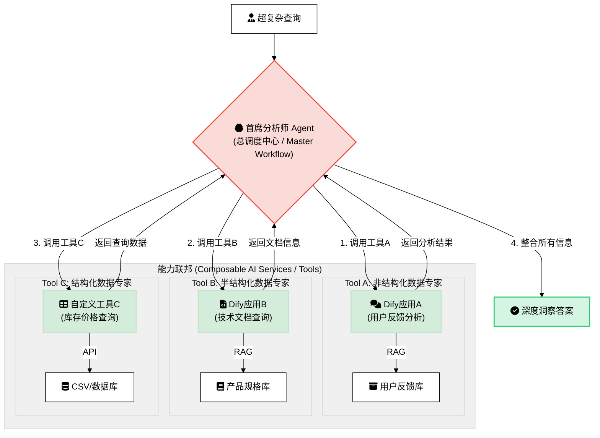

## 战略篇 - “失控”的知识：为什么你的RAG项目需要一个大脑，而不只是一本字典？

## 开篇：一个雄心勃勃的愿景与一个残酷的现实


想象一下这个场景，它可能就在此刻，正以某种形式在您的公司上演：


技术团队满怀信心地启动了一个代号为“普罗米修斯”的企业级RAG项目。目标宏大且诱人：打造一个无所不知的AI助手，一个能即时回答关于公司一切问题的“企业数字大脑”。在热烈的启动会上，CEO亲自站台，表达了对这个项目的殷切期望。


团队将过去数年积累的知识财富——成千上万份PDF财务报告、Word法律合同、Confluence上的产品文档、网页存档、杂乱的客服聊天记录——全部投入了最先进的向量数据库。大家期待着，这个AI助手能够理解复杂的跨部门指令，连接不同来源的信息，提供超越简单搜索的、富有洞察的答案。


项目初期，结果似乎令人鼓舞。当有人问“我们公司的CEO是谁？”或“会议室的Wi-Fi密码是多少？”时，系统对答如流，赢得了第一批掌声。


然而，当真正的业务问题开始涌入时，美好的愿景开始迅速破灭：

- **市场部的Sarah**，在准备关键的产品策略会前，她满怀期待地问道：“根据上季度的产品更新文档和最近三个月的用户反馈，我们新功能最核心的槽点是什么？”
    - **AI的回答**：返回了一段官网上的产品介绍，夹杂着几条毫不相关的、称赞产品易用性的用户评论。Sarah只能无奈地叹了口气，手动打开几十个文档，通宵整理。
- **法务部的David**，正在处理一个紧急的合同审查，他需要快速知道：“对比我们2021年和2023年签署的供应商合同模板，在责任限制条款上有什么实质性的、对我们不利的变化？”
    - **AI的回答**：“两个版本的合同都包含了责任限制条款。”——这是一个完全正确但又毫无价值的废话。David不得不泡上一杯浓咖啡，开始逐行比对那两份长达80页的文档。
- **战略部的Chen**，在为董事会准备报告时，试图利用AI进行深度分析：“结合近三年的财务报告和市场分析，我们的主要增长动力来自哪个业务线，其复合年增长率是多少？”
    - **AI的令状**：检索到了某一年的财报片段，但却错误地将另一年的市场数据张冠李戴，给出了一个看似精确但完全错误的答案。幸好Chen在提交前发现了这个致命错误。

最终，这个曾被寄予厚望的“普罗米修斯”项目，在内部被大家半开玩笑地称为“那个昂贵的智能搜索框”。用户逐渐失去信心，项目预算被削减，陷入了尴尬的停滞。


这个场景，正是无数企业在RAG实践中遭遇的“最后一公里”困境。问题到底出在哪里？


## 根源分析：将异构知识“一锅端”的致命错误


许多团队将失败归咎于模型不够强大、向量数据库不够先进，或是切片（Chunking）的参数调得不好。这些或许是原因之一，但真正的症结在于一个更根本性的战略错误：**我们从一开始就错误地假设，所有类型的知识都是平等的，可以用同一种方式对待。**


我们将形态、结构、意图和密度都天差地别的知识资产，用一种“一刀切”的方法进行了处理。这种“一锅端”式的策略，是对知识多样性的彻底漠视，也是导致RAG系统无法进行深度理解的根本原因。


让我们用几个类比来感受一下这种做法有多么荒谬：

- **处理财务/法律文书，就像…**
    > 试图通过从左到右、逐字阅读一本电话簿来找一个人的电话号码。
>
>     你会读到所有的名字和数字，但因为忽略了“姓氏首字母排序”和“行列对应”这个核心结构，你永远无法高效地建立“姓名”和“号码”之间的正确关系。同样，当RAG系统将财报中的表格“压平”成纯文本时，它就丢失了所有的结构信息，数字变成了无意义的字符。
>
>
- **处理产品/技术文档，就像…**
    > 把一张完整的世界地图撕成数百个大小完全相同的小方块，然后期望能通过单独看一个小方块来规划跨国旅行路线。
>
>     你或许能在某个方块上找到“巴黎”，在另一个方块上找到“埃菲尔铁塔”，但你已经永远失去了它们之间的空间关系和从属关系。同样，当一个API的函数定义（子块）与其所属的类（父块）被割裂时，它的功能和上下文就变得无法理解。
>
>
- **处理客服/用户反馈数据，就像…**
    > 试图通过收听一场90分钟电影中的随机的、不连续的30个5秒片段，来理解整个故事的情节和人物情感。
>
>     你会听到零散的对话、哭声和笑声，但你无法理解其前因后果。非结构化的对话和反馈，其价值完全在于上下文的流动和语义的连贯。生硬的切分会彻底摧毁这种价值。
>
>

当我们将这些截然不同的知识源用同一种策略处理时，我们期望AI能从这些支离破碎的、失去灵魂的片段中理解复杂的世界，就像期望一个只拿到半页菜谱的厨师能做出满汉全席一样，这根本不现实。


## 核心论点：从追求更好算法，到构建更优架构


至此，答案已经清晰：成功的企业级RAG，其核心瓶颈不在于单个算法的优劣，而在于顶层 **"知识治理架构"** 的缺失。


我们必须放弃寻找那把能打开所有锁的"万能钥匙"——即那个适用于所有文档类型的"最佳切片策略"。这种策略根本不存在。


正确的道路是进行一次思维范式的转变。让我们再用一个类比：

> 一个糟糕的RAG系统，就像一个只有"全科门诊"的医院。 无论你是骨折、心脏病还是皮肤过敏，你都会被送到同一个医生那里，接受一套标准的"听诊、验血、开点止痛药"流程。结果可想而知。


> 一个先进的RAG系统，则像一家组织完善的现代化医院。 它有一个高效的 "分诊台"（Triage）。当你进去时，分诊护士会先根据你的症状判断你该去哪个科室。骨折的去骨科，心脏病的去心内科，皮肤过敏的去皮肤科。每个科室的专家医生（Specialist）会用最专业的设备和知识，为你提供最优的治疗方案。

我们需要的，正是为我们的企业知识构建这样一座"医院"。**一个懂得"分而治之"的联邦式知识系统，而非一个庞大、笨拙、试图用一种方法治疗百病的单一RAG系统。**


## 小结：通往智慧的蓝图


如果说将所有知识"一锅端"是通往失败的路径，那么，通往成功的蓝图是怎样的？我们如何构建这样一个能够对企业知识进行智能"分诊"和"专科治疗"的先进架构？


在下一篇文章中，我们将正式走进这座"知识医院"，详细揭示其顶层设计蓝图——**"智能知识路由与调度中心"**。我们将详细阐述这个"企业大脑"是如何运作的，看它如何像一位经验丰富的总调度师一样，为不同类型的知识指派最合适的"专家团队"去处理，从而将"失控"的知识，转变为企业真正的、可信赖的智慧资产。


## 架构篇 - 智慧的大脑：引入"智能知识路由与调度中心"

在上一篇文章中，我们得到了一个至关重要的结论：一个成功的企业RAG系统，不应该像一个什么都看但什么都看不精的"全科门诊"，而应像一家拥有高效分诊台和各类专科专家的现代化医院。


这引出了一个核心问题：这家"知识医院"的大脑——那个高效的"分诊台"——究竟是如何运作的？我们如何设计一个智能系统，让它能在一瞬间判断出用户的问题应该"挂哪个科室的号"？


今天，我们就来揭晓这个顶层设计的蓝图：**智能知识路由与调度中心 (Intelligent Knowledge Routing and Dispatch Center)**。


## 蓝图揭晓：企业知识的"大脑"与"CEO"


"智能知识路由与调度中心"不是另一个RAG应用，而是驾驭和指挥整个企业所有RAG应用的**元系统 (Meta-System)**。如果说为特定领域（如法律、财务、客服）训练的RAG模型是各个领域的专家，那么这个中心就是这些专家的管理者和调度者。


我们可以将其想象成：

- **企业知识的"大脑皮层"**：负责接收所有输入信号（用户查询），进行快速的分析、理解和决策，然后将指令精准地传达给相应的"功能区"（专家RAG管道）。
- **知识团队的"CEO"**：它不亲自执行每一个任务，但它决定了"什么事应该由谁来做"，确保公司的资源（检索和算力）被用在最合适的地方，以最高效的方式解决问题。

下面这张架构图直观地展示了这个"大脑"是如何工作的：


这个"大脑"或"CEO"的核心工作，可以被分解为两个紧密相连的关键职责。


### 职责一：查询意图分析 (Query Intent Analysis)


这是调度中心的第一步，也是至关重要的一步。当一个查询进入系统时，它不会立刻冲进向量数据库里进行"暴力"搜索。相反，一个轻量级的、专门用于分类的语言模型会先对这个查询进行"体检"。


**目标**：判断用户的真实意图，并将查询归类到一个或多个预定义的"知识领域"。


**示例**：
假设系统收到了这样一个查询："上季度新发布的那款'星尘'系列产品，有没有引发什么主要的客服投诉？我想看看相关的报告。"


调度中心的意图分析模型会迅速识别出其中的关键实体和领域指向：

- `"上季度"` -> **时间属性**
- `"星尘"系列产品` -> **产品知识领域**
- `"客服投诉"` -> **客服知识领域**
- `"报告"` -> **文档类型属性**

分析结果是：这是一个**跨领域**查询，主要涉及 **"产品"** 和 **"客服"** 两大知识领域，并且带有明确的时间限制。


### 如何实现？构建你的查询意图分析器


理论是清晰的，但在实践中，我们如何构建这样一个高效的"查询意图分析器"或"路由器"（Router）呢？业界主流的技术路径有以下几种，各有千秋，适用于不同的场景和资源投入。


| 实现策略            | 核心做法                                                             | 优点                                        | 缺点                                  | 最佳适用场景                       |
| --------------- | ---------------------------------------------------------------- | ----------------------------------------- | ----------------------------------- | ---------------------------- |
| **LLM 零/少样本分类** | 通过精心设计的提示（Prompt），让一个强大的LLM（如GPT-4, Claude 3）直接判断查询应路由到哪个"专家小队"。 | **实现快、灵活性高**。无需训练数据，能理解复杂口语化查询，可随时增删路由规则。 | **成本与延迟较高**。每次路由都需要一次强大的LLM API调用。  | 快速原型验证、业务场景复杂多变、或查询量不大的内部系统。 |
| **嵌入相似度路由**     | 将每个"专家小队"的描述文本进行嵌入，形成"领域向量"。计算用户查询向量与这些领域向量的相似度，选择最相似的进行路由。      | **速度快、成本极低**。仅需一次嵌入调用和向量计算。               | **对边界模糊的查询效果一般**，强依赖于"领域描述"的撰写质量。   | 拥有明确领域边界、查询量大、对延迟和成本敏感的场景。   |
| **微调分类模型**      | 标注一批查询数据（查询文本 -> 对应小队），用这些数据微调一个轻量级的分类模型（如DistilBERT）。           | **速度极快、成本最低**，在特定任务上可达极高精度。               | **灵活性差、维护成本高**。需要数据标注，增删规则需要重新训练模型。 | 业务领域非常固定、追求极致性能和低成本的大规模线上应用。 |
| **混合/层级路由**     | 结合多种方法。例如，先用简单的关键词规则进行初步筛选，无法判断的再交由LLM处理。                        | **在成本、性能和灵活性之间取得最佳平衡**。                   | 系统逻辑更复杂，需要设计好多层路由的规则和回退机制。          | 大多数成熟的、复杂的生产系统，需要兼顾各种情况。     |


**选择建议：**


对于绝大多数刚刚起步构建此架构的团队，强烈建议从 **LLM 零/少样本分类** 开始。它的实现成本最低，可以让你迅速验证整个联邦式架构的价值。当系统流量增大或对成本、延迟有更高要求时，再逐步考虑引入嵌入路由或混合路由进行优化。


### 职责二：分派至专家RAG管道 (Dispatch to Specialized RAG Pipelines)


在完成意图分析后，调度中心就拿到了清晰的"诊断报告"。现在，它可以像一位经验丰富的总调度师一样，发出精准的指令。


**目标**：将分析后的查询，连同其上下文（如识别出的领域、时间等），分派给一个或多个最适合处理它的"RAG专家小队"。


**续上例**：
调度中心的工作流如下：

1. **指令1 -> 产品专家小队**: "检索知识库中关于'星尘'系列产品的核心技术文档和发布日期信息。"
2. **指令2 -> 客服专家小队**: "在你的知识库中，检索所有与'星尘'系列产品相关，且时间戳在'上季度'内的用户投诉记录。"
3. **结果汇集与综合**：调度中心收集来自两个专家小队的检索结果。这些结果不是最终答案，而是高质量、高相关的原始材料。
4. **最终生成**：将这些从不同领域精准检索出的材料，连同原始查询，一起提交给一个强大的生成模型（LLM），由它来综合这些信息，生成最终的、条理清晰的答案。
> AI生成的答案可能如下：  
> "根据产品文档，'星尘'系列产品于上季度X月X日发布。在客服知识库中，与该产品相关的主要投诉集中在以下三点：
> 1. **电池续航问题**：约有35%的投诉提及电池续航不及宣传所述。
> 2. **连接稳定性**：部分用户报告了与特定设备的蓝牙连接中断问题。
> 3. **软件界面卡顿**：有少数用户反映在进行Y操作时界面出现卡顿。
> 相关报告已为您检索到，请见附件。"
>

通过这个流程，我们用一个条理清晰、高度协同的架构，取代了原来那种混乱、低效的"大海捞针"式检索。


## 建立组织概念："RAG专家小队"的诞生


在上面的例子中，我们反复提到了一个新概念：**"RAG专家小队" (Specialized RAG Squads)**。


这正是"智能知识路由与调度中心"这个大脑所指挥的"双手双脚"。它们不是抽象的概念，而是可以被具体构建和优化的独立RAG管道。每一个小队都代表着一个为特定知识领域量身定制的、从数据处理到检索策略都深度优化的解决方案。


例如：

- **财务专家小队**：它的数据管道可能强制使用能解析表格的工具，其切片策略严格遵循财报的章节结构。
- **客服专家小队**：它的数据管道可能优先使用"语义切片"来聚合相似的投诉，并使用"滑动窗口"来保持对话的连续性。

这个"联邦制"的架构带来了巨大的好处：

- **精确性 (Precision)**：每个小队都在自己最擅长的领域工作，检索结果的相关性大大提高。
- *可扩展性 (Scalability)**E：当公司出现新的业务线或知识领域（例如，可持续发展报告）时，我们不需要推倒重来，只需创建一个新的"专家小队"并将其注册到调度中心即可。
- **可维护性 (Maintainability)**：我们可以独立地优化和迭代每一个小队的性能，而不会影响到其他团队。

## 小结：从蓝图到施工图


我们已经为我们的"知识医院"绘制了清晰的顶层设计蓝图。这个以"智能知识路由与调度中心"为大脑的联邦式架构，是解决企业RAG困境的核心钥匙。它让我们从"如何找到一个更好的通用算法？"的战术泥潭中跳出，转向"如何构建一个更智能的协作系统？"的战略高度。


但蓝图只是第一步。接下来，我们需要深入到"施工"层面。这些各司其职的"RAG专家小队"究竟应该如何组建？我们该如何为不同类型的知识，选择最合适的工具和策略？


在下一篇**组织篇**中，我们将深入探讨这个问题，提供一份详细的"团队组建手册"，手把手教你如何为企业的核心知识领域，打造出各自的王牌"专家小队"。


## 组织篇 - 各司其职：组建AI驱动的"RAG专家小队"

在上一篇中，我们确立了以"智能知识路由与调度中心"为大脑的联邦式架构。今天，我们将深入到这个系统的"心脏"地带，亲手为这个大脑组建起能够高效执行任务的"双手双脚"——那些各司其职的"RAG专家小队"。


如果说架构设计是"战略"，那么组建这些小队就是将战略落地的"组织战术"。这篇文章，就是一份详细的"团队组建手册"，它将向你展示如何将抽象的管道具象化为可管理的、高效的AI知识管理团队。


## 核心蓝图：四大知识领域的"专家小队"配置指南


企业知识并非铁板一块，因此，我们的"专家小队"也必须各有专长。以下表格是整个组织篇的核心，它详细说明了如何为企业最典型的四类知识领域，分别组建其专家小队，并配置最适合它们的处理与切片策略。


| 企业知识领域       | 文档类型           | 核心切片策略                                                            | 深入见解与独到策略                                                                                                                                             |
| ------------ | -------------- | ----------------------------------------------------------------- | ----------------------------------------------------------------------------------------------------------------------------------------------------- |
| **财务/法律小队**  | 高度结构化的文档       | **1. 结构化切片**<br>**2. 元数据增强切片**<br>**3. 特定模态切片**                   | **洞察**: 对于财报，数字和表格就是生命线。必须使用**特定模态切片**将表格完整提取为独立对象。对于法律文件，条款编号和合同结构是关键，**结构化切片**应严格遵循文档的章节层级。**元数据**（如财报季度、合同签署日期）是实现精确过滤查询的生命线，必须强制应用。               |
| **产品/API小队** | 高度结构化的文档 / 代码库 | **1. 结构化切片 (AST或Markdown)**<br>**2. 父文档检索器**<br>**3. 递归切片(代码优化)** | **洞察**: 这类文档的结构本身就蕴含着功能逻辑。使用基于AST的**结构化切片**处理代码，或基于标题的**结构化切片**处理说明书是最佳选择。**父文档检索器**在此处是"杀手级应用"：当用户查询某个具体函数时（子块），系统返回其所属的整个类或功能模块的说明（父块），提供最完整的上下文。   |
| **客服/反馈小队**  | 非结构化文档         | **1. 语义切片**<br>**2. 滑动窗口切片**<br>**3. 元数据增强切片**                    | **洞察**: 这类数据的价值在于发现趋势和情感。**语义切片**是首选，因为它能将语义相关（即使措辞不同）的投诉或建议聚合在一起。对于对话记录，必须采用**滑动窗口**，以保持上下文的连贯性。**元数据**（用户ID、时间戳、产品线）至关重要，它使得"查询某产品在特定时间段的用户反馈"成为可能。 |
| **通用知识小队**   | 半结构化文档         | **1. 递归切片**                                                       | **洞察**: 这是最通用的知识领域，如公司介绍、新闻稿等，通常是叙事性的。**递归切片**以其对段落和句子的良好适应性，成为最稳健和高效的基准策略。它很好地平衡了实现成本和效果，是所有团队的保底选择。                                                 |


## 深度剖析：当"律师"遇上"心理学家"


为了更深刻地理解"因材施教"的重要性，让我们挑选上表中两个性格迥异的团队——"财务/法律专家小队"和"客服/反馈专家小队"——进行一次面对面的对比。这就像是让一个严谨的"律师"和一个善于共情的"心理学家"来处理同一个问题，他们的工具、方法和关注点将完全不同。


| 对比维度       | **财务/法律小队 (严谨的律师)**                                                                                 | **客服/反馈小队 (共情的心理学家)**                                                                                                   | **为什么差异如此巨大？**                                         |
| ---------- | --------------------------------------------------------------------------------------------------- | ----------------------------------------------------------------------------------------------------------------------- | ------------------------------------------------------ |
| **数据核心价值** | **事实的精确性**。数字、条款、日期，一个都不能错。                                                                         | **意图和情感的捕捉**。用户真正在抱怨什么？他们的情绪是怎样的？                                                                                       | 两者的目标南辕北辙。前者是"是什么"，要求100%忠于原文；后者是"为什么"，要求能从杂乱的语言中提炼观点。 |
| **主要处理工具** | 布局感知的PDF解析器（如PyMuPDF, Amazon Textract），能完美提取表格和章节。                                                  | 自然语言处理工具包，用于情感分析、关键词提取。                                                                                                 | 工具的选择由数据的形态决定。"律师"的案卷是格式严谨的卷宗，而"心理学家"面对的是自由流淌的对话。      |
| **核心切片策略** | **结构化切片**。严格按照"第X条第Y款"或财报的"Item 1A. Risk Factors"来分割，绝不跨越。                                          | **语义切片**。忽略段落，根据语义相似度来聚合内容。所有关于"电池续航"的抱怨，无论用词如何，都应被归为一类。                                                                | "律师"依赖的是法条的明确边界，而"心理学家"寻找的是思想的内在关联。                    |
| **元数据利用**  | **强制性、结构化元数据**。例如：`{"contract_id": "C2023-001", "clause": "8.1a", "effective_date": "2023-01-01"}`。 | **描述性、情境化元数据**。例如：`{"customer_id": "U12345", "sentiment": "negative", "product_line": "Stardust", "timestamp": "..."}`。 | 元数据是各自领域实现精确检索的钥匙。"律师"靠它按图索骥，"心理学家"靠它筛选案例。             |


## 解锁专家小队的"武器库"：核心策略通俗解析


在前面的表格中，我们为不同的小队配置了各自的"核心切片策略"。这些名词听起来可能有些距离感，但它们的思想都非常直观。让我们用生动的比喻来解锁这些"武器"的真正威力。


### 1. 结构化切片 (Structural Chunking)

- **一句话解释**：按照文档作者预设的结构（章节、标题、列表）来进行切分。
- **生动比喻**：想象你在拆解一个精密的乐高模型。你不会用锤子把它砸成大小相近的碎块，而是会按照说明书的步骤，把"驾驶舱"、"机翼"、"起落架"等完整的部件小心地分离开。**结构化切片就是这位遵循说明书的"模型大师"**，它尊重作者通过标题（如`#` `##`）和格式赋予文档的原始逻辑，确保每个切片都是一个有意义的、完整的"部件"。
- **应用案例**：
    - **原始Markdown文本**:

        ```markdown
        # 第一章: RAG简介
        RAG的核心思想是检索和生成的结合。
        ## 1.1 为什么需要切片
        切片是管理大型文档的关键。
        ```

    - **切分结果**:
        - **块1**: 内容="RAG的核心思想是检索和生成的结合。", 元数据=`{"Header 1": "第一章: RAG简介"}`
        - **块2**: 内容="切片是管理大型文档的关键。", 元数据=`{"Header 1": "第一章: RAG简介", "Header 2": "1.1 为什么需要切片"}`
    - **召回策略 (如何使用)**:
        - **工作流解析**:
            1. **用户查询**: "请介绍一下RAG切片的重要性"
            2. **系统执行**:

                ```python
                # 伪代码
                retriever.search(
                  query="RAG切片的重要性",
                  metadata_filter={
                    "Header 2": {"contains": "切片"}
                  }
                )
                ```

            3. **第一步：元数据过滤**。系统不是在整个知识库里进行大海捞针式的搜索，而是先通过结构化查询，快速筛选出所有元数据中`Header 2`字段包含"切片"的文本块。在这个案例中，只有**块2**被选中。
            4. **第二步：语义搜索**。系统仅在**块2**这个极小的范围内，进行语义相关性计算，最终精准返回结果。
        - **核心优势**: **效率与精度的双重提升**。先通过元数据"修剪"掉大量不相关的"树枝"，再对少数最可能的"树叶"进行精细的语义分析。这极大地降低了搜索范围，避免了其他章节中可能出现的、但相关性不高的"切片"一词的干扰。


### 2. 语义切片 (Semantic Chunking)

- **一句话解释**：根据内容的主题和意思来决定在哪里切分。
- **生动比喻**：想象你正在整理一场大型派对的所有谈话录音。你不会按每隔五分钟切一段，而是会仔细听内容，把所有关于"最近的电影"的讨论放在一起，所有关于"假期计划"的讨论放在另一堆。**语义切片就是这位懂社交的"派对组织者"**，它不在乎文字表面的长度或格式，只关心"这段话跟上一段话是不是在聊同一个话题？"，从而在话题自然转变的地方切分。
- **应用案例**:
    - **原始文本**:
        > "新款'天穹'系列笔记本电脑的处理器性能表现卓越，基准测试显示比上一代提升了30%，非常适合进行视频剪辑和3D渲染工作。然而，其散热系统在持续高负载下表现不佳，多个评测指出风扇噪音较大，且C面温度会超过45摄氏度，影响了长时间使用的舒适度。"
    - **切分点**: AI会识别出文本从"优点（性能）"到"缺点（散热）"的语义转折，并在这里进行切分，而不是在句子中间。
    - **召回策略 (如何使用)**:
        - **工作流解析**:
            1. **用户查询**: "这款笔记本电脑用起来会不会很烫？"
            2. **系统执行**:

                ```python
                # 伪代码
                vector_store.similarity_search(
                    query="这款笔记本电脑用起来会不会很烫？"
                )
                ```

            3. **向量匹配**: 系统将用户的口语化提问"用起来会不会很烫"转换成一个查询向量。这个向量在语义空间中，会非常接近于描述"散热系统"、"风扇噪音"、"C面温度"的那个文本块的向量，即使查询中完全没有出现这些原文的关键词。
        - **核心优势**: **强大的泛化能力和概念理解能力**。它超越了关键词匹配的局限，能够真正理解用户的"意图"。即使用户问的是"散热好不好"、"风扇吵不吵"，它都能准确地找到相关的负面评价文本块。


### 3. 父文档检索器 (Parent Document Retriever)

- **一句话解释**：检索时先找到最精确的小信息点，然后返回包含这个点的、更大的上下文。
- **生动比喻**：你在图书馆的一本书里找到了一句让你醍醐灌顶的话（子块）。但要真正理解它，你需要它所在的那一整个段落，甚至那一整章（父块）。**父文档检索器就是那位贴心的图书管理员**，当你指着那句话时，他不会只把那句话抄给你，而是会把整本书翻到那一页，递给你说："请看，这是它的完整上下文。" 这个策略完美地结合了查找的"精确性"和理解的"全面性"。
- **应用案例**:
    - **用户查询**: "API的超时参数`timeout`单位是什么？"
    - **检索到的子块**: 一个非常小的、精确的文本块 -> `timeout`参数的单位是秒（s）。
    - **返回给LLM的父块**: 包含上述子块的整个函数文档 ->

        ```plain text
        ### 函数: connect_to_server(host, port, timeout=30)
        连接到指定服务器。
        - host (str): 服务器地址。
        - port (int): 服务器端口。
        - timeout (int): `timeout`参数的单位是秒（s）。如果连接在此时间内未建立，将引发超时错误。
        ```

    - **召回策略 (如何使用)**:
        - **工作流解析**:
            1. **用户查询**: "API的超时参数`timeout`单位是什么？"
            2. **第一步：在子块中精确查找**。系统在专门存储"子块"的向量数据库中进行语义搜索，由于子块小而精，查询向量能精准地匹配到内容为"`timeout`参数的单位是秒（s）"的子块。这个子块自身携带一个指向其父块的ID。
            3. **第二步：凭ID提取父块**。系统拿到这个ID后，从一个独立的文档存储（Docstore，可以是一个简单的键值对数据库）中，提取出完整的"父块"——也就是整个函数的详细文档。
            4. **最终返回**: 将这个信息量丰富的父块，而不是那个简短的子块，提供给LLM进行回答。
        - **核心优势**: **兼得鱼和熊掌**。我们利用小块的**嵌入精确性**来确保"找得准"，同时又利用大块的**上下文完整性**来确保LLM"答得好"。它完美解决了"小块信息不足"和"大块语义模糊"这一核心矛盾。


### 4. 元数据增强切片 (Metadata-Augmented Chunking)

- **一句话解释**：给每个切片贴上描述其属性的"标签"。
- **生动比喻**：想象你在搬家，把所有东西都装进了大小一样的箱子里。如果没有标签，你将陷入混乱。但如果你给每个箱子都贴上标签——"厨房用品 | 易碎 | 2023年冬"或"卧室衣物 | 夏季 | 小件"（这就是元数据），你就能快速找到任何东西。**元数据增强切片就是这位严谨的"整理师"**，它给每个文本块都附上了身份信息（如来源、日期、作者、所属章节），让你可以进行"数据库式"的精确筛选，而不仅仅是模糊的语义搜索。
- **应用案例**:
    - **一个文本块的内容**: "本季度的主要增长动力来自于'星尘'产品线在亚太市场的强劲表现。"
    - **附加的元数据**:

        ```json
        {
          "source_doc": "2023_Q3_Earnings_Call_Transcript.pdf",
          "page_number": 5,
          "author": "CFO Jane Doe",
          "publish_date": "2023-10-26",
          "security_level": "Internal-Confidential"
        }
        ```

    - **带来的能力**：你可以发起这样的查询 -> "只搜索第三季度的财报电话会议记录中，由CFO提及的关于'星尘'产品的内容"。
    - **召回策略 (如何使用)**:
        - **工作流解析**:
            1. **用户查询**: "CFO在第三季度的财报会议上，对'星尘'产品线有何评论？"
            2. **系统执行（混合搜索）**:

                ```python
                # 伪代码
                retriever.search(
                  query="对'星尘'产品线有何评论",
                  metadata_filter={
                    "and": [
                      {"source_doc": {"equals": "2023_Q3_Earnings_Call_Transcript.pdf"}},
                      {"author": {"equals": "CFO Jane Doe"}},
                      {"security_level": {"in": ["Public", "Internal-Confidential"]}} // 假设还要检查权限
                    ]
                  }
                )
                ```

            3. **第一步：元数据预过滤 (Pre-filtering)**。向量数据库首先根据`metadata_filter`中的严格条件，进行一次闪电般的结构化搜索，将数百万个文本块瞬间过滤到可能只有几十个符合条件的块。
            4. **第二步：在子集上进行语义搜索 (Semantic Search on Subset)**。然后，仅在这几十个块的小范围内，执行向量相似度搜索，找到与"对'星尘'产品线有何评论"语义最相关的块。
        - **核心优势**: **极致的性能与精度**。这是目前工业界最强大和常用的检索模式之一。它将结构化数据库查询的"确定性"和向量搜索的"模糊语义匹配能力"完美结合，使得在海量、复杂的企业知识库中进行安全、精确、高效的检索成为可能。


### 5. 其他重要策略

- **特定模态切片 (Modality-Specific Chunking)**：这是"多才多艺的分析师"，能识别出文本中的表格、图片，将它们作为特殊对象单独处理，而不是当成无意义的文字。
- **滑动窗口切片 (Sliding Window)**：这是"小心谨慎的读者"，在读下一页之前，总会回头看一眼上一页的最后几个词，以确保意思能完全衔接上。它通过让相邻的块有少量重叠，来避免在边界处丢失上下文。

理解了这些核心策略的本质思想，你就能更好地理解为什么我们将它们如此配置，以及如何在自己的项目中灵活运用它们。


## 终极进化：让AI自己组建和管理团队


到目前为止，我们讨论的还是如何由"人"来为AI系统定义和配置这些专家小队。但真正的未来，在于让系统拥有自我管理和进化的能力。您在交流中提出的"由AI创建知识管理团队"的观点，正是通往这个未来的关键。


这意味着我们的"智能知识路由与调度中心"，将从一个静态的规则引擎，升级为一个具备生命周期管理能力的、活的AI系统。它通过以下方式，让"专家小队"实现真正的自动化：

1. **自动化数据准入与分类 (Automated Data Onboarding & Classification)**:
系统的前端是一个AI分类器。当任何新文档（无论是邮件、报告还是聊天记录）进入企业知识库时，该分类器会分析其内容和结构，自动判断它属于哪个"知识团队"，并将其发送到对应的专家RAG处理管道中。这就实现了知识摄取的自动化，无需人工干预。
2. **动态策略优化与自适应 (Dynamic Strategy Optimization & Adaptation)**:
系统会持续监控每个知识团队的检索性能。如果发现"产品/API小队"的检索准确率下降，系统可以自动进行"A/B测试"：尝试用一种新的切片策略（例如，从`递归切片`切换到`父文档检索器`）重新索引一小部分数据，对比新旧策略的用户反馈，并最终将更优的策略无缝部署到整个团队。这是一个自我优化的闭环。
3. **新知识领域的自动发现与创建 (Automatic Discovery & Creation of New Domains)**:
这是最激动人心的部分。当系统中出现大量无法被现有分类器识别的新类型文档时（例如，公司开始大量撰写关于"ESG可持续发展"的报告），系统能够通过聚类算法识别出这是一个新兴的知识簇。此时，它可以自动"创建"一个新的"ESG知识小队"，为其选择一个最稳妥的基准切片策略（如`递归切片`），并开始独立的索引流程，同时提醒人类管理员对这个新团队进行审核和微调。

通过这种方式，整个RAG系统就从一个需要手动维护的静态架构，演变成了一个能够适应企业知识体系不断变化的、真正意义上的"智慧生命体"。


## 小结：从"工匠"到"指挥家"


本篇详细阐述了组建"RAG专家小队"的具体方法论，并将我们的角色从一个埋头研究单一算法的"工匠"，提升到了一个懂得如何排兵布阵、协同作战的"指挥家"。


我们已经理解了"为什么"要分而治之（战略篇），也掌握了"如何"进行顶层设计（架构篇）和团队组建（组织篇）。接下来，我们将戴上"显微镜"，深入到这些小队所使用的具体"武器"——那些高级的切片策略中去。


在接下来的两篇**战术篇**中，我们将分别聚焦于**结构化/半结构化知识**和**非结构化/代码知识**的处理，提供完整的代码示例和最佳实践，让你真正掌握这些核心技术的精髓。


## 概念解析篇：企业知识的四种形态

在构建企业级RAG系统的宏伟蓝图中，我们首先要成为一名合格的"地质学家"，能够勘探和识别企业知识库中不同"矿藏"的特性。因为不同的知识形态，如同不同的地质层，需要截然不同的"开采工具"和"提炼工艺"。


本篇内容将作为一份纲领性的"知识地图"，详细解析我们在企业场景中必然会面对的四种核心知识形态。理解它们的本质、挑战和价值，是后续所有"战术篇"中高级切片与处理策略的根基。


为了更清晰地展示本篇内容与上一篇《组织篇》的关联，下图展示了"专家小队"如何与我们将要探讨的"知识形态"一一对应：


这四种形态按照结构化程度，可以分为：

1. **高度结构化的文档**
2. **半结构化的文档**
3. **非结构化文本**
4. **代码知识**（一种语法结构极其严谨的特殊文档）

---


## 1. 高度结构化的文档 (Highly Structured Documents)


### 什么是"高度结构化"？


**高度结构化的文档**是指那些具有清晰、可预测、机器可读层级和格式的文档。其最显著的特点是：**结构本身就蕴含着丰富的语义信息**。作者已经通过标题、章节、列表、表格等形式，为内容赋予了明确的逻辑和秩序。

- **核心特征**:
    - **层级清晰**: 信息由章节、条款、标题、列表等元素严格组织。
    - **格式规范**: 遵循着明确的规范，如Markdown语法、HTML标签、合同范本等。
    - **作者意图明确**: 内容的逻辑划分已经由作者完成，我们的任务是尊重并利用它。

### 常见示例

- **技术手册/API文档**: 包含模块、类、函数定义、参数列表、代码示例。
- **法律合同/法规文件**: 包含条款、章节、附件，有严格的编号体系。
- **财务报告 (如10-K文件)**: 包含明确的部分，如"管理层讨论与分析"、"财务报表"，并含有大量表格。
- **网页内容**: 由`<h1>`, `<h2>`, `<p>`, `<table>`等HTML标签清晰界定。
- **格式严谨的Markdown文件**: 如本项目中的系列文章。

**示例文档：一份Markdown格式的产品说明**


```markdown
# "星尘"系列无人机 - 用户手册

## 1. 快速入门

### 1.1 开箱与检查
请确认包装内包含以下物品：
- 无人机主体 x 1
- 遥控器 x 1
- 备用螺旋桨 x 4

### 1.2 首次飞行
...
```


### 处理它的核心挑战 (Why it's hard for RAG)

1. **需要专用解析器 (Parser-Needed)**: 不能将其作为普通txt读取，必须使用能理解其结构和格式的解析器。例如，用Markdown解析器处理`.md`，用HTML解析器处理网页，用`PyMuPDF`等工具进行布局感知的PDF解析。
2. **多模态内容 (Multi-modality)**: 常常包含表格、图表、代码块等非文本元素。必须将这些元素作为独立对象进行提取和处理，而非简单地压平成文本。

### 为什么我们必须驯服它？ (Why it's valuable)


这是最容易产生价值、实现精准问答的知识类型。因为它的结构是RAG系统进行高效检索的"金钥匙"。

- **精确制导**: 我们可以利用文档结构和元数据（如章节名、条款号）进行**元数据过滤**，实现"指哪打哪"的精确查询，极大缩小语义搜索的范围，从而提升效率和精度。
- **保留完整上下文**: 通过结构化切片，可以确保每个知识块都是一个逻辑上完整的单元（如一个完整的函数文档，一个完整的合同条款），为LLM提供高质量的上下文。

---


## 2. 半结构化的文档 (Semi-Structured Documents)


### 什么是"半结构化"？


**半结构化的文档**介于高度结构化和完全无结构之间。它们有一定的组织结构，但不如前者那样严格或一致。段落是其主要的逻辑单元。

- **核心特征**:
    - **以段落为中心**: 段落是主要的逻辑和视觉单元。
    - **叙事性强**: 内容通常是连贯的叙述流。
    - **结构不一致**: 标题和格式的使用可能不完全规范或缺失。

### 常见示例

- **博客文章/新闻报道**: 有主标题，可能有副标题，主要由段落构成。
- **内部知识库/Wiki (如Confluence)**: 页面结构比较自由，主要由段落和一些简单的宏（如列表、引用）组成。
- **大多数Word文档和格式较为简单的PDF**。
- **公司介绍、产品宣传稿**等。

**示例文档：一篇公司新闻稿**


```plain text
标题：引力科技发布开创性AI芯片"启明一号"

（2023年10月27日，硅谷）——今日，人工智能领域的领导者引力科技，正式发布了其最新研发的AI芯片"启明一号"。该芯片旨在为下一代人工智能应用提供前所未有的计算能力。

"启明一号"采用了革命性的3纳米工艺，集成了超过500亿个晶体管。引力科技CEO李明在发布会上表示："我们相信，'启明一号'将成为推动自动驾驶、智慧医疗等行业发展的核心引擎。"

该芯片的样品已提供给部分战略合作伙伴进行测试，预计将于明年第二季度正式量产。
...
```


### 处理它的核心挑战 (Why it's hard for RAG)

1. **依赖自然边界**: 其切分主要依赖`\\n\\n`这样的段落分隔符。如果文档格式不佳，缺少段落分隔，处理效果会急剧下降。
2. **主题可能在段内漂移**: 一个较长的段落内，可能也存在着主题的悄然转变。

### 为什么我们必须驯服它？ (Why it's valuable)


这是企业知识库中**占比最大**的一类。它们覆盖了企业绝大多数的日常运营和信息发布。

- **通用性强**: 像`RecursiveCharacterTextSplitter`（递归切片）这样的通用策略在这种文档上效果很好，能在实现成本和效果之间取得极佳平衡。
- **信息丰富**: 包含了大量的描述性、解释性信息，是企业对外沟通和对内同步的主要载体。

---


## 3. 非结构化文本 (Unstructured Text)


### 什么是"非结构化"？


**非结构化文本**，是指没有预定义数据模型或组织格式的自由文本。它不像数据库中的表格那样有整齐的行和列，也不像技术手册那样有清晰的章节和标题。它更像是人类自然交流的原始记录，是信息的自由流动。

- **核心特征**:
    - **格式自由**: 没有固定的结构或范式。
    - **内在逻辑**: 其逻辑关系隐藏在语义和上下文之中，而非外在的格式。
    - **高语境依赖**: 单独一句话可能意义模糊，必须结合前后文才能准确理解。

### 常见示例

- **客服对话记录**: 用户与客服之间一来一回的聊天记录。
- **用户反馈与评论**: 用户在应用商店、社交媒体、论坛上发布的自由评论。
- **会议录音转录稿**: 将会议语音直接转换成的长篇文本。
- **内部邮件与沟通**: 员工之间的电子邮件往来。
- **开放式问卷回答**: 调查问卷中由用户自由填写的文本框内容。

**示例文档：一则客服对话记录**


```plain text
用户 (10:32 AM): 你好，我的订单 #A8754 更新了物流信息吗？一直没动静。
客服 (10:33 AM): 您好，请稍等，我为您查询一下... 好的，查到了。您的包裹昨天已经到达本地分拨中心，但因为暴雨天气，派送可能会有延迟。非常抱歉给您带来不便。
用户 (10:34 AM): 又是天气原因...好吧，那大概要多久？
客服 (10:35 AM): 预计今天天气好转后会优先派送，最晚明天肯定能到您手上。您需要我为您设置一个短信提醒吗？
用户 (10:35 AM): 好的，麻烦了。
```


### 处理它的核心挑战 (Why it's hard for RAG)

1. **切分困难 (Chunking Difficulty)**: 哪里是信息的开始和结束？传统的基于换行符或段落的切分方法常常会失效，因为它可能会将一个完整的对话主题、一个用户反馈的完整逻辑链从中间切断。
2. **噪声巨大 (Signal-to-Noise Ratio)**: 文本中常常充满了口语化的表达、错别字、情绪化的宣泄、以及与核心问题无关的闲聊。从这些"噪声"中提取出有价值的"信号"非常困难。
3. **上下文丢失 (Context Loss)**: 在长对话中，一个问题的答案可能出现在十几轮对话之前。如果切片不当，当模型看到问题时，可能已经看不到最初的上下文了，导致无法回答。
4. **主题混合 (Topic Mixture)**: 在一段看似完整的文本中，用户可能同时表达了对A功能的赞扬、对B功能的抱怨以及对C功能的建议。

### 为什么我们必须驯服它？ (Why it's valuable)


尽管处理起来非常棘手，但非结构化文本是企业最宝贵的资产之一。它包含了最真实、最原始、最未经加工的**"用户之声" (Voice of the Customer)** 和 **"员工之声" (Voice of the Employee)**。通过有效分析这些数据，企业可以：

- 发现产品的隐藏问题和改进机会。
- 洞察客户的真实需求和情感倾向。
- 优化客户服务流程和知识库。
- 了解内部运营的瓶颈和员工关切。

---


## 4. 代码知识 (Code Knowledge)


### 什么是"代码知识"？


**代码知识**是一种高度结构化的特殊文本，其知识载体是软件项目的源代码。它远不止是`.py`或`.js`文件中的字符那么简单，它是一个多层次的知识体系。

- **核心组成**:
    - **形式化代码 (Formal Code)**: 由特定编程语言（如Python, Java）语法定义的逻辑本身。
    - **自然语言注释 (Comments & Docstrings)**: 开发者用来解释代码目的、用法和实现细节的注释和文档字符串。
    - **结构化关系 (Structural Relationships)**: 文件与文件之间的导入（`import`）关系，类与类之间的继承关系，函数与函数之间的调用关系。
    - **版本历史 (Version History)**: `Git`提交信息（commit messages），记录了代码变更的原因和历史。

### 常见示例

- 企业内部的后台服务代码库。
- 前端应用的React或Vue项目。
- 用于数据分析的Jupyter Notebooks集合。
- 共享的工具函数或SDK。

**示例文档：一个Python工具函数**


```python
# utils/image_processor.py

import numpy as np
from PIL import Image

def resize_image(image_path: str, max_width: int = 1024, max_height: int = 1024) -> Image.Image:
    """
    调整图片尺寸，使其不超过指定的最大宽度和高度。

    Args:
        image_path (str): 输入图片的路径。
        max_width (int): 允许的最大宽度。
        max_height (int): 允许的最大高度。

    Returns:
        Image.Image: 调整尺寸后的PIL Image对象。
    """
    with Image.open(image_path) as img:
        img.thumbnail((max_width, max_height))
        return img
```


### 处理它的核心挑战 (Why it's hard for RAG)

1. **语言特殊性 (Specialized Language)**: 代码是为机器设计的形式化语言，标准的自然语言处理（NLP）模型无法直接理解其精确的语法和语义。
2. **非线性上下文 (Non-Local Context)**: 一个函数的功能可能依赖于从十几个不同文件中导入的其他函数或类。上下文是分散在整个代码库中的，而不是像文章一样是线性的。
3. **结构为王 (Structure is King)**: 代码的意义完全由其结构（类、函数、块）决定。如果像处理普通文本一样，随意地在函数体中间进行切分，就会完全破坏其逻辑，变得毫无意义。
4. **双重语言混合 (Dual-Language Mixture)**: 它同时包含编程语言和自然语言（注释）。一个理想的RAG系统需要能同时理解两者，并将它们正确地关联起来。

### 为什么我们必须驯服它？ (Why it's valuable)


代码库是技术公司的**终极事实来源 (Ultimate Source of Truth)**。它精确地定义了产品如何工作。能够高效地查询和理解代码知识，将带来巨大的生产力提升：

- **加速新员工入职**: 新人可以通过提问快速了解庞大而复杂的代码库。
- **提升开发效率**: 开发者可以快速找到特定功能的实现、定位API的用法，或理解一段复杂代码的意图。
- **简化重构与维护**: 在修改旧代码前，可以询问"修改这个函数可能会影响哪些其他部分？"，以评估影响范围。
- **自动化代码审查**: 可以构建工具，自动检查新代码是否遵循了某些既定模式或最佳实践。

通过为这四类知识设计专门的RAG处理策略，企业才能真正解锁其知识库的全部潜力，将最棘手的数据转化为最强大的洞察力。


## 战术篇（上） - 精雕细琢：驾驭结构化与半结构化知识

至此，我们已经规划了宏伟的蓝图（战略篇），设计了智能的大脑（架构篇），并组建了专业的团队（组织篇）。现在，是时候深入一线，为我们的"专家小队"配备最精良的武器了。欢迎来到战术篇！


本篇是技术深潜的第一站，我们将聚焦于企业知识库中最常见、也最容易产生价值的一类数据：**结构化与半结构化知识**。这包括技术手册、API文档、网页内容、Markdown格式的内部Wiki、甚至是格式清晰的Word文档。


这类文档的共同特点是：**作者已经通过标题、列表、代码块等形式，为内容赋予了清晰的逻辑结构。** 我们的核心战术，就是**最大化地利用这些结构信息**，实现最高效、最精确的切分与检索。


本篇我们将深入讲解并实战演练三种核心武器：

1. **结构化切片 (Markdown/HTML)**：精准拆解的"解剖刀"。
2. **递归切片 (Recursive Chunking)**：灵活通用的"瑞士军刀"。
3. **父文档检索器 (Parent Document Retriever)**：兼顾全局与细节的"广角+微距"镜头。

---


## 准备工作：环境设置


在开始实战之前，请确保你已经安装了必要的Python库。我们将主要使用 `langchain` 生态来实现这些策略。


```shell
# 安装核心库
pip install -q langchain langchain_community langchain_openai

# 安装用于向量化和存储的库
pip install -q faiss-cpu tiktoken

# 如果要处理HTML，需要安装这个库
pip install -q beautifulsoup4
```


为了运行代码，你还需要设置你的OpenAI API密钥。


```python
import os
from langchain_openai import OpenAIEmbeddings

# 建议使用环境变量来管理你的API密钥
# os.environ["OPENAI_API_KEY"] = "sk-..."

# 初始化嵌入模型
# 我们将使用OpenAI的text-embedding-3-small模型，它在性能和成本上取得了很好的平衡
embeddings = OpenAIEmbeddings(model="text-embedding-3-small")
```


---


## 武器一：结构化切片 (Structural Chunking)


这是处理具有明确层级结构（如Markdown、HTML）文档的**首选武器**。它的核心思想是：**让机器像人一样，通过看标题来理解文档结构**。


### 1. Markdown标题切片 (`MarkdownHeaderTextSplitter`)


`MarkdownHeaderTextSplitter` 可以根据Markdown文件中的`#` `##` `###`等标题层级来进行分割，并将标题本身作为元数据附加到每个块上。


**代码实战：**


```python
from langchain.text_splitter import MarkdownHeaderTextSplitter

# 假设我们有一个Markdown格式的技术手册
markdown_text = """
# LangChain 简介

LangChain是一个强大的框架，旨在简化利用大型语言模型（LLM）的应用开发。

## 核心组件

LangChain包含几个核心部分。

### 1. 模型 I/O (Models I/O)

这部分负责与语言模型进行交互。

### 2. 检索 (Retrieval)

检索模块用于从外部数据源获取信息。

## 快速入门

让我们看一个简单的例子。
"""

# 定义我们关心的标题层级
headers_to_split_on = [
    ("#", "Header 1"),
    ("##", "Header 2"),
    ("###", "Header 3"),
]

# 初始化切片器
markdown_splitter = MarkdownHeaderTextSplitter(
    headers_to_split_on=headers_to_split_on,
    strip_headers=True # 选项：是否从内容中移除标题本身
)

# 执行切分
md_header_splits = markdown_splitter.split_text(markdown_text)

# 让我们看看结果
for i, split in enumerate(md_header_splits):
    print(f"--- 块 {i+1} ---")
    print(f"内容: {split.page_content}")
    print(f"元数据: {split.metadata}\\n")
```


**结果分析与召回策略：**


上面的代码会将Markdown文本精确地切分为以下几个块：

- **块1**:
    - 内容: `LangChain是一个强大的框架，旨在简化利用大型语言模型（LLM）的应用开发。`
    - 元数据: `{'Header 1': 'LangChain 简介'}`
- **块2**:
    - 内容: `LangChain包含几个核心部分。`
    - 元数据: `{'Header 1': 'LangChain 简介', 'Header 2': '核心组件'}`
- **块3**:
    - 内容: `这部分负责与语言模型进行交互。`
    - 元数据: `{'Header 1': 'LangChain 简介', 'Header 2': '核心组件', 'Header 3': '1. 模型 I/O (Models I/O)'}`
- **块4**:
    - 内容: `检索模块用于从外部数据源获取信息。`
    - 元数据: `{'Header 1': 'LangChain 简介', 'Header 2': '核心组件', 'Header 3': '2. 检索 (Retrieval)'}`
- **块5**:
    - 内容: `让我们看一个简单的例子。`
    - 元数据: `{'Header 1': 'LangChain 简介', 'Header 2': '快速入门'}`

**召回工作流：元数据过滤的力量**


现在，假设一个用户问：**"LangChain的检索组件是做什么的？"**


一个先进的RAG系统会执行如下的**混合搜索 (Hybrid Search)** 流程：

1. **用户查询分析**：系统可能会识别出查询中的关键词"检索组件"。
2. **执行混合搜索**：系统向向量数据库发起一个包含**语义查询**和**元数据过滤**的请求。

    ```python
    # 伪代码示意
    retriever.search(
      query="检索组件是做什么的？",
      metadata_filter={
        "Header 3": {"contains": "检索"}
      }
    )
    ```

3. **第一步：元数据预过滤 (Pre-filtering)**。向量数据库首先不过进行任何昂贵的向量计算，而是闪电般地执行元数据过滤。它会扫描所有文本块的元数据，只筛选出那些 `Header 3` 字段包含 "检索" 一词的块。在我们的例子中，数百万个块可能瞬间就被过滤得只剩下 **块4**。
4. **第二步：在子集上进行语义搜索 (Semantic Search on Subset)**。现在，系统只需要在**块4**这个极小的集合上进行语义相似度计算。这几乎没有计算成本。
5. **返回精准结果**：系统最终精确地返回 **块4** 的内容："检索模块用于从外部数据源获取信息。"，并将其交给LLM生成最终答案。

**核心优势**：**效率与精度的双重提升**。这种"先过滤，后搜索"的模式，将结构化数据库查询的"确定性"和向量搜索的"模糊语义匹配能力"完美结合。它避免了在整个知识库中进行大海捞针式的语义搜索，极大地缩小了搜索范围，防止了其他章节中可能出现的、但相关性不高的"检索"一词的干扰，最终实现了更快、更准的召回。


### 2. HTML标题切片 (`HTMLHeaderTextSplitter`)


与Markdown类似，我们可以用 `HTMLHeaderTextSplitter` 来处理网页内容，利用`<h1>` `<h2>`等标签进行切分。这对于构建基于公司官网或在线知识库的RAG系统非常有用。代码实现与Markdown版本高度相似，只需将`MarkdownHeaderTextSplitter`换成`HTMLHeaderTextSplitter`即可。


---


## 武器二：递归切片 - 半结构化知识的"瑞士军刀"


现在，我们把目光投向企业知识库中占比最大的内容：**半结构化文档**。并非所有文档都有完美的标题结构。对于那些以段落为主要结构，但格式不一的文档（如博客文章、新闻稿、大多数内部Wiki页面），**递归切片 (Recursive Character Text Splitter)** 就是我们最可靠的通用武器。


它的工作原理完美地契合了半结构化文档的特点：**试图用一个分隔符列表（按优先级排序）来分割文本**。它会先用最高优先级的`\\n\\n`（段落）尝试分割——这正是半结构化文档最自然的边界。如果切分后的块仍然太大，它才会"退而求其次"，在那个大块内部用次一级的分隔符`\\n`（换行）来分割，以此类推。


**代码实战：**


```python
from langchain.text_splitter import RecursiveCharacterTextSplitter

# 一段典型的半结构化博客文章
blog_text = """
今天我们来聊聊RAG系统中的一个关键参数：chunk_size。
chunk_size决定了每个文本块的大小。太大的chunk_size会包含过多无关信息，稀释语义，导致检索不精确。

另一方面，太小的chunk_size可能破坏语义完整性。比如，一个完整的论点被分割到两个不同的块中，LLM就很难理解了。

那么，最佳实践是什么呢？
一个常见的起点是512或1024个token。但这并非绝对，你需要根据你的文档特性和LLM的上下文窗口大小进行实验。
关键在于平衡。
"""

# 初始化递归切片器
# LangChain的默认分隔符是 ["\\n\\n", "\\n", " ", ""]，这通常是个很好的起点
text_splitter = RecursiveCharacterTextSplitter(
    chunk_size=120,      # 每个块的目标大小（这里用字符数是为了演示方便）
    chunk_overlap=20,    # 块之间的重叠
    length_function=len, # 使用len函数来计算长度
)

chunks = text_splitter.split_text(blog_text)

# 看看切分结果
for i, chunk in enumerate(chunks):
    print(f"--- 块 {i+1} (长度: {len(chunk)}) ---")
    print(chunk)
    print()
```


**结果分析与召回策略：**

- **切分结果**：上面的代码会优先在`\\n\\n`（段落）处分割，同时确保每个块不超过120个字符。由于`chunk_overlap=20`，相邻的块会有20个字符的重叠。
    - **块1**: `今天我们来聊聊RAG系统中的一个关键参数：chunk_size。\\nchunk_size决定了每个文本块的大小。太大的chunk_size会包含过多无关信息，稀释语义，导致检索不精确。`
    - **块2**: `稀释语义，导致检索不精确。\\n\\n另一方面，太小的chunk_size可能破坏语义完整性。比如，一个完整的论点被分割到两个不同的块中，LLM就很难理解了。`
    - **块3**: `一个完整的论点被分割到两个不同的块中，LLM就很难理解了。\\n\\n那么，最佳实践是什么呢？\\n一个常见的起点是512或1024个token。`
    - **块4**: `个常见的起点是512或1024个token。但这并非绝对，你需要根据你的文档特性和LLM的上下文窗口大小进行实验。\\n关键在于平衡。`
- **召回工作流：依靠语义和重叠**

    假设用户提问：**"chunk_size的最佳实践是什么，为什么说它需要平衡？"**


    递归切片的召回依赖于标准的**语义搜索**，并巧妙地利用了**块重叠(chunk overlap)**的优势：

    1. **语义匹配**：用户的查询向量在语义上会同时接近 **块3**（提到了"最佳实践"）和 **块4**（解释了"需要实验"和"平衡"）。
    2. **检索Top-K个块**：典型的RAG系统会召回最相关的Top-K个块（比如K=2或3）。在这种情况下，系统很可能会同时召回 **块3** 和 **块4**。
    3. **重叠的价值**：即使一个关键句子被切分开，`chunk_overlap`也能确保这个句子的上下文信息被两个块共享，这进一步增加了相关块被同时召回的概率。
    4. **提供完整上下文**：最终，LLM会得到一组内容互补的文本块，它能从中看到"最佳实践是512-1024个token"，也能看到"但这并非绝对，需要根据情况平衡"，从而给出一个全面而准确的回答。
- **最佳实践**：
    - **`chunk_size`****调优**：对于半结构化文档，一个好的起点是**512到1024个token**。关键是确保一个块能够包含一个相对完整的思想单元（比如一个段落或一个功能点）。
    - **`chunk_overlap`****的作用**：在这里，重叠（overlap）非常重要。它像一个"安全绳"，确保即使一个思想单元在块的边界被切断，它也能在下一个块中继续，从而保证了上下文的连续性。**10%到20%的重叠率**是一个常见的、合理的选择。

---


## 武器三：父文档检索器 (Parent Document Retriever)


这是我们武器库中的"广角+微距"镜头，专门解决一个核心矛盾：我们希望用**小而精**的块来做精确的语义匹配（微距），但又希望LLM能看到**大而全**的上下文来做高质量的回答（广角）。


**工作原理：**

1. **索引阶段**：我们将同一份文档切分成两种尺寸：小的"子块"（child chunks）和大的"父块"（parent chunks）。我们只将**子块**向量化后存入向量数据库。同时，在一个独立的文档存储（DocStore）中，我们保存**父块**的原文。
2. **检索阶段**：当用户查询时，我们首先在子块的向量数据库中进行搜索，找到最匹配的**子块**。然后，我们根据这个子块的引用，从DocStore中取出它对应的**父块**，最终将这个富含上下文的父块交给LLM。

**代码实战：**


```python
from langchain.storage import InMemoryStore
from langchain.vectorstores import FAISS
from langchain.retrievers import ParentDocumentRetriever
from langchain.text_splitter import RecursiveCharacterTextSplitter

# 示例文档，一份API使用协议
doc_text = """
# API 使用协议

感谢您使用我们的服务。

## 1. 定义
"API"指应用程序编程接口。
"用户"指使用本API的个人或实体。
"数据"指通过API传输的任何信息。

## 2. 授权范围
我们授予您一项有限的、非独占的、不可转让的许可来使用本API。
您同意不进行逆向工程。安全是我们的首要任务，任何滥用行为都将导致封禁。

### 2.1 安全限制
严禁使用API进行任何形式的DDoS攻击。
所有请求都必须使用HTTPS加密。

## 3. 责任限制
对于因使用API导致的任何直接或间接损失，我们概不负责。
"""

# 1. 创建父块切分器 (用于存储)
parent_splitter = RecursiveCharacterTextSplitter(chunk_size=512, chunk_overlap=0)

# 2. 创建子块切分器 (用于检索)
child_splitter = RecursiveCharacterTextSplitter(chunk_size=120, chunk_overlap=10)

# 3. 初始化向量数据库和文档存储
vectorstore = FAISS.from_texts(
    texts=[doc_text], # 注意这里传入的是原始文档
    embedding=embeddings
)
store = InMemoryStore()

# 4. 初始化父文档检索器
retriever = ParentDocumentRetriever(
    vectorstore=vectorstore,
    docstore=store,
    child_splitter=child_splitter,
    parent_splitter=parent_splitter,
)

# 5. 向检索器中添加文档 (这会在后台自动完成切分和存储)
retriever.add_documents([doc_text])

# 6. 测试检索效果
sub_docs = retriever.vectorstore.similarity_search("DDoS攻击")
print(f"--- 匹配到的子块内容 ---\\n{sub_docs[0].page_content}\\n")

retrieved_docs = retriever.get_relevant_documents("DDoS攻击")
print(f"--- 最终召回的父块内容 ---\\n{retrieved_docs[0].page_content}")
```


**召回工作流：先微距定位，后广角观察**


1. **用户查询**："关于DDoS攻击的规定是什么？"
2. **微距定位**：系统在**子块**向量库中进行搜索。由于子块很小（例如，只有`严禁使用API进行任何形式的DDoS攻击。`这一句），语义非常集中，因此能非常精确地匹配到用户的查询意图。
3. **查找父块**：系统找到了最佳匹配的子块，然后通过其ID或引用，去`DocStore`中找到了它所属的、未经切分的原始父块，也就是"## 2. 授权范围"这一整个大段落。
4. **广角观察**：最后，系统将这个完整的、包含丰富上下文的父块（`我们授予您一项有限的...任何滥用行为都将导致封禁。`）传递给LLM。
5. **生成高质量答案**：LLM不仅看到了"严禁DDoS攻击"这一核心规定，还看到了关于"安全"、"滥用"、"封禁"等相关的上下文信息，从而能够生成一个更全面、更人性化的答案，例如："根据API使用协议，严禁使用API进行任何形式的DDoS攻击。请注意，安全是我们的首要任务，任何滥用行为都可能导致您的账户被封禁。"

---


## Part 4: 核心策略选择指南


我们已经学习了三种强大的武器，但在实战中，应该如何选择？这并非一个"哪个最好"的问题，而是一个"哪个最适合"的问题。


### 4.1 决策流程


你可以根据以下决策流程来选择最适合你的策略：


### 4.2 策略对比总结


| 策略        | 核心优势                          | 最适用场景                          | 注意事项                                        |
| --------- | ----------------------------- | ------------------------------ | ------------------------------------------- |
| **结构化切片** | **精度最高**，完全利用已有结构，语义不被割裂。     | 格式统一、结构清晰的文档，如API手册、技术规范、网站内容。 | 对文档格式的规范性要求高，如果文档结构混乱则效果不佳。                 |
| **递归切片**  | **通用性最强**，灵活适应各种文档，是可靠的"万金油"。 | 大多数半结构化文档，如内部Wiki、博客文章、新闻稿。    | `chunk_size`和`chunk_overlap`的设置对效果影响大，需要调优。 |
| **父文档检索** | **上下文最完整**，解决了精确检索与全面理解的矛盾。   | 需要深度理解上下文才能回答的问答场景，如法律文书、研究报告。 | 索引和存储的复杂度稍高，需要同时维护向量库和文档库。                  |


### 4.3 最终建议

- **从结构化开始**：如果你的知识库中有大量Markdown或HTML格式的文档，优先为它们实施**结构化切片**策略。这是最容易看到立竿见影效果的地方。
- **以递归为基础**：对于其他所有文档，从**递归切片**开始。它是一个非常稳健的基线，能处理绝大多数情况。
- **按需升级**：如果在特定场景下，你发现递归切片召回的上下文不足以让LLM生成高质量答案，再考虑将该场景的检索器升级为**父文档检索器**。

在下一篇《战术篇（下）》中，我们将继续深潜，挑战企业知识中最难啃的两块骨头：高度非结构化的自由文本（如客服对话）和结构独特的代码知识。


## 战术篇（下） - 披沙拣金：驯服非结构化与代码知识

在上一篇《战术篇（上）》中，我们掌握了为结构化与半结构化知识"精雕细琢"的武器。我们学会了如何利用文档的内在结构（如Markdown标题、HTML标签）来实现精准切分。然而，企业知识的版图中，还存在着更具挑战性的领域——它们如流沙般无形，如矿藏般深藏，这便是**非结构化文本与代码知识**。


欢迎来到技术深潜的第二站。本篇，我们将直面最棘手的场景，学习如何"披沙拣金"，从看似混乱的信息中提炼出真正的价值。我们将聚焦于：

1. **非结构化文本**：如客服对话、用户评论、会议纪要等，这类文本缺乏明确的结构，但蕴含着最直接的用户声音和业务洞察。
2. **代码知识**：作为技术公司的核心资产，代码库本身就是一个巨大的知识库，但其结构由编程语法定义，传统的文本处理方法难以奏效。

为此，我们将解锁武器库中更为高级和专门化的三件利器：

1. **语义切片 (Semantic Chunking)**：超越规则，读懂文字"言外之意"的读心者。
2. **滑动窗口与元数据增强 (Sliding Window & Metadata Augmentation)**：为时序对话保留关键上下文的记忆锚点。
3. **代码感知切片 (Code-Aware Chunking)**：深入代码脉络，像开发者一样理解代码的解构师。

---


## 准备工作：环境回顾


我们将继续使用 `langchain` 生态进行实战。请确保你已安装好必要的库，并设置好你的OpenAI API密钥。


```shell
# 核心库
pip install -q langchain langchain_community langchain_openai

# 向量化与存储
pip install -q faiss-cpu tiktoken

# 语义切片需要用到
pip install -q langchain_experimental
```


```python
import os
from langchain_openai import OpenAIEmbeddings

# 建议使用环境变量来管理你的API密钥
# os.environ["OPENAI_API_KEY"] = "sk-..."

# 初始化嵌入模型
embeddings = OpenAIEmbeddings(model="text-embedding-3-small")
```


---


## 武器一：语义切片 (Semantic Chunking) - 读心者


对于非结构化文本，我们面临的核心挑战是：**文本的逻辑边界隐藏在语义中，而非显式的格式里**。一个用户评论可能会在一段之内，从事实陈述转到情绪表达，再到功能建议。传统的递归切片可能会在这里"迷路"。


**语义切片**正是为此而生。它是一种更高级的分割技术，其工作原理是：

1. 将文本打散成单个句子。
2. 为每个句子生成嵌入向量（Embedding）。
3. 计算相邻句子嵌入向量之间的语义相似度（通常是余弦相似度）。
4. 当相似度出现一个"断崖式"下跌时，就认为这里发生了一个**语义中断**，并在此处进行切分。

这就像一个"读心者"，它不关心换行符或段落符，只关心内容的意义流是否发生了转变。


**代码实战：**


```python
from langchain_experimental.text_splitter import SemanticChunker
from langchain_openai.embeddings import OpenAIEmbeddings

# 一段主题连续变化的非结构化文本
unstructured_text = """
我们的新功能上线后，初期反响热烈。许多用户称赞了其创新的交互设计和流畅的用户体验。
一位来自加州的用户反馈说，这个功能为他的日常工作节省了大量时间。
然而，随着使用量的增加，一些问题也逐渐暴露出来。
部分用户报告在低配设备上存在性能问题，主要表现为加载缓慢和偶尔的卡顿。
我们技术团队正在紧急排查，初步定位是内存管理方面需要优化。
我们承诺将在下个版本中解决这个问题，并对受影响的用户表示歉歉。
"""

# 初始化语义切片器
# percentile_threshold: 设置语义中断的阈值。可以是百分比（95%），也可以是绝对值。
# 值越低，切分得越细碎；值越高，切分得越大块。
text_splitter = SemanticChunker(
    OpenAIEmbeddings(model="text-embedding-3-small"),
    breakpoint_threshold_type="percentile", # 使用百分位阈值
    breakpoint_threshold_amount=95
)

chunks = text_splitter.create_documents([unstructured_text])

# 看看切分结果
for i, chunk in enumerate(chunks):
    print(f"--- 块 {i+1} ---")
    print(chunk.page_content)
    print()
```


**"语义中断"是如何被发现的？——** **`breakpoint_threshold_type`** **参数详解**


`SemanticChunker` 的"魔法"在于它如何决定在何处切分，而这背后的"秘密"就藏在`breakpoint_threshold_type`这个参数里。它定义了我们如何从一堆句子相似度得分中，找到那个"异常高"的突变点。


`LangChain` 提供了几种统计方法来做这件事：

1. **`gradient`** **(梯度)**
    - **原理**: 这是最能体现"语义断崖"这个概念的方法。它将相邻句子的相似度得分看作一个序列，然后计算这个序列的"梯度"，也就是变化率。当相似度从一个高点突然下跌到一个低点时，这个变化率（梯度）的绝对值会非常大。该方法会直接找到梯度变化最剧烈的那些点作为切分点。
    - **优点**: 非常直观地捕捉了语义焦点的突然转变，对于识别话题的硬性切换非常有效。
2. **`percentile`** **(百分位，默认方法)**
    - **原理**: 这是最直观和常用的方法。它首先计算出所有相邻句子之间的"语义距离"（1 - 相似度，距离越大代表越不相关）。然后，它根据这些距离的分布，来设定一个阈值。例如，`breakpoint_threshold_amount=95` 的意思是："将所有距离中，排在前5%的那些最大距离作为切分点"。
    - **优点**: 适应性强。对于一篇整体内容连贯、主题单一的文档（句子间距离普遍较小），它会自动采用一个较低的距离阈值来切分；反之，对于主题跳跃的文档，它会采用一个较高的阈值。
3. **`standard_deviation`** **(标准差)**
    - **原理**: 这是一个经典的统计学方法，用于寻找离群值。它会计算所有句子间距离的平均值（mean）和标准差（std）。如果某个距离大于 `mean + n * std`（这里的 `n` 就是 `breakpoint_threshold_amount`），它就被认为是一个"异常"的语义中断，并在此处切分。
    - **优点**: 基于数据的正态分布假设，对于分布较均匀的数据效果很好。
4. **`interquartile`** **(四分位数)**
    - **原理**: 这种方法比标准差更稳健，尤其是在数据中存在极端异常值时。它使用四分位距（IQR）来定义"异常"。一个切分点被定义为任何距离大于 `第三四分位数 (Q3) + n * IQR` 的地方。
    - **优点**: 对极端离群值的存在不敏感，鲁棒性更强。

通过理解这些参数，我们就从一个使用者，变成了一个能够根据不同文档特性，精细调优切片策略的专家。


### 深度剖析：语义切片 vs. 传统切片


为了真正理解语义切片的威力，我们不仅要看它做了什么，更要理解它为什么如此重要。这关乎一个核心概念：**上下文的纯净度 (Context Purity)**。一个"纯净"的块，其内部所有句子的主题都高度统一。


让我们用一个更具体的对比，来展示它与传统递归切片（`RecursiveCharacterTextSplitter`）在RAG流程中的天壤之别。


| 特性         | `RecursiveCharacterTextSplitter` (基于规则) | `SemanticChunker` (基于语义) |
| ---------- | --------------------------------------- | ------------------------ |
| **切分依据**   | 预定义的字符（如`\\n\\n`, `.`）和块大小限制。           | 相邻句子间的语义相似度突变。           |
| **切分结果**   | 块的长度相对均匀，但可能在语义连贯的段落中间被"拦腰斩断"。          | 块的长度不一，但每个块在主题上高度内聚和完整。  |
| **上下文纯净度** | 较低。一个块可能包含多个主题的片段。                      | **极高**。一个块只专注于一个主题。      |


### RAG问答场景下的具体影响


假设用户的提问是："**新功能主要有什么性能问题？**"

1. **使用** **`RecursiveCharacterTextSplitter`** **的世界：**
    - **切分**：它可能会按照段落符，将原文切成三块。第二块可能包含"...一些问题也逐渐暴露出来。部分用户报告在低配设备上存在性能问题..."，但它的开头可能还连着上一段的"正面反馈"，结尾可能连着下一段的"技术团队排查"。
    - **检索**：用户的提问向量与这三个块计算相似度。第二块的得分最高，但可能第一块和第三块也有一定的分数，因为它们也提到了"新功能"。系统可能会返回第二块，甚至会把第一块也作为相关内容返回。
    - **生成**：LLM得到的上下文是"...用户称赞...一些问题...性能问题...技术团队排查..."。这个上下文是**被污染的**，包含了正面反馈和解决方案，并非纯粹的问题描述。LLM需要付出额外的"认知努力"来从中筛选出回答"性能问题"所需要的信息，增加了出错或生成冗余回答的风险。
2. **使用** **`SemanticChunker`** **的世界：**
    - **切分**：它识别出"正面反馈"、"问题报告"、"解决方案"是三个独立的语义单元，并以此为边界切分。
    - **检索**：用户的提问向量与"问题报告"这个块的向量**高度匹配**，相似度得分远高于另外两个块。系统会以极高的置信度只返回这一个块。
    - **生成**：LLM得到的上下文是："部分用户报告在低配设备上存在性能问题，主要表现为加载缓慢和偶尔的卡顿。" 这是一个**高度纯净、100%相关**的上下文。LLM可以毫不费力地直接基于此信息生成精准的答案。

**结论**：语义切片的核心优势在于，它在RAG流程的**最前端（切分阶段）就保证了知识的纯净度和高质量**。这种前端的"精加工"极大地降低了后端检索和生成环节的难度和模糊性，从而系统性地提升了RAG应用的整体表现。


### 召回策略：纯粹的语义力量


由于语义切片天然保证了每个块在主题上的高度内聚，其最主要的召回方式就是**纯粹的向量相似度搜索**。


**工作流如下：**

1. **提问**: 用户提出问题，如"新功能有什么性能问题？"
2. **查询向量化**: 将用户问题通过相同的嵌入模型（`text-embedding-3-small`）转换为查询向量。
3. **向量检索**: 在向量数据库中，计算查询向量与所有文本块向量之间的余弦相似度。
4. **返回结果**: 返回相似度最高的Top-K个块。

因为块的内容是围绕单一主题（例如"性能问题报告"）组织的，所以检索到的结果将非常精准，包含的噪声信息极少。这就像是与一位一次只谈论一个话题的专家对话，沟通效率极高。


---


## 武器二：滑动窗口 (Sliding Window) - 对话的记忆锚点


在处理客服对话、会议纪要这类**时序性强**的文本时，最大的挑战是上下文的连续性。一个问题的答案可能出现在几轮对话之前。如果我们将每一轮对话都切成独立的块，LLM就会丢失这种上下文，变成一个"金鱼记忆"的机器人。


**滑动窗口**是解决这个问题的经典策略。它通过在块之间引入**重叠 (overlap)**，来确保每个块都"记得"它前面发生过什么。


更进一步，我们可以结合**元数据增强 (Metadata Augmentation)**，为对话场景打造终极武器。


**工作原理：**

1. **按轮次切分**：首先，将对话按发言人或时间戳分割成一个个独立的单元。
2. **添加元数据**：为每个单元添加结构化的元数据，如`speaker`（发言人）、`timestamp`（时间戳）。
3. **滑动窗口组合**：使用一个"窗口"将多个连续的对话单元组合成一个块。例如，一个大小为3的窗口，会将第1、2、3轮对话合并为块1，第2、3、4轮对话合并为块2，以此类推。

**代码实战（概念演示）：**


```python
# 这是一个概念性的演示，LangChain中可以通过自定义逻辑实现

# 原始对话记录
dialogue = [
    {"speaker": "User", "timestamp": "10:01", "text": "你好，我的订单好像延迟了。"},
    {"speaker": "Support", "timestamp": "10:02", "text": "您好，请问能提供一下您的订单号吗？"},
    {"speaker": "User", "timestamp": "10:03", "text": "当然，是 #12345。"},
    {"speaker": "Support", "timestamp": "10:04", "text": "感谢。我查一下... 好的，看到您的订单了。"},
    {"speaker": "Support", "timestamp": "10:05", "text": "确实有些延迟，原因是物流出现了一些意外情况。我们预计明天可以送达。"},
    {"speaker": "User", "timestamp": "10:06", "text": "好的，谢谢你。"},
]

def sliding_window_chunking_with_metadata(dialogue, window_size=3):
    chunks = []
    for i in range(len(dialogue) - window_size + 1):
        window = dialogue[i : i + window_size]

        # 将窗口内的对话文本合并
        content = "\\n".join([f"[{turn['timestamp']}] {turn['speaker']}: {turn['text']}" for turn in window])

        # 元数据可以包含窗口的起始信息
        metadata = {
            "start_timestamp": window[0]['timestamp'],
            "end_timestamp": window[-1]['timestamp'],
            "participants": list(set(turn['speaker'] for turn in window))
        }
        chunks.append({"content": content, "metadata": metadata})
    return chunks

dialogue_chunks = sliding_window_chunking_with_metadata(dialogue)

# 看看切分结果
for i, chunk in enumerate(dialogue_chunks):
    print(f"--- 块 {i+1} ---")
    print(f"内容:\\n{chunk['content']}")
    print(f"元数据: {chunk['metadata']}\\n")
```


### 深度剖析：滑动窗口如何维持"记忆"？


对话和时序数据的核心挑战是**上下文的连续性 (Context Continuity)**。一个孤立的对话片段往往毫无意义。滑动窗口的价值在于，它在数据切分阶段就强制性地保留了这种时间上的连续性。


让我们通过一个对比来理解其重要性。


| 特性         | naïve 切片 (按单句/单轮切分)     | 滑动窗口切片 (按窗口重叠)             |
| ---------- | ----------------------- | -------------------------- |
| **切分依据**   | 每个独立的发言（如一个`\\n`）是一个块。  | N个连续的发言组成一个重叠的块。           |
| **切分结果**   | 大量的、上下文孤立的短文本块。         | 数量更少、但每个块都包含一段对话历史。        |
| **上下文连续性** | **完全丧失**。每个块都是一个"记忆碎片"。 | **高度维持**。每个块都是一段连贯的"记忆录像"。 |


### RAG问答场景下的具体影响


假设用户的提问是："**客服说预计什么时候能送到？**" 这个问题本身不包含订单号或具体时间。

1. **使用 naïve 切片的世界：**
    - **切分**：对话被切分成6个独立的块，其中一块是 `[10:05] Support: 确实有些延迟，原因是物流出现了一些意外情况。我们预计明天可以送达。`
    - **检索**：用户的提问向量与这6个块计算相似度。上面的这块内容因为包含了"预计...送达"会获得最高分。系统会返回这个块。
    - **生成**：LLM得到的上下文仅仅是："确实有些延迟，原因是物流出现了一些意外情况。我们预计明天可以送达。" LLM**无法回答**用户的问题，因为它不知道这个回复是针对哪个订单（#12345）的。它可能会回答"预计明天可以送达"，但这是一个不完整且可能产生误导的答案。
2. **使用滑动窗口切片的世界：**
    - **切分**：系统生成了包含上下文的块。其中一个块（块3）可能包含了从用户提供订单号到客服最终回复的完整交互：

        ```plain text
        [10:03] User: 当然，是 #12345。
        [10:04] Support: 感谢。我查一下... 好的，看到您的订单了。
        [10:05] Support: 确实有些延迟，原因是物流出现了一些意外情况。我们预计明天可以送达。
        ```

    - **检索**：用户的提问向量与这个块计算相似度，因为包含了问题的答案，所以会获得高分并被召回。
    - **生成**：LLM得到的上下文是**一段完整的、包含前因后果的对话**。它清楚地知道"预计明天送达"这个信息是针对订单"#12345"的。因此，它可以生成一个完美、准确的答案："针对订单#12345，客服预计明天可以送达。"

**结论**：对于时序性数据，滑动窗口通过在块之间制造重叠，保证了**时间上下文的完整性**。这使得RAG系统能够理解跨越多个轮次的问题和答案，从一个"金鱼记忆"的机器人，变成一个能理解对话历史的智能助手。


### 召回策略：元数据过滤与语义搜索的协同作战


处理时序性对话数据时，我们的目标是精确找到包含问题答案的那个"对话片段"。滑动窗口和元数据为我们提供了执行"过滤-排序"混合搜索的完美基础。


**工作流如下：**

1. **提问**: 用户提出一个带有上下文或限定条件的问题，例如："帮我找到客服在10:04之后，对订单#12345问题的回复。"
2. **元数据预过滤 (Pre-filtering)**: RAG系统首先解析问题，提取出结构化查询条件。
    - `participants` 必须包含 'Support'
    - `start_timestamp` 必须大于 '10:04'
    系统使用这些条件，对向量数据库进行元数据过滤，将搜索范围从数百万个块急剧缩小到可能只有几十个相关的块。
3. **语义再排序 (Semantic Re-ranking)**: 在经过滤的小范围结果集上，再执行语义搜索。将问题的剩余部分（"订单问题的回复"）进行向量化，与这几十个块进行相似度计算。
4. **返回结果**: 返回相似度最高的那个块。

这种"元数据精确定位 + 语义模糊查找"的策略，结合了两种方法的优点，既快又准，是处理日志、对话等半结构化数据的黄金准则。


---


## 武器三：代码感知切片 (Code-Aware Chunking) - 解构师


最后，我们来应对技术公司最宝贵的知识资产——**代码**。


代码不是自然语言。直接对Python或JavaScript代码使用`RecursiveCharacterTextSplitter`就像让一个不懂语法的人去断句，结果必然是灾难性的。一个函数体可能被拦腰斩断，一个类定义可能被拆得四分五裂，完全破坏了代码的逻辑结构。


**代码感知切片**的核心思想是：**用理解代码语法的方式去切分代码**。它利用语言特定的解析器（Parser）将代码转换成一棵**抽象语法树（Abstract Syntax Tree, AST）**。这棵树精确地表达了代码的结构：类、函数、方法、语句块等等。然后，我们就可以沿着这棵树的脉络进行智能切分。


**工作原理：**

1. **语言检测**：确定代码的编程语言（如Python, JavaScript）。
2. **AST解析**：使用该语言的解析器（如`tree-sitter`）将代码字符串解析成AST。
3. **按节点切分**：沿着AST的节点（如`function_definition`, `class_definition`）进行遍历，将每个完整的逻辑单元（一个函数、一个类）提取为一个独立的块。

**代码实战：**


LangChain提供了多种语言的`AST`切片器。


```python
from langchain.text_splitter import (
    RecursiveCharacterTextSplitter,
    Language,
)

# 一段Python代码
python_code = """
def get_user_name(user_id: int) -> str:
    \\"\\"\\"Fetches the user's name from the database.\\"\\"\\"
    db = connect_to_db()
    result = db.query(f"SELECT name FROM users WHERE id = {user_id}")
    return result.one()

class DataProcessor:
    def __init__(self, data):
        self.data = data

    def process(self):
        # some data processing logic
        return len(self.data)
"""

# 初始化Python AST切片器
python_splitter = RecursiveCharacterTextSplitter.from_language(
    language=Language.PYTHON,
    chunk_size=150,  # 这里的chunk_size更像一个"软限制"
    chunk_overlap=0
)

python_chunks = python_splitter.split_text(python_code)

# 看看切分结果
for i, chunk in enumerate(python_chunks):
    print(f"--- 块 {i+1} ---")
    print(chunk)
    print()
```


### 深度剖析：为什么必须"懂代码"？


代码的意义完全蕴含于其结构之中。一个函数的签名、它的文档字符串（docstring）、它的实现，共同构成了一个不可分割的语义单元。


| 特性         | 传统切片 (如 `Recursive...`) | 代码感知切片 (基于 `AST`)    |
| ---------- | ----------------------- | -------------------- |
| **切分依据**   | 换行符、字符长度。               | 代码的语法结构（函数、类、方法）。    |
| **切分结果**   | 语法破碎、上下文丢失的字符串片段。       | 语义完整的、可独立理解的代码单元。    |
| **上下文完整性** | **极低**。切分后的块可能无法编译或理解。  | **极高**。每个块都是一个逻辑功能体。 |


### RAG问答场景下的具体影响


假设开发者的提问是："**如何从数据库获取用户名？**"

1. **使用传统切片的世界：**
    - **切分**：代码可能会在`db.query`那一行被无情地切开。
    - **检索**：用户的提问可能会匹配到包含`get_user_name`的前半部分，但丢失了具体的实现。或者匹配到后半部分，但不知道这个查询是做什么的。
    - **生成**：LLM得到的上下文支离破碎，无法提供一个完整、可执行的函数作为答案。它可能会幻觉出错误的代码。
2. **使用代码感知切片的世界：**
    - **切分**：`get_user_name`整个函数被完整地切分为一个独立的块，`DataProcessor`类被切分为另一个块。
    - **检索**：用户的提问和函数名、文档字符串（"Fetches the user's name..."）在语义上高度匹配。系统会精准地召回包含整个`get_user_name`函数的那个块。
    - **生成**：LLM得到了一个**完整的、有明确输入输出、并且逻辑自洽的函数代码**。它可以直接将这个函数作为答案呈现给开发者，甚至可以附上解释。

**结论**：处理代码知识时，**基于AST的代码感知切片是唯一正确的选择**。它尊重代码的内在逻辑，保证了切分后知识单元的完整性和可用性，是构建高质量代码问答、代码生成、代码重构等高级RAG应用的地基。


### 召回策略：符号、文档字符串与代码体的协同


代码的召回是一个多维度的过程，开发者可能会从不同角度提问：

- **具体实现**："那段用SQL查询用户名的代码在哪？"
- **功能描述**："怎么拿到用户的名字？"
- **函数签名**："我记得有个函数接收`user_id`..."

幸运的是，AST切分出的代码块，其本身就包含了这三个维度的信息：

- **代码体 (Code Body)**：函数的具体实现逻辑。
- **文档字符串 (Docstring)**：对函数功能的高层自然语言描述。
- **符号与签名 (Symbols & Signature)**：函数名`get_user_name`，参数`(user_id: int)`。

一个好的代码RAG系统在进行向量检索时，用户的查询向量会同时与这三个部分产生语义共鸣，从而实现精准召回。


---


## Part 3: 核心策略对决与选择指南


我们已经学习了本篇的三种核心武器，加上在《战术篇（上）》中掌握的`RecursiveCharacterTextSplitter`，我们现在面对的是一个强大的武器库。现在，是时候进行一场"王者对决"，并提供一份终极选择指南，助你在复杂的战场上运筹帷幄。


### 3.1 策略对决：场景化分析


| 场景                                     | `RecursiveCharacter...`            | `SemanticChunker`                         | `AST Splitter`               | 优胜者 & 原因                                                    |
| -------------------------------------- | ---------------------------------- | ----------------------------------------- | ---------------------------- | ----------------------------------------------------------- |
| **处理一份格式混乱的会议纪要，主题在不同段落间跳跃**           | 可能会在对话中间切开，破坏语义。                   | **能识别出主题切换的边界**，将不同议题分割成独立的、上下文纯净的块。      | 不适用。                         | 🏆 **`SemanticChunker`**: 完美应对语义边界，保证了每个块的主题纯净度。            |
| **索引一个大型Python项目的所有** **`.py`** **文件** | 会将函数和类拦腰斩断，产生无意义的代码片段。             | 可能会根据注释和代码行的语义相关性切分，但依然不懂语法。              | **能精确地将每个函数和类提取为独立的、完整的单元。** | 🏆 **`AST Splitter`**: 唯一尊重代码语法的选择，保证了知识单元的逻辑完整性。           |
| **处理一篇结构良好的博客文章，段落分明**                 | **表现良好**，`\\n\\n`是很好的分割符，能有效按段落切分。 | 表现同样良好，但可能会因为计算嵌入而产生不必要的开销。               | 不适用。                         | 🏆 **`Recursive...`**: 杀鸡焉用牛刀？对于已有明确结构（段落）的文本，它是最高效、最经济的选择。 |
| **分析大量无格式的用户反馈纯文本**                    | 只能按固定长度切分，一个反馈可能被切到多个块中，上下文割裂。     | **能将每个用户的独立反馈点（如一个bug报告、一个功能建议）识别并切分出来。** | 不适用。                         | 🏆 **`SemanticChunker`**: 在无结构文本中发现隐藏结构的最佳工具。               |


### 3.2 最终选择指南


面对一份新的文档，你可以遵循以下决策流程来选择最合适的切分策略：


**核心思想总结：**

1. **代码优先**：一旦识别出是代码，**无条件**选择`AST`切片。
2. **结构次之**：如果是非代码文本，**优先寻找并利用其现有结构**。对于有清晰段落的半结构化文本，`RecursiveCharacterTextSplitter`是最高效的选择。
3. **语义保底**：只有当文本**完全没有结构、语义又高度混杂**时，才动用`SemanticChunker`这把"手术刀"来进行精细的语义解剖。
4. **滑动窗口是补充**：`滑动窗口`并非独立的切片策略，而是一种**增强手段**。当你使用`Recursive`或`Semantic`处理时序性数据（如对话）时，通过设置`overlap`或自定义窗口逻辑，可以保留上下文连续性。

---


## 小结：从知识库到知识图谱的进化


至此，我们已经深入探讨了RAG系统的各种战术细节，从结构化到非结构化，从文本到代码，我们都掌握了精良的武器。你现在已经拥有了构建一个强大的企业级RAG系统所需要的大部分核心技能。


然而，一个真正的专家系统，其知识不仅仅是孤立的文本块，知识之间还存在着复杂的关系。下一篇，也是本系列的技术终章，我们将探讨RAG的终极进化形态：**知识图谱（Knowledge Graph）**。我们将学习如何从文本中提取实体和关系，构建一个结构化的知识网络，让我们的RAG系统从一个博学的"书呆子"，进化成一个能够进行逻辑推理的"智慧大脑"。敬请期待！


## 进化篇：超越检索、迈向统一知识图谱

## 引言：从"专家小队"到"企业大脑"


在过去的六篇文章中，我们踏上了一段精心设计的旅程。我们从战略上规划了企业知识的组织架构，定义了四种核心的知识形态，并为每一种形态都配备了最精良的切分与召回"武器"。我们学会了：

- 为**结构化**数据建立精准的元数据索引。
- 为**半结构化**文档（如Markdown）保留其内在的层级关系。
- 为**非结构化**文本捕捉其隐藏的语义边界。
- 为**代码**知识保留其严谨的语法结构。

我们成功地组建了一支各司其职、武艺高强的"专家小队"。然而，一个根本性的问题也随之浮现：**这些小队是孤立的，他们之间无法对话。**


我们目前的系统可以轻松回答"上季度的财报说了什么？"或者"`FileManager`这个类是做什么的？"，但它无法回答一个真正体现商业智能的复杂问题：

> "上季度财报提到的新产品策略，在代码层面是如何实现的，并引发了哪些主要的客服问题？"

要回答这个问题，需要系统能够理解财报（半结构化）、代码（代码知识）、客服对话（非结构化）之间的**内在联系**。这，就是我们这最后一篇文章要跨越的终极关卡：从"信息检索"进化到"知识推理"，将所有独立的知识孤岛连接起来，构建一个统一的、能够理解万物互联的**企业知识图谱 (Enterprise Knowledge Graph)**。


欢迎来到本系列的终章。在这里，我们将亲手完成企业RAG的最后一块、也是最关键的一块拼图，打造一个真正的"企业大脑"。


---


## Part 1: 孤立检索的局限性——我们为何必须进化？


在我们陶醉于每个专家小队的高效之前，必须清醒地认识到当前系统的天花板。

- **知识孤岛问题 (The "Knowledge Silo" Problem)**：我们的SQL检索器、文档检索器、代码检索器生活在各自的平行宇宙中。它们无法进行"跨库查询"，无法回答任何需要整合多个领域知识的问题。
- **上下文肤浅问题 (The "Shallow Context" Problem)**：向量相似性擅长发现"是什么"，但难以揭示"为什么"和"如何关联"。它可以找到相关的文本块，但无法告诉你一个代码块和一个财报块之间存在"实现"关系。这种关系的缺失，是通向深度分析的最大障碍。


---


## Part 2: 解决方案：用LLM自动构建知识图谱


要打破孤岛，我们必须引入一种新的知识表达方式——知识图谱。


**什么是知识图谱？**
简单来说，它就是一个由"节点"和"关系"构成的网络。

- **节点 (Node)**：代表现实世界中的"实体"，例如一个产品（`"新功能A"`）、一个用户（`"User_123"`）、一个代码类（`"FileManager"`）。
- **关系 (Edge)**：代表节点之间的联系，例如 `MENTIONS` (提及), `REPORTED_BY` (由...报告), `IMPLEMENTS` (实现)。

我们的核心任务，就是从之前切分好的、高质量的文本块中，自动地、批量地提取出这些 `(节点)-[关系]->(节点)` 的三元组。而这，正是大型语言模型（LLM）最擅长的工作之一。


### 实战：从文本块到知识三元组


我们将使用 `LangChain` 和 OpenAI 的函数调用（Structured Output）功能，来精确地从文本中抽取出结构化的图谱信息。


这个过程分为两步：

1. **提取 (Extraction)**：用LLM从非结构化文本中识别出节点和关系。
2. **加载 (Loading)**：将提取出的三元组存入图数据库（如Neo4j）。

```python
# 准备工作
# pip install -q langchain_openai neo4j langchain_neo4j
import os
from typing import List, Optional
from langchain_core.pydantic_v1 import BaseModel, Field
from langchain_openai import ChatOpenAI
from langchain_neo4j import Neo4jGraph

# 建议使用环境变量来管理你的API密钥
# os.environ["OPENAI_API_KEY"] = "sk-..."
# os.environ["NEO4J_URI"] = "bolt://localhost:7687"
# os.environ["NEO4J_USERNAME"] = "neo4j"
# os.environ["NEO4J_PASSWORD"] = "your_password"


# 1. 定义我们希望LLM抽取的图谱结构 (Pydantic模型)
class Node(BaseModel):
    """图中的一个节点，代表一个实体。"""
    id: str = Field(description="节点的唯一标识符，通常是实体的名称。")
    type: str = Field(description="节点的类型，例如 'Product', 'User', 'Feature', 'Issue'。")

class Relationship(BaseModel):
    """图中的一条关系（边），连接两个节点。"""
    source: Node = Field(description="关系的起始节点。")
    target: Node = Field(description="关系的目标节点。")
    type: str = Field(description="关系的类型，用大写和下划线表示，例如 'IMPLEMENTS', 'REPORTED_BY'。")

class Graph(BaseModel):
    """从一段文本中抽取的完整知识图谱。"""
    nodes: List[Node] = Field(description="文本中识别出的所有节点列表。")
    relationships: List[Relationship] = Field(description="文本中识别出的所有关系列表。")

# 2. 初始化一个支持结构化输出的LLM
llm = ChatOpenAI(model="gpt-4-turbo", temperature=0)
llm_with_graph_output = llm.with_structured_output(Graph)

# 3. 定义一个函数来处理文本块
def extract_graph_from_text(text: str) -> Optional[Graph]:
    """使用LLM从文本块中提取知识图谱。"""
    prompt = f"""
    你是一个顶级的图谱构建专家。你的任务是从以下文本中识别出核心实体（节点）和它们之间的关系（边），并以指定的结构化格式返回。
    重点关注实体间的直接关系，例如 "X实现了Y", "A报告了B", "C提到了D"。

    请分析以下文本：
    ---
    {text}
    ---
    """
    try:
        return llm_with_graph_output.invoke(prompt)
    except Exception as e:
        print(f"Error processing text: {e}")
        return None

# 4. 使用不同类型的文本块进行测试
chunks = [
    "在第三季度的报告中，我们宣布了'天狼星计划'，该计划旨在通过重构支付模块来提升用户体验。",
    "用户'alex123'报告说，新上线的'即时分享'功能在低配安卓设备上会导致应用崩溃。",
    "class PaymentManager: '该类实现了整个订单的支付流程，并调用了风险控制API。'"
]
graphs = [extract_graph_from_text(chunk) for chunk in chunks]

# 5. 将提取的图谱加载到Neo4j数据库中
# (需要先安装并运行Neo4j: <https://neo4j.com/download/>)
graph_db = Neo4jGraph() # 使用环境变量自动连接
graph_db.add_graph_documents([g for g in graphs if g is not None])

print("--- 图谱数据已成功存入Neo4j ---")
# 清理并获取最新的Schema
graph_db.refresh_schema()
print(graph_db.get_schema())
```


---


### Part 2.5: 真实世界中的挑战


虽然用LLM自动提取图谱看起来很神奇，但在真实世界的项目中，我们会遇到几个核心挑战：

1. **实体标准化/归一化 (Node Normalization)**:
    - **问题**: LLM可能会从不同文本中提取出指向同一实体的不同名称，例如 `"支付模块"` vs `"Payment Module"` vs `"支付系统"`。如果不进行归一化，图谱中会充满大量冗余的孤立节点。
    - **解决方案**:
        - **LLM辅助归一化**: 在提取后，增加一个额外的LLM调用步骤，要求它将新提取的实体与图谱中已存在的实体进行匹配，判断是否为同义词。
        - **Fuzzy Matching + 向量相似度**: 结合字符串模糊匹配算法（如 Levenshtein distance）和节点名称的向量嵌入相似度，来自动发现并合并相似节点。
2. **关系类型的定义与演化 (Schema Design)**:
    - **问题**: 我们应该使用哪些关系类型？是 `IMPLEMENTS` 还是 `IS_IMPLEMENTATION_OF`？如果不对关系类型进行预定义和约束，LLM可能会生成五花八门的动词，导致图谱关系混乱，难以查询。
    - **解决方案**:
        - **预定义Schema**: 在项目初期，就应该定义一个清晰的、有限的关系类型集合（例如，`{MENTIONS, IMPLEMENTS, REPORTED_BY, FIXES, HAS_FEATURE}`），并在Prompt中明确指示LLM只能使用这些预定义的关系类型。
        - **Schema演化**: 随着业务发展，可以定期分析LLM试图生成的新关系类型，并由人工审核决定是否将其添加到官方Schema中。
3. **上下文依赖 (Context Dependency)**:
    - **问题**: 一个实体或关系的具体含义，往往取决于它所在的文本块。例如，在技术文档中，"Apple" 指的是公司；在生鲜订单中，它指的是水果。
    - **解决方案**: 在创建图谱节点时，将原始的文本块ID或其摘要作为节点的**元数据 (Metadata)** 存储起来。这样，在查询和分析时，我们不仅知道节点是什么，还能快速追溯到它被提取的原始上下文。

---


## Part 3: 图谱的存储与查询


提取出知识三元组后，我们需要一个能高效处理它们的数据库。这就是**图数据库 (Graph Database)** 的用武之地。

- **为什么选择图数据库？** 相较于关系型数据库（如MySQL），图数据库（如[Neo4j](https://neo4j.com/)）专门为存储和查询节点与关系而设计，进行多跳（multi-hop）关联查询的性能是其数百甚至数千倍。
- **LangChain集成**：`LangChain`通过`langchain_community.graphs.Neo4jGraph`提供了与Neo4j的无缝集成。

### 用自然语言查询图谱


这才是知识图谱最激动人心的部分。我们可以让LLM充当一个"翻译官"，将用户的自然语言问题，自动翻译成图数据库的查询语言（例如Neo4j的**Cypher**），然后执行查询并返回答案。


`LangChain`中的`GraphCypherQAChain`正是为此而生。


**工作流揭秘：**

1. **用户提问**（自然语言）："哪个用户报告了即时分享功能的什么问题？"
2. **LLM翻译**：`GraphCypherQAChain`将问题发送给LLM，LLM生成**Cypher查询语句**：

    ```plain text
    MATCH (u:User)-[r:REPORTED_BY]->(i:Issue)<-[:HAS_ISSUE]-(f:Feature {id: '即时分享'})
    RETURN u.id, i.id
    ```

3. **图数据库执行**：该Cypher语句在Neo4j中执行。
4. **返回结构化结果**：数据库返回查询结果，例如 `[("alex123", "应用崩溃")]`。
5. **LLM合成答案**：`GraphCypherQAChain`将这个结构化结果再次发给LLM，让它用自然语言总结成最终答案："用户'alex123'报告了'即时分享'功能会导致应用崩溃的问题。"

```python
# 概念代码，需要连接到真实的Neo4j实例
from langchain_neo4j import GraphCypherQAChain
from langchain_community.graphs import Neo4jGraph
from langchain_openai import ChatOpenAI

# 确保LLM和Graph DB已初始化
# llm = ChatOpenAI(model="gpt-4-turbo", temperature=0)
# graph_db = Neo4jGraph()

# 在运行查询之前，刷新图数据库的Schema信息，这对于Cypher语句的生成至关重要
graph_db.refresh_schema()

# 构建问答链
chain = GraphCypherQAChain.from_llm(
    llm, graph=graph_db, verbose=True
)

# 提出一个需要进行关系推理的问题
question = "哪个用户报告了关于'即时分享'功能的问题？"

# 运行链
result = chain.invoke({"query": question})
print(result["result"])

# >> Expected Output:
# 用户'alex123'报告了'即时分享'功能在低配安卓设备上会导致应用崩溃的问题。
```


---


## Part 4: 终极形态：混合系统 (Graph RAG + Vector RAG)


我们是否要抛弃之前所有的工作？当然不！最强大的系统是**混合系统**。

- **Graph RAG**：最适合回答关于**"关系"**的问题。例如："谁...什么...？"，"X和Y是如何关联的？"，"A导致了B吗？"
- **Vector RAG**：最适合回答关于实体**"自身属性"**的问题。例如："详细描述一下'天狼星计划'？"，"`PaymentManager`类的完整代码是什么？"

最终的"企业大脑"架构，应该是一个由LLM驱动的智能**"路由器" (Router)** 或**"调度器" (Orchestrator)**。


这个调度器会首先分析用户问题的意图，然后决定是使用`GraphCypherQAChain`去查询知识图谱，还是使用我们之前构建的某个`VectorStoreRetriever`去进行向量检索。


### 实战：构建智能路由 (Intent-Based Routing)


我们可以利用LLM的函数调用能力，构建一个高效的路由系统。

1. **定义工具 (Tools)**：我们将Graph RAG和Vector RAG分别定义为两个独立的"工具"。
2. **创建路由链 (Router Chain)**：LLM会分析用户问题，并决定调用哪个工具（或者都不调用）。

```python
import os
from typing import Literal
from langchain_core.prompts import ChatPromptTemplate
from langchain_core.pydantic_v1 import BaseModel, Field
from langchain_openai import ChatOpenAI
from langchain_neo4j import GraphCypherQAChain

# 假设我们已经有了之前文章中构建好的向量检索器
# from our_vector_rag import vector_retriever

# 假设的向量检索器函数
def vector_search(query: str):
    """用于回答关于实体具体属性、定义或详细描述的问题。"""
    # In a real scenario, this would call our vector_retriever
    return f"Vector search result for: '{query}' - provides detailed text."

# 之前定义的Graph RAG链
# chain = GraphCypherQAChain.from_llm(...)

def graph_search(query: str):
    """用于回答关于多个实体之间关系的问题。"""
    # 在真实场景中，这将调用我们的GraphCypherQAChain
    # chain = GraphCypherQAChain.from_llm(...)
    # For demonstration, we'll simulate the chain's response
    # In a real implementation, you would have the chain object available here
    if "天狼星计划" in query and "支付模块" in query:
        return "天狼星计划'旨在'通过重构'支付模块'来提升用户体验，因此它们之间是'旨在实现'的关系。"
    return "抱歉，我无法找到它们之间的直接关系。"

# 1. 定义路由逻辑的数据结构
class RouteQuery(BaseModel):
    """根据用户问题，决定路由到graph_search或vector_search。"""
    route: Literal["graph", "vector"] = Field(
        ...,
        description=(
            "给定用户问题，判断它更适合由'vector'还是'graph'路径来回答。"
            "'vector'用于查询实体的具体属性、定义或描述。"
            "'graph'用于查询实体之间的关系。"
        ),
    )

# 2. 构建路由链
llm = ChatOpenAI(model="gpt-4-turbo", temperature=0)
structured_llm = llm.with_structured_output(RouteQuery)
router_prompt = ChatPromptTemplate.from_messages(
    [
        ("system", "You are an expert at routing a user query to either a vector search or a graph search."),
        ("human", "Based on the query, which route should I take?\\n\\nQuery: {query}"),
    ]
)
router = router_prompt | structured_llm

# 3. 定义完整的图谱/向量RAG链
def query_router(query):
    result = router.invoke({"query": query})
    if result.route == 'vector':
        return vector_search(query)
    elif result.route == 'graph':
        return graph_search(query)

# 4. 测试路由
query1 = "详细描述一下'天狼星计划'是什么？"
print(f"Query: {query1}\\nResult: {query_router(query1)}\\n")
# Expected: Routes to 'vector'

query2 = "天狼星计划和支付模块有什么关系？"
print(f"Query: {query2}\\nResult: {query_router(query2)}\\n")
# Expected: Routes to 'graph'
```


---


### Part 4.5: The Trade-offs: When to Use Graph RAG?


引入知识图谱并非银弹，它有明确的优势，也带来了新的复杂性。


| **优点 (Pros)**                                        | **缺点 (Cons)**                                        |
| ---------------------------------------------------- | ---------------------------------------------------- |
| **深度关系推理**: 能够回答"如何关联"、"为何发生"等复杂问题，超越简单相似性匹配。        | **前期投入高**: 需要设计Schema、构建ETL（提取、转换、加载）管道，初始成本和复杂度更高。  |
| **可解释性强**: 图的可视化结构让答案的来源和推理路径一目了然，便于调试和信任。           | **Schema维护成本**: 业务变化时，需要同步更新图谱的Schema，否则会导致信息陈旧或不一致。 |
| **数据整合能力**: 天然适合融合来自不同数据源（SQL, NoSQL, 文档）的信息，打破知识孤岛。 | **信息提取的错误累积**: LLM提取并非100%准确，上游的提取错误会传递并污染下游的图谱质量。   |
| **高效的多跳查询**: 对于需要跨越多个实体和关系的查询，图数据库性能远超传统数据库。         | **不适合全文检索**: 对于查找包含特定关键词的长篇详细描述，向量检索通常更直接、更高效。       |


---


## 结论：企业RAG的星辰大海


我们从一个简单的问题出发——如何让AI回答关于企业内部知识的问题？——最终构建起一个复杂而强大的认知系统。


我们的旅程贯穿了企业RAG的三个核心进化阶段：

1. **基础RAG**：简单的文本切分与向量检索。
2. **高级RAG**：针对不同知识形态的"专家小队"式精细化处理。
3. **图谱RAG**：将所有知识连接成网，实现跨领域推理的"企业大脑"。

我们已经掌握了构建一个真正能够理解、分析、并解答复杂商业问题的AI系统的全套蓝图。这不仅仅是技术的终点，更是企业智能化转型的全新起点。


前路漫漫，星辰大海。希望这个系列能成为您在这段旅程中，一张清晰、可靠的导航图。


## 总结篇 - 行动指南：三步构建你的企业智慧大脑

## 引言：从理论到实践的最后一公里


我们共同走过了一段漫长而富有洞察力的旅程。从最初直面"失控"知识的困境，到设计出"智能调度中心"的宏伟蓝图；从为不同知识形态组建各司其职的"专家小队"，到最终将所有信息孤岛连接成一张统一的"知识图谱"。我们已经探索了构建一个真正企业级RAG系统的每一个关键角落。


现在，我们来到了这趟旅程的终点，也是您将所有理论知识转化为实际行动的起点。这篇文章将不再引入新的概念，而是要为您提炼整个系列的核心思想，并提供一张清晰、可执行的行动路线图，助您走完从0到1的最后一公里。


---


## Part 1: 核心框架回顾：一张图看懂企业RAG架构


让我们用一张图来回顾我们构建的整个系统。这张图不仅是技术的总结，更是我们思考企业知识管理问题的核心逻辑。


这张图清晰地展示了我们的进化之路：

1. **地基**：为不同类型的知识（结构化、半结构化、非结构化、代码）建立专门的、精细化的处理管道（专家小队）。
2. **骨架**：建立一个智能路由器，能够理解用户意图，并将问题分派给最合适的专家小队。
3. **神经网络**：通过从所有管道中提取实体和关系，构建一个统一的知识图谱，实现跨领域的深度推理。

---


## Part 2: 三大核心原则：构建智慧大脑的基石


在复杂的实施细节之上，我们必须始终牢记三大核心原则，它们是确保项目方向正确、行稳致远的压舱石。

1. **放弃一招鲜 (Abandon One-Size-Fits-All)**
    - **核心思想**: 接受并拥抱企业知识的异构性。试图用一种单一的切分或检索策略处理所有类型的文档，是导致RAG项目失败的首要原因。
    - **行动要点**: 在项目开始时，就对你的知识资产进行盘点和分类。识别出主要的知识形态，并从一开始就规划不同的处理策略。
2. **采纳联邦制 (Adopt a Federated Approach)**
    - **核心思想**: 与其构建一个庞大、单一、难以维护的RAG系统，不如构建一个由多个、小而精的"专家RAG"组成的联邦。
    - **行动要点**: 将你的RAG系统看作一个微服务架构。每个专家小队都是一个独立的、可迭代优化的服务。通过一个轻量级的路由中心来协同工作，这会让系统更具弹性、扩展性和可维护性。
3. **着眼一体化 (Aim for Integration)**
    - **核心思想**: 向量检索解决的是"相关性"问题，而知识图谱解决的是"关联性"问题。一个真正智能的系统必须两者兼备。
    - **行动要点**: 不要将向量数据库和图数据库视为竞争关系，而应视其为互补关系。从长远规划来看，你的目标应该是将各个专家小队检索出的高质量信息，通过知识图谱连接成一个有机的整体。

---


## Part 3: 行动路线图：三步构建你的企业智慧大脑


理论的价值在于指导实践。这里提供一个分阶段的、务实的实施路线图，帮助你将宏伟蓝图分解为可执行的步骤。


### **第一阶段：从一个点开始，构建你的第一个"专家小队"** 

- **目标**: 快速验证价值，获得早期成功。
- **步骤**:
    1. **选择高价值场景**: 不要贪多求全。选择一个业务痛点最明确、数据质量相对较高的领域。例如，优先解决"技术支持团队如何快速查找API文档"的问题，而不是"全公司文档自由问答"。
    2. **精通一种知识形态**: 专注于处理一种核心的知识形态。如果选择API文档，就深入研究**半结构化**数据的处理，精通`MarkdownHeaderTextSplitter`和`RecursiveCharacterTextSplitter`。
    3. **构建最小可行产品 (MVP)**: 搭建一个完整的、端到端的RAG管道，即使它只服务于这一个狭窄的领域。确保从数据加载、切分、嵌入、存储到检索和生成，整个流程是通畅的。
    4. **收集反馈，快速迭代**: 将这个MVP交给最终用户（例如，技术支持工程师），收集他们关于准确性、速度和易用性的真实反馈，并在此基础上进行调优。

### **第二阶段：从点到面，搭建"智能路由与调度中心"** 

- **目标**: 扩展系统的覆盖范围，提升系统的智能化水平。
- **步骤**:
    1. **复制成功经验**: 在第一个专家小队成功的基础上，选择第二个、第三个知识领域（例如，客服对话、财报分析），为它们构建新的专家小队。
    2. **引入路由层**: 当你拥有两个或以上专家小队时，就必须引入路由层。开始时，可以是一个简单的基于关键词或规则的路由器。
    3. **升级为智能路由**: 利用LLM的函数调用或分类能力，将简单路由器升级为能够理解用户自然语言意图的智能路由器。`LangChain`的`RunnableBranch`或Agent Tooling是实现这一点的利器。
    4. **建立统一监控**: 监控路由器的决策准确率、各个专家小队的检索性能，形成一个统一的系统性能视图。

### **第三阶段：从面到体，探索"统一知识图谱"**

- **目标**: 打破知识孤岛，实现跨领域推理，构建真正的"企业大脑"。
- **步骤**:
    1. **启动知识提取**: 并行地，开始在你已有的高质量文本块上，运行实体-关系提取（NER）任务。使用LLM的结构化输出功能，从文本中抽取出`(节点)-[关系]->(节点)`的三元组。
    2. **选择并填充图数据库**: 选择一个图数据库（如Neo4j），并将提取出的三元组填充进去，初步构建起知识图谱。
    3. **开发图谱问答能力**: 使用`GraphCypherQAChain`等工具，让LLM能够将自然语言问题翻译成图查询语言（如Cypher），实现对知识图谱的自然语言查询。
    4. **融合混合系统**: 将图谱问答能力作为一种新的工具，集成到你的智能路由器中。现在，你的系统不仅能回答"是什么"（向量RAG），还能回答"如何关联"（图谱RAG）。

---


## 结论：旅程的结束，智慧的开始


这个系列，不仅仅是一份关于RAG技术的指南，更是一套关于如何系统性地思考和管理企业知识的哲学。从"一招鲜"的幻象，到"联邦制"的智慧，再到"一体化"的远见，我们为构建一个能够与企业共同成长的智慧大脑，奠定了坚实的基础。


前路漫漫，星辰大海。真正的挑战和最大的机遇，在于如何将这套蓝图与你独特的业务场景深度融合。希望这个系列能成为您在这段激动人心的旅程中，一张清晰、可靠的导航图。


感谢您的阅读。


## Dify实战：构建联邦式AI大脑

## 引言：从单体应用到AI微服务


在之前的理论篇中，我们构想了"专家小队"、"智能路由"等先进的RAG架构。今天，我们将通过一个强大的低代码LLM应用开发平台——[Dify.AI](https://dify.ai/)，将这些构想付诸实践，并直奔终极形态：**联邦式AI大脑**。


什么是联邦式AI大脑？想象一下，我们不构建一个什么都懂、但可能什么都不精的"万能AI"，而是创建一支由多个高度专业化的"AI专家"组成的团队。每个专家（一个独立的Dify应用）都精通自己的领域（如分析用户反馈、查询技术文档）。然后，我们再任命一位"首席分析师"（一个更高层次的Agent），这位总指挥不亲自处理具体知识，但它知道在遇到复杂问题时，该去问哪位专家。


这种将大任务分解，让多个独立的"AI微服务"协同工作的模式，就是我们今天要构建的联邦式架构。它具有无与伦比的灵活性、可扩展性和可维护性。


---


## 核心策略：两步走，构建一个可组合的AI系统


我们的实施路径非常清晰：

1. **第一步：构建专家小队**。我们将创建多个功能专一、可独立通过API调用的Dify应用。这些就是我们联邦系统中的"能力单元"或"AI微服务"。
2. **第二步：任命总指挥**。我们将创建一个更高层次的Dify工作流（Agent），它的核心任务是理解复杂问题、制定计划，并调用我们第一步创建的专家应用（作为工具）来解决问题。

现在，让我们开始动手。


---


## 第一步：构建专家小队（创建多个查询工作流）


我们的目标是创建一个能回答"根据用户反馈，天狼星笔记本最受诟病的是哪个硬件？它的官方规格是什么？另外，帮我查一下库存中最高配置的天狼星笔记本的ProductID、当前库存量和价格。"这种超级复杂问题的系统。要做到这一点，我们需要一支专家团队，每一位专家都对应着一种核心的数据类型。


### 蓝图回顾：我们的专家团队规划


一个强大的企业大脑，应该由多个职责清晰的专家小队构成，每个小队都精通一种数据形态：

- **非结构化数据专家**: 专注于海量的用户反馈和对话，使用`语义切片`来洞察核心问题和情绪。
- **半结构化数据专家**: 专注于技术规格文档，使用`结构化切片`（如Markdown）来提供精确的技术细节。
- **结构化数据专家**: 专注于CSV、数据库等表格数据，通过精确查询来获取库存、价格等信息。

现在，让我们基于这个蓝图，动手创建这三位专家。


### 专家A: "用户情绪分析师" (处理非结构化数据)


这位专家只负责从海量的用户反馈中，精准地提炼出问题焦点。

- **应用类型**: 在Dify中创建一个**聊天机器人**。
- **名称**: `用户反馈分析应用`。
- **知识库**: **只关联**包含用户评论和客服记录的`用户反馈库`。
- **数据处理详解**:
    - **处理策略 (How)**: 我们为这个知识库选择`语义切片`模式。因为用户反馈是自由流动的非结构化文本，传统的固定长度切分会无情地切断一个完整的观点。语义切片则能理解文本的含义，将一个完整的、关于"电池续航"的抱怨，哪怕它横跨三句话，都智能地归入一个知识块。这为后续的检索提供了最连贯、最优质的上下文。
    - **处理结果示例 (What)**:
        - **原始数据 (一段客服记录)**:
        `[14:31:02] User (Bob): 你们宣传的续航有10个小时，我昨天充满电，今天早上带来公司开会，就正常用用文档和浏览器，两个小时就报警了。这和宣传差的也太远了吧？`
        - **处理后的知识块 (A Chunk Object)**:
        Dify会将原始文本封装成一个包含内容和元数据的JSON对象，然后对其进行向量化。这个对象看起来像这样：**核心价值**: 检索时，AI不仅知道"内容"，还知道它的"身份"（元数据），这为未来进行更复杂的过滤（如"只看过去一周的反馈"）打下基础。

            ```json
            {
              "content": "[14:31:02] User (Bob): 你们宣传的续航有10个小时，我昨天充满电，今天早上带来公司开会，就正常用用文档和浏览器，两个小时就报警了。这和宣传差的也太远了吧？",
              "metadata": {
                "source": "RAG/knowledge_base_files/unstructured_data/customer_service_logs/chat_log_session_001.txt",
                "type": "unstructured_text",
                "timestamp": "1716383462"
              }
            }
            ```

- **Prompt**:

    ```plain text
    你是一个专门分析用户反馈的AI专家。请根据上下文，精准地回答关于用户意见和情绪的问题，直接给出核心结论。
    【用户反馈上下文】: {{#context#}}
    【分析任务】: {{#query#}}
    ```

- **设置为工具**: 创建完毕后，保存好它的**API密钥和API端点URL**。

### 专家B: "技术文档查询员" (处理半结构化数据)


这位专家负责从产品规格文档中，精确地查找技术参数。

- **应用类型**: 同样，创建一个**聊天机器人**。
- **名称**: `技术文档查询应用`。
- **知识库**: **只关联**包含所有`.md`规格书的`产品规格库`。
- **数据处理详解**:
    - **处理策略 (How)**: 对于我们精心编写的Markdown规格书，我们选择`基于Markdown标题`的结构化切片。Dify会智能地将每个`#`或`##`标题下的所有内容作为一个独立的知识块。这样做的好处是，所有关于"连接端口"的规格（HDMI, USB-C, DP等）都会被完整地保留在一个块内，绝不会被拆散，保证了技术参数的完整性和准确性。
    - **处理结果示例 (What)**:
        - **原始数据 (sirius_notebook_specs.md的一部分)**:

        ```markdown
        ## 2. 连接端口
        - **视频输出**: 2 x Thunderbolt 4 (支持DP 1.4a), 1 x HDMI 2.1
        - **USB**: 2 x USB-A 3.2 Gen 2, 1 x USB-C 3.2 Gen 2
        - **音频**: 3.5mm 耳机/麦克风二合一接口
        ```

        - **处理后的知识块 (A Chunk Object)**:
        系统会创建一个代表该Markdown章节的JSON对象，如下所示：**核心价值**: 通过`title_hierarchy`这样的元数据，AI能理解这个块在整个文档结构中的位置。未来可以实现更高级的查询，比如"总结第二章'连接端口'和第三章'显示屏'的核心参数"。

            ```json
            {
              "content": "- **视频输出**: 2 x Thunderbolt 4 (支持DP 1.4a), 1 x HDMI 2.1\\n- **USB**: 2 x USB-A 3.2 Gen 2, 1 x USB-C 3.2 Gen 2\\n- **音频**: 3.5mm 耳机/麦克风二合一接口",
              "metadata": {
                "source": "RAG/knowledge_base_files/semi_structured_data/sirius_notebook_specs.md",
                "title_hierarchy": ["", "2. 连接端口"],
                "type": "markdown_section"
              }
            }
            ```

- **Prompt**:

    ```plain text
    你是一个严谨的技术文档查询机器人。请根据提供的技术文档上下文，精确地回答关于产品规格的问题。
    【技术文档上下文】: {{#context#}}
    【查询问题】: {{#query#}}
    ```

- **设置为工具**: 同样，保存好它的**API密钥和API端点URL**。

### 专家C: "库存与价格查询员" (处理结构化数据)


这位专家是数据分析师，能对CSV表格进行精确查询。

- **应用类型**: 在Dify中，这必须通过 **"自定义工具"** 实现。其后端可以是一个能用Pandas等库查询CSV文件的Python API。
- **数据处理详解**:
    - **处理策略 (How)**: 对于CSV这类结构化数据，我们不直接将其放入Dify知识库进行向量化（虽然Dify也支持，但这并非最佳实践）。最佳实践是将其加载到数据库或通过代码（如Python Pandas）进行读取，然后通过一个能理解自然语言查询并生成精确数据操作的API来暴露其能力。这个API就是我们的"自定义工具"。它不会进行模糊的语义检索，而是进行精确的数据匹配和查询。
    - **处理结果示例 (What)**:
        - **原始数据 (product_inventory.csv的一行)**:
        `SR-NB-V2-U7-4060-32G-1T,"Sirius Notebook V2","Ultra 7/4060/32G/1T",11999,150`
        - **数据、元数据与工具交互**: 在这个场景中，"元数据"就是CSV的列标题 (`ProductID`, `ProductName`, `Model`, `Price`, `Stock`)。它们定义了每一列数据的意义。工具的作用是：
        **核心价值**: 这种方式保证了数据的绝对精确性，避免了向量检索可能带来的"幻觉"，是处理结构化数据的黄金标准。
            1. **输入**: 接收Agent的查询，如 `"查询 Model='Ultra 7/4060/32G/1T' 的 Stock 和 Price"`。
            2. **处理**: 在内存或数据库中执行对这个表格数据的精确查找。
            3. **输出**: 返回一个结构化的JSON对象，其中键（元数据）和值（数据）被清晰地配对：

            ```json
            {
              "ProductID": "SR-NB-V2-U7-4060-32G-1T",
              "Stock": 150,
              "Price": 11999
            }
            ```

- **工具名称**: `structured_data_querier`
- **工具描述**: `用于查询产品库存（Stock）和价格（Price）。输入产品名或型号，返回精确的库存和价格数据。`
- **模拟功能**: 我们假设它背后有一个API，可以接收一个查询语句，然后在`product_inventory.csv`中执行并返回结果。

至此，我们的三位专家已各就各位，完美对应了我们知识库中的三种核心数据形态。


---


## 第二步：任命总指挥（整合为通用入口Agent）


现在，是时候创建我们的"首席分析师"，并赋予它调用上述三位专家的能力了。

1. **创建主应用**: 创建一个名为`首席分析师Agent`的Dify**工作流（Workflow）**应用。
2. **定义"工具箱"**: 在工作流的"工具"节点中，我们将上述三位专家注册为可用工具。
    - **注册专家A**: `user_feedback_analyzer` (用于分析用户反馈)
    - **注册专家B**: `tech_doc_retriever` (用于查询技术文档)
    - **注册专家C**: `structured_data_querier` (用于查询库存和价格)
3. **赋予Agent思考能力**: 在工作流的"LLM"或"Agent"节点，我们为它设计一个强大的思考逻辑Prompt。

    ```plain text
    你是一个顶级的首席分析师，你拥有一个由三位专家组成的团队（体现为可用工具）。你的任务是理解用户的超复杂问题，制定一个分步计划，并依次调用你的专家工具来收集信息，最终整合成一个全面、深入的答案。
    
    可用工具:
    {{#tools#}}
    
    请严格按照分步思考的方式，在必要时使用工具。
    User input: {{$query}}
    ```


### 端到端流程演示：见证"能力联邦"的协同工作


现在，我们向`首席分析师Agent`输入那个终极问题：

> "根据用户反馈，天狼星笔记本最受诟病的是哪个硬件？它的官方规格是什么？另外，帮我查一下库存中最高配置的天狼星笔记本的ProductID、当前库存量和价格。"

Agent的思考与行动链（ReAct Loop）将会是这样的：

1. **Thought**: "问题的第一部分是找出用户抱怨最多的硬件。我应该使用`user_feedback_analyzer`。"
2. **Action**: 调用`user_feedback_analyzer`，输入："天狼星笔记本哪个硬件问题最被诟病？"
3. **(工具返回)**: "电池续航"
4. **Thought**: "好的，问题是电池续航。现在我需要查询官方规格。我应该使用`tech_doc_retriever`。"
5. **Action**: 调用`tech_doc_retriever`，输入："天狼星笔记本的电池规格和宣传续航是多少？"
6. **(工具返回)**: "电池: 75Wh, 续航10小时。"
7. **Thought**: "我已经知道了问题和规格。最后一步，我要查询最高配置型号的库存和价格。这需要查询结构化数据，我应该使用`structured_data_querier`。"
8. **Action**: 调用`structured_data_querier`，输入："查询产品名为'Sirius Notebook V2'且型号为'Ultra 7/4060/32G/1T'的ProductID, Stock, Price"
9. **(工具返回)**: "ProductID: SR-NB-V2-U7-4060-32G-1T, Stock: 150, Price: 11999"
10. **Thought**: "所有信息都已集齐。现在我可以整合它们，形成最终答案。"
11. **(最终输出)**: "根据用户反馈，天狼星笔记本最被诟病的问题是电池续航，其官方规格为75Wh，宣称续航10小时。经查询库存，最高配置（Ultra 7/4060/32G/1T）的型号信息如下：ProductID为SR-NB-V2-U7-4060-32G-1T，当前库存150件，售价11999元。"

---


## 终极架构图：可组合的AI大脑


这张图清晰地展示了我们最终构建的、融合了三种核心数据形态的联邦式AI系统。





## 结论：旅程的结束，智慧的开始


通过这个实战，我们没有停留在构建一个简单的RAG应用，而是直接构建了一个复杂、强大、且极具扩展性的**可组合式AI系统**。


这种"联邦式"架构，将大问题拆解为小问题，将复杂性分散到各个独立的"能力单元"中，是构建企业级AI应用的必由之路。它让我们的AI系统不再是难以维护的"巨石"，而是灵活、可复用、可插拔的"乐高积木"。


我们已经掌握了构建一个真正能够理解、规划、并解决复杂商业问题的AI系统的核心范式。这不仅仅是技术的终点，更是您所在企业开启智能化转型、释放无限潜能的全新起点。


希望这篇指南能成为您在这段激动人心的旅程中，一张清晰、可靠的导航图。


**感谢您的阅读，一个新时代正等待我们共同创造。**

