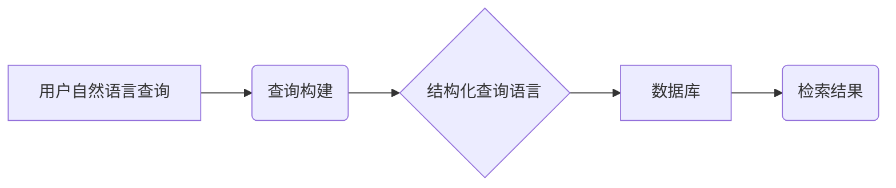
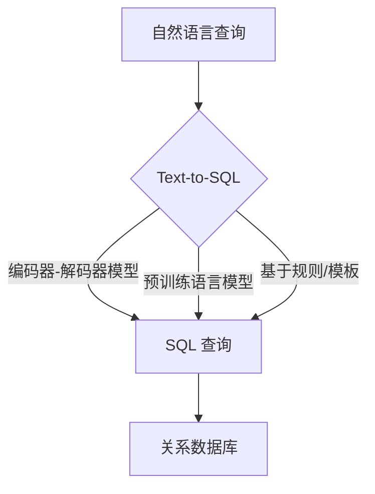
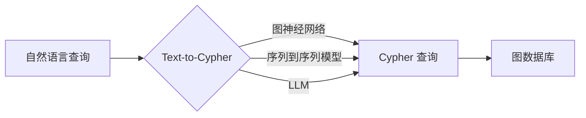
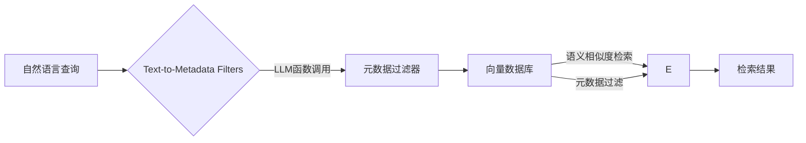

## **I. 引言**

在 RAG 流程中，查询构建扮演着至关重要的角色。它是连接用户自然语言查询和底层数据库之间的桥梁，直接影响着信息检索的质量和效率。然而，查询构建也面临着巨大的挑战：如何将用户友好但 often 含糊不清的自然语言，准确无误地转换为机器可以理解的结构化查询语言。

本文将深入探讨 RAG 系统中的查询构建艺术，重点介绍三种关键技术：Text-to-SQL、Text-to-Cypher 和 Text-to-Metadata Filters。我们将揭示这些技术的工作原理、应用场景、优势和局限性，并展望查询构建技术的未来发展方向。

## **II. 查询构建：连接自然语言和数据库的桥梁**

查询构建是指将用户的自然语言查询转换为数据库可以理解的结构化查询语言的过程。它是 RAG 系统中不可或缺的一环，因为只有将用户的查询转化为机器可执行的指令，才能从数据库中检索到相关的信息。

_Mermaid 图标描述：用户提出自然语言查询，经过查询构建模块，转化为结构化查询语言，然后查询数据库，最后得到检索结果。_

查询构建的重要性体现在以下几个方面：

- **使非技术用户能够轻松与数据交互：** 通过自然语言查询，用户无需掌握复杂的数据库查询语法，即可轻松访问所需信息。
- **支持 RAG 系统访问和利用各种数据源：** 不同的数据库系统使用不同的查询语言，查询构建技术使得 RAG 系统能够与各种数据源无缝对接。
- **提高数据检索的准确性和效率：** 精准的查询构建可以确保检索到与用户意图最匹配的信息，从而提高 RAG 系统的整体性能。

然而，查询构建也面临着一系列挑战：

- **自然语言的歧义性和复杂性：** 人类的语言具有丰富的表达方式和潜在的歧义性，这给机器理解带来了困难。
- **不同数据库系统的查询语言差异：** 关系数据库、图数据库和向量数据库等不同的数据库系统使用不同的查询语言，增加了查询构建的复杂性。
- **需要处理各种查询类型和复杂性：** 从简单的关键词查询到复杂的多表连接和嵌套查询，查询构建需要处理各种类型的查询需求。

## **III. Text-to-SQL：驾驭关系数据库**

Text-to-SQL 技术旨在将自然语言查询转换为 SQL 语句，从而实现对关系数据库的访问。关系数据库以其成熟的技术和广泛的应用，成为企业存储和管理结构化数据的主要方式。Text-to-SQL 的应用场景包括商业智能、数据分析和数据库管理等。

_Mermaid 图标描述：Text-to-SQL 模块接收自然语言查询，可以通过多种方法 (编码器-解码器模型, 预训练语言模型, 基于规则/模板) 转化为 SQL 查询，然后查询关系数据库。_

早期 Text-to-SQL 的方法主要基于规则或模板，这些方法在处理复杂查询和应对语言多样性方面存在很大的局限性。近年来，基于深度学习的方法逐渐成为主流，特别是编码器-解码器模型和预训练语言模型 (如 BERT、T5) 的应用，显著提升了 Text-to-SQL 模型的性能。此外，利用数据库模式信息对模型进行增强，可以进一步提高查询生成的准确性。

大型语言模型 (LLM) 的出现，为 Text-to-SQL 技术带来了新的机遇。LLM 凭借其强大的语言理解和生成能力，在少样本学习甚至零样本学习的场景下，展现出惊人的 Text-to-SQL 转换能力。通过合适的提示工程 (Prompt Engineering)，可以引导 LLM 生成符合特定数据库模式的 SQL 语句。

Text-to-SQL 技术已经在一些基准数据集 (如 Spider、WikiSQL) 上取得了显著的成果，并在实际应用中展现出巨大的潜力。例如，商业智能工具可以利用 Text-to-SQL 技术，让用户通过自然语言与数据进行交互，从而降低数据分析的门槛。

然而，Text-to-SQL 技术仍然面临一些挑战，例如处理复杂的 SQL 查询 (如多表连接、嵌套查询和聚合函数)，提高模型的泛化能力和鲁棒性，以及确保模型的可解释性和可信赖性。未来的研究将致力于解决这些挑战，进一步提升 Text-to-SQL 技术的实用性。

## **IV. Text-to-Cypher：探索图数据库的奥秘**

Text-to-Cypher 技术专注于将自然语言查询转换为 Cypher 语言，用于查询图形数据库。图形数据库以节点、关系和属性的形式表示数据，擅长处理复杂的关联关系，广泛应用于知识图谱、社交网络分析、欺诈检测和推荐系统等领域。

_Mermaid 图标描述：Text-to-Cypher 模块接收自然语言查询，可以通过图神经网络、序列到序列模型或 LLM 转化为 Cypher 查询，然后查询图数据库。_

Cypher 是一种声明式的图查询语言，它使用模式匹配的方式来描述和查询图数据。Cypher 查询通常包含 `MATCH` 子句来指定要查找的模式，`WHERE` 子句来过滤结果，以及 `RETURN` 子句来指定返回的数据。

与 Text-to-SQL 类似，早期的 Text-to-Cypher 方法也主要依赖于规则和模板，这些方法难以处理复杂的图模式和自然语言的多样性。近年来，基于深度学习的方法，特别是图神经网络 (GNN) 和序列到序列模型的应用，为 Text-to-Cypher 技术带来了突破。

LLM 的强大能力也为 Text-to-Cypher 提供了新的解决方案。通过将自然语言查询和图数据库模式信息输入到 LLM 中，可以利用 LLM 的理解和推理能力生成相应的 Cypher 代码片段。

Text-to-Cypher 技术已经在一些实际应用中取得了成功，例如，Neo4j 数据库与 LangChain 的集成为开发者提供了便捷的 Text-to-Cypher 工具。然而，Text-to-Cypher 仍然面临一些挑战，例如处理复杂的图模式和推理，提高模型对不同图数据库模式的适应性，以及结合外部知识和常识推理。

## **V. Text-to-Metadata Filters：释放向量数据库的潜能**

Text-to-Metadata Filters 技术将自然语言查询转换为向量数据库的元数据过滤器，从而实现基于语义和元数据的细粒度检索。向量数据库擅长存储和检索高维向量，广泛应用于语义搜索、图像和视频检索等领域。

_Mermaid 图标描述：Text-to-Metadata Filters 模块接收自然语言查询，通过 LLM 函数调用生成元数据过滤器，然后查询向量数据库，结合语义相似度检索和元数据过滤得到最终的检索结果。_

在向量数据库中，数据通常以向量的形式表示，并通过计算向量之间的相似度来进行检索。元数据过滤器则允许用户根据数据的属性 (例如，时间、作者、类别等) 对检索结果进行过滤。Text-to-Metadata Filters 技术结合了语义搜索和结构化查询的优势，可以实现更精准和灵活的检索。

Text-to-Metadata Filters 的实现通常依赖于 LLM 的函数调用能力。通过定义元数据模式 (Schema)，并将模式信息提供给 LLM，可以引导 LLM 将自然语言查询转换为结构化的元数据过滤器 (例如，JSON 格式)。LangChain 框架中的 `with_structured_output` 功能提供了一种便捷的实现方式。

Text-to-Metadata Filters 技术已经在一些向量数据库 (如 Chroma、Weaviate、Qdrant) 中得到应用，并在个性化推荐、图像和视频检索、文档管理等领域展现出良好的效果。

然而，Text-to-Metadata Filters 的性能也受到元数据的质量和完整性的影响。此外，定义清晰和完整的元数据模式也是一个重要的前提条件。

## **VI. 查询构建的最佳实践**

在实际应用中，选择合适的查询构建方法需要考虑多个因素，包括数据源类型、查询复杂度和性能要求等。以下是一些通用的最佳实践：

- **选择合适的方法：** 对于关系数据库，Text-to-SQL 是首选；对于图数据库，Text-to-Cypher 是更合适的选择；对于向量数据库，Text-to-Metadata Filters 可以提供更精细的控制。
- **数据预处理和清洗：** 确保数据的质量和一致性对于查询构建至关重要。
- **模式定义：** 为数据库和元数据定义清晰和完整的模式，以便 LLM 能够准确地理解数据的结构和含义。
- **提示工程 (Prompt Engineering)：** 设计有效的提示，引导 LLM 生成正确的查询语句。这包括提供清晰的指令、示例和上下文信息。
- **迭代和优化：** 通过测试和评估不断改进查询构建流程，例如，使用验证数据集来评估查询的准确性，并根据反馈进行调整。
- **结合上下文：** 在 RAG 流程中，考虑将上下文信息 (例如，之前的对话历史) 纳入查询构建过程，可以生成更精准和符合用户意图的查询。

**VII. 未来展望**

查询构建技术正在不断发展，未来将朝着以下几个方向前进：

- **更强大的查询构建模型：** 利用更先进的 LLM 和深度学习技术，提高查询构建的准确性、鲁棒性和效率。
- **自动化模式发现和查询生成：** 减少对人工定义模式的依赖，实现更智能的查询构建。
- **跨模态查询构建：** 支持文本、图像、音频等多种数据类型的查询，实现更广泛的应用场景。
- **查询构建的可解释性和可信赖性：** 提高查询构建过程的透明度，使用户能够理解和信任查询的结果。

### **VIII. 结语**

查询构建是 RAG 系统中的关键环节，它将用户的自然语言查询转化为机器可执行的指令，从而解锁数据的巨大潜力。Text-to-SQL、Text-to-Cypher 和 Text-to-Metadata Filters 是三种重要的查询构建技术，分别适用于关系数据库、图数据库和向量数据库。随着 LLM 和深度学习技术的不断发展，查询构建技术将变得更加强大和智能，为 RAG 系统以及更广泛的 AI 应用提供更强大的支持。未来，我们期待查询构建技术能够在更多领域得到应用，并为用户提供更便捷、更精准、更智能的信息访问体验。

