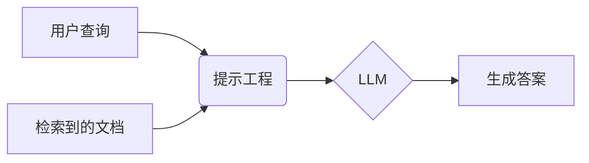
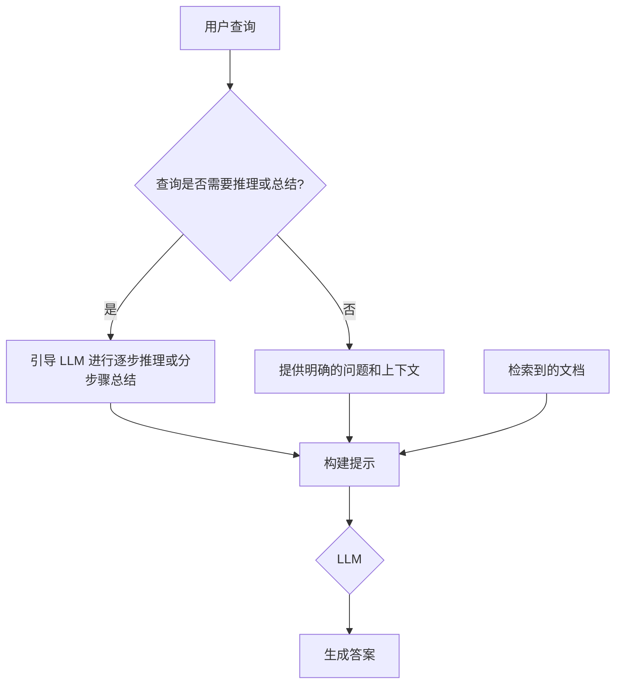
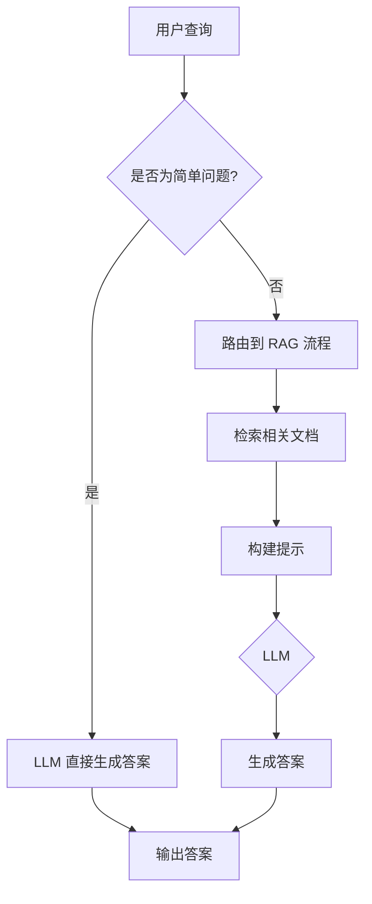
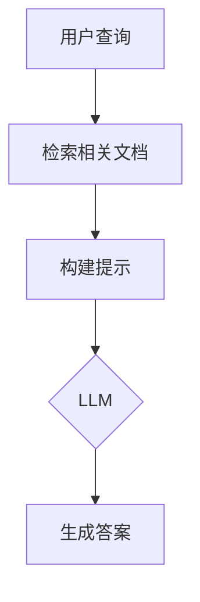
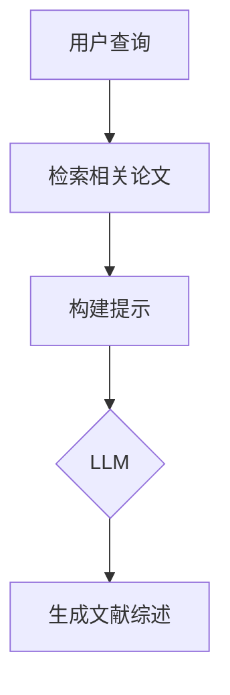

## **I. 引言**


在人工智能领域，检索增强生成 (Retrieval-Augmented Generation, RAG) 已经成为构建智能问答系统的强大框架。RAG 模型通过结合大型语言模型 (LLM) 的生成能力和外部知识库的检索能力，能够针对用户提出的问题，生成准确、相关且信息丰富的答案。在 RAG 流程中，生成阶段扮演着至关重要的角色，它是将检索到的信息转化为最终答案的关键步骤。本文将深入探讨 RAG 流程中的生成阶段，重点关注提示工程等技术如何提升生成答案的质量，并超越简单的文本拼接，构建真正智能的问答系统。


## **II. 生成阶段的核心任务：从文档到答案**


**A. 理解生成阶段的目标**


生成阶段的核心任务是基于检索到的文档和用户查询，合成一个准确、相关且流畅的自然语言答案。这不仅仅是将检索到的文本片段简单地拼接在一起，而是需要 LLM 对检索到的信息进行理解、推理和整合，最终生成一个连贯且有意义的答复。


**B. 生成阶段的输入**


生成阶段的输入主要包括两部分：检索到的文档和用户查询。


**1. 检索到的文档：** 作为输入的文档集合通常具有以下特点：

- **多文档：** 为了提供更全面的信息，RAG 系统通常会检索多个相关的文档。
- **多数据源：** 这些文档可能来自不同的数据源，例如不同的数据库或不同的文件系统，这已经在路由阶段确定。
- **预处理：** 文档可能已经过预处理，例如在索引阶段进行了摘要提取或分块处理，以便于检索和生成。

**2. 用户查询：** 理解用户查询的意图和信息需求是生成阶段成功的关键。需要注意的是，原始的用户查询可能已经在查询转换和查询构建阶段进行了修改，例如：

- **查询重写：** 为了更好地匹配索引中的文档，原始查询可能被改写成多个语义相似但措辞不同的查询。
- **查询分解：** 复杂的查询可能被分解成多个子查询，以便于检索和生成。
- **查询扩展：** 使用同义词、上位词等对查询进行扩展，以提高检索的召回率。

**C. 生成阶段的输出**


生成阶段的期望输出是一个自然语言形式的答案，一个好的答案应该具备以下特性：

- **准确性 (Accuracy)：** 答案必须基于检索到的文档，并且事实正确，不能包含虚假或误导性信息。
- **相关性 (Relevance)：** 答案必须与用户查询相关，并直接解决用户的疑问。
- **流畅性 (Fluency)：** 答案必须语法正确，表达清晰、自然，易于理解。
- **完整性 (Completeness)：** 答案应该尽可能完整地回答问题，不遗漏重要信息。
- **简洁性 (Conciseness)：** 在保证完整性的前提下，答案应该尽可能简洁明了，避免冗余和重复。

## **III. 提示工程：引导 LLM 生成高质量答案**


**A. 提示工程的重要性**


提示工程 (Prompt Engineering) 在引导 LLM 生成期望的答案方面起着至关重要的作用。一个精心设计的提示可以显著提高生成答案的准确性、相关性和流畅性。通过在提示中提供清晰的指令、必要的上下文信息以及适当的约束和示例，可以有效地引导 LLM 生成符合要求的答案。


**B. 构建有效的提示**


**1. 明确指示：**


在提示中清晰地指示 LLM 的任务至关重要。应该使用明确的指令，例如“请根据以下文档回答问题”、“请总结以下文档的主要内容”等，避免使用模糊或含糊不清的措辞。


**示例：**

- **不佳的提示：** “告诉我关于这个主题的事情。”
- **较好的提示：** “请根据以下提供的文档，总结人工智能在医疗保健领域的应用。”

**2. 上下文信息：**


在提示中提供必要的上下文信息，例如检索到的文档、用户查询以及对话历史 (如果存在)，可以帮助 LLM 更好地理解任务要求。上下文信息应该组织得当，以便 LLM 能够轻松地理解和利用。


以下是一个简单的 Mermaid 流程图，展示了如何将用户查询和检索到的文档作为上下文信息提供给 LLM：





**3. 约束和限制：**


在提示中添加约束和限制可以控制生成答案的格式、长度和风格。例如，可以使用“请用一句话回答问题”、“请使用正式的语气”、“答案长度不超过 200 字”等约束。


**示例：**

- “请用一句话总结这篇论文的主要贡献。”
- “请使用通俗易懂的语言解释什么是深度学习，并控制答案在 100 字以内。”

**4. 示例和演示：**


在提示中提供示例或演示 (少样本学习 Few-shot Learning) 可以帮助 LLM 理解任务要求和期望的输出格式。


**示例：**


```plain text
问题：中国的首都是哪里？
答案：北京

问题：法国的首都是哪里？
答案：巴黎

问题：日本的首都是哪里？
答案：
```


**5. 角色扮演：**


通过角色扮演可以引导 LLM 生成更符合特定场景的答案。例如，可以使用“假设你是一位经验丰富的医生，请解释...”或“假设你是一位专业的客服代表，请回答...”等角色设定。


**示例：**

- “假设你是一位人工智能专家，请向非专业人士解释 RAG 模型的工作原理。”

**C. 针对不同任务的提示设计**


**1. 问答：**


针对问答任务，提示应该明确指出问题和相关的上下文信息。对于复杂的推理或总结类问题，可以在提示中引导 LLM 进行逐步推理或分步骤总结。


以下是一个更详细的 Mermaid 流程图，展示了问答任务的提示设计：





**示例：**

- “根据以下文档，解释人工智能在自动驾驶汽车中的应用，并分析其优势和局限性。” (复杂问题，需要推理和总结)

**2. 摘要：**


针对摘要任务，提示应该明确指出需要摘要的文本，并可以指定摘要的长度、重点等要求。


**示例：**

- “请将以下文章总结成一段不超过 150 字的摘要，并突出文章的主要观点。”

**3. 翻译：**


针对翻译任务，提示应该明确指出需要翻译的文本、源语言和目标语言，还可以指定翻译的风格 (例如，正式、非正式)。


**示例：**

- “请将以下英文句子翻译成中文，并使用正式的商务风格：'This is a revolutionary product that will change the way we live.'”

**D. 提示工程的迭代优化**


提示工程是一个迭代优化的过程，需要根据实际效果不断调整和改进。可以通过人工评估、自动评估指标 (例如，BLEU、ROUGE) 以及 A/B 测试等方法来评估提示的效果，并根据评估结果对提示进行修改和优化。


## **IV. 案例研究：实际应用中的生成**


**A. 智能客服**


在智能客服场景中，RAG 模型可以用于构建能够回答用户关于产品或服务问题的智能客服系统。例如，用户可能会问“你们的退货政策是什么？”或“如何升级我的账户？”。


**实现：**

1. **数据准备：** 收集和整理产品文档、FAQ、用户手册等相关资料，并将其索引到向量数据库中。
2. **查询路由：** 对于简单问题，可以直接使用 LLM 生成答案；对于复杂问题，则路由到 RAG 流程。
3. **检索：** 根据用户查询，从向量数据库中检索相关的文档片段。
4. **生成：** 设计合适的提示，引导 LLM 基于检索到的文档片段生成准确、流畅且符合客服场景的答案。例如：

    ```plain text
    您好！根据我们的记录，关于您的问题“{用户查询}”，以下信息可能对您有所帮助：
    
    {检索到的文档片段}
    
    希望以上信息能够解答您的疑问。如果您还有其他问题，请随时提出。
    ```


以下是智能客服场景下 RAG 流程的 Mermaid 图表：





**挑战与解决方案：**

- **挑战：** 用户的问题可能多种多样，难以预测。
- **解决方案：** 使用查询重写和查询扩展等技术，提高检索的召回率；使用 Self-RAG 等技术处理知识库以外的问题。 (虽然本篇不讨论主动检索，但可以简要提及作为挑战的解决方案)
- **挑战：** 需要保证答案的准确性和安全性，避免出现误导性或不恰当的回复。
- **解决方案：** 使用高质量的数据源，并对 LLM 进行微调，使其更好地理解和遵循客服规范。

**B. 文档问答**


RAG 模型可以用于构建能够从大量文档中检索信息并回答用户问题的系统。例如，用户可能会问“深度学习的最新进展有哪些？”或“这篇论文的主要贡献是什么？”。


**实现：**

1. **数据准备：** 将大量的文档 (例如，学术论文、新闻报道、技术博客等) 进行预处理，例如分块、提取摘要等，并将其索引到向量数据库中。
2. **检索：** 根据用户查询，从向量数据库中检索相关的文档或文档块。
3. **生成：** 设计合适的提示，引导 LLM 基于检索到的文档生成准确、流畅且符合学术规范的答案。例如：

    ```plain text
    根据以下文档：
    
    {检索到的文档}
    
    关于您的问题“{用户查询}”，以下是相关的研究进展：
    
    {生成的答案}
    ```


以下是文档问答场景下 RAG 流程的 Mermaid 图表：





**挑战与解决方案：**

- **挑战：** 文档数量庞大，检索效率和准确性难以保证。
- **解决方案：** 使用高效的索引结构和检索算法，例如，使用多重表示索引或层次化索引 (如 Raptor) 等方法。
- **挑战：** 需要处理复杂的学术问题，答案可能需要跨文档整合和推理。
- **解决方案：** 使用更强大的 LLM，并设计合适的提示，引导 LLM 进行深入的推理和总结。

**C. 研究助手**


RAG 模型可以帮助研究人员快速找到相关的文献并总结关键信息，提高研究效率。例如，研究人员可能会问“关于 RAG 模型，最近有哪些重要的论文发表？”或“这几篇论文的主要贡献是什么？”。


**实现：**

1. **数据准备：** 收集和整理特定领域的学术论文，并将其索引到向量数据库中。可以利用论文的元数据 (例如，标题、作者、摘要、关键词) 进行索引和检索。
2. **检索：** 根据研究人员的查询，从向量数据库中检索相关的论文。
3. **生成：** 设计合适的提示，引导 LLM 基于检索到的论文生成文献综述、研究方向分析等。例如：

    ```plain text
    以下是关于“{用户查询}”主题的几篇重要论文：
    
    {检索到的论文列表 (包括标题、作者、摘要等)}
    
    根据这些论文，以下是该领域的最新研究进展和未来方向：
    
    {生成的文献综述}
    ```


以下是研究助手场景下 RAG 流程的 Mermaid 图表：





**挑战与解决方案：**

- **挑战：** 学术论文通常比较长且复杂，需要深入理解和总结。
- **解决方案：** 使用长上下文 LLM，或使用文档分块和摘要提取等技术，将长论文分解成更易于处理的片段。
- **挑战：** 需要保证生成结果的准确性和可靠性。
- **解决方案：** 使用高质量的学术论文数据库，并对 LLM 进行微调，使其更好地理解学术语言和规范。

## **V. 总结与展望**


生成阶段是 RAG 流程中的关键环节，其目标是基于检索到的文档和用户查询，生成准确、相关且流畅的自然语言答案。提示工程等技术在引导 LLM 生成高质量答案方面发挥着重要作用。通过精心设计提示，可以有效地控制生成答案的质量和风格。


未来，随着 LLM 技术的不断发展，特别是更大、长上下文模型的发展，以及更精细化的提示工程技术，RAG 模型的生成能力将进一步提升。此外，RAG 模型与其他技术的结合，例如知识图谱和强化学习，也将为构建更智能、更强大的问答系统开辟新的道路。

