## 一、 引言：从大海捞针到精准捕捞


想象一下，你站在一个巨大的图书馆里，里面藏有数以亿计的书籍。你需要找到一本特定的书，或者找到关于某个特定主题的所有书籍。你手里唯一的工具就是一个小小的检索框。你输入的几个关键词，就像是你抛入信息海洋的鱼钩，而你能否钓到你想要的“鱼”，就取决于你的鱼钩是否精准、你的钓鱼技巧是否高超。


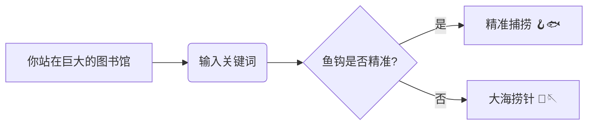


在人工智能 (AI) 的世界里，这个“巨大的图书馆”就是互联网和各种庞大的数据库，而那个“小小的检索框”就是我们与 **检索增强生成 (Retrieval-Augmented Generation, RAG)** 系统交互的窗口。RAG 是一种前沿的人工智能技术，它结合了**信息检索**和**文本生成**的强大能力，让 AI 不仅能从海量数据中找到信息，还能用流畅自然的语言回答我们的问题，甚至撰写文章、创作诗歌。


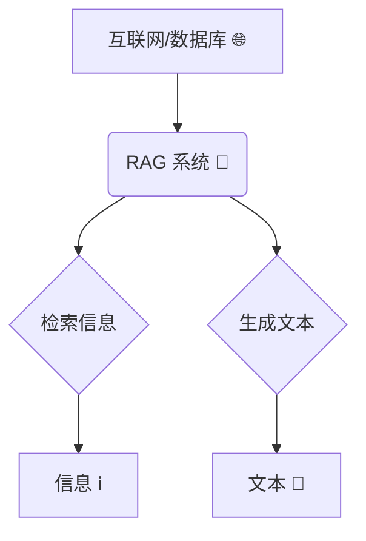


RAG 的潜力是巨大的，它就像一个拥有超级记忆力和创造力的智能助手，可以帮助我们解答疑惑、获取知识、激发灵感。但是，就像我们在图书馆里找书一样，如果我们输入的关键词——也就是“**查询**”——不够准确或不够完善，RAG 也难以发挥它的威力。我们可能会得到一堆无关紧要的信息，或者与我们真正想要的内容失之交臂。这就好比，你明明想找的是《红楼梦》，却因为输入了“石头”而得到了一堆关于地质学的书籍。


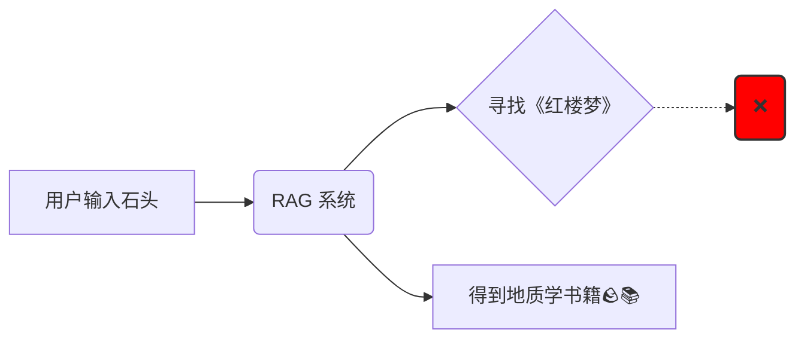


那么，如何才能让我们的“鱼钩”更精准，让我们的“钓鱼”技巧更高超呢？答案就是 **查询转换 (Query Transformation)**。如果把 RAG 比作一辆高性能跑车，那么查询转换就是它的“智能导航系统”。它通过一系列巧妙的技术，对我们输入的原始查询进行优化和改进，从而指引 RAG 这辆跑车驶向正确的方向，最终抵达我们想要的知识彼岸。


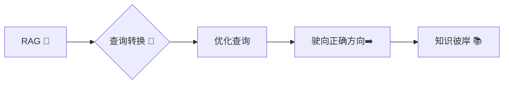


接下来，就让我们一起揭开查询转换的神秘面纱，探索它是如何赋予 RAG 系统“智慧”，让它更好地理解我们的需求，从信息海洋中为我们精准捕捞知识的珍珠。


## 二、 用户查询的“拦路虎”：为什么 RAG 需要“翻译”你的话？


我们每天都在使用搜索引擎，输入各种各样的查询。但你有没有想过，为什么有时候搜索结果差强人意？为什么搜索引擎似乎“听不懂”我们的话？这是因为，人类的语言充满了微妙和复杂性，而机器理解起来却并非易事。


### A. 自然语言的“陷阱”

- **模糊性 (Ambiguity)：** 想想“苹果”这个词，它可以指一种水果，也可以指一家科技公司，还可以指其他的东西。人类可以根据上下文轻松理解“苹果”的具体含义，但机器却很容易混淆。这就是语言的“模糊性”，同一个词语，可能有多种解释，像一个狡猾的“变色龙”🦎，让机器难以捉摸。

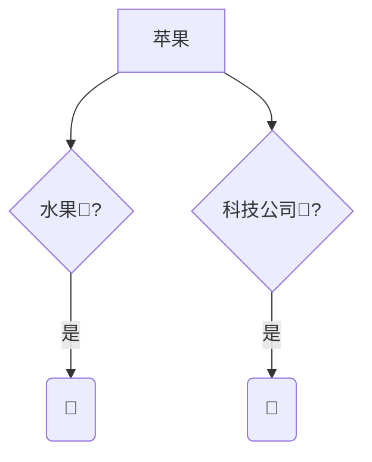

- **不完整性 (Incompleteness)：** 我们向搜索引擎提问时，往往会省略一些我们认为“不言而喻”的信息。比如，你想知道“如何制作披萨”，你可能只会输入“披萨制作”，而不会详细说明你是要制作哪种披萨，使用什么工具等等。我们的大脑会自动补全这些缺失的信息，但机器却需要我们明确地告诉它。

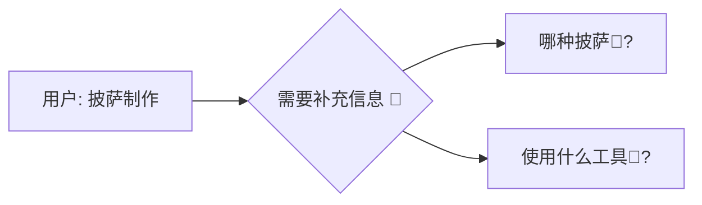

- **表达多样性 (Variability in Expression)：** “今天天气怎么样？”“今天气温多少度？”“今天适合外出吗？”这三个问句，表达的其实是同一个意思，但措辞却千差万别。人类可以轻易理解这些表达背后的共同意图，但机器却需要学习大量的语言模式才能做到这一点。

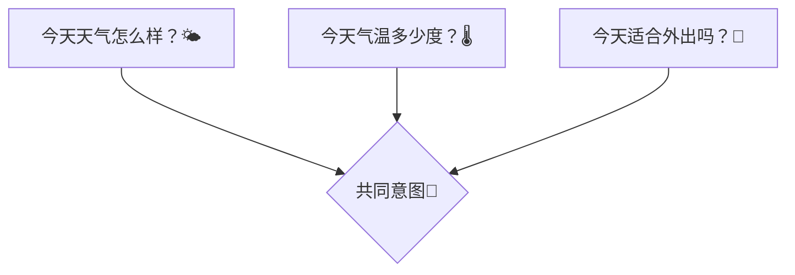

- **知识差距 (Knowledge Gap)：** 想象一下，一位医学专家和一位普通人同时搜索“心肌梗塞的症状”。专家可能会使用专业的医学术语，而普通人可能只会用一些通俗的说法，比如“心脏病发作的迹象”。机器需要能够理解不同知识背景下的查询，才能返回准确的结果。

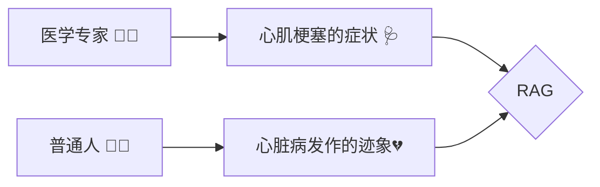


### B. 检索效果的“绊脚石”


这些自然语言的“陷阱”，会给 RAG 系统的检索效果带来一系列“绊脚石”：

- **低召回率 (Low Recall)：** 想象一下，你想要找一本关于“人工智能在医疗领域应用”的书，但你只输入了“AI 医疗”。由于你的查询太宽泛，图书馆的检索系统可能无法找到所有相关的书籍，导致你错过了很多有价值的信息，这就是“低召回率”——该找到的没找到。

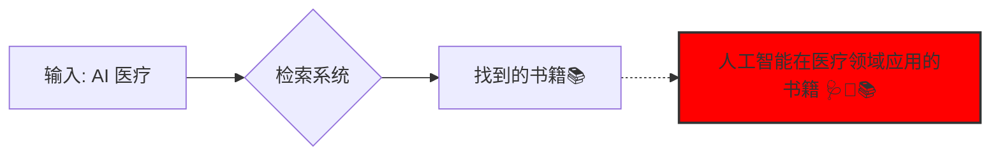

- **低精度 (Low Precision)：** 反过来，如果你输入的查询太模糊，比如只输入了“技术”，那么检索系统可能会返回一大堆关于各种技术的书籍，其中只有很少一部分是关于人工智能的。这就是“低精度”——找到的很多，但相关的很少。

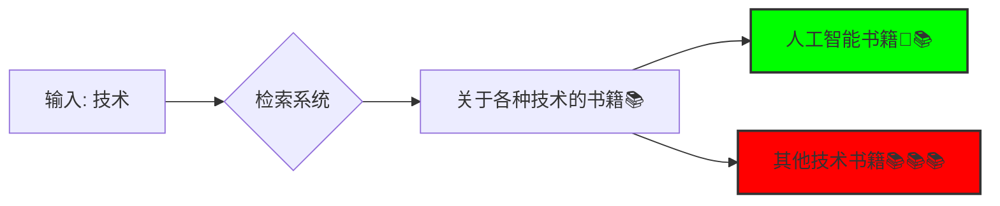

- **排序不佳 (Poor Ranking)：** 即使检索系统找到了一些相关的书籍，也可能把它们排在结果列表的后面，而把一些不太相关的书籍排在前面。这就好比，你最想看的书被埋没在了书堆里，需要你费力地去翻找，这就是“排序不佳”。

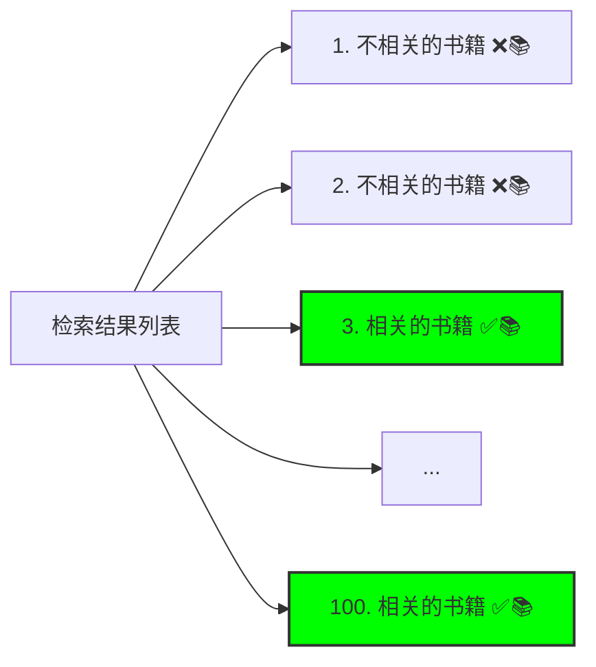


### C. 查询转换的“魔法棒”


面对这些挑战，查询转换就像一根“魔法棒”，它可以：

- **明确查询意图 (Clarify Query Intent)：** 通过分析查询的上下文，消除歧义，准确地理解用户想要什么。就像一位聪明的翻译，能够准确地将用户的“自然语言”翻译成机器能够理解的“机器语言”。
- **补充背景信息 (Supplement Background Information)：** 通过添加相关的背景知识，让查询的含义更加丰富和完整。就像一位知识渊博的助手，能够根据用户的需求，提供必要的补充信息。
- **提高检索效率 (Improve Retrieval Efficiency)：** 通过生成更精准或更广泛的查询，引导 RAG 系统更快地找到相关的答案。就像一位高效的导航员，能够为 RAG 系统规划出最佳的检索路径。

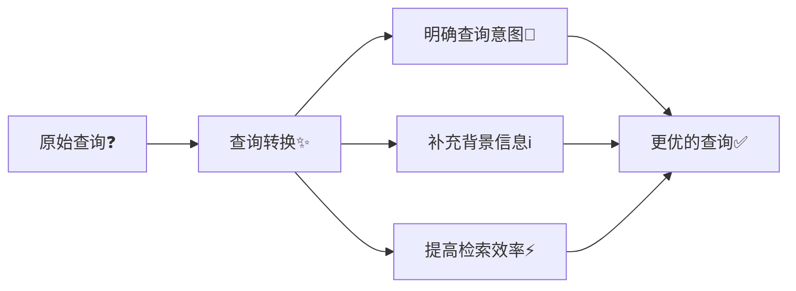


现在，我们已经明白了查询转换的重要性，接下来，就让我们一起探索那些神奇的查询转换技术吧！


## 三、 查询重写技术：给你的查询“换个说法”


查询重写技术就像是一位“语言大师”，它能够将你的原始查询改写成更有效、更精准的形式，从而提高 RAG 系统的检索效果。


### A. 多查询 (Multi-Query)：集思广益，多管齐下


**定义：**  想象一下，你向一群人询问同一个问题，每个人都用自己的方式表达了对这个问题的理解。多查询技术正是借鉴了这种“集思广益”的思想。它将原始查询改写成多个不同角度、不同措辞的查询，就像是从多个方向同时搜索信息。


**原理：** 通过“多管齐下”的方式，扩大搜索范围，提高找到相关文档的可能性。就好比在茫茫大海中捕鱼，你撒下多张渔网，总有一张能够捕到你想要的鱼。


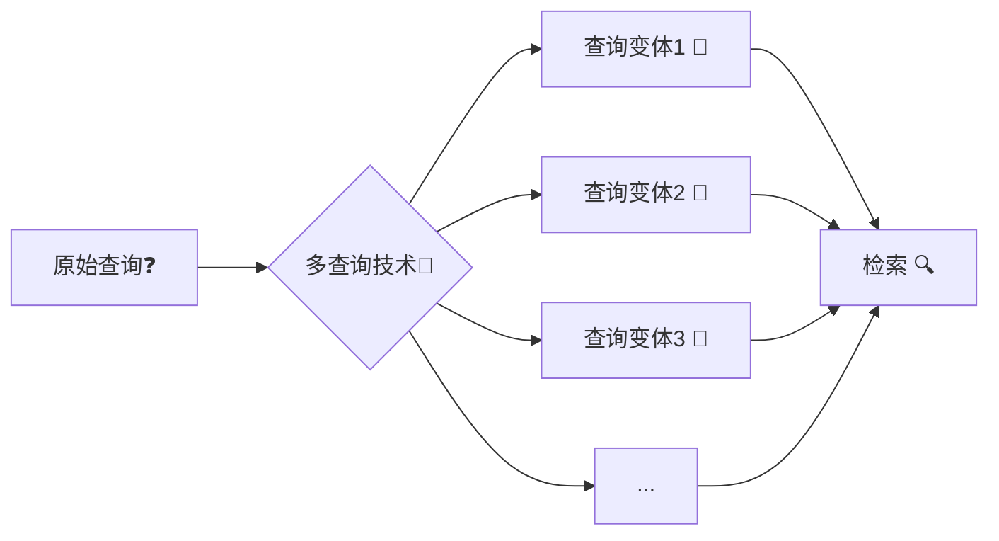


**实现方法：**

- a. **借助 LLM 的“改写”能力：** 我们可以利用大型语言模型 (LLM) 的强大文本生成能力，让它将原始查询改写成多个版本。例如，我们可以提示 LLM：“请用 5 种不同的方式改写这个查询，并保持原意不变。”
- b. **利用同义词和相关词“扩充”查询：** 我们可以借助词典、知识库等工具，找出原始查询中关键词的同义词、近义词或相关词，并将它们添加到查询中，从而生成更多的查询变体。

**示例：**

- 原始查询：“长期熬夜的危害有哪些？”
- 生成的查询：
    - “长期缺乏睡眠会有什么后果？”
    - “经常熬夜对身体有什么坏处？”
    - “熬夜对健康的长期影响是什么？”
    - “睡眠不足的危害”

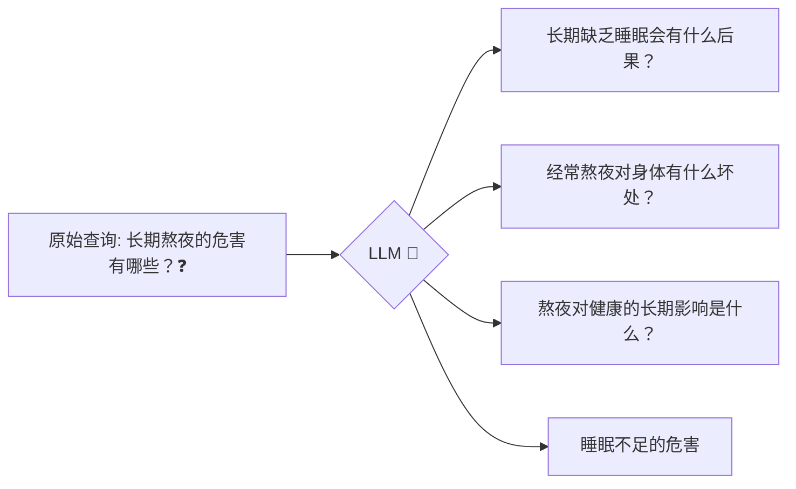


**优点：** 像“广撒网”一样，提高了找到相关文档的概率，也就是提高了“召回率”。


**缺点：** 可能会引入一些“噪声”，也就是找到一些不相关的文档。这就需要我们对检索结果进行筛选和去重，就像从捕获的鱼群中挑选出我们真正需要的鱼一样。


### B. RAG-Fusion：强强联手，锦上添花


**定义：**  如果说多查询技术是“广撒网”，那么 RAG-Fusion 就是“精挑细选”。它将多查询技术和一种叫做“倒数排序融合 (Reciprocal Rank Fusion, RRF)”的排序算法结合起来，可谓“强强联手”。


**原理：**

- a. 首先，像多查询技术一样，生成多个查询变体。
- b. 然后，对每个查询变体分别进行检索，得到多个结果列表。
- c. 最后，使用 RRF 算法对这些结果列表进行“融合”，得到一个新的、更优的排序列表。

**RRF 算法简要说明：**  RRF 算法会考察每个文档在不同结果列表中的排名情况。如果一个文档在多个列表中都排名靠前，那么 RRF 算法就会认为它更相关，并在最终的融合列表中给它更高的排名。可以理解为“综合多个专家的意见，得出更可靠的结论”。


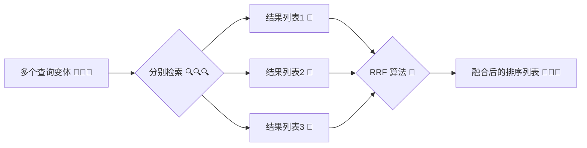


**优势：** 既利用了多查询技术“广撒网”的优势，又利用了 RRF 算法“精挑细选”的优势，从而提高了检索的“精度”和“排序”的准确性，可谓“锦上添花”。


**示例：**  假设我们有三个查询变体，RRF 算法会综合分析每个文档在这三个结果列表中的排名，然后给出一个新的排名，那些在三个列表中都排名靠前的文档，在新的排名中也会更靠前。


**应用场景：**  当你既想要找到尽可能多的相关信息（高召回率），又想要确保找到的信息尽可能准确（高精度）时，RAG-Fusion 就是你的最佳选择。


## 四、 查询分解技术：将“大问题”拆解成“小问题”


查询分解技术就像是一位“庖丁解牛”的高手，它能够将复杂的查询分解成一系列更简单的子查询，从而更容易找到答案。


### A. 由简至难 (Least to Most, LTM)：步步为营，逐个击破


**定义：**  面对一个复杂的问题，我们往往会将其分解成几个小问题，然后逐个解决。由简至难 (LTM) 技术正是采用了这种“分而治之”的策略。它将一个复杂的查询分解成一系列更简单的子查询，并按照由易到难的顺序依次解决。


**原理：**  通过先解决简单的子查询，我们可以获得一些基础的信息和知识，然后利用这些信息来更好地理解和解决后续更复杂的子查询，最终得到完整、准确的答案。就像爬楼梯一样，一步一个台阶，最终到达顶峰。


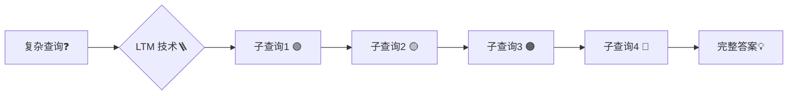


**步骤：**

- a. 将复杂的查询分解成一系列逻辑上相关的子查询，这些子查询之间通常存在依赖关系，例如，后面子查询的解决需要依赖前面子查询的结果。
- b. 按照由易到难的顺序，依次解决这些子查询，并将每个子查询的答案作为下一个子查询的“线索”或“背景知识”。

**示例：**

- 原始查询：“如何评估人工智能模型的性能？”
- 分解后的查询：
    - “什么是人工智能模型？”
    - “有哪些常见的评估指标可以用来衡量人工智能模型的性能？”
    - “如何根据具体的应用场景选择合适的评估指标？”
    - “如何解读和分析人工智能模型的评估结果？”


**优点：**  可以帮助 RAG 系统更好地处理复杂的、需要多步推理才能解决的查询。


**缺点：**  需要仔细设计子查询之间的逻辑关系，确保它们能够构成一个完整的、连贯的推理链条。这就像搭积木一样，每一步都要稳扎稳打，才能构建出坚固的结构。


### B. 带思维链的迭代检索 (Iterative Retrieval with Chain of Thought, CoT)：边思考，边检索


**定义：**  这种技术将查询分解和“思维链 (Chain of Thought, CoT)”提示技术结合起来，形成了一种“边思考，边检索”的迭代检索模式。


**原理：**

- a. 首先，将查询分解成多个步骤，类似于 LTM。
- b. 然后，每进行一个步骤，就进行一次检索，并将检索到的信息作为下一步的“思考素材”。
- c. 同时，利用 CoT 提示技术，引导 LLM 展示其“思考过程”，也就是解释它为什么选择某个检索结果，以及它如何利用这个结果来推导出下一步的查询。

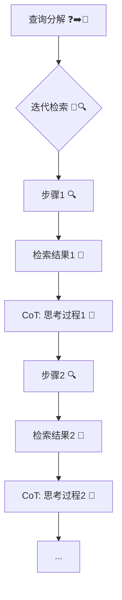


**优势：**  通过将检索和推理紧密结合，提高了检索的准确性和针对性。同时，通过展示 LLM 的“思考过程”，增强了 RAG 系统的可解释性，让我们更容易理解它是如何得出答案的。


**示例：**  假设一个子查询是“深度学习在自然语言处理中有哪些应用？”。RAG 系统会先进行检索，找到相关的文档，然后利用这些文档中的信息，结合 CoT 提示，生成下一个子查询，例如“深度学习中的循环神经网络 (RNN) 如何应用于文本分类任务？”。同时，RAG 系统还会解释它为什么选择 RNN 作为一个研究方向，例如“因为检索到的文档中多次提到了 RNN 在文本分类中的应用，所以我认为这是一个值得深入研究的方向”。


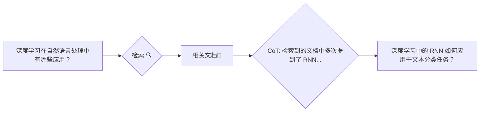


**应用场景：**  特别适合处理那些需要多步推理、信息整合和逻辑思考的复杂查询。


## 五、 退后提示 (Step-back Prompting)：高屋建瓴，总览全局


**定义：**  有时候，我们需要“退后一步”，从一个更高的角度来看待问题，才能更好地理解它。退后提示技术正是如此，它引导 LLM 生成一个更抽象、更概括性的问题，作为原始查询的“上位问题”。


**原理：**  通过提出一个更 general 的问题，我们可以获取更广泛的背景信息，这些信息可以帮助我们更好地理解原始查询的上下文，并补充其中可能缺失的知识。这就像站在山顶俯瞰山下的景色，可以看得更远、更清楚。


**实现方法：**  我们可以使用“少样本提示 (few-shot prompting)”来指导 LLM。具体来说，就是给 LLM 提供几个示例，展示如何将一个具体的查询“退后一步”变成一个更抽象的问题，然后让 LLM 对新的查询进行同样的“退后”操作。


**示例：**

- 原始查询：“猫为什么喜欢吃鱼？”
- 退后提示：“猫的饮食习性是什么？”
- 原始查询：“如何解决 Python 中的内存泄漏问题？”
- 退后提示：“如何管理 Python 程序的内存？”

```mermaid
graph LR
    A["猫为什么喜欢吃鱼？"] --> B{退后提示<binary data, 1 bytes><binary data, 1 bytes><binary data, 1 bytes>};
    B --> C["猫的饮食习性是什么？"];
    D["如何解决 Python 中的内存泄漏问题？"] --> E{退后提示<binary data, 1 bytes><binary data, 1 bytes><binary data, 1 bytes>};
    E --> F["如何管理 Python 程序的内存？"];
```


**优点：**  可以帮助我们找到更多相关的背景信息，特别是对于那些比较冷门或难以直接回答的查询，效果更佳。


**缺点：**  如果“退后”得太远，可能会引入一些不相关的信息。因此，我们需要仔细设计提示，控制好“退后”的“步幅”。


## 六、 海德 (Hyde) - 假设性文档嵌入 (Hypothetical Document Embeddings)：用“想象力”指引检索


**定义：**  海德 (Hyde) 是一种非常有趣的技术，它利用 LLM 的“想象力”来生成一篇“假设性文档 (Hypothetical Document)”，然后用这篇文档的“嵌入向量 (Embedding)”来进行检索。


**原理：**  Hyde 的核心思想是：与其直接用原始查询进行检索，不如先让 LLM “想象”一篇可能回答这个查询的文档，然后用这篇“想象”出来的文档进行检索。因为这篇“想象”的文档通常比原始查询更完整、更详细，所以它的嵌入向量可能与真实的相关文档更接近，从而更容易被检索到。


```mermaid
graph LR
    A[原始查询❓] --> B{Hyde 技术🧙‍♂️};
    B --> C[LLM 生成假设性文档 🤖📄];
    C --> D[文档嵌入向量 🔢];
    D --> E[用嵌入向量检索 🔍];
    E --> F[找到相关文档 📚];
```


**步骤：**

- 使用 LLM 根据原始查询生成一篇假设性文档。这篇文档不需要完全准确，甚至可以包含一些虚构的内容，只要它在语义上与原始查询相关即可。
- 将这篇假设性文档转换成一个嵌入向量，也就是用一个数字向量来表示这篇文档的语义信息。
- 使用这个嵌入向量在向量数据库中进行检索，找到与它最相似的真实文档。

**示例：**

- 原始查询：“火星上是否有生命？”
- 假设性文档：“虽然目前还没有在火星上发现确凿的生命证据，但科学家们已经发现了许多支持火星上可能存在生命的迹象。例如，火星上发现了液态水的痕迹，而水是生命存在的必要条件之一。此外，火星的大气层中也含有一些有机分子，这些分子可能是生命活动的产物。未来，科学家们将继续探索火星，寻找更多关于火星生命的证据。”

```mermaid
graph LR
    A["火星上是否有生命？"] --> B{LLM 生成假设性文档🤖📄};
    B --> C["虽然目前还没有在火星上发现确凿的生命证据..."];
```


**优点：**  对于那些简短、信息不完整的查询，Hyde 可以显著提高检索效果。


**缺点：**  Hyde 的效果很大程度上取决于 LLM 生成的假设性文档的质量。如果 LLM “想象”出来的文档与原始查询的意图偏差较大，那么检索效果反而会变差。


## 七、 总结：RAG 的“智慧”之源


通过对以上各种查询转换技术的介绍，我们可以看到，查询转换就像是 RAG 系统的“智慧”之源，它赋予了 RAG 系统理解和处理复杂查询的能力，让 RAG 系统不再是一个简单的“信息搬运工”，而是一个能够“思考”和“推理”的智能助手。


```mermaid
graph LR
    A[RAG 系统🤖] --> B{查询转换技术🔑};
    B --> C[理解复杂查询🧠];
    B --> D[思考和推理🤔];
    C --> E[智能助手💡];
    D --> E;
```


从多查询的“集思广益”，到 RAG-Fusion 的“强强联手”，再到查询分解的“庖丁解牛”，以及退后提示的“高屋建瓴”和海德的“以虚促实”，每一种查询转换技术都有其独特的优势和适用场景。


**展望未来：**


查询转换技术的研究仍在不断发展，未来，我们有望看到更多更智能、更强大的查询转换技术的出现：

- **更智能、更自适应的查询转换系统：** 未来的查询转换系统可能会根据不同的查询类型、不同的应用场景，自动选择最合适的转换技术，甚至将多种技术组合起来使用，从而实现最佳的检索效果。
- **与用户更紧密的交互：** 查询转换系统可能会与用户进行更深入的交互，例如，通过多轮对话的方式，引导用户逐步明确自己的查询意图，或者向用户解释查询转换的过程和结果，从而提高用户对系统的信任度和满意度。
- **跨语言、跨领域的查询转换：** 随着全球化和信息化的发展，跨语言、跨领域的查询转换将变得越来越重要。未来的查询转换系统可能会打破语言和领域的壁垒，让用户可以用任何语言、查询任何领域的信息。

```mermaid
graph TD
    A[未来查询转换🔮] --> B{更智能、自适应🤖};
    A --> C{与用户更紧密交互🤝};
    A --> D{跨语言、跨领域🌐};
```


查询转换是通往 RAG 强大功能的一把钥匙，它将人机交互提升到了一个前所未有的高度。随着技术的不断发展，我们有理由相信，未来的 RAG 系统将会变得更加智能、更加强大，成为我们获取知识、解决问题、创造未来的得力助手！

