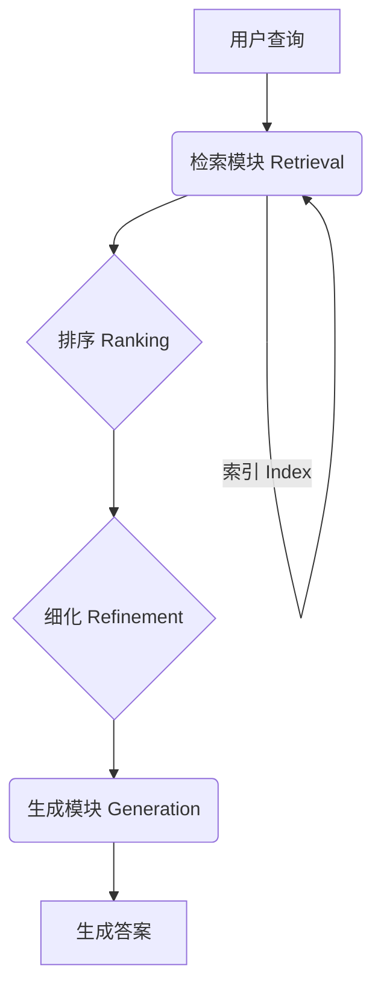
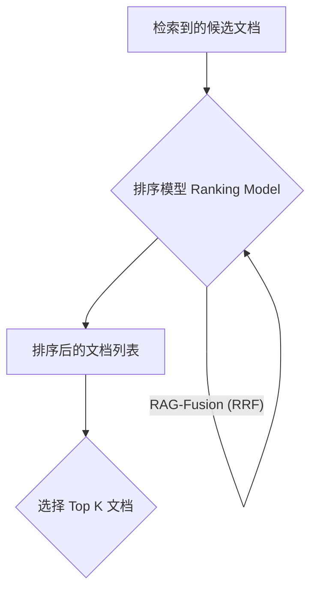
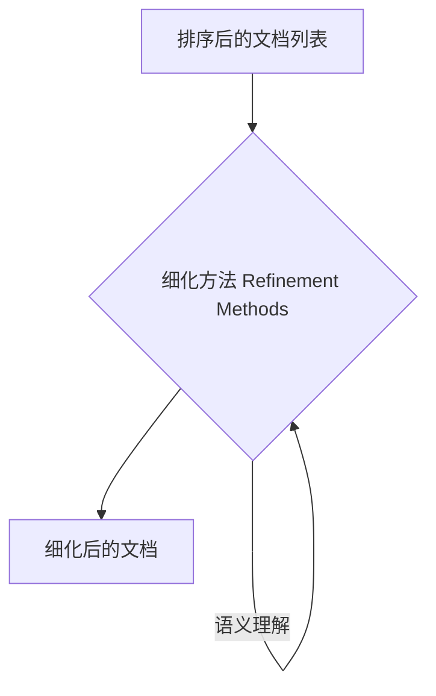
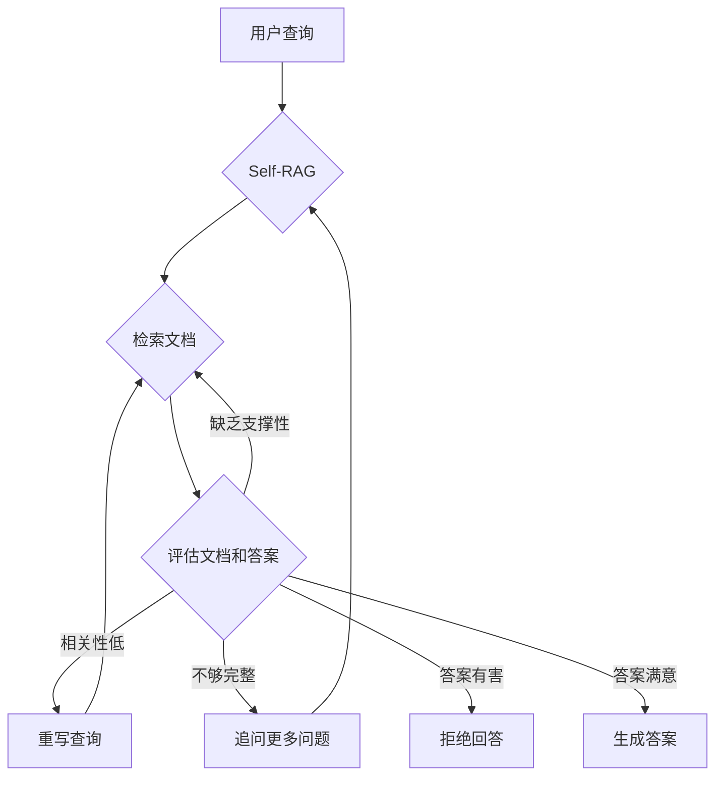

## **一、引言 (Introduction)**

大家好！你有没有想过，像 ChatGPT 这样聪明的人工智能 (AI) 是如何回答各种问题的呢？ 它们背后的一项关键技术叫做 **检索增强生成 (Retrieval-Augmented Generation, 简称 RAG)**。简单来说，RAG 就像是给 AI 配备了一个巨大的图书馆，当 AI 遇到问题时，它会先去图书馆里查找相关的资料，然后根据找到的资料来生成答案。

在 RAG 系统中，**检索 (Retrieval) 模块** 扮演着至关重要的角色，它负责从海量的文档中找出与用户问题最相关的信息。如果把 RAG 系统比作一个寻宝游戏，那么检索模块就是藏宝图，指引我们找到埋藏的宝藏。

**RAG 整体流程图**

**说明：**  用户提出问题，检索模块从索引中检索相关文档，然后对文档进行排序和细化，最后将处理后的文档交给生成模块，生成最终答案。

今天，我们就来聊聊 RAG 系统中检索的奥秘，特别是其中的两个关键环节：**排序 (Ranking)** 和 **细化 (Refinement)**。本文将带你深入了解这些技术，看看它们是如何帮助 AI 更准确、更高效地找到答案的。

## **二、检索的基础：找到相关的 “针” (Retrieval Basics: Finding the Relevant Needles)**

想象一下，你有一个巨大的干草堆，里面藏着几根针。你的任务是找到这些针。这就是检索模块面临的挑战。

**A. 从索引中提取信息**

在 RAG 系统中，这个“干草堆”就是 **索引 (Indexing)**。索引是一种特殊的数据结构，它将大量的文档 (例如网页、书籍、论文等) 预先处理并存储起来，以便快速查找。常见的索引类型包括：

- **向量数据库 (Vector Databases)：** 将文档转换为向量 (一串数字)，然后根据向量之间的相似度来查找相关文档。
- **关系型数据库 (Relational Databases)：** 像我们平时用的 Excel 表格一样，将数据 organized 成一张张表格，方便查询。
- **图数据库 (Graph Databases)：** 将数据表示成节点和边的关系图，适合处理复杂的关系数据。

当用户提出问题时，检索模块会根据查询内容，利用索引快速定位到可能包含答案的候选文档 (Candidate Documents)。

**B. 相似性度量 (Similarity Measures)**

找到了候选文档只是第一步，接下来我们需要判断哪些文档与用户的问题最相关。这就需要用到 **相似性度量 (Similarity Measures)**。

相似性度量就像一把尺子，用来衡量查询和文档之间的相关程度。常用的相似性度量方法包括：

- **余弦相似度 (Cosine Similarity)：** 计算两个向量之间的夹角余弦值，值越大表示越相似。
- **点积 (Dot Product)：** 计算两个向量的点积，值越大表示越相似。
- **欧几里得距离 (Euclidean Distance)：** 计算两个向量之间的距离，值越小表示越相似。

这些方法都依赖于 **嵌入 (Embeddings)** 技术，它能够将文本 (例如查询和文档) 转换为向量表示，从而可以用数学方法来计算它们之间的相似度。

**C. K-近邻 (K-Nearest Neighbors, KNN) 算法**

在检索中，我们通常使用 **K-近邻 (K-Nearest Neighbors, KNN)** 算法来查找与查询最相似的 K 个文档。你可以把它想象成一个投票过程：每个文档都对“谁与查询最相关”进行投票，得票最多的 K 个文档胜出。

K 值的选择很重要，太小可能会漏掉一些相关文档，太大会引入太多不相关的文档。

## **三、排序的艺术：将 “针” 堆中最好的 “针” 提出来 (The Art of Ranking: Separating the Best Needles from the Haystack)**

找到了候选文档，就像从干草堆里找到了一把针。但这些针的质量参差不齐，有些更锋利、更好用。**排序 (Ranking)** 的任务就是将这些 “针” 按照质量 (与查询的相关性) 从高到低排列，把最好的 “针” 挑选出来。

**A. 排序的必要性**

为什么要对检索到的文档进行排序呢？

- **提高最终生成结果的质量：** 将最相关的文档排在前面，可以帮助 AI 生成更准确、更相关的答案。
- **提升用户体验：** 用户希望在搜索结果的顶部看到最相关的文档，排序可以满足这种期望。

排序不仅仅是简单的相似性度量，它需要考虑更多因素，并使用更复杂的方法。

**B. 排序方法 (Ranking Methods)**

**排序 (Ranking) 流程图**

**说明：** 检索到的候选文档经过排序模型的处理，输出排序后的文档列表。常见的排序模型包括 ReRank、RankGPT 和 RAG-Fusion 中使用的 RRF 算法。

- **1. ReRank：基于更复杂的特征或模型进行重新排序**
    - ReRank 使用更强大的模型 (例如 BERT、RoBERTa 等前沿的 AI 模型) 重新计算查询和文档之间的相似度，并考虑更多的上下文信息。
    - 它可以与其他排序方法结合使用，进一步提升排序效果。
- **2. RankGPT：利用 LLM 的排序能力**
    - RankGPT 将排序问题转化为一个生成问题，巧妙地利用大型语言模型 (LLM) 的强大能力来进行排序。
    - 通过精心设计的提示工程 (Prompt Engineering)，我们可以引导 LLM 根据特定的任务或领域对文档进行排序。
- **3. RAG-Fusion 中的排序：结合多查询结果**
    - RAG-Fusion 是一种先进的 RAG 技术，它会从用户的原始查询衍生出多个相关的查询。
    - 然后，它会使用一种叫做 **倒数排序融合 (Reciprocal Rank Fusion, RRF)** 的算法，将多个查询的检索结果合并成一个最终的排序列表。
    - RRF 算法能够有效地提升检索性能，找到更多相关的文档。
- **4. 其他排序方法**
    - 除了上述方法，还有一些其他的排序方法，例如 **学习排序 (Learning to Rank, LTR)** 和 **基于图的排序算法** 等，它们可以根据不同的应用场景进行选择。

**C. 排序的评估指标 (Evaluation Metrics for Ranking)**

如何评估排序的效果呢？常用的评估指标包括：

- **平均倒数排名 (Mean Reciprocal Rank, MRR)：** 衡量第一个相关文档的排名情况。
- **归一化折扣累积增益 (Normalized Discounted Cumulative Gain, NDCG)：** 考虑所有相关文档的排名，并对排名靠后的文档进行“折扣”。
- **精确率 (Precision) 和召回率 (Recall)：** 衡量检索到的相关文档的比例和完整性。

我们需要根据具体的应用场景选择合适的评估指标。

## **四、细化的智慧：提炼 “针” 的精华 (The Wisdom of Refinement: Distilling the Essence of the Needles)**

找到了 “针” 并排好序之后，我们还可以进一步提炼 “针” 的精华，这就是 **细化 (Refinement)** 的作用。

**A. 细化的作用**

为什么要对检索到的文档进行细化呢？

- **去除无关或低质量的文档：** 进一步过滤掉与查询无关或质量较低的文档。
- **减少传递给生成模型的信息冗余：** 避免向生成模型输入过多不必要的信息，提高生成效率。
- **提高生成效率和准确性：** 更精炼的输入可以帮助生成模型产生更准确、更简洁的答案。

**B. 细化方法 (Refinement Methods)**

**细化 (Refinement) 流程图**

**说明：** 排序后的文档列表经过细化方法的处理，输出精简后的文档。常见的细化方法包括基于阈值的过滤、基于 LLM 的评分 (如 CRAG)、上下文压缩和语义理解。

- **1. 基于阈值的过滤 (Threshold-based Filtering)**
    - 根据相似度分数或其他指标设定一个阈值，将低于阈值的文档过滤掉。
- **2. 基于 LLM 的评分 (LLM-based Scoring)**
    - 使用 LLM 对检索到的文档进行评分，并根据评分进行过滤或重新排序。
    - **CRAG (Corrective Retrieval Augmented Generation)** 就是一个很好的例子，它利用 LLM 评估文档的相关性，并在必要时触发网络搜索来补充或替代检索结果。
- **3. 上下文压缩 (Context Compression)**
    - 使用一些技术 (例如文本摘要) 来缩短文档的长度，同时保留关键信息，从而减轻长上下文带来的挑战。
- **4. 语义理解 (Semantic Understanding)**
    - 利用自然语言处理 (NLP) 技术识别文档中的关键信息，并根据语义相关性进行过滤或选择。

**C. 细化的挑战**

细化也面临一些挑战：

- **如何在细化过程中保持信息的完整性：** 需要避免过度过滤，丢失重要的信息。
- **如何平衡细化的程度和计算成本：** 更精细的细化需要更多的计算资源。

## **五、超越传统检索：主动检索 (Beyond Traditional Retrieval: Active Retrieval)**

传统的检索通常是一个静态的过程：根据查询检索文档，然后生成答案。而 **主动检索 (Active Retrieval)** 则更进一步，它会根据中间结果或生成质量动态地调整检索策略。

**A. 主动检索的概念**

主动检索将检索过程从静态转变为动态，使其更具适应性和智能性。

**B. 主动检索的策略 (Active Retrieval Strategies)**

主动检索的核心思想是让 RAG 系统能够根据检索过程中的反馈信息，动态地调整检索策略，从而提高检索的准确性和效率。这种 “边检索边学习” 的模式，使得 RAG 系统能够更好地适应复杂的查询和多样化的信息需求。以下是一些常见的主动检索策略：

**主动检索 (Active Retrieval) 流程图 - 以 Self-RAG 为例**

**说明：** Self-RAG 根据用户查询检索文档，然后评估文档和答案的质量。根据评估结果，它可能会重写查询、检索更多文档、追问更多问题、拒绝回答或生成最终答案。

- **1. Self-RAG 中的主动检索：让 LLM 成为自己的 “质检员”**
    - **Self-RAG 的核心思想：** Self-RAG 引入了 **自反思 (self-reflection)** 机制，让 LLM 具备自我评估和自我改进的能力。它不再是简单地执行指令，而是会 “思考” 自己的检索和生成结果是否足够好，并根据 “思考” 的结果采取行动。
    - **如何利用 LLM 的评分机制指导检索：** Self-RAG 的关键在于它使用了特殊的 **反思标记 (reflection tokens)** 来引导 LLM 对检索到的文档和生成的答案进行评分。这些评分通常包括：
        - **相关性 (Relevance):** 检索到的文档与查询的相关程度。
        - **支撑性 (Support):** 生成的答案是否能够得到检索文档的支撑。
        - **完整性 (Completeness):** 生成的答案是否完整地回答了查询。
        - **有害性 (Harmfulness):** 生成的答案是否包含有害信息。
    - **何时以及如何触发重新检索：** Self-RAG 根据这些评分来决定下一步的行动。例如：
        - 如果检索到的文档 **相关性较低**，Self-RAG 可能会 **重写查询 (query rewriting)**，尝试使用不同的关键词或表达方式来获取更相关的文档。
        - 如果生成的答案 **缺乏支撑性**，Self-RAG 可能会 **检索更多文档**，以提供更充分的信息。
        - 如果生成的答案 **不够完整**，Self-RAG 可能会 **追问更多问题**，以获取更全面的信息。
        - 如果评分显示不需要检索或生成的答案已经足够好， Self-RAG 则会停止。
    - **示例：** 假设用户询问 “火星上是否有生命？”，Self-RAG 首先检索到一些关于火星气候的文章，但 LLM 评估后认为这些文章与 “生命” 的相关性不高。Self-RAG 可能会将查询重写为 “火星上是否存在生命的证据？”，然后再次进行检索，这次可能会找到更相关的关于火星上可能存在过的微生物的文章。
- **2. RRR (Rewrite-Retrieve-Read) 中的主动检索：迭代式 “精修” 查询**
    - **RRR 的流程：** RRR 是一种迭代式的 RAG 流程，它包括三个步骤：
        - **重写 (Rewrite)：** 根据当前的检索结果和上下文信息，重写用户的查询。
        - **检索 (Retrieve)：** 使用重写后的查询进行检索。
        - **阅读 (Read)：** LLM 阅读检索到的文档并生成答案。
    - **如何利用重写机制改进检索：** RRR 的核心在于 **查询重写 (query rewriting)**。通过不断地重写查询，RRR 可以逐步细化检索目标，缩小检索范围，从而找到更精准的答案。重写策略可以包括：
        - **添加上下文信息：** 将之前的检索结果中的关键词或短语添加到查询中。
        - **调整关键词：** 根据检索结果，替换或删除查询中的关键词。
        - **改变查询方式：** 将陈述句改为疑问句，或将一般疑问句改为特殊疑问句。
    - **示例：** 假设用户询问 “最新的手机有哪些？”，RRR 第一次检索可能会得到一些泛泛的手机信息。根据这些信息，RRR 可能会将查询重写为 “2023 年发布的最新款智能手机有哪些？”，从而将检索范围缩小到特定年份和手机类型。
- **3. CRAG (Corrective Retrieval Augmented Generation) 的主动检索： 把 “守门员” 放在检索阶段**
    - **CRAG 的流程：** CRAG 通过引入一个 “评估员” (Evaluator) 的角色，在检索阶段就对文档进行相关性评估，从而决定下一步的行动。
        - **评估 (Evaluate):** LLM 评估员对每一个检索到的文档判断是否与问题相关 (Relevant, Irrelevant, Neutral)。
        - **检索 (Retrieve):** 根据评估结果，如果存在相关文档，直接送入 LLM 生成回答；如果所有文档不相关或中立，则触发网络搜索，并将网络搜索结果作为新的输入。
    - **如何利用评估机制改进检索：**
        - **针对性补充外部知识:** CRAG 避免了对所有查询都进行网络搜索，只有当内部知识库无法回答时，才进行外部检索，更高效利用资源。
        - **提升回答质量:** 通过评估员的过滤，确保输入给 LLM 的信息都是相关的，提升最终生成的答案的质量。
    - **示例：** 用户询问 “LangChain 的最新版本是什么？”，如果内部知识库没有相关信息，所有检索到的文档都被评估员判定为 “不相关”， 这时 CRAG 会触发网络搜索，检索最新的 LangChain 版本信息，并将其作为输入送入 LLM 生成最终答案。
- **4. 其他主动检索方法：探索更多可能性**
    - **基于强化学习 (Reinforcement Learning) 的检索：** 将检索过程建模为一个强化学习问题，让 AI 通过与环境 (例如用户或评估指标) 的交互来学习最优的检索策略。这种方法可以根据不同的反馈信号 (例如用户满意度) 来动态调整检索行为。
    - **多轮对话中的检索：** 在多轮对话场景中，AI 可以根据对话历史和上下文信息来动态调整检索策略，从而更好地理解用户的意图和需求。例如，在多轮对话中，AI 可以逐步积累用户信息，并在后续的检索中利用这些信息来提高检索的准确性。
    - **基于知识图谱的检索：** 利用知识图谱中实体之间的关系来改进检索。例如，如果用户查询 “苹果公司的 CEO 是谁？”，AI 可以利用知识图谱中 “苹果公司” 和 “CEO” 之间的关系来找到答案。

**主动检索的优势和挑战**

- **优势：**
    - **提高检索的准确性和鲁棒性：** 通过动态调整检索策略，主动检索可以更好地适应复杂的查询和多样化的信息需求，并减少检索错误。
    - **提升用户体验：** 更准确的检索结果可以带来更好的用户体验。
    - **更有效地利用计算资源：** 通过按需检索，主动检索可以避免不必要的计算，提高效率。
- **挑战：**
    - **增加系统的复杂性和计算成本：** 主动检索通常需要更复杂的模型和算法，以及更多的计算资源。
    - **需要仔细设计反馈机制：** 主动检索的效果很大程度上取决于反馈机制的设计，例如如何评估检索结果的质量，如何根据反馈信号调整检索策略等。
    - **需要更多的数据和训练：** 一些主动检索方法 (例如基于强化学习的检索) 需要大量的数据和训练才能达到良好的效果。

## **六、总结 (Conclusion)**

检索是 RAG 系统中的核心模块，其性能直接影响到最终生成结果的质量。排序和细化是检索过程中的两个关键环节，它们可以帮助我们从海量的信息中找到最相关的 “针”，并提炼出 “针” 的精华。

随着 AI 技术的不断发展，检索技术也在不断进步。主动检索等新技术的出现，使得 RAG 系统变得更加智能和高效。未来，我们还将看到更多创新的检索方法，例如长上下文建模和多模态检索等，这将进一步提升 RAG 系统的性能。

在构建 RAG 系统时，我们需要根据具体的应用场景选择合适的检索策略。希望这篇文章能够帮助你更好地理解 RAG 系统中的检索技术！

