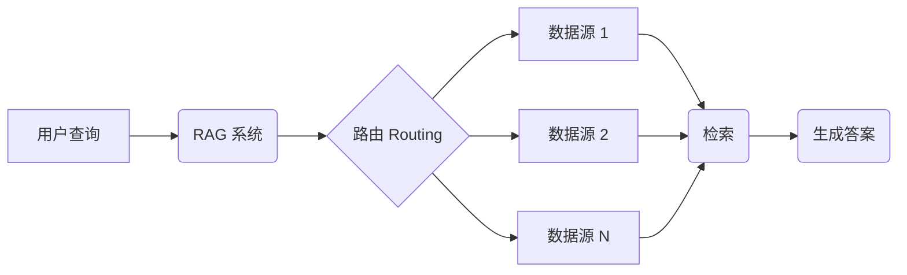
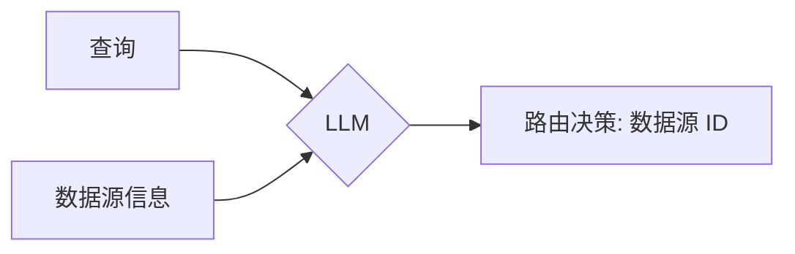
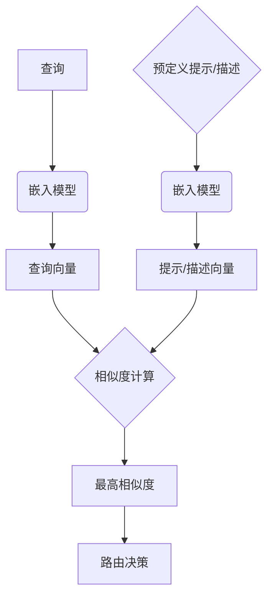

**一、 引言**


在 RAG 流程中，**路由 (Routing)** 扮演着至关重要的角色，它就像一座桥梁，将用户的查询与正确的数据源连接起来。一个高效的路由系统能够准确识别查询的意图，并将其导向最合适的数据源，从而为后续的检索和生成奠定坚实的基础。理想的 RAG 系统对路由能力有着很高的要求，它需要路由模块具备**准确性**、**高效性**以及**可扩展性**，以应对日益复杂的查询和不断增长的数据规模。


本文将深入探讨 RAG 系统中的两种主要路由方法：**逻辑路由 (Logical Routing)** 和 **语义路由 (Semantic Routing)**。我们将详细介绍它们的工作原理、实现方法、优势和挑战，并进行比较分析，最后展望路由技术的未来发展方向。





**二、 路由在 RAG 中的核心地位**


为了更好地理解路由的重要性，我们首先回顾一下 RAG 流程的三个主要阶段：

1. **查询转换 (Query Transformation)：** 对用户输入的原始查询进行改写、分解或扩展，使其更适合进行检索。例如，将复杂问题分解成多个子问题，或者使用同义词替换等技术改写查询。
2. **路由 (Routing)：** 根据转换后的查询，选择合适的数据源。这一步至关重要，因为它决定了后续检索的范围和质量。
3. **查询构建 (Query Construction)：** 将自然语言查询转换为特定数据源可以理解的查询语言，例如 SQL、Cypher 或元数据过滤器。


从以上流程可以看出，路由在 RAG 中起着承上启下的关键作用：它接收上游 (查询转换) 处理后的查询，并为下游 (查询构建) 选择目标数据源。


路由的准确性直接影响 RAG 系统的整体性能。如果路由错误，系统可能会检索到不相关的文档，导致生成的答案偏离主题或包含错误信息。另一方面，路由效率低下会增加系统延迟，影响用户体验，特别是对于实时性要求较高的应用场景。因此，一个优秀的 RAG 系统必须具备高效且准确的路由能力。


**三、 逻辑路由 (Logical Routing)：基于 LLM 推理的智能决策**


**1. 定义逻辑路由：**


逻辑路由是一种基于 LLM 推理能力的智能路由方法。它利用 LLM 对查询的语义和意图进行深入理解，并结合数据源的描述信息，进行推理判断，从而选择最适合回答该查询的数据源。


**2. 工作原理：**


逻辑路由的核心是一个充当“决策者”的 LLM。这个 LLM 接收两个主要输入：

- **查询：** 经过查询转换步骤处理后的用户查询。
- **数据源信息：** 每个数据源的描述信息，包括其擅长处理的主题、支持的查询类型等。这些信息可以手动编写，也可以通过 LLM 自动生成。

LLM 基于其内部知识和推理能力，分析查询的语义和意图，并将其与各个数据源的描述进行匹配。最终，LLM 输出一个路由决策，通常是一个预定义的、结构化的标识符，例如数据源的名称或 ID，表示该查询应该被路由到哪个数据源。





**3. 实现方法：**

- **函数调用 (Function Calling)：**
    - 函数调用是实现逻辑路由的一种常用方法。通过将数据源信息作为函数参数提供给 LLM，并限制 LLM 的输出为预定义的函数调用格式，可以有效地引导 LLM 进行路由决策。
    - 例如，可以定义一个名为 `route_query` 的函数，该函数接受一个查询字符串和一组数据源描述作为参数。LLM 的输出被限制为调用 `route_query` 函数，并指定目标数据源的名称。然后，我们可以解析 LLM 的输出，提取函数名和参数，从而得到路由决策。
- **Prompt Engineering 提示工程：**
    - 除了函数调用之外，精心设计的提示 (Prompt) 也可以有效地引导 LLM 进行路由决策。
    - 提示工程的关键在于清晰地描述每个数据源的特点和适用范围，并指示 LLM 根据查询的语义选择合适的数据源。
    - 例如，可以使用以下提示：“你是一个专家级路由助手，负责将用户问题分配给不同的数据库。向量数据库 A 擅长处理语义相似度查询，关系数据库 B 擅长处理结构化查询，图形数据库 C 擅长处理关系查询。请根据问题 ‘...’，选择合适的数据库。”

**4. 优势：**

- **灵活性强：** LLM 可以处理复杂的查询，并根据上下文进行灵活的路由决策。例如，它可以处理包含多个主题的查询，并将其路由到多个数据源。
- **可解释性好：** 通过分析 LLM 的推理过程，可以理解路由决策的依据。这对于调试和优化路由系统非常有帮助。
- **适应性强：** 可以通过微调 LLM 或调整提示来适应不同的数据源和查询类型。这使得逻辑路由能够应对不断变化的业务需求。

**5. 挑战：**

- **依赖 LLM 的性能：** 路由的准确性严重依赖于 LLM 的理解和推理能力。如果 LLM 无法准确理解查询的意图或数据源的特点，就可能做出错误的路由决策。
- **计算成本较高：** LLM 推理需要一定的计算资源，特别是对于大型 LLM，这可能导致较高的计算成本和较长的延迟。
- **需要精心设计的 Prompt 和 Schema：** 为了引导 LLM 做出正确的路由决策，需要仔细设计 Prompt 和预定义的输出格式 (Schema)。这需要一定的专业知识和经验。

**四、 语义路由 (Semantic Routing)：基于语义相似度的快速匹配**


**1. 定义语义路由：**


语义路由是一种基于语义相似度的路由方法。它通过计算查询与预定义的提示 (Prompt) 或数据源描述之间的语义相似度来选择目标数据源。与逻辑路由不同，语义路由不依赖于 LLM 的推理能力，而是依赖于预先计算好的语义表示 (嵌入)。


**2. 工作原理：**


语义路由的核心思想是将查询和数据源描述映射到一个共享的向量空间中，并根据它们在这个空间中的距离来判断它们之间的相关性。具体步骤如下：

- **预定义提示/描述：** 首先，需要为每个数据源或查询类型预先定义一组代表性的提示或描述。这些提示或描述应该能够清晰地表达数据源的特点和适用范围。
- **嵌入：** 使用嵌入模型 (例如 Sentence Transformers、CoHere Embed 等) 将这些提示或描述以及查询都转换为向量 (也称为嵌入)。这些向量捕获了文本的语义信息。
- **相似度计算：** 计算查询向量与各个提示/描述向量之间的相似度。常用的相似度度量方法包括余弦相似度、点积等。
- **路由决策：** 选择相似度最高的提示/描述所对应的数据源作为路由目标。




**3. 实现方法：**

- 需要使用嵌入模型，例如：Sentence Transformers, CoHere Embed等。
- 需要计算向量之间的相似度，例如：余弦相似度，点积等。
- 需要存储和检索向量，例如：Chroma, Faiss等。

**4. 优势：**

- **速度快：** 基于向量相似度的计算通常比 LLM 推理更快，特别是对于简单的查询。

    ```mermaid
    pie title 速度对比
    "语义路由" : 80
    "逻辑路由" : 20
    ```

- **资源消耗低：** 语义路由对计算资源的要求相对较低，因为它不需要进行复杂的推理计算。
- **易于实现：** 借助现有的嵌入模型和向量数据库，可以快速搭建语义路由系统。

**5. 挑战：**

- **准确性受限于嵌入质量：** 嵌入模型能否准确捕捉查询和提示/描述的语义信息至关重要。如果嵌入质量不高，就可能导致错误的路由决策。
- **需要预先定义提示/描述：** 需要为每个数据源或查询类型设计合适的提示/描述，这可能需要一定的领域知识和经验。
- **难以处理复杂查询：** 对于复杂的、需要推理的查询，语义路由可能无法准确地选择目标数据源。例如，对于需要结合多个数据源的信息才能回答的查询，语义路由可能难以胜任。

**五、 逻辑路由与语义路由的比较**


| 特性       | 逻辑路由                       | 语义路由                   |
| -------- | -------------------------- | ---------------------- |
| **准确性**  | 较高，依赖 LLM 的推理能力            | 相对较低，受限于嵌入质量和提示/描述的质量  |
| **速度**   | 较慢，LLM 推理耗时                | 较快，基于向量相似度计算           |
| **灵活性**  | 较高，可以处理复杂的查询               | 相对较低，难以处理复杂查询          |
| **可解释性** | 较好，可以分析 LLM 的推理过程          | 相对较差，依赖于嵌入空间的可解释性      |
| **资源消耗** | 较高，LLM 推理需要更多计算资源          | 较低，向量相似度计算资源消耗较少       |
| **实现难度** | 较高，需要精心设计的 Prompt 和 Schema | 相对较低，可以使用现有的嵌入模型和向量数据库 |


**1. 适用场景分析：**

- **逻辑路由：** 适用于需要处理复杂查询、对准确性和可解释性要求较高的场景。例如，在企业内部知识库问答系统中，用户可能会提出各种复杂的问题，需要 LLM 进行深入的推理才能找到合适的答案。在这种情况下，逻辑路由可以更好地满足需求。
- **语义路由：** 适用于对速度和资源消耗敏感、查询类型相对简单的场景。例如，在电商平台的商品搜索中，用户的查询通常比较简单，可以使用语义路由快速匹配到相关的商品类别。

**2. 结合使用：**


在实际应用中，可以将逻辑路由和语义路由结合起来，取长补短，构建更加高效和鲁棒的路由系统。例如：

- **先粗后精：** 可以先使用语义路由进行快速筛选，将查询路由到几个候选的数据源，然后使用逻辑路由在这些候选数据源中进行更精细的选择。
- **LLM 辅助的语义路由：** 可以使用 LLM 生成语义路由所需的提示/描述。LLM 可以根据数据源的特点自动生成更准确、更具表达力的提示/描述，从而提高语义路由的准确性。

**六、 路由的未来发展方向**

- **多模态路由：** 随着多模态技术的发展，未来的路由系统可能会结合文本、图像、音频等多种模态的信息进行路由。例如，用户可以用图片或语音提问，路由系统需要根据多模态信息理解用户的意图，并将其路由到合适的数据库。

    ```mermaid
    graph LR
        A[用户查询<br>文本/图像/音频] --> B(多模态路由系统);
        B --> C{模态解析};
        C --> D[文本数据源];
        C --> E[图像数据源];
        C --> F[音频数据源];
    ```

- **自适应路由：** 未来的路由系统可能会更加智能和自适应，能够根据查询的特点和系统的负载情况，动态选择最佳的路由策略。例如，对于简单的查询，可以使用语义路由以提高速度；对于复杂的查询，可以使用逻辑路由以保证准确性。
- **基于强化学习的路由：** 可以利用强化学习 (Reinforcement Learning) 技术训练路由 agent。通过与环境 (例如，用户、数据源) 的交互，路由 agent 可以学习到最佳的路由策略，并根据历史经验和反馈不断优化其决策，从而提高路由的准确性和效率。

**七、 总结**


路由技术是 RAG 系统中的关键组成部分，它负责将用户的查询导向最合适的数据源，为后续的检索和生成奠定基础。本文介绍了两种主要的路由方法：逻辑路由和语义路由。逻辑路由利用 LLM 的推理能力进行智能决策，具有较高的准确性和灵活性，但计算成本较高；语义路由基于语义相似度进行快速匹配，速度快、资源消耗低，但准确性受限于嵌入质量。


在实际应用中，可以根据具体的场景和需求选择合适的路由方法，或者将两种方法结合起来使用。随着技术的不断发展，未来的路由系统将会更加智能、高效和鲁棒，能够处理更加复杂的查询和更大规模的数据，为用户提供更好的信息检索和生成体验。

