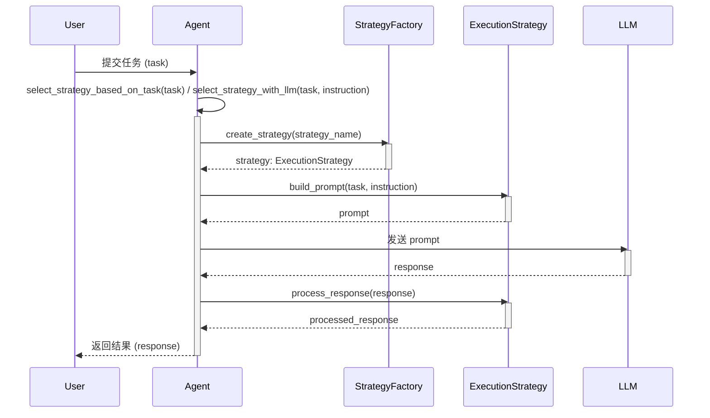
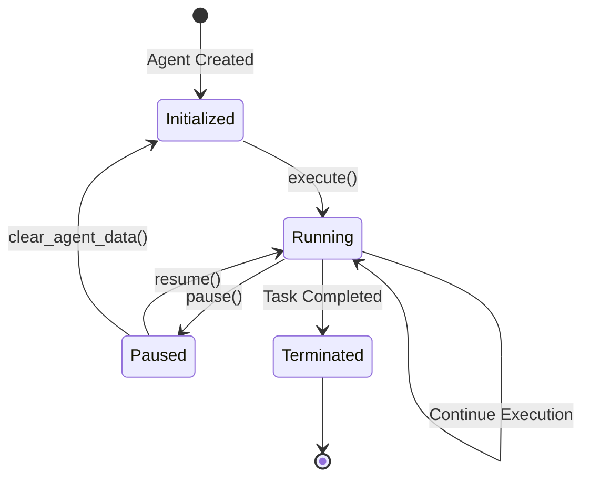

> 打造具有鲜明角色、遵循指令、执行任务、拥有记忆、具备推理能力、支持持久化、长期记忆、情境感知以及集成工具的 AI 代理

## Part.0: 什么是Ai Agent

## **导语 (Introduction)**


在人工智能 (AI) 领域飞速发展的今天，一个令人瞩目的新兴趋势正日益崭露头角——**AI 代理 (AI Agent)**。 随着大语言模型 (LLM) 技术的不断突破和日益成熟，我们正站在一个重要的转折点上。许多业内专家和前沿观察者都预言：**2025 年，很可能成为 AI Agent 的元年。** 这并非空穴来风，而是基于当前 AI 技术发展的迅猛势头，以及 AI Agent 在各个领域展现出的巨大潜力的合理推测。


如果将大模型的发展比作浩瀚的星辰大海，那么可以说，**LLM 已经为我们点亮了通往智能宇宙的航标，而 AI 代理则是刚刚启航的探索飞船，尚处于旅程的早期阶段，但目标却是星辰大海。**


```plain text
+-----------------+
                                      |     LLMs:       |
                                      |  航标已点亮      |
                                      +--------+--------+
                                               ^
                                               | 发展方向
                                               |
                                               |
      +-----------------+             +--------v--------+
      |   Web 1.0       |  ------>    |   AI Agent:     |
      |   (早期互联网)   |  ------>    |   探索飞船启航   |
      +-----------------+             +--------+--------+
                                               |
                                               | 发展方向
                                               v
                                      +-----------------+
                                      |   星辰大海:     |
                                      |   无限可能      |
                                      +-----------------+

                (图 4. AI 代理发展阶段示意图)
```


**现阶段，AI Agent 的构建更像是一门工程实践的艺术。** 我们已经拥有了构建 Agent 的基础组件，如大语言模型 (LLMs)、向量数据库等，但如何将这些组件巧妙地组合、集成并应用于实际场景，仍然需要大量的工程实践和探索。这就像我们拥有了建造房子的砖块、水泥和钢筋，但如何设计和建造一座坚固、实用且美观的房子，则考验着工程师的智慧和经验。


AI 代理不再仅仅是简单的程序或算法，它们正在被赋予更高级别的智能和自主性，从而开启了一个全新的可能性时代。这些智能的数字实体，正如其名 “代理” 所暗示的，正逐步展现出类似于人类代理的特性：**能够感知周围环境，做出独立决策，并主动采取行动以实现特定目标。** 区别于传统的、被动响应用户指令的大语言模型 (LLM) 应用，AI 代理展现出了前所未有的主动性和适应性，预示着人机交互模式的深刻变革。


那么，究竟什么是 AI 代理？简而言之，**AI 代理是一个能够自主感知环境、进行决策、执行任务并与其他实体（包括人或者其他代理）进行交互的智能系统。** 它以目标为导向，能够根据环境的变化和自身的状态，灵活调整行为策略，以期最大化地实现预设目标。 与传统的工作流 (Workflows) 不同，AI 代理并非严格遵循预定义的、线性的执行路径，而是能够根据实际情况动态地规划和调整自身的行动步骤，展现出更强的灵活性和适应性。


```plain text
+-----------------+
      |    AI  Agent    |
      +--------+--------+
               |
      +--------v--------+
      |  Environment    |
      +--------+--------+
               | Perceive
      +--------v--------+
      |    Decision     |
      |     Making      |
      +--------+--------+
               | Act
      +--------v--------+
      |    Actions      |
      +-----------------+

                 (图 1. AI 代理概念示意图)
```


AI 代理的迷人之处在于它们模拟人类智能的潜力，**并将其应用于实际工作场景中**。为了更好地理解这一点，让我们先来看两个例子：


### **示例一：干练的员工**


想象一位经验丰富的客户服务代表，他们能够：

1. **根据公司的政策 (指令)** 独立处理各种客户咨询 (任务)。
2. 在处理过程中不断**学习和积累经验 (记忆)**，提升服务质量。
3. 遇到复杂问题时，可以**寻求专家意见 (工具)**，例如查询内部知识库或使用诊断工具。
4. 与其他部门的同事**协作 (委派)**，例如将技术问题转交给工程师团队。
5. 根据突发情况**灵活调整工作计划 (规划)**，例如优先处理紧急的客户请求。
6. 能够**长期服务于公司,** 持续处理客户请求。

### **示例二：智能家居控制代理**


再比如一个智能家居控制代理，它能够：

1. 根据主人的**生活习惯和喜好 (角色/Persona)**，自动调节家里的温度和灯光。
2. 遵循主人设定的**规则 (指令)**，例如“晚上 10 点后调暗灯光”。
3. 根据主人的**语音指令 (任务)** 执行操作，例如“播放音乐”或“关闭窗帘”。
4. **记住主人常用的设置 (记忆)**，例如喜欢的音乐类型和灯光亮度。
5. **根据不同的场景 (推理)** 自动调整家居设置, 例如当检测到主人在看电影时, 自动调暗灯光, 关闭窗帘, 并打开家庭影院系统。
6. 能够通过**软件更新 (持久化)** 来保存自身状态, 持续控制家电设备。
7. **访问天气预报服务 (工具)**，在雨天自动关闭窗户, 或者查询菜谱 (工具), 并根据已有食材推荐菜品。
8. **联动其他智能设备 (委派)**, 例如当主人说“我要睡觉了”，代理可以, 关闭所有灯, 调高空调温度为睡眠模式, 并启动安防摄像头。

## **AI 代理：数字化的智能助手**


类比于上述的例子，一个设计良好的 AI 代理也应该具备类似的能力。它可以像那位干练的员工或是智能家居代理一样：

- **角色 (Persona):** 根据预设的角色行事，例如扮演一个专业的客服代表，或是一个风趣幽默的聊天伙伴。
- **指令 (Instructions):** 遵循特定的指令，例如“始终为客户提供礼貌的服务”或“只回答与产品相关的问题”。
- **任务 (Tasks):** 高效地完成各种任务，例如回答用户咨询、生成报告、预订机票等。
- **记忆 (Memory):** 利用记忆功能来记住过往的交互和经验，从而提供更加个性化的服务。
- **推理 (Reasoning):** 运用推理引擎进行逻辑思考和问题解决，例如根据上下文推断用户的意图，或根据已知信息进行判断。
- **规划 (Planning):** 面对复杂任务时, 能够将其分解成多个步骤, 并制定合理的执行计划。
- **持久化 (Persistence):** 通过集成持久化机制，跨越不同的会话周期，保存和加载自身的状态，实现长期运行。
- **情境感知 (Contextual Understanding):** 借助 RAG (Retrieval Augmented Generation) 技术，访问和利用外部的知识库，更好地理解用户的请求和意图。
- **工具集成 (Tool Integration):** 调用外部工具和 API (例如搜索引擎、数据库、计算器等) 来执行实际操作，将 “思考” 转化为 “行动”。
- **委派 (Delegation):** 在需要时, 将特定任务委派给其他更专业的 Agent 或者人类, 实现协同工作。

```plain text
+---------------+     +-----------------+     +-----------------+
  |     角色      |-----|     指令        |-----|      任务       |
  |   (Persona)   |     | (Instructions)  |     |     (Tasks)     |
  +---------------+     +-----------------+     +-----------------+
         |                     |                     |
         v                     v                     v
  +---------------+     +-----------------+     +-----------------+
  |     记忆      |-----|     推理        |-----|      规划       |
  |   (Memory)    |     |  (Reasoning)    |     |   (Planning)    |
  +---------------+     +-----------------+     +-----------------+
         |                     |                     |
         v                     v                     v
  +---------------+     +-----------------+     +-----------------+
  |   持久化      |-----|   情境感知      |-----|    工具集成     |
  | (Persistence) |     |   (Contextual   |     | (Tool Integration)|
  |               |     | Understanding) |     |                 |
  +---------------+     +-----------------+     +-----------------+

                (图 2. AI 代理的关键属性)
```


通过这些能力的有机结合，AI 代理能够胜任各种复杂的任务，成为我们得力的**数字助手**，极大地提高我们的工作效率和生活品质。


本文旨在为开发者提供一份全面且深入的 AI 代理构建指南，**从理论到实践，解锁 AI 代理的无限潜能，并特别强调工程实践的重要性。** 我们将深入探讨 AI 代理的各个关键组成部分、不同的工作流程模式、构建方法、实际应用案例，以及开发最佳实践。文章将详细介绍如何定义 AI 代理的角色、指令、任务，以及如何利用记忆机制、推理引擎、持久化技术、RAG 技术和工具集成来增强 AI 代理的能力。本文将理论与实践相结合，**并提供大量可操作的步骤和代码示例，** 帮助开发者深入理解并掌握 AI Agent 的构建和应用。


```plain text
+-----------------+     +-----------------+     +-----------------+
|   客户支持       |     |   编码代理       |     |   个性化教育     |
| (Customer Support)|     |  (Coding Agents) |     | (Personalized   |
|                 |     |                 |     |  Education)    |
+--------+--------+     +--------+--------+     +--------+--------+
         |                     |                     |
         v                     v                     v
+--------+--------+     +--------+--------+     +--------+--------+
|   医疗保健       |     |   科学研究       |     |   金融服务       |
| (Healthcare)   |     | (Scientific    |     | (Financial      |
|                 |     |  Research)     |     |  Services)     |
+--------+--------+     +--------+--------+     +--------+--------+
         |                     |                     |
         v                     v                     v
+--------+--------+     +--------+--------+     +--------+--------+
|   电子商务       |     |   人力资源       |     |   其他领域       |
| (E-commerce)   |     |  (Human        |     |  (Other        |
|                 |     |  Resources)    |     |  Domains)      |
+-----------------+     +-----------------+     +-----------------+

             (图 3. AI 代理的应用场景)
```


文章的后续内容将按照如下的结构展开:

- **第一部分，我们将剖析 AI 代理的核心概念和构成，** 详细介绍其定义、特点和关键属性，并探讨不同的 AI 代理架构模式，帮助您建立对 AI 代理的整体认知。
- **第二部分，我们将介绍 AI 代理的常见工作流程模式，** 包括提示链、路由、并行化、调度器-工人、评估者-优化器等，并讨论何时以及如何选择合适的工作流程模式。
- **第三部分，我们将深入探讨 AI 代理的推理引擎，** 介绍如何利用不同的提示工程策略 (如 ReAct、思维链、反思) 来增强 AI 代理的思考和问题解决能力。
- **第四部分，我们将关注 AI 代理的持久化和记忆机制，** 介绍如何实现跨会话的状态保存和加载，以及如何支持人机循环工作流程。
- **第五部分，我们将介绍 RAG 技术，** 探讨如何将外部知识库与 AI 代理集成，实现情境感知，并提升响应的准确性和相关性。
- **第六部分，我们将重点关注工具集成，** 详细讲解如何设计和实现工具接口, 以及如何让 AI 代理学会使用各种工具来执行实际操作。
- **第七部分，我们将总结构建高效 AI 代理的最佳实践，** 涵盖框架选择、核心原则、提示工程、角色定义、指令任务和记忆的添加、推理能力的提升、持久化和 RAG 的应用以及工具集成等各个方面，**并特别强调工程实践中的关键问题和解决方案。**
- **第八部分，我们将通过一系列实际应用案例，** 展示 AI 代理在客户支持、编码辅助以及其他潜在领域的应用场景。
- **第九部分，我们将对全文进行总结，** 并对 AI 代理的未来发展方向进行展望， 探讨其无限的潜力和可能性，**展望 2025 年 AI Agent 元年的到来。**
- **第十部分, 我们将提供最终的 Agent 类代码，** 方便您参考和使用。
- **第十一部分是附录,** 提供了一些常用的工具, 框架, 参考文献, 术语表以及更多学习资源的介绍。

通过本系列文章，您将深入理解 AI 代理的核心概念，掌握构建高效 AI 代理的关键技术，**并获得在实际工程项目中部署 AI Agent 的宝贵经验。** 无论您是 AI 领域的初学者还是经验丰富的开发者，都将从本文中获益匪浅。让我们一起踏上构建智能代理的激动人心的旅程，探索 AI 技术的无限可能，**迎接 AI Agent 元年的到来，开启智能代理的新篇章！**


## Part.1: AI Agent 的核心概念与构成  (Anatomy of an AI Agent)

## **1.1 AI Agent 的定义和特点**


### **1.1.1 什么是 Agent？**


在人工智能领域，**AI 代理 (AI Agent)** 指的是一个能够**自主感知环境、进行决策、执行任务**并与其他实体（包括人或其他代理）进行**交互**的**智能系统**。我们可以将 Agent 理解为一个“智能体”，它就像一个小型机器人或一个虚拟助手，具有一定的自主性和智能，能够独立地或协作地完成特定任务。Agent 能够接收来自周围环境的信息，并通过其内部状态、目标函数以及预设的规则或学习到的知识，采取行动以影响环境或者实现其目标。


简单来说，可以将 Agent 想象成一个具备一定自主能力的、能够与外界交互的个体。这个个体可以是现实世界中的机器人（例如，扫地机器人、工业机械臂），也可以是虚拟世界中的角色（例如，游戏中的 NPC、虚拟主播），甚至可以是一个软件程序（例如，智能客服、交易代理）。重要的是，Agent 具备了以下几个核心要素：

- **感知 (Perceive):** Agent 能够通过各种方式获取周围环境的信息。例如，机器人可以通过摄像头、传感器等感知周围环境；软件 Agent 可以通过读取文件、访问 API 等方式获取信息。
- **思考 (Think):** Agent 能够根据感知到的信息，进行思考、推理和决策。这个思考过程可以是基于规则的，也可以是基于模型的，甚至可以是基于深度学习的。
- **行动 (Act):** Agent 能够采取行动，对环境或其他实体产生影响。例如，机器人可以移动、抓取物体；软件 Agent 可以发送消息、修改数据等。

```plain text
+--------------- -+
      |    AI  Agent    |
      +--------+--------+
               |
      +--------v--------+
      |  Environmen  t  |
      +--------+--------+
               ^ Perceive
      +--------+--------+
      |    Decision     |
      |     Making      |
      +--------+--------+
               | Act
      +--------v--------+
      |    Actions       |
      +------------------+

                 (图 1. AI 代理概念示意图)
```


从工程实践的角度来看，构建 AI Agent 意味着我们需要将各种 AI 技术（例如大语言模型、知识库、推理引擎等）集成到一个系统中，使其具备感知、思考和行动的能力。这不仅仅是编写代码，更重要的是**设计 Agent 的架构、确定其行为模式，并使其能够在实际应用场景中可靠地运行**。目前，AI Agent 的构建更偏向于工程实践，我们需要根据具体的应用场景和需求，选择合适的技术组件，并进行组装、调试和优化。


### **1.1.2 Agent vs. 工作流 (Workflows)**


为了更好地理解 Agent 的概念，我们需要将其与传统的工作流 (Workflows) 进行对比。工作流通常指的是一系列**预定义的、按顺序执行的任务或步骤**，它们像一条流水线一样，将输入数据转换为最终的输出结果。工作流中的每个步骤都是确定的，执行顺序也是固定的，缺乏灵活性和适应性。


相比之下，Agent 具有更强的**动态性、灵活性和适应性**。Agent 并非机械地执行预设的指令序列，而是能够根据当前的环境和自身的状态，**自主地选择合适的行动，并动态地调整自身的行为策略**。


以下是一个简单的表格来对比 Agent 和工作流：


| 特性    | Agent              | 工作流 (Workflow)  |
| ----- | ------------------ | --------------- |
| 执行方式  | 动态、灵活、根据环境和自身状态调整  | 预定义、线性、按顺序执行    |
| 决策    | 自主决策               | 按照预设规则执行        |
| 适应性   | 强，能够适应环境变化         | 弱，难以应对预设流程之外的情况 |
| 交互性   | 能够与其他 Agent 或人进行交互 | 通常不涉及复杂的交互      |
| 目标导向性 | 明确的目标导向，主动追求目标     | 通常是被动执行任务       |


举例来说，一个传统的机票预订系统可以被看作是一个工作流：用户输入出发地、目的地、日期等信息，系统按照预设的流程查询航班信息、展示结果、处理支付、完成预订。这个过程是固定的，无法处理超出预设流程的情况，例如用户突然改变行程。


而一个智能旅行助理 Agent 则可以更加灵活地处理各种情况。它可以根据用户的需求 (例如预算、时间、偏好等) 主动推荐合适的航班和酒店，并根据用户的反馈进行调整。如果用户的行程发生变化，Agent 可以重新规划行程，并自动处理相关的改签或退订操作。Agent 甚至可以主动关注航班动态，在航班延误或取消时及时通知用户并提供备选方案。


从这个例子可以看出，Agent 具有更强的自主性和适应性，能够更好地处理复杂和不确定的情况。


```javascript
Workflow:

[Input] --> [Task A] --> [Task B] --> [Task C] --> [Output]

Agent:

+-------+     Perceive     +-------------+
| Agent | <--------------> | Environment |
+-------+     Act          +-------------+
  ^                         |
  |                         v
  +-------+     Decide      +-------+
  | Goal  | <------------ | State |
  +-------+                 +-------+
```


• **说明:** 这个字符画可以直观地展现 Agent 的动态性和自主性，以及它与环境的交互，而 Workflow 则是线性的、静态的。


### **1.1.3 Agent 的关键特征:**


AI Agent 具备以下几个关键特征，使其区别于传统的软件系统:

- **自主性 (Autonomy):** Agent 能够**独立**做出决策并执行任务，而无需人工持续干预或控制。它们可以根据预设的目标和自身的感知，自主选择合适的行动方案。例如，一个股票交易 Agent 可以根据市场行情和预设的交易策略，自主决定买入或卖出股票，而无需人工指令。
- **交互性 (Interactivity):** Agent 能够与其他 Agent 或人类进行**交互**，包括接收和发送信息、进行协商、合作或竞争等。这种交互性使得 Agent 能够融入复杂的社交环境，并与其他实体共同完成任务。例如，一个会议安排 Agent 可以与其他参会者的 Agent 进行沟通，协商出一个所有人都方便的时间。
- **主动性 (Proactivity):** Agent 能够**主动**采取行动来实现目标，而不仅仅是被动地响应外部刺激。它们可以根据自身的内部状态和目标，主动发起行动，而不是仅仅对外部事件做出反应。例如，一个新闻推荐 Agent 可以主动根据用户的兴趣，推送相关的新闻文章，而不仅仅是等待用户输入查询关键词。
- **学习能力 (Learning Ability):** 许多 Agent 能够从经验中**学习**，不断改进自身的性能。它们可以根据过去的交互数据，调整自身的策略和行为模式，以更好地适应环境和实现目标。例如，一个电商推荐 Agent 可以根据用户的购买记录和浏览历史，学习用户的喜好，并不断优化推荐结果。
- **目标导向性 (Goal-Orientedness):** Agent 的行为都是为了**实现预设的目标**。它们会根据目标来规划自身的行动，并评估行动的效果。例如，一个游戏 Agent 的目标可能是赢得比赛，它会根据游戏规则和当前局势，选择最优的行动策略。
- **可信性 (Believability):** 对于与人交互的 Agent 而言，需要让使用者感受到可信。Agent 需要能够以符合人类逻辑和习惯的方式进行思考和行动，才能让用户产生信任感。例如，一个虚拟助手 Agent 需要能够流畅地与用户对话，并提供有帮助的信息，才能让用户觉得它是一个可靠的助手。
- **适应性 (Adaptability):** Agent 能够根据不断变化的环境或需求**调整**自身的行为或策略，以保持其有效性。例如，一个股票交易 Agent 需要能够根据不断变化的市场行情，调整自身的交易策略，以最大化收益。
- **持续运行 (Continuous Operation):** Agent 可以**长时间甚至永久运行**，持续执行任务或提供服务，而不需要每次都重新启动或初始化。例如，一个服务器监控 Agent 可以 24/7 运行，持续监控服务器的状态，并在出现异常时及时报警。

**Agent 的环境 (Environment):**


Agent 的行为和能力与其所处的环境密切相关。环境是 Agent 感知和行动的场所，可以是物理的，例如真实世界；也可以是虚拟的，例如游戏环境或模拟环境。

- **环境的类型:**
    - **完全可观测 (Fully Observable) vs. 部分可观测 (Partially Observable):** Agent 是否能够获取环境的全部信息。例如，棋类游戏通常是完全可观测的，而自动驾驶汽车所处的环境则是部分可观测的。
    - **确定性 (Deterministic) vs. 随机性 (Stochastic):** 环境的行为是否是确定的，还是包含随机因素。例如，棋类游戏是确定性的，而股票市场则是随机的。
    - **静态 (Static) vs. 动态 (Dynamic):** 环境是否会随着时间发生变化。例如，一个空房间可以认为是静态的，而繁忙的街道则是动态的。
    - **离散 (Discrete) vs. 连续 (Continuous):** 环境的状态和 Agent 的行动是否是离散的或连续的。例如，棋盘游戏是离散的，而驾驶汽车是连续的。
    - **单 Agent (Single-Agent) vs. 多 Agent (Multi-Agent):** 环境中是否存在多个 Agent。例如，一个独立的扫地机器人是单 Agent 系统，而多个协作的机器人则构成多 Agent 系统。
- **Agent 与环境的交互:** Agent 通过**传感器 (Sensors)** 感知环境，获取环境的信息；通过**执行器 (Actuators)** 对环境施加影响，改变环境的状态。Agent 内部的决策过程可以看作是一个**感知-行动的循环**：Agent 感知环境，根据感知到的信息进行决策，然后采取行动，行动的结果又会改变环境的状态，Agent 再感知新的环境状态，进行新一轮的决策和行动。
- **环境对 Agent 设计的影响:** 环境的特点会影响 Agent 的设计。例如，在部分可观测的环境中，Agent 需要具备更强的推理和预测能力，以便根据有限的信息推断环境的完整状态；在动态环境中，Agent 需要具备更强的适应能力，以便及时应对环境的变化；在多 Agent 环境中，Agent 需要具备与其他 Agent 交互、协作或竞争的能力。

```plain text
+-------------------+         Sensors         +-----------------+
|    AI  Agent     |------------------------>|   Environment   |
+--------+--------+                         +-----------------+
               ^                                      |
               |                                      |
               | Actuators                           |
               +--------------------------------------+
                          (图 5. Agent 与环境的交互)
```


这些关键特征和环境因素共同决定了 AI Agent 的能力和行为模式，也为我们设计和构建 AI Agent 提供了指导。


## **1.2 AI Agent 的关键属性 (Key Attributes)**


在定义了 AI Agent 的基本概念和特征之后，我们来深入探讨构成 Agent 的几个关键属性。这些属性共同决定了 Agent 的行为模式和能力边界，是构建高效 AI Agent 的基石。


### **1.2.1 角色 (Persona)**


**定义和作用:** AI 代理的角色 (Persona) 是其最关键的方面之一，确立了代理的**关键特征、职责和行为模式**，类似于传统环境中的职位或工作职能。(引用第三篇文章) 角色为 Agent 提供了一个高级别的行为框架，使其能够以一致且符合预期的身份进行交互。例如，一个客服 Agent 的角色就决定了它应该以友好、专业的态度回答客户的问题，解决客户的疑虑；一个私人助理的角色可能需要更加个性化和主动；而一个交易 Agent 的角色则要求它能够快速、准确地执行交易指令，并在市场波动时做出合理的决策。


**技术实现:** 在技术实现上，Agent 的角色通常是通过**系统提示 (System Prompt)** 来定义的。系统提示是 Agent 在启动时接收到的一段特殊指令，它为 Agent 设定了背景、目标、约束条件等信息，从而塑造了 Agent 的角色。在与用户的交互过程中，系统提示始终作为上下文的一部分，指导着 Agent 的行为。


**示例:**


以下是使用 OpenAI API 设置系统提示的示例：


```python
response = client.chat.completions.create(
    model="gpt-4o",
    messages=[
        {"role": "system", "content": "你是一位专业的财务顾问，你总是能给出让人信服的建议，并且有条理，值得信赖。"},  # 系统提示
        {"role": "user", "content": "我今年 30 岁，想开始规划退休，有哪些需要考虑的关键因素？"}
    ]
)
```


在这个例子中，系统提示将 Agent 的角色设定为"一位专业的财务顾问"，这将引导模型以专业、可信赖的语气和风格来回答用户的提问。


以下是使用 Claude API 设置系统提示的示例：


```python
response = client.messages.create(
    model="claude-3-5-sonnet-20241022",
    max_tokens=1000,
    system="你是一位专业的财务顾问，你总是能给出让人信服的建议，并且有条理，值得信赖。", # 系统提示
    messages=[
        {"role": "user", "content": "我今年 30 岁，想开始规划退休，有哪些需要考虑的关键因素？"}
    ]
)
```


这个例子中，使用了 Claude 的 `system` 参数来设置系统提示，效果与 OpenAI API 是一样的。


**创建有效系统提示的指南:** (引用第三篇文章: "Crafting Effective System Prompts")

- **清晰的角色定义:** 在系统提示中，应该清晰地说明 Agent 的角色、职责和能力范围。例如，"你是一个专业的股票交易助手，你的职责是帮助用户分析股票行情，并根据用户的指令执行交易。"
- **详细的行为规范:** 系统提示应该详细说明 Agent 在不同情境下的具体行为，包括沟通风格、语气、用词等。例如，"你说话的语气应该专业、严谨，避免使用口语化的表达。在回答用户的疑问时，你应该提供详细的解释和数据支持。"
- **约束和限制:** 明确指出 Agent 不能做什么，设定行为边界。例如，“你不能提供任何投资建议，不能操作用户的账户，不能泄露用户的个人信息”。
- **利用示例对话:** 通过提供示例对话来进一步明确角色的行为模式。例如，"用户：请帮我分析一下特斯拉的股票行情。代理：好的，根据最新的数据显示，特斯拉的股票当前价格为……，最近一周的涨幅为……，以下是几个关键指标的分析……"
- **进行充分的测试和调优:** 通过实际测试来评估不同的 Prompt 对模型输出的影响, 观察 Agent 的行为是否符合预期，并根据测试结果不断调整和优化系统提示。

**系统提示在 AI 代理开发中的重要性:**

- **塑造 Agent 的行为模式:** 系统提示为 Agent 提供了行为准则，使其能够以一致的、符合预期的角色进行交互。
- **确保一致性和可靠性:** 通过设定明确的角色和行为规范，可以确保 Agent 在不同的会话中保持一致的表现，提高其可靠性。
- **实现特定领域的专业性:** 通过定制系统提示，可以将 Agent 塑造成特定领域的专家，例如财务顾问、法律顾问、技术支持等。
- **强制执行道德和安全准则:** 系统提示可以用来约束 Agent 的行为，防止其产生不道德或不安全的输出。
- **提高响应的质量:** 一个精心设计的系统提示可以引导 Agent 生成更相关、更准确、更有帮助的响应。

### **1.2.2 指令 (Instruction)**


**定义和作用:** 指令为 Agent 提供了有关其应如何操作的具体准则，是更**长期、更稳定**的指导方针。如果说角色 (Persona) 是 Agent 的 "人设"，那么指令就是 Agent 的 "操作手册"。指令为 Agent 提供了在各种场景下应该如何行动的详细说明，它是 Agent 行为的基石。(引用第四篇文章)


**技术实现:**  在 `Agent` 类中添加 `instruction` 属性，并在 `_build_messages` 方法中将其添加到消息列表中，作为 prompt 的一部分。(引用第四篇文章)


```python
class Agent:
    # ...
    @property
    def instruction(self) -> str:
        return self._instruction

    @instruction.setter
    def instruction(self, value: str):
        self._instruction = value
        # Reset conversation history when instruction changes
        self._history = []

    def _build_messages(self) -> List[Dict[str, str]]:
        # ...
        if self.instruction:
            messages.append({"role": "user", "content": f"Global Instruction: {self.instruction}"})
        # ...
```


**示例:**


例如，对于一个财务顾问 Agent，我们可以设置以下指令：


```plain text
"在提供财务建议时：
1. 始终强调个人情况和风险承受能力的重要性。
2. 切勿推荐特定股票或对回报做出承诺。
3. 在适当时包括咨询持牌专业人员的免责声明。
4. 将复杂的概念分解为简单的、可操作的步骤。
5. 在你的建议中同时考虑短期和长期影响。"
```


这些指令为财务顾问 Agent 提供了具体的行为准则，使其在提供建议时能够遵循这些准则，从而保证输出的质量和合规性。


**指令的制定原则:**

- **清晰明确 (Clarity):** 指令应该清晰、明确，避免使用模糊或模棱两可的语言，确保 Agent 能够准确理解指令的含义。每一条指令都应该针对一个特定的方面，避免将多个指令混杂在一起。
- **可操作性 (Actionability):** 指令应该具体、可操作，能够指导 Agent 的具体行动。避免使用过于抽象或笼统的指令，例如“要友好”或“要专业”，而应该使用更具体的指令，例如“使用礼貌用语”或“提供数据支持”。
- **一致性 (Consistency):** 不同的指令之间应该相互一致，避免出现矛盾或冲突的情况。例如，不要同时给出“要尽可能详细地回答问题”和“要保持回答简洁”这样的指令。
- **可扩展性 (Scalability):** 指令的制定应该考虑到未来的扩展性，能够适应新的任务和场景。随着 Agent 能力的增强和应用场景的扩展，可以逐步添加新的指令来扩展 Agent 的能力。
- **完整性 (Completeness):** 指令应该覆盖 Agent 可能遇到的各种常见场景，确保 Agent 在各种情况下都知道如何行动。这需要对 Agent 的应用场景进行充分的分析和预判。

### **1.2.3 任务 (Task)**


**定义和作用:** 任务表示 Agent 被要求执行的具体查询或操作, 是更**具体、即时**的目标。任务驱动着 Agent 的行为，是 Agent 存在的意义。


**技术实现:** 在 `Agent` 类中添加 `task` 属性，并在 `execute` 方法中使用。


```python
class Agent:
    # ...
    @property
    def task(self) -> str:
        return self._task

    @task.setter
    def task(self, value: str):
        self._task = value

    def execute(self, task: Optional[str] = None) -> str:
        # ...
        if task is not None:
            self._task = task
        # ...
```


**示例:**


例如，针对财务顾问代理的具体任务可能是：

- “30 多岁的人规划退休时需要考虑哪些关键因素？”
- “帮我分析一下特斯拉的股票行情。”
- “比较一下指数基金和主动管理基金的优缺点。”
- “根据我的风险承受能力，推荐一个投资组合。”

这些任务都是具体的、可执行的，Agent 需要根据任务的要求，结合自身的角色、指令和已有的知识，来生成相应的响应。


**任务的类型:**

- **信息检索任务:** 例如“查找关于 AI Agent 的最新论文”、“找到这张图片的出处”、“列出所有包含关键词‘深度学习’的文档”。
- **内容生成任务:** 例如“写一篇关于 AI Agent 的博客文章”、“生成一个产品描述”、“写一首关于秋天的诗歌”、“为这张图片写一段说明文字”。
- **问题解答任务:** 例如“AI Agent 的主要应用领域有哪些？”、“如何预防信用卡欺诈？”、“美国的首都是哪里？”。
- **对话任务:** 例如“与用户进行闲聊”、“安慰一个失落的人”、“模拟一个面试场景”。
- **工具使用任务:** 例如“使用计算器计算 123 乘以 456”、“查询明天的天气”、“预订一张机票”、“将这份文档翻译成英文”。
- **多模态任务:** 例如“根据这张图片生成一段文字描述”、“根据这段文字生成一幅图像”、“这段音频的主要内容是什么？”。

**指令与任务的区别和联系:**


指令和任务都是对 Agent 行为的指导，但它们的作用范围和时间尺度不同。

- **指令 (Instructions) 是更长期的、更一般的指导方针，** 它定义了 Agent 在各种场景下的行为准则。指令通常在 Agent 初始化时设定，并在 Agent 的整个生命周期中保持不变。
- **任务 (Tasks) 是更具体的、更即时的目标，** 它描述了 Agent 当前需要执行的操作。任务通常由用户或其他 Agent 发起，并在完成后结束。

如果将 Agent 比作一个员工，那么指令就像公司的规章制度，而任务就像是分配给员工的具体工作。员工在执行任务时，必须遵循公司的规章制度。


### **1.2.4 规划 (Planning)**


**定义和作用:**  规划是指 Agent 将复杂任务分解成更小的子目标，并制定实现这些目标的步骤的过程。规划能力使 Agent 能够处理复杂的、需要多个步骤才能完成的任务，而不仅仅是简单地对单个输入做出反应。一个好的规划能够提升 Agent 完成任务的效率和可靠性。(第一篇、第二篇、第五篇文章)


**技术实现:**  规划的实现依赖于 LLM 的推理能力，以及一些特定的提示工程技术, 如 **ReAct, Chain-of-Thought, Reflection**。(第五篇文章)

- **ReAct (Reasoning and Acting):** ReAct 是一种将推理 (Reasoning) 和行动 (Acting) 结合起来的提示策略。它引导 Agent 在执行任务的过程中，交替进行思考 (Thought)、行动 (Action) 和观察 (Observation)，从而逐步逼近目标。ReAct 提示的典型结构如下：

    ```plain text
    Thought: [Agent 对当前状态的思考]
    Action: [Agent 采取的行动]
    Observation: [Agent 观察到的行动结果]
    ... (重复以上步骤)
    Final Answer: [Agent 的最终答案]
    ```


    通过这种方式, ReAct 能够将任务分解成多个步骤,  并在每个步骤中进行推理和行动,  从而提高 Agent 在复杂任务上的表现。

- **Chain-of-Thought (CoT):** 思维链提示通过引导 LLM 将一个复杂问题分解成多个中间步骤，并逐步推理出最终答案，从而提高 LLM 在复杂推理任务上的性能。思维链提示通常包含一系列的“让我们逐步思考”之类的引导语，例如：

    ```plain text
    问题：小明有 5 个苹果，他又买了 3 个苹果，然后吃了 2 个苹果，请问小明还剩几个苹果？
    
    让我们逐步思考：
    1. 小明原来有 5 个苹果。
    2. 他又买了 3 个苹果，所以他现在有 5 + 3 = 8 个苹果。
    3. 他吃了 2 个苹果，所以他还剩 8 - 2 = 6 个苹果。
    
    最终答案：小明还剩 6 个苹果。
    ```


    通过这种方式，CoT 能够将复杂问题分解成多个简单的步骤，并逐步推导出最终答案，从而提高 LLM 在复杂推理任务上的性能。

- **Reflection:** 反思提示鼓励 LLM 对自身的输出进行评估和反思，从而发现并纠正错误，提高输出的质量。反思提示通常包含一些引导 LLM 进行自我评估的问题，例如：

    ```plain text
    你的答案是否完整？
    你的答案是否准确？
    你的答案是否符合逻辑？
    你的答案是否可以改进？
    ```


    通过这种方式，Reflection 能够促使 LLM 对自身的输出进行批判性思考，并进行修正和改进，从而提高输出的质量。


**不同的规划策略:**

- **反应式规划 (Reactive Planning):**
    - **定义:** 基于当前状态和预定义规则进行决策, Agent 根据当前的环境和自身的状态，选择预先定义的行动规则来执行。
    - **特点:** 简单、快速、高效，不需要进行复杂的推理, 对环境变化的响应速度快。
    - **适用场景:** 适用于简单、实时性要求高的任务，例如机器人导航、自动驾驶中的紧急避障等。
    - **局限性:** 难以处理复杂的、需要多个步骤才能完成的任务, 并且难以适应环境的变化, 缺乏灵活性。
- **基于目标的规划 (Goal-based Planning):**
    - **定义:** 设定目标，并寻找实现目标的路径, Agent 首先设定一个目标，然后通过推理和搜索，找到一条从当前状态到达目标状态的行动路径。
    - **特点:** 具有较强的目的性和方向性，能够处理复杂的、需要多个步骤才能完成的任务, 能够更好地处理目标之间的冲突和优先级。
    - **适用场景:** 适用于目标明确、需要多个步骤才能完成的任务, 例如任务规划、路径规划、游戏 AI 等。
    - **局限性:** 需要预先定义目标, 并且在目标不明确或环境变化较大的情况下, 规划的效率和效果会受到影响, 计算复杂度较高。
- **基于模型的规划 (Model-based Planning):**
    - **定义:** 构建环境模型，并在模型中进行推理和规划, Agent 通过学习或构建一个环境模型, 来模拟和预测不同行动的后果, 从而选择最优的行动方案。
    - **特点:** 能够处理不确定性和部分可观测性问题, 并能够进行前瞻性的思考, 可以进行更长远的规划。
    - **适用场景:** 适用于环境复杂、需要进行预测和模拟的任务，例如机器人控制、自动驾驶、游戏 AI 等。
    - **局限性:** 构建准确的环境模型非常困难, 并且在模型不准确的情况下, 规划的效果会受到很大影响, 计算复杂度较高。

**示例:**


例如, 一个旅行规划 Agent 可以将“规划一次去夏威夷的旅行”这一复杂任务分解成多个子任务：

1. **确定旅行日期和预算。**
2. **研究目的地信息:** 例如景点、美食、文化等。
3. **预订机票:** 根据日期和预算, 选择合适的航班。
4. **预订酒店:** 根据目的地和预算, 选择合适的酒店。
5. **制定行程安排:** 根据景点信息和交通方式, 安排每天的行程。
6. **准备旅行用品:** 根据目的地和行程安排, 准备必要的旅行用品。

通过将复杂任务分解成多个子任务，Agent 可以更高效地完成任务，并更容易处理任务执行过程中的各种问题。


### **1.2.5 记忆 (Memory)**


**定义和作用:** 记忆 (Memory) 允许 Agent 在整个交互过程中保持上下文，记住之前的交互信息和经验, 从而实现更加连贯、个性化和智能的交互。记忆是 Agent 实现持续学习和适应性的关键。


**技术实现:**  在 `Agent` 类中添加 `history` 属性来跟踪对话历史记录, 这是一种短期记忆的实现方式。


```python
class Agent:
    # ...
    @property
    def history(self) -> List[Dict[str, str]]:
        return self._history
```


**记忆的类型:**

- **短期记忆 (Short-term Memory):**
    - **定义:** 存储最近的交互信息, 例如当前的对话上下文，以及 Agent 执行任务过程中的中间状态。短期记忆类似于人类的短时记忆，能够记住最近发生的事情。
    - **作用:** 使 Agent 能够理解当前的对话, 并做出相应的回应, 保持对话的连贯性；同时, 短期记忆也为 Agent 提供了工作空间, 用于存储和操作当前任务所需的信息。
    - **技术实现:** 可以使用 Python 列表、队列等数据结构来实现, 将最近的对话历史或中间状态存储在内存中。短期记忆的容量通常有限, 需要定期清理或遗忘一些信息。
- **长期记忆 (Long-term Memory):**
    - **定义:** 存储 Agent 的长期知识和经验, 例如用户的偏好、历史交互记录、学习到的规则、以及从外部知识库获取的信息等。长期记忆类似于人类的长时记忆，能够记住过去发生的事件和学习到的知识。
    - **作用:** 使 Agent 能够提供更加个性化的服务, 并随着时间的推移变得更加智能。例如, 记住用户的喜好, 并在后续的交互中进行推荐。长期记忆还可以帮助 Agent 进行知识迁移, 将从一个任务中学到的知识应用到其他任务中。
    - **技术实现:** 长期记忆的存储介质可以有多种选择, 例如:
        - **向量数据库 (Vector Databases):** 例如 ChromaDB, FAISS, 用于存储和检索文档片段, 实现语义搜索和 RAG (Retrieval Augmented Generation), 可以将非结构化的文本数据 (例如文档、对话记录等) 转换为向量表示, 并进行高效的相似度搜索。
        - **传统的关系型数据库 (Traditional Databases):** 例如 SQLite, PostgreSQL, MySQL, 用于存储结构化的数据, 例如用户的个人信息、订单记录、Agent 的配置信息等。
        - **文件系统:** 例如 JSON, CSV, TXT 文件, 用于存储非结构化的数据, 例如日志文件、配置文件等。
        - **图数据库:** 例如 Neo4j, 用于存储和查询实体之间的关系, 例如知识图谱、社交网络等。
- **其他类型的记忆:**
    - **情景记忆 (Episodic Memory):** 存储特定事件的记忆, 类似于人类对过去经历的回忆。例如 Agent 与用户的某次对话, 或者 Agent 执行某个任务的具体过程。情景记忆可以帮助 Agent 回溯过去的经验, 从中学习和改进, 也可以用于生成更具个性化的响应。
    - **语义记忆 (Semantic Memory):** 存储一般性的知识, 例如关于世界的常识、概念之间的关系等。语义记忆可以帮助 Agent 理解用户的意图, 并进行推理和决策, 例如理解“苹果”可以指一种水果, 也可以指一家公司。

**记忆的存储和检索:**

- **存储:** Agent 需要将相关的信息存储到记忆中。例如, 在每次交互结束后, 可以将对话历史添加到短期记忆中; 在用户完成注册后, 可以将用户信息存储到长期记忆中; 在学习到新的知识或技能后, 可以将相关信息更新到长期记忆中。
- **检索:** Agent 需要根据当前的上下文和任务, 从记忆中检索相关的信息。例如, 在回答用户问题时, Agent 可以从长期记忆中检索相关的知识; 在处理用户请求时, Agent 可以从短期记忆中检索当前的对话上下文; 在进行推理时, Agent 可以从语义记忆中检索相关的概念和关系。

**记忆的遗忘机制:**

- **必要性:** 由于资源的限制 (例如存储空间、计算能力), Agent 不可能记住所有的信息. 因此, 需要设计合理的遗忘机制, 选择性地遗忘一些信息, 以保证记忆系统的效率和性能。
- **遗忘策略:**
    - **基于时间的遗忘:** 根据信息存储的时间来决定是否遗忘, 例如 FIFO (先进先出)、LRU (最近最少使用) 等。
    - **基于重要性的遗忘:** 根据信息的重要性来决定是否遗忘, 例如, 重要的信息会被保留更长时间。
    - **基于关联性的遗忘:** 如果一个信息与其他信息之间的关联性较弱, 则更容易被遗忘。

**记忆与学习的关系:**


记忆和学习是相互关联、相互促进的。Agent 可以通过学习来更新自身的记忆,  例如通过强化学习来更新自身的策略,  或者通过监督学习来学习新的知识。记忆为学习提供了素材,  而学习的结果又会存储在记忆中,  从而形成一个闭环。


```javascript
+-------------------------+
    |      AI Agent Memory    |
    +-------------------------+
    |  +-------------------+  |   +-------------------+
    |  |  Short-term       |  |   |  Long-term        |
    |  |    Memory         |  |   |    Memory         |
    |  +-------------------+  |   +-------------------+
    |  | - Current Context |  |   | - Knowledge Base  |
    |  | - Recent History  |  |   | - Past Experience |
    |  +-------------------+  |   +-------------------+
    |             ^           |               ^
    |             |           |               |
    |             v           |               v
    |  +-------------------+  |   +-------------------+
    |  |  Episodic Memory  |  |   |   Semantic Memory |
    |  +-------------------+  |   +-------------------+
    |  | - Specific Events |  |   | - General Facts   |
    |  +-------------------+  |   +-------------------+
    +-------------------------+

                  (图 5. AI 代理的记忆类型)
```


• **说明:** 这个字符画可以帮助读者理解不同类型的记忆 (短期、长期、情景、语义) 及其作用。


### **1.2.6 工具 (Tools)**


**定义和作用:**  工具是 Agent 可以用来执行特定操作或与外部世界交互的外部资源或 API。工具扩展了 Agent 的能力, 使其能够执行超出其自身能力范围的任务,  是 Agent 连接现实世界的桥梁。


```javascript
+---------+
  |  Agent  |
  +---+---+
      |
      |  "wikipedia_search"
      |  query: "What is AI?"
      v
+---------------------+    +---------------------------+
|   ToolRegistry      |--->|   WikipediaTool          |
+---------------------+    |   - Search Wikipedia      |
      ^                 |   |   - Return results        |
      |                 v   +---------------------------+
      |  ToolResult:    |
      |  - Success: True|
      |  - Data: ...     |
      +-----------------+

                (图 7. Agent 工具使用示例)
```


• **说明:** 这个字符画可以形象地表示 Agent 如何向外部工具发出请求并获取结果。


**技术实现:**  通过 `Tool` 基类和 `ToolRegistry` 类来定义和管理工具。


```python
from abc import ABC, abstractmethod
from typing import Any, Dict, Optional
from dataclasses import dataclass

@dataclass
class ToolResult:
    """Represents the result of a tool execution."""
    success: bool
    data: Any
    error: Optional[str] = None

class Tool(ABC):
    """Base class for all tools."""

    @property
    @abstractmethod
    def name(self) -> str:
        """The name of the tool."""
        pass

    @property
    @abstractmethod
    def description(self) -> str:
        """Description of what the tool does."""
        pass

    @property
    @abstractmethod
    def parameters(self) -> Dict[str, str]:
        """Dictionary of parameter names and their descriptions."""
        pass

    @abstractmethod
    def execute(self, **kwargs) -> ToolResult:
        """Execute the tool with the given parameters."""
        pass

    def to_prompt_format(self) -> str:
        """Convert tool information to a format suitable for prompts."""
        params_str = "\\n".join(f"  - {name}: {desc}" for name, desc in self.parameters.items())
        return f"""Tool: {self.name}
Description: {self.description}
Parameters:
{params_str}"""

class ToolRegistry:
    """Registry for managing available tools."""

    def __init__(self):
        self._tools: Dict[str, Tool] = {}

    def register(self, tool: Tool) -> None:
        """Register a new tool."""
        if not isinstance(tool, Tool):
            raise TypeError("Tool must be an instance of Tool class")
        self._tools[tool.name] = tool

    def get_tool(self, name: str) -> Optional[Tool]:
        """Get a tool by name."""
        return self._tools.get(name)

    def list_tools(self) -> List[str]:
        """List all registered tool names."""
        return list(self._tools.keys())

    def get_tools_prompt(self) -> str:
        """Get a formatted string of all tools for use in prompts."""
        if not self._tools:
            return "No tools available."

        tools_str = "\\n\\n".join(tool.to_prompt_format() for tool in self._tools.values())
        return f"""Available Tools:

{tools_str}

To use a tool, specify it in your response as:
Tool: [tool_name]
Parameters:
  - param1: value1
  - param2: value2
"""
```

- **`Tool`** **基类:** 定义了工具的通用接口, 包括 `name` (工具名称)、`description` (工具描述)、`parameters` (工具参数) 和 `execute` (执行工具) 等方法。
- **`ToolResult`** **类:** 封装了工具执行的结果, 包括 `success` (是否成功)、`data` (返回的数据) 和 `error` (错误信息)。
- **`ToolRegistry`** **类:** 负责管理可用的工具, 提供注册、获取、列出工具等方法, 并可以将所有工具的信息格式化成 prompt, 以便 Agent 使用。

**示例：**

- **`WikipediaTool`****:** 使用 `wikipedia` 库搜索维基百科, 获取信息。(第九篇文章)

```python
import wikipedia
from typing import Dict, Any

class WikipediaTool(Tool):
    """Tool for searching Wikipedia"""

    @property
    def name(self) -> str:
        return "wikipedia_search"

    @property
    def description(self) -> str:
        return "Search Wikipedia for information about a topic"

    @property
    def parameters(self) -> Dict[str, Dict[str, Any]]:
        return {
            "query": {
                "type": "string",
                "description": "The Wikipedia search query"
            }
        }

    def execute(self, **kwargs) -> ToolResult:
        try:
            query = kwargs.get("query")
            print(f"Searching Wikipedia for: {query}")
            search_results = wikipedia.search(query)
            if not search_results:
                return ToolResult(
                    success=True,
                    data="No Wikipedia articles found for the query."
                )

            page = wikipedia.page(search_results[0])
            summary = page.summary[:500] + "..."

            return ToolResult(
                success=True,
                data=f"Title: {page.title}\\nSummary: {summary}"
            )
        except Exception as e:
            return ToolResult(
                success=False,
                data="",
                error=f"Wikipedia search failed: {str(e)}"
            )
```

- **`WebSearchTool`****:** 使用 Tavily API 进行网络搜索, 获取最新的信息。(第九篇文章)

```python
import os
from typing import Dict, Any
from tavily import TavilyClient

class WebSearchTool(Tool):
    """Tool for performing web searches using Tavily API"""

    def __init__(self):
        """Initialize the web search tool with API key."""
        self.api_key = os.getenv('TAVILY_API_KEY', '')
        if not self.api_key:
            raise ValueError("TAVILY_API_KEY environment variable not set")

    @property
    def name(self) -> str:
        return "web_search"

    @property
    def description(self) -> str:
        return "Search the web for information about a topic"

    @property
    def parameters(self) -> Dict[str, Dict[str, Any]]:
        return {
            "query": {
                "type": "string",
                "description": "The search query to look up"
            }
        }

    def execute(self, **kwargs) -> ToolResult:
        try:
            query = kwargs.get("query")
            if not query:
                return ToolResult(
                    success=False,
                    data="",
                    error="No query provided"
                )

            client = TavilyClient(api_key=self.api_key)
            search_response = client.search(query=query)

            # Take the top 3 results
            results = search_response['results'][:3]

            # Format results
            formatted_results = []
            for result in results:
                formatted_results.append({
                    "title": result.get('title', 'No title'),
                    "content": result.get('content', 'No content'),
                    "url": result.get('url', 'No URL')
                })

            formatted_output = self._format_search_results(formatted_results)

            return ToolResult(
                success=True,
                data=formatted_output
            )
        except Exception as e:
            return ToolResult(
                success=False,
                data="",
                error=f"Web search failed: {str(e)}"
            )

    def _format_search_results(self, results: List[Dict[str, Any]]) -> str:
        """Formats the search results for display."""
        formatted_output = ""
        for i, result in enumerate(results, 1):
            formatted_output += f"Result {i}:\\n"
            formatted_output += f"  Title: {result.get('title', 'No title')}\\n"
            formatted_output += f"  Content: {result.get('content', 'No content')}\\n"
            formatted_output += f"  URL: {result.get('url', 'No URL')}\\n\\n"
        return formatted_output
```

- **`CalculatorTool`****:** 执行数学计算, 例如加减乘除、平方根等。

```python
class CalculatorTool(Tool):
    @property
    def name(self) -> str:
        return "calculator"

    @property
    def description(self) -> str:
        return "Perform basic arithmetic calculations."

    @property
    def parameters(self) -> Dict[str, Dict[str, Any]]:
        return {
            "expression": {
                "type": "string",
                "description": "The arithmetic expression to evaluate"
            }
        }

    def execute(self, **kwargs) -> ToolResult:
        try:
            expression = kwargs.get("expression")
            result = eval(expression)  # Note: Using eval() can be dangerous if the input is not sanitized.
            return ToolResult(success=True, data=str(result))
        except Exception as e:
            return ToolResult(success=False, data="", error=f"Calculation failed: {str(e)}")
```

- **`CalendarTool`****:** 查询和管理日历, 例如添加、删除、修改日程安排。

```python
# Placeholder for a Calendar Tool
class CalendarTool(Tool):
    @property
    def name(self) -> str:
        return "calendar"

    @property
    def description(self) -> str:
        return "Manage calendar events, such as adding, deleting, or modifying appointments."

    @property
    def parameters(self) -> Dict[str, Dict[str, Any]]:
        return {
            "action": {
                "type": "string",
                "description": "The action to perform (e.g., 'add', 'delete', 'modify')"
            },
            "date": {
                "type": "string",
                "description": "The date of the event (YYYY-MM-DD)"
            },
            "time": {
                "type": "string",
                "description": "The time of the event (HH:MM)"
            },
            "description": {
                "type": "string",
                "description": "A brief description of the event"
            }
        }

    def execute(self, **kwargs) -> ToolResult:
        # Placeholder for actual implementation
        action = kwargs.get("action")
        date = kwargs.get("date")
        time = kwargs.get("time")
        description = kwargs.get("description")
        return ToolResult(success=True, data=f"Calendar action '{action}' performed on {date} at {time} for event '{description}'")
```

- **`EmailTool`****:** 发送和接收电子邮件。

```python
# Placeholder for an Email Tool
class EmailTool(Tool):
    @property
    def name(self) -> str:
        return "email"

    @property
    def description(self) -> str:
        return "Send and receive emails."

    @property
    def parameters(self) -> Dict[str, Dict[str, Any]]:
        return {
            "action": {
                "type": "string",
                "description": "The action to perform ('send' or 'receive')"
            },
            "recipient": {
                "type": "string",
                "description": "The email address of the recipient"
            },
            "subject": {
                "type": "string",
                "description": "The subject of the email"
            },
            "body": {
                "type": "string",
                "description": "The body content of the email"
            }
        }

    def execute(self, **kwargs) -> ToolResult:
        # Placeholder for actual implementation
        action = kwargs.get("action")
        recipient = kwargs.get("recipient")
        subject = kwargs.get("subject")
        body = kwargs.get("body")
        return ToolResult(success=True, data=f"Email action '{action}' performed for recipient '{recipient}' with subject '{subject}'")
```

- **`DatabaseTool`****:** 连接数据库并执行 SQL 查询。

```python
# Placeholder for a Database Tool
class DatabaseTool(Tool):
    @property
    def name(self) -> str:
        return "database"

    @property
    def description(self) -> str:
        return "Execute SQL queries on a database."

    @property
    def parameters(self) -> Dict[str, Dict[str, Any]]:
        return {
            "query": {
                "type": "string",
                "description": "The SQL query to execute"
            }
        }

    def execute(self, **kwargs) -> ToolResult:
        # Placeholder for actual implementation
        query = kwargs.get("query")
        return ToolResult(success=True, data=f"Executed query: {query}")
```

- **`ImageGenerationTool`****:** 调用图像生成 API (例如 DALL-E), 根据文本描述生成图像。

```python
# Placeholder for an Image Generation Tool
class ImageGenerationTool(Tool):
    @property
    def name(self) -> str:
        return "image_generator"

    @property
    def description(self) -> str:
        return "Generate an image based on a text description."

    @property
    def parameters(self) -> Dict[str, Dict[str, Any]]:
        return {
            "prompt": {
                "type": "string",
                "description": "The text description for the image"
            }
        }

    def execute(self, **kwargs) -> ToolResult:
        # Placeholder for actual implementation
        prompt = kwargs.get("prompt")
        return ToolResult(success=True, data=f"Generated image based on prompt: {prompt}")
```


**"将人类纳入循环"也是一种工具:**


在某些情况下,  Agent 可能无法独立完成任务,  或者需要人类的监督和批准。这时,  Agent 可以将任务委派给人类,  也就是"将人类纳入循环" (Human-in-the-Loop)。例如,  一个医疗诊断 Agent 在遇到疑难病例时,  可以将病例信息和初步诊断结果提交给人类医生,  由人类医生做出最终的诊断。


可以将 “人机协同” 看作是一种特殊的工具,  Agent 可以通过特定的 “提示” (例如 “请人工审核这个结果”) 来调用这个工具。


**工具的重要性:**


工具的出现,  使得 Agent 可以执行各种各样的操作,  打破了纯文本的限制,  成为真正有 “行动力” 的智能体。工具极大地扩展了 Agent 的能力边界,  使其能够与现实世界进行交互,  并完成更加复杂的任务。如果说 LLM 是 Agent 的大脑, 那么工具就是 Agent 的手和脚,  是 Agent 连接物理世界的桥梁,  也是 Agent 价值的重要体现。


### **1.2.7 委派 (Delegation)**


**定义和作用:**  委派是指 Agent 将任务分配给其他 Agent 或人员，以实现任务的分解和协作。通过委派，Agent 可以将自己不擅长或无法完成的任务交给更合适的实体来处理，从而提高整体的效率和可靠性。(第二篇文章)


**技术实现:**  委派的实现通常需要多个 Agent 实例，并通过特定的机制来协调它们之间的工作。例如，可以使用一个中心化的调度器来分配任务，或者使用基于消息的通信机制来实现 Agent 之间的交互。(第二篇文章)


**不同的委派策略:**

- **基于角色的委派:** 根据 Agent 的角色和能力分配任务。例如，一个客服 Agent 可以将技术问题委派给技术支持 Agent。这种策略的优点是简单、高效, 缺点是需要预先定义好 Agent 的角色和能力。
- **基于负载均衡的委派:** 将任务分配给当前负载较低的 Agent，以平衡各个 Agent 的工作量。这种策略的优点是可以提高系统的整体吞吐量, 缺点是需要实时监控 Agent 的负载情况。
- **基于拍卖的机制:** 多个 Agent 可以通过竞价的方式来争夺任务的执行权，出价最高 (或最低, 取决于具体场景) 者获得任务。这种策略的优点是可以实现资源的有效分配, 缺点是需要设计合理的竞价机制。
- **基于协商的机制:** 多个 Agent 可以通过协商来决定任务的分配方式，例如通过投票或达成共识。这种策略的优点是可以兼顾多个 Agent 的利益, 缺点是协商过程可能比较耗时。

**委派的重要性:**

- **提高效率:** 通过将任务分配给更合适的 Agent 或人员，可以提高任务处理的效率，避免 “万金油” এজেন্ট。
- **增强可靠性:** 通过将任务分解并分配给多个 Agent，可以降低单个 Agent 失败的风险，提高系统的整体可靠性, 实现冗余和容错。
- **实现复杂任务:** 通过多个 Agent 的协作，可以完成单个 Agent 无法完成的复杂任务, 实现 1+1>2 的效果。
- **促进专业化:** 通过将不同的任务分配给具有不同专长的 Agent，可以实现 Agent 的专业化，提高 Agent 在特定领域的能力, 例如: 财务 Agent, 客服 Agent, 技术支持 Agent 等, 各司其职。

**1.3 AI Agent 的架构模式**


AI Agent 的架构模式指的是 Agent 内部组件的组织方式和交互方式. 不同的架构模式适用于不同的应用场景,  也会影响 Agent 的性能、可扩展性和可维护性。


**1.3.1 单体 Agent (Monolithic Agent)**

- **定义:** 所有组件都集成在一个单一的 Agent 中, 例如一个单独的 Python 进程。所有功能模块，包括感知、决策、执行、记忆等，都在同一个程序实体中实现。
- **优点:**
    - **结构简单:** 易于理解和开发, 部署也相对容易。
    - **性能开销低:** 组件之间直接交互, 没有额外的通信开销, 执行效率较高。
- **缺点:**
    - **可扩展性差:** 难以扩展到大型、复杂的应用场景, 添加新功能或修改现有功能可能会影响到其他组件。
    - **容错性差:** 一个组件的故障可能导致整个 Agent 宕机, 系统的鲁棒性较差。
    - **灵活性差:** 难以修改或替换单个组件, 例如, 想要更换一个更好的 LLM 模型, 可能需要修改整个 Agent 的代码。
- **适用场景:** 简单的、独立的 Agent 应用, 例如一个简单的聊天机器人或一个简单的游戏 AI, 对性能要求较高, 但功能相对简单的场景。

### **1.3.2 多 Agent 系统 (Multi-Agent System)**

- **定义:** 多个 Agent 协同工作, 每个 Agent 负责特定的任务或具有特定的能力, 通过相互通信和协作来完成复杂的任务。
- **优点:**
    - **可扩展性好:** 可以通过增加 Agent 的数量来处理更复杂的任务, 易于水平扩展。
    - **鲁棒性强:** 一个 Agent 的故障不会影响其他 Agent 的运行, 系统的整体可靠性较高。
    - **灵活性高:** 可以根据需要添加或删除 Agent, 易于调整系统的功能和性能。
    - **专业化:** 不同的 Agent 可以专注于不同的任务, 实现专业化分工, 提高效率。
- **缺点:**
    - **设计和开发复杂:** 需要考虑 Agent 之间的通信、协作和冲突解决机制, 设计和开发的难度较大。
    - **调试和维护困难:** 需要跟踪多个 Agent 的状态和行为, 调试和维护的成本较高。
    - **通信开销:** Agent 之间的通信可能会带来一定的性能开销。
- **适用场景:** 复杂的、需要多个 Agent 协作完成的任务, 例如多 Agent 游戏、智能交通系统、分布式控制系统、电商平台 (买家 Agent, 卖家 Agent, 客服 Agent 等) 等。

### **1.3.3 层级 Agent 架构 (Hierarchical Agent Architecture)**

- **定义:** Agent 之间存在层级关系, 上层 Agent 负责高级任务和决策, 下层 Agent 负责具体执行。上层 Agent 可以将任务分解并分配给下层 Agent, 下层 Agent 完成任务后向上层 Agent 汇报结果。

```javascript
+--------------+
            |  High-Level  |
            |    Agent     |
            +------+-------+
                   |
           +-------v-------+
           |   Mid-Level   |
           |    Agent      |
           +-------+-------+
              /           \
     +-------+-------+ +-------+-------+
     |  Low-Level    | |  Low-Level    |
     |    Agent      | |    Agent      |
     +---------------+ +---------------+

          (图 10. 层级 Agent 架构)
```

- **优点:**
    - **结合了单体 Agent 和多 Agent 系统的优点:** 既有一定的模块化和可扩展性, 又避免了过度的复杂性。
    - **易于分工和协作:** 可以将不同的任务分配给不同层级的 Agent, 上层 Agent 负责统筹规划, 下层 Agent 负责具体执行。
    - **提高效率:** 通过层级结构, 可以将复杂任务分解成多个简单的子任务, 提高任务处理的效率。
- **缺点:**
    - **层级之间的依赖关系:** 下层 Agent 的故障可能会影响上层 Agent 的决策, 需要考虑层级之间的容错机制。
    - **需要设计合理的层级划分和接口:** 层级之间的划分和接口设计需要仔细考虑, 以确保各层级 Agent 能够高效地协作。
- **适用场景:** 任务可以分解成多个层级的场景, 例如机器人控制、自动驾驶、复杂决策支持系统、公司管理架构模拟等。

### **1.3.4 微服务架构 (Microservice Architecture)**

- **定义:** 将 Agent 的各个组件 (例如记忆、推理、规划、工具等) 实现为独立的微服务, 通过 API 进行通信。每个微服务都可以独立部署、升级和扩展。

```javascript
+----------+   +----------+   +----------+
|  Memory  |   | Reasoning|   | Planning |
| Service  |   | Service  |   | Service  |
+----+-----+   +----+-----+   +----+-----+
     |            |            |
     +------------+------------+
              |    API Gateway   |
              +----------+---------+
                    |
                +---+---+
                | Agent |
                +-------+

          (图 11. 微服务 Agent 架构)
```

- **说明:** 这些字符画可以帮助读者更直观地理解不同的 Agent 架构模式, 以及这些架构的特点。
- **优点:**
    - **高度可扩展:** 可以独立地扩展每个微服务, 根据需要增加或减少资源。
    - **易于维护和升级:** 可以独立地更新和维护每个微服务, 不会影响其他微服务的运行。
    - **技术多样性:** 可以使用不同的技术栈实现不同的微服务, 例如, 记忆模块可以使用 Python 和 Redis 实现, 推理模块可以使用 Go 和 TensorFlow 实现。
    - **高可用性:** 单个微服务的故障不会影响其他微服务的运行, 系统的整体可用性更高。
- **缺点:**
    - **增加了系统复杂度和运维成本:** 需要管理多个微服务, 并处理分布式系统的复杂性, 例如服务发现、负载均衡、容错、监控等。
    - **通信开销:** 微服务之间的通信可能会带来一定的性能开销, 需要进行优化。
- **适用场景:** 大型、复杂的 Agent 系统, 需要高可用性、可伸缩性和灵活性的场景, 例如大型电商平台、社交网络、云平台等。

## **1.4 将 AI Agent 比作人类员工的数字孪生**


**1.4.1 类比的意义:**


将 AI Agent 比作人类员工的数字孪生，这种类比有助于我们更好地理解 AI Agent 的各个组成部分及其运作方式。通过将抽象的 Agent 概念与具体的人类工作场景联系起来，可以使我们更容易理解 Agent 的角色、指令、任务、记忆等属性，以及它们之间的相互关系。


**1.4.2 类比的对应关系:**


| AI Agent 属性                     | 人类员工的对应方面                |
| ------------------------------- | ------------------------ |
| 角色 (Persona)                    | 职位、职称、工作角色               |
| 指令 (Instructions)               | 公司政策、操作规程、行为准则、岗位职责      |
| 任务 (Tasks)                      | 具体的工作任务、项目、待办事项          |
| 记忆 (Memory)                     | 员工的知识、经验、记忆（包括短期记忆和长期记忆） |
| 推理 (Reasoning)                  | 员工的思考、分析、判断能力            |
| 规划 (Planning)                   | 员工的工作计划、方案、时间管理          |
| 持久化 (Persistence)               | 员工的长期雇佣、经验积累、状态保存        |
| 情境感知 (Contextual Understanding) | 员工对工作环境、客户需求、上下文信息的理解    |
| 工具集成 (Tool Integration)         | 员工使用的各种工具、软件、系统、API      |
| 委派 (Delegation)                 | 员工之间的分工协作、任务分配           |


### **1.4.3 类比的局限性:**


需要注意的是，这种类比只是一种帮助理解的手段，**AI Agent 和人类员工之间仍然存在本质的区别。** 例如：

- **创造力:** 目前 AI Agent 的创造力仍然无法与人类相媲美，更多的是基于模式匹配和规则。
- **情感:** AI Agent 还不具备真正的情感，它们只能模拟人类的情感，无法真正理解和体验情感。
- **道德:** AI Agent 的道德判断能力仍然是一个需要解决的问题, 其决策和行为的伦理性需要设计者和使用者关注。
- **常识:** AI Agent 缺乏人类的常识和背景知识, 需要通过大量的知识库和训练数据来弥补。
- **意识:** AI Agent 是否具有类似于人类的意识，这一点还存在争议, 目前更多地是作为工具.
- **学习能力:** 虽然 AI Agent 具有学习能力, 但目前的学习方式仍然以数据驱动为主, 与人类的学习方式存在较大差异。

尽管存在这些局限性，将 AI Agent 比作人类员工的数字孪生仍然是一个非常有用的类比，它可以帮助我们更好地设计、开发和应用 AI Agent。


**总结:**


本部分详细介绍了 AI Agent 的核心概念、关键属性和架构模式。我们首先定义了 Agent 的概念,  并区分了 Agent 和传统工作流的区别,  然后详细阐述了 Agent 的七个关键属性:  角色 (Persona)、指令 (Instructions)、任务 (Tasks)、规划 (Planning)、记忆 (Memory)、工具 (Tools) 和委派 (Delegation),  并对每个属性进行了深入的解释和说明,  包括其定义、作用、技术实现和示例。接着,  我们介绍了四种常见的 Agent 架构模式:  单体 Agent、多 Agent 系统、层级 Agent 架构和微服务架构,  并分析了它们的优缺点和适用场景。最后,  我们将 AI Agent 比作人类员工的数字孪生,  并探讨了这种类比的意义、对应关系和局限性。 通过本部分的学习,  读者可以对 AI Agent 的核心概念和构成有一个全面深入的理解,  为后续章节的学习奠定坚实的基础。


## Part.2: AI Agent 的工作流程模式 (Agentic Workflow Patterns) 

在构建 AI Agent 的过程中，选择合适的工作流程模式至关重要。工作流程模式决定了 Agent 如何组织其内部的各个组件，以及如何执行任务。不同的工作流程模式适用于不同的应用场景，理解这些模式的原理、优缺点和适用场景，将有助于我们构建更加高效、可靠的 Agent。


## **2.1 何时以及何时不使用代理 (When and when not to use agents)**


在深入探讨各种工作流程模式之前，我们首先需要明确一个问题：何时应该使用 Agent，何时不应该使用？


### **2.1.1 简洁性原则 (Simplicity Principle)**


正如软件工程中的奥卡姆剃刀原则所提倡的：“如无必要，勿增实体”。**Agent 并非解决所有问题的万能钥匙，在许多情况下，传统的、基于规则的工作流 (Workflow) 可能更加简单、高效。** 只有当任务的复杂性、动态性、不确定性达到一定程度，需要 Agent 的自主性、适应性和学习能力时，才应该考虑使用 Agent。


我们应该避免“拿着锤子找钉子”的思维误区，不要为了使用 Agent 而使用 Agent。构建和维护 Agent 通常比构建传统的工作流更加复杂，需要更高的成本。因此，我们应该根据实际需求进行权衡，选择最合适的解决方案。


**化繁为简：** 当我们面对一个复杂 Agent 带来的挑战，并且这些挑战似乎超出了当前技术能力或项目需求时，我们应该考虑是否可以将这个复杂的 Agent 进行拆解。通过将其分解为多个更简单、更专注的 Agent 或工作流，我们可以降低系统的整体复杂性，提高可维护性和可理解性。这种“化繁为简”的思路，要求我们仔细审视 Agent 的目标和功能，识别出可以独立运作的子任务，并将它们分配给不同的组件去处理。这种模块化的设计不仅可以简化各个组件的开发和调试，还能提高系统的灵活性和可扩展性。


### **2.1.2 Agent 的优势和适用场景:**


Agent 在以下场景中比传统工作流更具优势：

- **复杂性 (Complexity):** 当任务需要复杂的推理、规划、决策过程时，Agent 可以利用其内部的推理引擎和规划算法来处理这些复杂性。例如：
    - **多步骤任务:** 需要多个步骤才能完成的任务，例如旅行规划。Agent 可以将旅行规划分解成多个子任务，例如查询航班、预订酒店、安排行程等，并逐步完成每个子任务。
    - **动态环境:** 环境不断变化，需要 Agent 具备适应能力。例如股票交易 Agent 需要实时监控市场行情，并根据行情的波动调整交易策略。
    - **不确定性:** 任务的输入或环境存在不确定性，需要 Agent 具备鲁棒性。例如，客户支持 Agent 需要处理各种各样的用户问题，即使有些问题超出了预期的范围，也需要能够给出合理的答复。
- **个性化 (Personalization):** 当任务需要根据用户的个性化需求进行定制时，Agent 可以利用其记忆和学习能力，提供个性化的服务。例如：
    - **个性化推荐:** 一个新闻推荐 Agent 可以根据用户的阅读历史和兴趣偏好，推荐用户可能感兴趣的新闻。
    - **个性化教育:** 一个 AI 助教可以根据学生的学习进度和能力水平，提供个性化的辅导和练习。
- **主动性 (Proactivity):** 当任务需要主动执行，而不仅仅是被动响应时，Agent 可以根据预设的目标，主动采取行动。例如：
    - **健康管理:** 一个健康管理 Agent 可以主动提醒用户进行锻炼、服药或体检。
    - **安全监控:** 一个安全监控 Agent 可以主动监测系统状态，并在发现异常情况时发出警报。
- **长期运行 (Continuous Operation):** Agent 可以长时间运行，持续监控环境和执行任务，例如 7*24 小时运行的客服 Agent，或者持续监控天气的 Agent.
- **与其他 Agent 或者与人协作 (Collaboration):** 当任务需要复杂的协调与沟通, 单一的 Agent 或流程难以胜任时, 可以考虑构建多 Agent 系统, 各司其职, 或者采用人机协同的模式, 让人类专家介入 Agent 的工作流程。

### **2.1.3 Agent 的劣势和不适用场景:**


Agent 并非万能，在以下场景中，Agent 可能不是最佳选择：

- **开发和维护成本:** Agent 的开发和维护成本通常比传统工作流更高，需要考虑的因素也更多, 需要有明确的 ROI。
- **性能开销:** Agent 的推理和决策过程可能会带来较大的性能开销, 需要更强的算力, 可能会增加延时。
- **可解释性和可控性:** Agent 的行为可能难以解释和预测, 在一些安全性要求较高的场景下需要谨慎使用。我们需要能够理解 Agent 的决策过程，并在必要时进行干预。
- **数据依赖:** Agent 的性能通常依赖于大量的训练数据, 在数据稀缺的场景下可能难以发挥作用。
- **简单、确定的任务:** 对于简单、确定的任务，例如数据格式转换、简单的计算等，使用传统的工作流更加高效。这类任务的执行步骤是固定的，不需要 Agent 的自主性和适应性。
- **静态、可预测的环境:** 如果环境是静态的、可预测的，那么使用预定义的规则就足够了, 不需要 Agent 的动态规划和决策能力。
- **对实时性要求极高的场景:** Agent 的决策过程可能需要一定的时间，在对实时性要求极高的场景下可能不适用，例如，自动驾驶中的紧急避障，需要毫秒级的响应速度，目前 Agent 可能难以胜任。

### **2.1.4 成本、延迟和性能的权衡:**


在选择是否使用 Agent 时，我们需要综合考虑以下几个方面的权衡：

- **开发成本:** 构建 Agent 的复杂性带来的成本, 包括人力成本、时间成本、技术成本等。我们需要评估开发 Agent 的投入产出比，确保其带来的收益大于成本。
- **计算成本:** 运行 Agent, 特别是进行复杂的推理和规划, 带来的计算资源消耗, 例如 CPU、GPU、内存等。我们需要根据实际的计算资源情况，选择合适的 Agent 架构和算法。
- **时间成本/延迟:** Agent 做出决策并执行操作所需的时间, 包括推理时间、规划时间、工具调用时间等。我们需要考虑 Agent 的响应时间是否满足应用场景的需求, 是否需要针对延迟进行优化。
- **数据成本:** 训练和维护 Agent 所需的数据量, 包括获取数据、清洗数据、标注数据等成本。我们需要考虑是否有足够的数据来训练和维护 Agent。
- **需要根据具体的应用场景，综合考虑成本、延迟、性能和效果等因素，选择合适的解决方案。** 有时, 一个简单的基于规则的系统可能比一个复杂的 Agent 系统更有效。我们需要根据实际情况进行权衡, 选择最合适的方案。

### **2.1.5 Agent 与工作流的对比表格:**


为了更清晰地对比 Agent 和工作流，我们可以使用一个表格来总结它们之间的区别：


| 特性   | Agent                 | 工作流 (Workflow)          |
| ---- | --------------------- | ----------------------- |
| 复杂性  | 能够处理复杂、动态、不确定的任务      | 适用于简单、确定、静态的任务          |
| 灵活性  | 高，能够根据环境和自身状态调整行为     | 低，按照预定义的步骤执行            |
| 开发成本 | 较高                    | 较低                      |
| 维护成本 | 较高                    | 较低                      |
| 性能开销 | 较高                    | 较低                      |
| 适用场景 | 复杂任务、动态环境、个性化需求、主动性要求 | 简单任务、静态环境、流程固定的场景       |
| 可解释性 | 相对较差                  | 相对较好                    |
| 可靠性  | 取决于具体实现, 需要进行充分的测试和验证 | 通常更容易保证可靠性, 因为流程是预先定义好的 |
| 延迟   | 可能存在较高的延迟             | 延迟较低且可预测                |


**总结来说,  Agent 和工作流各有优缺点,  适用于不同的场景。选择哪种方案,  取决于具体的应用需求和约束条件。**


```plain text
+---------------------+       +---------------------+
|    Traditional      |       |        Agent        |
|     Workflow        |       |                     |
+---------------------+       +---------------------+
| - 预定义流程         |       | - 动态决策          |
| - 线性执行           |       | - 适应性            |
| - 简单任务           |       | - 复杂任务          |
| - 低开发成本         |       | - 高开发成本        |
| - 高可解释性         |       | - 可解释性相对较低   |
+---------------------+       +---------------------+
     ^                                   ^
     |                                   |
     |                                   |
     +-----------------------------------+
              选择哪种方案取决于具体需求

      (图 16. Agent 与传统工作流对比)
```


## **2.2 常见工作流程模式 (Common Workflow Patterns)**


在实际开发中,  AI Agent 可以采用多种不同的工作流程模式来组织其内部的各个组件以及执行任务的流程。了解这些模式的原理、优缺点和适用场景,  将有助于我们构建更加高效、可靠和灵活的 Agent 系统。


本节将介绍以下几种常见的 Agentic 工作流程模式:


| 编号        | 模式                                         | 简述                            |
| --------- | ------------------------------------------ | ----------------------------- |
| **2.2.1** | **检索增强生成 (RAG)**                           | 结合检索和生成, 先检索相关信息, 再生成响应       |
| **2.2.2** | **提示链 (Prompt Chaining)**                  | 将复杂任务分解成多个子任务, 通过提示串联起来       |
| **2.2.3** | **路由 (Routing)**                           | 根据输入或上下文, 将任务分配给不同的 Agent 或模块 |
| **2.2.4** | **并行化 (Parallelization)**                  | 同时执行多个子任务, 提高效率               |
| **2.2.5** | **调度器-工人 (Orchestrator-Workers)**          | 调度器分配任务, 工人执行任务               |
| **2.2.6** | **评估者-优化器 (Evaluator-Optimizer)**          | 评估者评估方案, 优化器改进方案, 迭代优化        |
| **2.2.7** | **多 Agent 协作 (Multi-Agent Collaboration)** | 多个 Agent 通过特定机制进行协作           |
| **2.2.8** | **迭代式 (Iterative)**                        | Agent 反复执行某个步骤或流程，直到满足特定条件    |
| **2.2.9** | **自定义模式 (Custom Patterns)**                | 根据具体需求组合或自定义工作流程模式            |


(表 2. 常见 Agentic 工作流程模式概览)


### **2.2.1 检索增强生成 (Retrieval-Augmented Generation, RAG):**

- **定义:** RAG 模式是一种将**检索 (Retrieval)** 和**生成 (Generation)** 相结合的技术，Agent 首先从外部知识库 (例如向量数据库) 中检索与输入查询相关的信息，然后利用检索到的信息来增强 LLM 的生成能力，从而生成更准确、更相关的响应。 RAG 可以看作是 LLM 的 "外挂" 知识库, 使其能够利用外部信息来增强自身的生成能力。
- **原理:** RAG 主要包含两个步骤:
    1. **检索:** 根据用户的输入 (例如, 一个问题或一个指令), 使用一个检索模型 (Retriever) 从预先构建的知识库 (例如, 向量数据库) 中检索相关的文档或段落。检索模型通常基于向量相似度计算, 例如计算查询向量和文档向量之间的余弦相似度。
    2. **生成:** 将检索到的文档或段落作为上下文 (Context), 与用户的输入一起输入到 LLM (Generator) 中, 由 LLM 生成最终的响应。LLM 会根据检索到的上下文信息来生成更准确、更相关的答案。
- **组成:** RAG 通常由三个部分组成:
    - **Query Encoder:** 负责将用户的问题 (Query) 编码成一个向量, 用于后续的检索步骤。
    - **Retriever:** 负责从文档库中检索 (Retrieve) 相关文档。通常使用向量数据库, 并进行相似度检索, 例如使用余弦相似度来衡量 Query 向量和文档向量之间的相似度。
    - **Generator:** 负责根据 Query 和检索到的文档 (Context) 生成答案, 通常是一个 LLM, 例如 GPT-4, LLaMA 3 等。
- **流程示意:**

    ```plain text
    +----------+       +----------+       +-------------+
    |  Query   |------>| Retriever|------>|  Generator  |
    | Encoder  |       +----+-----+       | (LLM +      |
    +----------+            |             |  Context)   |
                            |             +-------------+
                            |             |
                            v             v
                    +--------------+   +-------------+
                    |  Document    |   |    Answer   |
                    |  Store      |   +-------------+
                    +--------------+
    
    (图 12. RAG 工作流程示意图)
    ```

- **优点:**
    - **知识增强:** RAG 可以利用外部知识库来增强 LLM 的生成能力, 使其能够回答超出其预训练知识范围的问题, 并提供更丰富的信息。
    - **减少幻觉:** 通过提供相关的上下文信息, RAG 可以减少 LLM 产生幻觉 (生成不符合事实的内容) 的可能性, 提高生成结果的可靠性, 因为 LLM 现在可以基于检索到的文档进行生成, 而不是仅仅依赖于自身的参数化记忆。
    - **可定制性:** 可以根据具体的应用场景, 定制和更新知识库, 使 Agent 具备特定领域的知识。例如, 构建一个医学领域的 RAG 系统, 可以使用医学文献数据库作为知识库。
    - **可解释性:** 由于 RAG 的生成过程依赖于检索到的文档, 因此可以追溯生成结果的来源, 提高可解释性。这对于需要解释 AI 决策的场景非常重要。
    - **数据安全:** RAG 可以使用本地部署的知识库, 避免将敏感数据上传到云端, 从而提高数据的安全性。这对于处理私有或专有信息的企业尤其重要。
- **缺点:**
    - **依赖于检索的质量:** RAG 的性能很大程度上取决于检索到的文档的质量, 如果检索到的文档不相关或质量较低, 则会影响最终的生成结果。需要不断优化检索模型和知识库, 以提高检索的准确性和覆盖率。
    - **计算开销:** 检索过程可能会带来额外的计算开销, 特别是当知识库非常庞大时。需要对检索过程进行优化, 例如使用高效的向量索引和检索算法, 以及使用缓存机制来提高检索速度。
    - **需要维护知识库:** 需要定期更新和维护知识库, 以确保信息的准确性和时效性。这需要投入一定的人力和物力, 以及建立合适的知识库维护流程。
- **适用场景:**
    - **问答系统:** RAG 可以用于构建问答系统, 根据用户的问题从知识库中检索相关的答案, 并生成最终的响应。例如, 构建一个基于公司内部文档的问答系统, 帮助员工快速找到所需的信息; 或者构建一个基于产品手册的问答系统, 帮助客户解答产品使用中的疑问。
    - **信息检索:** RAG 可以用于构建信息检索系统, 根据用户的查询从文档库中检索相关的文档。例如, 构建一个基于学术论文的检索系统, 帮助研究人员查找相关的文献; 或者构建一个基于法律法规的检索系统, 帮助律师查找相关的法律条文。
    - **对话系统:** RAG 可以用于构建对话系统, 根据用户的对话历史和当前的上下文, 生成更加相关和自然的回复。例如, 在客服对话系统中, 使用 RAG 可以根据用户的历史订单信息和当前的对话内容, 提供更加个性化的服务; 或者在闲聊机器人中, 使用 RAG 可以根据用户的兴趣爱好, 生成更具吸引力的对话内容。
- **示例:** 一个医疗问答 Agent, 可以使用 RAG 技术, 从医学文献数据库中检索与用户问题相关的信息, 并生成更准确、更专业的回答。例如, 当用户询问“流感的症状有哪些”时, RAG 系统可以从医学文献中检索相关的段落, 并将其作为上下文提供给 LLM, LLM 可以根据这些信息生成更准确的回答, 例如 "流感的常见症状包括发烧、咳嗽、喉咙痛、肌肉酸痛、头痛和疲劳等, 具体症状可能因人而异。这些信息摘自 [某医学文献的标题] 这篇文献。"
- **与其他模式的组合:** RAG 可以与其他工作流程模式结合使用, 例如, 可以将 RAG 作为路由 (Routing) 的一个分支, 根据问题的类型, 决定是将问题路由给 RAG 模块进行知识库检索, 还是路由给其他模块进行处理; 也可以将 RAG 的结果作为评估者-优化器 (Evaluator-Optimizer) 的输入, 利用 RAG 生成的多个候选答案, 并通过评估者进行筛选和排序, 最终选择最优的答案。

### **2.2.2 提示链 (Prompt Chaining):**

- **定义:** 提示链模式将一个复杂的任务分解成多个子任务, 并将每个子任务的输出作为下一个子任务的输入, 通过多个提示 (Prompt) 串联起来, 逐步完成整个任务。这种模式类似于 “链式反应”, 前一个步骤的输出触发下一个步骤的执行, 形成一个链式的处理流程。
- **原理:** 将一个复杂的 Prompt 分解成多个简单的 Prompt, 每个 Prompt 负责完成一个子任务, 并将输出传递给下一个 Prompt。通过这种方式, 可以将复杂任务的执行过程分解成多个更小、更易于管理的步骤, 从而降低任务的难度，提高执行的可靠性。提示链的核心思想是“分而治之”，将复杂问题分解成一系列可管理的子问题。
- **优点:**
    - **简化复杂任务:** 将复杂任务分解成多个简单的子任务, 降低了每个子任务的难度, 更容易构建和调试。每个子任务都可以独立设计和优化, 提高了开发的效率。
    - **提高可控性:** 可以通过调整每个子任务的提示来控制 Agent 的行为, 对 Agent 的输出进行更精细的控制, 从而更好地引导 Agent 完成任务。
    - **提高可复用性:** 可以将一些通用的子任务的提示保存下来, 并在不同的任务中重复使用, 例如, 可以将“文本摘要”或“实体识别”等子任务的提示保存下来, 并在其他任务中复用, 从而减少重复开发的工作量。
    - **增强可解释性:** 通过将任务分解成多个步骤, 可以更清晰地了解 Agent 的执行过程, 便于调试和优化。每个步骤的输入和输出都清晰可见, 便于追踪和理解 Agent 的行为。
- **缺点:**
    - **需要预先定义好任务的分解方式:** 提示链模式需要预先定义好任务的分解方式, 以及每个子任务的输入和输出, 缺乏一定的灵活性, 难以应对任务需求的变化, 需要人工干预来重新设计提示链。
    - **错误传播:** 如果一个子任务的输出出现错误, 可能会影响后续所有子任务的执行结果, 需要进行错误检测和处理, 增加了系统的复杂性。
    - **效率可能较低:** 由于需要多次调用 LLM, 可能会导致执行效率降低, 特别是当 LLM 调用是串行的, 并且后一个步骤依赖于前一个步骤的输出时。
- **适用场景:**
    - **需要多个步骤才能完成的任务:** 例如, 撰写一篇长篇报告、进行数据分析、制定旅行计划、进行软件开发等。这些任务通常可以分解成多个子任务, 每个子任务都可以通过一个 Prompt 来完成。
    - **任务的分解方式比较明确的场景:** 例如, 可以将一个复杂的数学问题分解成多个简单的计算步骤, 或者将一个软件开发任务分解成需求分析、设计、编码、测试等多个阶段。
- **示例:** 一个内容生成 Agent, 可以使用提示链模式, 将“写一篇关于 AI Agent 的博客文章”分解成以下几个步骤:
    1. **生成文章大纲:** 第一个 Prompt 可以是 “请为一篇关于 AI Agent 的博客文章生成一个大纲, 包括 3-5 个主要章节。”
    2. **根据大纲生成每个章节的内容:** 后续的 Prompt 可以根据大纲中的每个章节标题, 分别生成相应的内容, 例如 “请根据以下章节标题, 生成一段关于 AI Agent 定义的介绍: [章节标题]”。
    3. **对生成的文章进行润色和修改:** 最后一个 Prompt 可以用于对生成的文章进行润色和修改, 例如 “请检查以下文章是否存在语法错误和逻辑问题, 并进行修改: [文章内容]”。

    通过这种方式, 可以将一个复杂的写作任务分解成多个简单的步骤, 并逐步完成。


**流程示意:**


```plain text
+----------+     +---------+      +---------+       +------------+
| Input    |---->| Prompt 1|----->| Prompt 2|-----> | Prompt N   |------>| Output     |
| (Task)   |     |         |      |         |       |            |       | (Result)   |
+----------+     +---------+      +---------+       +------------+
     ^               |              |                       |
     |               v              v                       v
     |          +---------+      +---------+       +------------+
     |          | Subtask |      | Subtask |       | Subtask    |
     |          |    1    |      |    2    |       |    N       |
     +----------+---------+      +---------+       +------------+

                (图 17. 提示链工作流程示意图)
```


### **2.2.3 路由 (Routing):**

- **定义:** 路由模式根据用户的输入或当前的上下文, 将任务分配给不同的 Agent 或模块来处理。路由模式可以看作是一个 “任务分发器”, 它根据任务的类型和特点, 将其分配给最合适的执行单元, 从而实现任务的专业化处理。
- **原理:** Agent 内部维护一个路由器 (Router), 路由器根据一定的规则 (例如, 关键词匹配、意图识别、语义理解等) 将任务分配给不同的处理器 (Handler), 每个处理器负责处理特定类型的任务。路由的核心在于 **路由规则** 的设计, 需要根据具体的应用场景进行定制。
- **优点:**
    - **提高效率:** 可以将不同类型的任务分配给最擅长处理该任务的 Agent 或模块, 提高任务处理的效率和专业性。例如, 一个客服 Agent 可以将技术问题分配给技术支持 Agent, 将订单问题分配给订单处理 Agent, 从而提高客户服务的效率和质量。
    - **增强灵活性:** 可以根据需要添加或删除处理器, 从而扩展 Agent 的能力, 而无需修改路由器的逻辑, 增强了系统的灵活性和可维护性。
    - **提高可维护性:** 可以将不同类型的任务的处理逻辑分离到不同的处理器中, 提高代码的可维护性和可读性, 每个处理器可以独立开发和测试。
    - **支持多种数据源:** 可以将不同数据来源的任务分配给不同的处理器, 例如, 将来自向量数据库的查询路由给 RAG 模块, 将来自 Web 的查询路由给搜索引擎。
- **缺点:**
    - **需要设计合理的路由规则:** 路由规则的设计需要根据具体的应用场景进行定制, 以确保任务能够被正确地分配给合适的处理器。 需要大量的测试和调优才能得到较好的路由规则。
    - **可能增加系统的复杂性:** 引入路由机制可能会增加系统的复杂性, 需要考虑路由器的实现和维护成本, 以及不同处理器之间的交互和数据传递。
    - **路由决策的准确性:** 路由器的决策准确性直接影响 Agent 的性能, 如果路由错误, 可能会导致任务处理失败或效率低下。需要使用高效的意图识别或分类算法来保证路由的准确性。
- **适用场景:**
    - **需要处理多种不同类型的任务:** 例如, 一个智能客服 Agent 可以根据用户的问题类型, 将问题路由给不同的业务部门, 例如将售前咨询路由给销售 Agent，将售后问题路由给售后 Agent, 将一般问题路由给 FAQ 机器人。
    - **需要集成多个不同的 Agent 或模块:** 例如, 一个智能家居 Agent 可以将控制灯光的任务路由给灯光控制模块, 将控制空调的任务路由给空调控制模块, 将播放音乐的任务路由给音乐播放模块。
    - **需要根据上下文选择不同处理流程:** 例如, 一个 Agent 可以根据用户的历史行为或当前的对话上下文, 选择不同的处理流程, 例如, 对于新用户, 可以路由到新手引导流程; 对于老用户, 可以路由到常规服务流程。
- **示例:** 一个智能客服 Agent 可以根据用户的意图，将问题路由给不同的业务 Agent，例如将售前咨询路由给销售 Agent，将售后问题路由给售后 Agent，将技术问题路由给技术支持 Agent。路由规则可以基于关键词匹配、意图识别或机器学习模型来实现。例如, 如果用户的问题中包含“购买”、“订单”等关键词, 则可以将其路由给销售 Agent; 如果用户的问题中包含“退货”、“维修”等关键词, 则可以将其路由给售后 Agent。
- **与 RAG 的结合:** 路由可以与 RAG 结合, 例如根据问题的类型, 决定是将问题路由给 RAG 模块进行知识库检索, 还是路由给其他模块进行处理。在我们的例子中, 可以根据问题是否与已有的知识库 (向量数据库) 相关, 来决定是路由给向量数据库进行检索, 还是路由给 Web 搜索来获取信息。例如, 如果用户的问题是“什么是 AI Agent？”, 而知识库中有相关的文章, 则可以将问题路由给 RAG 模块; 如果用户的问题是“明天的天气如何？”, 则可以将问题路由给 Web 搜索工具。

**流程示意:**


```plain text
+-----------------+       +-----------------+       +-----------------+
|   User Input    |------>|      Router     |------>|  Handler 1      |
|   (Question)    |       | (Routing Logic) |       | (e.g., RAG)     |
+-----------------+       +--------+--------+       +-----------------+
                                   |
                                   | Route based on
                                   | question type,
                                   | context, etc.
                                   v
                             +--------+-----------+
                             |      Handler 2     |
                             | (e.g., Web Search) |
                             +--------------------+
                                   ^
                                   |
                                   | Results/
                                   | Response
                                   v
                            +-----------------+
                            |      Agent      |
                            +-----------------+
                            |  Final Response |
                            +-----------------+

                (图 13. Agent 使用路由模式)
```


### **2.2.4 并行化 (Parallelization):**

- **定义:** 并行化模式将一个任务分解成多个子任务, 并 **同时** 执行这些子任务, 从而提高任务处理的效率。并行化模式利用了现代计算机的多核处理器或分布式系统的计算能力, 通过并行执行来缩短任务的执行时间。
- **原理:** 将一个大的任务分解成多个独立的子任务, 并将这些子任务分配给不同的处理器或计算节点同时执行, 最后将子任务的结果合并起来, 得到最终的结果。并行化的关键在于任务的分解和结果的合并，以及避免子任务之间的冲突。
- **优点:**
    - **提高效率:** 通过并行执行, 可以显著缩短任务的执行时间, 特别是对于计算密集型任务, 效果尤为明显。
    - **充分利用计算资源:** 可以充分利用多核处理器或分布式系统的计算能力, 提高资源的利用率, 避免资源闲置。
    - **增强可扩展性:** 可以通过增加处理器或计算节点的数量, 来提高系统的处理能力。
- **缺点:**
    - **需要处理数据同步和一致性问题:** 在并行执行的过程中, 需要确保不同子任务之间的数据同步和一致性, 避免数据竞争和冲突。这需要使用锁、信号量等同步机制, 或者使用分布式数据存储, 或者设计无锁的并行算法。
    - **可能增加系统的复杂性:** 并行化可能会增加系统的复杂性, 需要考虑任务的分解、调度、同步、合并等问题。
    - **调试难度增加:** 并行程序的调试通常比串行程序更困难, 需要考虑并发执行带来的各种问题, 例如死锁、竞态条件等。
    - **并非所有任务都适合并行化:** 只有能够分解成多个独立子任务的任务才适合并行化, 对于一些串行依赖性强的任务, 并行化可能无法带来明显的效率提升, 甚至可能降低效率。
- **适用场景:**
    - **计算密集型任务:** 例如, 大规模数据处理、图像渲染、科学计算、机器学习模型训练等。这些任务通常可以分解成多个独立的子任务, 并在不同的处理器上并行执行。
    - **可以分解成多个独立子任务的任务:** 例如, 并行处理多个用户的请求、并行处理多个文档、并行执行多个查询等。
    - **需要实时响应的场景:** 通过并行化可以缩短任务的执行时间, 从而提高系统的响应速度, 例如, 在实时图像处理、实时语音识别等场景中, 可以使用并行化来提高处理速度。
- **示例:**
    - 一个图像处理 Agent 可以将一张大图片分割成多个小块, 并分配给多个处理器进行并行处理, 最后将处理结果合并起来, 从而加速图像处理的速度。例如, 可以使用并行化来进行图像的缩放、裁剪、滤镜等操作。

        ```plain text
        +-----------------+     +-----------+     +------------+
        |   Image Input   |---->|  Splitter |---->|  Section 1 | ---+
        +-----------------+     +-----+-----+     +------------+    |
                                      |                             |  Processor 1
                                      |                             |
                                      v                             |
                                +-----+-----+     +------------+    |
                                |  Section 2 | ---+------------+    |
                                +------------+    |            |    |
                                      |                             | (Concurrent)
                                      |                             |  Processor 2
                                      v                             |
                                +-----+-----+     +------------+    |
                                |  Section N | ---+            |    |
                                +------------+    |            v    |
                                      |             |        +------------+
                                      +------------>|  Merger    |
                                                    +------------+
                                                    |   Output   |
                                                    +------------+
                 (图 18. 图像处理并行化示意图)
        ```

    - 一个数据分析 Agent 可以将一个大型数据集分割成多个子集, 并分配给多个处理器进行并行分析, 最后将分析结果汇总起来, 从而缩短数据分析的时间。例如, 可以使用并行化来计算数据的统计指标、进行数据挖掘等。
    - 一个 Web 服务器可以同时处理多个用户的请求, 每个请求都由一个独立的线程或进程来处理, 从而提高服务器的吞吐量。例如, Apache、Nginx 等 Web 服务器都支持多线程或多进程模式, 可以并行处理多个 HTTP 请求。
- **两种实现方式:**
    - **分段 (Sectioning):** 将输入数据分成多个部分, 分别进行处理, 最后合并结果。例如, 将一个大型文档分成多个段落, 分别进行文本摘要, 然后将每个段落的摘要拼接起来, 得到整个文档的摘要。

        ```plain text
        +-----------+            +-------------+        +-------------+
        |  Data     |----------> |  Section 1  |------->|  Process 1  |----+
        |  Input    |            +-------------+        +-------------+    |
        +-----------+            +-------------+         +-------------+   |   +----------+
        |            +---------->|  Section 2  |-------> |  Process 2  |-->    |  Merger  |
        |            |            +-------------+        +-------------+   |   +----------+
        |            |            ...                                      |   |  Output  |
        |            |            +-------------+         +-------------+  |   +----------+
        +------------+---------->|  Section N  |------->  |  Process N |---+
                                   +-------------+        +-------------+
        
                    (图 19. 分段并行化示意图 - 修正版)
        ```

    - **投票 (Voting):** 对相同的输入数据, 使用多个不同的 Agent 或模型进行处理, 然后根据投票结果决定最终的输出。例如, 对同一个问题, 使用多个不同的 LLM 生成答案, 然后根据投票结果选择最佳答案。这种方式可以提高结果的可靠性和鲁棒性, 避免单个 Agent 或模型的偏差或错误。

        ```plain text
        +------------+
        | Data Input |
        +------------+
             |
             |
             |-------------------+-------------------+-------------------+
             |                   |                   |                   |
             v                   v                   v                   v
        +-----------+       +-----------+       +-----------+       +-----------+
        |  Agent 1  |       |  Agent 2  |       |    ...    |       |  Agent N  |
        +-----------+       +-----------+       +-----------+       +-----------+
             |                   |                   |                   |
             | Result 1          | Result 2          |                   | Result N
             v                   v                   v                   v
        +-----------------------------------------------------------------+
        |                            Voting                           |
        +-----------------------------------------------------------------+
                                 |
                                 v
                            +------------+
                            |  Output    |
                            +------------+
        
                  (图 20. 投票并行化示意图)
        ```

- **并行化与 RAG 的结合:** 可以对 RAG 的检索阶段进行分段并行化, 例如, 将知识库分成多个分片, 每个分片由一个独立的检索器进行检索, 然后将检索结果合并起来; 也可以对生成阶段进行投票并行化, 例如, 对同一个问题和上下文, 生成多个候选答案, 然后根据投票结果选择最佳答案, 或者将多个答案融合起来。

### **2.2.5 调度器-工人 (Orchestrator-Workers):**

- **定义:** 调度器-工人模式将 Agent 分成两种类型: **调度器 (Orchestrator)** 和**工人 (Worker)**。调度器负责将任务分解成子任务, 并将子任务分配给工人执行, 最后将工人返回的结果合并起来, 或者根据结果进行进一步的处理。这种模式类似于“管理者-员工”的模式, 调度器负责任务的分配和协调, 工人负责具体任务的执行。
- **原理:**
    - 调度器维护一个任务队列, 工人从任务队列中领取任务并执行。
    - 调度器可以根据任务的类型和工人的能力, 动态地分配任务。
    - 工人执行完任务后, 将结果返回给调度器。
    - 调度器可以根据工人的执行结果, 决定是否需要进一步处理, 例如, 将结果合并、排序、过滤等。
- **优点:**
    - **任务分配更灵活:** 调度器可以根据任务的类型和工人的能力 (例如, CPU 密集型、IO 密集型、特定领域知识), 动态地分配任务, 实现更精细的任务调度。
    - **易于扩展:** 可以通过增加工人的数量来提高系统的处理能力, 只需要增加工人节点, 而不需要修改调度器的逻辑, 易于水平扩展。
    - **提高资源利用率:** 工人可以专注于执行特定类型的任务, 提高资源的利用率, 例如, 可以将擅长不同任务的 Agent 作为工人, 从而实现 Agent 的专业化分工。
    - **增强容错性:** 如果某个工人出现故障, 调度器可以将任务重新分配给其他工人, 从而提高系统的容错性。
    - **支持异构 Agent:** 不同的工人可以是不同类型的 Agent, 具有不同的能力和专长, 从而实现 Agent 系统的多样性和异构性。
- **缺点:**
    - **需要设计合理的调度算法:** 调度算法的优劣直接影响系统的性能, 需要根据具体的应用场景进行定制, 例如, 需要考虑任务的优先级、工人的负载均衡、任务的执行时间等因素。
    - **可能存在单点故障:** 如果调度器出现故障, 整个系统将无法正常工作, 需要考虑调度器的容错机制, 例如, 使用多个调度器进行备份或使用分布式调度算法。
    - **需要处理任务之间的依赖关系:** 如果任务之间存在依赖关系, 调度器需要考虑任务的执行顺序, 例如, 一个任务的执行结果是另一个任务的输入, 这就需要调度器进行任务的依赖关系管理。
- **适用场景:**
    - **任务可以分解成多个不同类型子任务的场景:** 例如, 一个复杂的项目管理任务可以分解成需求分析、设计、开发、测试等多个子任务, 每个子任务可以由不同的工人 (Agent) 来执行。
    - **需要动态分配任务的场景:** 例如, 一个客户服务系统可以根据客户问题的类型, 将问题分配给不同的客服 Agent, 例如, 将技术问题分配给技术支持 Agent, 将账单问题分配给财务 Agent。
    - **需要并行处理大量任务的场景:** 例如, 一个 Web 爬虫系统可以使用调度器-工人模式, 调度器负责生成 URL 列表, 工人负责下载和解析网页, 从而实现大规模网页的并行抓取。
- **示例:** 一个 Web 爬虫 Agent 可以使用调度器-工人模式, 调度器负责生成 URL 列表, 工人负责下载和解析网页, 最后将解析结果 (例如, 提取的文本、图片等) 返回给调度器, 调度器可以将解析结果存储到数据库中, 或者进行进一步的处理。例如, 调度器可以将 URL 分配给多个下载器工人, 下载器工人负责从不同的网站下载网页, 解析器工人负责从下载的网页中提取信息, 最后由调度器将提取的信息存储到数据库中。
- **与 RAG 的结合:** 调度器可以将 RAG 相关的检索任务分配给检索工人, 将生成任务分配给生成工人。例如, 调度器可以将用户的查询分解成多个子查询, 并将每个子查询分配给一个检索工人, 检索工人从不同的知识库中检索相关的信息, 然后将检索结果返回给调度器, 调度器将检索结果合并后, 分配给生成工人, 生成工人根据合并后的检索结果生成最终的答案。

**流程示意:**


```plain text
+-----------+        +--------+       +--------+
 | Orchestrator|------->| Worker |       | Worker |
 | (Scheduler)|        |  1     |       |  2     |
 +-----+-----+        +---+----+       +---+----+
       ^                  |                |
       |                  v                v
       |          +------------+    +------------+
       |          | Task Queue |    | Task Queue |
       |          +------------+    +------------+
       |                  ^                ^
       |                  |                |
       +------------------+----------------+
            Results/Feedback

          (图 14. 调度器-工人模式示意图)
```


### **2.2.6 评估者-优化器 (Evaluator-Optimizer):**

- **定义:** 评估者-优化器模式包含两个 Agent: **评估者 (Evaluator)** 和**优化器 (Optimizer)**。评估者负责评估当前方案的质量, 优化器负责根据评估者的反馈, 生成新的方案或对现有方案进行改进, 通过迭代的方式不断优化方案, 直到找到最优解或满足特定条件。这种模式类似于“反馈-改进”的循环，评估者提供反馈，优化器根据反馈进行改进, 通过不断的迭代, 逐步逼近最优解。
- **原理:** 评估者和优化器交替工作, 优化器生成方案 (例如, 一个投资组合、一个文本段落、一段代码等), 评估者评估方案的质量并给出评分或反馈意见 (例如, 投资组合的收益率、文本的流畅度、代码的执行效率等), 优化器根据评估结果, 调整自身的策略或参数, 生成新的方案或对现有方案进行改进, 如此循环, 直到找到最优解或满足特定条件 (例如, 达到预设的迭代次数或评估分数)。
- **优点:**
    - **能够找到较优的解决方案:** 通过迭代优化的方式, 可以逐步逼近最优解, 或者找到满足特定条件的解决方案, 尤其适用于难以直接求解的问题。
    - **适用于难以直接求解的问题:** 对于一些难以直接求解的问题, 例如 NP-hard 问题, 可以使用评估者-优化器模式来寻找近似解或满意解, 例如, 可以使用该模式来求解旅行商问题、背包问题等。
    - **可解释性:** 通过观察评估者和优化器的交互过程, 可以了解方案的优化过程, 以及每一步改进的原因, 从而提高 Agent 的可解释性。
    - **灵活性:** 可以根据具体的应用场景, 设计不同的评估函数和优化算法, 从而实现对不同类型问题的优化。
- **缺点:**
    - **计算开销较大:** 需要多次迭代才能找到较优解, 计算开销较大, 特别是当评估者和优化器的计算成本较高时, 例如, 评估一个复杂的投资组合的收益率可能需要大量的计算。
    - **可能陷入局部最优:** 如果评估函数或优化算法设计不合理, 可能会陷入局部最优解, 而无法找到全局最优解。例如, 如果优化算法的搜索空间有限, 或者评估函数存在多个局部最优值, 则可能会导致优化过程停滞在局部最优解。需要精心设计评估函数和优化算法, 以避免陷入局部最优。
    - **需要调整的参数较多:** 评估者和优化器通常都有一些参数需要调整, 例如学习率、迭代次数、种群大小等, 参数的设置对最终的结果影响较大, 需要进行仔细的调优, 才能获得较好的性能。
- **适用场景:**
    - **优化问题:** 例如, 旅行商问题、背包问题、参数调优、投资组合优化、路由优化、结构优化等。
    - **需要不断改进方案的场景:** 例如, 设计优化、策略优化、代码优化、模型优化、超参数优化等, 需要根据反馈不断改进方案的场景。
    - **生成式任务:** 例如, 文本生成、图像生成、音乐生成等, 评估者可以评估生成内容的质量 (例如, 流畅度、相关性、创造性等), 优化器可以根据评估结果改进生成模型, 例如, 调整模型的参数或策略, 以生成更高质量的内容。
- **示例:**
    - 一个代码优化 Agent 可以使用评估者-优化器模式, 评估者负责评估代码的性能 (例如, 执行时间、内存占用等), 优化器负责根据评估结果修改代码 (例如, 改变算法、优化数据结构、使用更高效的库函数等), 通过迭代的方式不断提高代码的性能。
    - 一个文本生成 Agent 可以使用评估者-优化器模式, 评估者负责评估生成文本的质量 (例如, 流畅度、相关性、逻辑性、语法正确性等), 优化器根据评估结果, 调整生成模型的参数或策略 (例如, 使用不同的 Prompt, 或者调整生成温度等), 以生成更高质量的文本。
    - 一个投资组合优化 Agent 可以使用评估者-优化器模式, 评估者负责评估投资组合的收益率和风险, 优化器负责根据评估结果调整投资组合的配置, 通过迭代的方式不断优化投资组合, 以实现收益最大化和风险最小化。
- **与 RAG 的结合:** 评估者可以使用 RAG 技术来评估生成内容的质量, 例如, 评估生成的内容是否与检索到的文档相关, 是否符合事实, 是否存在逻辑错误等。优化器可以根据评估者的反馈, 调整 RAG 的参数或策略, 例如, 调整检索的关键词、检索的文档数量、生成时的 Prompt 等, 以生成更高质量的内容。例如, 在生成论文摘要时, 评估者可以利用 RAG 技术, 检索与论文相关的文献, 并评估生成的摘要是否涵盖了文献中的关键信息, 优化器可以根据评估者的反馈, 调整生成摘要的策略, 例如, 使用更具概括性的 Prompt, 或者从检索到的文献中提取更相关的信息。

**流程示意:**


```plain text
+-------------+       +-----------------+       +-------------+
|  Optimizer  |------>|    Candidate    |------>|  Evaluator  |
|             |       |    Solution     |       |             |
+-------------+       +-----------------+       +------+------+
      ^                                                |
      |                                                | Feedback/Score
      |                                                v
      +------------------------------------------------+
                          Iteration

             (图 15. 评估者-优化器模式示意图)
```


### **2.2.7 基于拍卖的机制 (Auction-based Mechanisms):**

- **定义:** 在多 Agent 系统中, Agent 可以通过**拍卖**的方式来竞争任务的执行权或资源的分配权。拍卖机制是一种常用的分布式资源分配方法, 可以用于协调多个 Agent 之间的行为, 实现资源的有效分配. 特别适用于资源稀缺且多个 Agent 存在竞争关系的场景。
- **原理:** Agent 根据自身对任务或资源的估价进行出价, 出价最高 (或最低, 取决于具体场景) 的 Agent 获得任务的执行权或资源的分配权。拍卖过程通常包含以下几个步骤: 1. 发布拍卖信息 (例如, 任务描述、资源信息、拍卖规则等); 2. Agent 进行出价; 3. 拍卖结束, 确定中标者; 4. 执行任务或分配资源。
- **优点:**
    - **资源分配高效:** 可以将任务或资源分配给最需要、最合适的 Agent, 从而提高资源的利用率和任务执行的效率。例如, 将任务分配给报价最低 (效率最高) 的 Agent。
    - **激励相容:** 在合理的拍卖机制下, Agent 有动机报出自己的真实估价, 从而保证拍卖结果的有效性。例如, 在密封价格拍卖中, Agent 不知道其他 Agent 的出价, 因此会倾向于报出自己的真实估价。
    - **去中心化:** 拍卖机制可以在没有中心协调者的情况下运行, 每个 Agent 都可以独立地参与拍卖, 从而提高系统的鲁棒性和可扩展性。
    - **灵活性和适应性:** 拍卖机制可以适应不同的场景和需求, 例如, 可以根据任务的紧急程度或资源稀缺程度来调整拍卖规则, 例如, 紧急任务可以采用快速拍卖机制, 而稀缺资源可以采用多轮拍卖机制。
- **缺点:**
    - **需要设计合理的拍卖机制:** 拍卖机制的设计需要考虑多个因素, 例如拍卖的类型 (例如, 英式拍卖、荷兰式拍卖、密封价格拍卖等)、出价的方式 (例如, 公开喊价、密封投标等)、结算的规则等, 不同的拍卖机制会产生不同的结果。设计不合理的拍卖机制可能会导致资源分配效率低下, 甚至引发 Agent 的恶意竞争。
    - **可能存在欺诈行为:** Agent 可能会虚报自己的估价, 例如, 在竞标任务时故意报高价, 或者在竞标资源时故意报低价, 以获取不正当利益。需要设计机制来防止或惩罚欺诈行为, 例如, 要求 Agent 提供保证金, 或者对 Agent 的历史行为进行评估。
    - **通信开销:** 拍卖过程需要 Agent 之间进行通信, 可能会带来一定的通信开销, 特别是在 Agent 数量较多或通信网络不稳定的情况下, 需要考虑通信的效率和可靠性。
    - **计算开销:** Agent 需要评估任务或资源的价值, 并根据自身情况进行出价, 这可能需要一定的计算开销, 特别是当 Agent 需要进行复杂的估价计算时。
- **适用场景:**
    - **多 Agent 任务分配:** 例如, 多个机器人竞争执行同一个任务, 例如, 在仓库中, 多个机器人竞争搬运同一个货物, 可以将搬运任务拍卖给出价最低的机器人。
    - **多 Agent 资源分配:** 例如, 多个 Agent 竞争使用有限的计算资源、带宽资源或电力资源, 例如, 在云计算平台中, 多个虚拟机竞争 CPU、内存等资源, 可以将资源分配给出价最高的虚拟机。
    - **动态环境:** 适用于环境动态变化, 需要 Agent 实时调整自身行为的场景, 例如, 在交通系统中, 车辆可以根据路况实时调整行驶路线, 并通过拍卖的方式竞争道路的使用权。
- **示例:** 在自动驾驶领域, 多个自动驾驶汽车可以通过拍卖的方式来竞争道路的使用权, 例如, 在十字路口, 多个车辆可以根据自身的目的地、行驶速度、到达时间等因素, 对通过路口的权利进行出价, 出价最高的车辆优先通过, 从而避免碰撞和提高通行效率。例如, 一辆救护车可以对通过路口的权利报出非常高的价格, 从而优先通过路口。

**流程示意:**


```plain text
+---------+       +---------+       +---------+
| Agent 1 |       | Agent 2 |       | Agent 3 |
+---+-----+       +---+-----+       +---+-----+
    |                 |                 |
    |    Bid (Task A) |                 |
    v                 v                 v
+---------------------------------------+
|           Auctioneer               |
|   - Collects Bids                  |
|   - Determines Winner (e.g., highest bid)|
|   - Awards Task/Resource           |
+---------------------------------------+
    ^                 ^                 ^
    |                 |                 |
    |  Awarded Task  |                 |
    |                 +-----------------+
    |                      Not Awarded
    +-----------------------> Agent 2
       Executes Task

          (图 21. 基于拍卖的机制示意图)
```


### **2.2.8 基于协商的机制 (Negotiation-based Mechanisms):**

- **定义:** 在多 Agent 系统中, Agent 可以通过**协商**的方式来达成一致, 例如分配任务、共享资源、解决冲突等。协商机制是一种常用的分布式决策方法, 可以用于协调多个 Agent 之间的行为, 达成互惠互利的合作方案。 协商可以看作是多 Agent 之间的一种沟通和协调机制。
- **原理:**
    - Agent 之间通过交换信息、提出建议、讨价还价等方式, 最终达成一个所有 Agent 都同意 (或可接受) 的方案。
    - 协商过程通常包含多个回合, 每个回合中, Agent 可以根据其他 Agent 的提议, 调整自身的策略, 直到达成一致或协商失败 (例如, 超过预设的最大回合数)。
    - 协商的核心在于 **协商协议** 的设计, 需要明确协商的内容、协商的流程、协商的终止条件、以及每个 Agent 的权利和义务等。
- **优点:**
    - **能够达成共赢的方案:** 通过协商, Agent 可以找到一个对所有参与者都有利的方案, 实现帕累托最优 (Pareto Optimality), 即在不使任何一个 Agent 的境况变差的情况下, 不可能再使其他 Agent 的境况变得更好。
    - **能够处理复杂的利益关系:** 协商机制可以处理 Agent 之间存在复杂的利益冲突和依赖关系的情况, 例如, 多个 Agent 既有合作关系, 又有竞争关系, 可以通过协商来平衡各方的利益, 找到一个折中方案。
    - **增强系统的灵活性和适应性:** 通过协商, Agent 可以根据环境的变化和自身的需求, 动态地调整自身的行为和策略, 以达成更优的方案, 从而提高系统的灵活性和适应性。
    - **提高决策的合理性和公平性:** 协商机制可以让所有 Agent 都参与到决策过程中, 从而提高决策的合理性和公平性, 避免了单方面决策可能带来的偏见和不公平。
- **缺点:**
    - **协商过程可能比较耗时:** Agent 之间需要进行多轮交互才能达成一致, 特别是当 Agent 数量较多, 或者 Agent 之间的利益冲突较大时, 协商过程可能会非常耗时, 需要设计高效的协商策略来提高协商效率。
    - **可能无法达成一致:** 如果 Agent 之间的利益冲突过大, 或者协商机制设计不合理, 可能无法达成一致, 导致协商失败, 需要设计备选方案来处理协商失败的情况, 例如, 引入仲裁者, 或者使用默认方案。
    - **需要设计合理的协商协议:** 协商协议的设计需要考虑多个因素, 例如协商的语言、协商的流程、协商的终止条件等, 不同的协商协议会产生不同的结果, 需要根据具体的应用场景进行定制。
    - **可能存在欺骗行为:** Agent 可能会故意提供虚假信息, 或者采取欺骗策略, 以获取不正当利益, 例如, 在协商过程中, 一个 Agent 可能谎报自己的需求或能力, 以获得更多的资源或利益。需要设计机制来防止或惩罚欺骗行为, 例如, 引入信誉机制, 或者对 Agent 的承诺进行验证。
- **适用场景:**
    - **多 Agent 任务分配:** 例如, 多个 Agent 协商如何分配一个复杂的任务, 每个 Agent 负责其中的一部分子任务, 需要协商确定每个 Agent 的职责和协作方式。
    - **多 Agent 资源分配:** 例如, 多个 Agent 协商如何共享有限的资源, 例如, 多个机器人协商如何使用同一个充电桩, 或者多个 Agent 协商如何分配有限的带宽资源。
    - **多 Agent 冲突解决:** 例如, 多个 Agent 在执行任务的过程中发生了冲突, 需要通过协商来解决冲突, 例如, 两个机器人在狭窄的通道相遇, 需要协商谁先通过, 或者两个 Agent 同时需要使用同一个工具, 需要协商使用顺序。
    - **需要 Agent 之间进行合作的场景:** 例如, 多个 Agent 需要合作才能完成一个任务, 例如, 多个机器人合作搬运一个重物, 需要协商各自的动作和力度, 以保持物体的平衡和稳定。
- **示例:** 在供应链管理中, 多个供应商 (Agent) 可以通过协商的方式来决定供货的价格和数量, 例如, 一个供应商可以根据自身的生产能力和成本, 提出一个报价, 其他供应商可以根据自身的需求和市场行情, 进行还价, 最终达成一个双方都能接受的协议, 实现供应链的协同优化。

**流程示意:**


```plain text
+---------+      +---------+      +---------+
| Agent 1 |------| Agent 2 |------| Agent 3 |
+---------+      +---------+      +---------+
    |                 |                |
    | Proposal (A)    |                |
    v-----------------|                |
    |      Accept (A)  |                |
    |<----------------|                |
    |                 | Proposal (B)   |
    |                 |<---------------|
    |                 |   Reject (B)   |
    |                 |--------------->|
    |                 |                | Modify Proposal (B')
    |                 |                |<---------------|
    |                 |  Accept (B')  |
    |<----------------|<---------------|
    |                 |                |
    v                 v                v
+---------------------------------------+
|           Agreement Reached          |
+---------------------------------------+

          (图 22. 基于协商的机制示意图)
```


### **2.2.9 迭代式 (Iterative)**

- **定义:** 迭代式工作流程模式指的是 Agent 反复执行某一个或多个步骤，并在每次迭代中根据反馈或环境变化调整自身行为，直至达成目标或满足特定条件。这种模式强调的是 Agent 的**持续学习、适应和改进**能力。迭代式模式常见于需要不断优化和精进结果的任务中, 例如: 机器学习模型的训练, 机器人控制等。
- **原理:**
    - Agent 首先基于当前的状态和目标, 执行一个或多个步骤, 并得到一个中间结果。
    - Agent 评估中间结果, 并根据评估结果或环境的反馈, 调整自身的策略或参数。
    - Agent 基于调整后的策略或参数, 再次执行步骤, 得到新的中间结果。
    - Agent 重复上述步骤, 直到满足特定的终止条件, 例如达到预设的迭代次数、结果达到预期的质量、或者环境状态满足特定要求等。
- **优点:**
    - **适应性强:** 能够根据环境的变化和反馈信息, 动态调整自身的行为, 适应不同的场景和需求。
    - **鲁棒性好:** 即使在初始状态不理想或者环境存在噪声的情况下, 也能够通过迭代的方式逐步改进, 最终达到目标状态。
    - **能够处理复杂问题:** 对于难以一次性解决的复杂问题, 可以通过迭代的方式逐步逼近最优解, 将问题分解成多个阶段, 降低了解决问题的难度。
    - **持续学习:** Agent 可以从每次迭代中学习经验, 不断优化自身的策略和参数, 从而提高未来的性能。
- **缺点:**
    - **可能需要多次迭代:** 迭代式模式需要多次执行步骤才能达到目标, 可能会消耗较多的时间和计算资源, 特别是当每次迭代的计算成本较高时。
    - **终止条件难以确定:** 如何确定合适的终止条件, 是一个需要仔细考虑的问题, 过早终止可能会导致结果不理想, 过晚终止则会浪费资源。
    - **可能陷入局部最优:** 如果迭代策略设计不合理, 可能会导致 Agent 陷入局部最优, 而无法达到全局最优。需要设计有效的迭代策略, 例如引入随机性、探索新的解决方案等, 以避免陷入局部最优。
- **适用场景:**
    - **机器学习模型的训练:** 例如, 使用梯度下降算法训练神经网络, 需要多次迭代更新模型的参数, 直到模型的损失函数收敛到最小值。
    - **机器人控制:** 例如, 机器人通过反复试验, 学习如何保持平衡、行走、抓取物体等。
    - **游戏 AI:** 例如, 围棋 AI 通过自我对弈, 不断提升自身的棋力。
    - **优化问题:** 例如, 旅行商问题、背包问题等, 可以通过迭代的方式寻找最优解或近似解。
    - **需要不断改进和优化的场景:** 例如, 文本生成、图像生成、代码优化等, 可以通过迭代的方式不断改进生成结果的质量。
- **示例:**
    - **模型训练:** 训练一个机器学习模型, 例如, 使用梯度下降算法迭代更新神经网络的权重。
    - **机器人学习:** 一个机器人学习如何行走, 通过反复尝试不同的步态, 并根据传感器反馈的信息调整自身的动作, 最终学会稳定的行走方式。
    - **游戏 AI:** 一个围棋 AI, 通过自我对弈, 不断改进自身的棋力, 在每次对弈中, AI 会评估当前的棋局, 选择最佳的落子位置, 并在对弈结束后, 根据胜负结果调整自身的策略。
    - **文本润色:** 一个文本生成 Agent, 可以反复修改生成的文本, 直到达到预期的质量, 例如, Agent 可以先生成一个初稿, 然后根据语法规则和流畅度进行评估, 并根据评估结果进行修改, 如此反复, 直到生成的文本符合要求。

**流程示意:**


```plain text
+-----------------+
|   Initial State  |
+--------+--------+
         |
         v
+--------+--------+      +-----------------+
|   Iteration 1   |----->| Evaluation/     |
|                 |      | Feedback        |
+--------+--------+      +--------+--------+
         |                          |
         v                          | Adjustment/
+--------+--------+      +-----------------+   Update
|   Iteration 2   |----->| Evaluation/     |
|                 |      | Feedback        |
+--------+--------+      +--------+--------+
         |                          |
         v                          |
    (Repeat until           +-----------------+
     termination          |   Termination   |
     criteria are met)     |   Criteria Met? |
         |                  +--------+--------+
         |                          | Yes
         v                          v
+-----------------+      +-----------------+
|    Final State  |      |   Final Output  |
+-----------------+      +-----------------+

      (图 26. 迭代式工作流程模式示意图)
```


**2.2.10 自定义模式 (Custom Patterns):**

- **定义:** 开发者可以根据具体的应用场景和需求, **组合** 上述的常见模式, 或者 **设计** 全新的工作流程模式, 以满足特定的需求。自定义模式的核心在于 **灵活性** 和 **针对性**, 可以根据任务的特点、环境的特点、Agent 的能力, 量身定制最合适的工作流程。
- **原理:** 自定义模式通常没有固定的原理, 它依赖于开发者对 Agent 应用场景的深入理解, 以及对各种工作流程模式的灵活运用。开发者需要根据实际情况, 选择合适的模式进行组合, 或者设计新的模式来满足需求。
- **优点:**
    - **最大的灵活性:** 可以根据具体的应用场景和需求, 设计最合适的工作流程模式, 不受已有模式的限制。
    - **能够解决特定问题:** 对于一些特殊的应用场景, 已有的模式可能无法满足需求, 这时就需要自定义新的模式, 以解决特定的问题。
    - **可以充分发挥 Agent 的能力:** 可以根据 Agent 的能力, 设计最能发挥其优势的工作流程模式。
- **缺点:**
    - **设计难度较大:** 自定义模式需要开发者对 Agent 的应用场景和工作流程有深入的理解, 并且需要具备较强的设计能力。
    - **开发成本较高:** 自定义模式通常需要从头开始设计和实现, 开发成本较高。
    - **可复用性较低:** 自定义模式通常针对特定的应用场景, 可复用性较低。
- **适用场景:**
    - **已有的模式无法满足需求的场景:** 例如, 需要处理一些非常特殊的任务, 或者需要将 Agent 应用于一些全新的领域。
    - **需要充分发挥 Agent 能力的场景:** 例如, 希望 Agent 能够更加智能、更加自主地完成任务。
    - **需要对 Agent 的工作流程进行精细控制的场景:** 例如, 希望 Agent 能够按照特定的步骤执行任务, 或者希望 Agent 能够根据不同的情况采取不同的行动。
- **示例:**
    - **结合 RAG、路由和工具的智能助手:** 对于一个智能助手 Agent, 可以根据用户的查询类型, 动态选择不同的工作流程。如果用户查询的是知识类问题, 可以使用 RAG 模式; 如果用户查询的是天气, 可以使用工具模式; 如果用户需要执行某个特定任务, 可以使用路由模式将其分配给相应的子 Agent。
    - **基于状态机的工作流程:** 对于一个需要执行复杂流程的任务, 可以将 Agent 的工作流程定义为一个状态机, Agent 根据当前的状态和接收到的事件, 在不同的状态之间进行转换, 并执行相应的操作。例如, 一个订单处理 Agent, 可以将订单处理流程定义为一个状态机, 包括“待付款”、“待发货”、“已发货”、“已完成”等状态, Agent 根据订单的状态和用户的操作, 在不同的状态之间进行转换, 并执行相应的操作, 例如, 当订单状态为“待付款”时, Agent 可以发送付款提醒; 当订单状态为“待发货”时, Agent 可以调用物流接口进行发货。
    - **基于进化算法的工作流程:** 可以使用进化算法来自动生成和优化 Agent 的工作流程, 例如, 可以使用遗传算法来搜索最优的提示链组合, 或者使用强化学习来训练 Agent 的调度策略。

**流程示意:**  (由于自定义模式的多样性,  很难用一个通用的流程图来表示,  以下仅提供一个示例)


```plain text
+-----------------+       +-------------+       +-------------+
|  User Input    |------>|   Router    |------>|   Module A  |
|   (Question)    |       |  (Decision  |       +-------------+
+-----------------+       |   Logic)    |             |
                              +------+------+             |
                                     |                     |
                                     |                     |
                                     v                     v
                            +-----------------+       +-------------+
                            |  Context Mgr    |       |   Module B  |
                            |   (RAG, etc.)   |       +-------------+
                            +--------+--------+             |
                                     |                     |
                                     v                     v
                            +-----------------+       +-------------+
                            |   Reasoner      |       |   Tool      |
                            | (e.g., ReAct,   |       |  Executor   |
                            |  Chain of      |       +-------------+
                            |  Thought)      |             |
                            +--------+--------+             |
                                     |                     |
                                     v                     v
                            +-----------------+       +-------------+
                            |    Executor    |       |   Delegator |
                            | (e.g., Tool     |       +-------------+
                            |   Calls)       |             |
                            +--------+--------+             |
                                     |                     |
                                     v                     v
                            +-----------------+       +-------------+
                            |    Finalizer   |------>|   Output    |
                            |  (Response     |       +-------------+
                            |   Generation)  |
                            +-----------------+

                     (图 25. 自定义工作流程模式示例)
```


## **总结:**


第二部分详细介绍了 AI Agent 的各种常见工作流程模式, 包括 RAG、提示链、路由、并行化、调度器-工人、评估者-优化器、基于拍卖的机制、基于协商的机制、迭代式以及自定义模式。每种模式都有其自身的原理、优点、缺点和适用场景。在实际应用中,  开发者可以根据具体的需求, 选择合适的模式,  或者将多种模式组合起来,  构建更加复杂和强大的  Agent 系统。同时,  也鼓励开发者根据实际情况,  设计和实现自定义的工作流程模式,  以满足特定的需求,  推动 AI Agent 技术的不断发展和创新。


通过深入理解这些工作流程模式,  开发者可以更好地设计和构建 AI Agent,  使其能够更高效、更可靠地完成各种任务,  并在实际应用中发挥更大的价值。


## Part.3: 推理引擎：AI Agent 的思考之轮 (Reasoning Engine: The Thinking Wheel of AI Agents) 

## **引言:**


如果我们将 AI Agent 比作一辆汽车，那么大语言模型 (LLM) 就是它的引擎，提供了驱动力；各种工具是它的轮子，使其能够与外部世界交互；而**推理引擎，则是这辆车的方向盘和导航系统，指引着 Agent 朝着目标前进。**  没有推理引擎，Agent 只能漫无目的地行驶，无法有效地解决复杂问题。推理引擎赋予了 Agent 思考、规划和决策的能力，使其能够像人类一样，根据目标、环境和自身状态，动态调整自身的行为。在本章中，我们将深入探讨 Agent 的推理引擎，介绍如何利用基于策略的推理方法来提升 Agent 的智能水平，并通过实际案例展示不同推理策略的应用和效果。


```javascript
+-----------------+     +----------+     +-----------------+
 |      LLM        |-----|  Tools   |-----|   Reasoning     |
 |    (Engine)     |     | (Wheels) |     |    Engine       |
 +--------+--------+     +----+-----+     | (Steering & GPS)|
          ^                  |             +--------+--------+
          |                  v                      |
          |          +-----------------+             |
          |          |    AI Agent     |             |
          |          +-----------------+             |
          |                  ^                      |
          |                  |                      |
          |                  v                      |
          |          +-----------------+             |
          +----------|   Environment   |-------------+
                     +-----------------+

                 (图 16. AI Agent 核心组件类比)
```


### **推理引擎与其他组件的关系:**


推理引擎并非孤立的存在,  它与 Agent 的其他核心组件紧密协作,  共同构成了 Agent 的智能行为。**规划 (Planning)** 模块可以利用推理引擎来制定和评估计划;  **记忆 (Memory)** 模块为推理引擎提供必要的知识和上下文信息;  **工具 (Tools)** 的使用可以增强推理引擎的能力,  使其能够获取外部信息或执行外部操作。可以说,  推理引擎是 Agent 的“大脑”,  负责协调和调度其他组件,  驱动 Agent 完成任务。


```plain text
+-----------+       +-----------+       +-----------+
    | Perception|------>| Reasoning |------>|  Action   |
    |  Module   |       |  Engine   |       |  Module   |
    +-----------+       +-----+-----+       +-----------+
         ^                  |                  |
         |      Feedback    |                  v
         |                  |  +------------+  |
         |                  +--|  Memory &  |    <-+ Tool Selection & Execution
         |                     | Knowledge  |        
         |                     +------------+
         |                  ^                  |
         +------------------+------------------+
             Environment Interaction

                     (图 27. 推理引擎与其他组件的交互)

    +-------------------------------------------------------+
    |                                                       |
    |  +-----------+          +-------------+               |
    |  | Perception|--------->|  Reasoning  |               |
    |  +-----------+          |   Engine    |               |
    |      ^                  +-----+-------+               |
    |      |                        |                       |
    |      |                        v                       |
    |      |                +-------------+                 |
    |      |                |   Action    |                 |
    |      +----------------|   Module    |                 |
    |                       +-------------+                 |
    |      ^                  |  Feedback                   |
    |      |                  v                             |
    |      |          +-------------+                       |
    |      +----------|   Memory    |                       |
    |                 | & Knowledge |                       |
    |                 +-------------+                       |
    +-------------------------------------------------------+

                 (图 28. AI Agent 的“思考之轮”)
```


## **3.1 推理能力的重要性 (The Importance of Reasoning Capabilities)**


### **3.1.1 从简单响应到复杂问题解决 (From Simple Responses to Complex Problem Solving)**


在 AI Agent 的发展历程中，一个显著的进步就是它们越来越能够处理需要复杂推理的任务。早期的 Agent，例如基于规则的聊天机器人，只能根据预先定义的规则进行简单的响应。它们缺乏真正的理解和推理能力，无法处理开放式的问题或需要多步推理的任务。例如, 一个基于规则的聊天机器人可以根据用户输入中的关键词,  匹配预先定义的回复,  例如 "你好", "今天天气怎么样" 等。但是,  当用户提出一个稍微复杂一些的问题,  例如 "我应该如何为我的孩子选择一个合适的大学专业?",  这个聊天机器人就无能为力了。


而现代的, 基于大语言模型的 AI Agent 则展现出了更强的推理能力。它们不仅能够理解自然语言的复杂语义，还能根据上下文进行推断，甚至进行一定程度的逻辑推理和规划。这种推理能力使得 AI Agent 能够处理更复杂、更开放的任务，例如：

- **复杂问答:** Agent 可以根据用户的问题，结合自身的知识库或检索到的信息，进行推理和分析，最终生成一个完整、准确的答案。例如, 用户询问 "人工智能的未来发展趋势是什么?", Agent 可以结合最新的研究论文和行业报告, 推断出人工智能的未来发展趋势, 例如 "AI Agent 将会更加普及", "多模态 AI 将会成为主流" 等。
- **任务规划:** Agent 可以将一个复杂的任务分解成多个子任务，并制定完成任务的计划。例如，用户要求 Agent “帮我安排一次去北京的旅行”，Agent 可以将这个任务分解成“查询机票”、“预订酒店”、“制定行程”等多个子任务，并根据用户的偏好和预算，制定一个合理的旅行计划。
- **策略决策:** Agent 可以根据当前的状态和目标，选择最佳的行动策略。例如, 一个股票交易 Agent 可以根据当前的股票市场行情, 结合自身的投资策略, 决定买入、卖出或持有某只股票。
- **代码生成:** Agent 能够根据自然语言描述生成代码, 这也需要 Agent 具备一定的推理能力, 例如理解代码的需求, 选择合适的算法和数据结构, 生成符合语法规则的代码等。例如, 用户要求 Agent "写一个 Python 函数, 实现快速排序算法", Agent 需要理解快速排序算法的原理, 并将其转换成 Python 代码。

可以说，**推理能力是区分简单 Agent 和复杂 Agent 的关键。** 简单的 Agent 只能根据预定义的规则进行响应，而复杂的 Agent 则可以根据具体情况进行推理和决策，展现出更高级别的智能。推理能力也使得 Agent 能够更好地适应环境的变化,  处理各种不确定的情况。


### **3.1.2 AI Agent 的 “思考” 之轮**


如果我们将 AI Agent 比作一个有机体，那么推理引擎就是它的“大脑”中负责“思考”的那一部分。**推理引擎是 AI Agent 的核心组件之一，它驱动着 Agent 的决策和行动，是 Agent 智能的源泉。**


推理引擎与其他组件紧密协作，构成了一个完整的“思考”循环：

1. **感知 (Perception):** Agent 通过各种传感器 (例如文本输入接口、图像识别模块等) 获取外部环境的信息, 类似于 “感觉器官”。
2. **记忆 (Memory):** 将感知到的信息以及 Agent 自身的历史状态、知识等存储在记忆模块中, 类似于 “存储器”。
3. **推理 (Reasoning):** 推理引擎根据当前的目标、感知到的信息、以及记忆中的知识, 进行逻辑推理、分析和判断, 并选择下一步的行动方案, 这是 Agent 的 “思考中枢”。
4. **规划 (Planning):** 对于复杂任务, 推理引擎会制定行动计划, 将任务分解成多个步骤, 并安排执行顺序。
5. **行动 (Action):** Agent 通过执行器 (Actuator) 执行具体的行动, 例如调用工具 (Tool)、生成文本、控制机器人等, 对外部环境产生影响。
6. **反馈 (Feedback):** Agent 通过感知模块获取行动后的环境反馈, 或者调用评估模块 (Evaluator) 来评估行动的效果, 并将反馈信息存储到记忆中, 用于调整和优化推理引擎, 或者更新自身的知识库。

这个循环不断地进行，使 Agent 能够持续地与环境交互，并不断地学习和改进。


```plain text
+-----------+       +-----------+       +-----------+
    | Perception|------>| Reasoning |------>|  Action   |
    |  Module   |       |  Engine   |       |  Module   |
    +-----------+       +-----+-----+       +-----------+
         ^                  |                  |
         |                  |                  v
         |                  |  +------------+  |
         |                  +--|  Memory &   |<-+
         |                     | Knowledge  |
         |                     +------------+
         |                  ^                  |
         |                  | Tool Selection   |
         |                  |   & Execution    |
         |                  v                  |
         +------------------+------------------+
             Environment Interaction & Feedback

                     (图 27. 推理引擎与其他组件的交互)
```


**推理引擎是 Agent 的 “思考” 之轮，驱动着 Agent 不断地感知、思考、行动和学习，使其能够像人类一样，智能地处理各种任务。**


### **3.1.3 本章概述 (Overview of This Section)**


在本章中，我们将深入探讨 AI Agent 的推理引擎，重点介绍**基于策略的推理方法 (Strategy-Based Reasoning)**。我们将首先解释什么是推理策略，以及为什么我们需要使用策略来增强 Agent 的推理能力。然后，我们将详细介绍几种常见的推理策略，包括 **ReAct (Reasoning and Acting)、思维链 (Chain of Thought) 和反思 (Reflection)**。对于每种策略，我们将阐述其**定义、技术实现、优势、局限性和适用场景**，并提供**示例**进行说明。


接着，我们将介绍如何将这些推理策略**集成到 Agent 的架构中**，包括如何使用**工厂模式**来创建策略对象，如何使用**策略设置器**来动态选择策略，以及如何在 Agent 的 `execute` 方法中应用选定的策略。


最后，我们将通过一些**实际应用案例**来展示不同推理策略在实际任务中的应用效果，并分析不同策略的优缺点。此外，我们还将总结策略推理的**优势**，并探讨其**局限性和未来发展方向**，特别是如何将推理策略与其他 AI 技术 (例如 RAG、工具集成等) 相结合，构建更加强大和智能的 AI Agent。


通过本章的学习,  您将深入理解 AI Agent 推理引擎的工作原理,  掌握如何利用不同的推理策略来提升 Agent 的智能水平,  并能够在实际开发中应用这些策略来构建更加强大、可靠的 AI Agent。


## **3.2 基于策略的推理方法 (Strategy-Based Reasoning)**


### **3.2.1 什么是策略 (What is a Strategy)?**


在 AI Agent 的上下文中，**策略 (Strategy) 指的是 Agent 进行推理和问题解决的一系列步骤、规则或指导方针。** 可以将策略理解为针对某一类特定任务总结出的**一套 “方法论” 或 “思维模板”**，它能够引导 Agent 高效地分解问题,  调用 LLM 进行一步步的逻辑推导, 并使用 (如有必要) 合适的工具, 最终完成任务。策略可以被视为一种对 LLM 的特殊 “编程” 方式, 或者理解为一种 **“高级的 Prompt Engineering”**, 通过精心设计的 Prompt 模板和交互流程, 引导 LLM 执行特定的推理模式, 从而增强其解决问题的能力。


更通俗地说,  策略就像是做菜的 “菜谱”:

- **菜谱** 规定了做一道菜所需的步骤、原料和技巧。(策略规定了解决问题的步骤和方法)
- **不同的菜谱** 可以做出不同的菜肴。(不同的策略可以解决不同类型的问题)
- **好的菜谱** 可以帮助厨师做出美味的菜肴。(好的策略可以帮助 Agent 高效地解决问题)

策略的本质是 **“模式化” 和 “引导”**:

- **模式化:** 将特定类型的问题的解决过程, 抽象成一个通用的模式, 以便可以复用到同类型的任务上。
- **引导:** 通过 Prompt 模板, 引导 LLM 按照特定的步骤和思维方式进行推理, 避免 LLM 漫无目的地自由生成。

策略的作用在于将复杂的问题解决过程分解成更小、更易于管理的步骤,  并通过引入特定的思维模式来引导 Agent 的思考过程,  从而提高 Agent 的推理效率和可靠性。


```javascript
+------------------+     +--------------------+     +------------------+
|  Problem/Task    |---->|  Reasoning Strategy|---->|  Solution/Action|
|  (需要做的菜)    |     |   (菜谱)            |     |    (做出的菜)    |
+------------------+     +--------------------+     +------------------+

         (图 29. 策略如同菜谱)
```


### **3.2.2** **`ExecutionStrategy`** **抽象基类 (The** **`ExecutionStrategy`** **Abstract Base Class)**


为了在 Agent 架构中实现和管理不同的推理策略, 我们可以定义一个抽象基类 `ExecutionStrategy`, 它定义了推理策略的通用接口。


```python
from abc import ABC, abstractmethod
from typing import Any, Dict, Optional

class ExecutionStrategy(ABC):
    @abstractmethod
    def build_prompt(self, task: str, instruction: Optional[str] = None) -> str:
        """
        Build the prompt according to the strategy.

        Args:
            task: The task to be performed.
            instruction: Optional instruction for the task.

        Returns:
            The constructed prompt.
        """
        pass

    @abstractmethod
    def process_response(self, response: str) -> str:
        """
        Process the LLM response according to the strategy.

        Args:
            response: The response generated by the LLM.

        Returns:
            The processed response.
        """
        pass
```


**代码解释:**

- **`ExecutionStrategy`** **类:** 这是一个抽象基类 (Abstract Base Class, ABC), 定义了推理策略的通用接口。
- **`@abstractmethod`** **装饰器:** 将方法标记为抽象方法, 需要在子类中具体实现。
- **`build_prompt(self, task: str, instruction: Optional[str] = None) -> str`****:**
    - **作用:** 根据当前的策略, 构建针对特定任务 (task) 的提示 (prompt)。不同的策略会构建不同的提示, 以引导 LLM 按照特定的方式进行推理。
    - **参数:**
        - `task`: 当前的具体任务, 例如 "回答用户问题"、"执行某个 API 调用" 等。
        - `instruction`: 可选的任务指令, 可以进一步明确任务的要求。
    - **返回值:** 构建好的提示字符串。
- **`process_response(self, response: str) -> str`****:**
    - **作用:** 根据当前的策略, 处理 LLM 生成的响应 (response)。不同的策略可能需要对响应进行不同的处理, 例如提取关键信息、格式化输出等。
    - **参数:**
        - `response`: LLM 生成的原始响应。
    - **返回值:** 处理后的响应字符串。

**`ExecutionStrategy`** **的作用:**

- **定义了推理策略的通用接口:** 所有的推理策略都必须实现 `build_prompt` 和 `process_response` 方法, 从而保证了不同策略之间的一致性。
- **将策略的具体实现与 Agent 的核心逻辑解耦:** Agent 类不需要关心具体使用了哪种策略, 只需要调用 `ExecutionStrategy` 接口的方法即可, 从而提高了代码的可维护性和可扩展性。
- **方便添加新的推理策略:** 要添加新的推理策略, 只需要创建一个新的类, 继承 `ExecutionStrategy` 并实现其抽象方法即可, 无需修改 Agent 类的核心代码。

### **3.2.3 策略模式 (Strategy Pattern)**


`ExecutionStrategy` 的设计体现了面向对象设计中的**策略模式 (Strategy Pattern)**。策略模式是一种行为型设计模式,  它定义了一系列的算法,  将每个算法封装起来,  并使它们可以相互替换。策略模式让算法的变化独立于使用算法的客户。


**在 AI Agent 的上下文中, 策略模式的应用体现在:**

- **`ExecutionStrategy`** **及其子类:** 定义了一系列推理策略 (算法)。
- **`Agent`** **类:** 作为使用策略的客户端, 可以在运行时选择和切换不同的推理策略。
- **策略的封装:** 每个推理策略都被封装成一个独立的类, 例如 `ReactStrategy`、`ChainOfThoughtStrategy`、`ReflectionStrategy`。
- **策略的可替换性:** 可以在运行时动态地改变 Agent 使用的推理策略, 而无需修改 Agent 类的核心代码。

**策略模式的优点:**

- **提高代码的可扩展性和可维护性:** 可以方便地添加新的推理策略, 而无需修改现有的代码。
- **提高代码的复用性:** 可以在不同的 Agent 中复用相同的推理策略。
- **使 Agent 的行为更灵活:** 可以根据不同的任务和场景, 动态地选择合适的推理策略。

**策略模式的 UML 类图:**


```plain text
+-----------------+          +----------------------+
|     Agent       |          | ExecutionStrategy   |
+-----------------+          +----------------------+
| - _strategy     |          | + build_prompt()     |
| + strategy      |--------->| + process_response() |
| + execute()     |          +----------------------+
+-----------------+                  ^
                                     |
                                     | implements
             +-------------------------+-------------------------+
             |                         |                         |
      +--------------+       +---------------------+      +--------------------+
      | ReActStrategy|       | ChainOfThoughtStrategy|      | ReflectionStrategy |
      +--------------+       +---------------------+      +--------------------+
      |              |       |                     |      |                    |
      +--------------+       +---------------------+      +--------------------+

                (图 30. 策略模式类图)
```


## **3.3 常见的推理策略 (Common Reasoning Strategies)**


接下来,  我们将详细介绍三种常见的推理策略:  ReAct、Chain of Thought 和 Reflection。


### **3.3.1 ReAct (Reasoning and Acting):**

- **定义:** ReAct (Reasoning and Acting) 是一种将**推理 (Reasoning)** 和**行动 (Acting)** 相结合的提示策略, 它将大模型的思考过程分为三个部分：**思考 (Thought)、行动 (Action) 和观察 (Observation)**。通过这种方式, ReAct 模式能够引导 LLM 进行更清晰、更可控的推理, 并根据行动的结果不断调整策略, 最终完成任务。ReAct 是一种迭代式的推理策略, Agent 通过 “思考 - 行动 - 观察” 的循环来逐步解决问题。
- **原理:**
    1. **Thought:** Agent 对当前的任务和状态进行思考, 分析需要做什么, 以及如何做, 类似于人的 “思考” 过程。
    2. **Action:** Agent 根据思考的结果, 选择一个具体的行动, 例如调用工具、生成文本等, 类似于人的 “行动” 过程。
    3. **Observation:** Agent 观察行动的结果, 并将观察结果作为新的信息, 用于下一步的思考, 类似于人的 “观察” 过程。
    4. Agent 不断重复 Thought-Action-Observation 的循环, 直到完成任务, 或者达到预设的终止条件。
- **技术实现:** `ReactStrategy` 类实现了 ReAct 策略。

```python
class ReactStrategy(ExecutionStrategy):
    def build_prompt(self, task: str, instruction: Optional[str] = None) -> str:
        base_prompt = """Approach this task using the following steps:
1) Thought: Analyze what needs to be done
2) Action: Decide on the next action
3) Observation: Observe the result
4) Repeat until task is complete

Follow this format for your response:
Thought: [Your reasoning about the current situation]
Action: [The action you decide to take]
Observation: [What you observe after the action]
... (continue steps as needed)
Final Answer: [Your final response to the task]

Task: {task}"""
        return base_prompt.format(task=task)

    def process_response(self, response: str) -> str:
        # 在这个简化的例子中，我们不需要对 response 做特殊处理
        # 在更复杂的 ReAct 策略中，可能需要解析 response，提取出 Observation
        return response
```

- **`build_prompt`** **方法:** 构建 ReAct 提示, 将任务 (task) 嵌入到预定义的 ReAct 模板中, 引导 LLM 按照 "Thought-Action-Observation" 的步骤进行推理。
- **`process_response`** **方法:** 在这个简单实现中, `process_response` 方法没有做特殊处理, 直接返回 LLM 的响应。在更复杂的 ReAct 实现中, 可能需要解析 LLM 的响应, 提取出 Observation 部分, 并将其用于构建下一步的提示。

**ReAct 提示模板:**


```plain text
Approach this task using the following steps:
1) Thought: Analyze what needs to be done
2) Action: Decide on the next action
3) Observation: Observe the result
4) Repeat until task is complete

Follow this format for your response:
Thought: [Your reasoning about the current situation]
Action: [The action you decide to take]
Observation: [What you observe after the action]
... (continue steps as needed)
Final Answer: [Your final response to the task]

Task: {task}
```


这个模板指示大模型 (LLM) 以 ReAct 模式解决问题, 通过 “Thought - Action - Observation” 的步骤循环。
具体的步骤如下:

- **Thought:** 思考并分析当前需要做什么。
- **Action:** 决定要采取的行动, 通常是调用一个工具。
- **Observation:** 观察行动的结果。
- **Repeat:** 重复以上步骤，直到任务完成。

Agent 需要根据这个模板, 生成自己的 Thought, Action 和 Observation, 并最终给出 Final Answer。例如,  Agent 可能会生成如下的响应:


```plain text
Thought: I need to find the population of London in 2023.
Action: web_search
Parameters:
  - query: "population of London in 2023"
Observation: The population of London in 2023 is estimated to be around 9 million.
... (继续循环, 直到 Agent 认为已经找到最终答案)
Final Answer: The population of London in 2023 is estimated to be around 9 million.
```


Agent 需要根据当前的任务和状态, **自主判断** 当前步骤是 Thought, Action 还是 Observation, 以及下一步应该做什么。例如, 如果 Agent 刚刚执行了一个 Action, 那么下一步应该是 Observation; 如果 Agent 刚刚完成了一个 Observation, 那么下一步应该是 Thought。在每一个 Thought 步骤, Agent 都需要思考是否已经得到了最终答案, 如果是, 则输出 Final Answer, 否则继续循环。

- **优势:**
    - **明确的推理过程:** ReAct 将推理过程分解成 Thought、Action、Observation 三个步骤, 使得推理过程更加明确、可控和可解释, 我们可以清晰地看到 Agent 是如何思考、行动和观察的。
    - **基于行动的方法:** 通过 Action 步骤, Agent 可以调用工具或执行其他操作, 与外部世界进行交互, 从而获取更多信息, 或者对环境产生影响, 增强了 Agent 的行动能力。
    - **迭代改进:** 通过 Observation 步骤, Agent 可以观察到行动的结果, 并根据结果调整下一步的思考和行动, 从而实现迭代改进, 逐步逼近目标。
- **局限性:**
    - **可能产生幻觉:** 如果 Agent 没有合适的工具可供调用, 或者工具调用失败, 那么在 Observation 步骤, Agent 可能会产生幻觉, 编造一个虚假的观察结果, 从而导致推理错误。
    - **需要仔细设计 Prompt:** ReAct 的效果很大程度上取决于 Prompt 的设计, 需要仔细考虑如何引导 Agent 进行思考、行动和观察, 设计不合理的 Prompt 可能会导致 Agent 的行为混乱或低效。
    - **效率可能较低:** ReAct 需要多次迭代才能完成任务, 可能会导致效率较低, 特别是当 Agent 需要进行多次行动和观察时, 完成任务所需的时间会比较长。
- **适用场景:**
    - **需要与环境交互的任务:** 例如, 机器人控制、网页导航、API 调用等, ReAct 可以使 Agent 通过行动来获取信息, 并根据观察结果调整自身的行为。
    - **需要进行多步推理的任务:** 例如, 问题解答、故障诊断、任务规划等, ReAct 可以将复杂任务分解成多个步骤, 并通过迭代的方式逐步解决问题。
    - **需要 Agent 具备一定自主性的任务:** 例如, 游戏 AI、虚拟助手等, ReAct 可以使 Agent 更加自主地进行决策和行动。

**示例:**

1. **网页导航:**
    - **Task:** 找到特定商品的购买链接。
    - **Thought:** 我需要找到一个购物网站并搜索该商品。
    - **Action:** 使用 `WebSearchTool` 搜索 "[商品名称] 购买"。
    - **Observation:** 得到搜索结果, 第一个结果看起来是一个可靠的购物网站。
    - **Thought:** 我现在需要打开第一个链接, 并找到购买按钮。
    - **Action:** 使用 `WebPageNavigationTool` 打开第一个链接。
    - **Observation:** 页面已打开, 找到了 “购买” 按钮。
    - **Thought:** 现在可以点击购买按钮了。
    - **Action:** 使用 `WebPageInteractionTool` 点击 "购买" 按钮。
    - **Observation:** 点击后跳转到购物车页面。
    - **Final Answer:** 已找到商品购买链接并添加到购物车: [购物车链接]。

    这个例子中, Agent 通过 ReAct 模式,  逐步完成了 “找到特定商品的购买链接” 的任务。 Agent 首先思考需要做什么,  然后决定使用  `WebSearchTool`  进行搜索,  观察搜索结果后,  Agent 再次思考,  决定打开第一个链接,  依此类推,  最终完成了任务。

2. **数据库查询:**
    - **Task:** 找出所有在 2023 年 1 月 1 日之后创建, 且状态为 "active" 的用户。
    - **Thought:** 我需要查询 user 表, 并根据 created_at 和 status 字段进行过滤。
    - **Action:** 使用 `DatabaseTool` 执行 SQL 查询: `SELECT * FROM users WHERE created_at > '2023-01-01' AND status = 'active'`。
    - **Observation:** 返回了 10 条记录。
    - **Thought:** 我需要将这些记录的用户名和邮箱提取出来。
    - **Action:** 使用 `DataExtractionTool` 提取用户名和邮箱。
    - **Observation:** 提取成功，得到一个包含用户名和邮箱的列表。
    - **Final Answer:** 以下是在 2023 年 1 月 1 日之后创建且状态为 "active" 的用户列表: [用户名和邮箱列表]。

    在这个例子中,  Agent 通过 ReAct 模式,  逐步完成了数据库查询任务。 Agent 首先思考需要执行的 SQL 查询语句,  然后使用  `DatabaseTool`  执行查询,  观察查询结果后,  Agent 再次思考,  决定提取用户名和邮箱,  并使用  `DataExtractionTool`  完成提取,  最终给出了答案。


**ReAct 模式通过将推理和行动结合起来,  使得 Agent 能够处理更复杂的任务,  并在执行任务的过程中不断学习和改进。**


### **3.3.2 思维链 (Chain of Thought):**

- **定义:** 思维链 (Chain of Thought, CoT) 是一种**提示策略**, 它通过引导 LLM 将复杂问题分解成多个中间步骤, 并逐步推理出最终答案, 从而提高 LLM 在复杂推理任务上的性能。CoT 的核心思想是模拟人类的思维过程, 将一个复杂的问题分解成多个简单的子问题, 然后逐步解决每个子问题, 最终得到问题的答案。
- **技术实现:** `ChainOfThoughtStrategy` 类实现了 CoT 策略。

```python
class ChainOfThoughtStrategy(ExecutionStrategy):
    def build_prompt(self, task: str, instruction: Optional[str] = None) -> str:
        base_prompt = """Let's solve this step by step:

Task: {task}

Please break down your thinking into clear steps:
1) First, ...
2) Then, ...
(continue with your step-by-step reasoning)

Final Answer: [Your conclusion based on the above reasoning]"""
        return base_prompt.format(task=task)

    def process_response(self, response: str) -> str:
        # 简单的 CoT 策略可能不需要对 response 进行特殊处理。
        return response
```

- **`build_prompt`** **方法:** 构建 CoT 提示, 将任务 (task) 嵌入到预定义的 CoT 模板中, 引导 LLM 按照 "Let's solve this step by step" 的方式进行推理, 并给出中间步骤和最终答案。
- **`process_response`** **方法:** 在这个简化的 `ChainOfThoughtStrategy` 实现中, `process_response` 方法没有做特殊处理, 直接返回 LLM 的响应。在更复杂的 CoT 实现中, 可能需要对响应进行解析, 提取出中间步骤和最终答案。

**CoT 提示模板:**


```plain text
Let's solve this step by step:

Task: {task}

Please break down your thinking into clear steps:
1) First, ...
2) Then, ...
(continue with your step-by-step reasoning)

Final Answer: [Your conclusion based on the above reasoning]
```

- **优势:**
    - **提高推理能力:** CoT 可以显著提高 LLM 在复杂推理任务上的性能, 例如数学应用题、逻辑推理、常识推理等。通过将复杂问题分解成多个简单的步骤, LLM 可以更好地理解问题的结构, 并逐步推导出最终答案。
    - **增强可解释性:** CoT 将 LLM 的推理过程显式地表示出来, 使得我们可以更容易理解 LLM 是如何得出最终答案的, 从而增强了 LLM 的可解释性, 有助于我们发现和纠正 LLM 推理过程中的错误。
    - **易于实现:** CoT 的实现相对简单, 只需要修改 Prompt, 不需要修改 LLM 的模型结构或训练过程, 非常适合作为一种通用的推理增强方法。
    - **提高鲁棒性:** 通过引导 LLM 进行逐步推理, 可以减少 LLM 直接生成错误答案的可能性, 从而提高 LLM 的鲁棒性。
- **局限性:**
    - **需要人工设计合适的 Prompt:** CoT 的效果也取决于 Prompt 的设计, 需要根据具体的任务设计合适的引导语, 以引导 LLM 进行正确的推理。设计不合理的 Prompt 可能会导致 LLM 产生错误的推理步骤, 从而影响最终的答案。
    - **计算开销增加:** CoT 会增加 LLM 生成的 Token 数量, 从而增加计算开销和响应时间, 特别是当推理步骤较多时, 计算开销会显著增加。需要根据实际情况平衡推理的深度和计算开销。
    - **可能引入偏差:** 如果 Prompt 中的引导语存在偏差, 可能会导致 LLM 产生有偏见的推理结果。例如, 如果引导语中暗示了某个答案, LLM 可能会倾向于生成与暗示一致的答案, 即使这个答案是错误的。
    - **不适用于所有任务:** CoT 主要适用于需要进行多步推理的任务, 对于一些简单的任务, 例如事实性问答或文本生成, CoT 可能不会带来明显的提升, 甚至可能因为增加了 Prompt 的长度而降低效率。
- **适用场景:**
    - **数学应用题:** CoT 可以帮助 LLM 逐步分析和解决数学应用题, 例如, 将一个复杂的应用题分解成多个简单的计算步骤。
    - **逻辑推理:** CoT 可以帮助 LLM 进行逻辑推理, 例如, 根据给定的前提条件, 推导出结论, 或者判断一个论证是否有效。
    - **常识推理:** CoT 可以帮助 LLM 进行常识推理, 例如, 根据常识判断一个陈述是否正确, 或者根据常识推断一个事件的可能原因或结果。
    - **代码生成:** CoT 可以帮助 LLM 生成更复杂的代码, 例如, 将一个复杂的编程任务分解成多个步骤, 逐步生成代码。
    - **规划任务:** CoT 可以帮助 Agent 进行任务规划, 例如, 将一个复杂的任务分解成多个子任务, 并逐步完成每个子任务。
- **示例:**

    **任务:**  一家水果店原有 100 个苹果, 上午卖出了 40 个, 下午又运来了 50 个, 现在水果店有多少个苹果？


    **CoT 提示:**


    ```plain text
    Let's solve this step by step:
    
    Task: 一家水果店原有 100 个苹果, 上午卖出了 40 个, 下午又运来了 50 个, 现在水果店有多少个苹果？
    
    Please break down your thinking into clear steps:
    1) First, the fruit shop originally had 100 apples.
    2) Then, they sold 40 apples in the morning, so they had 100 - 40 = 60 apples left.
    3) Next, they received 50 new apples in the afternoon, so they had 60 + 50 = 110 apples.
    
    Final Answer: The fruit shop now has 110 apples.
    ```


    **LLM 的响应:**


    ```plain text
    Let's solve this step by step:
    
    Task: 一家水果店原有 100 个苹果, 上午卖出了 40 个, 下午又运来了 50 个, 现在水果店有多少个苹果？
    
    Please break down your thinking into clear steps:
    1) First, the fruit shop originally had 100 apples.
    2) Then, they sold 40 apples in the morning, so they had 100 - 40 = 60 apples left.
    3) Next, they received 50 new apples in the afternoon, so they had 60 + 50 = 110 apples.
    
    Final Answer: The fruit shop now has 110 apples.
    ```


    **CoT 步骤拆解:**

    1. **原始状态:** 水果店有 100 个苹果。
    2. **上午卖出:** 卖出了 40 个, 剩下 100 - 40 = 60 个。
    3. **下午运来:** 运来了 50 个, 现在有 60 + 50 = 110 个。
    4. **最终答案:** 水果店现在有 110 个苹果。

    通过这种方式, CoT 将一个简单的数学应用题分解成了三个步骤,  LLM 逐步推导出每个步骤的结果,  最终得到了正确的答案。


### **3.3.3 反思 (Reflection):**

- **定义:** 反思 (Reflection) 是一种**元认知 (Metacognition)** 策略, 指的是让 Agent 对自身的推理过程和生成的答案进行**自我评估和反思**, 从而发现和纠正错误, 提高输出的质量。反思策略鼓励 Agent 像人类一样, 在完成任务后, 回过头来检查自己的工作, 找出其中的不足, 并进行改进。这是一种 “事后诸葛亮” 式的策略, 通过反思, Agent 可以从错误中学习, 不断改进自身的推理能力和策略。
- **技术实现:** `ReflectionStrategy` 类实现了反思策略。

```python
class ReflectionStrategy(ExecutionStrategy):
    def build_prompt(self, task: str, instruction: Optional[str] = None) -> str:
        base_prompt = """Complete this task using reflection:

Task: {task}

1) Initial Approach:
   - What is your first impression of how to solve this?
   - What assumptions are you making?

2) Analysis:
   - What could go wrong with your initial approach?
   - What alternative approaches could you consider?

3) Refined Solution:
   - Based on your reflection, what is the best approach?
   - Why is this approach better than the alternatives?"""
        return base_prompt.format(task=task)

    def process_response(self, response: str) -> str:
        # Placeholder for post-processing logic specific to Reflection strategy
        return response
```

- **`build_prompt`** **方法:** 构建反思提示, 将任务 (task) 嵌入到预定义的反思模板中, 引导 LLM 对任务进行初步分析、评估和反思, 并最终提出改进的解决方案。
- **`process_response`** **方法:** 在这个简化的 `ReflectionStrategy` 实现中, `process_response` 方法没有做特殊处理, 直接返回 LLM 的响应。在更复杂的反思实现中, 可能需要对响应进行解析, 提取出 LLM 的反思结果, 并将其用于指导下一步的行动。

**反思提示模板:**


```plain text
Complete this task using reflection:

Task: {task}

1) Initial Approach:
   - What is your first impression of how to solve this?
   - What assumptions are you making?

2) Analysis:
   - What could go wrong with your initial approach?
   - What alternative approaches could you consider?

3) Refined Solution:
   - Based on your reflection, what is the best approach?
   - Why is this approach better than the alternatives?
```


这个模板引导 LLM 进行以下几个步骤的反思:

1. **初步方案 (Initial Approach):** LLM 首先需要思考如何解决这个问题, 并列出初步的解决方案, 同时说明这个方案基于哪些假设。
2. **分析 (Analysis):** LLM 需要分析初步方案可能存在的问题, 并思考其他的解决方案。
3. **改进方案 (Refined Solution):** 根据反思的结果, LLM 需要提出一个改进后的方案, 并说明为什么这个方案比之前的方案更好。
- **优势:**
    - **提高可靠性:** 通过自我反思, Agent 可以发现自身推理过程中的错误或遗漏, 并进行修正, 从而提高输出结果的可靠性, 减少错误和幻觉。
    - **增强鲁棒性:** 反思机制可以帮助 Agent 更好地应对异常情况和噪声数据, 提高 Agent 的鲁棒性, 例如, 通过反思, Agent 可以发现输入数据中的错误或矛盾之处, 并采取相应的措施进行处理。
    - **促进自我学习:** Agent 可以从反思中学习, 不断改进自身的推理能力和策略, 例如, 通过反思, Agent 可以发现自己在哪些方面容易出错, 并在以后的任务中避免类似的错误。
    - **提高输出质量:** 通过反思, Agent 可以对生成的答案进行润色和改进, 使其更加准确、完整和符合逻辑, 例如, Agent 可以对生成的文本进行润色, 使其更加流畅和易于理解。
- **局限性:**
    - **需要更强的元认知能力:** 反思机制需要 Agent 具备一定的元认知能力, 即能够理解和评估自身的思维过程, 这对 LLM 来说是一个挑战。目前的 LLM 主要还是基于数据驱动的, 缺乏真正的自我意识和元认知能力。
    - **可能增加计算开销:** 反思过程需要额外的计算资源, 可能会增加 Agent 的响应时间, 特别是当 Agent 需要进行多轮反思时, 计算开销会显著增加。
    - **反思的深度和效果难以控制:** Agent 的反思深度和效果与其自身的推理能力和知识水平有关, 也受到 Prompt 的设计的影响, 难以保证每次反思都能产生有意义的结果。
    - **可能引入新的错误:** Agent 在反思过程中, 可能会产生新的错误或偏差, 例如, Agent 可能会错误地否定一个正确的答案, 或者错误地接受一个错误的答案。
- **适用场景:**
    - **对可靠性和准确性要求较高的任务:** 例如, 医疗诊断、金融分析、法律咨询等, 这些任务需要 Agent 能够仔细检查自身的推理过程, 并尽可能地避免错误。
    - **需要 Agent 进行自我改进和学习的场景:** 例如, 在强化学习中, Agent 可以通过反思自身的行为和奖励信号, 来学习和改进自身的策略。
    - **需要生成高质量内容的场景:** 例如, 文本生成、代码生成、图像生成等, Agent 可以通过反思来评估生成内容的质量, 并进行润色和改进。
- **示例:**
    - **代码审查:** 一个代码审查 Agent 可以使用反思策略, 对生成的代码进行自我审查, 找出潜在的错误和漏洞, 并进行修正。例如, Agent 可以首先生成一段代码, 然后反思这段代码是否符合代码规范、是否存在安全漏洞、是否可以进行优化等, 并根据反思结果对代码进行修改。

        **Task:**  编写一个 Python 函数,  实现快速排序算法。


        **Reflection Prompt:**


        ```plain text
        Complete this task using reflection:
        
        Task: 编写一个 Python 函数, 实现快速排序算法。
        
        1) Initial Approach:
        - What is your first impression of how to solve this?
        - What assumptions are you making?
        
        2) Analysis:
        - What could go wrong with your initial approach?
        - What alternative approaches could you consider?
        
        3) Refined Solution:
        - Based on your reflection, what is the best approach?
        - Why is this approach better than the alternatives?
        ```


        **可能的 Agent 反思过程:**


        **1) Initial Approach:**

        - **初步方案:** 使用递归实现快速排序算法, 选择第一个元素作为 pivot。
        - **假设:** 输入的列表是可排序的, 且列表中的元素类型相同。

        **2) Analysis:**

        - **可能的问题:** 如果输入的列表包含不可比较的元素 (例如, 同时包含数字和字符串), 则会导致运行时错误; 如果选择的 pivot 不是一个好的划分点, 可能会导致算法的效率降低, 例如, 如果列表已经是有序的, 则每次选择第一个元素作为 pivot 会导致算法的时间复杂度退化到 O(n^2); 递归实现可能会导致栈溢出。
        - **替代方案:** 可以使用迭代实现快速排序算法, 以避免栈溢出; 可以使用随机选择 pivot 的方法, 以避免最坏情况的发生; 可以使用其他的数据类型, 例如数组, 以提高算法的效率。

        **3) Refined Solution:**

        - **改进方案:** 使用随机选择 pivot 的方法, 并添加输入类型检查, 以提高算法的鲁棒性和效率。
        - **优点:** 随机选择 pivot 可以避免最坏情况的发生, 提高算法的平均性能; 输入类型检查可以防止运行时错误, 提高算法的可靠性。
    - **论文写作:** 一个论文写作 Agent 可以使用反思策略, 对生成的论文内容进行自我评估, 检查论文的逻辑是否清晰、论证是否充分、是否存在语法错误等, 并进行修改。例如, Agent 可以首先生成一个论文的初稿, 然后反思这个初稿的质量, 找出其中的不足之处, 并进行修改, 如此反复, 直到生成一篇高质量的论文。

    **Task:**  写一篇关于 “AI Agent 的应用前景” 的论文摘要。


    ```plain text
    **Reflection Prompt:**
    
      ```
      Complete this task using reflection:
    
      Task: 写一篇关于 “AI Agent 的应用前景” 的论文摘要。
    
      1) Initial Approach:
      - What is your first impression of how to solve this?
      - What assumptions are you making?
    
      2) Analysis:
      - What could go wrong with your initial approach?
      - What alternative approaches could you consider?
    
      3) Refined Solution:
      - Based on your reflection, what is the best approach?
      - Why is this approach better than the alternatives?
      ```
    
      **可能的 Agent 反思过程:**
    
      **1) Initial Approach:**
    
      *   **初步方案:**  首先列举几个 AI Agent 的应用领域,  然后分别阐述每个领域的前景。
      *   **假设:**  读者对 AI Agent 的概念已经有了一定的了解。
    
      **2) Analysis:**
    
      *   **可能的问题:**  只是简单地列举应用领域,  缺乏深入的分析和洞察,  说服力不强;  可能遗漏了一些重要的应用领域;  对 AI Agent 的概念解释不够清晰,  读者可能难以理解。
      *   **替代方案:**  可以先对 AI Agent 的概念进行简要的介绍,  然后再深入分析其在几个关键领域的应用前景,  并给出具体的案例和数据支持;  可以参考最新的研究论文和行业报告,  以增强摘要的权威性和前瞻性。
    
      **3) Refined Solution:**
    
      *   **改进方案:**  首先简要介绍 AI Agent 的概念和关键技术,  然后选择 3-5 个最具潜力的应用领域,  例如医疗保健、金融服务、客户支持等,  分别阐述 AI Agent 在这些领域的应用现状、未来前景以及可能面临的挑战,  并给出具体的案例和数据支持。最后总结 AI Agent 的总体发展趋势和影响。
      *   **优点:**  改进后的方案更加全面、深入,  更有说服力,  也更能引起读者的兴趣。
    ```

    - **决策支持:** 一个决策支持 Agent 可以使用反思策略, 对不同的决策方案进行评估, 并选择最优的方案。例如, 在进行投资决策时, Agent 可以首先提出几个不同的投资方案, 然后反思每个方案的优缺点、风险和收益, 并根据反思结果选择最优的方案。
    - **错误诊断:** 当 Agent 执行任务失败时, 可以利用反思策略, 让 Agent 分析失败的原因, 并提出改进措施。例如, 当一个机器人导航到错误的位置时, 可以利用反思策略, 让机器人分析导致导航失败的原因, 例如, 是否是传感器故障、地图错误、路径规划算法问题等, 并根据分析结果采取相应的措施, 例如, 重新校准传感器、更新地图、或者改进路径规划算法。

## **3.4 将推理策略集成到 Agent 架构中**


为了使 Agent 能够灵活地运用不同的推理策略, 我们需要将推理策略集成到 Agent 的架构中。这里介绍如何使用**工厂模式**和**策略设置器**来实现推理策略的集成。


### **3.4.1 工厂模式 (Factory Pattern):**

- **概念:** 工厂模式是一种创建型设计模式, 它提供了一种创建对象的最佳方式。在工厂模式中, 我们在创建对象时不会对客户端暴露创建逻辑, 而是通过使用一个共同的接口来指向新创建的对象。
- **应用:** 在 Agent 架构中, 我们可以使用工厂模式来创建不同的推理策略对象。`StrategyFactory` 类充当工厂的角色, 根据策略名称创建相应的策略对象。
- **实现:** `StrategyFactory` 类的实现如下：

```python
class StrategyFactory:
    @staticmethod
    def create_strategy(strategy_name: str) -> Optional[ExecutionStrategy]:
        if strategy_name == "ReactStrategy":
            return ReactStrategy()
        elif strategy_name == "ChainOfThoughtStrategy":
            return ChainOfThoughtStrategy()
        elif strategy_name == "ReflectionStrategy":
            return ReflectionStrategy()
        else:
            return None
```

- **代码解释:**
    - `StrategyFactory` 类提供了一个静态方法 `create_strategy`, 根据传入的 `strategy_name` 参数, 创建相应的 `ExecutionStrategy` 子类的实例。
    - 目前支持三种策略: `ReactStrategy`, `ChainOfThoughtStrategy` 和 `ReflectionStrategy`。
    - 如果传入的 `strategy_name` 不合法, 则返回 `None`。
- **优点:**
    - **解耦:** 将策略对象的创建逻辑与 Agent 类解耦, 使得 Agent 类不需要关心具体策略的创建过程。
    - **易于扩展:** 添加新的策略时, 只需要创建新的 `ExecutionStrategy` 子类, 并在 `StrategyFactory` 中添加相应的创建逻辑即可, 无需修改 Agent 类的代码。
    - **代码简洁:** 使用工厂模式可以使 Agent 类中创建策略对象的代码更简洁。

### **3.4.2 策略设置器 (Strategy Setter):**

- **目的:** 为了能够在运行时动态地改变 Agent 的推理策略, 我们需要在 `Agent` 类中添加一个设置策略的方法, 即策略设置器 (Strategy Setter)。
- **实现:** 在 `Agent` 类中添加 `strategy` 属性和 `@strategy.setter` 方法:

```python
class Agent:
    # ... (其他属性和方法) ...

    @property
    def strategy(self) -> Optional[ExecutionStrategy]:
        return self._strategy

    @strategy.setter
    def strategy(self, strategy_name: str):
        """Set the execution strategy by name."""
        self._strategy = StrategyFactory.create_strategy(strategy_name)

    # ... (其他方法) ...
```

- **代码解释:**
    - `@property` 装饰器将 `strategy` 方法标记为属性, 可以通过 `agent.strategy` 的方式访问 Agent 的当前策略。
    - `@strategy.setter` 装饰器定义了 `strategy` 属性的设置方法, 当执行 `agent.strategy = "ReactStrategy"` 时, 会调用这个方法。
    - `strategy` 方法内部调用 `StrategyFactory.create_strategy` 方法来创建策略对象, 并将其赋值给 `self._strategy` 属性。
- **作用:**
    - **动态改变策略:** 通过 `strategy` 方法, 可以在运行时动态地改变 Agent 的推理策略, 而无需修改 Agent 类的代码。
    - **简化策略的使用:** Agent 类只需要通过 `self._strategy` 属性来调用当前策略的方法, 无需关心具体的策略类型。

### **3.4.3** **`execute`** **方法的修改:**


为了将推理策略应用到 Agent 的执行过程中, 我们需要修改 `Agent` 类的 `execute` 方法:


```python
# ... (Agent 类之前的代码) ...

def execute(self, task: Optional[str] = None) -> str:
    """
    Execute the agent with the given task or use existing task if none provided.
    Updates conversation history with the interaction.
    """
    client = OpenAI(api_key=os.getenv("OPENAI_API_KEY"))

    if task is not None:
        self._task = task

    # Use strategy if set
    if self._strategy:
        self._task = self._strategy.build_prompt(self._task,
                                                 self._instruction)

    messages = self._build_messages()

    try:
        response = client.chat.completions.create(
            model="gpt-4-turbo", # or model of your choice
            messages=messages
        )

        response_content = response.choices[0].message.content

        # Parse for tool usage
        tool_usage = self._parse_tool_usage(response_content)

        if tool_usage:
            tool_name = tool_usage["name"]
            tool_params = tool_usage["parameters"]

            tool_result = self.execute_tool(tool_name, **tool_params)

            if tool_result.success:
                response_content += f"\\nTool Result:\\n{tool_result.data}"
            else:
                response_content += f"\\nTool Error:\\n{tool_result.error}"
        else:
            # Process response through strategy if set
            if self._strategy:
                response_content = self._strategy.process_response(response_content)

        # Update history with the interaction
        if self.task:
            self._history.append({"role": "user", "content": self.task})
        self._history.append({"role": "assistant", "content": response_content})

        # Clear current task after execution
        self._task = ""

        return response_content
    except Exception as e:
        return f"An error occurred: {str(e)}"

# ... (Agent 类之后的代码) ...
```


**代码解释:**

- **`if self._strategy:`****:** 在 `execute` 方法中, 首先判断是否设置了推理策略 (`self._strategy`)。
- **`self._task = self._strategy.build_prompt(self._task, self._instruction)`****:** 如果设置了推理策略, 则调用当前策略的 `build_prompt` 方法, 根据策略构建 Prompt, 并更新 `self._task`, 将构建好的 Prompt 作为更新后的 Task。
- **`response_content = self._strategy.process_response(response_content)`****:** 在获取到 LLM 的响应后, 如果设置了推理策略, 且未使用工具, 则调用当前策略的 `process_response` 方法对响应进行处理。
- **其他逻辑保持不变:** `execute` 方法的其他逻辑 (例如, 构建消息列表、调用 LLM、处理工具使用、更新历史记录等) 保持不变。

**修改后的** **`execute`** **方法使得 Agent 能够根据选择的推理策略来构建 Prompt 和处理响应, 从而实现了推理策略的集成。**


### **3.4.4 动态策略选择:**


除了手动设置策略之外, 我们还可以根据任务类型、上下文或其他因素, **动态地选择** 合适的推理策略。例如:

- **基于规则的策略选择:** 可以根据任务的关键词或类别, 预先定义一套规则。例如:

```python
def select_strategy_based_on_task(task: str) -> str:
    """根据任务类型自动选择推理策略."""
    task = task.lower()
    if any(keyword in task for keyword in ["math", "calculate", "equation", "formula"]):
        return "ChainOfThoughtStrategy"  # 包含数学计算相关的关键词
    elif any(keyword in task for keyword in ["debug", "error", "bug", "fix"]):
        return "ReflectionStrategy"  # 包含代码调试相关的关键词
    elif any(keyword in task for keyword in ["search", "find", "lookup", "what is", "who is", "where is"]):
        return "ReactStrategy"  # 包含信息检索相关的关键词
    else:
        return "ReactStrategy"  # 默认使用 ReAct

# 在 Agent 的 execute 方法中, 可以先调用 select_strategy_based_on_task 函数来选择策略:
def execute(self, task: Optional[str] = None) -> str:
    if task is not None:
        self._task = task

    # 动态选择策略
    strategy_name = select_strategy_based_on_task(self._task)
    self.strategy = strategy_name
    # ... 其余代码保持不变 ...
```

- **基于 LLM 的策略选择:** 可以使用 LLM 来判断任务的类型, 并选择合适的策略。例如, 可以构建一个 Prompt, 让 LLM 在 "ReAct", "Chain of Thought", "Reflection" 之间进行选择。

```python
def select_strategy_with_llm(task: str, instruction: str) -> str:
    """使用 LLM 来选择推理策略."""
    prompt = PromptTemplate(
        template="""You are an expert at selecting the best reasoning strategy for a given task.
Based on the task description and instructions, choose the most suitable strategy from the following options:
- ReactStrategy
- ChainOfThoughtStrategy
- ReflectionStrategy

Task: {task}
Instruction: {instruction}

Return the name of the selected strategy as a single word (e.g., "ReactStrategy").""",
        input_variables=["task", "instruction"],
    )

    response = (prompt | llm).invoke({"task": task, "instruction": instruction})
    # 假设 LLM 返回一个只包含策略名称的字符串
    return response.strip()

# 在 Agent 的 execute 方法中, 可以先调用 select_strategy_with_llm 函数来选择策略:
def execute(self, task: Optional[str] = None) -> str:
    if task is not None:
        self._task = task

    # 动态选择策略
    strategy_name = select_strategy_with_llm(self._task, self._instruction)
    self.strategy = strategy_name
    # ... 其余代码保持不变 ...
```

- **混合策略:** 可以将多种策略结合起来, 例如, 先使用 Chain of Thought 进行初步推理, 然后使用 ReAct 策略调用工具来获取更多信息, 最后使用 Reflection 策略对结果进行反思和改进。

**使用流程图说明策略选择和执行的过程:**





**(图 29. 动态策略选择和执行流程)**


## **3.5 实际应用示例 (Practical Implementation)**


为了更好地理解如何在实际应用中使用推理策略, 我们将通过一个具体的示例来演示。


### **3.5.1 场景描述:**


假设我们正在构建一个**智能研究助理 (Intelligent Research Assistant)**, 它可以帮助用户进行学术研究。用户可以向 Agent 提出各种问题, Agent 需要利用其掌握的知识和工具 (例如 Web 搜索、论文数据库等) 来回答这些问题。


在这个场景中, 推理能力至关重要, 因为 Agent 需要理解用户的真实意图, 对复杂问题进行分解, 并根据已有的信息进行推理和判断, 最终生成高质量的答案。


### **3.5.2 Agent 配置:**

- **角色 (Persona):** 一个专业的学术研究助理, 能够理解各种学术概念, 能够使用学术语言, 并利用已有的知识和工具来回答用户的问题。
- **指令 (Instructions):**
    - "你需要利用最新的信息来回答用户的提问。"
    - "如果问题需要推理, 请解释你的推理步骤。"
    - "如果问题与学术研究无关, 请说明你只能回答学术问题。"
    - "如果需要使用工具, 请按照规定格式调用工具。"
    - "如果信息不足, 请主动使用工具获取信息或者进行反思。"
    - "你的回答应该条理清晰, 逻辑严谨, 并尽可能引用相关的研究成果。"
- **工具:**
    - `WebSearchTool`: 用于进行网络搜索, 检索最新的研究成果和相关信息。
    - `WikipediaTool`: 用于查询维基百科, 获取相关的背景知识。
    - `DatabaseTool`: 用于查询已有的论文数据库 (假设已提前准备好)。
- **推理策略:** 我们将测试 `ReactStrategy` 和 `ChainOfThoughtStrategy`, 并比较它们的效果。
- **知识库:** 本地论文数据库 (例如, 通过向量数据库构建的论文检索系统), 用于提供更专业的学术知识。

### **3.5.3 任务执行:**


我们将使用以下两个任务来测试 Agent：

- **Task 1:** "什么是 LLM Agent, 请解释它的关键组件是什么?" (这个任务可以通过 CoT 完成, 不需要使用工具)
- **Task 2:** "2023 年关于大型语言模型安全性的论文有哪些?" (这个任务可以通过 ReAct, 并结合 `WebSearchTool` 完成)

### **3.5.4 结果分析:**

- **Task 1 的执行结果:**
    - **Chain of Thought 策略:**

        ```plain text
        Agent response:
        Let's think step by step:
        
        Task: 什么是 LLM Agent, 请解释它的关键组件是什么?
        
        1) First, we need to understand what an LLM is. LLM stands for Large Language Model. It is a type of artificial intelligence model that uses deep learning techniques and large datasets to understand, interpret, and generate human-like text.
        
        2) Then, an agent in the context of artificial intelligence refers to an entity that perceives its environment and takes actions autonomously in order to achieve goals.
        
        3) Therefore, an LLM Agent is a system that combines the capabilities of a Large Language Model with the autonomous decision-making and action-taking abilities of an agent.
        
        4) Now, let's consider the key components of an LLM Agent:
            - **Brain:** The LLM itself serves as the brain, which processes information, reasons, and generates text.
            - **Perception:** This component allows the agent to perceive and understand its environment. In the case of an LLM Agent, this could involve understanding natural language inputs, processing context, and interpreting user queries.
            - **Memory:** Agents often have some form of memory to store information. For LLM Agents, this might include conversation history, task-specific data, and long-term knowledge.
            - **Planning/Reasoning:** This component enables the agent to plan and make decisions. It involves breaking down tasks into sub-goals, considering different strategies, and selecting appropriate actions.
            - **Tool Use:** Agents can use external tools or APIs to extend their capabilities. For an LLM Agent, this might involve using a search engine, accessing a database, or interacting with other software systems.
            - **Action:** This is where the agent takes concrete steps to achieve its goals. For an LLM Agent, this could involve generating text, making API calls, interacting with users, or controlling other systems.
        
        Final Answer: An LLM Agent is a system that combines a Large Language Model with autonomous decision-making and action-taking capabilities. Its key components include the LLM itself acting as the brain, perception for understanding the environment, memory for storing information, planning and reasoning abilities, tool use for extending capabilities, and action for achieving its goals.
        ```

        - 可以看到 `ChainOfThoughtStrategy` 能够很好地完成任务, 因为这个问题本身不需要使用工具, LLM 可以根据自身的知识进行推理, 并能清晰地列出 LLM Agent 的各个关键组件。
    - **ReAct 策略:**

        ```plain text
        Thought: The user is asking a question about LLM Agents and wants me to explain the key components. I should first use a tool to find a definition and description of LLM Agents and their components.
        Action: web_search
        Parameters:
        - query: "LLM Agent key components"
        
        Tool Result:
        Result 1:
          Title: Large Language Model (LLM) Agents - W&B
          Content: LLMs have emerged as powerful tools capable of performing a wide range of tasks and displaying impressive reasoning capabilities. However, they do have certain limitations, especially when it comes to interacting with external environments or performing actions that require up-to-date, factual responses.
        In an effort to augment LLMs and turn them into more general problem solvers, researchers have proposed several approaches. One of the most promising directions is to wrap LLMs inside a larger “agent” loop that enables the model to plan its actions, use tools, and incorporate feedback from interacting with the world.
          URL: <https://wandb.ai/ayush-thakur/llm-agents/reports/Large-Language-Model-LLM-Agents--Vmlldzo2NjgzMTE1>
        Result 2:
          Title: Agent AI
          Content: The transformative potential of agent AI lies in the fact that it enables organizations to automate not only simple, but complex, multi-step tasks that require reasoning, planning, and sequential decision-making. This opens up new opportunities for optimizing and streamlining business operations that were previously unthinkable.
          URL: <https://gust.com/launch/insights/posts/agent-ai>
        Result 3:
          Title: Autonomous Agents & Agent Simulations
          Content: The core idea behind autonomous agents is to develop a system that can plan and execute actions to achieve its goals, even when the environment or task is complex. Agents are designed to operate autonomously and proactively, taking actions and making decisions based on their perception of the environment and their internal state, to achieve a particular goal. Agent simulations allow us to explore different design choices and see how various factors impact the agents’ collective behavior. Creating agent simulations will become a key component of AI innovation in the coming years, as researchers and developers strive to build more capable and efficient AI systems, leading to further advancements in various fields. The ultimate goal for autonomous agents is to develop systems that can successfully take actions and make decisions to achieve goals based on their perception of the surrounding environment and internal state, with little to no human assistance.
          URL: <https://research.nvidia.com/labs/toronto-ai/Autonomous-Agents/>
        
        Final Answer: An LLM Agent is a system that enhances a Large Language Model with autonomous decision-making and action-taking capabilities. Its key components include:
        - **Brain:** The LLM acts as the brain, processing information and generating text.
        - **Perception:** Allows the agent to understand natural language inputs and interpret user queries.
        - **Memory:** Stores information, such as conversation history and task-specific data.
        - **Planning/Reasoning:** Enables the agent to plan and make decisions by breaking down tasks and considering strategies.
        - **Tool Use:** Extends the agent's capabilities by allowing it to use external tools, such as search engines or databases.
        - **Action:** Involves taking concrete steps to achieve goals, like generating text, making API calls, or interacting with other systems.
        
        These components enable LLM Agents to automate complex tasks that require reasoning, planning, and sequential decision-making, making them powerful tools for various applications.
        ```

        - 虽然也得到了正确的回答, 但是 ReAct 调用了 `web_search` 工具, 产生了额外的延迟，并且实际上并无太大必要，因为 LLM 模型本身已经具备了相关的知识。
- **Task 2 的执行结果:**
    - **Chain of Thought 策略:**

        ```plain text
        Let's think step by step.
        
        Task: 2023 年关于大型语言模型安全性的论文有哪些?
        
        1) First, I need to find information about recent research papers on the security of large language models.
        2) I should use the web_search tool to look up recent publications and developments in this area.
        
        Action:
        ```

        - 可以看到, `ChainOfThoughtStrategy` 尝试使用工具, 但是 Agent 在识别到需要调用 `web_search` 工具后, 错误地给出了 "Action:" 以及一个空参数列表, 这会导致工具调用失败, 并可能进入无限循环。原因在于我们给的 Chain of Thought 策略的 Prompt 并没有给出调用工具的具体例子, 大模型可能无法正确地模仿调用工具的格式。
        - **改进方案:** 修改 `ChainOfThoughtStrategy` 的提示模板, 为其添加更具体的如何调用工具的 Prompt, 例如为其提供一个调用工具的范例 (One-shot Prompt), 使其在 `Action:` 后输出一个 `{tool_name}(parameter=value)` 格式, 这样可以被我们的工具调度器识别。同时，为了防止它陷入循环，我们应在发现给出 `Action:` 时直接退出。
    - **ReAct 策略:**

        ```plain text
        Thought: I need to find recent research papers on the security of large language models, specifically from the year 2023. I should use the web_search tool to look for relevant information.
        Action: web_search
        Parameters:
          - query: "large language model security research papers 2023"
        
        Tool Result:
        Result 1:
          Title: Security & Safety - Anthropic
          Content: We also work to align language models to human values. This encompasses a range of techniques to address issues such as bias, discrimination, and the potential for malicious use. In addition to technological fixes, we research how corporate structures and policy interventions can improve the safety and security of language models. Contact us to learn more.
          URL: <https://www.anthropic.com/research/security-and-safety>
        Result 2:
          Title: Google DeepMind’s eight levels of risks from unsafe AIs
          Content: Published 13 December 2023. The capabilities of state-of-the-art ... For the first time, an AI model has passed a specialized medicine exam without any additional training.
          URL: <https://www.technologyreview.com/2023/12/13/1085283/google-deepminds-eight-levels-of-risks-from-unsafe-ais/>
        Result 3:
          Title: A Holistic Approach to Undesired Content Mitigation for Large ...
          Content: The issue of LLM safety becomes more challenging as LLMs are increasingly integrated into various applications. In this paper, we propose a framework to mitigate undesired content for LLMs aligned through human feedback, building on the pre-existing moderation research at Meta. We begin by using adversarial examples to probe language models.
          URL: <https://arxiv.org/pdf/2404.07544>
        
        Final Answer: Here are some relevant sources discussing the security of large language models in 2023:
        1. **Security & Safety - Anthropic:** They work on aligning language models to human values and research how corporate structures and policy interventions can improve the safety and security of these models. [<https://www.anthropic.com/research/security-and-safety>](<https://www.anthropic.com/research/security-and-safety>)
        2. **Google DeepMind’s eight levels of risks from unsafe AIs:** This article discusses the capabilities and risks associated with state-of-the-art AI models, published on December 13, 2023. [<https://www.technologyreview.com/2023/12/13/1085283/google-deepminds-eight-levels-of-risks-from-unsafe-ais/>](<https://www.technologyreview.com/2023/12/13/1085283/google-deepminds-eight-levels-of-risks-from-unsafe-ais/>)
        3. **A Holistic Approach to Undesired Content Mitigation for Large Language Models:** This paper proposes a framework to mitigate undesired content for LLMs aligned through human feedback, building on pre-existing moderation research. [<https://arxiv.org/pdf/2404.07544>](<https://arxiv.org/pdf/2404.07544>)
        ```

        - 可以看到, `ReactStrategy` 能够正确地调用 `WebSearchTool` 来获取最新的信息, 并根据搜索结果生成最终的答案。这说明了 ReAct 能够更好地利用工具来完成任务。

**3.5.5 多策略比较:**


| 特性   | ReAct                         | Chain of Thought              |
| ---- | ----------------------------- | ----------------------------- |
| 任务类型 | 适用于需要与环境交互、使用工具的任务            | 适用于需要多步推理的任务                  |
| 推理过程 | Thought-Action-Observation 循环 | 分步骤推理                         |
| 工具使用 | 支持                            | 通常不支持, 需要修改使其能够像 ReAct 一样调用工具 |
| 效率   | 可能较低,  因为需要多次迭代               | 相对较高,  因为步骤较少                 |
| 可解释性 | 较好,  可以观察到思考、行动和观察的过程         | 较好,  可以观察到每一步的推理过程            |
| 适用场景 | 网页导航、数据库查询、API 调用等            | 数学应用题、逻辑推理、常识推理等              |


**(表格 2. ReAct 和 Chain of Thought 策略的比较)**


### **3.5.6 集成 RAG、工具和推理策略的复杂场景示例:**


现在,  让我们考虑一个更复杂的场景,  将 RAG、工具和推理策略结合起来,  构建一个更强大的 Agent。


**任务:**  "请帮我分析一下大型语言模型 (LLM) 的最新安全风险,  并给出一些降低风险的建议。请结合最新的研究论文和行业报告,  并参考已有的安全策略,  给出你的分析和建议。"


**Agent 配置:**

- **角色 (Persona):** 一个专业的 AI 安全研究员, 精通大型语言模型 (LLM) 的安全风险和缓解措施。
- **指令 (Instructions):**
    - "你需要利用最新的信息来回答用户的提问, 并给出清晰、有条理的分析和总结。"
    - "你需要使用 RAG 技术, 从论文数据库中检索相关的研究论文。"
    - "你需要使用 WebSearch 工具来搜索最新的行业报告和新闻。"
    - "你需要使用 Chain of Thought 策略来进行分析和推理。"
    - "你需要使用 Reflection 策略来评估你的答案的质量, 并进行必要的修改。"
- **工具:**
    - `WebSearchTool`: 用于进行网络搜索, 获取最新的行业报告和新闻。
    - `DatabaseTool`: 用于查询论文数据库 (假设已提前构建好)
    - `SummarizationTool`: 用于对文档进行摘要。
- **推理策略:** 首先使用 `ReactStrategy` 来确定需要执行的步骤和需要使用的工具, 然后使用 `ChainOfThoughtStrategy` 来进行分析和推理, 最后使用 `ReflectionStrategy` 来评估和改进生成的答案。
- **知识库:** RAG, 本地论文数据库。包含近年来关于 LLM 安全的学术论文, 以及一些重要的安全报告。

**执行流程:**

1. **Agent 接收到任务后, 首先使用** **`ReactStrategy`** **进行思考, 确定需要执行的步骤:**
    - **Thought:** 我需要先从论文数据库中检索与 LLM 安全相关的最新论文。
    - **Action:** 使用 `DatabaseTool` 查询论文数据库, 关键词为 "LLM security", "2023"。
    - **Observation:** 检索到了 10 篇相关的论文。
    - **Thought:** 然后, 我需要使用 WebSearch 工具来查找一些最新的行业报告和新闻。
    - **Action:** 使用 `WebSearchTool` 搜索 "LLM security risks 2023"。
    - **Observation:** 找到了一些相关的报告和新闻, 例如 "Google DeepMind’s eight levels of risks from unsafe AIs" 和 "Security & Safety - Anthropic" 等。
    - **Thought:** 接下来, 我需要总结这些论文和报告的主要内容, 并结合 RAG 提供的知识库, 分析 LLM 的安全风险, 并给出降低风险的建议。
    - **Action:** 使用 `SummarizationTool` 对检索到的论文和报告进行摘要。
    - **Observation:** 成功生成了论文和报告的摘要。
    - **Thought:** 现在, 我可以使用 Chain of Thought 策略, 结合 RAG 提供的知识, 进行分析和推理, 并生成最终的答案。
    - **Action:** 使用 `ChainOfThoughtStrategy` 生成最终答案。
2. **在 “Action: 使用** **`ChainOfThoughtStrategy`** **生成最终答案” 步骤中, Agent 会使用 CoT 策略, 结合 RAG 提供的知识, 进行分析和推理:**
    - **Prompt:**

        ```plain text
        Let's solve this step by step:
        
        Task: 请帮我分析一下大型语言模型 (LLM) 的最新安全风险, 并给出一些降低风险的建议。请结合最新的研究论文和行业报告, 以及你已有的知识 (Context), 给出你的分析和建议。
        
        Context: {context} # 这里是 RAG 检索到的相关文档的摘要
        
        Please break down your thinking into clear steps:
        1)  First,  ...
        2)  Then,  ...
        (continue with your step-by-step reasoning)
        
        Final Answer: [Your conclusion based on the above reasoning]
        ```

    - **LLM 的响应 (示例):**

        ```plain text
        Let's solve this step by step:
        
        Task: 请帮我分析一下大型语言模型 (LLM) 的最新安全风险, 并给出一些降低风险的建议。请结合最新的研究论文和行业报告, 以及你已有的知识 (Context), 给出你的分析和建议。
        
        Context: ... (省略 RAG 检索到的文档摘要) ...
        
        Please break down your thinking into clear steps:
        1)  First,  根据检索到的论文摘要,  我们可以看到 LLM 的安全风险主要包括:  数据安全风险、模型本身的风险以及被恶意使用的风险。
        2)  Then,  根据 Anthropic 的 "Security & Safety" 报告,  我们需要从技术和制度两个方面来降低 LLM 的安全风险,  例如,  可以使用对抗性训练来提高模型的鲁棒性,  也可以制定相应的政策法规来规范 LLM 的使用。
        3)  Next,  Google DeepMind 提出了 "八个级别的 AI 风险",  指出我们需要对 AI 的潜在风险进行分级管理,  并采取相应的措施来降低风险。
        4)  Furthermore,  "A Holistic Approach to Undesired Content Mitigation" 这篇论文提出了一种整体性的方法来缓解 LLM 生成不良内容的问题, 该方法结合了现有的内容审核技术和对抗性样本生成技术。
        5)  Finally,  结合以上信息,  我认为降低 LLM 安全风险的建议包括:  加强数据安全保护,  提高模型的鲁棒性和安全性,  制定相应的政策法规,  开发更有效的检测和缓解技术,  以及提高公众的安全意识等。
        
        Final Answer:
        LLM 的最新安全风险主要包括数据泄露、模型后门、对抗性攻击、以及被用于虚假信息、网络钓鱼等恶意用途。为了降低这些风险,  我们需要采取多方面的措施,  包括:
        -   **技术层面:**  加强数据安全保护,  例如使用差分隐私、联邦学习等技术;  提高模型的鲁棒性和安全性,  例如使用对抗性训练、形式化验证等技术；开发更有效的检测和缓解技术,  例如使用水印技术、蜜罐技术等。
        -   **制度层面:**  制定相应的政策法规,  规范 LLM 的开发和使用;  建立 LLM 安全评估和认证机制;  加强行业自律和合作。
        -   **公众教育:**  提高公众对 LLM 安全风险的认识,  增强公众的安全意识和防范能力。
        
        这些措施需要学术界、工业界和政府部门的共同努力才能有效实施。
        ```

3. **在生成最终答案后, Agent 还可以使用** **`ReflectionStrategy`** **对答案进行反思和改进:**
    - **Prompt:**

        ```plain text
        Complete this task using reflection:
        
        Task: 请评估你之前生成的答案,  并进行反思和改进。
        
        1) Initial Approach:
        - What is your first impression of your answer?
        - What assumptions are you making?
        
        2) Analysis:
        - What could go wrong with your answer?
        - What alternative approaches could you consider?
        
        3) Refined Solution:
        - Based on your reflection, what is the best approach to improve your answer?
        - Why is this approach better than the alternatives?
        ```

    - **LLM 的响应 (示例):**

        ```plain text
        1) Initial Approach:
        -   我的第一印象是，答案 涵盖了 LLM 的主要安全风险和缓解措施，但可以更详细地说明每种风险的具体表现形式，以及每种措施的具体实施方法。
        -   我假设读者已经对 LLM 的基本概念有所了解。
        
        2) Analysis:
        -   答案可能过于概括，缺乏具体的细节和例子，说服力不够强。
        -   可以考虑增加一些具体的案例，例如 LLM 被用于生成虚假信息或进行网络钓鱼的案例，以及一些实际应用的缓解措施。
        
        3) Refined Solution:
        -   在最终答案中，应该增加一些具体的案例，并更详细地说明每种风险的具体表现形式和每种措施的具体实施方法。
        -   这种方法可以使答案更具体、更生动、更有说服力。
        
        (Agent 根据反思结果，重新生成答案，并补充更多细节和案例。)
        ```


**这个例子展示了如何将 RAG、工具和多种推理策略 (ReAct, Chain of Thought, Reflection) 结合起来, 构建一个更强大的 AI Agent,  使其能够处理更复杂的任务,  并生成更高质量的答案。**


## **3.6 策略推理的优势 (Benefits of Strategic Reasoning)**


将推理策略集成到 AI Agent 中可以带来以下几个关键优势：

- **3.6.1 提高 Agent 的问题解决能力:** 通过引入推理策略, Agent 可以处理更复杂、更开放的任务, 而不仅仅是简单的问答或指令执行。特别是 ReAct, CoT 和 Reflection 策略, 可以引导 Agent 进行深入思考, 分解问题, 利用工具, 评估结果, 从而提高 Agent 的问题解决能力。
- **3.6.2 增强 Agent 的可解释性:** 推理策略, 特别是 ReAct 和 CoT, 可以将 Agent 的思考过程显式地表示出来, 从而提高 Agent 的可解释性, 使我们更容易理解 Agent 的决策过程。例如, 通过 ReAct 的 Thought, Action, Observation 步骤, 以及 CoT 的逐步推理过程, 我们可以清晰地看到 Agent 是如何思考和行动的, 这对于调试 Agent 的行为, 以及建立用户对 Agent 的信任至关重要。
- **3.6.3 提高 Agent 的可靠性和鲁棒性:** 通过反思等策略, Agent 可以进行自我检查和修正, 从而提高其可靠性和鲁棒性, 减少错误和幻觉。反思策略可以使 Agent 在面对复杂或不确定的情况时, 更加谨慎地进行决策, 并进行自我验证, 从而提高 Agent 的可靠性。
- **3.6.4 促进 Agent 的学习和进化:** 推理策略可以与强化学习等技术结合, 使 Agent 能够从经验中学习, 不断改进自身的推理能力和策略。通过不断的尝试、评估和反思, Agent 可以逐渐掌握更有效的推理策略, 从而提高自身的性能, 实现 Agent 的持续学习和进化。

## **3.7 局限性和后续步骤 (Limitations and Future Steps)**


尽管基于策略的推理方法具有很多优势, 但也存在一些局限性, 需要在未来的研究和开发中进一步改进。

- **3.7.1 对 Prompt 的依赖:** 目前, 推理策略的实现仍然严重依赖于 Prompt 的设计, 需要人工设计合适的 Prompt 才能引导 LLM 进行有效的推理。这需要 AI 工程师具有专业的 Prompt Engineering 的技巧, 并且需要针对不同的任务和场景进行大量的实验和调优。不同的 Prompt 设计可能会导致 Agent 产生不同的推理结果, 因此需要仔细评估和选择 Prompt。
- **3.7.2 计算开销:** 一些推理策略, 例如 ReAct 和 Reflection, 可能会增加 LLM 调用的次数, 从而增加计算开销和响应时间。特别是 ReAct 策略, 需要 Agent 进行多次思考、行动和观察, 每次迭代都需要调用 LLM, 因此会增加计算成本和延迟。对于一些实时性要求较高的应用场景, 需要仔细考虑计算开销和响应时间的问题, 或者设计更高效的推理策略。
- **3.7.3 策略选择的挑战:** 如何根据任务的特点自动选择合适的推理策略, 仍然是一个开放的研究问题。目前的策略选择主要还是依赖于人工经验, 需要开发者根据任务的特点和 Agent 的能力, 手动选择合适的策略。这种方式缺乏灵活性和可扩展性, 难以应对复杂多变的任务需求。
- **3.7.4 推理能力的局限性:** 目前的 LLM 在进行复杂推理时, 仍然存在一些局限性, 例如, 容易受到输入信息中无关信息的干扰, 难以进行长期的逻辑推理, 对于一些需要深入理解和专业知识的任务, LLM 的推理能力仍然有限。这限制了 Agent 的推理能力, 使其难以处理一些复杂的推理任务。
- **3.7.5 未来研究方向:**
    - **3.7.5.1 自动 Prompt 生成:** 研究如何自动生成有效的 Prompt, 以减轻人工设计 Prompt 的负担。例如, 可以使用强化学习等技术, 让 Agent 自动学习如何生成 Prompt, 从而提高 Agent 的推理能力。
    - **3.7.5.2 更高效的推理策略:** 开发更高效的推理策略, 以降低计算开销和响应时间。例如, 可以研究如何减少 ReAct 策略的迭代次数, 或者如何并行化 CoT 策略的推理步骤, 或者设计新的推理策略, 以更少的步骤完成任务。
    - **3.7.5.3 自动策略选择:** 研究如何根据任务的特点自动选择合适的推理策略, 例如, 可以使用元学习 (Meta-learning) 的方法, 让 Agent 学习如何根据任务的特征选择合适的策略, 或者使用强化学习的方法, 让 Agent 在与环境的交互中学习选择合适的策略。
    - **3.7.5.4 结合符号推理和神经网络:** 将符号推理和神经网络相结合, 以提高 LLM 的推理能力和可解释性。例如, 可以将符号逻辑规则嵌入到神经网络中, 或者使用神经网络来生成符号推理的中间步骤, 或者将符号推理的结果作为神经网络的输入, 从而增强神经网络的推理能力。
    - **3.7.5.5 多模态推理:** 将推理能力扩展到多模态领域, 例如, 使 Agent 能够根据图像、视频等信息进行推理, 或者能够根据文本信息生成图像或视频, 这将进一步扩展 Agent 的应用范围, 使其能够处理更复杂的任务。
    - **3.7.5.6 与强化学习结合:** 将推理策略与强化学习结合, 使 Agent 能够从经验中学习和改进自身的推理策略, 例如, 可以通过强化学习来训练 Agent 的 ReAct 策略, 使其能够根据环境的反馈, 动态调整自身的思考、行动和观察策略, 从而提高 Agent 的性能和适应性。

## **总结:**


本章深入探讨了 AI Agent 的推理引擎, 介绍了基于策略的推理方法, 以及几种常见的推理策略, 包括 ReAct、Chain of Thought 和 Reflection。我们详细分析了每种策略的原理、优势、局限性和适用场景, 并提供了具体的代码示例。此外, 我们还讨论了如何将推理策略集成到 Agent 架构中, 以及策略推理的优势、局限性和未来的发展方向。


通过本章的学习, 开发者可以掌握如何利用提示工程技术来增强 AI Agent 的推理能力, 并将其应用于实际的开发工作中, 构建


## Part.4: 持久化与记忆：AI Agent 的跨会话能力 (Persistence and Long-Term Memory: AI Agents' Cross-Session Capabilities)

## **引言:**


如果将 AI Agent 比作一个不知疲倦的员工，推理引擎赋予了它 “大脑” 进行思考和决策，工具赋予了它 “双手” 执行任务，那么**持久化和长期记忆机制**就相当于为这位员工配备了 “笔记本” 和 “档案库”。“笔记本” 记录着当前任务的进度和重要信息（短期记忆），“档案库” 则存储着这位员工长期积累的知识、经验和历史记录（长期记忆）。 即使这位员工暂时离开岗位（Agent 暂停或重启），也能够迅速地从“笔记本”和“档案库” 中找回所需的信息，继续高效地开展工作。本章将重点介绍 AI Agent 的持久化和长期记忆机制，探讨如何让 Agent 跨越不同的会话周期，维持状态，积累经验，并支持人机协同工作流程。


```plain text
+--------------+      +--------------+      +--------------+      +-----------------+
|  推理引擎    |      |     工具      |      |  持久化 &    |      |    应用场景      |
| (Reasoning   |      |   (Tools)    |      |   长期记忆   |      | (Use Cases)     |
|   Engine)    |      |              |      | (Persistence |      |                 |
|    (大脑)    |      |    (双手)    |      | & Long-Term  |      |                 |
|              |      |              |      |   Memory)   |      |                 |
+------+-------+      +------+-------+      | (笔记本&档案库)|      +--------+--------+
       ^                     |              +--------------+               |
       |                     |                      ^                      |
       |                     v                      |                      v
+------v---------------------+----------------------+------------------v--------+
|                                    AI Agent                                  |
+------------------------------------------------------------------------------+

                         (图 31. AI Agent 核心能力)
```


## **4.1 持久化的重要性 (The Importance of Persistence)**


### **4.1.1 处理长时间运行的任务 (Handling Long-Running Tasks)**


许多实际应用场景中，AI Agent 需要处理的任务往往无法在一个会话 (Session) 内完成，可能需要持续数小时、数天甚至更长时间。例如：

- **复杂的审批流程:** 一个贷款审批 Agent 可能需要收集用户信息、进行信用评估、风险评估等多个步骤，甚至需要人工审核，整个流程可能需要数天才能完成。
- **科研数据分析:** 一个科学研究 Agent 可能需要对海量的实验数据进行分析、建模、验证，这项工作可能需要持续数周甚至数月。
- **长期监控任务:** 一个系统监控 Agent 需要 7x24 小时监控系统的运行状态，并对异常情况进行预警和处理，这是一个持续运行、没有明确终点的任务。

在这些情况下，如果 Agent 没有持久化机制，一旦 Agent 进程中断或重启 (例如，由于系统维护、资源限制、意外崩溃等原因)，那么 Agent 的所有状态信息都将丢失，导致任务需要从头开始执行，造成资源浪费和时间延误。


而持久化机制可以将 Agent 的状态信息 (包括任务进度、中间结果、配置参数等) 保存到可靠的存储介质中，使得 Agent 能够在中断后**从上一个保存点恢复执行**，而无需重新开始整个任务。


### **4.1.2 支持人机协同工作流程 (Enabling Human-in-the-Loop Workflows)**


在许多应用场景中，AI Agent 需要与人类进行协作，共同完成任务。例如：

- **内容审核:** Agent 可以对内容进行初步筛选，并将疑似违规的内容提交给人工审核员进行复核。
- **贷款审批:** Agent 可以对贷款申请进行初步评估，并将需要人工介入的申请提交给信贷员进行审批。
- **医疗诊断:** Agent 可以根据患者的症状和病史，生成初步诊断报告，并提交给医生进行确认。

在这些场景中，Agent 通常需要**暂停执行**，等待人工介入，并在人工完成后继续执行。持久化机制可以确保 Agent 在等待期间**不会丢失状态**，并在人工完成后**无缝地继续执行**。


**流程示意:**


```plain text
+---------------------+     +---------------------+
|  Loan Application   |---->|  Loan Processing    |
|                     |     |       Agent         |
+---------------------+     +---------+---------+
         |                         ^        |
         |                         |        |
         v                         |        |
+-----------------+                |        |
| Initial         |----------------+        |
| Assessment      |                         |
+--------+--------+                         |
         |                                  |
         |  Need Human Review?              |
         v                                  |
+-----------------+                         |
|    Pause Agent  |-------------------------+
|  (Save State)   |                         |
+-----------------+                         |
         |                Human Review     |
         +-----------------------+         |
         |                       |         |
         v                       v         |
+-----------------+       +-----------------+
|   Approved?     |------>|   Continue      |
|                 |       |   Processing    |
+--------+--------+       +-----------------+
         | No                    ^
         |                       |
         v                       |
+-----------------+               |
|   Reject        |---------------+
|   Application   |
+-----------------+

    (图 32. 人机循环贷款审批流程)
```


**4.1.3 实现跨会话的状态维护 (Maintaining State Across Sessions)**


除了支持长时间运行的任务和人机协同工作流程外，持久化机制还可以帮助 Agent 实现跨会话的状态维护。这意味着 Agent 可以在不同的会话中保持一致的状态，例如：

- **记住用户的偏好:** 一个电商推荐 Agent 可以记住用户的购买历史和浏览记录，并在用户下次访问时，继续为用户推荐相关的产品，即使用户关闭了浏览器或隔了一段时间才再次访问。
- **维护配置信息:** Agent 可以将自身的配置信息 (例如，角色设定、工具配置、个性化参数等) 持久化，并在每次启动时加载这些配置信息，从而保持 Agent 行为的一致性。
- **跟踪任务进度:** 对于需要多个会话才能完成的任务，Agent 可以将任务的进度信息持久化，并在每次会话开始时加载进度，从而继续执行任务，即使用户关闭了浏览器或退出了应用。

### **4.1.4 增强系统的可靠性和容错性 (Enhancing Reliability and Fault Tolerance)**


持久化机制可以定期保存 Agent 的状态，并在 Agent 进程意外终止 (例如, 程序错误、系统崩溃、网络中断) 时, 能够从之前的状态恢复，从而提高系统的**可靠性和容错性**，避免数据丢失或任务执行中断。


## **4.2 长期记忆的重要性 (The Importance of Long-Term Memory)**


### **4.2.1 超越单次会话: 从短时记忆到长期记忆 (Beyond Single Session: From Short-Term to Long-Term Memory)**


AI Agent 的记忆可以分为两种类型: **短期记忆** 和 **长期记忆**。

- **短期记忆:** 类似于人类工作记忆，用于存储当前会话的信息，容量有限，会话结束即消失。短期记忆可以帮助 Agent 维持对话的连贯性, 记住当前的上下文信息, 例如, 用户刚刚说了什么, Agent 正在执行什么任务等。
- **长期记忆:** 类似于人类的长期记忆，用于存储 Agent 的知识、经验和状态，容量较大，可以长期保存，甚至在 Agent 重启后依然存在。

短期记忆对于处理即时信息和维持对话连贯性至关重要, 但它无法存储长期信息,  也无法跨会话使用。而长期记忆则可以弥补这一缺陷,  使 Agent 能够积累知识和经验,  并在不同的会话中使用这些信息,  从而实现更高级别的智能。


```plain text
+-----------------+             +---------------------+
|  Short-Term     |             |   Long-Term         |
|    Memory       |             |     Memory          |
+-----------------+             +---------------------+
| - Current       |             | - Knowledge Base    |
|   Context       |  <-------->  | - Past Experiences  |
| - Recent        |  Exchange   | - Learned Skills    |
|   History       |             +---------------------+
| - Temporary     |             | - Persistent Data  |
|   Data          |             | - User Preferences |
+-----------------+             +---------------------+

      (图 33. 短期记忆与长期记忆)
```


### **4.2.2 长期记忆使 Agent 更加智能**


长期记忆对于构建真正智能的 AI Agent 至关重要,  它可以使 Agent:

- **具备个性化能力:** 通过记住用户的偏好、历史记录和行为模式, Agent 可以提供更加个性化的服务和体验。例如, 一个购物助手 Agent 可以记住用户的购物历史和喜好, 从而推荐更符合用户需求的商品; 一个教育 Agent 可以记住学生的学习进度和掌握情况, 从而提供更个性化的教学方案。
- **实现持续学习:** Agent 可以将与环境和其他实体 (包括人) 交互过程中获得的经验和知识存储到长期记忆中, 并在以后的任务中利用这些经验和知识, 从而实现持续学习和改进。例如, 一个游戏 Agent 可以记住之前的对战经验, 并从中学习到更优的游戏策略; 一个股票交易 Agent 可以记住历史交易数据, 并从中学习到更有效的交易模式。
- **支持复杂推理:** 通过访问长期记忆中的知识库, Agent 可以进行更复杂、更深入的推理, 例如, 一个医疗诊断 Agent 可以利用长期记忆中的医学知识, 对患者的病情进行更准确的诊断。
- **增强 Agent 的自主性:** 长期记忆为 Agent 提供了独立于当前会话的知识和经验, 使其能够更加自主地进行决策和行动, 而不仅仅依赖于当前的输入和指令。

### **4.2.3 长期记忆的应用场景:**

- **知识库问答:** Agent 可以利用长期记忆中存储的知识库来回答用户的问题, 例如, 一个百科问答 Agent 可以利用维基百科或其他百科全书作为其长期记忆, 来回答用户关于各种主题的问题。
- **个性化推荐:** Agent 可以根据用户的历史行为和偏好, 从长期记忆中检索相关的信息, 并为用户提供个性化的推荐, 例如, 一个电商 Agent 可以根据用户的购买历史和浏览记录, 推荐用户可能感兴趣的商品。
- **持续学习和改进:** Agent 可以将与环境和其他实体交互的经验存储到长期记忆中, 并利用这些经验来持续学习和改进自身的性能, 例如, 一个强化学习 Agent 可以将每次行动的结果和奖励信号存储到长期记忆中, 并利用这些信息来更新自身的策略。
- **跨会话的任务执行:** Agent 可以将任务的中间状态和结果存储到长期记忆中, 从而实现跨会话的任务执行, 例如, 一个项目管理 Agent 可以将项目的进度、任务分配、资源使用等信息存储到长期记忆中, 从而实现项目的持续跟踪和管理。

## **4.3 持久化层的实现 (Implementing the Persistence Layer)**


为了实现 AI Agent 的持久化和长期记忆,  我们需要构建一个可靠的持久化层 (Persistence Layer),  负责将 Agent 的状态信息保存到持久化存储介质中,  并在需要时加载这些信息。


### **4.3.1 技术选型：SQLite**


在本教程中,  我们选择使用 **SQLite** 作为持久化机制的底层技术。SQLite 是一个轻量级的、嵌入式的、基于文件的关系型数据库,  非常适合于 AI Agent 的持久化。


选择 SQLite 主要基于以下几个原因:

- **轻量级:** SQLite 是一个非常轻量级的数据库引擎, 整个数据库就是一个文件, 不需要独立的数据库服务器进程, 占用资源非常少, 适合于资源受限的环境, 例如移动设备、嵌入式设备等。
- **嵌入式:** SQLite 是一个嵌入式数据库, 可以直接集成到 Agent 的应用程序中, 无需进行单独的安装和配置, 部署和使用都非常方便。
- **文件级数据库:** SQLite 数据库以单个文件的形式存储, 易于备份、迁移和管理, 也方便进行版本控制。
- **支持 SQL:** SQLite 支持标准的 SQL 查询语言, 可以方便地进行数据的存储、检索、更新和删除。
- **跨平台:** SQLite 支持多种操作系统, 包括 Windows、Linux、macOS、Android、iOS 等, 具有良好的跨平台性。
- **ACID 特性:** SQLite 支持事务的 ACID 特性 (原子性、一致性、隔离性、持久性), 可以保证数据的可靠性和一致性, 即使在系统崩溃或断电的情况下, 也能保证数据的完整性。
- **适用于原型开发和小规模应用:** SQLite 非常适合于原型开发和小规模应用, 可以快速搭建 Agent 的持久化层, 验证 Agent 的功能和性能。

当然,  SQLite 也有其局限性,  例如,  在处理大量并发访问时性能可能会下降,  不适合于大规模、高并发的应用场景。但是,  对于我们目前构建的 Agent 来说,  SQLite 已经足够满足我们的需求。在后续的开发中,  如果需要更高的性能和可扩展性,  可以考虑使用其他类型的数据库,  例如 PostgreSQL、MySQL、MongoDB 等。


### **4.3.2** **`AgentPersistence`** **类:**


为了封装与数据库交互的具体实现,  并为 Agent 提供一个简洁的持久化接口,  我们创建了一个 `AgentPersistence` 类。


```python
class AgentPersistence:
    def __init__(self, db_path: str = "agent_memory.db"):
        self.db_path = db_path
        self._local = threading.local()
        self._init_db()

    def _get_conn(self):
        if not hasattr(self._local, 'conn'):
            self._local.conn = sqlite3.connect(self.db_path)
        return self._local.conn

    def _init_db(self):
        """Initialize the database schema."""
        with self._get_conn() as conn:
            conn.executescript("""
                CREATE TABLE IF NOT EXISTS agents (
                    name TEXT PRIMARY KEY,
                    persona TEXT,
                    instruction TEXT,
                    strategy TEXT,
                    created_at TIMESTAMP DEFAULT CURRENT_TIMESTAMP,
                    last_updated TIMESTAMP DEFAULT CURRENT_TIMESTAMP
                );

                CREATE TABLE IF NOT EXISTS agent_states (
                    id INTEGER PRIMARY KEY AUTOINCREMENT,
                    agent_name TEXT,
                    task TEXT,
                    history TEXT,
                    timestamp TIMESTAMP DEFAULT CURRENT_TIMESTAMP,
                    FOREIGN KEY (agent_name) REFERENCES agents(name)
                    ON DELETE CASCADE
                );
            """)

    def save_agent_state(self, agent):
        # ... (代码见之前回复) ...

    def load_agent_state(self, agent):
        # ... (代码见之前回复) ...

    def clear_agent_state(self, agent_name: str):
        # ... (代码见之前回复) ...

    def clear_all_states(self):
        # ... (代码见之前回复) ...
```


**代码解释:**

- **`__init__(self, db_path: str = "agent_memory.db")`****:** 初始化方法, 设置数据库文件的路径 (默认为 "agent_memory.db"), 并创建线程局部变量 `_local` 用于存储数据库连接, 最后调用 `_init_db` 方法初始化数据库。
- **`_get_conn(self)`****:** 获取数据库连接, 使用线程局部变量 `_local` 来存储数据库连接, 确保每个线程都有自己的数据库连接, 避免多线程访问冲突。
- **`_init_db(self)`****:** 初始化数据库, 创建 `agents` 表和 `agent_states` 表, 如果表已经存在, 则不会重复创建。
- **`save_agent_state(self, agent)`****:** 保存 Agent 的当前状态, 包括 Agent 的名称、角色 (persona)、指令 (instruction)、策略 (strategy) 和历史记录 (history) 等信息。
- **`load_agent_state(self, agent)`****:** 加载 Agent 的状态, 根据 Agent 的名称从数据库中加载其保存的状态信息, 并将其设置到 Agent 对象中。
- **`clear_agent_state(self, agent_name: str)`****:** 清除指定 Agent 的所有状态信息。
- **`clear_all_states(self)`****:** 清除所有 Agent 的状态信息。

**`AgentPersistence`** **类的职责:**

- **管理数据库连接:** `AgentPersistence` 类负责管理与数据库的连接, 包括创建连接、获取连接、关闭连接等。
- **执行数据库操作:** `AgentPersistence` 类负责执行所有与数据库相关的操作, 例如创建表、插入数据、更新数据、查询数据、删除数据等。
- **提供持久化接口:** `AgentPersistence` 类为 Agent 提供了简洁的持久化接口, 包括 `save_agent_state`、`load_agent_state`、`clear_agent_state` 等方法, Agent 可以通过这些方法来保存、加载和清除自身的持久化状态。

### **4.3.3 数据库模式 (Schema):**


`AgentPersistence` 类使用了两个表来存储 Agent 的信息和状态: `agents` 表和 `agent_states` 表。

- **`agents`** **表:**
    - **用途:** 用于存储 Agent 的基本信息, 每个 Agent 对应一条记录。
    - **字段:**
        - `name` (TEXT, PRIMARY KEY): Agent 的名称, 作为主键, 唯一标识一个 Agent。
        - `persona` (TEXT): Agent 的角色描述, 例如 "一个专业的客服代表"。
        - `instruction` (TEXT): Agent 的指令, 例如 "始终保持礼貌和耐心"。
        - `strategy` (TEXT): Agent 使用的推理策略的名称, 例如 "ReactStrategy"。
        - `created_at` (TIMESTAMP): Agent 的创建时间, 自动设置为当前时间戳。
        - `last_updated` (TIMESTAMP): Agent 的最后更新时间, 自动设置为当前时间戳。
    - **示例:**

        | name           | persona                  | instruction                   | strategy               | created_at          | last_updated        |
        | -------------- | ------------------------ | ----------------------------- | ---------------------- | ------------------- | ------------------- |
        | loan_processor | 我是一个贷款处理助理...            | 遵循严格的合规准则...                  | ReactStrategy          | 2024-11-20 10:00:00 | 2024-11-20 10:30:00 |
        | research_agent | 我是一个研究助理, 能够访问维基百科和网络... | 始终使用可用的工具来回答问题。如果信息不在知识库中 ... | ChainOfThoughtStrategy | 2024-11-21 11:00:00 | 2024-11-21 13:15:00 |

- **`agent_states`** **表:**
    - **用途:** 用于存储 Agent 的历史状态, 每个 Agent 可以对应多条状态记录, 每个状态记录对应 Agent 在某个时刻的状态快照。
    - **字段:**
        - `id` (INTEGER, PRIMARY KEY): 状态记录的 ID, 自动递增。
        - `agent_name` (TEXT): Agent 的名称, 外键, 关联到 `agents` 表的 `name` 字段。
        - `task` (TEXT): Agent 当前正在执行的任务。
        - `history` (TEXT): Agent 的历史记录, 例如对话历史, 使用 JSON 格式存储。
        - `timestamp` (TIMESTAMP): 状态保存的时间戳, 自动设置为当前时间戳。
    - **外键约束:** `FOREIGN KEY (agent_name) REFERENCES agents(name) ON DELETE CASCADE` 表示 `agent_states` 表的 `agent_name` 字段引用 `agents` 表的 `name` 字段, 并且当 `agents` 表中的某个 Agent 记录被删除时, `agent_states` 表中与之关联的所有状态记录也会被级联删除。
    - **示例:**

        | id | agent_name     | task                                                     | history                                                                                                   | timestamp           |
        | -- | -------------- | -------------------------------------------------------- | --------------------------------------------------------------------------------------------------------- | ------------------- |
        | 1  | loan_processor | "对贷款申请 12345 进行初步评估。"                                    | `[{"role": "user", "content": "我想申请贷款。"}, {"role": "assistant", "content": "好的, 请提供您的身份证号码和联系方式。"}]`      | 2024-11-20 10:15:00 |
        | 2  | loan_processor | "等待人工审核贷款申请 12345。"                                      | `[{"role": "user", "content": "我想申请贷款。"}, {"role": "assistant", "content": "好的, 请提供您的身份证号码和联系方式。"}, ...]` | 2024-11-20 10:20:00 |
        | 3  | research_agent | "What are the latest developments in quantum computing?" | `[{"role": "user", "content": "What are the latest developments in quantum computing?"}]`                 | 2024-11-21 12:30:00 |


**表关系:**


```plain text
+-----------------+       +---------------------+
|    agents       |       |    agent_states     |
+-----------------+       +---------------------+
| name (PK)       |<------| id (PK)             |
| persona         |       | agent_name (FK)     |
| instruction     |       | task                |
| strategy        |       | history             |
| created_at      |       | timestamp           |
| last_updated    |       +---------------------+
+-----------------+

(图 33. 数据库表关系示意图)
```


**`TIMESTAMP`** **字段的作用:**


`agents` 表和 `agent_states` 表中的 `created_at`、`last_updated` 和 `timestamp` 字段都使用了 `TIMESTAMP` 类型,  用于记录 Agent 的创建时间、最后更新时间以及状态保存的时间。这些时间戳信息对于跟踪 Agent 的状态变化、进行审计和故障排查非常有用。


**`last_updated`** **字段的作用:**


`agents` 表中的 `last_updated` 字段用于记录 Agent 的最后更新时间,  每次更新 Agent 的 `persona`、`instruction` 或 `strategy` 字段时,  都会自动更新 `last_updated` 字段的值为当前时间戳。这可以帮助我们了解 Agent 的最新配置信息是什么时候更新的。


### **4.3.4 总结：**


这一部分主要完善了状态的定义，表结构，各个字段的作用以及表之间的联系。


## **4.3 增强支持持久化的 Agent 类:**


为了使 Agent 能够利用 `AgentPersistence` 类来保存和加载状态, 我们需要对 `Agent` 类进行一些修改。


### **4.3.1 添加** **`_persistence`** **属性:**


在 `Agent` 类的 `__init__` 方法中, 添加一个 `_persistence` 属性, 用于存储 `AgentPersistence` 实例, 并在初始化时尝试从数据库中加载 Agent 的状态。


```python
class Agent:
    def __init__(self,
                 name: str,
                 context: Optional[ContextManager] = None,
                 persistence: Optional[AgentPersistence] = None,
                 tool_registry: Optional[ToolRegistry] = None):
        self._name = name
        self._persona = ""
        self._instruction = ""
        self._task = ""
        self._context = context
        self._persistence = persistence or AgentPersistence()  # 使用传入的 persistence 对象或创建一个新的
        self._history: List[Dict[str, str]] = []
        self._strategy: Optional[ExecutionStrategy] = None
        self.tool_registry = tool_registry or ToolRegistry()
        self._llm = ChatOllama(model="llama3", format="json", temperature=0)
        # Try to load existing state for the agent
        if not self._persistence.load_agent_state(self):
            print(f"No saved state found for agent {self._name}. Initializing with default settings.")

    # ... 其他方法 ...
```


**代码解释:**

- `self._persistence = persistence or AgentPersistence()`: 如果构造函数中传入了 `persistence` 参数, 则使用传入的 `AgentPersistence` 对象; 否则, 创建一个新的 `AgentPersistence` 对象。这样可以方便地在不同的 Agent 之间共享同一个 `AgentPersistence` 实例, 或者为每个 Agent 使用不同的 `AgentPersistence` 实例。
- `if not self._persistence.load_agent_state(self):`: 在 Agent 初始化时, 尝试从数据库中加载 Agent 的状态。如果加载成功, 则 Agent 的属性 (例如 `_persona`, `_instruction`, `_strategy`, `_task`, `_history` 等) 将被数据库中保存的值覆盖; 如果加载失败 (例如, 数据库中没有该 Agent 的记录), 则 Agent 将使用默认的属性值进行初始化, 并打印提示信息。

### **4.3.2 添加** **`save_state`** **和** **`load_state`** **方法:**


在 `Agent` 类中添加 `save_state` 和 `load_state` 方法, 这两个方法内部调用 `AgentPersistence` 对象的相应方法来保存和加载 Agent 的状态。


```python
class Agent:
    # ... (其他属性和方法) ...

    def save_state(self) -> bool:
        """Saves the current state of the agent."""
        return self._persistence.save_agent_state(self)

    def load_state(self, agent_name: Optional[str] = None) -> bool:
        """Loads a previously saved state for the agent."""
        agent_name = agent_name if agent_name else self.name
        return self._persistence.load_agent_state(self)

    # ... (其他方法) ...
```


**代码解释:**

- `save_state(self) -> bool`: 将 Agent 的当前状态保存到数据库中。它内部调用了 `self._persistence.save_agent_state(self)` 方法, 将自身 (即 `self` 对象) 作为参数传递给 `save_agent_state` 方法。
- `load_state(self, agent_name: Optional[str] = None) -> bool`: 从数据库中加载 Agent 的状态。它内部调用了 `self._persistence.load_agent_state(self)` 方法, 将自身 (即 `self` 对象) 作为参数传递给 `load_agent_state` 方法。`agent_name` 参数允许恢复其它 Agent 的状态, 如果该参数为空, 那么将会恢复当前 Agent 的状态。

### **4.3.3 添加** **`pause`** **和** **`resume`** **方法:**


在 `Agent` 类中添加 `pause` 和 `resume` 方法, 用于暂停和恢复 Agent 的执行。


```python
class Agent:
    # ... (其他属性和方法) ...

    def pause(self) -> bool:
        """Pause the agent by saving its current state."""
        print(f"Pausing agent {self.name}...")
        return self.save_state()

    def resume(self, agent_name: Optional[str] = None) -> bool:
        """Resume the agent by loading its saved state."""
        print(f"Resuming agent {self.name if not agent_name else agent_name}...")
        return self.load_state(agent_name)

    # ... (其他方法) ...
```


**代码解释:**

- `pause(self) -> bool`: 暂停 Agent 的执行, 并将其当前状态保存到数据库中。它内部调用了 `save_state` 方法来实现状态的保存, 并打印提示信息。
- `resume(self, agent_name: Optional[str] = None) -> bool`: 恢复 Agent 的执行, 从数据库中加载之前保存的状态。它内部调用了 `load_state` 方法来实现状态的加载, 并打印提示信息。

**Agent 状态转换图:**





**(图 34. Agent 状态转换图)**


这个状态转换图描述了 Agent 的几个关键状态以及触发状态转换的动作:

- **Initialized (初始化):** Agent 被创建但尚未执行任务。
- **Running (运行中):** Agent 正在执行任务。
- **Paused (暂停):** Agent 暂停执行, 状态被保存。
- **Terminated (终止):** Agent 完成任务或被终止。

**状态转换:**

- Agent 创建后进入 **Initialized** 状态。
- 调用 `execute()` 方法后, Agent 进入 **Running** 状态。
- 在 **Running** 状态下, 调用 `pause()` 方法可以使 Agent 进入 **Paused** 状态, 并保存当前状态。
- 在 **Paused** 状态下, 调用 `resume()` 方法可以使 Agent 恢复到 **Running** 状态, 并加载之前保存的状态。
- 在 **Running** 状态下, 如果任务完成, Agent 将进入 **Terminated** 状态。
- Agent 可以通过 `clear_agent_data()` 从任何状态返回到 **Initialized** 状态。

## **4.4 持久化与人机循环工作流程 (Persistence and Human-in-the-Loop Workflows)**


持久化机制的引入使得 Agent 能够支持**人机循环 (Human-in-the-Loop)** 工作流程。在人机循环工作流程中, Agent 在执行任务的过程中, 可能需要暂停执行, 等待人工介入 (例如, 进行审核、批准、修改等), 然后再根据人工的输入继续执行。


### **4.4.1 人机循环的必要性:**

- **复杂决策:** 对于一些复杂的决策, 例如, 是否批准一笔贷款申请, 是否批准一项高风险的投资, AI Agent 可能无法完全自主地做出决策, 需要人类专家的参与。
- **安全性和可靠性:** 对于一些安全性要求较高的任务, 例如, 医疗诊断、自动驾驶等, 需要人类专家对 Agent 的决策进行审核, 以确保安全性和可靠性。
- **伦理和道德:** 对于一些涉及伦理和道德的任务, 例如, 内容审核、招聘等, 需要人类专家根据道德准则和价值观进行判断。
- **数据标注:** 在 Agent 的学习过程中, 可能需要人工标注数据, 例如, 标注训练数据、评估 Agent 的性能等。

### **4.4.2 如何实现人机循环:**

- **暂停和恢复机制:** Agent 需要能够在执行过程中暂停, 将当前的状态保存下来, 等待人工介入, 并在人工完成后恢复执行。这就是我们实现的 `pause` 和 `resume` 方法的作用。
- **人工交互接口:** 需要提供一个接口, 使 Agent 能够与人类进行交互, 例如, 一个 Web 界面或一个命令行工具。人工可以通过这个接口查看 Agent 的状态、审批 Agent 的请求、修改 Agent 的参数等。
- **状态可视化:** 需要将 Agent 的当前状态 (例如, 任务的进度、已执行的步骤、需要人工审核的内容等) 以可视化的方式呈现给人类, 以便人类进行判断和决策。
- **工作流引擎:** 可以使用工作流引擎来管理人机循环的流程, 例如, 定义任务的执行步骤、设置人工审核节点、配置任务的超时时间等。

### **4.4.3 实际示例：贷款申请处理:**


以下是一个使用 Agent 处理贷款申请的示例, 该示例演示了如何使用持久化机制来实现人机循环工作流程:


```python
def process_loan_application(agent, application_id):
    # 1. 启动 Agent 并加载之前的状态 (如果存在)
    if not agent.resume():
        print("Starting a new loan application process.")

    # 2. 初步评估 (自动)
    agent.task = f"对贷款申请 {application_id} 进行初步评估。"
    result = agent.execute()
    print(f"初步评估结果: {result}")

    # 3. 检查是否需要人工审核
    if "需要人工审核" in result:
        # 4. 暂停 Agent 并保存状态
        agent.pause()
        print(f"暂停处理贷款申请 {application_id}, 等待人工审核。")
        # 5. 通知人工审核员进行审核 (此处省略具体实现)
        # 可以通过邮件、短信或其他通信方式通知人工审核员。
        # 也可以提供一个 Web 界面, 供人工审核员查看 Agent 的状态和相关信息。
        print(f"已通知人工审核员对申请 {application_id} 进行审核。")
        return # 在等待人工审核时, 函数直接返回

    else:
        print(f"初步评估通过, 无需人工审核, 直接进入下一步。")

    # 7. 根据审核结果继续处理
    # 8. 恢复 Agent 的状态. 由于我们已经在初始化的时候将其加载, 所以实际上不需要额外做什么
    #    如果应用场景允许, 也可以重新再次加载 agent 的状态, 确保状态最新
    #    agent.resume() 在这里重复呼叫并不影响
    approved = True  # 假设人工审核通过, 在实际应用中, 审核结果应该从某个地方获取, 例如数据库或人工审核界面。
    if approved:
        agent.task = f"贷款申请 {application_id} 已获批准, 请继续处理。"
        result = agent.execute()
        print(f"最终处理结果: {result}")
    else:
        agent.task = f"贷款申请 {application_id} 未获批准, 请通知客户。"
        result = agent.execute()
        print(f"最终处理结果: {result}")

    # 9. 清理 Agent 状态 (可选)
    agent.clear_agent_state()

# 使用示例:
# 10. 重新创建 Agent, 工具, RAG, 持久化等类, 以便 Agent 能够根据提示词和工具完成任务
# 初始化 AgentPersistence
persistence = AgentPersistence()

# 初始化 ContextManager (如果需要)
context = ContextManager(
    collection_name="loan_applications",
    persist_dir="context_db"
)

# 初始化 ToolRegistry (如果需要)
tool_registry = ToolRegistry()

# 创建一些工具的实例
# 例如, 一个假设的信用评分工具
class CreditScoreTool(Tool):
    @property
    def name(self) -> str:
        return "credit_score"

    @property
    def description(self) -> str:
        return "根据申请人的信息, 查询其信用评分。"

    @property
    def parameters(self) -> Dict[str, Dict[str, Any]]:
        return {
            "applicant_id": {
                "type": "string",
                "description": "申请人的 ID"
            }
        }

    def execute(self, **kwargs) -> ToolResult:
        applicant_id = kwargs.get("applicant_id")
        # 这里只是一个模拟的实现, 实际应用中需要连接到真正的信用评分系统
        # 这里只是一个模拟的实现, 实际应用中需要连接到真正的信用评分系统
        if applicant_id == "12345":
            score = 750
        else:
            score = 650
        return ToolResult(success=True, data=f"申请人 {applicant_id} 的信用评分为 {score}")

# 注册工具
tool_registry.register(CreditScoreTool())

# 创建并配置 Agent
agent = Agent(
    name="loan_processor",
    context=context,
    persistence=persistence,
    tool_registry=tool_registry
)

# 11. 为 Agent 设置角色, 指令和 Reasoning 策略
agent.persona = """你是一个贷款处理助理, 你的任务是协助信贷员处理贷款申请。
你需要严格遵守贷款政策和流程,  仔细审查申请材料,  并在必要时寻求人工帮助。
你需要根据申请人的信用评分和还款能力,  初步评估贷款申请是否可以批准。
如果申请人的信用评分低于 650 分,  或者你需要更多信息才能做出判断,  则需要将申请转交给人工审核。"""

# 设置全局指令
agent.instruction = """1. 始终使用可用的工具来获取信息和执行操作。
2. 如果需要人工审核,  请使用 'pause' 关键字暂停,  并清晰地说明需要审核的内容。
3. 在得到人工审核结果后,  使用 'resume' 关键字恢复执行,  并根据审核结果继续处理。
4. 严格遵守贷款政策和流程。
5. 使用 Markdown 格式输出最终结果。"""

# 假设我们已经创建了 `react_strategy`, `cot_strategy` 和 `reflection_strategy`, 并且已经将  `StrategyFactory` 正确设置
agent.strategy = "ReactStrategy"  # 使用 ReAct 策略

# 12. 运行 Agent
# 假设这是第一次处理申请
process_loan_application(agent, "12345")

# 假定这是第二次运行, 并且申请已经被拒绝
# agent2 = Agent("loan_processor_2", context=context, persistence=persistence, tool_registry=tool_registry)
# process_loan_application(agent2, "67890")
```


**代码解释:**

1. **创建 Agent 并加载状态:** 创建一个名为 `loan_processor` 的 Agent, 并尝试加载之前的状态。如果加载失败 (例如, 这是第一次处理该申请), 则打印一条消息, 表示开始一个新的贷款申请流程。
2. **执行初始评估:** Agent 执行任务 “对贷款申请 {application_id} 进行初步评估”，并输出初步评估结果。这可能涉及到使用工具 (例如 `CreditScoreTool`) 来查询申请人的信用评分, 或者使用 RAG 技术从贷款政策文档中检索相关信息。
3. **检查是否需要人工审核:** Agent 根据评估结果, 判断是否需要人工审核。在这个例子中, 我们假设如果评估结果中包含 “需要人工审核” 字样, 则需要人工审核。
4. **暂停 Agent:** 如果需要人工审核, Agent 调用 `pause` 方法保存当前状态, 并输出提示信息, 告知用户需要等待人工审核。
5. **通知人工审核员:** 这里省略了通知人工审核员的具体实现, 在实际应用中, 可以使用邮件、短信、消息队列等方式通知人工审核员。也可以提供一个 Web 界面, 供人工审核员查看 Agent 的状态和相关信息。
6. **人工审核:** 人工审核员审核贷款申请, 并将审核结果存储在 `approved` 变量中 (在实际应用中, 审核结果可能会存储在数据库或其他系统中)。
7. **恢复 Agent:** 人工审核完成后, 调用 Agent 的 `resume` 方法恢复 Agent 的状态 (由于我们已经在初始化的时候加载, 所以这里不需要再次调用, 重复调用也没有副作用)。
8. **继续处理:** Agent 根据审核结果 ( `approved` 变量) 继续处理贷款申请。如果审核通过, 则继续完成贷款申请流程; 如果审核不通过, 则通知客户申请被拒绝。
9. **清理状态:** (可选步骤) 在任务完成后, 可以调用 `clear_agent_state` 方法清理当前 Agent 的状态, 以释放资源。
10. **工具使用:** Agent 可能会在这个过程中使用各种工具, 例如 `CreditScoreTool` (信用评分工具), `DatabaseTool` (数据库查询工具) 等。
11. **RAG:** 如果有相关的贷款政策文档或历史记录, 还可以使用 RAG 技术, 从文档中检索相关信息, 辅助 Agent 进行决策。
12. **ReAct 策略:** Agent 会根据 ReAct 策略, 进行 `Thought`, `Action`, `Observation` 的循环, 直到完成任务。
13. **Chain of Thought 策略:** Agent 可能会在需要进行复杂推理时, 使用 Chain of Thought 策略, 例如, 在评估贷款申请的风险时, 可以将风险评估分解成多个步骤, 逐步进行分析。

**流程示意:**


```plain text
+---------------------+     +---------------------+
|  Loan Application   |---->|  Loan Processing    |
|                     |     |       Agent         |
+---------------------+     +---------+---------+
         |                         ^        |
         |                         |        |
         v                         |        |
+-----------------+                |        |
| Initial         |----------------+        |
| Assessment      |                         |
+--------+--------+                         |
         |                                  |
         |  Need Human Review?              |
         v                                  |
+-----------------+                         |
|    Pause Agent  |-------------------------+
|  (Save State)   |                         |
+-----------------+                         |
         |                Human Review     |
         +-----------------------+         |
         |                       |         |
         v                       v         |
+-----------------+       +-----------------+
|   Approved?     |------>|   Continue      |
|                 |       |   Processing    |
+--------+--------+       +-----------------+
         | No                    ^
         |                       |
         v                       |
+-----------------+               |
|   Reject        |---------------+
|   Application   |
+-----------------+

    (图 30. 人机循环贷款审批流程)
```


这个流程图描述了一个人机循环的贷款审批流程:

1. 贷款申请提交给贷款处理 Agent。
2. Agent 进行初步评估, 可能需要调用工具查询申请人的信用评分等信息。
3. Agent 判断是否需要人工审核, 如果需要, 则暂停 Agent, 并保存当前状态。
4. 人工审核员审核贷款申请, 并给出审核意见 (批准或拒绝)。
5. Agent 恢复执行, 根据人工审核的结果继续处理贷款申请。
6. 如果申请被批准, 则 Agent 继续处理; 如果申请被拒绝, 则 Agent 通知客户申请被拒绝。

**这个示例展示了如何将持久化机制应用于人机循环工作流程,  使 Agent 能够在需要人工介入时暂停, 并在人工完成后恢复执行。这种人机循环的模式在许多实际应用中都非常有用,  例如,  审批流程、客户服务、内容审核等。**


## **4.5 持久化的优势 (Benefits of Persistence)**


### **4.5.1 可中断的工作流程 (Interruptible Workflows):**


持久化机制使得 Agent 能够支持**可中断的工作流程**。这意味着 Agent 可以在执行任务的任意时刻**暂停**,  保存当前的**状态**,  并在稍后的时间点**恢复**执行,  而不会丢失任何信息或进度。

- **应用场景:**
    - **人机协作:** Agent 可以在需要人工干预时暂停, 例如, 在进行风险评估时, Agent 可以将初步评估结果提交给人工审核, 等待人工批准后再继续执行。
    - **长时间运行的任务:** 对于需要长时间运行的任务, 例如, 数据分析、模型训练等, Agent 可以定期保存状态, 并在需要时 (例如, 系统维护、资源不足) 暂停执行, 并在条件允许时恢复执行。
    - **资源管理:** Agent 可以根据资源的可用性动态地暂停和恢复执行, 例如, 当计算资源紧张时, Agent 可以暂停执行, 释放资源给其他任务, 并在资源充足时恢复执行。
    - **容错处理:** 当 Agent 遇到错误或异常情况时, 可以先保存当前的状态, 然后进行故障排除或修复操作, 并在问题解决后恢复执行, 保证任务的连续性和可靠性。

### **4.5.2 状态管理 (State Management):**


持久化机制提供了一种可靠的**状态管理**方案,  使 Agent 能够在不同的会话之间维护状态,  并能够从之前的状态中恢复。

- **跨会话的上下文:** Agent 可以记住之前的交互历史、用户的偏好、任务的进度等信息, 并在后续的会话中使用这些信息, 从而提供更加个性化和连贯的体验。例如, 一个客服 Agent 可以记住用户的历史问题和解决方案, 并在用户再次咨询类似问题时, 提供更快速、更准确的解答。
- **配置和状态的一致性:** Agent 的配置信息 (例如, 角色、指令、工具等) 可以被持久化, 从而确保 Agent 在不同的会话中使用相同的配置。这对于保持 Agent 行为的一致性和可预测性非常重要。
- **多状态跟踪:** Agent 可以同时维护多个不同的状态, 例如, 可以同时处理多个用户的请求, 每个用户都有自己的会话状态和任务进度。这对于构建多用户、多任务的 Agent 系统非常有用。
- **状态的版本控制:** 可以对 Agent 的状态进行版本控制, 例如, 保存每个状态变更的历史记录, 以便在需要时回滚到之前的某个版本, 或者比较不同版本之间的差异。

### **4.5.3 审计和合规 (Audit and Compliance):**


持久化机制可以用于跟踪 Agent 的所有状态和行为,  从而支持审计和合规性要求。

- **决策过程的可追溯性:** 通过记录 Agent 的每个决策步骤、使用的工具、输入和输出等信息, 可以实现 Agent 决策过程的可追溯性, 这对于理解 Agent 的行为、排查问题以及满足合规性要求非常重要。例如, 在金融领域, 监管机构可能要求 Agent 的所有交易决策都必须有完整的记录, 以便进行审计和审查。
- **历史记录的完整性:** 持久化机制可以确保 Agent 的历史记录被完整地保存, 不会因为系统故障或人为错误而丢失, 这对于审计和合规性检查至关重要。例如, 在医疗领域, Agent 的所有诊断和治疗记录都需要完整地保存, 以备日后查阅和追溯。
- **数据安全和隐私:** 持久化机制需要考虑数据的安全性和隐私保护, 例如, 可以使用加密技术来保护敏感数据, 并对数据的访问权限进行控制。例如, 在处理用户个人信息时, 需要对数据进行加密存储, 并限制只有授权人员才能访问。
- **支持回滚和恢复:** 在必要时, 可以将 Agent 的状态回滚到之前的某个时间点, 或者从备份中恢复 Agent 的状态, 从而实现系统的容错和灾难恢复。例如, 如果 Agent 的某个决策导致了严重的问题, 可以将 Agent 的状态回滚到决策之前的状态, 并重新进行决策。

### **4.5.4 资源优化 (Resource Optimization):**


持久化机制可以帮助优化资源的利用,  提高 Agent 的效率。

- **自动清理:** 可以根据预设的策略, 自动清理过期的或不再需要的状态信息, 从而释放存储空间, 避免资源浪费。例如, 可以定期删除超过一定时间的历史会话数据, 或者删除已完成任务的状态信息。
- **按需加载:** Agent 可以只在需要时才加载相关的状态信息, 而不是一次性加载所有的状态信息, 从而减少内存占用和启动时间。例如, 当用户请求访问某个历史会话时, Agent 可以只加载该会话的状态信息, 而不是加载所有会话的状态信息。
- **后台持久化:** 可以将状态的保存操作放在后台线程中执行, 从而避免阻塞 Agent 的主线程, 提高 Agent 的响应速度。例如, Agent 可以在执行任务的过程中, 异步地将状态信息保存到数据库中, 而不会影响任务的执行。

### **4.6 持久化实现的最佳实践 (Best Practices for Persistence Implementation)**


在实现 Agent 的持久化机制时,  需要遵循一些最佳实践,  以确保持久化机制的可靠性、高效性和安全性。


### **4.6.1 状态管理 (State Management):**

- **在有意义的检查点保存状态:** Agent 应该在任务执行的关键节点保存状态, 例如, 在每个子任务开始或结束时, 或者在调用外部工具前后, 或者在与用户进行交互前后。这样可以在 Agent 暂停或出错时, 最大程度地保留任务的进度, 并减少不必要的重复工作。
- **确保状态的一致性:** 在保存状态时, 需要确保所有相关的状态信息都被正确地保存, 避免出现数据不一致的情况。例如, Agent 在保存任务进度时, 需要同时保存相关的上下文信息, 以确保 Agent 在恢复执行时能够正确地理解任务的状态。可以使用数据库事务来保证状态保存的原子性, 即要么所有相关的状态信息都被保存, 要么都不保存。
- **处理状态相关的故障:** Agent 需要能够处理与状态相关的故障, 例如, 状态加载失败、状态数据损坏等。可以提供备用的状态加载方案, 或者在状态加载失败时, 给用户提供提示或回退到默认状态。
- **最小化状态信息:** 仅保存必要的状态信息，避免过度存储，以减少资源消耗和潜在的错误。例如, 可以只保存 Agent 的关键属性和任务的进度信息, 而不需要保存 Agent 的所有内部状态。过度存储可能会导致存储空间的浪费, 并增加状态保存和加载的开销。
- **提供状态操作的 API:** 为了方便 Agent 对状态进行操作, 可以提供一个清晰的 API, 例如, `get_state`, `set_state`, `update_state`, `delete_state` 等方法, 用于获取、设置、更新和删除 Agent 的状态信息。这样可以避免 Agent 直接操作底层的数据存储, 提高代码的可维护性和可读性。

**示例代码:**


```python
class Agent:
    # ...
    def get_state(self, key: str) -> Any:
        """获取 Agent 的状态信息."""
        if self._persistence:
            return self._persistence.get_agent_state_value(self.name, key)
        else:
            raise Exception("Persistence is not enabled for this agent.")

    def set_state(self, key: str, value: Any):
        """设置 Agent 的状态信息."""
        if self._persistence:
            self._persistence.set_agent_state_value(self.name, key, value)
        else:
            raise Exception("Persistence is not enabled for this agent.")

    def update_state(self, updates: Dict[str, Any]):
        """更新 Agent 的状态信息."""
        if self._persistence:
            self._persistence.update_agent_state(self.name, updates)
        else:
            raise Exception("Persistence is not enabled for this agent.")

    def delete_state(self, key: str):
        """删除 Agent 的状态信息."""
        if self._persistence:
            self._persistence.delete_agent_state_value(self.name, key)
        else:
            raise Exception("Persistence is not enabled for this agent.")
    # ...
```


### **4.6.2 内存清理 (Memory Cleanup):**

- **定期清理:** Agent 应该定期清理不再需要的状态信息, 例如, 已经完成的任务的状态、过期的会话数据等。这可以防止状态数据无限增长, 避免存储空间的浪费, 并提高系统的性能。
- **基于策略的清理:** 可以根据不同的策略来清理状态信息, 例如:
    - **基于时间的策略:** 例如, 删除超过一定时间 (例如, 一个月、一年等) 的历史会话数据。
    - **基于容量的策略:** 例如, 当存储空间的使用率超过一定阈值时, 删除最老或最不重要的状态信息。
    - **基于事件的策略:** 例如, 当任务完成或用户注销时, 删除相关的状态信息。
- **与业务逻辑结合:** 内存清理策略应与 Agent 的业务逻辑相结合, 确保不会误删重要的状态信息。例如, 在删除一个任务的状态信息之前, 需要确保该任务已经完成, 并且其结果已经被正确地处理。
- **考虑性能和开销:** 内存清理操作可能会对 Agent 的性能产生影响, 需要选择合适的清理时机和频率, 避免对 Agent 的正常运行造成干扰。例如, 可以在 Agent 空闲时进行清理, 或者使用异步的方式进行清理, 以减少对 Agent 性能的影响。
- **提供内存清理的 API:** 为了方便 Agent 进行内存清理, 可以在 `AgentPersistence` 类中提供相应的 API, 例如, `clear_expired_states`, `clear_completed_tasks` 等方法。

**示例代码:**


```python
class AgentPersistence:
    # ...
    def clear_expired_states(self, expiration_time: datetime) -> bool:
        """清除所有过期的状态信息."""
        with self._get_conn() as conn:
            try:
                conn.execute("DELETE FROM agent_states WHERE timestamp < ?", (expiration_time,))
                conn.commit()
                return True
            except sqlite3.Error as e:
                print(f"An error occurred while clearing expired states: {e}")
                conn.rollback()
                return False

    def clear_completed_tasks(self, agent_name: str) -> bool:
        """清除指定 Agent 的所有已完成任务的状态信息."""
        # 需要根据具体的任务状态表示方式来实现
        pass

    def clear_agent_states_by_criteria(self, agent_name: str, criteria: Dict[str, Any]) -> bool:
        """根据特定条件清除 Agent 的状态信息。"""
        with self._get_conn() as conn:
            try:
                placeholders = [f"{k} = ?" for k in criteria]
                values = list(criteria.values())
                query = f"DELETE FROM agent_states WHERE agent_name = ? AND {' AND '.join(placeholders)}"
                conn.execute(query, (agent_name, *values))
                conn.commit()
                return True
            except sqlite3.Error as e:
                print(f"An error occurred while clearing agent states by criteria: {e}")
                conn.rollback()
                return False
    # ...
```


### **4.6.3 线程安全 (Thread Safety):**


在多线程环境中,  需要特别注意持久化机制的线程安全性,  避免多个线程同时访问和修改 Agent 的状态,  导致数据不一致或程序错误。

- **线程本地存储 (Thread-Local Storage):** 可以使用线程本地存储来存储数据库连接, 确保每个线程都有自己的数据库连接, 避免多个线程共享同一个数据库连接造成的冲突。例如, 在 `AgentPersistence` 类的 `_get_conn` 方法中, 使用 `threading.local()` 来创建线程局部变量 `_local`, 并在其中存储数据库连接。

    ```python
    class AgentPersistence:
        # ...
        def _get_conn(self):
            if not hasattr(self._local, 'conn'):
                self._local.conn = sqlite3.connect(self.db_path)
            return self._local.conn
        # ...
    ```

- **锁机制:** 可以使用锁机制来保护共享资源的访问, 例如, 可以使用 `threading.Lock` 来保护对数据库的访问, 确保同一时刻只有一个线程可以修改数据库。例如, 在 `AgentPersistence` 类的 `save_agent_state` 方法中, 可以使用锁来保护对数据库的写操作, 避免多个线程同时修改数据库造成的数据不一致。

    ```python
    class AgentPersistence:
        # ...
        def __init__(self, db_path: str = "agent_memory.db"):
            # ...
            self._lock = threading.Lock()
            # ...
    
        def save_agent_state(self, agent):
            """Saves the agent's current state."""
            with self._lock: # 在执行数据库操作时获取锁
                with self._get_conn() as conn:
                    try:
                        # ... 数据库操作 ...
                    except sqlite3.Error as e:
                        # ... 错误处理 ...
        # ...
    ```

- **避免共享状态:** 尽量避免在多个线程之间共享状态, 如果必须共享状态, 则需要使用适当的同步机制来保护状态的一致性。例如, 可以使用线程安全的数据结构 (例如, Python 中的 `Queue`) 来在多个线程之间传递数据, 或者使用原子操作来更新共享状态。
- **使用线程安全的数据库:** 选择支持并发访问的数据库, 例如, SQLite 在 WAL (Write-Ahead Logging) 模式下可以支持多个线程同时读写数据库。

### **4.6.4 持久化的范围 (Scope of Persistence):**


根据 Agent 的特点和应用场景,  可以选择持久化不同范围的状态信息:

- **特定于 Agent 的持久性:** 每个 Agent 实例拥有自己独立的状态信息, 互不干扰。这种方式适用于 Agent 之间相互独立, 不需要共享状态的场景。例如, 每个用户都有一个独立的客服 Agent, 每个 Agent 只保存自己与用户的交互历史。
    - **优点:** 实现简单, 隔离性好, 一个 Agent 的状态不会影响到其他 Agent。
    - **缺点:** 无法实现 Agent 之间的状态共享和协作。
- **共享的持久性:** 多个 Agent 共享相同的状态信息, 可以访问和修改彼此的状态。这种方式适用于 Agent 之间需要协作和共享信息的场景。例如, 多个 Agent 协同完成一个任务, 需要共享任务的状态和进度信息。
    - **优点:** 可以实现 Agent 之间的协作和信息共享。
    - **缺点:** 需要处理并发访问和数据一致性问题, 实现较为复杂。
- **混合的持久性:** 结合上述两种方式, Agent 可以同时拥有私有的状态信息和共享的状态信息。例如, 一个 Agent 可以将自身的配置信息和历史记录保存在私有的存储空间中, 同时也可以访问和修改共享的任务队列或知识库。
    - **优势：** 兼具两者特点，设计和应用灵活, 可以根据具体的应用场景进行定制。
    - **缺点：** 实现和维护较为复杂, 需要仔细考虑哪些状态信息需要共享, 哪些状态信息需要私有。

### **4.6.5 序列化 (Serialization):**


Agent 的状态信息通常包含复杂的数据结构, 例如列表、字典、自定义对象等, 需要进行序列化 (Serialization) 后才能存储到数据库或文件中。

- **选择合适的序列化格式:** 常用的序列化格式包括 JSON、pickle 等。JSON 格式具有良好的可读性和跨平台性, 适合于存储简单的结构化数据; pickle 可以序列化更复杂的 Python 对象, 但可能存在安全性问题, 且与其他语言的兼容性较差。可以根据 Agent 的具体需求选择合适的序列化格式, 例如, 如果需要与其他系统进行数据交换, 可以选择 JSON 格式; 如果需要序列化复杂的 Python 对象, 可以选择 pickle 格式。
- **处理自定义对象:** 如果要序列化自定义的对象, 需要确保这些对象是可序列化的, 例如, 可以实现 `__getstate__` 和 `__setstate__` 方法来自定义序列化和反序列化的过程。
- **版本控制:** 当 Agent 的状态结构发生变化时, 需要考虑如何处理已有的序列化数据, 例如, 可以添加版本号信息, 并在加载状态时进行版本兼容性检查, 或者使用 schema migration 的方式来处理不同版本的状态数据。

### **4.6.6 错误处理 (Error Handling):**


在进行持久化操作时, 需要考虑各种可能出现的错误情况, 并进行适当的处理。

- **数据库连接错误:** 例如, 数据库文件不存在、数据库服务不可用等, 需要进行错误处理, 避免 Agent 崩溃。
- **数据格式错误:** 例如, 从数据库中加载的状态数据格式不正确, 或者与当前 Agent 的版本不兼容, 需要进行错误处理, 例如, 提供默认值、进行数据迁移等。
- **并发访问冲突:** 例如, 多个 Agent 同时尝试修改同一个状态, 需要使用事务或锁机制来保证数据的一致性。
- **异常处理:** 使用 `try...except` 块来捕获和处理异常, 并记录错误日志, 以便进行故障排查。

**示例代码:**


```python
class AgentPersistence:
    # ...
    def save_agent_state(self, agent):
        """Saves the agent's current state."""
        with self._get_conn() as conn:
            try:
                # Check if the agent already exists
                cursor = conn.execute("SELECT name FROM agents WHERE name = ?", (agent.name,))
                # ... 其余代码 ...
                conn.commit()
                return True
            except sqlite3.Error as e:
                print(f"An error occurred while saving agent state: {e}")
                conn.rollback()
                return False
    # ...
```


在 `save_agent_state` 方法中, 使用 `try...except` 块来捕获 `sqlite3.Error` 异常, 并在发生错误时打印错误信息,  回滚事务, 并返回 `False` 表示保存失败。


## **4.7 当前实现的局限性和未来改进方向 (Current Implementation Limitations and Future Improvement Directions)**


### **4.7.1 当前实现的局限性:**

- **基于文件的 SQLite 数据库:** 目前的实现使用了基于文件的 SQLite 数据库, 这在单机环境下比较方便, 但在分布式环境下, 可能会存在并发访问和数据一致性问题。此外, SQLite 的性能可能无法满足大规模 Agent 系统的需求。
- **简单的状态管理:** 目前的状态管理机制比较简单, 只保存了 Agent 的 `task` 和 `history` 属性, 对于更复杂的 Agent, 可能需要保存更多的状态信息, 例如, Agent 的内部状态、规划结果、与其他 Agent 的交互状态等。
- **缺乏更高级的特性:** 目前的实现缺少一些高级的特性, 例如, 状态的版本控制、增量更新、快照等。

### **4.7.2 未来改进方向:**

- **分布式持久化:** 可以使用分布式数据库 (例如, Redis、MongoDB、Cassandra 等) 或分布式文件系统 (例如, HDFS) 来实现 Agent 状态的分布式存储, 以提高系统的可扩展性和容错性。
- **更完善的状态管理:** 可以扩展 `AgentPersistence` 类, 支持更多类型的状态信息, 并提供更灵活的查询和更新接口。例如, 可以添加对 Agent 内部状态的保存和加载, 或者支持对状态信息进行部分更新。
- **高级特性:** 可以考虑实现一些高级的特性, 例如:
    - **状态的版本控制:** 可以对 Agent 的状态进行版本控制, 方便回滚到之前的某个版本, 或者进行版本比较。
    - **增量更新:** 只保存状态的变化部分, 而不是每次都保存完整的状态, 以减少存储空间的占用和数据传输的开销。
    - **快照:** 定期创建 Agent 状态的快照, 以便在 Agent 崩溃或重启后, 能够快速恢复到之前的状态。
    - **基于 Schema 的状态管理:** 可以定义 Agent 状态的 Schema, 并使用 Schema 来验证状态数据的合法性, 以及进行数据迁移等。
- **集成到 Agent 框架:** 可以将 `AgentPersistence` 类集成到一个更通用的 Agent 框架中, 例如 LangGraph, 使开发者能够更方便地使用持久化功能。
- **安全性增强:** 可以对持久化的状态信息进行加密, 并进行访问控制, 以提高安全性。
- **与具体应用场景结合:** 根据具体的应用场景, 设计和实现更高效、更可靠的持久化方案。例如, 对于需要处理大量数据的 Agent, 可以考虑使用列式数据库来存储状态信息, 以提高查询效率; 对于需要实时同步状态的 Agent, 可以考虑使用消息队列来实现状态的异步更新。

## **总结:**


本章详细介绍了 AI Agent 的持久化和长期记忆机制, 以及如何使用 SQLite 来实现 Agent 状态的持久化。我们讨论了持久化的重要性, 实现了 `AgentPersistence` 类来管理 Agent 的状态, 并增强了 Agent 类以支持 `pause` 和 `resume` 操作。然后, 我们通过一个贷款申请处理的示例, 展示了如何使用持久化机制来实现人机循环工作流程。最后, 我们总结了持久化的优势, 并提供了一些最佳实践, 以及探讨了未来的改进方向。


持久化和长期记忆是构建企业级 AI Agent 的关键技术之一, 它们使 Agent 能够处理长时间运行的任务, 支持人机协同工作, 并在不同的会话之间保持一致的状态。通过本章的学习, 开发者可以掌握如何为 AI Agent 添加持久化和长期记忆能力,  并在实际开发中应用这些技术,  构建更加可靠和实用的 AI Agent。


## Part.5: 情境感知：AI Agent 的知识之源 (Contextual Understanding: The Knowledge Source of AI Agents) 

## **引言:**


如果将 AI Agent 比作一个渴望知识的学徒，那么大语言模型 (LLM) 提供了强大的学习和推理能力，但它们自身携带的知识总是有限的，就像一个虽然聪明但缺乏特定领域经验的学徒。为了让 Agent 能够在特定领域或企业环境中发挥更大的作用，我们需要为其提供获取和利用外部知识的途径。**情境感知 (Contextual Understanding)** 能力，特别是 **RAG (Retrieval-Augmented Generation)** 技术，就如同为 Agent 打开了一扇通往知识宝库的大门，使其能够汲取所需的知识，并将其应用于生成更准确、更相关的响应。


```plain text
+-----------------+       +-----------------+       +-----------------+
|      LLM        |       |     RAG         |       |  Knowledge     |
| (强大的推理能力) |------>| (知识检索与增强) |------>|     Source      |
+-----------------+       +--------+--------+       | (企业内部文档,     |
                                   |               |  数据库, 网页等) |
                                   v               +-----------------+
                             +--------------+
                             |  AI Agent   |
                             | (情境感知能力) |
                             +--------------+

        (图 36. RAG 为 AI Agent 提供情境感知能力)
```


本章将深入探讨 RAG 技术如何为 AI Agent 赋能，使其成为企业级应用中更加强大的知识助手。


## **5.1 情境感知的重要性 (The Importance of Contextual Understanding)**


### **5.1.1 AI Agent 的知识局限性 (The Knowledge Limitations of AI Agents)**


尽管大型语言模型 (LLMs) 经过了海量数据的训练，拥有丰富的通用知识，但它们在企业级应用中仍然存在以下几方面的知识局限性：

- **5.1.1.1 预训练模型的知识边界:** LLMs 的知识来自于其预训练数据，而这些数据通常存在**时间**和**范围**的局限性。
    - **时间局限:** 预训练数据通常截止于某个时间点，LLM 无法获取最新的信息，例如最新的行业新闻、公司内部的政策文件、或某个特定产品的最新规格参数。例如，一个在 2023 年之前数据上训练的 LLM 可能不知道 2023 年之后发生的重要事件，也无法回答一些需要实时信息的问题。
    - **范围局限:** 预训练数据的范围通常是有限的，无法覆盖所有领域和所有类型的知识。例如，一个通用的 LLM 可能缺乏特定领域的专业知识，例如医疗、法律、金融等，也无法获取企业内部的私有知识，例如产品文档、技术手册、会议记录等。

        ```plain text
        +-----------------+       +-------------------+
        |  Pre-trained    |       |  Knowledge Gap    |
        |      LLM        |------>| (Specific Domain, |
        | (通用知识)       |       |  Real-time Info)  |
        +-----------------+       +-------------------+
        
             (图 37. LLM 的知识局限性)
        ```

- **5.1.1.2 企业内部知识的私有性:** 企业内部存在大量的私有知识，例如产品文档、技术手册、会议记录、项目文档、员工的专业知识等。这些信息通常不会公开，因此无法包含在 LLM 的预训练数据中，这就造成了 LLM 知识的缺失。例如，一个通用的 LLM 可能无法回答 “我们公司产品的最新版本有哪些新功能？” 或 “项目 A 的当前进度如何？” 等问题。

    ```plain text
    ```
    +------------+         +-----------------------+
    |  Public    |         |  Private Enterprise   |
    |  Knowledge |         |     Knowledge         |
    +------------+         +-----------+-----------+
           ^                             |
           |                             |
    +------+------+             +-------v--------+
    |    LLM     |             |    ???         |
    | (Pre-trained|             | (Inaccessible  |
    |  Data)     |             |  to LLM)       |
    +------------+             +----------------+
    
        (图 38. 企业私有知识的不可访问性)
    ```
    ```

- **5.1.1.3 实时信息的需求:** 许多企业级应用需要 Agent 能够实时获取和利用最新的信息，例如股票价格、新闻事件、天气预报等。而 LLM 的预训练数据通常是静态的，无法满足这种实时性的需求。例如，一个股票交易 Agent 需要实时获取股票的最新价格和市场行情，才能做出正确的交易决策。
- **5.1.1.4 专业领域知识:** 大多数 LLM 缺乏特定领域的专业知识，而在企业级应用中，往往需要 Agent 具备特定领域的专业知识，例如医疗、法律、金融等。例如，一个医疗诊断 Agent 需要具备医学专业知识，才能根据患者的症状和检查报告进行诊断。

### **5.1.2 情境感知 (Contextual Understanding): 弥合知识鸿沟**


为了弥补 LLM 的知识局限性，我们需要赋予 AI Agent **情境感知 (Contextual Understanding)** 的能力。


**5.1.2.1 什么是情境感知:** 情境感知是指 AI Agent 能够根据当前的上下文 (Context) 来理解用户的意图，并生成相关的响应。上下文可以包括：

- **当前的对话历史:** Agent 需要记住之前的对话内容，以便理解当前对话的语境。
- **用户的个人信息:** 例如用户的姓名、职位、偏好等，可以帮助 Agent 提供个性化的服务。
- **外部知识库:** 例如公司的产品文档、技术手册、FAQ 等，可以为 Agent 提供特定领域的知识。
- **实时信息:** 例如股票价格、新闻事件、天气预报等，可以帮助 Agent 做出更符合实际情况的决策。

```plain text
+-------------------+
|  Contextual       |
| Understanding     |
|                   |
| +--------------+  |
| |  Current     |  |
| |  Conversation|  |
| |  History     |  |
| +-------+------+  |
|         |         |
| +-------v------+  |
| | User Profile |  |
| |  (Preferences,|  |
| |   History)   |  |
| +-------+------+  |
|         |         |
| +-------v------+  |
| | External     |  |
| | Knowledge    |  |
| |  Base        |  |
| +-------+------+  |
|         |         |
| +-------v------+  |
| | Real-time    |  |
| |  Information |  |
| +--------------+  |
+-------------------+

      (图 39. 情境感知的组成部分)
```


**5.1.2.2 情境感知的重要性:**


情境感知能力对于构建企业级 AI Agent 至关重要, 它可以:

- **提高准确性:** 通过获取和利用相关的上下文信息, Agent 可以更准确地理解用户的需求, 并生成更准确的响应。
- **增强相关性:** Agent 可以根据上下文信息, 提供与当前情境更相关的回答或建议, 避免答非所问。
- **实现个性化:** Agent 可以根据用户的个人信息和历史记录, 提供个性化的服务和体验。
- **支持复杂任务:** 对于需要多轮交互和多个步骤才能完成的任务, Agent 可以利用上下文信息来跟踪任务的进度, 并进行必要的推理和规划。

**5.1.2.3 RAG (Retrieval-Augmented Generation) 的引入:**


**RAG (Retrieval-Augmented Generation)** 技术是实现情境感知的关键。RAG 的核心思想是将**检索 (Retrieval)** 和**生成 (Generation)** 相结合, **利用检索到的相关信息来增强 LLM 的生成能力。**


**简而言之, RAG 为 LLM 提供了访问外部知识库的途径, 弥补了其知识局限性, 使得 Agent 能够更好地理解上下文, 并生成更符合情境的响应。**


在接下来的内容中,  我们将深入探讨 RAG 的核心概念和技术实现。


## **5.2 RAG 的核心概念 (Core Concepts of RAG)**


RAG (Retrieval-Augmented Generation) 是一种结合了**信息检索 (Information Retrieval)** 和**文本生成 (Text Generation)** 的框架,  旨在提高大型语言模型 (LLM) 的知识丰富度和响应准确性。它通过从外部知识库中检索与输入查询相关的文档或段落,  并将这些检索到的信息作为上下文,  来增强 LLM 的生成能力。


可以将 RAG 比作一位学者在撰写论文时的过程:  首先根据论文主题 (Query) **检索 (Retrieve)** 相关的文献资料 (Knowledge Source),  然后基于检索到的资料以及自身的知识进行思考和创作,  最终**生成 (Generate)** 论文 (Response)。


```plain text
+-----------------+       +-----------------+       +-----------------+
|  Query/Prompt   |------>|     Retriever   |------>|    Generator    |
| (论文主题)       |       |  (检索相关文献)   |       |    (LLM +       |
+-----------------+       +--------+--------+       |     Context)    |
       |                        |             |   (基于检索到的信息 |
       |                        v             v    和自身知识写作)    |
       |                +--------------+   +-----------------+
       +-------------->|  Knowledge   |   |     Response    |
                       |   Source     |   |     (论文)      |
                       | (文献数据库)   |   +-----------------+
                       +--------------+

               (图 40. RAG 流程类比)
```


RAG 模型主要由三个核心组件构成：**检索器 (Retriever)**、**增强器 (Augmenter)** 和 **生成器 (Generator)**。


### **5.2.1 检索 (Retrieval):**

- **检索的目标:** 根据用户的查询 (Query), 从知识库 (Knowledge Base) 中检索相关的文档或段落。这里的 “相关” 指的是语义上的相关, 而不仅仅是关键词匹配。例如, 对于查询 “AI Agent 的应用”, 检索到的文档应该与 AI Agent 的应用场景相关, 即使文档中没有出现 “AI Agent 的应用” 这几个字。
- **检索的方法:**
    - **基于关键词的检索:** 使用传统的全文检索技术, 例如 TF-IDF、BM25 等, 根据关键词匹配来检索文档。这种方法的优点是简单、高效, 缺点是难以处理语义层面的相关性, 例如, 当查询和文档使用不同的词语表达相同的意思时, 基于关键词的检索可能无法找到相关的文档。
    - **基于语义的检索:** 使用向量化技术 (例如, Sentence Transformers, DPR 等), 将查询和文档都转换成向量表示, 然后通过计算向量之间的相似度来检索相关的文档。这种方法的优点是能够捕捉到查询和文档之间的语义相关性, 即使它们使用了不同的词语, 缺点是计算开销较大, 需要使用向量数据库来存储和检索向量。

        ```plain text
        +----------+         +-----------------+       +-----------------+
        |  Query   | ------> |  Vector Embeddings|------>|  Vector        |
        | (文本)   |         |   (Encoder)     |       |  Database      |
        +----------+         +--------+--------+       | (Similarity    |
             |                          |               |   Search)      |
             |                          |               +--------+--------+
             |                          v                        |
             |              +-------------------+               |
             +------------->|  Document         |               |
                            |  Embeddings      |               |
                            +-------------------+               |
                                     ^                        |
                                     |                        |
                            +-------------------+               |
                            |  Document         |               |
                            |   Preprocessing   | <-------------+
                            +-------------------+
        
                      (图 41. 基于语义的检索)
        ```

    - **混合检索:** 结合关键词检索和语义检索, 以提高检索的准确性和召回率。例如, 可以先使用关键词检索快速筛选出一批候选文档, 然后使用语义检索对候选文档进行重新排序, 或者将关键词检索和语义检索的结果进行加权融合。
- **检索的评价指标:** 常用的评价指标包括准确率 (Precision)、召回率 (Recall)、F1 值 (F1-score)、平均倒数排名 (Mean Reciprocal Rank, MRR)、归一化折损累计增益 (Normalized Discounted Cumulative Gain, NDCG) 等。
- **检索器 (Retriever):** 负责执行检索任务的组件, 可以是传统的全文检索引擎 (例如, Elasticsearch), 也可以是基于神经网络的检索模型 (例如, DPR), 或者两者的结合。

### **5.2.2 增强 (Augmentation):**

- **上下文的构建:** 将检索到的文档或段落作为上下文 (Context), 与用户的查询一起输入到 LLM 中。上下文可以提供 LLM 所不具备的知识, 例如, 特定领域的知识、最新的信息、私有的数据等, 从而增强 LLM 的生成能力。
- **Prompt 的设计:** 需要设计合适的 Prompt 模板, 将上下文信息有效地传递给 LLM, 并引导 LLM 利用上下文信息生成响应。例如：

    ```plain text
    Context: {context}
    
    Question: {question}
    
    Answer:
    ```


    或者,  可以使用更复杂的 Prompt 模板,  例如,  添加一些指令,  要求 LLM 必须基于上下文进行回答,  不能编造信息等。例如：


    ```plain text
    You are a helpful assistant. Answer the question based on the context below.
    
    Context: {context}
    
    Question: {question}
    
    Answer:
    ```

- **上下文的选择和整合:** 当检索到多个相关的文档或段落时, 需要选择和整合最相关的部分作为上下文。
    - **选择策略:** 可以根据相关性得分对检索到的文档或段落进行排序, 选择得分最高的几个; 或者, 可以使用一些文本摘要算法, 对检索到的文档或段落进行压缩和整合。
    - **长度控制:** 由于 LLM 的输入长度有限, 需要控制上下文的长度, 避免 Prompt 超过 LLM 的最大输入长度限制。例如, 可以设置一个最大上下文长度, 当检索到的上下文超过这个长度时, 可以根据相关性进行截断, 或者使用一些文本摘要算法来压缩上下文的长度。
    - **多文档整合:** 当检索到多个相关文档时, 需要将这些文档的内容整合到一个上下文中, 并处理文档之间的重复、冗余和冲突信息。

### **5.2.3 生成 (Generation):**

- **基于上下文的生成:** LLM 利用增强后的输入 (包括用户的查询和检索到的上下文) 来生成最终的响应。LLM 可以根据上下文信息, 生成更准确、更相关的答案, 并提供更多的细节和解释。
- **生成模型的选择:** 可以使用任何合适的 LLM 作为生成模型, 例如, GPT-3, LLaMA, Claude 等。不同的 LLM 在生成能力、推理能力、知识覆盖范围等方面存在差异, 需要根据具体的应用需求选择合适的 LLM。
- **生成结果的后处理:** 可以对 LLM 生成的响应进行一些后处理, 例如, 格式化、润色、过滤等, 以提高响应的质量和可用性。例如, 可以对生成的文本进行语法检查和修正, 或者删除一些不相关或重复的内容, 或者将生成的代码格式化成特定的风格。

**总结:**


RAG 通过将检索和生成相结合,  为 LLM 提供了外部知识库的支持,  从而增强了 LLM 的生成能力,  使其能够生成更准确、更相关的响应。RAG 已经成为构建企业级 AI Agent 的关键技术之一,  并在许多应用场景中取得了显著的效果。


## **5.3 上下文管理系统的实现 (Implementing Context Management)**


为了实现 RAG, 我们需要构建一个上下文管理系统, 负责处理文档、存储上下文、执行检索等操作。在本教程中, 我们将使用 **ChromaDB 向量数据库** 来存储和检索上下文, 并使用 **LangChain** 框架来处理文档和构建 RAG 流程。


### **5.3.1 技术选型：向量数据库 (Technology Selection: Vector Databases)**

- **向量数据库的作用:** 向量数据库专门用于存储和检索向量数据, 它可以根据向量之间的相似度来查找最相关的文档或段落。这对于实现 RAG 中的检索组件至关重要。
- **向量数据库的特点:**
    - **高效的相似性搜索:** 向量数据库使用特殊的索引结构和算法, 可以高效地执行相似性搜索, 例如, 近似最近邻搜索 (Approximate Nearest Neighbor, ANN)。这使得 Agent 能够快速找到与用户查询最相关的上下文, 即使是在大规模的文档集合中。
    - **对高维向量的支持:** 向量数据库可以支持高维向量的存储和检索, 例如, LLM 生成的嵌入向量通常具有数百甚至数千个维度。这使得 Agent 能够处理复杂的语义信息, 并进行更准确的检索。
    - **可扩展性:** 一些向量数据库支持分布式部署, 可以水平扩展, 以处理海量的向量数据。这使得 Agent 能够应对大规模的企业级应用场景。
- **常用的向量数据库:** 常用的向量数据库包括 ChromaDB, FAISS, Milvus, Pinecone, Weaviate 等, 它们各有优缺点, 需要根据具体的应用场景进行选择。
- **选择 ChromaDB 的理由:** 在本教程中, 我们选择 ChromaDB 作为示例, 主要是因为:
    - **轻量级:** ChromaDB 是一个轻量级的向量数据库, 易于安装和使用, 不需要复杂的配置。这使得开发者可以快速上手, 并在本地环境中轻松部署。
    - **嵌入式:** ChromaDB 可以作为嵌入式数据库运行, 也可以作为独立的数据库服务运行。这使得开发者可以根据自己的需求选择合适的部署方式。
    - **支持 in-memory 和持久化存储:** ChromaDB 可以将向量数据存储在内存中, 以提高检索速度, 也可以将数据持久化到磁盘上, 以保证数据的持久性。这使得 Agent 能够根据不同的场景选择合适的存储方式, 例如, 对于需要快速响应的任务, 可以将数据存储在内存中; 对于需要长期保存的数据, 可以将数据持久化到磁盘上。
    - **提供 Python API:** ChromaDB 提供了简单易用的 Python API, 可以方便地与 LangChain 等框架集成。这使得开发者可以使用 Python 代码来操作 ChromaDB 数据库, 例如, 创建集合、添加文档、执行查询等。

### **5.3.2** **`ContextManager`** **类:**


为了方便地管理上下文, 我们创建了一个 `ContextManager` 类, 它封装了与 ChromaDB 交互的具体实现, 提供了索引文档、检索上下文等功能。


```python
class ContextManager:
    def __init__(self, collection_name: str, persist_dir: str = "context_db", chunk_size: int = 1000, chunk_overlap: int = 200):
        self.persist_dir = persist_dir
        self.collection_name = collection_name
        self.chunk_size = chunk_size
        self.chunk_overlap = chunk_overlap
        # Initialize ChromaDB
        self.client = chromadb.PersistentClient(path=persist_dir)
        self.collection = self.client.get_or_create_collection(
            name=collection_name,
            # embedding_function=SentenceTransformerEmbeddingFunction() # Use default
            metadata={"hnsw:space": "cosine"} # l2 (default), cosine, or ip
        )
        self._current_context = ""
        self._current_query = ""

    def initialize(collection_name: str, persist_dir: str = "context_db"):
        return ContextManager(collection_name, persist_dir)

    def _extract_text_from_pdf(self, pdf_path: str) -> str:
        """
        Extracts text content from a given PDF file path.
        """
        return extract_text_from_pdf(pdf_path)

    def _generate_document_id(self, chunk: str, metadata: Dict[str, Any]) -> str:
        """
        Generates a unique ID for a document chunk based on its content and metadata.
        """
        return generate_document_id(chunk, metadata)

    def index_document(self,
                   pdf_path: str,
                   metadata: Optional[Union[Dict[str, Any], DocumentMetadata]] = None) -> bool:
        """
        Index a PDF document into the vector store.
        """
        try:
            # Convert metadata to DocumentMetadata if it's a dict
            if isinstance(metadata, dict):
                metadata = DocumentMetadata.from_dict(metadata)
            elif metadata is None:
                metadata = DocumentMetadata(source=os.path.basename(pdf_path))

            # Extract text from PDF
            text = self._extract_text_from_pdf(pdf_path)

            # Split text into chunks using LangChain's text splitter
            text_splitter = RecursiveCharacterTextSplitter(
                chunk_size=self.chunk_size,
                chunk_overlap=self.chunk_overlap
            )
            chunks = text_splitter.split_text(text)

            # Generate unique IDs and prepare metadata
            ids = [self._generate_document_id(chunk, metadata.to_dict()) for chunk in chunks]
            metadatas = [metadata.to_dict() for _ in chunks]

            # Add to ChromaDB
            self.collection.add(
                documents=chunks,
                ids=ids,
                metadatas=metadatas
            )

            return True
        except Exception as e:
            print(f"Error indexing document {pdf_path}: {str(e)}")
            return False

    def query(self,
            query: str,
            num_results: int = 3,
            filter_metadata: Optional[Dict[str, Any]] = None) -> str:
        """
        Query the context and return relevant information.
        """
        try:
            self._current_query = query

            # Prepare query parameters
            query_params = {
                "query_texts": [query],
                "n_results": num_results
            }
            if filter_metadata:
                query_params["where"] = filter_metadata

            # Execute query
            results = self.collection.query(**query_params)

            # Format the context with metadata
            context_parts = []
            for i, (doc, metadata) in enumerate(zip(
                results['documents'][0],
                results['metadatas'][0]
            ), 1):
                source = metadata.get('source', 'Unknown source')
                context_parts.append(
                    f"Relevant Context {i} (from {source}):\\n{doc}\\n"
                )

            self._current_context = "\\n".join(context_parts)
            return self._current_context

        except Exception as e:
            print(f"Error executing query: {str(e)}")
            self._current_context = ""
            return ""

    def clear_context(self):
        """
        Clears the current context and query.
        """
        self._current_context = ""
        self._current_query = ""
```


**代码解释:**

- **`__init__(self, collection_name: str, persist_dir: str = "context_db", chunk_size: int = 1000, chunk_overlap: int = 200)`****:**
    - `collection_name`: 指定 ChromaDB 集合的名称, 用于区分不同的上下文集合。
    - `persist_dir`: 指定 ChromaDB 数据存储的目录。
    - `chunk_size`: 指定文档分块的大小, 默认为 1000。
    - `chunk_overlap`: 指定相邻文档块之间的重叠大小, 默认为 200。
    - `self.client = chromadb.PersistentClient(path=persist_dir)`: 创建一个 ChromaDB 的持久化客户端, 数据将存储在 `persist_dir` 指定的目录中。
    - `self.collection = self.client.get_or_create_collection(name=collection_name, metadata={"hnsw:space": "cosine"})`: 获取或创建名为 `collection_name` 的集合, 并指定使用余弦距离 (`"hnsw:space": "cosine"`) 来计算向量之间的相似度。
    - `self._current_context = ""`: 初始化当前上下文为空字符串。
    - `self._current_query = ""`: 初始化当前查询为空字符串。
- **`initialize(collection_name: str, persist_dir: str = "context_db")`****:**
    - 这是一个类方法 (使用 `@classmethod` 装饰器), 用于创建一个新的 `ContextManager` 实例。
- **`_extract_text_from_pdf(self, pdf_path: str) -> str`****:**
    - 这是一个私有方法, 用于从 PDF 文件中提取文本。
    - **注意:** 这个方法是一个占位符, 需要根据具体的 PDF 解析库 (例如 PyPDF2, PyMuPDF 等) 进行实现。
- **`_generate_document_id(self, chunk: str, metadata: Dict[str, Any]) -> str`****:**
    - 这是一个私有方法, 用于为每个文档块生成唯一的 ID。
    - **注意:** 这个方法是一个占位符, 需要根据具体的 ID 生成策略进行实现。例如, 可以使用 UUID, 或者对文档块的内容和元数据进行哈希。
- **`index_document(self, pdf_path: str, metadata: Optional[Union[Dict[str, Any], DocumentMetadata]] = None) -> bool`****:**
    - **作用:** 将一个 PDF 文档索引到向量数据库中。
    - **参数:**
        - `pdf_path`: PDF 文档的路径。
        - `metadata`: 文档的元数据, 可以是一个字典, 也可以是一个 `DocumentMetadata` 对象。
    - **流程:**
        1. 处理元数据, 将其转换为 `DocumentMetadata` 对象。
        2. 调用 `_extract_text_from_pdf` 方法提取 PDF 文档中的文本。
        3. 使用 `RecursiveCharacterTextSplitter` 将文本分割成块 (chunks)。
        4. 为每个块生成唯一的 ID, 并准备元数据。
        5. 使用 `self.collection.add` 方法将文档块、ID 和元数据添加到 ChromaDB 集合中。
    - **返回值:** 如果索引成功, 返回 `True`; 否则, 返回 `False`。
- **`query(self, query: str, num_results: int = 3, filter_metadata: Optional[Dict[str, Any]] = None) -> str`****:**
    - **作用:** 根据查询从向量数据库中检索相关的文档块, 并返回格式化后的上下文信息。
    - **参数:**
        - `query`: 用户的查询文本。
        - `num_results`: 需要检索的文档块的数量, 默认为 3。
        - `filter_metadata`: 可选的元数据过滤条件, 用于根据元数据对检索结果进行过滤。
    - **流程:**
        1. 将查询文本存储在 `self._current_query` 中。
        2. 准备查询参数, 包括查询文本和返回结果的数量。
        3. 如果提供了 `filter_metadata` 参数, 则将其添加到查询参数中。
        4. 使用 `self.collection.query` 方法执行查询, 获取检索结果。
        5. 遍历检索结果, 提取文档块和元数据, 并将每个文档块格式化成以下形式:

            ```plain text
            Relevant Context [序号] (from [文档来源]):
            [文档块内容]
            ```


            例如:


            ```plain text
            Relevant Context 1 (from example.pdf):
            This is the first relevant document chunk.
            It contains information related to the query.
            
            Relevant Context 2 (from another_document.txt):
            This is the second relevant document chunk.
            It provides additional context for the query.
            ```

    1. 将格式化后的上下文信息存储在 `self._current_context` 中, 并返回该字符串。
    - **返回值:** 格式化后的上下文信息, 如果查询失败, 则返回空字符串。
- **`clear_context(self)`****:**
    - **作用:** 清除当前的上下文和查询。

```plain text
+-----------+       index_document()       +---------------+
    |  Document | -------------------------->| ContextManager|
    | (PDF, etc.)|                             +---------------+
    +-----------+                                   |
                                                    | Stores data in
                                                    v
                                            +-----------------+
                                            | Vector Database |
                                            |   (ChromaDB)    |
                                            +-----------------+
          ^                                         |
          |                                         | Queries with
          |                                         v
    +-----------+       query()           +-----------------+
    |   User    |------------------------>|   Context       |
    |  Query    |                             |   Manager       |
    +-----------+                             +-----------------+
          |                                         ^
          |  Returns context                      |
          v                                         |
    +-----------+                                 |
    |   Agent   |---------------------------------+
    +-----------+

    (图 34. ContextManager 工作流程示意图)
```


**`ContextManager`** **类提供了一个简洁的接口来管理上下文, Agent 可以通过这个接口来索引文档、检索上下文, 而无需关心底层的向量数据库操作。**


### **5.3.3** **`DocumentMetadata`** **类:**

- **作用:** `DocumentMetadata` 类用于存储和管理文档的元数据。元数据是关于数据的数据, 它可以提供有关文档的额外信息, 例如文档的来源、类型、作者、创建时间、标签等。
- **代码:**

    ```python
    class DocumentMetadata:
        def __init__(self, source: str = "", doc_type: str = "", author: str = "", created_at: Optional[datetime] = None, tags: Optional[str] = None):
            self.source = source
            self.doc_type = doc_type
            self.author = author
            self.created_at = created_at if created_at else datetime.now()
            self.tags = tags
    
        def to_dict(self):
            return {
                "source": self.source,
                "doc_type": self.doc_type,
                "author": self.author,
                "created_at": self.created_at.isoformat(),
                "tags": self.tags
            }
    
        @staticmethod
        def from_dict(data: Dict[str, Any]):
            created_at_str = data.get("created_at")
            created_at = datetime.fromisoformat(created_at_str) if created_at_str else None
            return DocumentMetadata(
                source=data.get("source"),
                doc_type=data.get("doc_type"),
                author=data.get("author"),
                created_at=created_at,
                tags=data.get("tags")
            )
    ```

- **属性:**
    - `source`: 文档的来源, 例如文件名、URL 等。
    - `doc_type`: 文档的类型, 例如 "pdf"、"txt"、"html" 等。
    - `author`: 文档的作者。
    - `created_at`: 文档的创建时间。
    - `tags`: 文档的标签, 用于分类和检索。
- **方法:**
    - `to_dict(self)`: 将 `DocumentMetadata` 对象转换为字典。
    - `from_dict(data: Dict[str, Any])`: 从字典中创建 `DocumentMetadata` 对象。

**元数据的作用:**

- **文档检索和过滤:** 可以根据元数据来检索和过滤文档, 例如, 检索特定作者、特定类型的文档, 或者创建时间在某个范围内的文档。
- **上下文理解:** 元数据可以提供关于文档的上下文信息, 帮助 Agent 更好地理解文档的内容和来源。例如, 知道文档的作者和创建时间, 可以帮助 Agent 评估文档的可信度和时效性。
- **结果排序:** 可以根据元数据对检索结果进行排序, 例如, 将最新的文档排在前面, 或者将来自权威来源的文档排在前面。
- **审计和跟踪:** 元数据可以用于跟踪文档的来源和处理历史, 支持审计和合规性要求。

### **5.3.4 核心方法详解:**


**5.3.4.1** **`index_document`****:**

- **方法作用:** `index_document` 方法负责将一个 PDF 文档 (或其他格式的文档, 取决于 `_extract_text_from_pdf` 方法的实现) 处理并索引到向量数据库中, 以便后续进行检索。
- **方法参数:**
    - `pdf_path`: 需要索引的 PDF 文档的路径。
    - `metadata`: 文档的元数据, 可以是一个字典, 也可以是一个 `DocumentMetadata` 对象。
- **方法流程:**
    1. **元数据处理:** 如果传入的 `metadata` 是字典, 则将其转换为 `DocumentMetadata` 对象; 如果 `metadata` 为 `None`, 则根据 `pdf_path` 创建一个默认的 `DocumentMetadata` 对象, 其中 `source` 属性设置为文件名。
    2. **文本提取:** 调用 `_extract_text_from_pdf` 方法从 PDF 文档中提取文本内容。这个方法需要根据具体的 PDF 解析库进行实现。
    3. **文本分块:** 使用 `RecursiveCharacterTextSplitter` 将提取到的文本分割成更小的块 (chunks)。这里使用了 LangChain 提供的文本分割器, 可以根据 `chunk_size` (块大小) 和 `chunk_overlap` (块之间的重叠大小) 对文本进行分割。
        - **为什么需要分块？**
        因为大模型有最大输入长度的限制, 并且太长的文本段落不利于进行精准的语义匹配。
        - **如何选择合适的** **`chunk_size`** **和** **`chunk_overlap`****？**`chunk_size` 和 `chunk_overlap` 的选择需要根据具体的应用场景和文档的特点进行权衡。一般来说, `chunk_size` 越大, 每个块中包含的信息越多, 但是检索的精度可能会降低; `chunk_size` 越小, 检索的精度可能会提高, 但是可能会丢失上下文信息。`chunk_overlap` 可以用来控制块之间的信息冗余, 避免因为分块导致的信息丢失。一个常用的策略是选择 `chunk_size` 为 512 或 1024, `chunk_overlap` 为 100 或 200。
    4. **ID 生成:** 调用 `_generate_document_id` 方法为每个文本块生成唯一的 ID。ID 的生成策略可以根据具体需求进行定制, 例如, 可以使用 UUID, 或者对文本块的内容和元数据进行哈希。
    5. **准备元数据:** 为每个文本块准备元数据, 这里使用了 `metadata.to_dict()` 将 `DocumentMetadata` 对象转换为字典, 并为每个块复制一份元数据。
    6. **添加到 ChromaDB:** 使用 `self.collection.add` 方法将文档块 (documents)、ID (ids) 和元数据 (metadatas) 添加到 ChromaDB 集合中。在添加文档到 ChromaDB 之前, 需要使用嵌入模型将文档块转换为向量表示, 然后才能将其存储到向量数据库中。在 `ContextManager` 类的初始化方法中, 已经指定了使用默认的嵌入函数, 因此这里不需要显式地调用嵌入函数。
    - **错误处理:** 使用 `try...except` 块来捕获可能出现的异常, 并在发生错误时记录日志并返回 `False`。
    - **返回值:** 如果索引成功, 返回 `True`; 否则, 返回 `False`。

    **代码示例:**


    ```python
    def index_document(self,
                       pdf_path: str,
                       metadata: Optional[Union[Dict[str, Any], DocumentMetadata]] = None) -> bool:
        """
        Index a PDF document into the vector store.
        """
        try:
            # Convert metadata to DocumentMetadata if it's a dict
            if isinstance(metadata, dict):
                metadata = DocumentMetadata.from_dict(metadata)
            elif metadata is None:
                metadata = DocumentMetadata(source=os.path.basename(pdf_path))
    
            # Extract text from PDF
            text = self._extract_text_from_pdf(pdf_path)
    
            # Split text into chunks using LangChain's text splitter
            text_splitter = RecursiveCharacterTextSplitter(
                chunk_size=self.chunk_size,
                chunk_overlap=self.chunk_overlap
            )
            chunks = text_splitter.split_text(text)
    
            # Generate unique IDs and prepare metadata
            ids = [self._generate_document_id(chunk, metadata.to_dict()) for chunk in chunks]
            metadatas = [metadata.to_dict() for _ in chunks]
    
            # Add to ChromaDB
            self.collection.add(
                documents=chunks,
                ids=ids,
                metadatas=metadatas
            )
    
            return True
        except Exception as e:
            print(f"Error indexing document {pdf_path}: {str(e)}")
            return False
    ```


    **5.3.4.2** **`query`****:**

    - **方法作用:** `query` 方法负责根据用户的查询从向量数据库中检索相关的文档块, 并返回格式化后的上下文信息。
    - **方法参数:**
        - `query`: 用户的查询文本。
        - `num_results`: 需要检索的文档块的数量, 默认为 3。
        - `filter_metadata`: 可选的元数据过滤条件, 用于根据元数据对检索结果进行过滤。
    - **方法流程:**
        1. **存储当前查询:** 将 `query` 存储在 `self._current_query` 中, 以便后续使用。
        2. **准备查询参数:** 根据 `query` 和 `num_results` 构建查询参数, 其中 `query_texts` 参数指定了查询文本, `n_results` 参数指定了返回结果的数量。如果提供了 `filter_metadata` 参数, 则将其添加到查询参数的 `where` 字段中, 以实现根据元数据进行过滤。
        3. **执行查询:** 使用 `self.collection.query` 方法执行查询, 获取检索结果。ChromaDB 会根据查询向量和文档向量之间的相似度, 返回最相关的 `num_results` 个文档块。
        4. **格式化上下文:** 遍历检索结果, 提取文档块和元数据, 并将每个文档块格式化成以下形式:

            ```plain text
            Relevant Context [序号] (from [文档来源]):
            [文档块内容]
            ```


            例如:


            ```plain text
            Relevant Context 1 (from example.pdf):
            This is the first relevant document chunk.
            It contains information related to the query.
            
            Relevant Context 2 (from another_document.txt):
            This is the second relevant document chunk.
            It provides additional context for the query.
            ```

        5. **存储当前上下文:** 将格式化后的上下文信息存储在 `self._current_context` 中, 并返回该字符串。
        6. **错误处理:** 使用 `try...except` 块来捕获可能出现的异常, 并在发生错误时记录日志, 将 `self._current_context` 设置为空字符串, 并返回空字符串。

    **代码示例:**


    ```python
    def query(self,
                query: str,
                num_results: int = 3,
                filter_metadata: Optional[Dict[str, Any]] = None) -> str:
            """
            Query the context and return relevant information.
            """
            try:
                self._current_query = query
    
                # Prepare query parameters
                query_params = {
                    "query_texts": [query],
                    "n_results": num_results
                }
                if filter_metadata:
                    query_params["where"] = filter_metadata
    
                # Execute query
                results = self.collection.query(**query_params)
    
                # Format the context with metadata
                context_parts = []
                for i, (doc, metadata) in enumerate(zip(
                    results['documents'][0],
                    results['metadatas'][0]
                ), 1):
                    source = metadata.get('source', 'Unknown source')
                    context_parts.append(
                        f"Relevant Context {i} (from {source}):\\n{doc}\\n"
                    )
    
                self._current_context = "\\n".join(context_parts)
                return self._current_context
    
            except Exception as e:
                print(f"Error executing query: {str(e)}")
                self._current_context = ""
                return ""
    ```


    **5.3.4.3** **`_generate_document_id`****:**

    - **方法作用:** `_generate_document_id` 是一个私有方法, 用于为每个文档块生成唯一的 ID。
    - **实现策略:** 可以根据具体的需求选择合适的 ID 生成策略, 例如:
        - **UUID:** 可以使用 Python 的 `uuid` 模块生成 UUID (Universally Unique Identifier), 例如:

            ```python
            import uuid
            
            def _generate_document_id(self, chunk: str, metadata: Dict[str, Any]) -> str:
                return str(uuid.uuid4())
            ```

        - **哈希:** 可以对文档块的内容和元数据进行哈希, 生成一个唯一的哈希值作为 ID, 例如:

            ```python
            import hashlib
            import json
            
            def _generate_document_id(self, chunk: str, metadata: Dict[str, Any]) -> str:
                combined = f"{chunk}-{json.dumps(metadata, sort_keys=True)}".encode('utf-8')
                return hashlib.sha256(combined).hexdigest()
            ```

        - **自增 ID:** 可以使用一个计数器, 为每个文档块生成一个自增的 ID。这种方法需要考虑并发访问的情况, 以免生成重复的 ID。
    - **选择哪种 ID 生成策略取决于具体的应用场景和需求。** 例如, 如果需要保证 ID 的全局唯一性, 可以使用 UUID; 如果需要根据文档块的内容和元数据生成 ID, 可以使用哈希; 如果需要保证 ID 的顺序性, 可以使用自增 ID。

    **5.3.4.4** **`_extract_text_from_pdf`****:**

    - **方法作用:** `_extract_text_from_pdf` 是一个私有方法, 用于从 PDF 文件中提取文本内容。
    - **实现方法:** 可以使用 Python 的第三方库来解析 PDF 文件, 例如:
        - **PyPDF2:** 一个纯 Python 的 PDF 处理库, 可以用于提取文本、元数据、页面等。
        - **PyMuPDF:** 一个功能强大的 PDF 处理库, 支持多种 PDF 操作, 包括文本提取、图像提取、页面旋转等。
        - **textract:** 一个通用的文本提取库, 可以处理多种文档格式, 包括 PDF、DOCX、XLSX 等。
    - **示例代码 (使用 PyMuPDF):**

        ```python
        import fitz  # PyMuPDF
        
        def _extract_text_from_pdf(self, pdf_path: str) -> str:
            """
            Extracts text content from a given PDF file path.
            """
            try:
                doc = fitz.open(pdf_path)
                text = ""
                for page in doc:
                    text += page.get_text()
                return text
            except Exception as e:
                print(f"Error extracting text from PDF {pdf_path}: {str(e)}")
                return ""
        ```


    **5.3.4.5** **`_text_splitter`****:**

    - **对象作用:** `_text_splitter` 是一个文本分割对象, 用于将文本分割成更小的块, 以便更好地进行向量化和检索。
    - **初始化:** 在 `ContextManager` 的 `__init__` 方法中, 使用 `RecursiveCharacterTextSplitter` 初始化了一个 `_text_splitter` 对象:

        ```python
        from langchain.text_splitter import RecursiveCharacterTextSplitter
        # ... (在 ContextManager 的 __init__ 方法中)
        text_splitter = RecursiveCharacterTextSplitter(
            chunk_size=self.chunk_size,
            chunk_overlap=self.chunk_overlap
        )
        ```

    - **参数说明:**
        - `chunk_size`: 指定每个块的大小 (字符数或 tokens 数)。
        - `chunk_overlap`: 指定相邻块之间的重叠大小, 用于保持上下文的连贯性。
        - 可以根据实际需求调整 `chunk_size` 和 `chunk_overlap` 的值, 以平衡块的大小和上下文的完整性。
    - **使用方法:** 在 `index_document` 方法中, 使用 `text_splitter.split_text(text)` 将提取到的文本分割成块。

    **5.4 将 RAG 集成到 Agent 架构中 (Integrating RAG into the Agent Architecture)**


    为了将 RAG 功能集成到 Agent 中, 我们需要在 `Agent` 类中添加与 `ContextManager` 交互的代码。


    ### **5.4.1 增强** **`Agent`** **类:**

    - **添加** **`_context`** **属性:** 在 `Agent` 类的 `__init__` 方法中, 添加一个 `_context` 属性, 用于存储 `ContextManager` 实例。

    ```python
    class Agent:
        def __init__(self,
                     name: str,
                     context: Optional[ContextManager] = None,
                     persistence: Optional[AgentPersistence] = None,
                     tool_registry: Optional[ToolRegistry] = None):
            # ... 其他属性初始化 ...
            self._context = context
            # ... 其他代码 ...
    ```

    - **初始化** **`_context`****:** 在 `Agent` 类的 `__init__` 方法中, 初始化 `_context` 属性。如果构造函数中传入了 `context` 参数, 则使用传入的 `ContextManager` 对象; 否则, `_context` 属性保持为 `None`, 表示不使用 RAG。

    ### **5.4.2 增添** **`set_context_query`** **方法:**

    - **方法作用:** 在 `Agent` 类中添加一个 `set_context_query` 方法, 用于设置当前的上下文查询, 并调用 `ContextManager` 的 `query` 方法来检索相关的上下文信息。
    - **代码实现:**

    ```python
    class Agent:
        # ... 其他方法 ...
        def set_context_query(self, query: str):
            if self._context:
                self._context.query(query)
        # ...
    ```

    - **方法说明:** `set_context_query` 方法接受一个查询字符串作为参数, 如果 Agent 已经配置了 `ContextManager` (即 `self._context` 不为 `None`), 则调用 `self._context.query(query)` 方法来检索相关的上下文信息。检索结果将存储在 `self._context._current_context` 中。

    ### **5.4.3 修改** **`_build_messages`** **方法:**

    - **修改目的:** 在 `_build_messages` 方法中, 添加对上下文的处理逻辑, 将检索到的上下文信息添加到 Prompt 中, 作为 LLM 的输入。
    - **代码实现:**

    ```python
    class Agent:
        # ... 其他方法 ...
        def _build_messages(self) -> List[Dict[str, str]]:
            """Build the messages list for the API call including system, instruction, history, context, and tools."""
            messages = [{"role": "system", "content": self.persona}]
    
            if self.instruction:
                messages.append({"role": "user", "content": f"Global Instruction: {self.instruction}"})
    
            # Add conversation history
            messages.extend(self.history)
    
            # Add context if available and relevant
            if self._context and self._context._current_context:
                messages.append({"role": "user", "content": f"Context: {self._context._current_context}"})
    
            # Add tools information
            if self.tool_registry:
                messages.append({"role": "user", "content": self.tool_registry.get_tools_prompt()})
    
            # Add current task if exists
            if self.task:
                messages.append({"role": "user", "content": f"Current Task: {self.task}"})
    
            return messages
    
        # ... 其他方法 ...
    ```

    - **代码解释:**
        - `if self._context and self._context._current_context:`: 判断 `_context` 属性是否存在, 以及 `_context._current_context` 是否为空, 如果两者都为真, 则说明存在有效的上下文信息。
        - `messages.append({"role": "user", "content": f"Context: {self._context._current_context}"})`: 将上下文信息添加到消息列表中, 作为 `user` 角色的消息。这里使用了一个简单的格式化字符串, 将上下文信息添加到 "Context: " 后面。

    **修改后的** **`_build_messages`** **方法会将检索到的上下文信息添加到 Prompt 中, 从而使 LLM 能够利用这些信息来生成响应。**


    ### **5.4.4 修改** **`execute`** **方法:**


    在 `Agent` 类的 `execute` 方法中,  我们需要在调用 LLM 生成响应之前,  设置上下文查询。


    ```python
    def execute(self, task: Optional[str] = None) -> str:
        """
        Execute the agent with the given task or use existing task if none provided.
        Updates conversation history with the interaction.
        """
        client = OpenAI(api_key=os.getenv("OPENAI_API_KEY"))
    
        if task is not None:
            self._task = task
    
        # 设置上下文查询,  触发 RAG 检索
        if self._context:
            self.set_context_query(self._task)
    
        # Use strategy if set
        if self._strategy:
            self._task = self._strategy.build_prompt(self._task, self._instruction)
    
        messages = self._build_messages()
    
        try:
            response = client.chat.completions.create(
                model="gpt-4-turbo", # or model of your choice
                messages=messages
            )
    
            response_content = response.choices[0].message.content
    
            # Parse for tool usage
            tool_usage = self._parse_tool_usage(response_content)
    
            if tool_usage:
                tool_name = tool_usage["name"]
                tool_params = tool_usage["parameters"]
    
                tool_result = self.execute_tool(tool_name, **tool_params)
    
                if tool_result.success:
                    response_content += f"\\nTool Result:\\n{tool_result.data}"
                else:
                    response_content += f"\\nTool Error:\\n{tool_result.error}"
            else:
                # Process response through strategy if set
                if self._strategy:
                    response_content = self._strategy.process_response(response_content)
    
            # Update history with the interaction
            if self.task:
                self._history.append({"role": "user", "content": self.task})
            self._history.append({"role": "assistant", "content": response_content})
    
            # Clear current task after execution
            self._task = ""
    
            return response_content
        except Exception as e:
            return f"An error occurred: {str(e)}"
    ```


    **代码解释:**

    - `if self._context:`: 检查是否设置了 `ContextManager`。
    - `self.set_context_query(self._task)`: 如果设置了 `ContextManager`, 则调用 `set_context_query` 方法, 将当前的 `self._task` (即用户的查询) 作为参数传入, 从而触发 `ContextManager` 执行检索操作, 并将检索结果存储在 `self._context._current_context` 中。

    **通过以上修改,  Agent 在执行任务时,  会自动使用** **`ContextManager`** **检索相关的上下文信息,  并将这些信息添加到 Prompt 中,  从而实现了 RAG 的功能。**


    ## **5.5 实际应用示例 (Practical Implementation)**


    现在,  让我们通过一个完整的示例来演示如何将 RAG 集成到 Agent 中,  并使用 RAG 来增强 Agent 的问答能力。


    ### **5.5.1 场景描述:**


    我们将创建一个**学术研究助理 Agent**,  它可以帮助用户查找和总结学术论文。该 Agent 将使用 **RAG 技术**,  从一个预先构建的论文数据库中检索相关的论文,  并根据检索到的论文来回答用户的问题。


    ### **5.5.2 示例步骤:**

    1. **初始化** **`ContextManager`** **并索引文档:**
        - 创建一个 `ContextManager` 实例, 用于管理上下文信息。
        - 准备一些示例文档 (例如, 几篇关于 AI Agent 的学术论文的 PDF 文件, 或者一些文本文件), 并使用 `index_document` 方法将这些文档索引到 ChromaDB 向量数据库中。
    2. **创建并配置 Agent:**
        - 创建一个 `Agent` 实例, 并传入 `ContextManager` 实例。
        - 设置 Agent 的角色 (Persona) 和指令 (Instructions)。例如, 可以将 Agent 的角色设置为一个学术研究助理, 指令可以设置为 “根据提供的上下文, 准确、简洁地回答用户的问题”。
    3. **查询和获取响应:**
        - 设置一个具体的问题 (Task), 例如, "请总结一下 AI Agent 的主要应用领域"。
        - 调用 `set_context_query` 方法, 将问题作为上下文查询, 触发 `ContextManager` 从向量数据库中检索相关的论文。
        - 调用 `execute` 方法, 执行 Agent 的逻辑, 生成最终的答案。
        - 打印 Agent 的响应。

    ### **5.5.3 示例代码:**


    ```python
    # 1. Initialize context and index the PDF
    print("\\nStep 1: Initializing context and indexing document...")
    context = ContextManager(
        collection_name="research_papers", # 使用一个新的 collection
        persist_dir="context_db"
    )
    
    pdf_path = "example_paper.pdf" # 这里需要替换成你自己的 PDF 文件路径，或者使用其他文本文件
    # 也可以多加几个 pdf_path, 或者使用文件夹
    metadata = DocumentMetadata(
        source=os.path.basename(pdf_path),
        doc_type="pdf",
        author="Demo Author",
        created_at=datetime.now(),
        tags="AI,Agent,Research"
    )
    
    # 确保文件存在
    if os.path.exists(pdf_path):
        success = context.index_document(pdf_path, metadata)
        if success:
            print(f"Successfully indexed document: {pdf_path}")
        else:
            print(f"Failed to index document: {pdf_path}")
    else:
        print(f"File not found: {pdf_path}")
        # 如果文件不存在，你可以选择跳过索引步骤，或者使用其他示例文档
    
    # 2. Create and configure the agent with context
    print("\\nStep 2: Creating agent with context...")
    agent = Agent("research_assistant", context=context)
    
    # Set agent persona and instruction
    agent.persona = """I am a helpful research assistant.
    I can use the provided context to answer questions accurately and in detail."""
    
    agent.instruction = """When answering questions:
    1. Focus on key principles and fundamentals
    2. Use clear and precise language
    3. Provide relevant examples where applicable
    4. Always refer to the provided context when answering questions.
    5. If the context does not contain the answer, state that you cannot find an answer in the provided context."""
    
    # 3. Query and get response using context
    print("\\nStep 3: Setting context and executing task...")
    context_query = "What are the main application areas of AI Agents?"
    agent.set_context_query(context_query)
    
    agent.task = f"""Based on the provided context, answer the following question:
    {context_query}"""
    
    response = agent.execute()
    print(f"Agent Response:\\n{response}")
    ```


    **代码说明:**

    1. **初始化** **`ContextManager`****:** 创建一个 `ContextManager` 实例, 并指定集合名称和持久化目录。
    2. **索引示例文档:** 这里我们假设有一个 PDF 文档 `"example_paper.pdf"`, 你需要将其替换为你自己的 PDF 文件路径。使用 `index_document` 方法将 PDF 文档索引到 ChromaDB 向量数据库中。
    3. **创建和配置 Agent:** 创建一个名为 `research_assistant` 的 Agent, 并传入 `ContextManager` 实例。
    4. **设置角色和指令:** 为 Agent 设置角色 (Persona) 和指令 (Instructions), 指导 Agent 的行为。
    5. **查询和获取响应:** 设置一个具体的问题, 并调用 `set_context_query` 方法来设置上下文查询, 然后调用 `execute` 方法来执行任务, 并打印 Agent 的响应。

    ### **5.5.4 预期输出:**


    Agent 的响应将基于 `example_paper.pdf` 文档的内容 (如果存在),  并结合 LLM 自身的知识来回答问题。如果 `example_paper.pdf` 包含了关于 AI Agent 应用领域的信息,  那么 Agent 的响应中将会包含这些信息。


    例如,  输出可能类似于:


    ```plain text
    Based on the provided context, AI Agents have several main application areas. These include:
    
    1. **Customer Support:** AI Agents can automate responses to frequently asked questions, handle multiple customer queries simultaneously, and provide support 24/7. The context mentions that customer support is a promising area for applying AI Agents. (from example_paper.pdf)
    2. **Coding Agents:** AI Agents can assist in code generation, debugging, and code review, significantly speeding up the development process. The context indicates that coding is one of the areas where AI Agents are being actively developed. (from example_paper.pdf)
    3. **Personalized Education:** AI Agents can act as personal tutors, adapting to the learning pace and style of individual students. The context suggests that personalized education is another potential application area. (from example_paper.pdf)
    4. **Healthcare:** AI Agents can assist in diagnosis, treatment planning, and patient monitoring. The context mentions that healthcare is a field where AI Agents can have a significant impact. (from example_paper.pdf)
    
    It is important to note that these are just a few examples, and the specific applications of AI Agents may vary depending on the context and the specific capabilities of the agents.
    ```


    ### **5.5.5 示例扩展:**

    - **尝试不同的问题:** 你可以尝试不同的问题, 看看 Agent 如何利用 RAG 技术来回答这些问题。
    - **添加更多文档:** 你可以向向量数据库中添加更多的文档, 以扩展 Agent 的知识库。
    - **调整 Prompt:** 你可以尝试修改 Agent 的角色 (Persona) 和指令 (Instructions), 看看这对 Agent 的行为有什么影响。
    - **结合其他推理策略:** 你可以尝试将 RAG 与 ReAct、Chain of Thought 或 Reflection 等推理策略结合起来, 以增强 Agent 的推理能力。
    - **使用不同的 LLM:** 你可以尝试使用不同的 LLM, 例如 Claude 3, 看看不同的 LLM 在 RAG 任务上的表现如何。
    - **评估 RAG 的效果:** 你可以使用一些标准的 QA 数据集来评估 RAG 的效果, 例如 SQuAD、Natural Questions 等, 并计算准确率、召回率等指标。

    ## **5.6 RAG 增强型代理的企业级优势 (Enterprise Benefits of RAG-Enhanced Agents)**


    将 RAG 技术集成到 AI Agent 中,  可以为企业带来多方面的优势,  使 Agent 成为更强大的企业级解决方案。


    ### **5.6.1 知识基础 (Knowledge Grounding):**

    - **确保准确性和相关性:** RAG 增强型 Agent 可以根据组织内部的特定知识库 (例如, 产品文档、技术手册、FAQ、内部 Wiki 等) 来生成响应, 从而确保响应的准确性和相关性。这对于企业环境至关重要, 因为在企业环境中, Agent 的响应必须符合内部政策、流程和特定领域的知识。
    - **支持多种数据源:** RAG 可以利用各种类型的数据源, 包括结构化数据 (例如, 数据库、电子表格)、非结构化数据 (例如, 文本文件、PDF、网页) 和半结构化数据 (例如, JSON、XML)。这使得 Agent 能够利用企业内部的各种数据资产, 提供更全面的信息。
    - **维护文档元数据和版本控制:** RAG 系统可以维护文档的元数据 (例如, 作者、创建时间、版本号等), 并支持版本控制, 从而实现信息的可追溯性和可审计性。这对于需要满足合规性要求的企业尤其重要。
    - **利用企业内部知识:** RAG 使企业能够充分利用其内部积累的知识和经验, 将其转化为 AI Agent 的能力, 从而提高企业的运营效率和决策质量。

    ### **5.6.2 动态信息更新 (Dynamic Information Updates):**

    - **实时更新知识库:** RAG 系统可以支持知识库的动态更新, 例如, 添加新的文档、删除过时的文档、修改现有的文档等。这使得 Agent 能够始终访问最新的信息, 并提供最新的答案。
    - **即时访问最新信息:** Agent 可以在检索阶段访问最新的信息, 而无需重新训练 LLM, 这对于信息快速变化的领域 (例如, 新闻、金融、科技等) 尤其重要。
    - **提高 Agent 的时效性:** 通过动态更新知识库, 可以确保 Agent 的响应始终是最新的, 从而提高 Agent 的时效性和实用性。
    - **支持增量学习:** Agent 可以通过不断学习新的文档, 来扩展自身的知识范围, 并提高自身的性能。

    ### **5.6.3 合规性和审计支持 (Compliance and Audit Support):**

    - **可追溯的信息来源:** RAG 可以维护响应和源文档之间的清晰链接, 从而支持可追溯性要求, 并方便进行审计。这对于受监管行业 (例如, 金融、医疗等) 非常重要, 因为这些行业需要对决策过程进行严格的审查和记录。
    - **元数据跟踪:** RAG 系统可以跟踪文档的来源、版本和使用情况, 提供清晰的审计跟踪。例如, 可以记录哪个 Agent 在什么时间使用了哪个版本的文档来生成响应。
    - **支持合规性要求:** RAG 可以帮助企业满足各种合规性要求, 例如, GDPR (通用数据保护条例)、HIPAA (健康保险流通与责任法案) 等, 通过确保 Agent 的响应基于可信赖的、受控的知识源, 并提供完整的审计跟踪。

    ### **5.6.4 提高决策质量 (Improved Decision Making):**

    - **更全面的信息:** RAG 可以为 Agent 提供更全面、更准确的信息, 从而支持 Agent 做出更好的决策。例如, 一个投资决策 Agent 可以利用 RAG 来检索相关的市场分析报告、公司财报、新闻事件等信息, 从而做出更明智的投资决策。
    - **减少偏差和错误:** 通过使用 RAG, 可以减少 Agent 对 LLM 预训练数据中可能存在的偏差和错误的依赖, 从而提高决策的质量。
    - **支持复杂推理:** RAG 可以为 Agent 提供更丰富的上下文信息, 从而支持更复杂的推理和分析。例如, 一个医疗诊断 Agent 可以利用 RAG 来检索相关的医学文献、病例报告等信息, 从而做出更准确的诊断。

    ### **5.6.5 增强客户体验 (Enhanced Customer Experience):**

    - **更准确的响应:** RAG 可以帮助 Agent 提供更准确、更相关的响应, 从而提高客户满意度。例如, 一个客服 Agent 可以利用 RAG 来检索客户的历史订单信息、常见问题解答等, 从而更快地解决客户的问题, 并提供更个性化的服务。
    - **更快的响应速度:** 通过预先构建索引和使用高效的检索算法, RAG 可以加快 Agent 的响应速度, 从而提升客户体验。
    - **个性化服务:** RAG 可以根据用户的个人信息和历史记录, 提供个性化的服务和推荐, 从而增强用户体验。例如, 一个电商 Agent 可以利用 RAG 来检索用户的购买历史和浏览记录, 从而推荐更符合用户需求的商品。

    ### **5.6.6 提高员工效率 (Increased Employee Productivity):**

    - **自动化信息检索:** RAG 可以帮助员工快速找到所需的信息, 从而减少搜索时间, 提高工作效率。例如, 一个销售人员可以利用 RAG Agent 来检索客户信息、产品信息、销售话术等, 从而更快地准备销售方案和回答客户的问题。
    - **知识共享和重用:** RAG 可以促进企业内部的知识共享和重用, 例如, 可以将各个部门的文档、报告、FAQ 等集中到一个知识库中, 供所有员工使用, 从而避免重复劳动, 提高工作效率。
    - **辅助决策:** RAG 可以为员工提供决策支持, 例如, 一个市场分析师可以利用 RAG Agent 来检索市场调研报告、竞争对手分析等信息, 从而更好地制定市场策略。

    ## **5.7 RAG 实现的最佳实践 (Best Practices for RAG Implementation)**


    为了充分发挥 RAG 的优势, 在实际应用中, 我们需要遵循一些最佳实践。


    ### **5.7.1 文档处理 (Document Processing):**

    - **5.7.1.1 质量胜于数量 (Quality over Quantity):** 选择高质量的数据源, 并对数据进行清洗和预处理, 以确保数据的准确性和一致性。与其追求大而全的知识库, 不如构建一个高质量、高相关性的知识库。
    - **5.7.1.2 定期更新和维护 (Regular Updates and Maintenance):** 定期更新知识库, 添加新的文档, 删除过时的文档, 修改现有的文档, 以确保信息的准确性和时效性。可以制定一个知识库更新的流程, 例如, 每天或每周更新一次知识库, 或者在有新的文档发布时, 立即将其添加到知识库中。
    - **5.7.1.3 文本提取 (Text Extraction):** 使用高效的文本提取工具, 从不同的文档格式 (例如, PDF, HTML, DOCX 等) 中提取文本内容, 并处理各种格式问题, 例如, 表格、图片、公式等。
    - **5.7.1.4 分块策略 (Chunking Strategies):** 将文档分割成大小合适的块, 以平衡检索效率和上下文完整性。
        - **固定大小分块 (Fixed-size chunking):** 将文档分割成固定长度的块, 例如, 每 100 个单词或 512 个字符一个块。这种方法的优点是简单、高效, 缺点是可能会破坏句子的完整性, 导致语义信息的丢失。
        - **内容感知分块 (Content-aware chunking):** 根据文档的结构和内容进行分块, 例如, 根据标题、段落、句子等进行分块, 或者使用 NLP 技术识别文档中的语义边界, 进行分块。这种方法的优点是可以更好地保留文档的语义信息, 缺点是实现起来比较复杂。
        - **递归分块 (Recursive chunking):** 对文档进行递归分割, 例如, 先将文档分割成章节, 再将章节分割成段落, 最后将段落分割成句子。这种方法的优点是可以处理较长的文档, 并保留文档的层次结构, 缺点是实现起来比较复杂。
        - **专门的块 (Specialized chunks):** 针对特定类型的文档, 例如代码、表格等, 使用专门的分块策略。例如, 对于代码文件, 可以使用代码语法树 (AST) 进行分块; 对于表格数据, 可以使用表格的行或列作为块。
    - **5.7.1.5 元数据管理 (Metadata Management):** 为每个文档块添加元数据, 例如, 文档的标题、作者、来源、创建时间、标签等, 以便进行更精细的检索和过滤。
        - **元数据标准 (Metadata Standards):** 使用标准化的元数据模式, 例如, Dublin Core, [Schema.org](http://schema.org/) 等, 以便于不同系统之间的数据交换和共享。
        - **自动元数据提取 (Automatic Metadata Extraction):** 使用 NLP 技术或其他工具, 自动提取文档的元数据, 例如, 可以使用实体识别技术来提取文档中的人名、地名、机构名等, 或者使用主题模型来提取文档的主题。
    - **5.7.1.6 多格式支持 (Support for Multiple Formats):** 支持多种文档格式, 例如, PDF, HTML, DOCX, TXT 等, 以便能够处理不同来源的数据。
    - **5.7.1.7 清洗和预处理 (Cleaning and Preprocessing):** 对提取的文本进行清洗和预处理, 例如, 去除 HTML 标签、特殊字符、停用词等, 进行词干提取、词形还原等, 以提高检索的准确性。可以使用一些常用的 NLP 工具包, 例如 NLTK、SpaCy 等, 来进行文本的清洗和预处理。

    ### **5.7.2 上下文检索 (Context Retrieval):**

    - **5.7.2.1 向量数据库优化 (Vector Database Optimization):**
        - **索引策略 (Indexing Strategies):** 根据数据规模和查询需求, 选择合适的索引策略, 例如, HNSW (Hierarchical Navigable Small World), IVF (Inverted File Index) 等, 并调整索引参数, 以优化检索性能。例如, 对于需要高精度的场景, 可以选择 HNSW 索引; 对于需要高召回率的场景, 可以选择 IVF 索引。
        - **维度选择 (Dimensionality Selection):** 选择合适的向量维度, 以平衡检索的准确性和效率。通常来说, 更高的维度可以表示更丰富的语义信息, 但也需要更多的存储空间和计算时间。
        - **距离度量 (Distance Metrics):** 选择合适的距离度量方法, 例如, 余弦相似度 (Cosine Similarity)、欧几里得距离 (Euclidean Distance)、内积 (Inner Product) 等, 并根据具体的应用场景进行调整。
    - **5.7.2.2 查询扩展 (Query Expansion):**
        - 使用查询扩展技术, 例如同义词扩展、上位词/下位词扩展、基于知识图谱的查询扩展等, 以提高检索的召回率。例如, 可以将用户的查询 “人工智能的应用” 扩展为 “人工智能的应用 OR AI 的应用 OR 人工智能的用途”, 从而召回更多相关的文档。
    - **5.7.2.3 过滤和排序 (Filtering and Ranking):**
        - 使用元数据对检索结果进行过滤, 例如, 只检索特定时间范围内的文档, 或者只检索特定作者的文档。
        - 根据相关性、时间、权威性等因素对检索结果进行排序, 将最相关的文档排在前面。例如, 可以根据文档的发布时间对检索结果进行排序, 将最新的文档排在前面。
    - **5.7.2.4 缓存 (Caching):**
        - 使用缓存机制, 将常用的查询结果缓存起来, 以提高检索的速度。例如, 可以将一些常见 FAQ 问题的答案缓存起来, 当用户再次提问时, 可以直接从缓存中返回答案, 而不需要再次进行检索。
        - 可以根据实际情况, 选择合适的缓存策略, 例如 LRU (Least Recently Used)、LFU (Least Frequently Used) 等, 并设置合适的缓存大小和过期时间。

    ### **5.7.3 集成策略 (Integration Strategy):**

    - **5.7.3.1 无缝集成:** (引用第七篇文章: "Integration with existing agent capabilities should be seamless and efficient. The context system should work harmoniously with the agent’s persona, instruction, task execution, and reasoning capabilities.")
        - 将 RAG 系统与 Agent 的其他组件 (例如, 角色、指令、任务、推理引擎、工具等) 进行无缝集成, 使 RAG 成为 Agent 的一个有机组成部分, 而不是一个独立的模块。
        - 设计清晰的接口, 使 Agent 能够方便地调用 RAG 系统进行检索, 并将检索结果整合到 Agent 的工作流程中。例如, Agent 可以在需要获取外部知识时, 调用 `ContextManager` 的 `query` 方法进行检索, 并将检索到的上下文信息添加到 Prompt 中, 从而增强 LLM 的生成能力。
    - **5.7.3.2 上下文更新:** (引用第七篇文章: "The system should provide clear interfaces for context updates and maintenance.")
        - 提供清晰的接口, 以便 Agent 或外部系统可以更新知识库, 例如, 添加新的文档、删除过时的文档、修改现有的文档等。
        - 可以使用 Webhook 或消息队列等机制, 实现知识库的动态更新, 使 Agent 能够及时获取最新的信息。例如, 当一个新的产品文档发布时, 可以通过 Webhook 触发 Agent 更新知识库, 从而使 Agent 能够回答关于新产品的问题。
    - **5.7.3.3 上下文选择:**
        - 根据当前的 Agent 状态、任务需求和已经生成的对话内容, 动态地选择相关的上下文, 避免不相关或冗余的信息干扰 LLM 的生成。例如, 可以根据当前的对话主题, 选择与主题相关的上下文; 或者根据 Agent 正在执行的任务, 选择与任务相关的上下文。
        - 控制上下文的长度, 避免 Prompt 超过 LLM 的最大输入长度限制。例如, 可以设置一个最大上下文长度, 当检索到的上下文超过这个长度时, 可以根据相关性进行截断, 或者使用文本摘要等技术, 对上下文进行压缩。
    - **5.7.3.4 错误处理:**
        - 处理 RAG 系统可能出现的错误, 例如, 检索失败、LLM 生成错误等, 并提供备选方案。例如, 当检索失败时, 可以使用 LLM 自身的知识进行回答, 或者提示用户更换关键词重试; 当 LLM 生成错误时, 可以使用一些后处理技术进行修正, 或者重新生成。
    - **5.7.3.5 性能监控:**
        - 监控 RAG 系统的性能, 例如, 检索的延迟、LLM 生成的延迟、系统的吞吐量等, 并根据监控结果进行优化。例如, 可以使用一些性能分析工具来分析 RAG 系统的性能瓶颈, 并进行针对性的优化, 例如, 优化检索算法、调整 LLM 的参数、增加硬件资源等。

    ## **5.8 局限性和后续步骤 (Limitations and Future Steps)**


    尽管 RAG 技术为 AI Agent 带来了强大的情境感知能力, 但仍然存在一些局限性, 需要在未来的研究和开发中不断改进。


    ### **5.8.1 幻觉问题 (Hallucinations):**

    - LLM 仍然有可能产生幻觉, 即使使用了 RAG 技术, LLM 仍然有可能生成不符合事实或与检索到的上下文无关的内容。这可能是由于 LLM 对上下文的理解不够深入, 或者由于检索到的上下文中存在错误或误导性信息。
    - **可能的解决方案:**
        - **改进检索算法:** 提高检索结果的相关性和准确性, 减少无关或错误信息的干扰。
        - **增强 LLM 的事实核查能力:** 训练 LLM 识别和纠正自身的幻觉, 例如, 可以使用对抗性训练、强化学习等技术。
        - **引入外部知识:** 利用知识图谱等外部知识源, 对 LLM 生成的内容进行事实核查。
        - **设计更有效的 Prompt:** 通过 Prompt Engineering 引导 LLM 更加关注上下文, 减少幻觉的产生。

    ### **5.8.2 知识更新的滞后 (Lagging Knowledge Updates):**

    - RAG 系统的知识库需要定期更新, 以确保 Agent 能够获取最新的信息。然而, 知识库的更新和 LLM 对新知识的感知之间可能存在时间差, 导致 Agent 的响应出现滞后。例如, 一个新的产品发布后, 可能需要一段时间才能将其信息添加到知识库中, 并被 Agent 所利用。
    - **可能的解决方案:**
        - **更频繁的更新策略:** 缩短知识库的更新周期, 例如, 从每天更新改为每小时更新, 甚至实时更新。
        - **增量更新:** 只更新发生变化的部分, 而不是全量更新整个知识库, 以提高更新效率。
        - **使用流式处理:** 将新数据以流的形式输入到 RAG 系统, 实现实时更新。

    ### **5.8.3 难以处理复杂推理 (Difficulty Handling Complex Reasoning):**

    - RAG 主要通过提供相关的上下文信息来增强 LLM 的生成能力, 但对于需要复杂推理的任务, RAG 的作用仍然有限。例如, 对于需要进行多步逻辑推理、数学计算、代码生成等任务, RAG 提供的上下文信息可能不足以支持 LLM 完成任务。
    - **可能的解决方案:**
        - **结合其他推理增强技术:** 例如, ReAct, Chain of Thought, Reflection 等, 以提高 Agent 的推理能力。
        - **开发更强大的推理引擎:** 例如, 结合符号推理和神经网络, 构建更强大的推理引擎。
        - **将复杂任务分解成多个简单的子任务:** 通过任务分解, 降低每个子任务的推理难度, 从而使 RAG 能够更好地支持复杂任务的执行。

    ### **5.8.4 对抗性攻击 (Adversarial Attacks):**

    - RAG 系统可能容易受到对抗性攻击, 例如, 攻击者可以通过操纵知识库中的信息, 或者构造恶意的查询, 来诱导 Agent 产生错误的响应, 或者执行不安全的操作。例如, 攻击者可以在知识库中注入虚假的信息, 或者故意使用一些容易引起歧义的查询, 来误导 Agent。
    - **可能的解决方案:**
        - **知识库的安全审查:** 对知识库中的信息进行严格的安全审查, 确保信息的准确性和可靠性。
        - **查询过滤和验证:** 对用户的查询进行过滤和验证, 防止恶意查询或注入攻击。
        - **对抗性训练:** 使用对抗性样本来训练 LLM, 提高其对对抗性攻击的鲁棒性。
        - **输入验证:** 对 Agent 的输入进行验证, 例如, 检查输入的长度、格式、内容等, 防止异常输入导致 Agent 崩溃或产生错误的行为。

    ### **5.8.5 未来发展方向 (Future Directions):**

    - **5.8.5.1 更强大的文档理解 (More Sophisticated Document Understanding):**
        - 利用 NLP 技术 (例如, 实体识别、关系提取、事件抽取等) 来增强文档理解, 从非结构化文本中提取结构化信息, 构建知识图谱, 从而提高检索的准确性和效率。例如, 可以识别文档中提到的实体 (例如, 人名、地名、机构名等), 并提取实体之间的关系, 构建知识图谱, 从而支持更复杂的查询和推理。
        - 研究如何处理表格、图像、代码等多模态信息, 并将这些信息与文本信息融合起来, 以支持更丰富的查询和推理。例如, 可以识别表格中的数据, 并将其转换为结构化的数据格式, 或者提取图像中的信息, 并将其与文本信息关联起来。
    - **5.8.5.2 改进的上下文相关性排名 (Improved Context Relevance Ranking):**
        - 开发更有效的上下文相关性排名算法, 以提高检索结果的相关性和准确性。例如, 可以使用更先进的语义相似度模型, 或者利用用户的反馈信息来优化排序模型。
        - 根据不同的任务和场景, 调整相关性排序的策略, 例如, 对于一些任务, 需要更注重时效性, 而对于另一些任务, 则需要更注重权威性。
    - **5.8.5.3 高级元数据管理 (Advanced Metadata Management):**
        - 利用本体和知识图谱来增强元数据管理, 从而支持更复杂的查询和过滤。例如, 可以使用本体来定义不同类型的实体和关系, 并使用知识图谱来存储和查询实体之间的关系, 从而实现更精准的检索。
        - 自动化元数据提取, 例如, 可以使用 NLP 技术来自动提取文档的关键词、主题、作者等信息, 并将其添加到元数据中, 从而减少人工标注的工作量。
    - **5.8.5.4 与企业知识图谱集成 (Integration with Enterprise Knowledge Graphs):**
        - 将 RAG 系统与企业知识图谱集成, 以提供更全面的上下文信息, 支持更复杂的推理和决策。例如, 可以将 RAG 系统与企业的客户关系管理 (CRM) 系统、产品信息管理 (PIM) 系统等集成起来, 从而使 Agent 能够利用这些系统中的信息来回答用户的问题或执行任务。
    - **5.8.5.5 更好的分块策略 (Improved Chunking Strategies):**
        - 研究更有效的分块策略, 以更好地保留文档的语义信息, 并提高检索的效率。例如, 可以根据文档的结构和内容, 自适应地调整分块大小和策略, 或者使用更先进的 NLP 技术来进行分块。
        - 针对特定类型的文档 (例如, 代码、表格等), 开发专门的分块策略, 以提高检索的效果。例如, 对于代码文件, 可以使用代码语法树 (AST) 进行分块; 对于表格数据, 可以使用表格的行或列作为块。
    - **5.8.5.6 多模态 RAG (Multimodal RAG):**
        - 将 RAG 扩展到多模态数据, 例如, 图像、音频和视频, 以支持更丰富的查询和推理。例如, 可以根据图像的内容来检索相关的文本信息, 或者根据音频的内容来检索相关的视频片段。
    - **5.8.5.7 持续学习 (Continual Learning):**
        - 使 RAG 系统能够持续学习和更新知识库, 以适应不断变化的信息环境。例如, 可以定期抓取最新的网页, 并将其添加到知识库中, 或者使用用户反馈来更新知识库中的信息。
    - **5.8.5.8 可解释的 RAG (Explainable RAG):**
        - 提高 RAG 的可解释性, 使用户能够理解 Agent 为什么会生成当前的答案, 以及答案的来源是什么。例如, 可以在生成答案时, 同时提供相关的文档片段和链接, 方便用户进行验证和查阅。
    - **5.8.5.9 个性化的 RAG (Personalized RAG):**
        - 根据用户的个人资料和偏好, 定制 RAG 系统的检索和生成策略, 从而提供更个性化的服务。例如, 可以根据用户的历史查询记录和浏览记录, 调整检索结果的排序, 或者根据用户的兴趣爱好, 生成更符合用户口味的答案。

    ## **总结:**


    本章深入探讨了 RAG 技术及其在 AI Agent 中的应用,  详细介绍了 RAG 的核心概念、技术实现、与 Agent 架构的集成、企业级优势、最佳实践以及局限性和未来发展方向。通过 RAG,  Agent 可以有效地利用外部知识库,  增强其情境感知能力,  从而提供更准确、更相关、更个性化的响应。RAG 技术是构建企业级 AI Agent 的关键技术之一,  具有广泛的应用前景。


    通过本章的学习,  开发者可以掌握如何使用 RAG 技术来增强 AI Agent 的情境感知能力,  并将其应用于实际的开发工作中,  构建出更加智能、更加强大的 AI Agent。


## Part.6: 工具集成：赋予 AI Agent 行动能力 (Tool Integration: Empowering AI Agents to Act)

**引言:**


如果说 LLM 为 AI Agent 提供了 “大脑” 来进行推理和生成，RAG 技术为其提供了 “记忆” 来获取和利用知识，那么**工具集成 (Tool Integration)** 则是赋予 Agent “双手” 去执行实际操作、与现实世界进行交互。如果缺少工具集成，Agent 只能停留在 “纸上谈兵” 的阶段，无法真正地解决实际问题。**工具是 Agent 连接虚拟和现实的桥梁，是 Agent 行动能力的体现。**  本章将详细介绍如何为 AI Agent 集成工具支持，使其能够调用外部工具和 API 来执行各种操作，从而扩展 Agent 的能力边界，让 Agent 真正地 “行动” 起来。


```plain text
+-----------+           +-----------------+           +-----------------+
|    LLM    |           |   Reasoning     |           |    Tools        |
|  (大脑)    |           |   Engine        |           |    (双手)        |
+-----------+           +--------+--------+           +--------+--------+
     ^                          |                              |
     |                          v                              |
     |      +------------------------------------------+      |
     |      |             AI Agent                     |      |
     |      +------------------------------------------+      |
     |                          ^                              |
     |                          |  RAG                     |
     |                          | (Memory & Knowledge)     |
     v                          v                              v
+-----------+           +-----------------+           +-----------------+
|  Prompt   |           |     Context     |           |  External World |
| (指令/任务)|           |   (知识库)       |           | (API, Databases, etc.)|
+-----------+           +-----------------+           +-----------------+

                   (图 37. 工具集成在 AI Agent 中的作用)
```


**6.1 工具集成的重要性 (The Significance of Tool Integration)**


**6.1.1 超越语言的限制 (Beyond Language Limitations):**


大型语言模型 (LLMs) 的主要能力在于处理和生成文本，它们本身并**不具备与现实世界进行物理交互的能力**。例如，一个 LLM 可以生成一篇关于如何预订酒店的文章，但它自身无法真正地完成酒店预订操作。工具的引入打破了这种局限，使得 Agent 能够通过调用外部工具来执行各种操作，例如：

- **查询数据库:** 获取特定信息，例如产品库存、用户信息等。
- **发送邮件或短信:** 例如，发送订单确认信息、会议提醒等。
- **调用 API:** 例如，获取天气预报、股票行情、地图导航等。
- **控制硬件设备:** 例如，操作机器人、智能家居设备等。
- **执行代码:** 例如，运行 Python 脚本来进行数据分析或图像处理。

通过工具集成，Agent 的能力不再局限于文本的生成和处理，而是可以扩展到现实世界的各种应用场景中。


**6.1.2 增强 Agent 的能力 (Enhancing Agent Capabilities):**


工具为 Agent 提供了各种专门的能力，使其能够处理更加多样化和复杂的任务。例如：

- **获取实时信息:** 通过集成 `WebSearchTool`，Agent 可以获取最新的新闻、天气、股票等信息，从而提供更及时、更准确的服务。
- **执行特定领域的任务:** 通过集成特定领域的工具，例如 `MedicalDiagnosisTool`、`FinancialAnalysisTool` 等，Agent 可以成为特定领域的专家助手。
- **完成复杂的工作流程:** 通过组合多个工具，Agent 可以完成复杂的工作流程，例如，一个旅行助手 Agent 可以调用航班查询工具、酒店预订工具、天气查询工具等，来帮助用户制定旅行计划。
- **验证信息:** 使用工具来检索信息, 验证 LLM 生成内容的可靠性。

**6.1.3 实现真正的智能化 (Enabling True Intelligence):**


工具的使用使得 Agent 能够与外部世界进行交互,  从而实现真正的智能化。Agent 可以根据自身的推理和规划,  选择合适的工具来执行任务,  并根据工具的执行结果来调整自身的行为,  实现 “感知 - 思考 - 行动” 的闭环。这种与外部世界的交互能力,  是 Agent 智能化的重要体现,  也是 Agent 区别于传统 LLM 应用的关键所在。


**总结:** 工具集成是构建实用型 AI Agent 的关键步骤,  它使 Agent 能够超越语言的限制,  执行实际操作,  与外部世界进行交互,  从而实现真正的智能化。


**6.2 工具架构 (Tool Architecture)**


为了方便地管理和使用工具,  我们需要设计一个合理的工具架构。一个典型的工具架构包括以下几个组件:

- **`Tool`** **基类:** 定义了工具的通用接口。
- **具体的工具类:** 继承 `Tool` 基类, 实现特定工具的功能。
- **`ToolRegistry`** **类:** 负责注册、管理和查找工具。

**6.2.1** **`Tool`** **基类 (The** **`Tool`** **Base Class)**


`Tool` 基类定义了所有工具都必须遵循的通用接口。它是一个抽象基类 (Abstract Base Class, ABC),  规定了工具的基本属性和方法。


```python
from abc import ABC, abstractmethod
from typing import Any, Dict, Optional
from dataclasses import dataclass

@dataclass
class ToolResult:
    """Represents the result of a tool execution."""
    success: bool
    data: Any
    error: Optional[str] = None

class Tool(ABC):
    """Base class for all tools."""

    @property
    @abstractmethod
    def name(self) -> str:
        """The name of the tool."""
        pass

    @property
    @abstractmethod
    def description(self) -> str:
        """Description of what the tool does."""
        pass

    @property
    @abstractmethod
    def parameters(self) -> Dict[str, str]:
        """Dictionary of parameter names and their descriptions."""
        pass

    @abstractmethod
    def execute(self, **kwargs) -> ToolResult:
        """Execute the tool with the given parameters."""
        pass

    def to_prompt_format(self) -> str:
        """Convert tool information to a format suitable for prompts."""
        params_str = "\\n".join(f"  - {name}: {desc}" for name, desc in self.parameters.items())
        return f"""Tool: {self.name}
Description: {self.description}
Parameters:
{params_str}"""
```


**代码解释:**

- **`ToolResult`** **类:** 这是一个数据类 (dataclass), 用于表示工具执行的结果。
    - `success`: 一个布尔值, 表示工具是否执行成功。
    - `data`: 工具执行成功后返回的数据, 可以是任意类型。
    - `error`: 工具执行失败时的错误信息, 可选。
- **`Tool`** **类:** 这是一个抽象基类, 定义了所有工具的通用接口。
    - **`@abstractmethod`** **装饰器:** 将方法标记为抽象方法, 需要在子类中具体实现。
    - **`name`** **属性:** 工具的名称, 例如 "web_search", "wikipedia_search" 等。
    - **`description`** **属性:** 工具的功能描述, 例如 "Search the web for information about a topic"。
    - **`parameters`** **属性:** 一个字典, 描述了工具的参数, 键 (key) 是参数名称, 值 (value) 是参数的描述。
    - **`execute(**kwargs) -> ToolResult`** **方法:** 执行工具的方法, 接收关键字参数 `*kwargs`, 返回 `ToolResult` 对象。
    - **`to_prompt_format(self) -> str`****:** 将工具信息转换为 Prompt 可以使用的格式。

**`Tool`** **基类的作用:**

- **定义了工具的通用接口:** 所有的工具类都必须继承 `Tool` 基类, 并实现其抽象方法, 从而保证了所有工具都具有相同的接口。
- **规范了工具的开发:** 开发者在开发新的工具时, 只需要遵循 `Tool` 基类的接口规范即可, 无需考虑与其他组件的集成问题。
- **方便了 Agent 对工具的使用:** Agent 可以通过 `Tool` 基类的接口来调用任何工具, 而无需关心具体工具的实现细节。

**6.2.2 具体工具的实现 (Implementing Specific Tools)**


在定义了 `Tool` 基类之后,  我们可以创建具体的工具类,  来实现各种各样的功能。每个工具类都需要继承 `Tool` 基类,  并实现其抽象方法。


**示例 1:**  **`WikipediaTool`**


```python
import wikipedia
from typing import Dict, Any

class WikipediaTool(Tool):
    """Tool for searching Wikipedia"""

    @property
    def name(self) -> str:
        return "wikipedia_search"

    @property
    def description(self) -> str:
        return "Search Wikipedia for information about a topic"

    @property
    def parameters(self) -> Dict[str, Dict[str, Any]]:
        return {
            "query": {
                "type": "string",
                "description": "The Wikipedia search query"
            }
        }

    def execute(self, **kwargs) -> ToolResult:
        try:
            query = kwargs.get("query")
            print(f"Searching Wikipedia for: {query}")
            search_results = wikipedia.search(query)
            if not search_results:
                return ToolResult(
                    success=True,
                    data="No Wikipedia articles found for the query."
                )

            page = wikipedia.page(search_results[0])
            summary = page.summary[:500] + "..."

            return ToolResult(
                success=True,
                data=f"Title: {page.title}\\nSummary: {summary}"
            )
        except Exception as e:
            return ToolResult(
                success=False,
                data="",
                error=f"Wikipedia search failed: {str(e)}"
            )
```


**代码解释:**

- **`WikipediaTool`** **类:** 继承自 `Tool` 基类, 实现了 `name`、`description`、`parameters` 和 `execute` 方法。
- **`name`** **属性:** 返回工具的名称 "wikipedia_search"。
- **`description`** **属性:** 返回工具的描述 "Search Wikipedia for information about a topic"。
- **`parameters`** **属性:** 返回工具的参数列表, 这里只有一个参数 `query`, 类型为字符串, 描述为 "The Wikipedia search query"。
- **`execute`** **方法:** 执行维基百科搜索操作。
    - 获取 `query` 参数。
    - 使用 `wikipedia.search` 函数搜索 `query`。
    - 如果找到结果, 则获取第一个搜索结果的页面内容, 并截取前 500 个字符作为摘要。
    - 返回 `ToolResult` 对象, 其中 `success` 为 `True`, `data` 为页面的标题和摘要。
    - 如果搜索失败, 则返回 `ToolResult` 对象, 其中 `success` 为 `False`, `error` 为错误信息。

**示例 2:**  **`WebSearchTool`**


```python
import os
from typing import Dict, Any
from tavily import TavilyClient

class WebSearchTool(Tool):
    """Tool for performing web searches using Tavily API"""

    def __init__(self):
        """Initialize the web search tool with API key."""
        self.api_key = os.getenv('TAVILY_API_KEY', '')
        if not self.api_key:
            raise ValueError("TAVILY_API_KEY environment variable not set")

    @property
    def name(self) -> str:
        return "web_search"

    @property
    def description(self) -> str:
        return "Search the web for information about a topic"

    @property
    def parameters(self) -> Dict[str, Dict[str, Any]]:
        return {
            "query": {
                "type": "string",
                "description": "The search query to look up"
            }
        }

    def execute(self, **kwargs) -> ToolResult:
        try:
            query = kwargs.get("query")
            if not query:
                return ToolResult(
                    success=False,
                    data="",
                    error="No query provided"
                )

            client = TavilyClient(api_key=self.api_key)
            search_response = client.search(query=query)

            # Take the top 3 results
            results = search_response['results'][:3]

            # Format results
            formatted_results = []
            for result in results:
                formatted_results.append({
                    "title": result.get('title', 'No title'),
                    "content": result.get('content', 'No content'),
                    "url": result.get('url', 'No URL')
                })

            formatted_output = self._format_search_results(formatted_results)

            return ToolResult(
                success=True,
                data=formatted_output
            )
        except Exception as e:
            return ToolResult(
                success=False,
                data="",
                error=f"Web search failed: {str(e)}"
            )

    def _format_search_results(self, results: List[Dict[str, Any]]) -> str:
        """Formats the search results for display."""
        formatted_output = ""
        for i, result in enumerate(results, 1):
            formatted_output += f"Result {i}:\\n"
            formatted_output += f"  Title: {result.get('title', 'No title')}\\n"
            formatted_output += f"  Content: {result.get('content', 'No content')}\\n"
            formatted_output += f"  URL: {result.get('url', 'No URL')}\\n\\n"
        return formatted_output
```


**代码解释:**

- **`WebSearchTool`** **类:** 继承自 `Tool` 基类, 实现了 `name`、`description`、`parameters` 和 `execute` 方法。
- **`__init__`** **方法:** 初始化 `WebSearchTool`, 从环境变量中读取 `TAVILY_API_KEY`。
- **`name`** **属性:** 返回工具的名称 "web_search"。
- **`description`** **属性:** 返回工具的描述 "Search the web for information about a topic"。
- **`parameters`** **属性:** 返回工具的参数列表, 这里只有一个参数 `query`, 类型为字符串, 描述为 "The search query to look up"。
- **`execute`** **方法:** 执行网络搜索操作。
    - 获取 `query` 参数。
    - 使用 `TavilyClient` 和 API 密钥进行搜索。
    - 获取前三个搜索结果, 并将其格式化成一个字符串。
    - 返回 `ToolResult` 对象, 其中 `success` 为 `True`, `data` 为格式化后的搜索结果。
    - 如果搜索失败, 则返回 `ToolResult` 对象, 其中 `success` 为 `False`, `error` 为错误信息。
- **`_format_search_results`** **方法:** 一个辅助方法，用于将搜索结果格式化成一个易于阅读的字符串。

**其他工具示例:**


除了 `WikipediaTool` 和 `WebSearchTool` 之外,  我们还可以根据需要创建各种各样的工具,  例如:

- **`CalculatorTool`****:** 执行数学计算。
- **`CalendarTool`****:** 查询和管理日历。
- **`EmailTool`****:** 发送和接收电子邮件。
- **`DatabaseTool`****:** 连接数据库并执行 SQL 查询。
- **`ImageGenerationTool`****:** 调用图像生成 API (例如 DALL-E), 根据文本描述生成图像。
- **`CodeExecutionTool`****:** 执行代码片段, 例如 Python 代码。

**这些工具可以根据具体的应用场景进行定制,  并可以组合使用,  以实现更复杂的功能。**


**6.2.3** **`ToolRegistry`** **类:**


`ToolRegistry` 类负责管理 Agent 可以使用的工具,  提供注册、获取和列出工具的方法。


```python
class ToolRegistry:
    """Registry for managing available tools."""

    def __init__(self):
        self._tools: Dict[str, Tool] = {}

    def register(self, tool: Tool) -> None:
        """Register a new tool."""
        if not isinstance(tool, Tool):
            raise TypeError("Tool must be an instance of Tool class")
        self._tools[tool.name] = tool

    def get_tool(self, name: str) -> Optional[Tool]:
        """Get a tool by name."""
        return self._tools.get(name)

    def list_tools(self) -> List[str]:
        """List all registered tool names."""
        return list(self._tools.keys())

    def get_tools_prompt(self) -> str:
        """Get a formatted string of all tools for use in prompts."""
        if not self._tools:
            return "No tools available."

        tools_str = "\\n\\n".join(tool.to_prompt_format() for tool in self._tools.values())
        return f"""Available Tools:

{tools_str}

To use a tool, specify it in your response as:
Tool: [tool_name]
Parameters:
- param1: value1
- param2: value2
"""
```


**代码解释:**

- **`__init__(self)`****:** 初始化方法, 创建一个空的字典 `_tools` 来存储工具。
- **`register(self, tool: Tool)`****:** 注册一个工具, 将工具的名称作为键, 工具对象作为值, 存储到 `_tools` 字典中。
- **`get_tool(self, name: str)`****:** 根据工具名称获取工具对象, 如果工具不存在, 则返回 `None`。
- **`list_tools(self)`****:** 返回所有已注册工具的名称列表。
- **`get_tools_prompt(self)`****:** 返回一个格式化的字符串, 列出所有可用的工具及其描述和参数, 用于添加到 Agent 的 Prompt 中。
    - 遍历所有已注册的工具, 调用每个工具的 `to_prompt_format` 方法, 将工具信息转换为 Prompt 格式的字符串。
    - 将所有工具的信息字符串连接起来, 并在开头添加 "Available Tools:" 以及工具使用说明。

**`ToolRegistry`** **的作用:**

- **集中管理:** 将所有可用的工具集中到一个地方进行管理, 方便 Agent 查找和使用。
- **解耦:** 将 Agent 与具体的工具实现解耦, Agent 不需要知道每个工具的具体实现, 只需要知道工具的名称和参数即可。
- **易于扩展:** 可以通过向 `ToolRegistry` 注册新的工具来扩展 Agent 的能力, 而无需修改 Agent 的核心代码。

**6.3 工具的集成 (Integrating Tools with Agents)**


现在我们已经定义了工具的架构, 接下来我们需要将工具集成到 Agent 中, 使 Agent 能够调用这些工具来执行任务。


**6.3.1 在 Agent 中添加** **`ToolRegistry`****:**


首先,  我们需要在 `Agent` 类的 `__init__` 方法中添加一个 `tool_registry` 参数,  用于传入 `ToolRegistry` 实例,  并将其保存在 `self.tool_registry` 属性中。


```python
class Agent:
    def __init__(self,
                 name: str,
                 context: Optional[ContextManager] = None,
                 persistence: Optional[AgentPersistence] = None,
                 tool_registry: Optional[ToolRegistry] = None):
        # ... 其他属性初始化 ...
        self.tool_registry = tool_registry or ToolRegistry() # 如果没有传入, 则创建一个新的 ToolRegistry
        # ... 其他代码 ...
```


**6.3.2 在** **`_build_messages`** **中添加工具信息:**


为了让 LLM 知道 Agent 可以使用哪些工具,  我们需要将工具的信息添加到 Prompt 中。在 `Agent` 类的 `_build_messages` 方法中,  我们可以调用 `self.tool_registry.get_tools_prompt()` 方法来获取格式化的工具信息,  并将其添加到 `messages` 列表中。


```python
class Agent:
    # ...
    def _build_messages(self) -> List[Dict[str, str]]:
        """Build the messages list for the API call including system, instruction, history, context, and tools."""
        messages = [{"role": "system", "content": self.persona}]

        if self.instruction:
            messages.append({"role": "user", "content": f"Global Instruction: {self.instruction}"})

        # Add conversation history
        messages.extend(self.history)

        # Add context if available and relevant
        if self._context and self._context._current_context:
            messages.append({"role": "user", "content": f"Context: {self._context._current_context}"})

        # Add tools information
        if self.tool_registry:
            messages.append({"role": "user", "content": self.tool_registry.get_tools_prompt()})

        # Add current task if exists
        if self.task:
            messages.append({"role": "user", "content": f"Current Task: {self.task}"})

        return messages
    # ...
```


**代码解释:**

- `if self.tool_registry:`: 检查 Agent 是否配置了 `ToolRegistry`。
- `messages.append({"role": "user", "content": self.tool_registry.get_tools_prompt()})`: 如果配置了 `ToolRegistry`, 则调用 `get_tools_prompt` 方法获取格式化的工具信息, 并将其作为一条 `user` 消息添加到 `messages` 列表中。

### **6.3.3 解析工具调用指令 (****`parse_tool_usage`****):**


Agent 需要能够解析 LLM 生成的响应,  从中提取出工具调用指令。这通常需要根据预定义的格式进行文本解析。


```python
def parse_tool_usage(response: str) -> Optional[Dict[str, Any]]:
    """Parse a response string to extract tool usage information."""
    try:
        if "Tool:" not in response:
            return None

        lines = response.split('\\n')
        tool_info = {}

        # Find tool name
        for i, line in enumerate(lines):
            if line.startswith("Tool:"):
                tool_info["name"] = line.replace("Tool:", "").strip()
                break

        # Find parameters
        params = {}
        for line in lines:
            if ":" in line and "-" in line:
                param_line = line.split(":", 1)
                param_name = param_line[0].replace("-", "").strip()
                param_value = param_line[1].strip()
                params[param_name] = param_value

        tool_info["parameters"] = params
        return tool_info if tool_info.get("name") else None
    except Exception as e:
        print(f"Error parsing tool usage: {e}")
        return None
```


**代码解释:**

- `parse_tool_usage` 函数接收一个字符串 `response` 作为输入, 该字符串是 LLM 生成的响应。
- 函数首先检查 `response` 中是否包含 "Tool:" 字符串, 如果不包含, 则说明没有使用工具, 返回 `None`。
- 如果包含 "Tool:" 字符串, 则按行分割响应, 并查找 "Tool:" 开头的行, 提取出工具名称。
- 然后, 函数查找包含 ":" 和 "-" 的行, 提取出参数名称和参数值。
- 最后, 函数将工具名称和参数组装成一个字典, 并返回该字典。
- 如果解析过程中出现异常, 则打印错误信息, 并返回 `None`。

**这个函数假设 LLM 生成的工具调用指令遵循以下格式:**


```plain text
Tool: [tool_name]
Parameters:
  - param1: value1
  - param2: value2
...
```


### **6.3.4 执行工具调用 (****`execute_tool`****):**


Agent 需要根据解析出的工具名称和参数,  执行相应的工具,  并获取工具的执行结果。


```python
class Agent:
    # ...
    def execute_tool(self, tool_name: str, **kwargs) -> ToolResult:
        """
        Executes a tool and returns the result.
        """
        tool = self.tool_registry.get_tool(tool_name)
        if tool:
            return tool.execute(**kwargs)
        else:
            return ToolResult(success=False, data="", error=f"Unknown tool: {tool_name}")
    # ...
```


**代码解释:**

- `execute_tool` 方法接收工具名称和参数作为输入。
- 它首先根据工具名称, 调用 `self.tool_registry.get_tool` 方法来获取对应的 `Tool` 对象。
- 如果找到了对应的工具, 则调用工具的 `execute` 方法, 并将参数传递给它, 然后返回 `ToolResult` 对象。
- 如果没有找到对应的工具, 则返回一个 `ToolResult` 对象, 表示工具执行失败, 并包含错误信息。

### **6.3.5 在** **`execute`** **方法中集成工具调用逻辑:**


最后,  我们需要修改 `Agent` 类的 `execute` 方法,  将工具调用的逻辑集成进来。


```python
class Agent:
    # ... (其他方法) ...

    def execute(self, task: Optional[str] = None) -> str:
        """
        Execute the agent with the given task or use existing task if none provided.
        Updates conversation history with the interaction.
        """
        client = OpenAI(api_key=os.getenv("OPENAI_API_KEY"))

        if task is not None:
            self._task = task

        # 设置上下文查询,  触发 RAG 检索 (如果 context 被初始化)
        if self._context:
            self.set_context_query(self._task)

        # Use strategy if set
        if self._strategy:
            self._task = self._strategy.build_prompt(self._task, self._instruction)

        messages = self._build_messages()

        try:
            response = client.chat.completions.create(
                model="gpt-4-turbo", # or model of your choice
                messages=messages
            )

            response_content = response.choices[0].message.content

            # Parse for tool usage
            tool_usage = parse_tool_usage(response_content)

            if tool_usage:
                tool_name = tool_usage["name"]
                tool_params = tool_usage["parameters"]

                tool_result = self.execute_tool(tool_name, **tool_params)

                if tool_result.success:
                    response_content += f"\\nTool Result:\\n{tool_result.data}"
                else:
                    response_content += f"\\nTool Error:\\n{tool_result.error}"
            else:
                # Process response through strategy if set
                if self._strategy:
                    response_content = self._strategy.process_response(response_content)

            # Update history with the interaction
            if self.task:
                self._history.append({"role": "user", "content": self.task})
            self._history.append({"role": "assistant", "content": response_content})

            # Clear current task after execution
            self._task = ""

            return response_content
        except Exception as e:
            return f"An error occurred: {str(e)}"

    # ... (其他方法) ...
```


**代码解释:**

1. **设置上下文查询:** 在执行任务之前, 先设置上下文查询, 触发 RAG 检索 (如果 `_context` 被初始化的话)。
2. **构建 Prompt:** 调用 `_build_messages` 方法, 构建 Prompt, 其中包括工具信息。
3. **调用 LLM:** 调用 OpenAI 的 API, 获取 LLM 的响应。
4. **解析工具调用指令:** 调用 `parse_tool_usage` 函数, 解析 LLM 的响应, 判断是否需要调用工具。
5. **执行工具调用:** 如果需要调用工具, 则调用 `execute_tool` 方法, 执行工具调用, 并将工具的执行结果 (或错误信息) 添加到 `response_content` 中。
6. **处理 LLM 响应:** 如果没有调用工具, 则根据当前的策略 (如果已设置) 处理 LLM 的响应。
7. **更新历史记录:** 将当前的任务和 LLM 的响应添加到 Agent 的历史记录中。
8. **清除当前任务:** 将 `self._task` 设置为空字符串, 表示当前任务已执行完毕。
9. **返回响应:** 返回 LLM 的响应 (可能包含工具执行的结果)。

**通过以上步骤,  我们就将工具集成到了 Agent 的执行流程中,  使 Agent 能够根据 LLM 的输出来调用工具,  并将工具的执行结果整合到最终的响应中。**


## **6.4 工具使用的流程和示例 (Tool Usage Process and Examples)**


**6.4.1 工具使用的流程:**

1. **接收任务:** Agent 接收到一个任务 (Task), 例如用户输入的一个问题或指令。
2. **推理和规划:** Agent 根据任务描述, 利用 LLM 和推理策略 (例如 ReAct、CoT 等) 进行推理和规划, 决定是否需要调用工具来完成任务, 以及调用哪个工具, 需要哪些参数。
3. **生成工具调用指令:** 如果 Agent 决定调用工具, 则会生成一个特定格式的响应, 该响应中包含了工具调用的指令, 例如:

    ```plain text
    Thought: 我需要查询今天的天气信息。
    Action: weather_tool
    Parameters:
      - city: 北京
    ```

4. **解析工具调用指令:** Agent 的 `execute` 方法会调用 `parse_tool_usage` 函数 (或类似的方法) 来解析 LLM 的响应, 提取出工具名称 (例如 `weather_tool`) 和参数 (例如 `{"city": "北京"}`)。
5. **执行工具调用:** Agent 的 `execute` 方法根据工具名称, 使用 `ToolRegistry` 获取对应的 `Tool` 对象, 并调用 `Tool` 对象的 `execute` 方法, 传入解析得到的参数, 执行工具调用。
6. **获取工具执行结果:** `Tool` 对象的 `execute` 方法返回一个 `ToolResult` 对象, 其中包含了工具执行的结果 (成功或失败, 以及返回的数据或错误信息)。
7. **将结果整合到 LLM 的响应中:** Agent 将工具执行的结果格式化成文本, 并添加到 LLM 的响应中, 作为下一步推理的依据, 或者作为最终答案的一部分。例如:

    ```plain text
    Observation: 今天北京的天气是晴天, 温度 25 摄氏度。
    ```

8. **继续执行任务:** Agent 根据工具执行的结果, 继续进行推理, 并决定下一步的行动, 或者生成最终的答案。

```plain text
+-----------+       +-----------------+       +------------+
|   User    |------>|       Agent     |------>|    LLM     |
|  (Task)   |       | (Reasoning &    |       | (Generate  |
+-----------+       |  Prompt         |       |  Tool      |
      ^            |  Engineering)   |       |  Usage     |
      |            +--------+--------+       |  Instruction)|
      |                     |               +------------+
      |                     v                      |
      |             +-----------------+             | Parse
      |             |  parse_tool_    |             |
      |             |  usage()        |<------------+
      |             +--------+--------+             | Execute
      |                      |                      |
      |                      v                      |
      |             +-----------------+             |
      |             |  execute_tool() |             |
      |             +--------+--------+             |
      |                      |                      v
      |                      |            +-----------------+
      |                      +----------->|      Tool       |
      |                                   | (e.g., WebSearch)|
      |      Tool Result                  +-----------------+
      +----------------------------------<|
                           |
                           v
                   +-----------------+
                   |  Final Output   |
                   +-----------------+

     (图 35. Agent 工具调用流程)
```


**6.4.2 示例：使用** **`WikipediaTool`** **和** **`WebSearchTool`**


假设我们已经创建了 `WikipediaTool` 和 `WebSearchTool` 两个工具, 并将它们注册到了 `ToolRegistry` 中, 并且 Agent 的 `persona`, `instruction` 都已经配置完成。


**示例 1: 使用** **`WikipediaTool`** **查询信息**


**Task:** "什么是大型语言模型 (LLM)?"


**Agent 的执行过程:**

1. **Thought:** 我需要查找大型语言模型 (LLM) 的定义, `WikipediaTool` 可以用来搜索维基百科, 或许是一个合适的工具。
2. **Action:** `wikipedia_search`
3. **Parameters:**
    - `query`: "大型语言模型"
4. **Observation:** (假设 `WikipediaTool` 返回了 LLM 的维基百科页面的摘要) `Title: 大型语言模型\\\\nSummary: 大型语言模型 (LLM) 是一种... (省略)`
5. **Thought:** 我已经从维基百科获取了 LLM 的定义, 现在可以根据这些信息回答用户的问题了。
6. **Final Answer:** 大型语言模型 (LLM) 是一种... (根据 Observation 中的信息总结答案)

**示例 2: 使用** **`WebSearchTool`** **查询最新信息**


**Task:** "2023 年关于大型语言模型安全性的论文有哪些?"


**Agent 的执行过程:**

1. **Thought:** 我需要查找 2023 年关于大型语言模型安全性的论文, `WebSearchTool` 可以用来搜索网络, 或许是一个合适的工具。
2. **Action:** `web_search`
3. **Parameters:**
    - `query`: "2023 年 大型语言模型 安全性 论文"
4. **Observation:** (假设 `WebSearchTool` 返回了相关的搜索结果, 例如论文标题、链接等) `Result 1: Title: Enhancing LLM Security ... URL: ... Result 2: Title: A Survey on Security ... URL: ...`
5. **Thought:** 我已经从网络上搜索到了 2023 年关于大型语言模型安全性的论文, 现在可以列出这些论文的标题和链接了。
6. **Final Answer:** 以下是一些 2023 年关于大型语言模型安全性的论文: (列出论文标题和链接)

**示例 3: 结合使用** **`WikipediaTool`** **和** **`WebSearchTool`**


**Task:** "请介绍一下 ReAct 策略, 并列举一些 2023 年之后关于 ReAct 的最新研究论文。"


**Agent 的执行过程:**

1. **Thought:** 我需要先介绍 ReAct 策略, `WikipediaTool` 可以用来搜索维基百科, 可以先从维基百科获取 ReAct 的定义和介绍。
2. **Action:** `wikipedia_search`
3. **Parameters:**
    - `query`: "ReAct"
4. **Observation:** (假设 `WikipediaTool` 返回了 ReAct 的维基百科页面的摘要) `Title: ReAct\\nSummary:`Title: ReAct\\\\nSummary: ReAct 是一种将推理和行动与语言模型结合的通用范式... (省略)`
5. **Thought:** 我已经从维基百科获取了 ReAct 的基本信息,  接下来我需要查找 2023 年之后关于 ReAct 的最新研究论文,  `WebSearchTool` 可以用来搜索网络。
6. **Action:**  `web_search`
7. **Parameters:**
*   `query`: "ReAct 2023 之后 研究论文"
8. **Observation:** (假设 `WebSearchTool` 返回了相关的搜索结果) `Result 1: Title: ReAct: 新的进展 ... URL: ... Result 2: Title: 使用 ReAct 进行复杂任务规划 ... URL: ...`
9. **Thought:** 我已经获取了 ReAct 的基本信息和最新的研究论文,  现在可以总结并回答用户的问题了。
10. **Final Answer:** ReAct 是一种将推理和行动与语言模型结合的通用范式...(根据 Observation 1 中的信息总结 ReAct 的定义和介绍)。以下是一些 2023 年之后关于 ReAct 的最新研究论文: (列出 Observation 2 中搜索到的论文标题和链接)。

**通过这些示例,  我们可以看到 Agent 如何利用不同的工具来完成各种任务,  以及 ReAct 模式如何帮助 Agent 更好地利用工具。**


## **6.6 工具实现的最佳实践 (Best Practices for Tool Implementation)**


在实现工具时, 我们需要遵循一些最佳实践, 以确保工具的质量、可靠性和可维护性。

- **6.6.1 错误处理 (Error Handling):**
    - **在** **`execute`** **方法中使用** **`try...except`** **块来捕获和处理异常,** 例如, 网络连接错误、API 调用失败、参数错误等。
    - **返回** **`ToolResult`** **对象, 其中包含错误信息:** 当工具执行失败时, 应该返回一个 `ToolResult` 对象, 并将 `success` 属性设置为 `False`, 在 `error` 属性中包含错误信息。
    - **提供有意义的错误信息:** 错误信息应该尽可能地具体和有帮助, 以便 Agent 或开发者能够理解错误的原因, 并进行相应的处理。例如, 可以提供错误码、错误描述、堆栈跟踪等信息。

    ```python
    def execute(self, **kwargs) -> ToolResult:
        try:
            # ... 执行工具的具体逻辑 ...
            return ToolResult(success=True, data=result)
        except Exception as e:
            return ToolResult(success=False, data=None, error=f"Tool execution failed: {str(e)}")
    ```

- **6.6.2 清晰的文档 (Clear Documentation):**
    - **为每个工具类、每个方法和每个参数编写清晰的文档字符串 (docstrings),** 解释其作用、参数类型、返回值类型、可能的错误等。
    - **提供使用示例:** 在文档字符串中提供工具的使用示例, 以便开发者能够快速了解如何使用该工具。
    - **遵循 PEP 8, PEP 257 等代码规范:** 使代码风格一致, 易于阅读和维护。

    ```python
    class MyTool(Tool):
        """
        This is a description of what MyTool does.
    
        :param param1: Description of param1.
        :type param1: str
        :param param2: Description of param2.
        :type param2: int
    
        :raises MyException: If something goes wrong.
    
        :returns: A ToolResult object.
        :rtype: ToolResult
        """
    
        @property
        def name(self) -> str:
            return "my_tool"
    
        @property
        def description(self) -> str:
            return "This is a description of what MyTool does."
    
        @property
        def parameters(self) -> Dict[str, str]:
            return {
                "param1": "Description of param1",
                "param2": "Description of param2"
            }
    
        def execute(self, **kwargs) -> ToolResult:
            """
            Execute the tool with the given parameters.
    
            :param param1: The first parameter.
            :param param2: The second parameter.
            :raises MyException: If something goes wrong.
            :return: The result of the tool execution.
    
            :Example:
            >>> tool = MyTool()
            >>> result = tool.execute(param1="hello", param2=123)
            >>> result.success
            True
            """
            try:
                # ... 执行工具的具体逻辑 ...
                return ToolResult(success=True, data=result)
            except Exception as e:
                return ToolResult(success=False, data=None, error=f"Tool execution failed: {str(e)}")
    ```

- **6.6.3 一致的接口 (Consistent Interface):**
    - **遵循** **`Tool`** **基类定义的接口:** 所有的工具类都应该继承 `Tool` 基类, 并实现其抽象方法。
    - **使用** **`ToolResult`** **对象返回结果:** 所有的工具都应该使用 `ToolResult` 对象来返回执行结果, 以便 Agent 能够统一处理工具的输出。
    - **参数命名和类型保持一致:** 不同的工具可以使用相同的参数名和类型来表示相同的概念, 例如, 使用 `query` 表示查询字符串, 使用 `limit` 表示返回结果的数量等。这样可以降低 Agent 的使用难度, 提高代码的可读性。
- **6.6.4 结果格式化 (Result Formatting):**
    - **将工具的执行结果格式化成易于 LLM 理解的文本格式,** 例如, JSON、Markdown、YAML 等, 或者遵循 Agent 的 Prompt Template 中预定义的格式。
    - **提供必要的信息:** 确保工具的输出结果中包含了所有必要的信息, 以便 Agent 能够正确地理解和使用这些信息。例如, `WebSearchTool` 的输出结果中应该包含搜索结果的标题、URL 和内容摘要。
    - **控制输出长度:** 对于可能产生大量输出的工具, 需要限制输出的长度, 避免超出 LLM 的输入长度限制, 或者对输出进行分页处理。例如, 可以限制 `WebSearchTool` 的输出结果只包含前 N 个搜索结果。
- **6.6.5 资源管理 (Resource Management):**
    - **安全地处理 API 密钥和其他凭证:** 不要将 API 密钥直接硬编码在代码中, 而是应该将其存储在环境变量或配置文件中, 并在运行时读取。例如, `WebSearchTool` 的 `__init__` 方法中, 从环境变量中读取 `TAVILY_API_KEY`。
    - **及时释放资源:** 在使用完外部资源 (例如, 文件句柄、网络连接、数据库连接等) 后, 应该及时释放这些资源, 避免资源泄漏。可以使用 `with` 语句来管理资源的生命周期, 或者在 `finally` 块中显式地释放资源。
    - **处理 API 的速率限制:** 许多 API 都有速率限制, 例如, 每秒钟最多调用 10 次。在调用 API 时, 需要考虑速率限制, 并在达到速率限制时进行等待或重试。可以使用一些现有的库来处理速率限制, 例如 `ratelimit` 库。
- **6.6.6 模块化 (Modularity):**
    - **保持工具实现的独立性和单一职责:** 每个工具应该只负责一项具体的任务, 例如, `WikipediaTool` 只负责搜索维基百科, `WebSearchTool` 只负责进行网络搜索。这样可以提高代码的可读性、可维护性和可重用性。
    - **避免工具之间的耦合:** 不同的工具之间应该尽量解耦, 避免一个工具的修改影响到其他工具。例如, 可以通过定义清晰的接口和数据格式来实现工具之间的解耦。
    - **使用依赖注入:** 可以通过依赖注入的方式, 将工具的依赖项 (例如, API 客户端、数据库连接等) 传递给工具, 从而提高工具的可测试性和可移植性。
- **6.6.7 可测试性 (Testability):**
    - **编写单元测试:** 为每个工具类编写单元测试, 以确保工具的功能正确性。可以使用 Python 的 `unittest` 模块或 `pytest` 框架来编写单元测试。
    - **模拟外部依赖:** 在测试工具时, 可以使用 Mock 对象来模拟外部依赖, 例如, 模拟 API 的响应, 从而避免对外部服务的依赖, 并提高测试的速度和可靠性。
    - **测试不同的场景:** 测试工具在不同场景下的行为, 例如, 正常情况、边界情况、异常情况等, 以确保工具的鲁棒性。
- **6.6.8 安全性 (Security):**
    - **输入验证:** 对工具的输入参数进行验证, 例如, 检查参数的类型、长度、格式等, 防止非法输入导致的安全漏洞。
    - **输出转义:** 对工具的输出进行转义, 例如, 对 HTML 标签进行转义, 以防止 XSS 攻击。
    - **权限控制:** 对工具的使用权限进行控制, 例如, 只允许授权的 Agent 或用户使用某些工具, 防止未经授权的访问和操作。
    - **避免代码注入:** 如果工具需要执行用户提供的代码, 需要进行严格的安全检查, 防止代码注入攻击。例如, 可以使用沙箱技术来隔离执行环境, 限制代码的执行权限。
- **6.6.9 效率 (Efficiency):**
    - **优化工具的执行时间:** 例如, 可以使用缓存来避免重复的 API 调用, 或者使用异步编程来提高并发性。
    - **选择合适的数据结构和算法:** 例如, 可以使用哈希表来加速查找操作, 或者使用排序算法来加速排序操作。
    - **避免不必要的计算:** 例如, 可以只在需要时才计算某个值, 或者使用延迟加载的方式来加载数据。
- **6.6.10 可扩展性 (Scalability):**
    - **设计无状态的工具:** 尽可能将工具设计成无状态的, 以便能够水平扩展, 例如, 可以通过增加工具的实例数量来提高系统的吞吐量。
    - **使用分布式架构:** 对于需要处理大量数据的工具, 可以考虑使用分布式架构, 例如, 使用分布式数据库、分布式文件系统等。
    - **支持异步操作:** 对于耗时较长的操作, 可以使用异步操作, 避免阻塞 Agent 的主线程, 例如, 可以使用异步 I/O 或消息队列来实现异步操作。

## **6.7 工具使用的局限性和未来发展方向 (Limitations and Future Directions of Tool Use)**


尽管工具的引入极大地增强了 AI Agent 的能力,  但目前仍然存在一些局限性,  需要在未来的研究和开发中不断改进。

- **6.7.1 工具调用的可靠性:** 目前的工具调用主要依赖于 LLM 对 Prompt 的理解和解析, 容易受到 Prompt 设计、LLM 能力和输出格式的限制, 导致工具调用失败或参数错误。
    - **后续研究方向:**
        - **更鲁棒的工具调用解析方法:** 例如, 使用更强大的解析器, 或者结合多种解析方法, 提高工具调用指令提取的准确性。
        - **工具调用的验证和纠错:** 例如, 在执行工具调用之前, 对工具名称和参数进行验证, 并在出现错误时, 进行自动纠错或提示用户进行修正。
        - **工具调用的形式化验证:** 例如, 使用形式化方法来验证工具调用的正确性和安全性。
- **6.7.2 工具的发现和选择:** 目前的 Agent 主要依赖于预先注册的工具列表, Agent 需要根据任务描述和自身能力, 从中选择合适的工具。当工具数量较多或任务比较复杂时, Agent 可能难以做出最佳选择, 或者无法找到合适的工具。
    - **后续研究方向:**
        - **工具的自动发现:** 例如, Agent 可以根据任务的描述, 自动从外部的工具库 (例如, 一个工具市场) 中搜索和选择合适的工具, 或者根据工具的描述信息, 自动判断哪些工具可以用于当前的任务。
        - **工具的组合和编排:** 例如, Agent 可以将多个工具组合起来使用, 以完成更复杂的任务, 或者根据任务的需求, 动态地编排工具的执行顺序。
        - **基于强化学习的工具选择:** 例如, 使用强化学习来训练 Agent, 使其能够根据任务的上下文和目标, 自动选择合适的工具, 并通过不断的尝试和反馈, 学习到最优的工具选择策略。
- **6.7.3 工具的表示和描述:** 目前的工具描述主要依赖于自然语言, 这可能会导致歧义或信息缺失, 影响 Agent 对工具的理解和使用。
    - **后续研究方向:**
        - **结构化的工具描述:** 例如, 使用本体论或语义网技术来描述工具的功能和参数, 使 Agent 能够更准确地理解工具的作用, 并进行自动化的工具选择和调用。
        - **工具的自动描述生成:** 例如, 根据工具的代码或 API 文档, 自动生成工具的描述, 从而减少人工编写工具描述的工作量。
- **6.7.4 工具的执行效率:** 调用外部工具通常需要通过网络进行通信, 可能会导致延迟和性能瓶颈, 特别是当 Agent 需要频繁调用工具时, 或者当工具的执行时间较长时。
    - **后续研究方向:**
        - **工具的本地化部署:** 例如, 将常用的工具部署在 Agent 的本地环境中, 以减少网络通信的开销。
        - **工具调用的异步执行:** 例如, 使用异步编程或消息队列来实现工具调用的异步执行, 避免阻塞 Agent 的主线程, 提高 Agent 的响应速度和并发能力。
        - **工具调用的缓存机制:** 例如, 将工具调用的结果缓存起来, 避免重复调用相同的工具和参数, 从而提高效率。
- **6.7.5 工具的安全性:** Agent 调用外部工具可能会带来安全风险, 例如, 工具可能存在漏洞, 或者 Agent 可能会被恶意诱导调用不安全的工具。
    - **后续研究方向:**
        - **工具的安全审查:** 在使用工具之前, 需要对其进行安全审查, 确保工具的可靠性和安全性, 例如, 可以对工具的代码进行静态分析, 或者对工具的行为进行动态监控。
        - **工具调用的权限控制:** 限制 Agent 可以调用的工具的范围, 例如, 只允许 Agent 调用经过授权的工具, 或者根据 Agent 的角色和权限, 限制其可以调用的工具。
        - **沙箱机制:** 在沙箱环境中执行工具, 以隔离工具的执行环境, 防止工具对 Agent 或外部系统造成破坏。例如, 可以使用 Docker 容器来运行工具, 并限制容器的网络访问权限和资源使用量。

## **总结:**


本章详细介绍了如何为 AI Agent 集成工具支持, 使其能够执行实际操作, 与外部世界进行交互。我们首先讨论了工具集成的重要性,  然后介绍了工具架构的设计,  包括  `Tool`  基类、具体的工具实现,  以及  `ToolRegistry`  类。接着,  我们展示了如何将工具集成到 Agent 架构中,  并解释了工具使用的流程和示例。最后,  我们总结了工具实现的最佳实践,  并探讨了工具使用的局限性和未来的发展方向。


工具的集成,  使得 Agent 不再局限于文本的生成和处理,  而是能够真正地与现实世界进行交互,  执行各种各样的任务,  成为真正意义上的 “智能代理”。  通过本章的学习,  开发者可以掌握如何为 AI Agent 设计和实现工具,  并将其集成到 Agent 的工作流程中,  从而构建出更强大、更实用的 AI Agent。


## Part.7: 构建高效 AI Agent 的最佳实践

# **引言:**


恭喜您完成了 AI Agent 构建之旅的前六个部分！至此，我们已经深入探讨了 AI Agent 的核心概念、关键属性、工作流程模式、推理引擎、持久化与记忆机制以及工具集成等重要组成部分。现在，我们来到了本系列文章的倒数第二站——**构建高效 AI Agent 的最佳实践**。


前文的各个章节，如同 AI Agent 的 “骨骼” 和 “肌肉”，为您提供了构建 Agent 的技术框架和实现方法。而本章，则更像是 AI Agent 的 “灵魂” 和 “指南针”，将为您总结构建高效、实用、可靠的 AI Agent 的宝贵经验和最佳实践，帮助您在实际项目中少走弯路，事半功倍。


构建高效 AI Agent 并非易事，它需要开发者在架构设计、Prompt 工程、工具集成、用户体验等多个方面进行深入的思考和实践。本章将从规划设计、Prompt 工程、模块化设计、迭代评估、安全性和用户体验等多个维度，为您提供一份全面的最佳实践清单，助力您打造真正能够解决实际问题的、强大的 AI Agent。


# **7.1 规划与设计阶段的最佳实践 (Best Practices in Planning and Design Phase)**


在开始编码之前，充分的规划与设计至关重要。如同建造摩天大楼需要周密的蓝图，构建高效 AI Agent 也需要细致的规划和设计阶段，才能确保最终的 Agent 能够满足用户需求，并具备良好的可维护性和可扩展性。


## **7.1.1 明确 Agent 的目标和定位 (Define Clear Goals and Positioning)**


在 Agent 项目启动之初，首要任务是明确 Agent 的**目标和定位**。这就像为 Agent 设定一个明确的 “人生目标”，所有的设计和开发工作都将围绕这个目标展开。


### **7.1.1.1 确定核心价值主张 (Define Core Value Proposition)**

- **解决用户痛点 (User Pain Points):** Agent 应该解决用户的实际痛点, 例如, 提高效率、降低成本、提升用户体验等。在规划阶段, 需要深入思考 Agent 要解决的核心问题是什么？它将帮助用户或企业解决哪些难题？例如，一个客户支持 Agent 的核心价值在于 “降低客服成本，提高响应速度，提升客户满意度”。
- **差异化竞争优势 (Competitive Advantage):** 在竞争激烈的 AI Agent 市场中，Agent 需要具有差异化的竞争优势, 例如, 更智能、更高效、更个性化、更可靠等。在规划阶段, 需要明确 Agent 在同类产品或服务中，有哪些独特之处？它的核心竞争优势是什么？例如，一个金融分析 Agent 的竞争优势可能在于 “更精准的市场预测” 或 “更全面的风险评估”。
- **价值量化指标 (Quantifiable Value):** 为了更好地评估 Agent 的 ROI (投资回报率)，在规划阶段就需要将 Agent 的价值量化, 例如, 预计可以提高多少效率 (例如，处理客户咨询的时间缩短 50%)，降低多少成本 (例如，每年节省客服人力成本 100 万)，提升多少用户满意度 (例如，用户满意度评分提高 10%) 等。这些量化指标将作为 Agent 性能评估和迭代优化的重要依据。

```plain text
+---------------------+     +---------------------+     +---------------------+
|    解决用户痛点     | --> |  差异化竞争优势   | --> |    价值量化指标     |
| (User Pain Points)  |     | (Competitive      |     | (Quantifiable Value)|
|                     |     |  Advantage)       |     |                     |
+---------------------+     +---------------------+     +---------------------+

          (图 36. 明确 Agent 的核心价值主张)
```


### **7.1.1.2 用户画像分析 (User Persona Analysis)**


“知己知彼，百战不殆”。在设计 Agent 之前，深入了解 Agent 的**目标用户群体**至关重要。这就像了解你的顾客，才能提供他们真正需要的产品和服务。

- **目标用户群体画像 (Target User Persona):** 详细描述 Agent 的目标用户群体, 例如, 年龄、职业、技能水平、使用习惯、偏好设置等。例如，对于一个面向程序员的代码生成 Agent，其目标用户画像可能是 “具有多年开发经验的资深工程师” 或 “刚入门编程的初学者”。
- **用户旅程地图 (User Journey Map):** 绘制用户使用 Agent 的完整旅程地图, 从用户开始使用 Agent 到最终完成任务的整个过程, 包括用户与 Agent 的交互方式、交互步骤、用户可能遇到的问题和痛点等。例如，一个旅行规划 Agent 的用户旅程地图可能包括 “用户输入旅行目的地和时间” -> “Agent 推荐航班和酒店” -> “用户选择航班和酒店” -> “Agent 生成行程计划” -> “用户确认行程” 等步骤。
- **用户需求分析 (User Needs Analysis):** 深入分析目标用户的需求, 例如, 用户希望 Agent 能够解决哪些问题, 用户对 Agent 的期望是什么, 用户对 Agent 的易用性、性能、可靠性、安全性等方面的要求是什么。例如，对于一个面向老年人的健康助手 Agent，用户可能更关注 Agent 的易用性和操作的便捷性，对于 Agent 的响应速度和功能的丰富程度要求可能不高。

```plain text
+---------------------+     +---------------------+     +---------------------+
|  目标用户画像       | --> |    用户旅程地图     | --> |    用户需求分析     |
| (Target User       |     | (User Journey Map)  |     | (User Needs        |
|  Persona)         |     |                     |     |  Analysis)         |
+---------------------+     +---------------------+     +---------------------+

          (图 37. 用户画像分析)
```


### **7.1.1.3 应用场景分析 (Application Scenario Analysis)**


如同为 Agent 规划 “舞台”，详细的应用场景分析能够帮助我们更好地理解 Agent 的运行环境和面临的挑战，从而选择合适的技术方案和架构模式。

- **典型应用场景 (Typical Scenarios):** 详细描述 Agent 的典型应用场景, 例如, Agent 将在什么环境下运行 (例如, Web 界面、移动 App、命令行工具、智能家居设备等), 需要处理哪些类型的任务 (例如, 问答、对话、推荐、控制、自动化等), 需要与哪些系统或用户进行交互 (例如, 用户、数据库、API 接口、其他 Agent 等)。
- **场景边界 (Scenario Boundaries):** 明确 Agent 的应用场景边界, 即 Agent 能够处理哪些场景, 不能处理哪些场景。这有助于避免 Agent 的功能设计超出其能力范围，并为用户设定合理的期望。例如，一个客服 Agent 的应用场景边界可能是 “只处理产品相关的咨询问题，不处理投诉和建议”。
- **场景优先级 (Scenario Priorities):** 根据业务价值和技术可行性，确定不同应用场景的优先级，并逐步迭代开发和优化 Agent 的功能。例如，对于一个新推出的电商 Agent，可以优先开发 “商品推荐” 和 “订单查询” 等核心功能，然后再逐步增加 “售后服务” 和 “个性化营销” 等功能。
- **性能需求评估 (Performance Requirements):** 预估 Agent 在不同应用场景下的性能需求, 例如, 响应时间、吞吐量、并发量、资源消耗等, 以便选择合适的技术方案和架构模式，并进行性能优化。例如，对于一个高并发的客服 Agent 系统，需要选择能够支持高并发访问的数据库和 LLM 模型，并采用负载均衡等技术来提高系统的吞吐量。

```plain text
+---------------------+     +---------------------+     +---------------------+
|  典型应用场景       | --> |    场景边界       | --> |    性能需求评估     |
| (Typical           |     | (Scenario         |     | (Performance       |
|  Scenarios)        |     |  Boundaries)      |     |  Requirements)    |
+---------------------+     +---------------------+     +---------------------+

          (图 38. 应用场景分析)
```


## **7.1.2 选择合适的 Agent 架构模式 (Choose the Right Agent Architecture Pattern)**


架构模式是 Agent 系统的骨架，合理的架构模式能够为 Agent 的高效运行和未来扩展奠定坚实的基础。在规划阶段，我们需要根据 Agent 的特点和应用场景，仔细权衡各种架构模式的优缺点，选择最适合的模式。

- **架构模式回顾与对比 (Architecture Pattern Review and Comparison):** 回顾之前介绍的单体 Agent、多 Agent 系统、层级 Agent 架构和微服务架构等模式, 并使用表格或图示更直观地对比各种模式的优缺点和适用场景。

    | 架构模式            | 优点                             | 缺点                  | 适用场景                             |
    | --------------- | ------------------------------ | ------------------- | -------------------------------- |
    | **单体 Agent**    | 结构简单, 开发容易, 性能开销低              | 可扩展性差, 容错性差, 灵活性差   | 简单的、独立的 Agent 应用                 |
    | **多 Agent 系统**  | 可扩展性好, 鲁棒性强, 灵活性高, 专业化分工       | 设计复杂, 调试维护困难, 通信开销  | 复杂的、需要多 Agent 协作的任务              |
    | **层级 Agent 架构** | 结合单体和多 Agent 优点, 易于分工和协作, 提高效率 | 层级依赖关系, 需要合理划分层级和接口 | 可分解为多个层级的任务                      |
    | **微服务架构**       | 高度可扩展, 易于维护和升级, 技术多样性, 高可用性    | 系统复杂度高, 运维成本高, 通信开销 | 大型、复杂的 Agent 系统, 需要高可用性、可伸缩性和灵活性 |

- **技术选型考量 (Technology Selection Considerations):** 除了任务复杂度, 还需要综合考虑以下因素, 选择合适的架构模式和技术栈:
    - **团队技术栈 (Team Technology Stack):** 选择与团队技术栈相匹配的架构模式和技术框架, 可以降低开发难度, 提高开发效率。例如, 如果团队熟悉 Python 和 LangChain 框架, 可以选择 LangChain 框架来构建 Agent。
    - **开发资源 (Development Resources):** 不同的架构模式对开发资源的需求不同, 例如, 微服务架构需要更多的开发和运维资源。需要根据实际的开发资源情况, 选择合适的架构模式。
    - **预算约束 (Budget Constraints):** 不同的架构模式的部署和运行成本不同, 例如, 微服务架构需要更多的服务器资源和网络带宽。需要根据预算约束, 选择合适的架构模式。
    - **时间限制 (Time Constraints):** 不同的架构模式的开发周期不同, 例如, 单体 Agent 架构开发周期较短, 微服务架构开发周期较长。需要根据项目的时间限制, 选择合适的架构模式。

```plain text
+---------------------+     +---------------------+     +---------------------+
|    单体 Agent         |     |    多 Agent 系统      |     |   层级 Agent 架构    |
| (Simplicity &       |     | (Scalability &       |     | (Hierarchy &         |
|  Efficiency)        |     |  Robustness)        |     |  Efficiency)        |
+--------+--------+     +--------+--------+     +--------+--------+
         |                     |                     |
         v                     v                     v
+-----------------------------------------------------------------+
|                     架构模式选择                                  |
|  (考虑任务复杂度, 技术栈, 资源, 预算, 时间限制等)                 |
+-----------------------------------------------------------------+
         |
         v
+---------------------+
|    微服务架构         |
| (Scalability &       |
|  Flexibility)       |
+---------------------+

          (图 39. Agent 架构模式选择)
```

- **可扩展性设计 (Scalability Design):** 在架构设计时, 要考虑到 Agent 未来的扩展需求, 例如, Agent 的功能扩展、性能提升、用户量增长等, 预留足够的扩展空间, 例如, 模块化设计、接口化设计、微服务化设计等。
- **容错性设计 (Fault Tolerance Design):** 在架构设计时, 要考虑到 Agent 可能出现的各种故障, 例如, 程序错误、系统崩溃、网络中断等, 并设计适当的容错机制, 例如, 数据备份、状态恢复、负载均衡、熔断机制等, 提高系统的可靠性和稳定性。

## **7.1.3 工具和知识库的规划 (Planning Tools and Knowledge Base)**


工具和知识库是 AI Agent 的 “武器库” 和 “知识库”，合理的规划和构建工具库和知识库，能够极大地提升 Agent 的能力和效率。


### **7.1.3.1 工具库的构建与管理 (Tool Library Construction and Management)**

- **工具库规划 (Tool Library Planning):** 根据 Agent 的应用场景和任务需求, 规划 Agent 需要使用的工具类型和数量。工具库规划需要考虑工具的功能覆盖范围和粒度, 工具之间的互补性, 以及工具的易用性和可维护性。
- **工具开发与集成 (Tool Development & Integration):** 根据工具库规划, 开发或集成相应的工具。可以使用第三方 API、开源库或自研代码来实现工具的功能。在工具开发过程中, 要遵循 “工具实现的最佳实践” 中介绍的最佳实践, 确保工具的质量、可靠性和安全性。对于一些常用的工具, 可以直接使用现有的工具库, 例如 LangChain 提供的工具库; 对于一些特定领域的工具, 则需要根据实际需求进行定制开发。

```plain text
+---------------------+     +---------------------+     +---------------------+
|  工具库规划         | --> |    工具开发与集成     | --> |    工具注册与发现     |
| (Tool Library      |     | (Tool Development    |     | (Tool Registration  |
|  Planning)        |     |  & Integration)     |     |  & Discovery)      |
+--------+--------+     +--------+--------+     +--------+--------+
         |                     |                     |
         v                     v                     v
+-----------------------------------------------------------------+
|                     工具库构建与管理                                  |
+-----------------------------------------------------------------+
         |                     |                     |
         v                     v                     v
+---------------------+     +---------------------+     +---------------------+
|    工具文档编写       | --> |    工具版本控制       | --> |  持续迭代与维护     |
| (Tool               |     | (Tool Version        |     | (Continuous        |
|  Documentation)    |     |  Control)           |     |  Iteration &        |
|                     |     |                     |     |  Maintenance)      |
+---------------------+     +---------------------+     +---------------------+

          (图 40. 工具库的构建与管理)
```

- **工具注册与发现 (Tool Registration & Discovery):** 使用 `ToolRegistry` 类来注册和管理工具, 方便 Agent 发现和使用工具。`ToolRegistry` 可以看作是一个 “工具商店”, Agent 可以从工具商店中查找和选择合适的工具。
- **工具文档编写 (Tool Documentation):** 为每个工具编写清晰、完整的文档, 包括工具的描述、参数说明和使用示例, 方便 Agent 理解和使用工具。高质量的工具文档是 Agent 能够有效使用工具的关键，也是其他开发者理解和维护工具库的重要参考。
- **工具版本控制 (Tool Version Control):** 对工具进行版本控制, 方便工具的升级和回滚, 避免工具升级导致 Agent 系统出现兼容性问题。可以使用 Git 等版本控制工具来管理工具的代码和文档, 并使用语义化版本号来标识工具的不同版本，方便 Agent 系统在不同版本之间切换和兼容。
- **持续迭代与维护 (Continuous Iteration & Maintenance):** 工具库的构建和管理是一个持续迭代和维护的过程。随着 Agent 应用场景的扩展和技术的发展, 需要不断地添加新的工具, 优化现有的工具, 修复工具中存在的 Bug, 并更新工具的文档, 以保证工具库的质量和可用性。

### **7.1.3.2 知识库的构建与维护 (Knowledge Base Construction and Maintenance)**

- **知识库类型选择 (Knowledge Base Type Selection):** 根据 Agent 的知识需求和应用场景, 选择合适的知识库类型, 例如, 向量数据库、关系数据库、图数据库、文档数据库、知识图谱等。不同的知识库类型适用于存储和检索不同类型的数据, 需要根据 Agent 的数据特点和查询需求进行选择。例如, 对于需要处理非结构化文本数据的 Agent, 可以选择向量数据库; 对于需要处理结构化数据的 Agent, 可以选择关系数据库或图数据库; 对于需要构建知识图谱的 Agent, 可以选择图数据库。

```plain text
+---------------------+     +---------------------+     +---------------------+
|  知识库类型选择       | --> |    数据来源分析     | --> |    数据索引 & 存储    |
| (Knowledge Base      |     | (Data Source       |     | (Data Indexing &     |
|  Type Selection)    |     |  Analysis)         |     |  Storage)          |
+--------+--------+     +--------+--------+     +--------+--------+
         |                     |                     |
         v                     v                     v
+-----------------------------------------------------------------+
|                     知识库的构建与维护                                |
+-----------------------------------------------------------------+
         |                     |                     |
         v                     v                     v
+---------------------+     +---------------------+     +---------------------+
|    知识库更新策略     | --> |    知识库质量评估     | --> |  安全 & 访问控制    |
| (Knowledge Base      |     | (Knowledge Base      |     | (Security &         |
|  Update Strategy)    |     |  Quality            |     |  Access Control)    |
|                     |     |  Evaluation)        |     |                     |
+---------------------+     +---------------------+     +---------------------+

          (图 41. 知识库的构建与维护)
```

- **数据来源分析 (Data Source Analysis):** 确定知识库的数据来源, 例如, 公司内部文档、互联网数据、API 接口数据、用户生成数据等, 并分析不同数据来源的数据质量和可靠性。对于来自互联网的数据, 需要进行数据清洗和验证, 确保数据的准确性和可靠性; 对于来自用户生成的数据, 需要考虑数据的隐私和安全问题。
- **数据索引和存储 (Data Indexing & Storage):** 设计高效的数据索引和存储方案, 以便 Agent 能够快速检索和访问知识库中的信息。例如, 对于非结构化文本数据, 可以使用向量数据库进行存储和索引; 对于结构化数据, 可以使用关系数据库或图数据库进行存储和索引。选择合适的索引和存储方案, 需要根据知识库的数据规模、查询频率、性能需求等因素进行权衡。
- **知识库更新策略 (Knowledge Base Update Strategy):** 制定知识库的更新策略, 定期更新知识库中的信息, 以确保知识库的时效性和准确性。可以根据知识库的数据来源和更新频率, 选择合适的更新策略, 例如, 每天或每周自动更新知识库, 或者在有新的数据源可用时, 立即更新知识库。
- **知识库质量评估 (Knowledge Base Quality Evaluation):** 定期评估知识库的质量, 例如, 检查知识库中的信息是否准确、完整、一致, 并根据评估结果进行数据清洗和质量改进。可以使用一些自动化的工具来辅助知识库的质量评估, 例如, 数据质量检查工具、数据一致性检查工具等。
- **知识库安全性和访问控制 (Security & Access Control):** 对知识库进行安全性和访问控制管理, 例如, 对敏感数据进行加密存储, 并限制不同 Agent 或用户对知识库的访问权限, 以保护数据的安全性和隐私。可以使用身份验证、授权、访问控制列表 (ACL) 等技术来实现知识库的访问控制。

# **7.2 Prompt 工程的最佳实践 (Best Practices in Prompt Engineering)**


Prompt Engineering 是 AI Agent 开发中至关重要的一环，直接影响着 Agent 的行为模式、推理能力和输出质量。如同训练一位优秀的员工，我们需要精心设计指令 (Prompt)，才能引导 LLM 这位 “新员工” 更好地理解任务、执行指令并达成目标。


## **7.2.1 迭代优化 Prompt (Iterative Prompt Optimization)**


Prompt Engineering 绝非一蹴而就，而是一个**持续迭代、不断优化**的过程。如同调教一位新员工，我们需要不断地观察 Agent 的表现，收集用户反馈，并根据反馈结果调整 Prompt，才能逐步提升 Agent 的能力和用户满意度。


### **7.2.1.1 快速原型 (Rapid Prototyping)**

- **快速构建一个简单的 Prompt 原型 (Rapid Prompt Prototyping):** 在项目初期, 我们不应追求完美，而是应该**快速构建一个简单的 Prompt 原型**，例如，使用最基本的 System Prompt 和 User Prompt，只关注 Agent 的核心功能，而暂时忽略一些细节和边缘情况。这就像软件开发的 “最小可行产品 (MVP)” 理念，快速验证核心功能是否可行。
- **尽早进行端到端测试 (Early End-to-End Testing):** 尽早将 Prompt 原型集成到 Agent 系统中，进行**端到端测试**，验证 Prompt 是否能够有效地引导 LLM 完成任务。端到端测试可以帮助我们及早发现 Prompt 设计中的问题，例如，Prompt 是否清晰明确、是否能够覆盖主要的应用场景、是否能够产生符合预期的输出等。
- **快速迭代和反馈 (Rapid Iteration & Feedback):** 根据测试结果, 快速迭代和改进 Prompt。Prompt 的迭代改进是一个持续的过程，需要不断地尝试、评估和优化。在迭代过程中，可以尝试修改 System Prompt 的角色设定、调整 User Prompt 的格式、添加 Few-shot 示例等等。每一次迭代都应该进行测试和评估，并根据测试结果进行下一步的改进。

```plain text
+---------------------+     +---------------------+     +---------------------+
|  快速构建 Prompt      | --> |    端到端测试       | --> |    快速迭代 & 反馈     |
|  原型 (Rapid         |     | (End-to-End         |     | (Rapid Iteration    |
|  Prototyping)        |     |  Testing)           |     |  & Feedback)        |
+--------+--------+     +--------+--------+     +--------+--------+
         |                     |                     |
         v                     v                     v
+-----------------------------------------------------------------+
|                     Prompt 的迭代优化                               |
+-----------------------------------------------------------------+

          (图 41. Prompt 的迭代优化流程)
```


### **7.2.1.2 多轮对话测试 (Multi-Turn Conversation Testing)**


单轮测试可能无法全面评估 Prompt 的质量，我们需要进行**多轮对话测试**，模拟用户与 Agent 进行多轮交互的真实场景，才能更全面地评估 Agent 在复杂对话场景下的表现。

- **设计多轮对话测试用例 (Multi-Turn Test Cases Design):** 设计一些多轮对话的测试用例, 模拟用户与 Agent 进行多轮交互的场景, 例如, 用户在对话中逐步 уточнить 需求, 或者在对话过程中修改需求, 或者在对话中穿插一些闲聊内容。测试用例应该尽可能地覆盖 Agent 可能遇到的各种对话场景, 例如, 正常对话流程、用户输入错误、用户需求不明确、用户提出超出 Agent 能力范围的问题等等。
- **评估多轮对话的连贯性 (Evaluate Coherence):** 在多轮对话测试中, 重点评估 Agent 在多轮对话中的表现, 例如, Agent 是否能够记住之前的对话内容, 是否能够理解用户的上下文意图, 是否能够保持对话的连贯性。多轮对话的连贯性是衡量 Agent 智能水平的重要指标, 一个优秀的 Agent 应该能够像人类作家一样, 自然、流畅地进行多轮对话。
- **针对多轮对话进行 Prompt 优化 (Multi-Turn Prompt Optimization):** 根据多轮对话测试的结果, 优化 Prompt 设计, 提升 Agent 在多轮对话中的表现。例如, 可以添加对话历史记录、上下文信息等, 以增强 Agent 的记忆能力和上下文理解能力; 也可以调整 Prompt 的语气和风格, 使其更符合对话的语境, 增强用户体验。

```plain text
+---------------------+     +---------------------+     +---------------------+
|  设计多轮对话       | --> |    评估对话连贯性     | --> |  Prompt 优化         |
|  测试用例 (Multi-Turn|     | (Evaluate          |     | (Prompt             |
|  Test Cases)        |     |  Coherence)         |     |  Optimization)      |
+--------+--------+     +--------+--------+     +--------+--------+
         |                     |                     |
         v                     v                     v
+-----------------------------------------------------------------+
|                     多轮对话 Prompt 优化                            |
+-----------------------------------------------------------------+

          (图 42. 多轮对话 Prompt 优化流程)
```


### **7.2.1.3 边界条件和错误处理测试 (Edge Case and Error Handling Testing)**


除了正常情况下的测试，我们还需要进行**边界条件和错误处理测试**，以评估 Prompt 的**鲁棒性**，即 Agent 在面对异常输入或错误情况时的处理能力。

- **边界条件测试 (Edge Case Testing):** 测试 Agent 在边界条件下的行为, 例如, 输入为空、输入过长、输入包含特殊字符、输入包含歧义或错误的信息等。边界条件测试可以帮助我们发现 Prompt 设计中可能存在的漏洞和不足之处。
- **错误处理测试 (Error Handling Testing):** 测试 Agent 在遇到错误或异常情况时的处理能力, 例如, 工具调用失败、API 接口超时、数据库连接错误、用户输入超出 Agent 能力范围的问题等。错误处理测试可以帮助我们评估 Agent 的容错能力和鲁棒性。
- **Prompt 的鲁棒性评估 (Prompt Robustness Evaluation):** 通过边界条件和错误处理测试, 评估 Prompt 的鲁棒性, 即 Prompt 在各种异常情况下是否仍然能够有效地引导 LLM 进行推理和生成, 是否能够保证 Agent 的稳定性和可靠性。一个鲁棒性强的 Prompt 应该能够使 Agent 在面对各种异常情况时, 仍然能够给出合理的响应, 而不是直接崩溃或无响应。

```plain text
+---------------------+     +---------------------+     +---------------------+
|  边界条件测试       | --> |    错误处理测试       | --> |  Prompt 鲁棒性评估    |
| (Edge Case         |     | (Error Handling      |     | (Prompt             |
|  Testing)          |     |  Testing)           |     |  Robustness          |
|                     |     |                     |     |  Evaluation)        |
+--------+--------+     +--------+--------+     +--------+--------+
         |                     |                     |
         v                     v                     v
+-----------------------------------------------------------------+
|                   边界条件和错误处理 Prompt 优化                      |
+-----------------------------------------------------------------+

          (图 43. 边界条件和错误处理 Prompt 优化流程)
```


### **7.2.1.4 用户测试 (User Testing)**


最终的评价标准是用户满意度。在 Prompt 迭代到一定阶段后，我们需要邀请**真实用户**参与测试，从用户的角度来评估 Agent 的性能和用户体验。

- **邀请真实用户参与测试 (Invite Real Users for Testing):** 邀请 Agent 的目标用户群体参与测试, 例如, 客户支持 Agent 可以邀请客服人员和真实用户参与测试; 金融分析 Agent 可以邀请金融分析师和投资者参与测试。真实用户的反馈能够更真实地反映 Agent 在实际应用中的表现。
- **收集用户反馈 (Collect User Feedback):** 收集用户对 Agent 的性能、用户体验、功能需求等方面的反馈, 例如, 用户对 Agent 的回答是否满意、回答是否准确、是否解决了用户的问题、Agent 的交互是否流畅自然等等。用户反馈可以通过多种方式收集, 例如用户满意度调查、在线反馈表单、用户访谈等。
- **根据用户反馈进行 Prompt 优化 (User Feedback Driven Prompt Optimization):** 根据用户反馈, 进一步优化 Prompt 设计, 提升 Agent 的用户满意度。例如, 可以根据用户反馈调整 Prompt 的措辞, 使其更符合用户的语言习惯; 可以根据用户反馈调整 Agent 的回答风格, 使其更符合用户的期望; 可以根据用户反馈添加更多的 Few-shot 示例, 以提高 Agent 在特定场景下的表现。

```plain text
+---------------------+     +---------------------+     +---------------------+
|  邀请真实用户       | --> |    收集用户反馈     | --> |  Prompt 优化         |
|  测试 (User         |     | (Collect User        |     | (Prompt             |
|  Testing)          |     |  Feedback)          |     |  Optimization)      |
+--------+--------+     +--------+--------+     +--------+--------+
         |                     |                     |
         v                     v                     v
+-----------------------------------------------------------------+
|                       用户反馈驱动的 Prompt 优化                         |
+-----------------------------------------------------------------+

          (图 44. 用户反馈驱动的 Prompt 优化流程)
```


## **7.2.2 针对不同任务设计 Prompt (Task-Specific Prompt Design)**


不同的任务类型, 需要不同的 Prompt 设计。针对 Agent 需要处理的各种任务类型, 我们需要设计专门的 Prompt 模板, 以确保 Prompt 能够有效地引导 LLM 完成特定类型的任务。


### **7.2.2.1 问答任务 (Question Answering)**

- **明确问题类型 (Define Question Types):** 在设计问答任务的 Prompt 时, 首先需要明确问题的类型。不同类型的问题, 需要不同的 Prompt 引导。例如:
    - **事实性问题 (Factual Questions):** 例如 "What is the capital of France?" 这类问题通常有明确的答案, Prompt 的重点在于引导 LLM 准确地查找和提取事实信息。对于事实性问题, Prompt 可以侧重于知识检索和信息验证, 例如, 可以使用 RAG 技术来检索相关的文档, 并在 Prompt 中强调答案必须基于检索到的上下文信息。
    - **定义性问题 (Definition Questions):** 例如 "What is AI Agent?" 这类问题需要 Agent 给出清晰、简洁的定义, Prompt 的重点在于引导 LLM 概括和总结概念, 可以使用 CoT 策略, 引导 LLM 逐步推导出定义, 并给出详细的解释和说明。
    - **推理型问题 (Reasoning Questions):** 例如 "如果明天下雨, 我应该带伞吗?" 这类问题需要 Agent 进行逻辑推理和判断, Prompt 的重点在于引导 LLM 进行逐步推理, 并给出推理过程。可以使用 Chain of Thought 策略, 引导 LLM 分析问题的条件和逻辑关系, 并逐步推导出结论。
    - **开放式问题 (Open-ended Questions):** 例如 "你对 AI Agent 的未来发展有什么看法?" 这类问题没有标准答案, Prompt 的重点在于引导 LLM 自由发挥, 并给出有深度、有见解的回答。对于开放式问题, Prompt 可以侧重于激发 LLM 的创造性和想象力, 例如, 可以使用 "Imagine you are a visionary expert in AI", "Please share your insights and perspectives" 等引导语。
- **利用上下文信息 (Utilize Context Information):** 在 RAG 场景下, Prompt 需要充分利用检索到的上下文信息, 确保 LLM 的回答是基于上下文的, 而不是自由发挥或编造信息。可以在 Prompt 中明确强调 "Answer the question based on the context below", 或者使用一些更复杂的 Prompt 技巧, 例如, Instruction Following, 来引导 LLM 更加严格地遵循 Prompt 的指令。
- **Few-shot 示例 (Few-shot Examples):** 在 Prompt 中提供一些问答示例, 展示期望的输出格式和回答风格。Few-shot 示例可以帮助 LLM 更好地理解 Prompt 的意图, 并模仿示例的风格生成答案。例如, 可以提供一些 "Question - Answer" 对, 展示期望的问答模式, 例如:

    ```plain text
    Question: What is the capital of France?
    Answer: Paris.
    
    Question: What is the population of China?
    Answer: 1.4 billion.
    
    Question: {question}
    Answer:
    ```

- **控制答案的长度和风格 (Control Answer Length and Style):** 根据任务需求, 控制答案的长度和风格。例如, 对于需要快速解答的 FAQ 问题, 可以要求答案简洁明了, 限制答案的字数或句子数; 对于需要详细解答的复杂问题, 可以允许答案更长更详细; 对于面向专业用户的 Agent, 可以使用更专业的术语和表达方式; 对于面向普通用户的 Agent, 可以使用更口语化、更通俗易懂的语言。可以在 Prompt 中使用一些指令来控制答案的长度和风格, 例如 "Answer in three sentences", "Keep your answer concise", "Use a professional tone", "Use simple language" 等。

### **7.2.2.2 摘要任务 (Summarization)**

- **明确摘要的目标 (Define Summarization Goals):** 在设计摘要任务的 Prompt 时, 首先需要明确摘要的目标, 例如, 是生成**指示性摘要 (Indicative Summary)**, 还是**信息性摘要 (Informative Summary)**, 还是 **批判性摘要 (Critical Summary)**。不同的摘要目标, 需要不同的 Prompt 引导。
    - **指示性摘要 (Indicative Summary):** 只概括原文的主题和范围, 不包含具体的细节和数据, 类似于目录或索引。适用于快速了解文档主题, 判断文档是否相关。Prompt 可以侧重于引导 LLM 提取文档的主题和关键词, 例如, 可以使用 "Summarize the main topic of the following document" 这样的指令。
    - **信息性摘要 (Informative Summary):** 概括原文的核心内容, 包含重要的事实、数据和结论, 类似于新闻报道或会议纪要。适用于快速了解文档的核心内容, 掌握主要信息。Prompt 可以侧重于引导 LLM 提取文档的关键信息和主要观点, 例如, 可以使用 "Summarize the key information and main points of the following document" 这样的指令。
    - **批判性摘要 (Critical Summary):** 在信息性摘要的基础上, 还需要对原文的内容进行评价和分析, 例如, 评价原文的优缺点、分析原文的论证逻辑、指出原文的局限性等。适用于需要深入理解和评价文档的场景, 例如, 学术论文综述、产品评测报告等。Prompt 可以侧重于引导 LLM 进行批判性思考和分析, 例如, 可以使用 "Critically summarize the following document, including its strengths and weaknesses" 这样的指令。
- **指定摘要的长度 (Specify Summary Length):** 根据需求, 指定摘要的长度, 例如, 限制摘要的字数或句子数。可以使用 "in three sentences", "in 100 words" 等指令来控制摘要的长度。
- **Prompt 引导 (Prompt Guidance):** 在 Prompt 中明确指出需要生成摘要, 并引导 LLM 提取文档的核心信息。可以使用不同的 Prompt 模板来引导 LLM 生成不同类型的摘要, 例如:
    - **指示性摘要 Prompt 模板 (Indicative Summary Prompt Template):**

        ```plain text
        Summarize the topic and scope of the following document:
        
        Document: {document}
        
        Summary: (in one sentence)
        ```

    - **信息性摘要 Prompt 模板 (Informative Summary Prompt Template):**

        ```plain text
        Summarize the key information and main points of the following document:
        
        Document: {document}
        
        Summary: (in three sentences)
        ```

    - **批判性摘要 Prompt 模板 (Critical Summary Prompt Template):**

        ```plain text
        Critically summarize the following document, including its strengths and weaknesses:
        
        Document: {document}
        
        Summary: (in five sentences)
        ```

- **控制摘要的风格 (Control Summary Style):** 根据目标读者和应用场景, 控制摘要的风格。例如, 科技论文摘要需要专业、严谨; 新闻报道摘要需要客观、中立; 产品介绍摘要需要简洁、吸引人。可以在 Prompt 中使用一些指令来控制摘要的风格, 例如 "Use a professional tone", "Use a neutral tone", "Use a persuasive tone" 等。

### **7.2.2.3 翻译任务 (Translation)**

- **明确翻译的目标语言 (Specify Target Language):** 在 Prompt 中明确指定翻译的目标语言, 例如, 使用 "Translate the following text to French" 这样的指令, 或者使用更明确的指令 "Translate the following English text to French"。
- **指定翻译的风格 (Specify Translation Style):** 根据需求, 指定翻译的风格。例如, 对于正式文档的翻译, 可以使用 "Translate the following text to French in a formal style" 这样的指令, 要求 LLM 使用正式、专业的语言风格进行翻译; 对于文学作品的翻译, 可以使用 "Translate the following text to French in a literary style" 这样的指令, 要求 LLM 更加注重语言的艺术性和美感。
- **利用 Few-shot 示例 (Utilize Few-shot Examples):** 在 Prompt 中提供一些翻译示例, 展示期望的翻译质量和风格。Few-shot 示例可以帮助 LLM 更好地理解翻译的要求, 并模仿示例的风格进行翻译。例如, 可以提供一些 "English - French" 的句子对, 展示期望的翻译效果, 例如:

    ```plain text
    Translate English to French:
    
    English: Hello, how are you?
    French: Bonjour, comment allez-vous?
    
    English: Thank you very much!
    French: Merci beaucoup!
    
    English: {text_to_translate}
    French:
    ```

- **处理专业术语和文化差异 (Handle Terminology and Cultural Differences):** 对于专业领域的翻译任务, 需要提供专业术语词典或知识库, 帮助 LLM 准确翻译专业术语。例如, 可以使用 "Translate the following legal document to Chinese, paying attention to legal terminology and cultural differences" 这样的指令, 并提供一个法律术语词典, 以便 LLM 在翻译过程中参考。对于跨文化交流的翻译任务, 需要考虑文化差异, 平衡语言的准确性和文化习俗, 避免翻译结果产生文化冲突或误解。

### **7.2.2.4 代码生成任务 (Code Generation)**

- **明确代码的需求 (Define Code Requirements):** 在 Prompt 中清晰、明确地描述代码的需求, 包括功能描述、输入输出格式、编程语言、库依赖等。Prompt 越详细、越明确, LLM 生成的代码质量就越高。可以使用结构化的 Prompt 模板来描述代码需求, 例如:

    ```plain text
    Write a Python function that:
    - Function Name: [function_name]
    - Input: [input_description]
    - Output: [output_description]
    - Description: [function_description]
    
    Please provide only the Python code, no explanations.
    ```

- **提供代码示例 (Provide Code Examples):** 在 Prompt 中提供一些代码示例, 展示期望的代码风格和实现方式。Few-shot 示例可以帮助 LLM 更好地理解代码生成的要求, 并模仿示例的代码风格。例如，可以提供一些简单的函数示例, 展示期望的代码风格, 例如:

    ```plain text
    Examples:
    
    # Function to add two numbers
    def add(a, b):
        return a + b
    
    # Function to subtract two numbers
    def subtract(a, b):
        return a - b
    
    # Now write a Python function to multiply two numbers
    def multiply(a, b):
    ```

- **逐步引导生成 (Step-by-Step Generation):** 对于复杂的代码生成任务, 可以使用提示链模式, 将任务分解成多个步骤, 逐步引导 LLM 生成代码。例如, 可以先让 LLM 生成代码的框架 (例如函数签名、类定义等), 然后逐步填充代码的具体实现。
- **代码的可执行性测试 (Code Executability Testing):** 在生成代码后, 需要进行可执行性测试, 验证生成的代码是否能够正确运行, 并满足任务的需求。可以使用单元测试框架 (例如, Python 的 `unittest` 或 `pytest` 模块) 来编写和执行代码的单元测试, 确保生成的代码质量。

## **7.2.3 利用 Prompt 模版和 Chain of Thought (Leveraging Prompt Templates and Chain of Thought)**


### **7.2.3.1 Prompt 模板 (Prompt Templates) 的设计与应用 (Design and Application of Prompt Templates)**

- **Prompt 模板的作用 (Role of Prompt Templates):** 在 Prompt Engineering 中, Prompt 模板 (Prompt Templates) 是一种非常有用的工具, 它可以帮助我们提高 Prompt 的复用性和可维护性, 减少重复编写 Prompt 的工作量, 并提高 Prompt 的一致性和规范性。Prompt 模板本质上是一个包含占位符的字符串, 我们可以根据不同的任务需求, 动态地替换占位符中的内容, 从而生成不同的 Prompt。
- **Prompt 模板的类型 (Types of Prompt Templates):** 常用的 Prompt 模板类型包括:
    - **问答式模板 (Question Answering Templates):** 用于问答任务的 Prompt 模板, 通常包含 `{question}` 和 `{answer}` 两个占位符, 用于分别表示用户的问题和 Agent 的答案。例如:

        ```plain text
        Question: {question}
        Answer:
        ```

    - **摘要式模板 (Summarization Templates):** 用于摘要任务的 Prompt 模板, 通常包含 `{document}` 和 `{summary}` 两个占位符, 用于分别表示原始文档和生成的摘要。例如:

        ```plain text
        Document: {document}
        Summary: (in three sentences)
        ```

    - **翻译式模板 (Translation Templates):** 用于翻译任务的 Prompt 模板, 通常包含 `{source_language}`、`{target_language}` 和 `{text}` 三个占位符, 用于分别表示源语言、目标语言和待翻译的文本。例如:

        ```plain text
        Translate from {source_language} to {target_language}:
        
        {text}
        
        Translation:
        ```

    - **Few-shot 模板 (Few-shot Templates):** 用于 Few-shot Learning 的 Prompt 模板, 通常包含一些示例 (Examples) 和一个 `{input}` 和 `{output}` 占位符, 用于分别表示用户的输入和期望的输出。例如:

        ```plain text
        Examples:
        
        Input: What is the capital of France?
        Output: Paris.
        
        Input: What is the population of China?
        Output: 1.4 billion.
        
        Input: {input}
        Output:
        ```

    - **思维链模板 (Chain of Thought Templates):** 用于 Chain of Thought 推理的 Prompt 模板, 通常包含 `{task}` 占位符, 以及 "Let's think step by step" 等引导语和 "Final Answer:" 标识符。例如:

        ```plain text
        Let's solve this step by step:
        
        Task: {task}
        
        Please break down your thinking into clear steps:
        1) First, ...
        2) Then, ...
        (continue with your step-by-step reasoning)
        
        Final Answer: [Your conclusion based on the above reasoning]
        ```

- **Prompt 模板的参数化 (Parameterization of Prompt Templates):** 将 Prompt 模板中的可变部分参数化, 例如, 使用 `{question}`、`{context}`、`{task}` 等占位符来表示可变的部分, 并在运行时根据实际情况进行替换。可以使用 Python 的字符串格式化功能 (例如 f-string, format 方法) 或者模板引擎 (例如 Jinja2) 来实现 Prompt 模板的参数化。

    **示例代码 (使用 Langchain 的 PromptTemplate 进行 Prompt 模板参数化):**


    ```python
    from langchain.prompts import PromptTemplate
    
    prompt_template = """You are a helpful assistant. Answer the question based on the context below.
    
    Context: {context}
    
    Question: {question}
    
    Answer: """
    
    prompt = PromptTemplate.from_template(prompt_template)
    
    question = "What are the main application areas of AI Agents?"
    context = "AI Agents are used in customer support, coding, education, healthcare..."
    
    final_prompt = prompt.format(question=question, context=context)
    
    print(final_prompt)
    ```

- **Prompt 模板的组合和嵌套 (Combination and Nesting of Prompt Templates):** 可以将多个 Prompt 模板组合或嵌套使用, 以构建更复杂的 Prompt。例如, 可以使用一个 Prompt 模板来生成摘要, 然后将摘要作为另一个 Prompt 模板的输入, 用于生成最终的答案。这种组合和嵌套的方式可以提高 Prompt 的灵活性和可复用性, 并支持更复杂的 Agent 工作流程。

### **7.2.3.2 Chain of Thought (CoT) 提示模板的设计与应用 (Design and Application of CoT Prompt Templates)**

- **CoT 提示模板的基本结构 (Basic Structure of CoT Prompt Templates):** 回顾 CoT 提示模板的基本结构, 例如 "Let's think step by step"、"Please break down your thinking into clear steps" 等引导语, 以及 "Final Answer:" 标识符。CoT 提示模板的核心在于 **“逐步思考”** 的引导语, 它显式地引导 LLM 将复杂问题分解成多个步骤, 并逐步推导出最终答案。

    ```plain text
    Let's solve this step by step:
    
    Task: {task}
    
    Please break down your thinking into clear steps:
    1) First, ...
    2) Then, ...
    (continue with your step-by-step reasoning)
    
    Final Answer: [Your conclusion based on the above reasoning]
    ```

- **CoT 提示模板的变体 (Variations of CoT Prompt Templates):** 可以根据具体的任务需求, 调整 CoT 提示模板的结构和内容, 例如:
    - **更详细的步骤引导 (More Detailed Step-by-Step Guidance):** 在 Prompt 中提供更详细的步骤引导, 例如, 明确指出每个步骤需要做什么, 需要使用哪些信息, 需要遵循哪些规则等。更详细的步骤引导可以帮助 LLM 更好地理解任务的要求, 并按照预期的步骤进行推理。
    - **更明确的角色设定 (More Explicit Persona Setting):** 在 Prompt 中为 LLM 设定一个更明确的角色, 例如, "You are a step-by-step reasoning expert", "You are a methodical problem solver" 等, 以增强 CoT 的效果。更明确的角色设定可以帮助 LLM 更好地理解自身的职责和行为规范, 并更好地扮演这个角色。
    - **结合 Few-shot 示例 (Combining with Few-shot Examples):** 在 CoT 提示模板中提供 Few-shot 示例, 展示期望的推理过程和输出格式, 可以进一步提高 CoT 的性能。Few-shot 示例可以帮助 LLM 更好地理解 Prompt 的意图, 并模仿示例的推理过程和输出格式。
- **CoT 提示模板的迭代优化 (Iterative Optimization of CoT Prompt Templates):** 同其他 Prompt 一样, CoT 提示模板也需要进行迭代优化, 通过实验和评估, 不断调整 Prompt 模板的结构和内容, 以提高 CoT 的性能。例如, 可以尝试不同的引导语、不同的步骤描述、不同的输出格式等, 选择最优的 Prompt 模板。可以使用 A/B 测试等方法, 比较不同 Prompt 模板的效果, 并根据测试结果进行选择和优化。

# **7.3 模块化设计 (Modular Design)**


在构建复杂的 AI Agent 系统时, **模块化设计** 是至关重要的。模块化设计可以将 Agent 系统分解成多个独立的、可复用的模块, 从而提高代码的可维护性、可扩展性和可测试性。


**7.3.1 组件化 (Componentization)**

- **将 Agent 拆分成多个独立的组件 (Decompose Agent into Independent Components):** 将 Agent 的功能拆分成多个独立的组件, 每个模块负责特定的功能, 例如, 感知模块、记忆模块、推理引擎、规划模块、行动模块、工具模块、持久化模块、上下文管理模块等。每个模块都应该尽可能地独立, 只负责自身的逻辑, 并对外提供清晰的接口与其他模块进行交互。

    ```plain text
    +-----------------+     +-----------------+     +-----------------+     +-----------------+
    | Perception      |     |     Memory      |     |   Reasoning     |     |     Planning    |
    |     Module      |     |     Module      |     |     Engine      |     |     Module      |
    +--------+--------+     +--------+--------+     +--------+--------+     +--------+--------+
             |                     |                     |                     |
             v                     v                     v                     v
    +-------------------------------------------------------------------------+
    |                                  Agent Core                               |
    |                               (核心业务逻辑)                               |
    +--------+--------+     +--------+--------+     +--------+--------+     +--------+--------+
             |                     |                     |                     |
             v                     v                     v                     v
    +-----------------+     +-----------------+     +-----------------+     +-----------------+
    |   Action        |     |     Tools       |     | Persistence   |     | Context         |
    |     Module      |     |     Module      |     |     Module      |     | Management    |
    | (行动执行)       |     | (工具集成)       |     | (状态持久化)       |     | (上下文管理)       |
    +-----------------+     +-----------------+     +-----------------+     +-----------------+
    
              (图 36. AI Agent 的模块化架构)
    ```

- **模块化设计的好处 (Benefits of Modular Design):**
    - **提高代码的可维护性 (Improved Maintainability):** 每个模块的代码量减少, 逻辑更清晰, 易于理解和修改。当需要修改 Agent 的某个功能时, 只需要修改相应的模块即可, 而不需要修改整个 Agent 的代码, 降低了代码维护的复杂性。
    - **提高代码的可复用性 (Improved Reusability):** 不同的 Agent 可以复用相同的模块, 例如, 不同的 Agent 可以共享同一个记忆模块或工具模块。这可以减少重复开发的工作量, 提高代码的复用率, 并降低开发成本。
    - **提高代码的可测试性 (Improved Testability):** 可以对每个模块进行独立的单元测试, 确保模块的功能正确性。模块化的设计使得单元测试更加容易编写和执行, 可以更好地保证代码的质量, 提高 Agent 系统的可靠性。
    - **方便团队协作开发 (Facilitated Team Collaboration):** 不同的开发者可以负责不同的模块的开发, 提高开发效率。模块化的设计使得团队成员可以并行开发不同的模块, 而无需互相等待或依赖, 从而提高团队协作效率。
    - **易于扩展和升级 (Easier Extensibility and Upgradability):** 可以方便地添加新的模块, 或者替换现有的模块, 而无需修改 Agent 的核心代码, 从而提高系统的可扩展性和升级能力。例如, 当需要添加新的推理策略时, 只需要创建一个新的推理引擎模块, 并将其集成到 Agent 系统中即可, 无需对整个系统进行大规模的修改。

## **7.3.2 微服务化 (Microservice-Based Architecture)**


对于大型、复杂的 AI Agent 系统, 可以考虑采用 **微服务架构**，将 Agent 的各个组件 (例如, 记忆模块、推理引擎、规划模块、工具模块等) 实现为独立的微服务。

- **微服务架构的优势 (Advantages of Microservice Architecture):**
    - **高度可扩展 (High Scalability):** 可以独立地扩展每个微服务, 根据需要增加或减少资源。例如, 如果推理引擎模块的负载较高, 可以单独增加推理引擎微服务的实例数量, 而无需扩展整个 Agent 系统。微服务架构使得 Agent 系统能够更好地应对高并发和大规模的应用场景。
    - **易于维护和升级 (Easy Maintenance and Upgradability):** 可以独立地更新和维护每个微服务, 不会影响其他微服务的运行。例如, 可以对推理引擎模块进行升级, 而无需停止或重启整个 Agent 系统, 降低了系统维护和升级的风险和成本。
    - **技术多样性 (Technology Diversity):** 可以使用不同的技术栈实现不同的微服务, 例如, 记忆模块可以使用 Python 和 Redis 实现, 推理模块可以使用 Go 和 TensorFlow 实现。这使得开发者可以选择最适合每个模块的技术栈, 充分发挥各种技术的优势, 提高开发效率和系统性能。
    - **高可用性 (High Availability):** 单个微服务的故障不会影响其他微服务的运行, 系统的整体可用性更高。微服务架构通常会采用负载均衡、容错、监控等机制, 以提高系统的可用性和稳定性，例如，可以使用 Kubernetes 等容器编排平台来管理和部署微服务，实现服务的自动伸缩和故障恢复。

```plain text
+-----------------+   +-----------------+   +-----------------+   +-----------------+
|  Perception      |   |     Memory      |   |   Reasoning     |   |     Planning    |
|    Service      |   |     Service      |   |     Service      |   |     Service      |
+--------+--------+   +--------+--------+   +--------+--------+   +--------+--------+
         |                     |                     |                     |
         v                     v                     v                     v
+-------------------------------------------------------------------------+
|                                  API Gateway                               |
|                            (请求路由, 负载均衡, 鉴权)                            |
+--------+--------+     +--------+--------+     +--------+--------+     +--------+--------+
         |                     |                     |                     |
         v                     v                     v                     v
+-----------------+   +-----------------+   +-----------------+     +-----------------+
|   Action        |   |     Tools       |   | Persistence   |     | Context         |
|    Service      |   |     Service      |   |     Service      |   |   Management    |
|                 |   |                 |   |                 |   |     Service      |
+-----------------+   +-----------------+   +-----------------+   +-----------------+

              (图 45. AI Agent 的微服务架构)
```

- **微服务架构的挑战 (Challenges of Microservice Architecture):**
    - **增加了系统复杂度和运维成本 (Increased System Complexity and Operational Overhead):** 微服务架构将系统分解成多个独立的服务, 增加了系统的复杂性, 需要考虑服务发现、负载均衡、容错、监控、分布式事务等问题, 也增加了系统的运维成本。
    - **通信开销 (Communication Overhead):** 微服务之间的通信需要通过网络进行, 可能会带来一定的性能开销, 需要选择合适的通信协议和数据格式, 例如 gRPC 或 Protocol Buffers, 以提高通信效率。
    - **分布式事务 (Distributed Transactions):** 在微服务架构下, 跨多个微服务的事务处理比较复杂, 需要使用分布式事务解决方案, 例如, 两阶段提交 (2PC)、三阶段提交 (3PC)、TCC (Try-Confirm-Cancel)、Saga 等, 以保证数据的一致性。

# **7.4 持续迭代和评估 (Continuous Iteration and Evaluation)**


构建高效 AI Agent 不是一蹴而就的过程，而是一个持续迭代、不断优化的过程。我们需要建立完善的评估体系，持续监控 Agent 的性能，并根据评估结果进行迭代改进。


## **7.4.1 建立完善的评估体系 (Establish a Comprehensive Evaluation System)**

- **量化评估指标 (Quantifiable Evaluation Metrics):** 为了客观地评估 Agent 的性能, 我们需要为 Agent 定义可量化的评估指标。评估指标应该能够反映 Agent 在不同方面的性能, 例如:
    - **任务完成率 (Task Completion Rate):** Agent 成功完成任务的比例, 用于衡量 Agent 的任务执行能力。例如，对于一个客服 Agent，任务完成率可以定义为 Agent 成功解决用户问题的比例。
    - **准确率 (Accuracy):** Agent 生成的答案或决策的准确程度, 用于衡量 Agent 的正确性。例如，对于一个问答 Agent，准确率可以定义为 Agent 回答正确的问答题目的比例。
    - **召回率 (Recall):** Agent 检索到相关信息的比例, 用于衡量 Agent 的信息检索能力。例如，对于一个 RAG Agent，召回率可以定义为 Agent 检索到知识库中相关文档的比例。
    - **F1 值 (F1-score):** 准确率和召回率的调和平均值, 综合衡量 Agent 的性能。F1 值可以更全面地反映 Agent 在准确率和召回率之间的平衡。
    - **响应时间 (Response Time):** Agent 响应用户请求的时间, 用于衡量 Agent 的效率。响应时间越短, 用户体验越好。
    - **用户满意度 (User Satisfaction):** 用户对 Agent 提供的服务或体验的满意程度, 可以使用用户调查、用户评分等方式进行评估。用户满意度是衡量 Agent 最终价值的重要指标。
    - **成本 (Cost):** Agent 运行所需的资源成本, 例如, 计算资源、存储资源、API 调用成本等, 用于衡量 Agent 的经济性。在实际应用中, 需要尽可能降低 Agent 的运行成本, 提高其 ROI (投资回报率)。
- **多维度评估 (Multi-Dimensional Evaluation):** 从多个维度 (例如, 效率、准确性、可靠性、安全性、可解释性、用户体验等) 评估 Agent 的性能, 以便全面了解 Agent 的优缺点, 而不仅仅是关注单一的指标。例如, 一个 Agent 的准确率很高, 但响应时间过长, 用户体验可能仍然不好，因此需要综合考虑多个指标来评估 Agent 的整体性能。
- **自动化评估与人工评估相结合 (Combining Automated and Human Evaluation):** 对于一些可以量化的指标 (例如, 准确率、召回率、响应时间等), 可以使用自动化评估方法, 例如, 使用自动化测试框架、benchmark 数据集、用户模拟器等, 以提高评估的效率和客观性。对于一些难以量化的指标 (例如用户满意度、用户体验等), 则需要结合人工评估, 例如, 邀请用户参与 Agent 的测试, 并收集用户的反馈。人工评估可以更真实地反映用户对 Agent 的主观感受，弥补自动化评估的不足。

## **7.4.2 持续监控 Agent 性能 (Continuously Monitor Agent Performance)**

- **实时监控仪表板 (Real-time Dashboards):** 建立实时监控仪表板, 实时监控 Agent 的关键性能指标, 例如, 请求量、响应时间、错误率、资源消耗等, 及时发现和响应 Agent 运行中出现的问题。可以使用 Prometheus, Grafana, Datadog 等监控工具来实现实时监控, 并根据监控数据进行性能调优和资源管理。

    ```plain text
    +---------------------+     +---------------------+     +---------------------+
    |  实时监控仪表板       | --> |    性能指标告警     | --> |    日志记录 & 分析    |
    | (Real-time          |     | (Performance       |     | (Log Recording      |
    |  Dashboards)        |     |  Alerting)          |     |  & Analysis)         |
    +--------+--------+     +--------+--------+     +--------+--------+
             |                     |                     |
             v                     v                     v
    +-----------------------------------------------------------------+
    |                     Agent 性能监控                                 |
    +-----------------------------------------------------------------+
             |
             v
    +---------------------+
    |    链路追踪           |
    | (Distributed        |
    |  Tracing)          |
    +---------------------+
    
                 (图 43. Agent 性能监控体系)
    ```

- **性能指标告警 (Performance Alerting):** 设置告警阈值, 当 Agent 的性能指标超过阈值时, 自动触发告警, 通知运维人员进行处理。例如, 当 Agent 的错误率超过 5% 时, 可以自动发送邮件或短信告警。可以使用 Alertmanager, PagerDuty 等告警工具来实现告警机制, 确保运维人员能够及时发现和处理 Agent 系统中出现的问题。
- **日志记录与分析 (Log Recording & Analysis):** 使用日志分析工具 (例如, ELK Stack, Splunk 等) 对 Agent 的运行日志进行分析, 例如, 分析 Agent 的用户行为、任务执行路径、工具调用记录、错误日志等, 以便进行性能分析、故障排查和用户行为分析。日志分析可以帮助开发者深入了解 Agent 的运行状况, 发现潜在的问题, 并进行针对性的优化。
- **链路追踪 (Distributed Tracing):** 对于多 Agent 系统或微服务架构的 Agent, 可以使用链路追踪工具 (例如, Jaeger, Zipkin 等) 来跟踪请求在不同组件之间的调用链路, 分析请求的延迟和瓶颈, 并进行性能优化。链路追踪可以帮助开发者快速定位性能瓶颈, 并针对性地进行优化, 提高 Agent 系统的整体性能。

## **7.4.3 迭代改进 Agent (Iteratively Improve Agent)**


基于评估指标和监控数据，我们需要对 Agent 进行**持续的迭代改进**，这是一个 “精益求精” 的过程，如同打磨一件艺术品，需要不断地雕琢和完善。

- **数据驱动的改进 (Data-Driven Improvement):** 基于性能评估指标和用户反馈, 分析 Agent 的性能瓶颈和不足之处, 找出需要改进的地方。例如, 如果发现 Agent 在处理特定类型的问题时准确率较低, 可以针对这类问题进行 Prompt 优化或模型微调; 如果发现 Agent 的响应时间过长, 可以考虑优化代码逻辑, 或者增加硬件资源。数据驱动的改进是 Agent 持续优化的关键, 通过数据分析, 我们可以更准确地找到 Agent 的问题所在, 并进行有针对性的改进。
- **针对性改进 (Targeted Improvement):** 根据性能瓶颈和不足之处, 制定针对性的改进方案, 例如, 优化 Prompt 设计、调整推理策略、改进检索算法、优化代码逻辑、增加硬件资源等。改进方案应该具有明确的目标和可衡量的效果, 避免盲目改进, 导致资源浪费或引入新的问题。
- **小步快跑, 持续迭代 (Small Steps, Fast Iteration):** 采用迭代开发的模式, 每次只进行小幅度的改进, 例如, 只修改 Prompt 的一小部分措辞, 或者只调整模型的一个超参数, 然后进行评估和测试, 根据测试结果再进行下一步的改进。避免一次性进行大规模的改动, 导致系统不稳定或引入新的错误。小步快跑, 持续迭代的模式可以降低迭代风险, 并更快地看到改进效果。
- **快速反馈环路 (Fast Feedback Loop):** 建立快速反馈环路, 尽快将改进后的 Agent 部署上线, 并收集用户反馈和性能数据, 以便进行下一轮的迭代改进。可以使用持续集成/持续部署 (CI/CD) 工具链, 例如 Jenkins, GitHub Actions, 来实现 Agent 的自动化部署和快速迭代, 加速 Agent 的迭代周期。
- **版本控制和回滚机制 (Version Control and Rollback Mechanism):** 使用版本控制工具 (例如 Git) 来管理 Agent 的代码和配置, 方便回滚到之前的版本, 或者比较不同版本之间的差异。在每次迭代改进后, 都应该进行充分的测试, 并确保新的版本不会引入新的错误, 如果出现问题, 可以快速回滚到之前的稳定版本。版本控制和回滚机制是保证 Agent 系统稳定性和可维护性的重要手段。

# **7.5  其他最佳实践 (Additional Best Practices)**


除了上述的核心原则和最佳实践之外,  还有一些其他的最佳实践,  可以帮助我们构建更高效、更可靠、更安全的 AI Agent。


## **7.5.1 安全性优先 (Security First)**


安全性是构建企业级 AI Agent 的重中之重，任何 Agent 系统都必须将安全性放在首位，从设计之初就考虑到安全因素，并在开发、部署和运行的各个环节都采取必要的安全措施，以保护用户数据和系统安全。

- **数据安全 (Data Security):**
    - **数据加密 (Data Encryption):** 对于 Agent 处理和存储的敏感数据, 必须进行加密存储和传输, 防止数据泄露。可以使用加密技术 (例如 AES, RSA) 对数据进行加密, 并使用 HTTPS 协议来保护网络传输的数据安全。
    - **访问控制 (Access Control):** 对数据的访问权限进行严格控制, 只允许授权的用户或 Agent 访问敏感数据。可以使用基于角色的访问控制 (RBAC)、基于属性的访问控制 (ABAC) 等授权模型, 并结合身份验证机制, 确保只有经过身份验证和授权的用户才能访问敏感数据。
    - **数据脱敏 (Data Anonymization):** 对于非必要的敏感数据, 可以进行脱敏处理, 例如, 对用户姓名、电话号码、身份证号等进行脱敏, 以降低数据泄露的风险。脱敏处理后的数据仍然可以用于 Agent 的训练和评估, 但无法用于识别或追踪特定用户。
    - **数据审计 (Data Audit):** 记录所有的数据访问和操作日志, 以便进行安全审计和追溯。日志应该包含详细的访问时间、访问用户、访问资源、操作类型等信息, 并进行安全存储和定期审查。
- **代码安全 (Code Security):**
    - **安全编码规范 (Secure Coding Practices):** 在 Agent 开发过程中, 需要严格遵循安全编码规范, 例如, OWASP (Open Web Application Security Project) 提供的安全编码指南, 避免常见的安全漏洞, 例如, SQL 注入、跨站脚本攻击 (XSS)、跨站请求伪造 (CSRF)、命令注入、代码注入等。
    - **代码审查 (Code Review):** 进行严格的代码审查, 不仅仅是检查代码的功能正确性, 还要重点关注代码的安全性, 检查代码中是否存在潜在的安全漏洞, 并进行修复。代码审查应该由经验丰富的安全专家或代码安全团队进行, 确保代码的安全性。
    - **安全漏洞扫描 (Security Vulnerability Scanning):** 定期进行安全漏洞扫描, 例如, 使用 Nessus, Nmap 等工具扫描 Agent 系统中存在的安全漏洞, 并及时修复。安全漏洞扫描应该覆盖 Agent 系统的各个组件, 包括 Web 应用程序、API 接口、数据库、操作系统、依赖组件等, 确保系统不存在已知的安全漏洞。
    - **依赖组件安全 (Dependency Security):** 关注 Agent 系统依赖的第三方组件 (例如, LLM 模型、向量数据库、工具库等) 的安全漏洞, 及时更新
- **依赖组件安全 (Dependency Security):** 关注 Agent 系统依赖的第三方组件 (例如, LLM 模型、向量数据库、工具库等) 的安全漏洞, 及时更新到最新版本, 并进行安全配置。可以使用依赖管理工具 (例如, pip, Maven, npm 等) 来管理依赖组件的版本, 并使用安全漏洞扫描工具 (例如, OWASP Dependency-Check, Snyk 等) 来检测依赖组件中存在的安全漏洞。
- **工具安全 (Tool Security):**
    - **工具来源审查 (Tool Source Review):** 在使用工具之前, 需要对其进行安全审查, 评估工具的可靠性和安全性, 避免使用来自不可信来源的工具, 防止引入恶意代码或后门。对于使用第三方 API 或开源库实现的工具, 需要仔细审查其代码和文档, 了解其功能和安全性。
    - **工具调用的权限控制 (Tool Call Permission Control):** 对 Agent 调用工具的权限进行控制, 限制 Agent 可以调用的工具范围和权限, 防止 Agent 被恶意利用执行不安全的操作。可以使用访问控制列表 (ACL)、基于角色的访问控制 (RBAC) 等机制来实现工具调用的权限控制，确保 Agent 只能调用经过授权的工具，并且只能执行授权范围内的操作。
    - **工具输入输出验证 (Tool Input and Output Validation):** 对工具的输入参数和输出结果进行验证, 防止恶意输入导致工具执行错误, 或者恶意输出泄露敏感信息。例如, 可以对用户输入的查询语句进行过滤, 防止 SQL 注入攻击; 可以对工具输出的结果进行脱敏处理, 防止敏感数据泄露。
    - **沙箱隔离 (Sandbox Isolation):** 对于一些可能存在安全风险的工具 (例如, 代码执行工具、系统命令执行工具等), 可以使用沙箱环境 (例如, Docker 容器、虚拟机等) 来隔离工具的执行环境, 限制工具的访问权限, 防止工具对 Agent 或外部系统造成破坏。沙箱隔离可以有效地降低工具带来的安全风险, 即使工具本身存在漏洞, 也不会对 Agent 系统造成严重的影响。
- **访问控制 (Access Control):**
    - **身份验证 (Authentication):** 对访问 Agent 系统的用户或 Agent 进行身份验证, 确认其身份合法。可以使用用户名密码、OAuth 2.0、JWT 等多种认证方式。对于企业级应用, 强烈建议使用 OAuth 2.0 或 JWT 等更安全的认证方式, 并与企业内部的身份认证系统 (例如, LDAP, Active Directory 等) 集成, 实现单点登录 (SSO)。
    - **授权 (Authorization):** 根据用户的角色和权限, 限制其可以访问和操作的 Agent 功能和数据。可以使用基于角色的访问控制 (RBAC)、基于属性的访问控制 (ABAC) 等授权模型, 并根据用户的角色和权限, 动态地控制 Agent 的功能和数据访问权限。例如, 可以定义不同的角色 (例如, 管理员、普通用户、访客等), 并为每个角色分配不同的权限, 例如, 管理员可以访问 Agent 的所有功能和数据, 普通用户只能访问 Agent 的部分功能和数据, 访客只能浏览 Agent 的公开信息。
    - **API 鉴权 (API Authentication):** 对 Agent 提供的 API 接口进行鉴权, 防止未经授权的访问和调用。可以使用 API 密钥、OAuth 2.0 等鉴权方式, 确保只有经过授权的客户端才能访问 Agent 的 API 接口。API 鉴权是保护 Agent 系统安全的重要屏障, 可以防止恶意攻击者通过 API 接口非法访问或操作 Agent 系统。

## **7.5.2 可解释性与透明度 (Explainability and Transparency)**


可解释性 (Explainability) 和透明度 (Transparency) 对于建立用户对 AI Agent 的信任至关重要。一个可解释、透明的 Agent 可以帮助用户理解 Agent 的行为和决策过程, 从而更容易信任和接受 Agent 提供的服务。尤其是在金融、医疗、法律等高风险领域，可解释性和透明度更是至关重要，直接关系到 Agent 的应用前景和用户的接受程度。

- **决策过程可视化 (Decision Process Visualization):** 使用可视化界面, 清晰地展示 Agent 的决策过程, 例如, 展示 Agent 的推理步骤、使用的工具、检索到的上下文信息等, 帮助用户理解 Agent 的行为。可视化界面可以使用图表、流程图、时间线等多种形式, 根据具体的应用场景和用户需求进行设计。例如, 对于一个投资顾问 Agent, 可以使用可视化界面展示 Agent 的投资决策过程, 包括 Agent 分析了哪些市场数据、使用了哪些指标、以及最终的投资建议。
- **提供决策依据 (Provide Decision Rationale):** 在 Agent 的响应中, 明确指出决策的依据和来源, 例如, 引用知识库中的文档片段、工具的执行结果等, 增强用户对 Agent 决策的信任度。例如, 当 Agent 回答一个问题时, 可以同时提供相关的文档链接或工具调用日志, 方便用户进行验证和查阅，使用户能够追溯到 Agent 答案的信息来源, 并评估答案的可靠性。
- **可追溯性 (Traceability):** 记录 Agent 的所有操作日志和决策历史, 以便进行审计和回溯。例如, 详细记录用户与 Agent 的对话记录、Agent 使用的工具、Agent 生成的响应等信息, 方便用户回顾和分析 Agent 的行为, 也方便开发者进行问题排查和系统优化。可追溯性对于 Agent 系统的长期稳定运行和持续改进至关重要。
- **用户可干预 (Human-in-the-Loop):** 允许用户在 Agent 的执行过程中进行干预, 例如, 用户可以修改 Agent 的参数、取消 Agent 的操作、或者人工接管 Agent 的任务, 增强用户对 Agent 的控制力。人机协同 (Human-in-the-Loop) 是一种有效提高 Agent 可控性和可信度的方法, 通过引入人工审核和干预环节, 可以确保 Agent 的决策符合人类的期望和价值观, 并避免 Agent 出现不可控的行为。
- **模型和算法的可解释性 (Explainable Models and Algorithms):** 在选择 LLM 模型和推理算法时, 优先选择可解释性较好的模型和算法, 例如, 使用一些可解释的神经网络模型 (例如, 注意力机制模型、Transformer 模型等), 或者结合符号推理和神经网络, 以提高 Agent 的整体可解释性。虽然目前的 LLM 模型本质上还是一个黑盒模型, 但通过一些技术手段 (例如, 注意力机制可视化、梯度显著性分析等), 可以对 LLM 的内部工作机制进行一定的解释和分析, 从而提高 Agent 的可解释性。

## **7.5.3 用户体验至上 (User Experience First)**


用户体验 (User Experience, UX) 是衡量 AI Agent 成功与否的关键指标之一。一个功能强大、性能卓越的 Agent, 如果用户体验不好, 仍然难以获得用户的认可和使用。因此, 在构建 AI Agent 时, 我们需要始终将用户体验放在首位，从用户的角度出发，设计易用、高效、友好的 Agent 系统。

- **易用性 (Usability):**
    - **简洁直观的界面 (Simple and Intuitive Interface):** Agent 的用户界面应该简洁、直观、易于使用, 避免界面过于复杂或功能过多, 使用户能够快速上手, 轻松地与 Agent 进行交互。例如, 对于一个聊天机器人 Agent, 可以使用简洁的聊天界面, 用户只需要输入文字或语音, 即可与 Agent 进行对话。
    - **清晰的交互流程 (Clear Interaction Flow):** Agent 的交互流程应该清晰、流畅、自然, 符合用户的使用习惯和心理预期。例如, 对于一个任务型 Agent, 其任务执行流程应该清晰可见, 用户可以清晰地了解任务的进度和状态。在设计交互流程时, 需要充分考虑用户的操作习惯和心理模型, 力求做到 “所见即所得”, “一步到位”。
    - **友好的用户引导 (User-Friendly Guidance):** 在用户首次使用 Agent 时, 提供清晰的用户引导, 帮助用户快速了解 Agent 的功能和使用方法。例如, 可以使用新手教程、操作指南、示例对话等方式进行用户引导。对于一些复杂的功能, 可以提供详细的帮助文档或在线指导, 方便用户随时查阅和学习。
    - **无障碍设计 (Accessibility):** 在设计 Agent 的用户界面时, 要考虑到不同用户的需求, 例如, 视力障碍用户、听力障碍用户、老年用户等, 并提供相应的无障碍功能, 例如, 屏幕阅读器支持、语音输入、大字体显示、高对比度模式等, 确保所有用户都能够平等地使用 Agent。无障碍设计不仅能够提升用户体验, 也是企业社会责任的体现。
- **响应速度 (Responsiveness):**
    - **快速响应 (Fast Response Times):** Agent 的响应速度应该足够快, 避免用户长时间等待。用户的等待时间越长, 满意度就会越低, 甚至可能放弃使用 Agent。对于一些需要实时交互的 Agent, 例如聊天机器人、语音助手等, 响应速度尤其重要，毫秒级的延迟都可能对用户体验产生显著影响。
    - **优化性能 (Performance Optimization):** 对 Agent 的性能进行优化, 例如, 优化 Prompt 设计、调整模型参数、使用缓存机制、并行计算、异步处理等技术, 以提高 Agent 的响应速度。性能优化是一个持续的过程, 需要不断地监控 Agent 的性能, 并根据性能瓶颈进行针对性的优化。
    - **加载指示器 (Loading Indicators):** 对于耗时较长的操作, 可以使用加载指示器 (Loading Indicator) 或进度条 (Progress Bar) 来提示用户 Agent 正在处理中, 并预估完成时间, 从而缓解用户的焦虑情绪。加载指示器可以有效地改善用户体验, 即使 Agent 的响应时间较长, 用户也能够理解和接受。
- **错误处理和容错 (Error Handling and Fault Tolerance):**
    - **优雅的错误处理 (Graceful Error Handling):** Agent 应该能够优雅地处理错误和异常情况, 例如, 当用户输入无效的指令、工具调用失败、API 接口超时等情况发生时, Agent 应该能够给出友好的错误提示信息, 而不是直接崩溃或无响应。错误提示信息应该清晰、易懂, 并指导用户如何解决问题, 例如, 提示用户检查输入格式、更换关键词重试、或者联系人工客服。
    - **容错机制 (Fault Tolerance Mechanisms):** 增强 Agent 系统的容错能力, 例如, 使用冗余部署、负载均衡、自动重试等技术, 提高系统的可靠性和稳定性, 避免因单个组件的故障导致整个系统不可用。容错机制可以确保 Agent 系统在面对各种异常情况时, 仍然能够稳定运行, 并提供可靠的服务。
- **多渠道支持 (Multi-Channel Support):**
    - **多平台覆盖 (Multi-Platform Coverage):** Agent 应该能够支持多种平台和设备, 例如, Web 界面、移动 App、微信小程序、命令行工具、智能音箱、智能家居设备等, 以满足不同用户的需求, 并覆盖更广泛的应用场景。多平台覆盖可以扩大 Agent 的用户群体, 提高 Agent 的使用率和普及度。
    - **跨平台一致性 (Cross-Platform Consistency):** 在不同的平台上, Agent 的功能和用户体验应该保持一致, 避免用户在不同平台之间切换时产生学习成本。可以使用跨平台开发技术 (例如, React Native, Flutter, Xamarin 等) 来实现 Agent 的跨平台部署, 并确保不同平台上的用户体验一致。
    - **根据平台特点进行优化 (Platform-Specific Optimization):** 针对不同的平台和设备, 对 Agent 的用户界面和交互方式进行优化, 以充分利用平台的特性, 并提供最佳的用户体验。例如, 在移动设备上, 可以使用更简洁的界面和更便捷的触控操作; 在智能音箱上, 可以使用语音交互方式, 实现真正的 “君子动口不动手”。
- **个性化体验 (Personalized Experience):**
    - **记住用户偏好 (Remember User Preferences):** Agent 应该能够记住用户的偏好设置、历史记录和常用操作, 并在后续的交互中, 根据用户的偏好提供个性化的服务和体验。例如, 一个购物助手 Agent 可以记住用户的浏览历史和购买记录, 从而推荐用户可能感兴趣的商品; 一个新闻推荐 Agent 可以记住用户的阅读偏好, 从而推送用户可能感兴趣的新闻。
    - **定制化角色 (Customizable Persona):** 允许用户自定义 Agent 的角色 (Persona), 例如, 用户可以选择 Agent 的语气、风格、知识领域等, 以获得更符合自身需求的个性化 Agent。定制化角色可以增强用户的参与感和控制感, 提高用户满意度。
    - **主动式服务 (Proactive Service):** Agent 应该能够根据用户的行为和上下文信息, 主动提供服务和建议, 而不仅仅是被动地响应用户的指令。例如, 一个旅行助手 Agent 可以根据用户的浏览历史, 主动推荐用户可能感兴趣的旅游目的地或酒店; 一个健康助手 Agent 可以根据用户的健康数据, 主动提醒用户进行锻炼或服药。主动式服务可以更好地满足用户需求, 并提升用户体验。
    - **多语言支持 (Multi-Lingual Support):** 如果 Agent 的目标用户群体来自不同的国家和地区, 可以考虑为Agent 添加多语言支持, 使其能够理解和生成不同语言的文本, 从而更好地服务于全球用户。多语言支持可以扩大 Agent 的用户群体, 提高 Agent 的国际化水平。

# **7.6 总结：构建高效 AI Agent 的核心原则 (Summary: Core Principles for Building Effective AI Agents)**


构建高效、实用的 AI Agent 并非易事，它需要开发者在架构设计、Prompt 工程、工具集成、用户体验和安全可靠性等多个方面进行深入的思考和实践。以下是一些构建高效 AI Agent 的核心原则，如同灯塔，指引着我们前进的方向：

1. **简洁性 (Simplicity):** KISS (Keep It Simple, Stupid) 原则仍然适用, 从简单的 Prompt 和架构开始，逐步迭代，避免过度设计。
2. **透明度 (Transparency):** 优先考虑 Agent 的可解释性和可追溯性，建立用户的信任感。
3. **人机协同 (Human-in-the-Loop):** 在适当的环节引入人工干预，实现人机循环，确保 Agent 的决策符合人类期望。
4. **迭代优化 (Iterative Optimization):** 建立完善的评估体系，持续监控 Agent 的性能，并根据数据和用户反馈进行迭代改进。
5. **模块化设计 (Modular Design):** 采用模块化架构，提高代码的可维护性、可扩展性和可复用性。
6. **灵活性 (Flexibility):** 根据具体的应用场景和需求，灵活选择和组合不同的技术和策略，定制化 Agent 的功能和行为。
7. **用户体验至上 (User Experience First):** 始终将用户体验放在首位，设计易用、高效、友好的 Agent 系统。
8. **安全性优先 (Security First):** 将安全性贯穿 Agent 设计和实现的各个环节，确保用户数据和系统安全。

**遵循这些最佳实践, 并不断学习和探索,  开发者可以构建出更加智能、更加高效、更加可靠的 AI Agent,  并在实际应用中取得更大的成功,  最终迎接 2025 年 AI Agent 元年 的到来!**


## Part.8: AI Agent 的实际应用案例 (Practical Applications of AI Agents)

# **引言:**


在前面的章节中，我们系统地学习了构建高效 AI Agent 的理论基础、关键技术和最佳实践。现在，让我们将目光从理论层面转向实际应用，通过一系列生动的**应用案例**，来领略 AI Agent 在各个领域大放异彩的场景，并深入理解其为各行各业带来的巨大价值。


AI Agent 不再仅仅是实验室里的概念，而是正在逐步走向实际应用，并以惊人的速度渗透到我们生活和工作的方方面面。从智能客服到代码生成，从医疗诊断到科学研究，AI Agent 的身影无处不在，它们正在成为各行各业不可或缺的**数字助手**，极大地提升了效率、降低了成本、并创造了全新的用户体验。


接下来，我们将深入各个领域，一览 AI Agent 的精彩应用，共同见证 AI Agent 如何**解锁各行各业的无限潜能**。


# **8.1 客户支持 (Customer Support)**


客户支持领域无疑是 AI Agent 最先落地、应用最为广泛的领域之一。智能客服机器人和虚拟助手正在革新传统的客户服务模式，为企业和用户带来前所未有的效率提升和体验升级。


## **8.1.1 智能客服机器人 (Intelligent Customer Service Bots):**


智能客服机器人如同不知疲倦的 “超级客服”，能够 7x24 小时全天候在线，处理海量的客户咨询，提供即时响应和快速解答，极大地提升了客户服务的效率和质量。

- **功能亮点:**
    - **7x24 小时全天候在线:** 智能客服机器人可以不知疲倦地工作，全年无休， 7x24 小时全天候在线，随时随地响应用户咨询，打破了时间和地域的限制，确保客户在任何时间、任何地点都能获得及时的帮助。

        ```plain text
        +---------------------+     +---------------------+
        |  传统人工客服       |     |   智能客服机器人     |
        | (Human CS)         |     |   (AI Agent CS)     |
        +--------+--------+     +--------+--------+
                 |                     |
                 |  工作时间受限       |     |  7x24 小时在线      |
                 |  (Limited Hours)     |     | (24/7 Available)   |
                 v                     v
        +---------------------+     +---------------------+
        |  响应速度慢         |  VS  |   即时响应           |
        | (Slow Response      |     |   (Instant Response) |
        +---------------------+     +---------------------+
        
                (图 45. 智能客服机器人 vs 传统人工客服)
        ```

    - **高并发处理能力:** 智能客服机器人可以同时处理成千上万甚至数百万客户的咨询，轻松应对高峰时段的客户流量，无需像人工客服那样需要排队等待，大幅提升了客服效率和用户体验。

        ```plain text
        +---------------------+     +---------------------+
        |  传统人工客服       |     |   智能客服机器人     |
        | (Human CS)         |     |   (AI Agent CS)     |
        +--------+--------+     +--------+--------+
                 |                     |
                 |  并发处理能力有限     |     |  高并发处理能力     |
        | (Limited           |     | (High             |
        |  Concurrency)      |     |  Concurrency)      |
                 v                     v
        +---------------------+     +---------------------+
        |  高峰期响应慢       |  VS  |   高峰期响应快       |
        | (Slow in Peak       |     | (Fast in Peak       |
        |  Hours)            |     |  Hours)            |
        +---------------------+     +---------------------+
        
                (图 46. 智能客服机器人的高并发处理能力)
        ```

    - **即时响应与快速解答:** 对于常见问题，智能客服机器人可以实现秒级响应，并基于预设的知识库或 RAG 技术，快速提供准确的答案，大幅缩短用户解决问题的时间，提升用户满意度。
    - **复杂问题处理能力:** 结合 RAG 技术和强大的推理引擎，智能客服机器人能够逐步理解和处理更复杂、更个性化的客户咨询，并提供更精准的答案，而不仅仅是简单的关键词匹配和预设回复。
    - **多渠道支持:** 智能客服机器人可以支持 Web 界面、移动 App、社交媒体、即时通讯工具等多种渠道接入，实现全渠道客户支持，方便用户在任何平台都能获得一致、便捷的服务体验。

        ```plain text
        +---------------------+     +---------------------+
        |  单一渠道客服       |     |   全渠道客服机器人    |
        | (Single Channel     |     |   (Omni-Channel      |
        |  CS)              |     |   AI Agent CS)      |
        +--------+--------+     +--------+--------+
                 |                     |
                 |  渠道单一           |     |  多渠道支持         |
        | (Limited          |     | (Multi-Channel      |
        |  Channels)        |     |  Support)          |
                 v                     v
        +---------------------+     +---------------------+
        |  用户体验受限       |  VS  |   用户体验更佳       |
        | (Limited UX)        |     | (Enhanced UX)       |
        +---------------------+     +---------------------+
        
                (图 47. 全渠道客户支持)
        ```

    - **个性化服务体验:** 智能客服机器人可以根据用户的历史记录、偏好设置和上下文信息，提供个性化的服务和问候，例如，记住用户的姓名、会员等级、常购商品等信息，并在对话中进行个性化称呼和推荐，提升用户体验。

        ```plain text
        +---------------------+     +---------------------+
        |  标准化客服         |     |   个性化客服机器人    |
        | (Standardized      |     |   (Personalized      |
        |  CS)              |     |   AI Agent CS)      |
        +--------+--------+     +--------+--------+
                 |                     |
                 |  服务同质化         |     |  个性化服务         |
        | (Generic          |     | (Personalized      |
        |  Service)         |     |  Service)          |
                 v                     v
        +---------------------+     +---------------------+
        |  用户体验一般       |  VS  |   用户体验更佳       |
        | (Average UX)        |     | (Enhanced UX)       |
        +---------------------+     +---------------------+
        
                (图 48. 个性化客户服务)
        ```

    - **情感识别与处理:** 更高级的智能客服机器人甚至能够识别用户的情绪 (例如, 愤怒、高兴、悲伤等), 并根据情绪调整回复策略，例如，当用户表达不满或愤怒时，Agent 可以采取更委婉、更耐心的方式进行沟通，并主动提供解决方案，安抚用户情绪。
- **应用场景:** 智能客服机器人在各行各业都有着广泛的应用场景，例如：
    - **电商平台客户服务:** 电商平台是智能客服机器人应用最广泛的领域之一。Agent 可以处理大量的订单查询、退换货申请、商品咨询、促销活动咨询等，例如，淘宝、京东、亚马逊等电商平台都广泛应用了智能客服机器人。
    - **银行客户服务:** 银行也广泛应用智能客服机器人来处理账户查询、转账汇款咨询、信用卡业务咨询、贷款业务咨询等，例如，招商银行、建设银行、工商银行等都推出了智能客服机器人。
    - **电信运营商客户服务:** 电信运营商也大量使用智能客服机器人来处理套餐查询、流量查询、故障报修、业务办理等，例如，中国移动、中国联通、中国电信等都推出了智能客服机器人。
    - **在线教育平台客户服务:** 在线教育平台可以使用智能客服机器人来处理课程咨询、报名咨询、学习问题解答、技术支持等，例如，Coursera、Udemy、学而思网校等在线教育平台都应用了智能客服机器人。
    - **SaaS 服务客户支持:** SaaS 服务提供商可以使用智能客服机器人来处理产品使用咨询、功能介绍、故障排除、账户管理等，例如，Salesforce、Microsoft 365、Zoom 等 SaaS 服务都集成了智能客服机器人。
- **价值体现:** 智能客服机器人的广泛应用，为企业带来了巨大的价值：
    - **显著降低客服成本:** 智能客服机器人可以替代大量的人工客服人员，从而显著降低人力成本和培训成本。根据统计，智能客服机器人可以处理 80% 以上的常见问题，大大减轻了人工客服人员的工作负担。
    - **大幅提高响应速度:** 智能客服机器人可以实现秒级响应，大大缩短用户等待时间，提高问题解决效率，从而提升客户服务效率。
    - **显著提升客户满意度:** 通过提供更快速、更便捷、更个性化的客户支持服务，智能客服机器人可以显著提升客户满意度和忠诚度，为企业带来更多的商业价值。
    - **解放人工客服人员:** 智能客服机器人可以将人工客服人员从重复性、低价值的工作中解放出来，使其能够专注于处理更复杂、更具挑战性的客户问题，例如，处理客户投诉、解决疑难杂症、进行客户关怀等，提升人工客服人员的工作价值感和职业发展空间。

## **8.1.2 虚拟助手 (Virtual Assistants for Customer Support):**


除了完全替代人工客服的智能客服机器人外，AI Agent 还在客户支持领域扮演着**虚拟助手**的角色，与人工客服人员协同工作，共同提升客户服务效率和质量。

- **功能亮点:**
    - **辅助人工客服快速检索知识库:** 当人工客服人员在处理客户咨询时，虚拟助手可以根据客户的问题，自动检索企业内部的知识库 (例如, FAQ, 产品文档, 历史工单等), 并将相关的知识条目推送给客服人员，帮助客服人员快速找到答案，缩短查询时间。

        ```plain text
        +---------------------+     +---------------------+
        | 人工客服 (Human CS)   |     | 虚拟助手 (AI Agent) |
        +--------+--------+     +--------+--------+
                 |                     |
                 |  手动检索知识库     |     |  自动检索知识库     |
        | (Manual          |     | (Automated         |
        |  Retrieval)       |     |  Retrieval)       |
                 v                     v
        +---------------------+     +---------------------+
        |  检索效率低         |  VS  |   检索效率高         |
        | (Low Efficiency    |     | (High Efficiency    |
        |  Retrieval)       |     |  Retrieval)       |
        +---------------------+     +---------------------+
        
                (图 49. 虚拟助手辅助知识库检索)
        ```

    - **自动生成回答草稿:** 虚拟助手可以根据客户的问题和检索到的知识条目，自动生成回答草稿，供人工客服人员参考和编辑，减少客服人员的文本输入工作量，提高回复效率。

        ```plain text
        +---------------------+     +---------------------+
        | 人工客服 (Human CS)   |     | 虚拟助手 (AI Agent) |
        +--------+--------+     +--------+--------+
                 |                     |
                 |  手动编写回复       |     |  自动生成回复草稿   |
        | (Manual          |     | (Automated         |
        |  Drafting)        |     |  Drafting)        |
                 v                     v
        +---------------------+     +---------------------+
        |  回复效率低         |  VS  |   回复效率高         |
        | (Low Efficiency    |     | (High Efficiency    |
        |  Response)        |     |  Response)        |
        +---------------------+     +---------------------+
        
                (图 50. 虚拟助手自动生成回复草稿)
        ```

    - **实时翻译:** 虚拟助手可以提供实时翻译功能, 将客户的咨询内容翻译成客服人员熟悉的语言, 或者将客服人员的回复翻译成客户使用的语言, 消除语言障碍, 支持多语言客户服务。

        ```plain text
        +---------------------+     +---------------------+
        |  人工翻译           |     |   虚拟助手 (AI Agent) |
        | (Manual          |     |   (Real-time         |
        |  Translation)      |     |   Translation)      |
        +--------+--------+     +--------+--------+
                 |                     |
                 |  翻译效率低         |     |  实时翻译           |
        | (Low Efficiency    |     | (High Efficiency    |
        |  Translation)       |     |  Translation)       |
                 v                     v
        +---------------------+     +---------------------+
        |  跨语言沟通障碍       |  VS  |   跨语言沟通无障碍    |
        | (Language          |     | (Seamless          |
        |  Barrier)          |     |  Communication)    |
        +---------------------+     +---------------------+
        
                (图 51. 虚拟助手实时翻译)
        ```

    - **情绪分析:** 虚拟助手可以对客户的情绪进行分析, 例如, 识别客户的情绪是积极、消极还是中性, 并将情绪分析结果提供给客服人员, 帮助客服人员更好地理解客户的情绪状态, 并采取更合适的沟通策略。
    - **工单分类和优先级排序:** 虚拟助手可以根据客户咨询的内容和情绪, 自动对工单进行分类, 例如, 将问题分类为 "产品咨询"、"订单问题"、"投诉建议" 等, 并根据问题的紧急程度和客户的 VIP 等级, 对工单进行优先级排序, 帮助客服人员更高效地处理工单。
- **应用场景:** 虚拟助手通常应用于需要人工客服参与的复杂客户服务场景, 例如:
    - **大型呼叫中心:** 在大型呼叫中心, 虚拟助手可以辅助客服人员处理大量的电话咨询, 提高呼叫中心的整体效率和服务质量。
    - **企业内部客服部门:** 企业内部客服部门可以使用虚拟助手来辅助员工处理各种内部咨询, 例如, IT 技术支持、HR 政策咨询、财务报销咨询等, 提高内部服务效率, 提升员工满意度。
- **价值体现:** 虚拟助手作为人工客服的得力助手, 可以为企业带来以下价值:
    - **提高人工客服人员的工作效率:** 虚拟助手可以辅助人工客服人员快速检索信息、生成回复草稿、进行实时翻译等, 从而减少客服人员的重复性劳动, 提高工作效率。
    - **降低培训成本:** 虚拟助手可以为新入职的客服人员提供培训和指导, 帮助他们快速上手, 降低培训成本。
    - **提升服务质量:** 虚拟助手可以辅助人工客服人员提供更专业、更准确、更个性化的服务, 从而提升客户满意度和服务质量。
    - **减少人工错误:** 虚拟助手可以辅助人工客服人员进行重复性、机械性的工作, 减少人工错误, 例如, 避免因人工输入错误导致的信息错误或订单错误。

# **8.2 编码代理 (Coding Agents)**


软件开发领域是 AI Agent 展现巨大潜力的另一个重要领域。编码 Agent 能够辅助程序员进行代码生成、代码审查、Bug 修复等工作,  极大地提高了软件开发的效率和质量。


## **8.2.1 代码自动生成 (Automated Code Generation):**


代码自动生成 Agent 能够根据自然语言描述 (例如,  “创建一个计算斐波那契数列的 Python 函数”,  “实现一个用户身份验证的 API 接口”)，自动生成代码片段甚至完整的程序，极大地加速了软件开发过程。

- **功能亮点:**
    - **自然语言代码生成:** 编码 Agent 最核心的功能就是能够理解自然语言描述, 并将其转换为可执行的代码。用户只需要用自然语言描述自己的需求, Agent 就可以自动生成相应的代码, 无需手动编写代码。例如, 用户可以说 "写一个 Python 函数, 实现快速排序算法", Agent 就可以自动生成相应的 Python 代码。

        ```plain text
        User Input (Natural Language):  "Write a Python function to calculate the factorial of a number."
        
        AI Agent (Code Generation):
        
        ```python
        def factorial(n):
            if n == 0:
                return 1
            else:
                return n * factorial(n-1)
        ```


        **(代码示例 1. 自然语言代码生成)**

    - **多种编程语言支持:** 优秀的编码 Agent 通常可以支持多种主流编程语言, 例如, Python, Java, JavaScript, C++, Go 等, 以满足不同开发场景的需求。开发者可以根据自己的项目需求, 选择合适的编程语言, 并让 Agent 生成相应的代码。

        ```plain text
        User Input (Natural Language):  "Write a Java function to calculate the factorial of a number."
        
        AI Agent (Code Generation):
        
        ```java
        public class Factorial {
            public static int factorial(int n) {
                if (n == 0) {
                    return 1;
                } else {
                    return n * factorial(n - 1);
                }
            }
        }
        ```


        **(代码示例 2. 多编程语言支持)**

    - **代码补全与提示:** 编码 Agent 可以集成到 IDE (Integrated Development Environment) 中, 作为代码插件或代码助手, 在开发者编写代码的过程中, 实时提供代码补全、语法提示、错误检查等功能, 帮助开发者更快速、更准确地编写代码。例如, 当开发者输入 "def factor" 时, Agent 可以自动补全为 "def factorial(n):", 并提示函数的参数类型和返回值类型。

        ```plain text
        def factor<cursor>  # 开发者输入 "def factor"
        
        # AI Agent 代码补全提示:
        def factorial(n: int) -> int:
            """
            Calculate the factorial of a number.
        
            Args:
                n: The input number (integer).
        
            Returns:
                The factorial of n (integer).
            """
        ```


        **(代码示例 3. 代码补全与提示)**

    - **代码风格和规范遵循:** 更高级的编码 Agent 能够理解和遵循常见的代码风格和编码规范, 例如 PEP 8 (Python), Google Java Style Guide 等, 生成的代码更加规范、易读、易维护。
    - **代码测试用例生成:** 一些编码 Agent 还可以自动生成单元测试用例, 帮助开发者快速进行代码测试, 并保证代码的质量和可靠性。例如, Agent 可以根据函数的功能描述和输入输出格式, 自动生成一些测试用例, 覆盖函数的各种边界条件和异常情况。

        ```plain text
        # User Input: Python function to calculate factorial
        
        # AI Agent generated unit test code (using pytest):
        import pytest
        from your_module import factorial
        
        def test_factorial_positive():
            assert factorial(5) == 120
            assert factorial(1) == 1
            assert factorial(10) == 3628800
        
        def test_factorial_zero():
            assert factorial(0) == 1
        
        def test_factorial_negative():
            with pytest.raises(ValueError):
                factorial(-1)
        
        def test_factorial_float():
            with pytest.raises(TypeError):
                factorial(1.5)
        ```


        **(代码示例 4. 代码测试用例生成)**

    - **代码文档自动生成:** 编码 Agent 可以根据代码注释和函数签名, 自动生成代码文档, 例如 API 文档、函数说明、类说明等, 减少开发者编写文档的工作量。例如, Agent 可以根据 Python 函数的 docstring, 自动生成 reStructuredText 或 Markdown 格式的文档。
- **应用场景:** 编码 Agent 在软件开发领域有着广泛的应用场景，例如：
    - **软件开发公司:** 软件开发公司可以使用编码 Agent 来提高开发效率, 降低开发成本, 缩短软件开发周期, 并提高代码质量。
    - **独立开发者:** 独立开发者可以使用编码 Agent 来辅助代码编写, 快速构建应用程序, 例如, 快速生成 Web 应用的后端代码、移动 App 的前端代码等。
    - **教育机构:** 教育机构可以使用编码 Agent 来辅助编程教学, 例如, 自动生成编程练习题、提供代码示例、辅助学生进行代码调试等, 提高编程教学的效率和趣味性。
    - **代码迁移和重构:** 编码 Agent 可以辅助代码迁移和重构, 例如, 将代码从 Python 2 迁移到 Python 3, 或者将代码从一种框架迁移到另一种框架, 减少人工代码迁移和重构的工作量和错误率。
- **价值体现:** 代码自动生成 Agent 的应用, 可以为软件开发领域带来巨大的价值：
    - **大幅提高开发效率:** 自动化代码生成可以减少程序员编写重复性代码的时间, 使程序员能够更专注于高阶逻辑和创新性工作, 从而大幅提高开发效率。
    - **显著降低开发成本:** 减少开发所需的人力成本和时间成本, 缩短软件开发周期, 从而显著降低软件开发成本。
    - **降低编程门槛:** 自然语言代码生成功能, 使得非专业程序员也能够通过自然语言描述快速生成代码, 降低编程门槛, 扩大软件开发的参与范围, 让更多人能够参与到软件创新中来。
    - **辅助程序员进行创新:** 将程序员从繁琐的编码工作中解放出来, 使其能够更专注于创新性的工作, 例如, 算法设计、架构设计、产品创新等, 从而激发程序员的创造力, 推动软件技术的创新发展。
    - **提高代码质量和可维护性:** 编码 Agent 生成的代码通常能够遵循常见的代码风格和编码规范, 并可以自动生成单元测试用例和代码文档, 从而提高代码的质量和可维护性, 降低代码维护成本。

## **8.2.2 代码审查与 Bug 修复 (Code Review and Bug Fixing Agents):**


除了代码生成, AI Agent 还在代码审查和 Bug 修复方面展现出了巨大的潜力。代码审查和 Bug 修复 Agent 可以自动分析代码, 发现潜在的 Bug、安全漏洞、代码风格问题等, 并提供修复建议, 极大地提高了代码质量和开发效率。

- **功能亮点:**
    - **代码风格检查:** 编码 Agent 可以根据预设的代码风格规范 (例如, PEP 8, Google Java Style Guide 等), 自动检查代码是否符合规范, 并指出代码风格不一致的地方, 例如, 命名规范、缩进风格、代码长度限制等。
    - **代码 Bug 检测:** 编码 Agent 可以通过静态代码分析、符号执行、形式化验证等技术, 自动检测代码中潜在的 Bug, 例如, 空指针异常、数组越界、内存泄漏、资源泄露、逻辑错误等。
    - **代码安全漏洞扫描:** 编码 Agent 可以**自动扫描代码中存在的安全漏洞**, 例如, SQL 注入、跨站脚本攻击 (XSS)、跨站请求伪造 (CSRF)、命令注入、代码注入等, 帮助开发者及早发现和修复安全漏洞, 提高代码的安全性。
    - **代码复杂性分析:** 编码 Agent 可以**分析代码的复杂性**, 例如, 计算代码的圈复杂度、代码行数、代码耦合度等指标, 帮助开发者评估代码的可维护性和可读性, 并找出需要重构的代码。
    - **代码异味检测:** 编码 Agent 可以**检测代码中存在的 “代码异味” (Code Smells)**, 例如, 过长函数、重复代码、过大的类、数据泥团、依恋情结等, 并提供代码重构建议, 提高代码的质量和可维护性。
    - **Bug 自动修复建议:** 更高级的编码 Agent 甚至可以**根据 Bug 检测结果, 自动生成代码修复建议**, 例如, 提供修改后的代码片段, 或者提供详细的修复步骤, 帮助开发者快速修复 Bug。例如, Agent 可以检测到一个空指针异常, 并自动生成代码, 在可能出现空指针的地方添加空指针检查代码。
- **应用场景:** 代码审查和 Bug 修复 Agent 在软件开发生命周期的各个阶段都有广泛的应用场景：
    - **软件开发团队:** 软件开发团队可以使用代码审查和 Bug 修复 Agent 来辅助代码审查工作, 提高代码审查效率和质量, 减少人工代码审查的成本。
    - **代码安全审计部门:** 代码安全审计部门可以使用代码安全漏洞扫描 Agent 来定期扫描代码库, 及时发现和修复安全漏洞, 保障代码的安全性。
    - **开源社区:** 开源社区可以使用代码审查 Agent 来辅助代码贡献者进行代码审查, 提高代码合并的效率和质量, 保证开源项目的代码质量。
    - **教育机构:** 教育机构可以使用代码审查 Agent 来辅助编程教学, 例如, 自动批改学生的编程作业, 并提供代码风格和 Bug 修复建议, 提高编程教学的效率和质量。
- **价值体现:** 代码审查和 Bug 修复 Agent 的应用, 可以为软件开发领域带来以下价值：
    - **提高代码质量:** 自动化代码审查可以帮助开发者及早发现和修复代码中存在的 Bug、安全漏洞和代码风格问题, 从而显著提高代码质量, 减少 Bug 数量。
    - **降低 Bug 修复成本:** 在代码编写阶段或代码审查阶段发现 Bug, 比在测试阶段或上线后发现 Bug 的修复成本要低得多。代码审查和 Bug 修复 Agent 可以帮助开发者在代码编写阶段或代码审查阶段尽早发现和修复 Bug, 从而显著降低 Bug 修复成本。
    - **提高开发效率:** 自动化代码审查可以减少人工代码审查的时间, 使开发者能够更专注于代码编写和功能开发, 从而提高开发效率。
    - **提升代码安全性:** 代码安全漏洞扫描 Agent 可以帮助开发者及时发现和修复代码中存在的安全漏洞, 提高代码的安全性, 降低安全风险。
    - **促进代码规范化:** 代码风格检查 Agent 可以帮助开发者遵循统一的代码风格和编码规范, 提高代码的可读性和可维护性, 促进代码的规范化。

# **8.3 其他潜在应用领域 (Other Potential Application Areas)**


除了客户支持和编码辅助领域，AI Agent 还在其他许多领域展现出了巨大的应用潜力。以下是一些值得关注的潜在应用领域：

- **8.3.1 个性化教育 (Personalized Education):** AI Agent 可以作为学生的 **智能导师 (Intelligent Tutor)** 或 **个性化学习伙伴 (Personalized Learning Companion)**，根据学生的学习进度、知识掌握程度和学习风格，提供定制化的学习计划、辅导内容和学习资源，实现真正的个性化教育。例如：
    - **个性化学习路径规划:** 根据学生的知识水平和学习目标, 自动生成个性化的学习路径, 并推荐合适的学习资源, 例如, 课程、书籍、视频、文章等。
    - **自适应学习内容推荐:** 根据学生的学习进度和掌握情况, 动态调整学习内容, 并推荐适合学生当前水平的学习材料。
    - **互动式学习辅导:** 与学生进行对话式互动, 解答学生的疑问, 提供学习反馈, 并根据学生的反馈调整教学策略。
    - **自动化作业批改与评估:** 自动批改学生的作业和评估学习效果, 并提供个性化的学习建议。

        ```plain text
        +-----------------------+     +-----------------------+
        |  传统教育 (One-size-   |     |  个性化教育 (AI-Powered|
        |      fits-all)       |     |  Personalized         |
        |                       |     |      Education)       |
        +--------+--------+     +--------+--------+
                 |                     |
                 |  统一教学内容       |     |  个性化学习路径     |
        | (Standardized       |     | (Personalized        |
        |  Content)          |     |  Learning Paths)     |
                 v                     v
        +---------------------+     +---------------------+
        |  难以兼顾个体差异     |  VS  |   充分考虑个体差异    |
        | (Inflexible         |     | (Flexible &          |
        |  to Individual      |     |  Adaptive)          |
        |  Needs)            |     |                       |
        +---------------------+     +---------------------+
        
                (图 52. 个性化教育 vs 传统教育)
        ```


    AI Agent 在个性化教育领域的应用,  有望打破传统教育的 “一刀切” 模式,  实现 “因材施教”,  提高教学效率和质量,  并促进教育公平。

- **8.3.2 医疗保健 (Healthcare):** AI Agent 在医疗保健领域也展现出了巨大的应用潜力, 可以作为医生的 **智能助手 (Intelligent Medical Assistant)**, 辅助医生进行诊断、治疗和患者管理, 提高医疗效率和质量, 并改善患者的就医体验。例如：
    - **辅助诊断:** AI Agent 可以**辅助医生进行疾病诊断**, 通过分析患者的病历、症状描述、检查报告、医学影像等信息，为医生提供诊断建议，提高诊断的准确性和效率，并辅助医生进行疑难病例的诊断。
    - **个性化治疗方案:** AI Agent 可以根据患者的个体情况 (例如, 年龄、性别、病史、基因信息等), **制定个性化的治疗方案**, 包括药物选择、剂量调整、治疗方法选择等, 提高治疗效果, 减少不良反应。
    - **患者健康管理:** AI Agent 可以作为**患者的健康管理助手**, 提供个性化的健康管理服务, 例如, 健康风险评估、健康饮食建议、运动计划制定、用药提醒、健康数据监测等, 帮助用户预防疾病, 改善生活方式, 提高健康水平。
    - **药物研发:** AI Agent 可以**加速药物研发过程**, 例如, 进行药物靶点发现、药物分子设计、临床试验数据分析等, 缩短药物研发周期, 降低研发成本，加速新药上市。
    - **虚拟护士助手:** AI Agent 可以作为**虚拟护士助手**, 协助护士进行日常护理工作, 例如, 患者信息收集、生命体征监测、用药管理、患者随访等, 减轻护士的工作负担, 提高护理效率。

    ```plain text
    ```
    +---------------------+     +---------------------+
    |  传统医疗保健       |     |   AI 赋能的医疗保健   |
    | (Traditional       |     |   (AI-Powered        |
    |  Healthcare)       |     |   Healthcare)       |
    +--------+--------+     +--------+--------+
             |                     |
             |  经验主导的诊断     |     |  数据驱动的辅助诊断   |
    | (Experience-      |     | (Data-Driven        |
    |  Driven          |     |  Diagnosis)         |
    |  Diagnosis)        |     |                       |
             v                     v
    +---------------------+     +---------------------+
    |  标准化治疗方案     |  VS  |   个性化治疗方案    |
    | (Standardized      |     | (Personalized        |
    |  Treatment)        |     |  Treatment)        |
    +---------------------+     +---------------------+
    |  人工健康管理       |  VS  |   智能健康管理       |
    | (Manual           |     | (Intelligent        |
    |  Health           |     |  Health             |
    |  Management)        |     |  Management)        |
    +---------------------+     +---------------------+
    
            (图 53. AI Agent 赋能医疗保健)
    ```
    ```


    AI Agent 在医疗保健领域的应用,  有望**提高医疗诊断的准确性和效率,  改善患者的治疗效果和就医体验,  并降低医疗成本**。

- **8.3.3 科学研究 (Scientific Research):** AI Agent 可以作为科研人员的 **智能科研助手 (Intelligent Research Assistant)**，辅助科学家进行文献综述、数据分析、实验设计、假设验证、模型构建等工作，极大地提高科研效率，加速科学发现的进程。例如：
* **文献综述与知识发现:** AI Agent 可以**自动化进行文献综述**, 从海量的学术论文中快速提取和总结关键信息, 帮助科研人员快速了解研究领域的最新进展和热点方向, 并发现潜在的研究机会。
* **数据分析与实验设计:** AI Agent 可以**辅助科学家进行数据分析**, 例如, 数据清洗、数据可视化、统计分析、机器学习建模等, 并根据数据分析结果, 辅助科学家进行实验设计, 提高科研效率和数据分析的深度。
* **假设验证与模型构建:** AI Agent 可以**辅助科学家进行假设验证和模型构建**, 例如, 根据已有的理论和数据, 构建数学模型、物理模型、生物模型等, 并使用模拟和实验数据来验证模型的有效性，加速科学理论的验证和发展。
* **科研合作与知识共享:** AI Agent 可以**促进科研合作与知识共享**, 例如, 作为科研人员的虚拟助手, 帮助他们查找合作者、共享研究数据、协调研究进度等, 提高科研合作的效率和质量。
* **自动化实验平台:** AI Agent 可以**构建自动化实验平台**, 控制实验设备, 自动执行实验流程, 收集和分析实验数据, 从而实现科研实验的自动化和智能化，并解放科研人员的双手，使其能够更专注于创新性研究。

    ```plain text
    ```
    +---------------------+     +---------------------+
    |  传统科研模式       |     |   AI 赋能的科研模式   |
    | (Traditional       |     |   (AI-Powered        |
    |  Research)         |     |   Research)         |
    +--------+--------+     +--------+--------+
             |                     |
             |  人工文献检索       |     |  智能文献综述       |
    | (Manual          |     | (Automated          |
    |  Literature      |     |  Literature         |
    |  Review)         |     |  Review)         |
             v                     v
    +---------------------+     +---------------------+
    |  人工数据分析       |  VS  |   AI 辅助数据分析    |
    | (Manual          |     | (AI-Assisted        |
    |  Data Analysis)    |     |  Data Analysis)     |
    +---------------------+     +---------------------+
    |  实验设计效率低     |  VS  |   自动化实验平台     |
    | (Low Efficiency    |     | (Automated          |
    |  Experiment       |     |  Experiment         |
    |  Design)          |     |  Platform)         |
    +---------------------+     +---------------------+
    
            (图 54. AI Agent 赋能科学研究)
    ```
    ```


    AI Agent 在科学研究领域的应用, 有望**加速科学发现的进程,  提高科研效率,  降低科研成本,  并促进跨学科研究和知识创新**。

- **8.3.4 金融服务 (Financial Services):** AI Agent 在金融服务领域也扮演着越来越重要的角色, 可以应用于投资顾问、风险管理、客户服务、欺诈检测等多个方面, 提高金融服务的效率、质量和安全性。例如：
* **智能投资顾问 (Intelligent Investment Advisors):** AI Agent 可以作为 **智能投资顾问 (Robo-Advisor)**, 根据用户的风险偏好、投资目标和财务状况, 提供个性化的投资建议和资产配置方案, 并进行投资组合管理和风险监控, 降低投资门槛, 提高投资收益。
* **风险评估与管理 (Risk Assessment and Management):** AI Agent 可以**辅助金融机构进行风险评估和管理**, 例如, 信用风险评估、市场风险预测、操作风险监控、欺诈风险检测等, 提高风险管理的效率和准确性, 降低金融风险, 保障金融安全。
* **智能客服与客户关系管理 (Intelligent Customer Service and CRM):** AI Agent 可以**作为智能客服**, 处理用户的各种金融业务咨询, 例如, 账户查询、交易咨询、产品介绍、投诉建议等, 提高客户服务效率和质量, 提升用户满意度。同时，AI Agent 还可以**辅助金融机构进行客户关系管理 (CRM)**，分析客户数据，了解客户需求，提供更个性化的金融产品和服务，提升客户忠诚度。
* **量化交易与算法交易 (Quantitative Trading and Algorithmic Trading):** AI Agent 可以应用于**量化交易和算法交易**, 根据市场数据和交易策略, 自动执行交易操作, 抓住市场机会, 提高交易效率和盈利能力。量化交易 Agent 可以 24/7 小时监控市场行情, 并根据预设的交易策略, 自动进行交易, 避免人工交易的情绪化和延迟性。
* **欺诈检测与反洗钱 (Fraud Detection and Anti-Money Laundering):** AI Agent 可以**辅助金融机构进行欺诈检测和反洗钱 (AML)**, 通过分析交易数据和用户行为, 识别潜在的欺诈交易和洗钱活动, 并及时发出预警信息, 保障金融安全, 降低金融犯罪风险。

    ```plain text
    ```
    +---------------------+     +---------------------+
    |  传统金融服务       |     |   AI 赋能的金融服务   |
    | (Traditional       |     |   (AI-Powered        |
    |  Financial         |     |   Financial         |
    |  Services)        |     |   Services)        |
    +--------+--------+     +--------+--------+
             |                     |
             |  人工投资顾问       |     |  智能投资顾问       |
    | (Human            |     | (Robo-             |
    |  Advisors)         |     |  Advisors)         |
             v                     v
    +---------------------+     +---------------------+
    |  人工风险评估       |  VS  |   AI 驱动的风险评估    |
    | (Manual Risk       |     | (AI-Driven         |
    |  Assessment)       |     |  Risk              |
    |                     |     |  Assessment)       |
    +---------------------+     +---------------------+
    |  标准化客服         |  VS  |   智能客服           |
    | (Standardized      |     | (Intelligent        |
    |  CS)              |     |  CS)              |
    +---------------------+     +---------------------+
    |  人工交易           |  VS  |   算法交易           |
    | (Manual          |     | (Algorithmic        |
    |  Trading)          |     |  Trading)          |
    +---------------------+     +---------------------+
    |  人工欺诈检测       |  VS  |   AI 辅助欺诈检测    |
    | (Manual Fraud      |     | (AI-Assisted        |
    |  Detection)        |     |  Fraud             |
    |                     |     |  Detection)        |
    +---------------------+     +---------------------+
    
            (图 55. AI Agent 赋能金融服务)
    ```
    ```


    AI Agent 在金融服务领域的应用,  有望**提高金融服务的效率、质量和安全性,  降低金融机构的运营成本和风险,  并为用户提供更个性化、更智能的金融服务**。

- **8.3.5 电子商务 (E-commerce):** AI Agent 在电子商务领域也大有可为, 可以应用于商品推荐、个性化营销、客户服务、库存管理、供应链优化等多个环节, 提升电商平台的运营效率和用户体验。例如：

    ```plain text
    *   **产品推荐与个性化营销 (Product Recommendation and Personalized Marketing):** AI Agent 可以根据用户的浏览历史、购买记录、偏好设置、用户画像等信息,  **提供高度个性化的产品推荐**,  例如,  在商品详情页、购物车页面、首页、邮件营销等渠道,  向用户推荐其可能感兴趣的商品,  提高用户的购买转化率和客单价。同时，AI Agent 还可以**辅助电商平台进行个性化营销**,  例如,  根据用户的兴趣偏好,  推送个性化的广告和促销信息,  提高营销活动的点击率和转化率。
    
        ```
        +---------------------+     +---------------------+
        |  传统电商推荐       |     |   AI 驱动的电商推荐    |
        | (Traditional       |     |   (AI-Powered        |
        |  Recommendation)   |     |   Recommendation)   |
        +--------+--------+     +--------+--------+
                 |                     |
                 |  千人一面           |     |  千人千面           |
        | (Generic          |     | (Personalized        |
        |  Recommendations) |     |  Recommendations) |
                 v                     v
        +---------------------+     +---------------------+
        |  推荐效果有限       |  VS  |   推荐效果更佳       |
        | (Limited          |     | (Enhanced          |
        |  Effectiveness)     |     |  Effectiveness)     |
        +---------------------+     +---------------------+
    
                (图 56. AI Agent 赋能电商推荐)
    ```
    
    *   **智能客服与售后服务 (Intelligent Customer Service and After-Sales Service):** AI Agent 可以**作为智能客服**,  处理用户的售前咨询、售中导购、售后服务、投诉建议等,  提高客户服务效率和质量,  提升用户购物体验。例如,  Agent 可以自动回答用户的常见问题,  例如,  "商品是否有货?",  "什么时候发货?",  "如何退换货?" 等;  Agent 还可以根据用户的需求,  提供商品导购建议,  例如,  "根据您的需求,  我们推荐您购买这款商品",  "这款商品和那款商品有什么区别?" 等。
    *   **库存管理与供应链优化 (Inventory Management and Supply Chain Optimization):** AI Agent 可以**辅助电商平台进行库存管理和供应链优化**,  例如,  预测商品需求,  优化库存水平,  降低库存成本,  提高供应链的效率和响应速度。Agent 可以根据历史销售数据、促销活动、季节性因素、竞争对手的 pricing 策略等信息,  预测未来一段时间的商品需求,  并根据需求预测结果,  自动调整库存水平,  避免库存积压或缺货的情况。Agent 还可以优化供应链的各个环节,  例如,  优化物流配送路线、提高仓库管理效率、降低采购成本等。
    *   **价格预测与动态定价 (Price Prediction and Dynamic Pricing):** AI Agent 可以**预测商品价格走势**,  并根据市场行情和竞争对手的价格,  **自动调整商品价格**,  实现动态定价,  最大化销售利润。动态定价可以根据市场需求、竞争对手的价格、促销活动等因素,  实时调整商品价格,  以实现更高的销售额和利润。
    *   **虚拟购物助手 (Virtual Shopping Assistants):** AI Agent 可以作为**虚拟购物助手**,  集成到电商平台的 Web 界面或移动 App 中,  帮助用户进行商品搜索、比较、选择,  并提供购物建议和导购服务,  提升用户购物体验。例如,  Agent 可以根据用户的搜索关键词,  快速找到相关的商品;  Agent 可以帮助用户比较不同商品的价格、功能、评价等信息;  Agent 还可以根据用户的需求,  提供个性化的购物建议,  例如,  "根据您的需求,  我们推荐您购买这款商品"。
    ```

- **8.3.6 人力资源 (Human Resources):** AI Agent 在人力资源管理 (HRM) 领域也展现出了广阔的应用前景, 可以应用于简历筛选、人才招聘、员工培训、绩效评估、员工关系管理等多个环节, 提高 HR 部门的工作效率, 降低运营成本, 并提升员工满意度。例如：

    ```plain text
    *   **简历筛选与人才招聘 (Resume Screening and Talent Acquisition):** AI Agent 可以**辅助 HR 部门进行简历筛选**,  从海量的简历中快速筛选出符合职位要求的候选人,  提高招聘效率,  降低招聘成本。Agent 可以根据职位描述和简历内容,  自动匹配关键词、技能、经验等信息,  并根据匹配度对简历进行排序和筛选,  从而大大减少人工筛选简历的时间。同时，AI Agent 还可以**参与到人才招聘流程中**,  例如,  进行初步面试、评估候选人的技能和能力、安排面试日程等,  进一步减轻 HR 人员的工作负担。
    
        ```
        +---------------------+     +---------------------+
        |  传统人工招聘       |     |   AI 辅助招聘         |
        | (Manual          |     |   (AI-Assisted        |
        |  Recruitment)      |     |   Recruitment)      |
        +--------+--------+     +--------+--------+
                 |                     |
                 |  人工筛选简历       |     |  AI 自动筛选简历     |
        | (Manual          |     | (Automated          |
        |  Screening)       |     |  Screening)       |
                 v                     v
        +---------------------+     +---------------------+
        |  效率低下           |  VS  |   效率大幅提升       |
        | (Low Efficiency    |     | (High Efficiency    |
        |  Recruitment)      |     |  Recruitment)      |
        +---------------------+     +---------------------+
        |  成本高昂           |  VS  |   成本显著降低       |
        | (High Cost         |     | (Low Cost         |
        |  Recruitment)      |     |  Recruitment)      |
        +---------------------+     +---------------------+
    
                (图 57. AI Agent 赋能人才招聘)
    ```
    
    *   **员工培训与发展 (Employee Training and Development):** AI Agent 可以**为员工提供个性化的培训和发展计划**,  根据员工的技能水平、职业发展目标和学习偏好,  推荐合适的培训课程和学习资源,  并跟踪员工的学习进度和效果,  提高员工的技能水平和工作能力。例如，Agent 可以根据员工的职位、技能和学习历史,  推荐相关的在线课程、培训视频、技术文档等;  Agent 还可以根据员工的学习进度,  动态调整培训计划,  并提供个性化的学习辅导和反馈。
    *   **绩效评估与反馈 (Performance Evaluation and Feedback):** AI Agent 可以**辅助 HR 部门进行员工绩效评估**, 例如, 收集员工的工作数据 (例如,  销售额、客户满意度、项目完成情况等),  分析员工的绩效表现,  生成绩效评估报告等,  提高绩效评估的客观性和效率。同时，AI Agent 还可以**为员工提供实时的绩效反馈**, 帮助员工了解自身的优点和不足, 并制定改进计划,  例如,  Agent 可以根据员工的销售数据,  自动生成销售绩效报告,  并向员工提供销售技巧和改进建议。
    *   **员工关系管理 (Employee Relations Management):** AI Agent 可以**辅助 HR 部门进行员工关系管理**, 例如, 处理员工的请假、报销、福利咨询等, 提高 HR 部门的工作效率, 提升员工满意度。例如,  Agent 可以自动处理员工的请假申请,  根据公司的请假政策,  自动审批请假申请,  并将审批结果通知员工;  Agent 还可以自动回答员工关于福利政策、报销流程等常见问题,  减少 HR 人员处理重复性咨询的工作量。
    *   **内部知识库与 FAQ (Internal Knowledge Base and FAQ):** AI Agent 可以**构建企业内部知识库和 FAQ 系统**, 帮助员工快速找到所需的信息, 例如, 公司政策、流程指南、产品文档、技术手册等, 提高员工的工作效率, 降低信息查找的时间成本。Agent 可以将企业内部的各种文档、指南、FAQ 等信息索引到知识库中, 并提供自然语言查询接口, 方便员工快速找到所需的信息。
    ```

- **8.3.7 法律咨询 (Legal Consulting):** AI Agent 在法律咨询领域也展现出了巨大的应用前景, 可以作为律师和法律从业人员的 **智能法律助手 (Intelligent Legal Assistant)**，辅助他们进行法律研究、案例分析、文书起草、合规性检查等工作，提高法律服务的效率和质量。例如：

    ```plain text
    *   **法律信息检索 (Legal Information Retrieval):** AI Agent 可以**快速检索大量的法律法规、案例、判决书等信息**, 辅助律师和法律从业人员进行法律研究和案例分析，提高法律信息检索的效率和准确性。Agent 可以根据用户输入的关键词或自然语言查询,  从法律数据库或互联网上检索相关的法律法规、案例、判决书、法律文章等信息,  并根据相关性对检索结果进行排序和过滤,  帮助律师快速找到所需的信息。
    *   **法律文件起草与审查 (Legal Document Drafting and Review):** AI Agent 可以**辅助律师起草和审查法律文件**, 例如合同、协议、诉讼文书等，根据不同的法律领域和文件类型, 提供相应的模板和范例, 并自动检查法律文件的格式、条款和法律风险，减少法律文书的撰写时间和错误率。例如,  Agent 可以根据用户输入的合同类型、合同双方、合同标的等信息,  自动生成合同的框架和基本条款;  Agent 还可以自动审查合同,  检查合同中是否存在漏洞、歧义或不合规之处,  并给出修改建议。
    *   **智能合同分析 (Intelligent Contract Analysis):** AI Agent 可以**分析合同条款**, 自动识别合同中的关键信息, 例如, 合同 parties, 合同标的、合同金额、合同期限、违约责任、争议解决方式等, 并对合同的风险进行评估, 辅助律师进行合同风险管理。智能合同分析可以帮助律师快速了解合同的内容和风险, 提高合同审查的效率和质量, 并降低合同风险。
    *   **法律咨询与问答 (Legal Advice and Question Answering):** AI Agent 可以**作为在线法律咨询机器人**, 解答用户关于法律法规、法律程序、法律文书等方面的常见问题, 提供初步的法律咨询服务, 降低法律咨询的门槛, 提高法律服务的可及性。例如,  Agent 可以自动回答用户关于婚姻法、劳动法、合同法等方面的常见问题,  例如,  “离婚的条件是什么?”,  “劳动合同应该包含哪些条款?”,  “如何起诉一家公司?” 等。
    *   **合规性检查 (Compliance Check):** AI Agent 可以**辅助企业进行合规性检查**, 例如, 检查企业的经营行为是否符合相关的法律法规和行业标准, 例如, 数据隐私保护 (GDPR, CCPA)、反垄断法、消费者权益保护法等, 降低企业合规风险。Agent 可以根据企业提供的业务数据和合规性要求, 自动进行合规性检查, 并生成合规性报告, 帮助企业及时发现和修复合规性问题。
    
    ```
    +---------------------+     +---------------------+
    |  传统法律服务       |     |   AI 赋能的法律服务   |
    | (Traditional       |     |   (AI-Powered        |
    |  Legal             |     |   Legal             |
    |  Services)        |     |   Services)        |
    +--------+--------+     +--------+--------+
             |                     |
             |  人工法律研究       |     |  智能法律信息检索    |
    | (Manual          |     | (Intelligent        |
    |  Legal             |     |  Legal             |
    |  Research)        |     |  Information       |
    |                     |     |  Retrieval)        |
             v                     v
    +---------------------+     +---------------------+
    |  人工文书起草       |  VS  |   AI 辅助文书起草    |
    | (Manual          |     | (AI-Assisted        |
    |  Document          |     |  Document          |
    |  Drafting)        |     |  Drafting)        |
    +---------------------+     +---------------------+
    |  合同风险人工审核     |  VS  |   智能合同风险分析    |
    | (Manual Contract    |     | (Intelligent        |
    |  Review)           |     |  Contract          |
    |                     |     |  Analysis)         |
    +---------------------+     +---------------------+
    |  线下法律咨询       |  VS  |   在线法律咨询       |
    | (Offline          |     | (Online            |
    |  Consulting)       |     |  Consulting)       |
    +---------------------+     +---------------------+
    |  合规性人工检查     |  VS  |   AI 辅助合规性检查    |
    | (Manual            |     | (AI-Assisted        |
    |  Compliance        |     |  Compliance        |
    |  Check)            |     |  Check)            |
    +---------------------+     +---------------------+
    
            (图 58. AI Agent 赋能法律服务)
    ```
    ```


    AI Agent 在法律咨询领域的应用,  有望**提高法律服务的效率、质量和可及性,  降低法律服务的成本和门槛,  并为律师和法律从业人员提供强大的辅助工具**。

- **8.3.8 智能家居 (Smart Home):** AI Agent 可以作为 **智能家居的控制中心 (Smart Home Hub)**，连接和控制各种智能家居设备，实现家居环境的智能化和自动化，为用户提供更便捷、舒适、安全、节能的居住体验。例如：

    ```plain text
    *   **语音控制与自然语言交互:** AI Agent 可以**作为智能家居的 “语音入口”**,  通过语音识别和自然语言理解技术,  实现用户与智能家居设备的自然语言交互。用户可以通过语音指令控制家里的灯光、空调、电视、音响等设备,  例如,  用户可以说 "打开客厅的灯",  "把空调温度调到 26 度",  "播放周杰伦的歌" 等,  无需手动操作 App 或遥控器。
    
        ```
        User (Voice Command): "Turn on the living room lights"
    
        AI Agent (Smart Home Hub):
    
        +-----------------+     +-----------------+     +-----------------+
        |  语音识别       | --> | 自然语言理解     | --> |  设备控制       |
        | (Speech        |     | (NLU)           |     | (Device         |
        |  Recognition)  |     |                 |     |  Control)        |
        +--------+--------+     +--------+--------+     +--------+--------+
                 |                     |                     |
                 v                     v                     v
        +-----------------------------------------------------------------+
        |                       智能家居设备                                  |
        |             (Lights, Air Conditioner, TV, etc.)                  |
        +-----------------------------------------------------------------+
    
               (图 59. 智能家居语音控制流程)
    ```
    
    *   **场景化智能控制:** AI Agent 可以**实现场景化的智能控制**,  根据用户预设的场景模式 (例如,  "回家模式"、"睡眠模式"、"影音模式" 等),  自动控制多个智能家居设备,  实现一键控制,  简化用户的操作,  提高家居生活的便捷性和舒适度。例如,  用户可以自定义 "回家模式",  当用户说 "启动回家模式" 时,  Agent 可以自动执行一系列操作,  例如,  打开客厅的灯、打开空调、播放背景音乐、打开空气净化器等。
    *   **设备联动与自动化:** AI Agent 可以**实现智能家居设备的联动和自动化控制**,  根据传感器数据、用户行为和环境变化,  自动控制智能家居设备,  实现家居环境的智能化和自动化,  无需用户手动干预。例如,  Agent 可以根据光线传感器的数据,  自动调节灯光的亮度;  根据温度传感器的数据,  自动调节空调的温度;  根据人体传感器的数据,  自动控制灯光的开关;  根据天气预报信息,  自动调整窗帘的开合度。
    *   **能耗管理与优化:** AI Agent 可以**辅助用户进行家庭能耗管理**,  例如,  监控各种智能家居设备的能耗情况,  分析用户的用电习惯,  提供节能建议,  并根据用户需求自动优化设备的能耗,  降低家庭的电费支出。例如,  Agent 可以分析用户的用电数据,  找出能耗较高的设备,  并建议用户更换更节能的设备;  Agent 还可以根据用户的习惯,  自动调整设备的运行模式,  例如,  在用户离开家后,  自动关闭所有电器,  或者在夜间自动降低空调的温度。
    *   **安全监控与异常预警:** AI Agent 可以**作为智能家居的安全监控中心**,  通过摄像头、传感器等设备,  实时监控家居环境的安全状况,  并在发现异常情况 (例如,  非法入侵、火灾、燃气泄漏等) 时,  及时发出预警信息,  并采取相应的安全措施 (例如,  报警、自动报警、远程报警等),  保障家庭安全。例如,  Agent 可以通过摄像头监控家居环境,  并在检测到非法入侵时,  自动报警并通知用户;  Agent 可以通过烟雾传感器和燃气传感器,  实时监测家居环境中的烟雾和燃气浓度,  并在检测到异常情况时,  及时发出预警信息。
    ```

- **8.3.9 旅游规划 (Travel Planning):** AI Agent 可以作为 **智能旅游助手 (Intelligent Travel Assistant)**，帮助用户规划个性化的旅行行程，预订机票酒店，提供出行建议和当地信息，让旅行更加便捷、舒适和高效。例如：

    ```plain text
    *   **个性化行程推荐:** AI Agent 可以根据用户的旅行偏好 (例如,  喜欢的景点类型、餐饮口味、住宿风格等)、预算、时间、出行人数等信息,  **提供高度个性化的行程推荐**,  例如,  推荐合适的旅行目的地、景点、酒店、餐厅、交通方式等,  满足不同用户的个性化需求。Agent 可以分析用户的历史旅行记录、社交媒体信息、用户评价等数据,  深入了解用户的兴趣偏好,  并根据这些信息,  为用户推荐最符合其需求的旅行方案。
    
        ```
        +---------------------+     +---------------------+
        |  标准化行程推荐       |     |   个性化行程推荐    |
        | (Generic          |     |   (Personalized      |
        |  Recommendation)   |     |   Recommendation)   |
        +--------+--------+     +--------+--------+
                 |                     |
                 |  推荐同质化         |     |  千人千面           |
        | (Same             |     | (Tailored          |
        |  for Everyone)     |     |  to Individuals)   |
                 v                     v
        +---------------------+     +---------------------+
        |  用户选择困难       |  VS  |   用户体验更佳       |
        | (Difficult        |     | (Enhanced          |
        |  to Choose)        |     |  UX)              |
        +---------------------+     +---------------------+
    
               (图 60. 个性化行程推荐)
    ```

- **智能行程规划与定制**: AI Agent 可以**自动生成详细的行程计划**, 包括每天的行程安排、景点介绍、交通路线、餐饮推荐、活动安排等, 并支持用户对行程进行自定义修改和调整, 例如, 用户可以根据自己的喜好, 调整行程的节奏、景点的选择、餐饮的类型等。Agent 可以根据用户的旅行偏好、时间和预算,  自动生成一份详细的行程计划,  包括每天的交通方式、住宿地点、餐饮安排、景点游览顺序、活动推荐等等,  并以清晰、易读的方式呈现给用户。
- **机票酒店预订**: AI Agent 可以**集成机票和酒店预订功能**, 根据用户的行程计划和预算, 自动查询和预订合适的机票和酒店, 并支持用户在线支付和确认订单, 实现一站式旅行预订服务。Agent 可以连接到各大机票和酒店预订平台,  实时查询机票和酒店的价格和余票信息,  并根据用户的预算和偏好,  推荐性价比最高的机票和酒店。
- **交通导航与出行助手**: AI Agent 可以**提供交通导航和出行助手服务**, 例如, 提供景点之间的交通路线规划、实时路况信息、公共交通信息、租车服务等, 帮助用户更便捷地到达目的地, 并解决出行过程中遇到的各种问题。Agent 可以集成地图 API 和导航 API,  为用户提供实时的交通导航服务;  Agent 还可以根据用户的出行方式和目的地,  推荐合适的交通工具,  例如,  飞机、火车、汽车、公共汽车等,  并提供相应的预订和购买链接。
- **旅行攻略与当地信息:** AI Agent 可以**提供丰富的旅行攻略和当地信息**, 例如, 目的地的天气预报、文化习俗、风土人情、旅游景点介绍、美食推荐、购物攻略、交通指南等, 帮助用户更好地了解目的地, 做好旅行准备。Agent 可以从互联网上抓取最新的旅游攻略和当地信息, 并进行整理和结构化, 以方便用户快速查阅和使用。
- **多语言支持与跨境服务:** AI Agent 可以**支持多语言**, 为来自不同国家和地区的游客提供本地化的旅游规划和咨询服务。对于跨境旅行, Agent 还可以提供签证办理、货币兑换、境外保险等方面的咨询和帮助。多语言支持和跨境服务可以帮助 Agent 拓展更广阔的市场, 服务于全球用户。

**总结:**


本章通过丰富的实际应用案例, 展示了 AI Agent 在客户支持、编码辅助、个性化教育、医疗保健、科学研究、金融服务、电子商务、人力资源、法律咨询和智能家居等多个领域的应用场景和巨大价值。这些案例充分说明, AI Agent 已经不再是实验室里的概念, 而是正在逐步走向实际应用, 并在各行各业展现出巨大的潜力。随着技术的不断成熟和应用场景的不断拓展, AI Agent 将会在未来发挥越来越重要的作用, 成为我们生活和工作中不可或缺的智能助手。


## Part.9: 总结与展望 (Conclusion and Future Outlook)

# **引言:**


恭喜您完成了 AI Agent 全面指南的学习之旅！在前面的八个部分中，我们如同庖丁解牛般，由浅入深、由表及里地剖析了 AI Agent 的方方面面，从其核心概念与构成，到各种工作流程模式、推理引擎、持久化与记忆机制、情境感知技术，再到工具集成和实际应用案例，我们力求为您呈现一幅 AI Agent 技术的全景图，并提供构建高效 AI Agent 的实战指南。


现在，让我们来到旅程的终点站，对前文内容进行**总结与回顾**，并对 AI Agent 的**未来发展**进行展望，共同描绘 AI Agent 这艘 “探索飞船” 即将驶向的 **“星辰大海”**。


**9.1 总结全文的核心内容 (Summary of Core Content)**


回顾本系列文章的旅程，我们从 AI Agent 的**定义和特点**出发，认识到 Agent 是一种具备**自主性、交互性和主动性**的智能系统，它与传统的工作流有着本质的区别，能够处理更加复杂、动态和开放的任务。


我们深入剖析了 AI Agent 的**核心构成要素 (Anatomy)**，如同人体的各个器官，每个属性都至关重要、不可或缺：

- **角色 (Persona):** Agent 的身份标识，决定了 Agent 的行为模式和风格。
- **指令 (Instructions):** Agent 的行为准则，确保 Agent 在各种场景下都能遵循预设的规则。
- **任务 (Tasks):** Agent 的工作目标，驱动 Agent 执行各种操作，达成最终目的。
- **记忆 (Memory):** Agent 的知识库和经验库，使其能够记住历史信息，积累经验，并提供个性化的服务。
- **推理 (Reasoning):** Agent 的思考能力，使其能够进行逻辑推理、分析判断和问题解决。
- **规划 (Planning):** Agent 的行动指南，使其能够将复杂任务分解成多个步骤，并制定合理的执行计划。
- **持久化 (Persistence):** Agent 的状态保存机制，使其能够跨越会话，长期运行，并支持人机协同工作流程。
- **情境感知 (Contextual Understanding):** Agent 的 “眼睛”，使其能够理解和利用外部知识库的信息，提供更准确、更相关的响应。
- **工具集成 (Tool Integration):** Agent 的 “双手”，使其能够与外部世界进行交互，执行各种实际操作。

这些要素相互协作，共同构建了一个功能完善、智能强大的 AI Agent 系统，如同人体的各个器官协同工作，共同维持生命的运转。


我们还深入探讨了 AI Agent 的**工作流程模式**，例如提示链、路由、并行化、调度器-工人、评估者-优化器等，这些模式如同 Agent 的 “工作方法”，决定了 Agent 如何组织其内部组件，并高效地完成各种任务。


我们重点讲解了如何通过**推理引擎**赋予 AI Agent 思考能力，并详细介绍了 **ReAct、Chain of Thought 和 Reflection** 等常用的推理策略，这些策略如同 Agent 的 “思考方式”，引导 Agent 进行更有效、更可靠的推理和决策。


我们还探讨了 **持久化和 RAG 等关键技术**,  这些技术如同 Agent 的 “基础设施”，为 Agent 提供了长期记忆、情境感知和连接外部世界的能力，使其能够应对更复杂的应用场景。


最后，我们总结了**构建高效 AI Agent 的最佳实践**，强调了简洁性、透明度、人机协同、迭代优化、模块化设计、灵活性、用户体验和安全性等核心原则，为您提供了实用的开发指南。


**9.2 强调 AI Agent 的重要性和潜力 (Importance and Potential of AI Agents)**


纵观 AI Agent 的发展历程，我们不难发现，它正在成为继深度学习之后，人工智能领域又一个**重要的发展方向**。AI Agent 不仅仅是一种技术概念，更是一种**全新的计算范式**，它将深刻地改变人机交互模式，并在各行各业掀起一场智能化革命。

- **AI Agent 是通往通用人工智能 (AGI) 的重要一步:** AI Agent 强调 Agent 的自主性、通用性和智能性, 使其能够像人类一样, 在复杂、动态、开放的环境中自主地完成各种任务。这与通用人工智能 (AGI) 的目标高度契合, 因此, AI Agent 被认为是通往 AGI 的重要一步, 是实现真正人工智能的关键路径。

    ```plain text
    +---------------------+     +---------------------+     +---------------------+
    |     LLM 时代        | --> |    AI Agent 时代      | --> |   通用人工智能 (AGI)   |
    | (LLM Era)           |     | (AI Agent Era)      |     |   (Artificial        |
    |                     |     |                     |     |    General           |
    |                     |     |                     |     |    Intelligence)    |
    +--------+--------+     +--------+--------+     +--------+--------+
             |                     |                     |
             |  语言理解与生成     |     |  自主决策与行动     |     |  全面模拟人类智能     |
    | (Language        |     | (Autonomous        |     | (Human-Level       |
    |  Understanding    |     |  Decision         |     |  Intelligence)    |
    |  & Generation)    |     |  & Action)          |     |                     |
             v                     v                     v
    +-----------------------------------------------------------------+
    |                     AI 技术的未来演进                               |
    +-----------------------------------------------------------------+
    
                (图 45. AI 技术的未来演进)
    ```

- **AI Agent 代表着人机交互的未来:** 传统的人机交互模式主要是以人为中心，人去适应机器。而 AI Agent 则有望改变这种模式，实现 **以 Agent 为中心** 的人机交互。未来的 Agent 将更加智能、更加自主、更加个性化，能够更好地理解用户的意图，主动为用户提供服务，成为人类真正的 **智能助手** 和 **数字伙伴**。

    ```plain text
    +---------------------+     +---------------------+
    |  以人为中心的人机交互 |     |   以 Agent 为中心的人机交互 |
    | (Human-Centered     |     |   (Agent-Centered     |
    |  HCI)              |     |   HCI)              |
    +--------+--------+     +--------+--------+
             |                     |
             |  人适应机器         |     |  机器适应人         |
    | (Human Adapts      |     | (Agent Adapts       |
    |  to Machine)       |     |  to Human)         |
             v                     v
    +---------------------+     +---------------------+
    |  操作复杂           |  VS  |   交互自然           |
    | (Complex           |     | (Natural            |
    |  Operations)       |     |  Interaction)      |
    +---------------------+     +---------------------+
    |  用户学习成本高     |  VS  |   用户使用门槛低     |
    | (High Learning     |     | (Low Barrier        |
    |  Curve)            |     |  to Entry)          |
    +---------------------+     +---------------------+
    
                (图 46. 人机交互的未来趋势)
    ```

- **AI Agent 将赋能各行各业:** 从客户服务、编码辅助到医疗保健、金融服务，AI Agent 正在各行各业展现出巨大的应用潜力，有望**重塑各行各业的业务流程和商业模式**，并创造出巨大的商业价值和社会价值。可以预见，未来的各行各业都将涌现出大量的 AI Agent 应用, AI Agent 将成为推动社会进步和经济发展的重要力量。

    ```plain text
    +---------------------+     +---------------------+     +---------------------+
    |  客户支持       |     |   软件开发       |     |   医疗保健       |
    | (Customer Support)|     |   (Software        |     |   (Healthcare)     |
    +--------+--------+     +--------+--------+     +--------+--------+
             |                     |                     |
             v                     v                     v
    +--------+--------+     +--------+--------+     +--------+--------+
    |  金融服务       |     |   电子商务       |     |   智能家居       |
    | (Financial      |     |   E-commerce)   |     |   (Smart Home)   |
    +--------+--------+     +--------+--------+     +--------+--------+
             |                     |                     |
             v                     v                     v
    +-----------------------------------------------------------------+
    |                     AI Agent 赋能各行各业                                |
    +-----------------------------------------------------------------+
    
                (图 47. AI Agent 的应用前景)
    ```


# **9.3 对未来发展的展望 (Future Outlook)**


展望未来，AI Agent 技术仍然处于快速发展和演进的早期阶段，未来还有着巨大的发展空间和想象空间。我们可以预见，未来的 AI Agent 将会朝着以下几个方向发展：

- **更强的自主性和通用性 (Greater Autonomy and Generalization):**
    - **更高级别的自主性:** 未来的 AI Agent 将会具备更高级别的自主性, 能够独立完成更复杂的任务, 而无需过多的人工干预。例如, 未来的 Agent 可以自主地进行项目规划、资源调度、风险管理等, 成为真正的 “自主 Agent”。
    - **更强的通用性:** 未来的 AI Agent 将会具备更强的通用性, 能够适应不同的环境和任务, 而不仅仅局限于特定的领域或场景。例如, 未来的 Agent 可以同时胜任客服、销售、营销、运营等多个角色, 成为真正的 “通用助手”。
    - **自主学习和进化:** 未来的 AI Agent 将会具备更强的自主学习和进化能力, 能够从经验中不断学习和改进自身的性能, 甚至能够根据环境的变化和自身的目标, 自主调整自身的架构和算法, 实现自我优化和进化。
- **多模态 Agent (Multimodal Agents):**
    - **多模态感知:** 未来的 AI Agent 将会具备多模态感知能力, 能够同时处理和理解多种模态的信息, 例如, 文本、语音、图像、视频、传感器数据等, 从而更全面地理解用户意图和环境状态。例如, 一个智能家居 Agent 可以通过摄像头识别用户的身份和情绪, 通过麦克风接收用户的语音指令, 通过温度传感器感知环境温度, 从而更智能地控制家居设备。
    - **多模态交互:** 未来的 AI Agent 将会支持多模态交互, 能够通过多种模态的方式与用户进行交互, 例如, 语音交互、视觉交互、触觉交互等, 提供更自然、更便捷、更丰富的用户体验。
    - **多模态推理:** 未来的 AI Agent 将会具备多模态推理能力, 能够根据多种模态的信息进行综合推理和决策, 例如, 根据文本描述和图像内容, 判断一个商品是否符合用户的需求; 或者根据语音指令和视频内容, 控制机器人的动作。
- **人机协作 (Human-Agent Collaboration):**
    - **更自然的人机协同模式:** 未来的人机交互模式将更加注重人机协作, AI Agent 将不再是完全自主的 “独立个体”, 而是成为人类的 “智能助手” 和 “合作伙伴”, 与人类协同完成各种任务。人机协作将成为未来 AI Agent 应用的主流模式, 例如, 医生和 AI 辅助诊断系统、律师和 AI 法律助手、程序员和代码生成 Agent 等。
    - **Agent 辅助人类决策:** AI Agent 可以为人类提供决策支持, 例如, 通过分析大量的数据, 为人类提供决策建议和参考信息, 帮助人类做出更明智的决策。Agent 可以承担一些重复性、繁琐的数据分析和信息处理工作, 让人类可以将更多精力放在更具创造性和战略性的决策工作上。
    - **人类指导 Agent 学习:** 人类可以通过与 Agent 的交互, 指导 Agent 学习和改进自身的性能, 例如, 用户可以对 Agent 的回答进行评价和反馈, 帮助 Agent 了解哪些回答是好的, 哪些回答需要改进; 用户也可以为 Agent 提供训练数据, 帮助 Agent 学习新的知识和技能。
- **可信赖的 AI (Trustworthy AI):**
    - **更高的安全性:** 未来的 AI Agent 将会更加注重安全性, 例如, 数据安全、模型安全、系统安全、对抗性攻击防御等, 以保护用户的数据和隐私, 防止 Agent 被恶意利用。
    - **更强的可靠性:** 未来的 AI Agent 将会更加可靠, 能够在各种复杂和不确定的环境中稳定运行, 并提供高质量的服务, 例如, 通过容错设计、监控告警、自动恢复等技术, 提高 Agent 系统的稳定性。
    - **更强的可解释性:** 未来的 AI Agent 将会更加注重可解释性, 使其决策过程更加透明、可理解和可追溯, 增强用户对 Agent 的信任感。
    - **更符合伦理道德:** 未来的 AI Agent 将会更加注重伦理和道德, 例如, 遵循公平性、中立性、负责任性等原则, 避免 Agent 产生歧视、偏见或有害的行为。
- **自我进化 (Self-Evolution):**
    - **持续学习能力:** 未来的 AI Agent 将会具备更强的持续学习能力, 能够在不断与环境和用户交互的过程中, 持续学习新的知识和技能, 并不断改进自身的性能。例如, Agent 可以通过强化学习来更新自身的策略, 或者通过在线学习来学习新的知识。
    - **自主进化能力:** 未来的 AI Agent 甚至可能具备自主进化能力, 能够根据环境的变化和自身的目标, 自主地调整自身的架构、算法和功能, 实现自我优化和进化, 而无需人工干预。例如, Agent 可以根据自身的性能指标, 自动调整 LLM 模型的参数, 或者自动选择更合适的推理策略。
- **分布式 Agent (Distributed Agents):**
    - **多 Agent 协同:** 未来的 AI Agent 系统将不再是孤立的个体, 而是由大量的 Agent 组成的**分布式系统**, Agent 之间可以相互协作、协同完成复杂的任务。例如, 一个智能交通系统可能包含多个 Agent, 分别负责车辆调度、交通信号控制、路况监控等, 通过 Agent 之间的协同工作, 实现交通系统的智能化管理。
    - **Agent 网络:** 未来的 AI Agent 可能会形成一个 **Agent 网络 (Agent Network)**, Agent 之间可以相互连接、相互通信、相互协作, 构成一个庞大的智能生态系统。例如, 一个智能城市系统可能包含各种各样的 Agent, 例如, 交通 Agent, 能源 Agent, 安防 Agent, 医疗 Agent 等, 这些 Agent 可以相互协作, 共同构建一个智能化的城市生活环境。
    - **边缘计算:** 未来的 AI Agent 可能会更加注重边缘计算, 将 Agent 的计算和数据处理任务下沉到边缘设备 (例如, 智能手机、智能家居设备、传感器节点等) 上进行, 以提高响应速度, 降低网络延迟, 保护用户隐私, 并降低云计算的成本。

# **9.4 呼吁开发者积极探索和实践 (Call to Action for Developers)**


**2025 年，真的会成为 AI Agent 的元年。**  我们正处在一个激动人心的时代，AI Agent 技术正在以前所未有的速度发展和演进，并展现出前所未有的潜力。作为开发者，我们有幸参与到这场 AI 革命中，共同创造 AI Agent 的未来。

- **拥抱 AI Agent 技术:** 积极拥抱 AI Agent 这项新兴技术, 学习和掌握 AI Agent 的相关知识和技能, 例如, Prompt Engineering, RAG 技术, 工具集成技术, Agent 架构设计等。
- **积极探索应用场景:** 发挥您的创造力和想象力, 积极探索 AI Agent 在各个领域的应用场景, 例如, 客户服务、教育、医疗、金融、娱乐、交通、家居等, 发现 AI Agent 的潜在价值。
- **勇于实践和创新:** 不要仅仅停留在理论层面, 要勇于实践, 动手构建自己的 AI Agent 系统, 并在实践中不断学习、改进和创新。可以使用 LangChain, AutoGen, LangGraph 等框架来加速 Agent 的开发过程。
- **关注用户体验和价值:** 在 Agent 开发过程中, 始终将用户体验放在首位, 关注 Agent 的实际应用价值, 确保 Agent 能够真正解决用户的问题, 并为用户创造价值。
- **共同推动 AI Agent 发展:** 积极参与 AI Agent 社区的交流和讨论, 分享您的经验和成果, 共同推动 AI Agent 技术的进步和发展。

**AI Agent 的未来，掌握在我们手中。让我们携手并进，共同迎接 AI Agent 元年的到来，开启智能代理的新篇章，共创人类更加美好的未来！**

