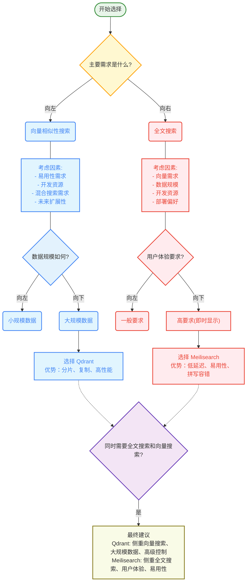

# **Qdrant 与 Meilisearch 全方位对比分析报告**

**1. 执行摘要**

Qdrant 和 Meilisearch 都是在向量数据库和搜索引擎领域中备受瞩目的平台。Qdrant 以其高性能、高可扩展性、先进的向量搜索能力以及细粒度的控制而著称。它专为处理大规模人工智能应用而构建，在向量数据的管理和相似性搜索方面表现出色。另一方面，Meilisearch 则以其易用性、速度、强大的全文搜索功能以及对开发者友好的体验而闻名。虽然 Meilisearch 最初专注于全文搜索，但它已经在2023年7月的1.3版本中正式发布了向量存储功能，并在后续版本中不断完善其向量搜索能力，以适应现代搜索应用的需求。

本报告旨在从各个维度对 Qdrant 和 Meilisearch 进行全面的对比分析，涵盖性能、功能特性、架构设计等多个方面。通过深入探讨它们的异同，本报告将为技术领导者和架构师在为组织选择合适的搜索和向量数据库解决方案时提供有力的决策依据。

在高性能的纯向量相似性搜索场景下，尤其是在需要大规模处理和精细控制的应用中，Qdrant 通常是更优的选择。而对于那些更侧重于易用性、速度以及需要平衡全文搜索和向量搜索能力的应用，Meilisearch 则可能更适合。最终的选择将取决于具体的使用场景和优先级。

**图 0：Qdrant 与 Meilisearch 产品定位与特点概览**

**2. 引言：向量数据库和搜索引擎的崛起**

随着人工智能技术的飞速发展，向量嵌入（Vector Embeddings）作为一种将非结构化数据（如文本、图像、音频等）转化为数值向量表示的技术，在现代人工智能应用中扮演着越来越重要的角色。这些向量能够捕捉数据的语义信息和关系，使得在语义层面进行搜索、构建推荐系统以及实现检索增强生成（RAG）等应用成为可能。为了高效地存储、管理和查询这些高维向量数据，专门的向量数据库和搜索引擎应运而生。

Qdrant 正是这样一款先进的向量数据库，它具备极高的每秒查询率（RPS）、极低的延迟、快速的索引能力以及对准确性的高度控制。其设计目标是为大规模人工智能应用提供高性能和可扩展性。与之相对，Meilisearch 则定位为一款闪电般快速的搜索引擎，其核心在于易用性和搜索结果的相关性，并且正在集成人工智能驱动的向量搜索能力。

本报告旨在对 Qdrant 和 Meilisearch 这两个平台进行细致的比较，涵盖它们的核心功能、架构设计、性能表现以及在不同应用场景下的适用性。通过多维度的对比分析，本报告将帮助读者更深入地理解这两个平台的优势与不足，从而做出更明智的技术选型决策。

**3. 详细功能特性对比**

**3.1 核心数据模型**

在数据存储方面，Qdrant 采用了一种基于"点"（Points）和"集合"（Collections）的核心数据模型。一个"点"是 Qdrant 中数据的基本单元，类似于关系数据库中的一行。每个点包含一个向量嵌入、一个唯一的 ID（可以是 UUID 或 64 位无符号整数）以及一个可选的 JSON 格式的"载荷"（Payload），用于存储与该向量相关的额外元数据。这种结构使得 Qdrant 非常适合存储和检索与向量相关的各种属性信息。

相比之下，Meilisearch 使用的是"文档"（Documents）和"索引"（Indexes）的概念来组织数据。每个存储在 Meilisearch 中的数据记录都被视为一个文档，而索引则是存储这些文档的容器。与 Qdrant 不同的是，Meilisearch 要求每个文档都必须包含一个唯一的"主键"（Primary Key），用于在索引中标识和区分不同的文档。这种以文档为中心的数据模型更贴近传统搜索引擎的使用习惯。

Qdrant 的数据模型更侧重于向量本身及其相关的元数据，这体现了其作为向量数据库的本质。而 Meilisearch 的文档模型则强调数据的完整性和唯一性，这与其作为全文搜索引擎的起源有关。开发者在选择时需要考虑其应用场景的数据特点和组织需求。

**3.2 索引技术**

Qdrant 主要采用分层可导航小世界图（Hierarchical Navigable Small World Graph，HNSW）作为其主要的稠密向量索引技术。HNSW 是一种基于图的索引算法，它通过构建多层导航结构来实现对高维向量的快速近似最近邻（Approximate Nearest Neighbor，ANN）搜索。除了 HNSW，Qdrant 还支持乘积量化（Product Quantization，PQ）编码索引，这是一种用于高效近似搜索的技术，可以在一定程度上牺牲搜索精度来换取更高的搜索效率和更低的内存占用。此外，Qdrant 还提供了载荷索引（Payload Indexing）功能，用于优化基于元数据的过滤操作。Qdrant 支持实时索引和更新数据，并且还具备 GPU 加速索引的能力，可以显著加快大规模数据集的索引构建过程。

Meilisearch 则主要依赖于倒排索引（Inverted Index）来实现其核心的全文搜索功能。倒排索引是一种将文档中的词语映射到包含这些词语的文档列表的数据结构，它使得 Meilisearch 能够快速地响应用户的搜索查询，并支持"搜索即时显示"（Search-as-you-type）的功能。虽然 Meilisearch 最初专注于全文搜索，但它也在积极开发实验性的向量搜索能力。在全文搜索方面，Meilisearch 采用了分词（Tokenization）技术，将文本分解成更小的单元进行索引和检索。Meilisearch 同样支持索引的实时更新。

Qdrant 从一开始就定位于向量数据库，因此在向量索引方面拥有更为成熟和先进的技术。而 Meilisearch 则在全文索引方面积累了丰富的经验，其倒排索引技术非常成熟。Meilisearch 目前正在引入向量搜索能力，这标志着其在搜索领域的技术拓展。

**3.3 搜索算法和能力**

Qdrant 在高维相似性搜索方面表现卓越，这得益于其定制优化的 HNSW 算法。Qdrant 支持近似搜索和精确搜索两种模式，能够满足不同应用场景对搜索精度和速度的要求。此外，Qdrant 还提供了高级的搜索功能，包括语义搜索、多模态搜索和混合搜索，能够处理不同类型的数据并理解其深层含义。Qdrant 还支持稀疏向量表示，这对于增强文本检索能力非常有益。值得一提的是，Qdrant 还提供了一个推荐 API，方便开发者构建个性化的推荐系统。

Meilisearch 则以其闪电般快速的全文搜索能力而闻名，它具备强大的拼写容错和相关性排序功能。Meilisearch 正在开发混合搜索能力，以结合全文搜索和向量搜索的优势。Meilisearch 还支持地理搜索、过滤、分面、排序和同义词等功能。这些都是构建现代搜索应用的关键特性。

Qdrant 在向量搜索领域拥有更全面的算法和功能，尤其是在处理高维数据和复杂相似性查询方面。Meilisearch 则在全文搜索方面更具优势，其丰富的功能集和对用户体验的关注使其成为构建传统搜索应用的理想选择。

**3.4 距离度量**

Qdrant 允许用户为每个集合指定不同的距离度量（如点积、余弦相似度、欧几里得距离、曼哈顿距离），这使得用户可以根据所使用的嵌入模型选择最合适的度量方式来计算向量之间的相似性。这种灵活性对于确保搜索结果的准确性至关重要。

虽然 Meilisearch 的文档中没有明确列出其向量搜索支持的距离度量，但根据向量搜索领域的通用实践，可以推测它很可能支持余弦相似度和点积等常用的距离度量。

Qdrant 在距离度量方面的明确性和灵活性体现了其对向量搜索的深入理解和专业性。开发者在使用 Qdrant 时可以更精确地控制相似性计算的方式，从而获得更符合预期的搜索结果。

**3.5 API 和客户端库**

Qdrant 提供了一个符合 OpenAPI v3 规范的 RESTful API，方便开发者在各种编程语言中使用。此外，Qdrant 还提供了官方的客户端库，支持 Python、TypeScript、Rust、Go、.NET 和 Java 等多种流行的编程语言，进一步简化了与 Qdrant 的集成过程。

Meilisearch 同样提供了一个 RESTful API，并且拥有广泛的 SDK 支持，包括 JavaScript、Python、PHP 等多种语言。这些 SDK 使得开发者能够轻松地在自己熟悉的编程环境中与 Meilisearch 进行交互。

两个平台都提供了易于使用的 API 和丰富的客户端库，这对于开发者来说都非常友好，能够降低集成和使用的门槛。

**3.6 过滤和分面**

Qdrant 提供了高级的过滤和分面功能，这些功能基于向量的载荷实现，支持各种数据类型（包括字符串、数值、地理位置、日期时间、布尔值、UUID）和复杂的查询条件。Qdrant 还支持嵌套字段的过滤以及对嵌套对象的过滤。其采用的可过滤向量索引技术能够在应用过滤器的同时保持搜索速度，并且载荷索引能够进一步优化过滤性能。此外，Qdrant 还支持使用滚动（Scrolling）的方式迭代地检索大量符合过滤条件的点。

Meilisearch 也提供了过滤和分面搜索功能，以增强用户的搜索体验，允许用户根据特定的属性来细化搜索结果。在 Meilisearch 中，分面是过滤器的一种特殊用法，通常用于在用户界面上提供筛选选项。要启用过滤功能，需要将相应的属性添加到 `filterableAttributes` 设置中。Meilisearch 支持按日期进行过滤和排序，并且还提供了地理搜索功能，用于基于地理位置进行过滤和排序。

Qdrant 在过滤功能方面提供了更强大和细致的支持，能够处理更多的数据类型和更复杂的过滤逻辑，这对于需要精确控制搜索结果的应用来说至关重要。Meilisearch 的过滤和分面功能则更侧重于基于属性的细化，这在电子商务等应用中非常常见。Qdrant 对带有过滤器的滚动支持对于处理需要检索大量过滤结果的大型数据集非常有用。

| **功能特性**   | **Qdrant**                               | **Meilisearch**           | **主要差异**                           |
| ---------- | ---------------------------------------- | ------------------------- | ---------------------------------- |
| 核心数据模型     | 点 (Point) 和集合 (Collection)               | 文档 (Document) 和索引 (Index) | Qdrant 更侧重向量，Meilisearch 更侧重文档     |
| 主要索引技术     | HNSW (稠密向量), PQ (近似), 载荷索引               | 倒排索引 (全文), 实验性向量索引        | Qdrant 专注于向量索引，Meilisearch 专注于全文索引 |
| 向量搜索能力     | 成熟且先进，支持多种算法和优化                          | 实验性，但发展迅速，侧重混合搜索          | Qdrant 在向量搜索领域更专业                  |
| 全文搜索能力     | 支持，但功能相对基础                               | 强大且成熟，具备丰富的功能集            | Meilisearch 在全文搜索领域更具优势            |
| 距离度量       | 允许为每个集合指定多种度量                            | 支持向量搜索相关的常用度量（具体未明确列出）    | Qdrant 在距离度量方面更明确和灵活               |
| API        | RESTful (OpenAPI v3)                     | RESTful                   | 相似，都提供 RESTful API                 |
| 客户端库       | Python, TypeScript, Rust, Go, .NET, Java | JavaScript, Python, PHP 等 | 两者都提供丰富的客户端库                       |
| 过滤         | 高级，支持多种数据类型和复杂条件                         | 支持基于属性的过滤和分面              | Qdrant 的过滤功能更强大和细致                 |
| 分面         | 支持，基于载荷实现                                | 支持，是过滤器的一种特殊用法            | 两者都支持分面功能                          |
| 实时更新       | 支持                                       | 支持                        | 两者都支持实时更新                          |
| 可扩展性机制     | 分片 (Sharding), 复制 (Replication)          | 主要通过云服务实现，未来可能支持分片        | Qdrant 在基础设施层面提供更多可扩展性控制           |
| 主要应用场景（推断） | 高性能向量相似性搜索，AI 应用                         | 快速全文搜索，用户面向的应用            | 侧重点不同                              |

**表 1：Qdrant 和 Meilisearch 功能特性对比**

**图 1：Qdrant 与 Meilisearch 核心功能对比雷达图**

**4. 架构概览**

**4.1 Qdrant 架构**

Qdrant 采用分布式架构设计，旨在处理大规模数据集并提供高效的搜索服务。其架构支持复制（Replication）和分片（Sharding），从而实现水平扩展、数据冗余和容错能力。Qdrant 通过在 AWS、GCP 和 Azure 上提供的托管云服务（Qdrant Cloud）实现了云原生可扩展性和高可用性。此外，Qdrant 还提供了混合云（Hybrid Cloud）和私有云（Private Cloud，完全本地部署）解决方案，以满足不同场景下的部署灵活性和数据保护需求。Qdrant 采用分层架构，将数据管理分解为称为"段"（Segments）的小单元，从而在搜索速度和索引时间之间取得平衡。其 Kubernetes 原生架构进一步增强了跨各种环境的部署灵活性。在混合云部署中，Qdrant 还分离了数据平面和控制平面，以提高安全性。

Qdrant 的架构从一开始就考虑了可扩展性和高可用性，通过深度集成的分片和复制等特性体现出来。Meilisearch 的初始重点似乎在于提供快速且相关的搜索体验，部署相对简单，而其可扩展性更多地依赖于其云服务。Qdrant 提供的混合云和私有云部署选项，能够满足那些对数据主权和安全性有严格要求的组织的需求，提供了更强的基础设施控制能力。

**4.2 Meilisearch 架构**

Meilisearch 的架构以 RESTful API 为中心，方便与其他应用进行集成。其设计理念侧重于简洁和易于部署，通常可以部署在单服务器上或用于较小规模的应用。Meilisearch 也支持云部署（Meilisearch Cloud），提供托管服务。其可扩展性主要通过云服务来实现，未来可能也会支持分片（尽管在提供的资料中不如 Qdrant 强调）。Meilisearch 使用 LMDB 作为其底层的键值存储，以实现高性能和并发处理。

Meilisearch 对 LMDB 的依赖表明其在存储层面非常注重性能，这有助于实现其快速的搜索能力。

**图 2：Qdrant 与 Meilisearch 架构对比图**

**5. 搜索功能对比**

**5.1 全文搜索能力**

Qdrant 支持对字符串类型的载荷进行全文搜索，并提供了分词参数的配置。用户可以根据载荷字段中是否存在特定的词语或短语进行过滤。Qdrant 允许配置分词器的类型、最小和最大词语长度以及是否进行小写转换等参数。

Meilisearch 的核心优势在于其先进的全文搜索引擎，它具备拼写容错、前缀搜索和全面的语言支持等特性。Meilisearch 采用了模块化的分词器（Charabia），并为不同的语言提供了特定的分词管道。它还提供了基于可定制排序规则的复杂相关性排序功能，并包含停用词、同义词和高亮显示等功能。

Meilisearch 在全文搜索方面拥有更成熟和功能更丰富的引擎，而 Qdrant 则是在后期才加入了全文搜索功能，相对来说功能较为基础。这使得 Meilisearch 更适合那些对传统关键词搜索有较高要求的应用。

**5.2 向量搜索能力**

Qdrant 从一开始就被设计为一个专用的相似性搜索引擎，在管理向量数据方面表现出高性能和高效率。它通过其优化的 HNSW 实现支持多种最近邻搜索算法。Qdrant 还提供了先进的压缩技术（标量量化、乘积量化、二值量化），以减少内存使用并提高高维向量的搜索性能。此外，Qdrant 还支持稀疏向量，这对于增强文本检索能力很有帮助。Qdrant 还提供了GPU加速索引构建的功能，可以显著提高大规模数据集的索引速度。

Meilisearch 在2023年7月的1.3版本中正式发布了向量存储功能，并在后续版本中不断完善其向量搜索能力。Meilisearch 将混合搜索作为其核心战略方向之一，通过统一的 API 将高效的全文搜索与向量搜索的语义深度相结合。它支持使用大型语言模型（LLM）生成的嵌入向量，并提供了二值量化功能，用于人工智能驱动的搜索，以提高性能并减少内存使用。

Qdrant 作为一个专业和成熟的向量数据库，与 Meilisearch 相比，它提供了更广泛的向量搜索技术和优化手段（如压缩、稀疏向量和多向量支持）。Meilisearch 的向量搜索虽然已经正式发布，但在功能丰富度和优化程度上可能仍有发展空间。

**5.3 混合搜索方法**

Qdrant 通过有效地结合向量索引和传统索引来支持混合搜索，使得过滤操作能够与向量搜索高效地协同工作。Qdrant 利用载荷索引来优化查询执行策略，并开发了可过滤的 HNSW 技术，在图遍历过程中实现原位过滤，克服了传统预过滤和后过滤方法的局限性。

Meilisearch 将混合搜索作为其关键特性之一，通过统一的 API 将高效的全文搜索与向量搜索的语义深度相结合。Meilisearch 允许用户平衡语义搜索和全文搜索结果的重要性（通过 `semanticRatio` 参数）。Meilisearch 的混合搜索旨在结合传统全文搜索的效率和语义搜索的深度理解能力，为用户提供更相关的搜索结果。

两个平台都认识到混合搜索的重要性，这表明将词汇搜索和语义搜索的优势相结合是提升搜索相关性和用户体验的趋势。

**图 3：全文搜索、向量搜索与混合搜索流程对比**

**6. 性能基准和分析**

**6.1 Qdrant 性能**

Qdrant 在处理大规模、高维数据集时能够实现低延迟和快速的索引速度。Qdrant 基于 Rust 语言构建，以实现卓越的速度和可靠性。其提供的基准测试表明，在各种场景下（包括上传和搜索、过滤搜索），Qdrant 都表现出优异的性能。此外，Qdrant 还通过压缩选项和将数据卸载到磁盘等方式来优化内存使用。Qdrant 还支持 GPU 加速索引构建，这对于处理大规模数据集特别有价值。

Qdrant 似乎非常注重原始性能指标（如 RPS 和延迟），尤其是在向量搜索场景下。

**6.2 Meilisearch 性能**

Meilisearch 被宣传为一款"闪电般快速"的搜索引擎，其搜索延迟低于 50 毫秒（适用于搜索即时显示功能）。Meilisearch 同样基于 Rust 语言构建，以保证性能和可扩展性。它专注于为用户提供快速响应的搜索体验，以实现最低的延迟。

Meilisearch 更强调从最终用户角度感知的速度和响应性，尤其是在全文搜索和搜索即时显示体验方面。

**6.3 对比分析**

Qdrant 似乎专注于向量搜索场景下的原始性能指标（RPS、延迟），并经常声称其性能优于竞争对手。Meilisearch 则更强调最终用户感知的速度和响应性，尤其是在全文搜索和搜索即时显示体验方面。提供的资料中关于 Qdrant 和 Meilisearch 在向量搜索方面的直接性能比较有限，并且有时结果相互矛盾，这表明结果可能很大程度上取决于具体的工作负载和数据集。

Qdrant 对基准测试的明确关注和更高的 RPS 声称表明，它针对高吞吐量的向量搜索工作负载进行了优化，在某些情况下可能会牺牲一定的单查询延迟。Meilisearch 对低于 50 毫秒延迟的强调突显了其在交互式搜索体验方面的适用性，在用户输入时需要即时反馈的应用中可能更胜一筹。相互冲突的基准测试信息表明，在所有场景下可能不存在绝对的性能赢家，最佳选择可能取决于应用的具体需求，例如吞吐量和延迟之间的平衡、向量的维度以及数据集的大小。

**图 6：Qdrant 与 Meilisearch 性能对比图**

**7. 过滤和分面能力**

**7.1 Qdrant 的过滤和分面**

Qdrant 提供了基于向量载荷的高级过滤功能，支持各种数据类型（字符串、数值、地理位置、日期时间、布尔值、UUID）和逻辑运算符（AND、OR、NOT）。它还支持嵌套键过滤和对嵌套对象的过滤。Qdrant 采用可过滤的向量索引技术，即使在应用过滤器的情况下也能保持搜索速度，并且载荷索引可以优化过滤性能。此外，Qdrant 支持使用滚动方式迭代检索符合过滤条件的大量数据点。

**7.2 Meilisearch 的过滤和分面**

Meilisearch 提供过滤和分面搜索功能，允许用户根据属性细化搜索结果。分面是过滤器的一种特殊用例，通常用于用户界面上的筛选选项。要启用过滤，需要将属性添加到 `filterableAttributes` 设置中。Meilisearch 支持按日期进行过滤和排序，并提供地理搜索功能，用于基于地理位置进行过滤和排序。

Qdrant 提供了更广泛和更细致的过滤功能，支持更多的数据类型和更复杂的过滤逻辑，这对于需要精确控制搜索结果的应用可能至关重要。Meilisearch 的过滤和分面方法似乎与它的全文搜索范式更紧密地结合在一起，侧重于基于属性的细化，这在电子商务和类似应用中很常见。Qdrant 对带有过滤器的滚动支持对于处理需要检索大量过滤结果的大型数据集非常有用。

**8. 应用场景分析**

**8.1 Qdrant 的应用场景**

Qdrant 非常适合高性能、大规模人工智能应用，包括语义搜索、推荐系统、RAG、数据分析、异常检测和 AI 代理。它适用于需要细致的相似性搜索和深入理解语义的应用，并且能够处理多模态数据，提供快速准确的搜索算法。Qdrant 也常用于处理大型数据集和高维向量的场景。

Qdrant 的主要重点是作为人工智能驱动应用的高性能向量数据库，这使其成为那些严重依赖语义相似性和向量嵌入的用例的有力竞争者。

**8.2 Meilisearch 的应用场景**

Meilisearch 非常适合增强应用程序和网站的搜索体验，尤其是在电子商务、媒体和企业搜索领域。它非常适合需要低延迟和高相关性的搜索即时显示体验。通过其向量搜索和混合搜索功能，Meilisearch 也越来越多地应用于人工智能驱动的应用。CarbonGraph、Bookshop.org、OCTO Technology、Qogita 和 HitPay 等公司都在使用 Meilisearch。

Meilisearch 擅长为用户面向的应用提供快速且相关的搜索体验，这得益于其强大的全文搜索功能，并且正在不断集成向量搜索以增强语义理解能力。其对搜索即时显示、拼写容错和易于集成的强调，使其成为需要快速且直观搜索界面的网站和应用的理想选择。

在语义搜索和推荐系统等领域，两个平台都有应用场景的重叠，这表明它们都在朝着满足人工智能驱动搜索领域类似需求的方向发展，但它们的基础优势和方法可能导致不同的性能特征和开发体验。

**图 4：Qdrant 与 Meilisearch 应用场景对比**

**9. 开发者体验和生态系统**

**9.1 Qdrant 开发者体验**

Qdrant 提供了易于使用的 API 和多种编程语言（Python、TypeScript、Rust、Go、.NET、Java）的 SDK。它提供了清晰的文档和快速入门指南，并与领先的嵌入和框架进行了集成。Qdrant 还提供完全托管的云服务（Qdrant Cloud），并提供免费套餐。

**9.2 Meilisearch 开发者体验**

Meilisearch 将开发者体验放在首位，提供了自解释的 API 和完善的 SDK（JavaScript、Python、PHP 等）。它为各种功能提供了全面的文档和指南，并为各种 JAMstack 生态系统解决方案提供了插件，并为流行的托管服务提供了一键部署功能。Meilisearch 拥有现代化的开发者仪表盘 UI，并提供免费的开源版本和托管云服务（Meilisearch Cloud）。

两个平台都非常重视提供良好的开发者体验，都提供了文档完善的 API 和客户端库，使得集成到各种应用中更加容易。Meilisearch 对 JAMstack 生态系统和一键部署的关注表明，它在简化 Web 开发项目的设置和集成方面可能更具优势。Qdrant 与更广泛的人工智能开发工具和框架（如 LangChain、Haystack、Airbyte）的集成，突显了其对人工智能/机器学习开发者社区的关注。

**图 7：Qdrant 与 Meilisearch 开发者生态系统对比**

**10. 可扩展性、可靠性和运维**

**10.1 Qdrant 的可扩展性和可靠性**

Qdrant 专为水平扩展而设计，支持分片和复制。它提供企业级的安全特性，包括访问管理、备份选项和灾难恢复。在其托管云服务中，Qdrant 提供零停机升级。它支持多租户，以实现有组织的高效检索和数据隔离，并使用预写日志（Write-Ahead Logging）来确保数据持久性。

Qdrant 在基础设施层面内置了更多用于处理可扩展性和可靠性的特性（开源版本中就支持分片和复制），这使得它可能更适合需要对大规模部署进行细粒度控制的场景。

**10.2 Meilisearch 的可扩展性和可靠性**

Meilisearch 的可扩展性主要通过其托管云服务（Meilisearch Cloud）来实现，该服务负责处理基础设施和扩展。它支持 API 密钥管理以确保安全。它还提供多租户和租户令牌来管理复杂的多用户应用。Meilisearch 提供通过快照和转储进行数据备份的选项。并且存在关于最大文档大小、查询词数量等的已知限制。

Meilisearch 利用其云服务来处理可扩展性和可靠性，为那些更喜欢托管服务的用户提供了一种更便捷的方式。Meilisearch 中记录的限制对于拥有非常大或复杂的数据集和查询的用户来说可能是重要的考虑因素。目前，Meilisearch 尚未提供类似 Qdrant 的分片功能，这可能会限制其在处理超大规模数据集时的可扩展性。

**图 8：Qdrant 与 Meilisearch 可扩展性和可靠性对比**

**11. 结论与建议**

总而言之，Qdrant 和 Meilisearch 都是强大且各有优势的平台。Qdrant 在高性能向量相似性搜索方面表现出色，尤其适用于需要处理大规模数据和进行复杂 AI 计算的应用。其先进的向量搜索功能、细粒度的控制以及灵活的部署选项使其成为构建复杂 AI 驱动应用的理想选择。

另一方面，Meilisearch 则以其速度、易用性和强大的全文搜索能力而闻名。它非常适合需要快速响应和高度相关的用户面向的应用，尤其是在 Web 开发领域。随着其向量搜索能力的不断发展，Meilisearch 也开始涉足 AI 驱动的应用，通过其混合搜索方法，为开发者提供了一个平衡传统搜索和语义搜索的解决方案。

**选择 Qdrant 的建议：**

- 主要需求是高性能、大规模的向量相似性搜索。
- 应用需要先进的向量搜索功能（如压缩、稀疏向量等）。
- 需要对基础设施和部署选项（混合云/私有云）进行细粒度的控制。
- 正在构建严重依赖向量嵌入的复杂 AI 驱动应用。

**选择 Meilisearch 的建议：**

- 主要需求是快速、相关且易于使用的搜索引擎，并具备强大的全文搜索能力。
- 正在开发需要低延迟搜索即时显示体验的用户面向的应用。
- 寻找一个对开发者友好的平台，能够无缝集成到 Web 开发技术栈中。
- 从中小规模数据集开始，并优先考虑易于设置和管理，可以考虑使用其云服务。
- 需要通过混合搜索来平衡传统全文搜索和向量搜索能力。
- 对 JAMstack 生态系统和一键部署有需求的项目。

最终，选择哪个平台将取决于用户及其组织的具体需求、优先级和技术专长。在做出决定之前，建议对实际的应用场景进行充分的评估和测试，并参考官方文档获取最新信息。

**图 5：Qdrant 与 Meilisearch 选择决策流程图**

